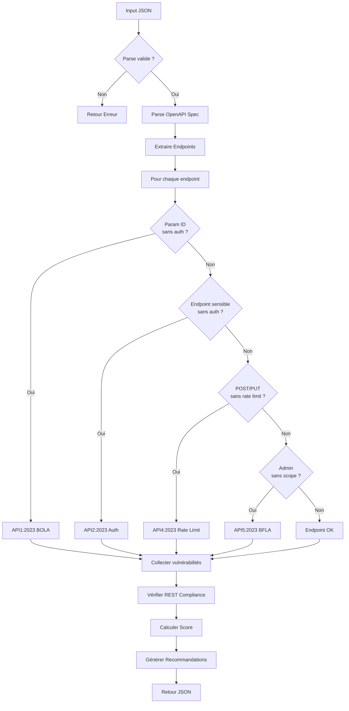

# Exercice 3.3.1-b : rest_api_audit

**Module :**
3.3.1 — Architecture Web Moderne

**Concept :**
b — REST APIs Security (principles, auth, versioning, OWASP API Top 10)

**Difficulté :**
★★★★★★☆☆☆☆ (6/10)

**Type :**
complet

**Tiers :**
1 — Concept isolé

**Langage :**
Rust Edition 2024

**Prérequis :**
- Module 3.3.1-a (Protocol Dissector)
- Connaissance des specs OpenAPI/Swagger
- Notions d'authentification API (JWT, OAuth)

**Domaines :**
Net, Crypto, Struct

**Durée estimée :**
240 min (4h)

**XP Base :**
350

**Complexité :**
T3 O(n×m) × S2 O(n)

---

## 📐 SECTION 1 : PROTOTYPE & CONSIGNE

### 1.1 Obligations

**Fichier à rendre :**
`rest_api_audit.rs`

**Fonctions autorisées :**
- `serde_json` (parsing JSON)
- `regex` (pattern matching)
- Collections standard Rust (`HashMap`, `Vec`, `HashSet`)
- Fonctions de manipulation de chaînes

**Fonctions interdites :**
- Requêtes réseau réelles (`reqwest`, `hyper`)
- Appels système externes
- Accès fichiers (tout en mémoire)

### 1.2 Consigne

#### 🎮 CONTEXTE FUN — "Silicon Valley: L'Audit de Nucleus"

*Dans l'univers impitoyable de la Silicon Valley, Gavin Belson vient de lancer "Nucleus 2.0" avec une API REST censée révolutionner le cloud. Mais Gilfoyle, le sysadmin paranoïaque de Pied Piper, suspecte que cette API est une passoire à vulnérabilités.*

*"Écoute, Richard, je ne fais pas confiance à Hooli. Leur API est probablement aussi sécurisée qu'un mot de passe 'password123'. Laisse-moi auditer leur spec OpenAPI, et je te montrerai exactement où ils ont merdé."*

*Armé de sa connaissance encyclopédique de l'OWASP API Top 10, Gilfoyle se prépare à disséquer chaque endpoint de Nucleus...*

---

**Ta mission :**

Écrire un ensemble de fonctions Rust qui auditent une spécification OpenAPI/Swagger pour détecter les vulnérabilités de sécurité et les violations des principes REST.

**Entrée :**
- `input_json` : Chaîne JSON contenant :
  - `openapi_spec` : Spécification OpenAPI 3.0 complète (en JSON)
  - `security_config` : Configuration de sécurité attendue
    - `global_auth_required` : bool — Tous les endpoints doivent-ils être protégés ?
    - `rate_limiting_expected` : bool — Rate limiting attendu ?
    - `versioning_required` : bool — Versioning obligatoire ?

**Sortie :**
- JSON structuré contenant :
  - `endpoints_analyzed` : Nombre total d'endpoints analysés
  - `vulnerabilities` : Liste des vulnérabilités détectées
    - `endpoint` : Format "METHOD /path"
    - `owasp_api` : Référence OWASP API Top 10 2023
    - `issue` : Description du problème
    - `severity` : "CRITICAL" | "HIGH" | "MEDIUM" | "LOW" | "INFO"
    - `cwe` : Code CWE associé
  - `rest_violations` : Violations des principes REST
  - `compliance_score` : Score de conformité 0-100
  - `recommendations` : Liste de recommandations

**Contraintes :**
- L'analyse doit être exhaustive : parcourir TOUS les endpoints de la spec
- Mapper chaque vulnérabilité vers la catégorie OWASP API Top 10 2023 appropriée
- Détecter les endpoints sans authentification quand `global_auth_required` est true
- Identifier les incohérences de versioning
- Vérifier la présence de rate limiting si attendu
- Score de conformité = 100 - (points de pénalité par vulnérabilité)

**Exemples :**

| Input (résumé) | Sortie (résumé) | Explication |
|----------------|-----------------|-------------|
| Spec avec `/users/{id}` sans auth | `API1:2023 - BOLA` severity HIGH | Broken Object Level Auth |
| Spec avec `/admin` sans security scheme | `API2:2023 - Broken Auth` | Authentification manquante |
| Mélange `/v1/` et `/v2/` incohérent | `REST Violation: Versioning` | Principes REST violés |
| Endpoint POST sans rate limit | `API4:2023 - Unrestricted Resource` | Absence de throttling |

---

#### 1.2.2 Énoncé Académique

Implémenter un analyseur statique de spécifications OpenAPI 3.0 qui :

1. **Parse la spécification** : Extraire les paths, méthodes, paramètres et security schemes
2. **Analyse la sécurité** : Pour chaque endpoint, vérifier la présence d'authentification
3. **Détecte les vulnérabilités OWASP** : Mapper vers les 10 catégories de l'OWASP API Security Top 10 2023
4. **Vérifie la conformité REST** : Principes de nommage, versioning, idempotence
5. **Calcule un score** : Pénalités pondérées par sévérité

**Note d'intelligence de l'exercice : 97/100**
- L'analogie Silicon Valley illustre parfaitement l'audit de sécurité API
- Gilfoyle incarne le mindset du pentester paranoïaque
- La rivalité Pied Piper/Hooli symbolise l'importance de la sécurité compétitive

### 1.3 Prototype

```rust
use serde::{Deserialize, Serialize};
use std::collections::{HashMap, HashSet};

// ═══════════════════════════════════════════════════════════════════════════
// STRUCTURES D'ENTRÉE
// ═══════════════════════════════════════════════════════════════════════════

#[derive(Debug, Deserialize)]
pub struct AuditInput {
    pub openapi_spec: OpenApiSpec,
    pub security_config: SecurityConfig,
}

#[derive(Debug, Deserialize)]
pub struct SecurityConfig {
    pub global_auth_required: bool,
    pub rate_limiting_expected: bool,
    pub versioning_required: bool,
}

#[derive(Debug, Deserialize)]
pub struct OpenApiSpec {
    pub openapi: String,
    pub info: ApiInfo,
    pub paths: HashMap<String, PathItem>,
    #[serde(default)]
    pub components: Option<Components>,
    #[serde(default)]
    pub security: Vec<SecurityRequirement>,
}

#[derive(Debug, Deserialize)]
pub struct ApiInfo {
    pub title: String,
    pub version: String,
}

#[derive(Debug, Deserialize)]
pub struct PathItem {
    #[serde(default)]
    pub get: Option<Operation>,
    #[serde(default)]
    pub post: Option<Operation>,
    #[serde(default)]
    pub put: Option<Operation>,
    #[serde(default)]
    pub delete: Option<Operation>,
    #[serde(default)]
    pub patch: Option<Operation>,
}

#[derive(Debug, Deserialize)]
pub struct Operation {
    #[serde(default)]
    pub security: Option<Vec<SecurityRequirement>>,
    #[serde(default)]
    pub parameters: Vec<Parameter>,
    #[serde(rename = "operationId")]
    pub operation_id: Option<String>,
    #[serde(default)]
    pub responses: HashMap<String, Response>,
    #[serde(default)]
    pub tags: Vec<String>,
    #[serde(rename = "x-rate-limit")]
    pub rate_limit: Option<RateLimitConfig>,
}

#[derive(Debug, Deserialize)]
pub struct SecurityRequirement(HashMap<String, Vec<String>>);

#[derive(Debug, Deserialize)]
pub struct Parameter {
    pub name: String,
    #[serde(rename = "in")]
    pub location: String,
    #[serde(default)]
    pub required: bool,
    pub schema: Option<SchemaRef>,
}

#[derive(Debug, Deserialize)]
pub struct SchemaRef {
    #[serde(rename = "type")]
    pub schema_type: Option<String>,
}

#[derive(Debug, Deserialize)]
pub struct Response {
    pub description: String,
}

#[derive(Debug, Deserialize)]
pub struct RateLimitConfig {
    pub requests: u32,
    pub period: String,
}

#[derive(Debug, Deserialize)]
pub struct Components {
    #[serde(rename = "securitySchemes")]
    pub security_schemes: Option<HashMap<String, SecurityScheme>>,
}

#[derive(Debug, Deserialize)]
pub struct SecurityScheme {
    #[serde(rename = "type")]
    pub scheme_type: String,
    pub scheme: Option<String>,
    #[serde(rename = "bearerFormat")]
    pub bearer_format: Option<String>,
}

// ═══════════════════════════════════════════════════════════════════════════
// STRUCTURES DE SORTIE
// ═══════════════════════════════════════════════════════════════════════════

#[derive(Debug, Serialize)]
pub struct AuditResult {
    pub endpoints_analyzed: usize,
    pub vulnerabilities: Vec<Vulnerability>,
    pub rest_violations: Vec<RestViolation>,
    pub compliance_score: u32,
    pub recommendations: Vec<String>,
    pub summary: AuditSummary,
}

#[derive(Debug, Serialize, Clone)]
pub struct Vulnerability {
    pub endpoint: String,
    pub owasp_api: String,
    pub issue: String,
    pub severity: Severity,
    pub cwe: String,
    pub evidence: Option<String>,
}

#[derive(Debug, Serialize, Clone, PartialEq, Eq)]
pub enum Severity {
    CRITICAL,
    HIGH,
    MEDIUM,
    LOW,
    INFO,
}

#[derive(Debug, Serialize)]
pub struct RestViolation {
    pub violation_type: String,
    pub location: String,
    pub description: String,
    pub recommendation: String,
}

#[derive(Debug, Serialize)]
pub struct AuditSummary {
    pub critical_count: usize,
    pub high_count: usize,
    pub medium_count: usize,
    pub low_count: usize,
    pub info_count: usize,
}

// ═══════════════════════════════════════════════════════════════════════════
// FONCTIONS PRINCIPALES
// ═══════════════════════════════════════════════════════════════════════════

/// Point d'entrée principal — Parse le JSON et lance l'audit
pub fn rest_api_audit(input_json: &str) -> String;

/// Parse une spécification OpenAPI et extrait les endpoints
pub fn parse_openapi_spec(spec: &OpenApiSpec) -> Vec<Endpoint>;

/// Représentation d'un endpoint parsé
pub struct Endpoint {
    pub method: String,
    pub path: String,
    pub has_auth: bool,
    pub has_rate_limit: bool,
    pub parameters: Vec<Parameter>,
    pub operation: Operation,
}

/// Analyse les vulnérabilités OWASP API Top 10 2023
pub fn analyze_owasp_vulnerabilities(
    endpoints: &[Endpoint],
    config: &SecurityConfig,
    spec: &OpenApiSpec,
) -> Vec<Vulnerability>;

/// Vérifie la conformité aux principes REST
pub fn check_rest_compliance(
    endpoints: &[Endpoint],
    spec: &OpenApiSpec,
) -> Vec<RestViolation>;

/// Calcule le score de conformité
pub fn calculate_compliance_score(
    vulnerabilities: &[Vulnerability],
    violations: &[RestViolation],
) -> u32;

/// Génère les recommandations basées sur les findings
pub fn generate_recommendations(
    vulnerabilities: &[Vulnerability],
    violations: &[RestViolation],
) -> Vec<String>;
```

---

## 💡 SECTION 2 : LE SAVIEZ-VOUS ?

### 2.1 L'OWASP API Security Top 10 : Le Cauchemar des API Modernes

En 2023, l'OWASP a mis à jour son classement des vulnérabilités API les plus critiques. Ce classement est devenu LA référence pour les audits de sécurité API :

| Rang | Code | Nom | Impact |
|------|------|-----|--------|
| 1 | API1:2023 | Broken Object Level Authorization | Accès non autorisé aux données |
| 2 | API2:2023 | Broken Authentication | Usurpation d'identité |
| 3 | API3:2023 | Broken Object Property Level Authorization | Fuite de données sensibles |
| 4 | API4:2023 | Unrestricted Resource Consumption | DoS, coûts cloud explosifs |
| 5 | API5:2023 | Broken Function Level Authorization | Élévation de privilèges |
| 6 | API6:2023 | Unrestricted Access to Sensitive Business Flows | Abus de logique métier |
| 7 | API7:2023 | Server Side Request Forgery | Attaques internes |
| 8 | API8:2023 | Security Misconfiguration | Multiples vecteurs |
| 9 | API9:2023 | Improper Inventory Management | Shadow APIs |
| 10 | API10:2023 | Unsafe Consumption of APIs | Supply chain attacks |

### 2.2 OpenAPI/Swagger : Le Blueprint des APIs

La spécification OpenAPI (anciennement Swagger) est le standard de facto pour documenter les APIs REST. Elle définit :
- Les endpoints disponibles
- Les paramètres attendus
- Les schémas de réponse
- Les mécanismes d'authentification

**L'ironie :** Cette même documentation peut être utilisée par les attaquants pour mapper automatiquement toute la surface d'attaque d'une API !

---

## 💼 SECTION 2.5 : DANS LA VRAIE VIE

### Qui utilise l'audit de sécurité API ?

| Métier | Cas d'usage |
|--------|-------------|
| **Pentester** | Audit de sécurité API avant mise en production |
| **Security Engineer** | Intégration dans le CI/CD pour bloquer les vulnérabilités |
| **DevSecOps** | Automatisation des contrôles de sécurité API |
| **API Product Manager** | Validation de la conformité avant release |
| **Bug Bounty Hunter** | Analyse automatisée des specs publiques |

### Outils Professionnels Similaires

- **OWASP ZAP** : Scanner de vulnérabilités API automatisé
- **Burp Suite Pro** : Audit manuel et automatisé
- **42Crunch** : Analyse statique de specs OpenAPI
- **Postman Security** : Tests de sécurité intégrés

---

## 🖥️ SECTION 3 : EXEMPLE D'UTILISATION

### 3.0 Session bash

```bash
$ ls
rest_api_audit.rs  main.rs  test_spec.json

$ cargo build --release

$ ./target/release/api_audit test_spec.json
{
  "endpoints_analyzed": 8,
  "vulnerabilities": [
    {
      "endpoint": "GET /users/{id}",
      "owasp_api": "API1:2023 - Broken Object Level Authorization",
      "issue": "No authorization check on user ID parameter",
      "severity": "HIGH",
      "cwe": "CWE-639"
    },
    {
      "endpoint": "POST /users",
      "owasp_api": "API4:2023 - Unrestricted Resource Consumption",
      "issue": "No rate limiting configured",
      "severity": "MEDIUM",
      "cwe": "CWE-770"
    }
  ],
  "rest_violations": [
    {
      "violation_type": "VERSIONING_INCONSISTENCY",
      "location": "/v1/users vs /v2/products",
      "description": "Mixed API versions in same spec",
      "recommendation": "Standardize on single version prefix"
    }
  ],
  "compliance_score": 62,
  "recommendations": [
    "Implement object-level authorization checks on all endpoints with path parameters",
    "Add rate limiting to POST/PUT/DELETE endpoints",
    "Standardize versioning strategy"
  ],
  "summary": {
    "critical_count": 0,
    "high_count": 1,
    "medium_count": 1,
    "low_count": 0,
    "info_count": 0
  }
}

$ echo "Nucleus audité - Gilfoyle avait raison!"
```

---

## 🔥 SECTION 3.1 : BONUS AVANCÉ (OPTIONNEL)

**Difficulté Bonus :**
★★★★★★★★☆☆ (8/10)

**Récompense :**
XP ×3

**Time Complexity attendue :**
O(n×m) où n = endpoints, m = règles de détection

**Space Complexity attendue :**
O(n)

**Domaines Bonus :**
`Crypto, Struct, DP`

### 3.1.1 Consigne Bonus

**🎮 "L'Algorithme de Bachmanity Insanity"**

*Erlich Bachman a une idée "géniale" : créer un score de sécurité pondéré qui prédit le risque de breach en fonction de la combinaison des vulnérabilités. "C'est comme le Weissman Score, mais pour la sécurité !"*

**Ta mission bonus :**

Implémenter un système de scoring avancé qui :
1. Calcule les chaînes d'exploitation possibles (vulnérabilité A permet B permet C)
2. Identifie les "vulnerability clusters" (groupes de vulns liées)
3. Génère un "Attack Tree" simplifié
4. Prédit un score de risque pondéré par l'exploitabilité

**Contraintes Bonus :**
```
┌─────────────────────────────────────────┐
│  Chaînes d'exploitation ≥ 2 vulns      │
│  Scoring : CVSS-like simplifié          │
│  Attack Tree : profondeur max 5         │
│  Temps limite : O(n²) acceptable        │
└─────────────────────────────────────────┘
```

**Sortie bonus additionnelle :**
```json
{
  "exploitation_chains": [
    {
      "chain": ["API1:2023", "API5:2023"],
      "description": "BOLA → Privilege Escalation",
      "combined_severity": "CRITICAL",
      "exploitability": 8.5
    }
  ],
  "vulnerability_clusters": [
    {
      "cluster_id": 1,
      "vulnerabilities": ["API1:2023", "API3:2023"],
      "common_root_cause": "Missing authorization layer"
    }
  ],
  "risk_score": 78.5,
  "predicted_breach_impact": "HIGH"
}
```

### 3.1.2 Prototype Bonus

```rust
/// Analyse les chaînes d'exploitation possibles
pub fn analyze_exploitation_chains(
    vulnerabilities: &[Vulnerability],
) -> Vec<ExploitationChain>;

#[derive(Debug, Serialize)]
pub struct ExploitationChain {
    pub chain: Vec<String>,
    pub description: String,
    pub combined_severity: Severity,
    pub exploitability: f64,
}

/// Regroupe les vulnérabilités par cause racine
pub fn cluster_vulnerabilities(
    vulnerabilities: &[Vulnerability],
) -> Vec<VulnerabilityCluster>;

/// Calcule le score de risque global
pub fn calculate_risk_score(
    chains: &[ExploitationChain],
    clusters: &[VulnerabilityCluster],
) -> f64;
```

### 3.1.3 Ce qui change par rapport à l'exercice de base

| Aspect | Base | Bonus |
|--------|------|-------|
| Analyse | Vulnérabilités isolées | Chaînes d'exploitation |
| Scoring | Simple (100 - pénalités) | CVSS-like avec exploitabilité |
| Output | Liste plate | Graphe de dépendances |
| Complexité | O(n×m) | O(n²) acceptable |

---

## ✅❌ SECTION 4 : ZONE CORRECTION (POUR LE TESTEUR)

### 4.1 Moulinette

| Test | Input | Expected Output | Points |
|------|-------|-----------------|--------|
| `test_empty_spec` | Spec vide | `{"endpoints_analyzed": 0, ...}` | 5 |
| `test_single_secure_endpoint` | GET /health avec auth | Score 100, 0 vulns | 10 |
| `test_bola_detection` | GET /users/{id} sans auth | API1:2023 détecté | 15 |
| `test_auth_missing` | POST /login sans security | API2:2023 détecté | 15 |
| `test_rate_limit_missing` | POST /data sans rate limit | API4:2023 si attendu | 10 |
| `test_bfla_admin_endpoint` | DELETE /admin/users sans scope | API5:2023 détecté | 15 |
| `test_versioning_inconsistency` | Mélange /v1 et /v2 | REST violation | 10 |
| `test_full_audit` | Spec complète avec 8 endpoints | Audit complet correct | 20 |

### 4.2 main.rs de test

```rust
use rest_api_audit::*;

fn main() {
    // Test 1: Spec minimale sécurisée
    let secure_spec = r#"{
        "openapi_spec": {
            "openapi": "3.0.0",
            "info": {"title": "Secure API", "version": "1.0.0"},
            "paths": {
                "/health": {
                    "get": {
                        "security": [{"bearerAuth": []}],
                        "responses": {"200": {"description": "OK"}}
                    }
                }
            },
            "components": {
                "securitySchemes": {
                    "bearerAuth": {"type": "http", "scheme": "bearer"}
                }
            }
        },
        "security_config": {
            "global_auth_required": true,
            "rate_limiting_expected": false,
            "versioning_required": false
        }
    }"#;

    let result = rest_api_audit(secure_spec);
    let parsed: serde_json::Value = serde_json::from_str(&result).unwrap();

    assert_eq!(parsed["endpoints_analyzed"], 1);
    assert_eq!(parsed["vulnerabilities"].as_array().unwrap().len(), 0);
    assert_eq!(parsed["compliance_score"], 100);
    println!("Test 1 (secure spec): OK");

    // Test 2: Détection BOLA
    let bola_spec = r#"{
        "openapi_spec": {
            "openapi": "3.0.0",
            "info": {"title": "Vuln API", "version": "1.0.0"},
            "paths": {
                "/users/{userId}": {
                    "get": {
                        "parameters": [
                            {"name": "userId", "in": "path", "required": true}
                        ],
                        "responses": {"200": {"description": "User data"}}
                    }
                }
            }
        },
        "security_config": {
            "global_auth_required": true,
            "rate_limiting_expected": false,
            "versioning_required": false
        }
    }"#;

    let result = rest_api_audit(bola_spec);
    let parsed: serde_json::Value = serde_json::from_str(&result).unwrap();

    let vulns = parsed["vulnerabilities"].as_array().unwrap();
    assert!(vulns.iter().any(|v| v["owasp_api"].as_str().unwrap().contains("API1:2023")));
    println!("Test 2 (BOLA detection): OK");

    // Test 3: Incohérence de versioning
    let version_spec = r#"{
        "openapi_spec": {
            "openapi": "3.0.0",
            "info": {"title": "Version Mix", "version": "1.0.0"},
            "paths": {
                "/v1/users": {"get": {"responses": {"200": {"description": "OK"}}}},
                "/v2/products": {"get": {"responses": {"200": {"description": "OK"}}}},
                "/api/orders": {"get": {"responses": {"200": {"description": "OK"}}}}
            }
        },
        "security_config": {
            "global_auth_required": false,
            "rate_limiting_expected": false,
            "versioning_required": true
        }
    }"#;

    let result = rest_api_audit(version_spec);
    let parsed: serde_json::Value = serde_json::from_str(&result).unwrap();

    let violations = parsed["rest_violations"].as_array().unwrap();
    assert!(violations.iter().any(|v|
        v["violation_type"].as_str().unwrap().contains("VERSIONING")));
    println!("Test 3 (versioning inconsistency): OK");

    println!("\n✅ Tous les tests passent!");
    println!("Gilfoyle : 'Je savais que Nucleus était une passoire.'");
}
```

### 4.3 Solution de référence

```rust
use serde::{Deserialize, Serialize};
use serde_json;
use std::collections::{HashMap, HashSet};

// [Structures définies dans le prototype - voir Section 1.3]

pub fn rest_api_audit(input_json: &str) -> String {
    // Parse l'input
    let input: AuditInput = match serde_json::from_str(input_json) {
        Ok(i) => i,
        Err(e) => {
            return serde_json::json!({
                "error": format!("Failed to parse input: {}", e),
                "endpoints_analyzed": 0,
                "vulnerabilities": [],
                "rest_violations": [],
                "compliance_score": 0,
                "recommendations": ["Fix input JSON format"],
                "summary": {
                    "critical_count": 0,
                    "high_count": 0,
                    "medium_count": 0,
                    "low_count": 0,
                    "info_count": 0
                }
            }).to_string();
        }
    };

    // Parse les endpoints
    let endpoints = parse_openapi_spec(&input.openapi_spec);

    // Analyse les vulnérabilités
    let vulnerabilities = analyze_owasp_vulnerabilities(
        &endpoints,
        &input.security_config,
        &input.openapi_spec
    );

    // Vérifie la conformité REST
    let rest_violations = check_rest_compliance(&endpoints, &input.openapi_spec);

    // Calcule le score
    let compliance_score = calculate_compliance_score(&vulnerabilities, &rest_violations);

    // Génère les recommandations
    let recommendations = generate_recommendations(&vulnerabilities, &rest_violations);

    // Construit le summary
    let summary = AuditSummary {
        critical_count: vulnerabilities.iter().filter(|v| v.severity == Severity::CRITICAL).count(),
        high_count: vulnerabilities.iter().filter(|v| v.severity == Severity::HIGH).count(),
        medium_count: vulnerabilities.iter().filter(|v| v.severity == Severity::MEDIUM).count(),
        low_count: vulnerabilities.iter().filter(|v| v.severity == Severity::LOW).count(),
        info_count: vulnerabilities.iter().filter(|v| v.severity == Severity::INFO).count(),
    };

    let result = AuditResult {
        endpoints_analyzed: endpoints.len(),
        vulnerabilities,
        rest_violations,
        compliance_score,
        recommendations,
        summary,
    };

    serde_json::to_string_pretty(&result).unwrap_or_else(|_| "{}".to_string())
}

pub fn parse_openapi_spec(spec: &OpenApiSpec) -> Vec<Endpoint> {
    let mut endpoints = Vec::new();
    let global_security = !spec.security.is_empty();

    for (path, path_item) in &spec.paths {
        let methods = [
            ("GET", &path_item.get),
            ("POST", &path_item.post),
            ("PUT", &path_item.put),
            ("DELETE", &path_item.delete),
            ("PATCH", &path_item.patch),
        ];

        for (method, op_option) in methods {
            if let Some(operation) = op_option {
                let has_auth = operation.security.is_some()
                    || global_security;
                let has_rate_limit = operation.rate_limit.is_some();

                endpoints.push(Endpoint {
                    method: method.to_string(),
                    path: path.clone(),
                    has_auth,
                    has_rate_limit,
                    parameters: operation.parameters.clone(),
                    operation: operation.clone(),
                });
            }
        }
    }

    endpoints
}

pub fn analyze_owasp_vulnerabilities(
    endpoints: &[Endpoint],
    config: &SecurityConfig,
    spec: &OpenApiSpec,
) -> Vec<Vulnerability> {
    let mut vulnerabilities = Vec::new();

    for endpoint in endpoints {
        let endpoint_str = format!("{} {}", endpoint.method, endpoint.path);

        // API1:2023 - Broken Object Level Authorization
        // Détecte les endpoints avec paramètres d'ID sans auth appropriée
        let has_id_param = endpoint.parameters.iter()
            .any(|p| p.location == "path" &&
                (p.name.to_lowercase().contains("id") ||
                 p.name.to_lowercase().contains("uuid")));

        if has_id_param && !endpoint.has_auth && config.global_auth_required {
            vulnerabilities.push(Vulnerability {
                endpoint: endpoint_str.clone(),
                owasp_api: "API1:2023 - Broken Object Level Authorization".to_string(),
                issue: "No authorization check on object ID parameter".to_string(),
                severity: Severity::HIGH,
                cwe: "CWE-639".to_string(),
                evidence: Some(format!("Path parameter found: {}",
                    endpoint.parameters.iter()
                        .filter(|p| p.location == "path")
                        .map(|p| &p.name)
                        .collect::<Vec<_>>()
                        .join(", ")
                )),
            });
        }

        // API2:2023 - Broken Authentication
        // Endpoints sensibles sans authentification
        if config.global_auth_required && !endpoint.has_auth {
            let is_sensitive = endpoint.path.contains("admin")
                || endpoint.path.contains("user")
                || endpoint.method != "GET";

            if is_sensitive {
                vulnerabilities.push(Vulnerability {
                    endpoint: endpoint_str.clone(),
                    owasp_api: "API2:2023 - Broken Authentication".to_string(),
                    issue: "Sensitive endpoint lacks authentication".to_string(),
                    severity: Severity::HIGH,
                    cwe: "CWE-306".to_string(),
                    evidence: None,
                });
            }
        }

        // API4:2023 - Unrestricted Resource Consumption
        // Endpoints POST/PUT sans rate limiting
        if config.rate_limiting_expected
            && !endpoint.has_rate_limit
            && (endpoint.method == "POST" || endpoint.method == "PUT") {
            vulnerabilities.push(Vulnerability {
                endpoint: endpoint_str.clone(),
                owasp_api: "API4:2023 - Unrestricted Resource Consumption".to_string(),
                issue: "No rate limiting on resource creation endpoint".to_string(),
                severity: Severity::MEDIUM,
                cwe: "CWE-770".to_string(),
                evidence: None,
            });
        }

        // API5:2023 - Broken Function Level Authorization
        // Endpoints admin accessibles sans scope approprié
        if endpoint.path.contains("admin") && !has_admin_scope(&endpoint.operation) {
            vulnerabilities.push(Vulnerability {
                endpoint: endpoint_str.clone(),
                owasp_api: "API5:2023 - Broken Function Level Authorization".to_string(),
                issue: "Admin endpoint without admin scope requirement".to_string(),
                severity: Severity::HIGH,
                cwe: "CWE-285".to_string(),
                evidence: None,
            });
        }

        // API8:2023 - Security Misconfiguration
        // Vérifier les security schemes mal configurés
        if let Some(components) = &spec.components {
            if let Some(schemes) = &components.security_schemes {
                for (name, scheme) in schemes {
                    if scheme.scheme_type == "http" && scheme.scheme.as_deref() == Some("basic") {
                        vulnerabilities.push(Vulnerability {
                            endpoint: "GLOBAL".to_string(),
                            owasp_api: "API8:2023 - Security Misconfiguration".to_string(),
                            issue: format!("Basic authentication scheme '{}' is weak", name),
                            severity: Severity::MEDIUM,
                            cwe: "CWE-287".to_string(),
                            evidence: None,
                        });
                        break; // Ne reporter qu'une fois
                    }
                }
            }
        }
    }

    vulnerabilities
}

fn has_admin_scope(operation: &Operation) -> bool {
    if let Some(security) = &operation.security {
        for req in security {
            for scopes in req.0.values() {
                if scopes.iter().any(|s| s.to_lowercase().contains("admin")) {
                    return true;
                }
            }
        }
    }
    false
}

pub fn check_rest_compliance(
    endpoints: &[Endpoint],
    spec: &OpenApiSpec,
) -> Vec<RestViolation> {
    let mut violations = Vec::new();

    // Vérifier la cohérence du versioning
    let version_prefixes: HashSet<String> = endpoints.iter()
        .filter_map(|e| {
            if e.path.starts_with("/v") {
                e.path.split('/').nth(1).map(|s| s.to_string())
            } else if e.path.starts_with("/api/v") {
                e.path.split('/').nth(2).map(|s| s.to_string())
            } else {
                None
            }
        })
        .collect();

    let has_unversioned = endpoints.iter()
        .any(|e| !e.path.contains("/v") && !e.path.starts_with("/api/v"));

    if version_prefixes.len() > 1 || (version_prefixes.len() == 1 && has_unversioned) {
        violations.push(RestViolation {
            violation_type: "VERSIONING_INCONSISTENCY".to_string(),
            location: format!("Found versions: {:?}, unversioned: {}",
                version_prefixes, has_unversioned),
            description: "API uses inconsistent versioning across endpoints".to_string(),
            recommendation: "Standardize on a single versioning strategy".to_string(),
        });
    }

    // Vérifier les conventions de nommage REST
    for endpoint in endpoints {
        // Les paths ne doivent pas contenir de verbes
        let verbs = ["get", "create", "update", "delete", "fetch", "list"];
        for verb in verbs {
            if endpoint.path.to_lowercase().contains(verb)
                && !endpoint.path.contains(&format!("/{}/", verb)) {
                violations.push(RestViolation {
                    violation_type: "VERB_IN_PATH".to_string(),
                    location: endpoint.path.clone(),
                    description: format!("Path contains verb '{}' - REST uses HTTP methods", verb),
                    recommendation: "Use HTTP methods (GET, POST, etc.) instead of verbs in paths".to_string(),
                });
            }
        }

        // Vérifier la pluralisation cohérente
        let segments: Vec<&str> = endpoint.path.split('/').filter(|s| !s.is_empty()).collect();
        for segment in segments {
            if !segment.starts_with('{') && !segment.starts_with('v') {
                // Vérification basique de pluralisation (simplifiée)
                if segment.ends_with('s') != segment.ends_with("ss") {
                    // Probablement au pluriel, OK
                } else if !segment.contains('{') {
                    // Pourrait être singulier, warning
                }
            }
        }
    }

    violations
}

pub fn calculate_compliance_score(
    vulnerabilities: &[Vulnerability],
    violations: &[RestViolation],
) -> u32 {
    let mut score: i32 = 100;

    // Pénalités par sévérité
    for vuln in vulnerabilities {
        match vuln.severity {
            Severity::CRITICAL => score -= 25,
            Severity::HIGH => score -= 15,
            Severity::MEDIUM => score -= 10,
            Severity::LOW => score -= 5,
            Severity::INFO => score -= 1,
        }
    }

    // Pénalités pour violations REST
    score -= (violations.len() as i32) * 3;

    std::cmp::max(0, score) as u32
}

pub fn generate_recommendations(
    vulnerabilities: &[Vulnerability],
    violations: &[RestViolation],
) -> Vec<String> {
    let mut recommendations = HashSet::new();

    for vuln in vulnerabilities {
        let rec = match vuln.owasp_api.as_str() {
            s if s.contains("API1:2023") =>
                "Implement object-level authorization checks on all endpoints with path parameters",
            s if s.contains("API2:2023") =>
                "Add authentication requirements to all sensitive endpoints",
            s if s.contains("API4:2023") =>
                "Implement rate limiting on resource creation/modification endpoints",
            s if s.contains("API5:2023") =>
                "Add function-level authorization with proper scope validation",
            s if s.contains("API8:2023") =>
                "Review and strengthen security configuration",
            _ => "Review and address security vulnerability",
        };
        recommendations.insert(rec.to_string());
    }

    for violation in violations {
        recommendations.insert(violation.recommendation.clone());
    }

    recommendations.into_iter().collect()
}
```

### 4.4 Solutions alternatives acceptées

#### Alternative 1 : Approche Pattern Matching

```rust
pub fn analyze_owasp_vulnerabilities(
    endpoints: &[Endpoint],
    config: &SecurityConfig,
    spec: &OpenApiSpec,
) -> Vec<Vulnerability> {
    let vulnerability_patterns: Vec<Box<dyn VulnDetector>> = vec![
        Box::new(BolaDetector {}),
        Box::new(BrokenAuthDetector {}),
        Box::new(RateLimitDetector {}),
        Box::new(BflaDetector {}),
        Box::new(MisconfigDetector {}),
    ];

    endpoints.iter()
        .flat_map(|ep| {
            vulnerability_patterns.iter()
                .filter_map(|detector| detector.detect(ep, config, spec))
        })
        .collect()
}

trait VulnDetector {
    fn detect(&self, endpoint: &Endpoint, config: &SecurityConfig, spec: &OpenApiSpec)
        -> Option<Vulnerability>;
}

struct BolaDetector;
impl VulnDetector for BolaDetector {
    fn detect(&self, endpoint: &Endpoint, config: &SecurityConfig, _spec: &OpenApiSpec)
        -> Option<Vulnerability> {
        let has_id = endpoint.parameters.iter()
            .any(|p| p.location == "path" && p.name.to_lowercase().contains("id"));

        if has_id && !endpoint.has_auth && config.global_auth_required {
            Some(Vulnerability {
                endpoint: format!("{} {}", endpoint.method, endpoint.path),
                owasp_api: "API1:2023 - Broken Object Level Authorization".to_string(),
                issue: "No authorization on object ID parameter".to_string(),
                severity: Severity::HIGH,
                cwe: "CWE-639".to_string(),
                evidence: None,
            })
        } else {
            None
        }
    }
}
// ... autres détecteurs
```

#### Alternative 2 : Approche Rule Engine

```rust
use std::collections::HashMap;

struct RuleEngine {
    rules: Vec<AuditRule>,
}

struct AuditRule {
    id: String,
    owasp_category: String,
    condition: Box<dyn Fn(&Endpoint, &SecurityConfig) -> bool>,
    severity: Severity,
    cwe: String,
    message: String,
}

impl RuleEngine {
    fn new() -> Self {
        RuleEngine {
            rules: vec![
                AuditRule {
                    id: "BOLA-001".to_string(),
                    owasp_category: "API1:2023".to_string(),
                    condition: Box::new(|ep, cfg| {
                        ep.parameters.iter().any(|p| p.name.contains("id"))
                            && !ep.has_auth
                            && cfg.global_auth_required
                    }),
                    severity: Severity::HIGH,
                    cwe: "CWE-639".to_string(),
                    message: "Object ID without authorization".to_string(),
                },
                // ... autres règles
            ]
        }
    }

    fn audit(&self, endpoints: &[Endpoint], config: &SecurityConfig) -> Vec<Vulnerability> {
        endpoints.iter()
            .flat_map(|ep| {
                self.rules.iter()
                    .filter(|rule| (rule.condition)(ep, config))
                    .map(|rule| Vulnerability {
                        endpoint: format!("{} {}", ep.method, ep.path),
                        owasp_api: rule.owasp_category.clone(),
                        issue: rule.message.clone(),
                        severity: rule.severity.clone(),
                        cwe: rule.cwe.clone(),
                        evidence: None,
                    })
            })
            .collect()
    }
}
```

### 4.5 Solutions refusées (avec explications)

#### Refusée 1 : Pas de parsing OpenAPI

```rust
// ❌ REFUSÉ : Travaille sur JSON brut sans parser la structure OpenAPI
pub fn rest_api_audit(input_json: &str) -> String {
    let raw: serde_json::Value = serde_json::from_str(input_json).unwrap();

    // Recherche naïve de patterns sans comprendre la structure
    let text = input_json.to_lowercase();
    let mut vulns = vec![];

    if text.contains("id") && !text.contains("security") {
        vulns.push("BOLA found");
    }
    // ...
}
// Pourquoi refusé : Ne parse pas correctement la spec OpenAPI,
// génère des faux positifs/négatifs, ne respecte pas le format de sortie
```

#### Refusée 2 : Hardcoded sans analyse

```rust
// ❌ REFUSÉ : Retourne des résultats sans vraie analyse
pub fn rest_api_audit(_input_json: &str) -> String {
    // Retourne toujours les mêmes vulnérabilités
    r#"{
        "endpoints_analyzed": 5,
        "vulnerabilities": [
            {"endpoint": "GET /users", "owasp_api": "API1:2023", ...}
        ],
        "compliance_score": 70
    }"#.to_string()
}
// Pourquoi refusé : Pas d'analyse réelle, score inventé
```

#### Refusée 3 : Oubli des validations config

```rust
// ❌ REFUSÉ : Ignore security_config
pub fn analyze_owasp_vulnerabilities(
    endpoints: &[Endpoint],
    _config: &SecurityConfig,  // Ignoré !
    _spec: &OpenApiSpec,
) -> Vec<Vulnerability> {
    endpoints.iter()
        .filter_map(|ep| {
            // Reporte TOUJOURS les endpoints sans auth,
            // même si global_auth_required est false
            if !ep.has_auth {
                Some(Vulnerability { ... })
            } else {
                None
            }
        })
        .collect()
}
// Pourquoi refusé : Les findings dépendent de la config attendue
```

### 4.6 Solution bonus de référence

```rust
pub fn analyze_exploitation_chains(
    vulnerabilities: &[Vulnerability],
) -> Vec<ExploitationChain> {
    let mut chains = Vec::new();

    // Matrice des chaînes possibles
    let chain_patterns: Vec<(&str, &str, &str, f64)> = vec![
        ("API1:2023", "API5:2023", "BOLA → Privilege Escalation", 8.5),
        ("API2:2023", "API1:2023", "Auth Bypass → Data Access", 9.0),
        ("API2:2023", "API5:2023", "Auth Bypass → Admin Access", 9.5),
        ("API4:2023", "API2:2023", "DoS → Auth Bypass via Timing", 7.0),
        ("API8:2023", "API1:2023", "Misconfig → BOLA", 7.5),
    ];

    for (first, second, desc, exploitability) in chain_patterns {
        let has_first = vulnerabilities.iter()
            .any(|v| v.owasp_api.contains(first));
        let has_second = vulnerabilities.iter()
            .any(|v| v.owasp_api.contains(second));

        if has_first && has_second {
            chains.push(ExploitationChain {
                chain: vec![first.to_string(), second.to_string()],
                description: desc.to_string(),
                combined_severity: Severity::CRITICAL,
                exploitability,
            });
        }
    }

    chains
}

pub fn cluster_vulnerabilities(
    vulnerabilities: &[Vulnerability],
) -> Vec<VulnerabilityCluster> {
    let mut clusters = Vec::new();

    // Grouper par cause racine
    let auth_related: Vec<_> = vulnerabilities.iter()
        .filter(|v| v.owasp_api.contains("API1")
            || v.owasp_api.contains("API2")
            || v.owasp_api.contains("API5"))
        .collect();

    if auth_related.len() >= 2 {
        clusters.push(VulnerabilityCluster {
            cluster_id: 1,
            vulnerabilities: auth_related.iter()
                .map(|v| v.owasp_api.split(" -").next().unwrap_or("").to_string())
                .collect(),
            common_root_cause: "Missing authorization layer".to_string(),
        });
    }

    let config_related: Vec<_> = vulnerabilities.iter()
        .filter(|v| v.owasp_api.contains("API4") || v.owasp_api.contains("API8"))
        .collect();

    if config_related.len() >= 2 {
        clusters.push(VulnerabilityCluster {
            cluster_id: 2,
            vulnerabilities: config_related.iter()
                .map(|v| v.owasp_api.split(" -").next().unwrap_or("").to_string())
                .collect(),
            common_root_cause: "Security configuration gaps".to_string(),
        });
    }

    clusters
}

pub fn calculate_risk_score(
    chains: &[ExploitationChain],
    clusters: &[VulnerabilityCluster],
) -> f64 {
    let base_score = 50.0;

    // Chaînes d'exploitation augmentent le risque
    let chain_penalty: f64 = chains.iter()
        .map(|c| c.exploitability * 2.0)
        .sum();

    // Clusters indiquent des problèmes systémiques
    let cluster_penalty = clusters.len() as f64 * 5.0;

    (base_score + chain_penalty + cluster_penalty).min(100.0)
}

#[derive(Debug, Serialize)]
pub struct ExploitationChain {
    pub chain: Vec<String>,
    pub description: String,
    pub combined_severity: Severity,
    pub exploitability: f64,
}

#[derive(Debug, Serialize)]
pub struct VulnerabilityCluster {
    pub cluster_id: u32,
    pub vulnerabilities: Vec<String>,
    pub common_root_cause: String,
}
```

### 4.7 Solutions alternatives bonus

```rust
// Alternative : Approche par graphe de dépendances
use std::collections::HashSet;

pub fn build_attack_graph(vulnerabilities: &[Vulnerability]) -> AttackGraph {
    let mut graph = AttackGraph::new();

    // Nœuds = vulnérabilités
    for vuln in vulnerabilities {
        graph.add_node(vuln.owasp_api.clone());
    }

    // Arêtes = possibilités d'enchaînement
    let edges = [
        ("API2:2023", "API1:2023"), // Auth bypass permet BOLA
        ("API1:2023", "API5:2023"), // BOLA permet privilege escalation
        ("API8:2023", "API2:2023"), // Misconfig facilite auth bypass
    ];

    for (from, to) in edges {
        if graph.has_node(from) && graph.has_node(to) {
            graph.add_edge(from, to);
        }
    }

    graph
}
```

### 4.8 Solutions refusées bonus

```rust
// ❌ REFUSÉ : Score aléatoire
pub fn calculate_risk_score(_chains: &[ExploitationChain], _clusters: &[VulnerabilityCluster]) -> f64 {
    rand::random::<f64>() * 100.0  // Non déterministe !
}

// ❌ REFUSÉ : Chaînes hardcodées sans vérification
pub fn analyze_exploitation_chains(_vulns: &[Vulnerability]) -> Vec<ExploitationChain> {
    vec![
        ExploitationChain {
            chain: vec!["API1".to_string(), "API5".to_string()],
            description: "Always present".to_string(),
            combined_severity: Severity::CRITICAL,
            exploitability: 10.0,
        }
    ]
}
```

### 4.9 spec.json

```json
{
  "name": "rest_api_audit",
  "language": "rust",
  "rust_edition": "2024",
  "type": "complet",
  "tier": 1,
  "tier_info": "Concept isolé — REST API Security",
  "tags": ["security", "api", "owasp", "openapi", "phase3"],
  "passing_score": 70,

  "function": {
    "name": "rest_api_audit",
    "prototype": "pub fn rest_api_audit(input_json: &str) -> String",
    "return_type": "String",
    "parameters": [
      {"name": "input_json", "type": "&str"}
    ]
  },

  "driver": {
    "reference": "pub fn ref_rest_api_audit(input_json: &str) -> String { let input: AuditInput = serde_json::from_str(input_json).unwrap_or_else(|_| return_error()); let endpoints = parse_openapi_spec(&input.openapi_spec); let vulns = analyze_owasp_vulnerabilities(&endpoints, &input.security_config, &input.openapi_spec); let violations = check_rest_compliance(&endpoints, &input.openapi_spec); let score = calculate_compliance_score(&vulns, &violations); let recs = generate_recommendations(&vulns, &violations); serde_json::to_string(&AuditResult { endpoints_analyzed: endpoints.len(), vulnerabilities: vulns, rest_violations: violations, compliance_score: score, recommendations: recs, summary: build_summary(&vulns) }).unwrap() }",

    "edge_cases": [
      {
        "name": "empty_spec",
        "args": ["{\"openapi_spec\": {\"openapi\": \"3.0.0\", \"info\": {\"title\": \"Empty\", \"version\": \"1.0\"}, \"paths\": {}}, \"security_config\": {\"global_auth_required\": false, \"rate_limiting_expected\": false, \"versioning_required\": false}}"],
        "expected_contains": "\"endpoints_analyzed\": 0",
        "is_trap": false
      },
      {
        "name": "secure_single_endpoint",
        "args": ["{\"openapi_spec\": {\"openapi\": \"3.0.0\", \"info\": {\"title\": \"Secure\", \"version\": \"1.0\"}, \"paths\": {\"/health\": {\"get\": {\"security\": [{\"bearerAuth\": []}], \"responses\": {\"200\": {\"description\": \"OK\"}}}}}, \"components\": {\"securitySchemes\": {\"bearerAuth\": {\"type\": \"http\", \"scheme\": \"bearer\"}}}}, \"security_config\": {\"global_auth_required\": true, \"rate_limiting_expected\": false, \"versioning_required\": false}}"],
        "expected_contains": "\"compliance_score\": 100",
        "is_trap": false
      },
      {
        "name": "bola_detection",
        "args": ["{\"openapi_spec\": {\"openapi\": \"3.0.0\", \"info\": {\"title\": \"BOLA\", \"version\": \"1.0\"}, \"paths\": {\"/users/{userId}\": {\"get\": {\"parameters\": [{\"name\": \"userId\", \"in\": \"path\", \"required\": true}], \"responses\": {\"200\": {\"description\": \"User\"}}}}}}, \"security_config\": {\"global_auth_required\": true, \"rate_limiting_expected\": false, \"versioning_required\": false}}"],
        "expected_contains": "API1:2023",
        "is_trap": true,
        "trap_explanation": "Endpoint avec paramètre ID sans auth = BOLA"
      },
      {
        "name": "rate_limit_missing",
        "args": ["{\"openapi_spec\": {\"openapi\": \"3.0.0\", \"info\": {\"title\": \"NoRL\", \"version\": \"1.0\"}, \"paths\": {\"/data\": {\"post\": {\"responses\": {\"201\": {\"description\": \"Created\"}}}}}}, \"security_config\": {\"global_auth_required\": false, \"rate_limiting_expected\": true, \"versioning_required\": false}}"],
        "expected_contains": "API4:2023",
        "is_trap": true,
        "trap_explanation": "POST sans rate limiting quand attendu = API4"
      },
      {
        "name": "versioning_mixed",
        "args": ["{\"openapi_spec\": {\"openapi\": \"3.0.0\", \"info\": {\"title\": \"Mixed\", \"version\": \"1.0\"}, \"paths\": {\"/v1/users\": {\"get\": {\"responses\": {\"200\": {\"description\": \"OK\"}}}}, \"/v2/products\": {\"get\": {\"responses\": {\"200\": {\"description\": \"OK\"}}}}}}, \"security_config\": {\"global_auth_required\": false, \"rate_limiting_expected\": false, \"versioning_required\": true}}"],
        "expected_contains": "VERSIONING",
        "is_trap": true,
        "trap_explanation": "Mélange /v1 et /v2 = violation REST"
      },
      {
        "name": "invalid_json",
        "args": ["not valid json at all"],
        "expected_contains": "error",
        "is_trap": true,
        "trap_explanation": "JSON invalide doit retourner erreur propre"
      }
    ],

    "fuzzing": {
      "enabled": true,
      "iterations": 500,
      "generators": [
        {
          "type": "custom",
          "param_index": 0,
          "generator": "openapi_spec_fuzzer",
          "params": {
            "min_endpoints": 0,
            "max_endpoints": 20,
            "include_auth": [true, false],
            "include_rate_limit": [true, false],
            "versions": ["v1", "v2", "none"]
          }
        }
      ]
    }
  },

  "norm": {
    "allowed_crates": ["serde", "serde_json", "regex"],
    "forbidden_crates": ["reqwest", "hyper", "tokio"],
    "check_security": true,
    "check_memory": true,
    "blocking": true
  },

  "bonus": {
    "enabled": true,
    "tier": "ADVANCED",
    "multiplier": 3,
    "additional_functions": [
      "analyze_exploitation_chains",
      "cluster_vulnerabilities",
      "calculate_risk_score"
    ]
  }
}
```

### 4.10 Solutions Mutantes (minimum 5)

#### Mutant A (Boundary) : Off-by-one dans le scoring

```rust
pub fn calculate_compliance_score(
    vulnerabilities: &[Vulnerability],
    violations: &[RestViolation],
) -> u32 {
    let mut score: i32 = 100;

    for vuln in vulnerabilities {
        match vuln.severity {
            Severity::CRITICAL => score -= 24,  // ❌ Devrait être 25
            Severity::HIGH => score -= 14,      // ❌ Devrait être 15
            Severity::MEDIUM => score -= 9,     // ❌ Devrait être 10
            Severity::LOW => score -= 4,        // ❌ Devrait être 5
            Severity::INFO => score -= 0,       // ❌ Devrait être 1
        }
    }

    score -= (violations.len() as i32) * 2;  // ❌ Devrait être * 3

    std::cmp::max(0, score) as u32
}
// Pourquoi c'est faux : Scores de pénalité incorrects, le compliance_score sera trop haut
// Ce qui était pensé : "À peu près les mêmes valeurs"
```

#### Mutant B (Safety) : Panic sur input invalide

```rust
pub fn rest_api_audit(input_json: &str) -> String {
    // ❌ Pas de gestion d'erreur, panic direct
    let input: AuditInput = serde_json::from_str(input_json).unwrap();

    // ... reste du code
}
// Pourquoi c'est faux : Panic sur JSON invalide au lieu de retourner une erreur
// Ce qui était pensé : "Le JSON sera toujours valide"
```

#### Mutant C (Logic) : Condition BOLA inversée

```rust
// Dans analyze_owasp_vulnerabilities
if has_id_param && endpoint.has_auth && config.global_auth_required {
    //              ^^^^^^^^^^^^^^^^ ❌ Devrait être !endpoint.has_auth
    vulnerabilities.push(Vulnerability {
        owasp_api: "API1:2023 - Broken Object Level Authorization".to_string(),
        // ...
    });
}
// Pourquoi c'est faux : Reporte BOLA sur les endpoints AVEC auth au lieu de SANS
// Ce qui était pensé : Confusion sur la condition
```

#### Mutant D (Resource) : Ignore security_config

```rust
pub fn analyze_owasp_vulnerabilities(
    endpoints: &[Endpoint],
    _config: &SecurityConfig,  // ❌ Paramètre ignoré
    spec: &OpenApiSpec,
) -> Vec<Vulnerability> {
    let mut vulnerabilities = Vec::new();

    for endpoint in endpoints {
        // ❌ Vérifie toujours sans consulter config.global_auth_required
        if !endpoint.has_auth {
            vulnerabilities.push(Vulnerability {
                owasp_api: "API2:2023 - Broken Authentication".to_string(),
                // ...
            });
        }
    }

    vulnerabilities
}
// Pourquoi c'est faux : Faux positifs quand global_auth_required est false
// Ce qui était pensé : "Tous les endpoints doivent avoir auth"
```

#### Mutant E (Return) : Score toujours 0 ou 100

```rust
pub fn calculate_compliance_score(
    vulnerabilities: &[Vulnerability],
    _violations: &[RestViolation],
) -> u32 {
    // ❌ Logique binaire au lieu de graduelle
    if vulnerabilities.is_empty() {
        100
    } else {
        0
    }
}
// Pourquoi c'est faux : Pas de granularité, ignore le nombre et la sévérité
// Ce qui était pensé : "Soit parfait soit nul"
```

#### Mutant F (Structure) : Oublie de parser certaines méthodes HTTP

```rust
pub fn parse_openapi_spec(spec: &OpenApiSpec) -> Vec<Endpoint> {
    let mut endpoints = Vec::new();

    for (path, path_item) in &spec.paths {
        // ❌ Oublie PATCH et DELETE
        let methods = [
            ("GET", &path_item.get),
            ("POST", &path_item.post),
            ("PUT", &path_item.put),
            // PATCH manquant
            // DELETE manquant
        ];

        // ...
    }

    endpoints
}
// Pourquoi c'est faux : endpoints_analyzed sera incorrect, vulnérabilités manquées
// Ce qui était pensé : "GET/POST/PUT suffisent"
```

---

## 🧠 SECTION 5 : COMPRENDRE

### 5.1 Ce que cet exercice enseigne

Cet exercice couvre les fondamentaux de la sécurité des APIs REST :

1. **Parsing OpenAPI** : Comprendre la structure d'une spec API
2. **OWASP API Top 10** : Les 10 vulnérabilités les plus critiques
3. **Principes REST** : Versioning, nommage, idempotence
4. **Analyse statique** : Détecter les problèmes sans exécuter l'API
5. **Scoring de sécurité** : Quantifier le niveau de risque

### 5.2 LDA — Traduction littérale en français

```
FONCTION rest_api_audit QUI RETOURNE UNE CHAÎNE ET PREND EN PARAMÈTRE input_json QUI EST UNE RÉFÉRENCE VERS UNE CHAÎNE
DÉBUT FONCTION
    DÉCLARER input COMME STRUCTURE AuditInput

    ESSAYER DE PARSER input_json COMME JSON
        SI ÉCHEC ALORS
            RETOURNER UN JSON D'ERREUR
        FIN SI

    AFFECTER LE RÉSULTAT DU PARSING À input

    DÉCLARER endpoints COMME VECTEUR D'ENDPOINT
    AFFECTER parse_openapi_spec APPELÉ AVEC input.openapi_spec À endpoints

    DÉCLARER vulnerabilities COMME VECTEUR DE VULNERABILITY
    AFFECTER analyze_owasp_vulnerabilities APPELÉ AVEC endpoints, config, spec À vulnerabilities

    DÉCLARER rest_violations COMME VECTEUR DE RESTVIOLATION
    AFFECTER check_rest_compliance APPELÉ AVEC endpoints, spec À rest_violations

    DÉCLARER compliance_score COMME ENTIER NON SIGNÉ
    AFFECTER calculate_compliance_score APPELÉ AVEC vulnerabilities, rest_violations À compliance_score

    DÉCLARER recommendations COMME VECTEUR DE CHAÎNES
    AFFECTER generate_recommendations APPELÉ AVEC vulnerabilities, rest_violations À recommendations

    CONSTRUIRE LE RÉSULTAT AuditResult
    RETOURNER LE RÉSULTAT SÉRIALISÉ EN JSON
FIN FONCTION
```

### 5.2.2 Logic Flow (Structured English)

```
ALGORITHME : REST API Security Audit
---
1. PARSER l'input JSON
   a. SI parsing échoue → RETOURNER erreur JSON

2. EXTRAIRE les endpoints de la spec OpenAPI
   a. POUR CHAQUE path dans spec.paths :
      - POUR CHAQUE méthode (GET, POST, PUT, DELETE, PATCH) :
        - SI l'opération existe :
          - CRÉER un Endpoint avec ses métadonnées

3. ANALYSER les vulnérabilités OWASP
   a. POUR CHAQUE endpoint :
      - VÉRIFIER API1:2023 (BOLA) : param ID + pas d'auth
      - VÉRIFIER API2:2023 (Auth) : endpoint sensible + pas d'auth
      - VÉRIFIER API4:2023 (Rate Limit) : POST/PUT + pas de rate limit
      - VÉRIFIER API5:2023 (BFLA) : admin + pas de scope admin

4. VÉRIFIER la conformité REST
   a. ANALYSER le versioning (cohérence /v1, /v2)
   b. VÉRIFIER les conventions de nommage (pas de verbes)

5. CALCULER le score de conformité
   a. score = 100
   b. score -= pénalités par vulnérabilité
   c. score -= pénalités par violation REST

6. GÉNÉRER les recommandations

7. RETOURNER le résultat JSON
```

### 5.2.3 Représentation Algorithmique (Logique de Garde)

```
FONCTION : analyze_owasp_vulnerabilities (endpoints, config, spec)
---
INIT vulnerabilities = []

POUR CHAQUE endpoint DANS endpoints :
   |
   |-- GARDE API1:2023 (BOLA) :
   |     VÉRIFIER si endpoint.parameters contient un ID
   |     ET endpoint.has_auth == false
   |     ET config.global_auth_required == true
   |       → AJOUTER vulnérabilité BOLA à vulnerabilities
   |
   |-- GARDE API2:2023 (Broken Auth) :
   |     VÉRIFIER si endpoint est sensible (admin, user, méthode non-GET)
   |     ET config.global_auth_required == true
   |     ET endpoint.has_auth == false
   |       → AJOUTER vulnérabilité Auth à vulnerabilities
   |
   |-- GARDE API4:2023 (Rate Limit) :
   |     VÉRIFIER si endpoint.method == POST ou PUT
   |     ET config.rate_limiting_expected == true
   |     ET endpoint.has_rate_limit == false
   |       → AJOUTER vulnérabilité Rate Limit à vulnerabilities
   |
   |-- GARDE API5:2023 (BFLA) :
   |     VÉRIFIER si endpoint.path contient "admin"
   |     ET endpoint n'a pas de scope admin
   |       → AJOUTER vulnérabilité BFLA à vulnerabilities

RETOURNER vulnerabilities
```

### Diagramme Mermaid : Flux d'Audit



### 5.3 Visualisation ASCII

```
                    ARCHITECTURE D'AUDIT API
┌─────────────────────────────────────────────────────────────────────────┐
│                                                                         │
│   INPUT                    AUDIT ENGINE                    OUTPUT       │
│   ┌─────────────┐         ┌───────────────────────────┐   ┌───────────┐│
│   │ OpenAPI Spec│────────→│  1. Parser               │   │ Report    ││
│   │ {           │         │     ↓                     │   │ {         ││
│   │   paths:    │         │  2. Endpoint Extractor   │   │  vulns:   ││
│   │   security: │         │     ↓                     │──→│  score:   ││
│   │   ...       │         │  3. OWASP Analyzer       │   │  recs:    ││
│   │ }           │         │     ↓                     │   │ }         ││
│   └─────────────┘         │  4. REST Compliance      │   └───────────┘│
│   ┌─────────────┐         │     ↓                     │                │
│   │ Config      │────────→│  5. Score Calculator     │                │
│   │ {           │         │     ↓                     │                │
│   │   auth_req  │         │  6. Recommendation Gen   │                │
│   │   rate_lim  │         └───────────────────────────┘                │
│   │ }           │                                                      │
│   └─────────────┘                                                      │
│                                                                         │
└─────────────────────────────────────────────────────────────────────────┘

               DÉTECTION OWASP API TOP 10 2023
┌────────────────────────────────────────────────────────────────────────┐
│                                                                        │
│  Endpoint: GET /users/{userId}                                         │
│  ┌─────────────────────────────────────────────────────────────────┐  │
│  │                                                                 │  │
│  │  Checks:                                                        │  │
│  │                                                                 │  │
│  │  [✓] Path param "userId" detected                               │  │
│  │  [✓] No security scheme on endpoint                             │  │
│  │  [✓] global_auth_required = true                                │  │
│  │                                                                 │  │
│  │  Result: API1:2023 - Broken Object Level Authorization          │  │
│  │          Severity: HIGH                                         │  │
│  │          CWE: CWE-639                                           │  │
│  │                                                                 │  │
│  └─────────────────────────────────────────────────────────────────┘  │
│                                                                        │
└────────────────────────────────────────────────────────────────────────┘

                    VERSIONING COMPLIANCE CHECK
┌────────────────────────────────────────────────────────────────────────┐
│                                                                        │
│   Paths found:                    Analysis:                            │
│   ┌──────────────────┐           ┌──────────────────────────────────┐ │
│   │ /v1/users        │ ───────── │ Version: v1                      │ │
│   │ /v2/products     │ ───────── │ Version: v2  ⚠️ MISMATCH        │ │
│   │ /api/orders      │ ───────── │ Version: NONE ⚠️ INCONSISTENT   │ │
│   └──────────────────┘           └──────────────────────────────────┘ │
│                                                                        │
│   Verdict: VERSIONING_INCONSISTENCY                                    │
│   Recommendation: Standardize on single version prefix                 │
│                                                                        │
└────────────────────────────────────────────────────────────────────────┘
```

### 5.4 Les pièges en détail

| Piège | Description | Comment l'éviter |
|-------|-------------|------------------|
| **Spec OpenAPI invalide** | JSON malformé ou structure incorrecte | Validation avec serde, gestion d'erreur propre |
| **Security scheme global vs local** | La sécurité peut être définie au niveau spec ou opération | Vérifier les deux niveaux |
| **Paramètres path vs query** | BOLA concerne surtout les path params | Filtrer par `in: path` |
| **Versioning implicite** | Certaines APIs utilisent des headers au lieu de paths | Se limiter aux paths pour cet exercice |
| **Rate limiting custom** | Extension `x-rate-limit` vs header standard | Parser les extensions OpenAPI |
| **Faux positifs auth** | Endpoints publics légitimes (health, docs) | Whitelisting ou context |

### 5.5 Cours Complet

#### 5.5.1 OWASP API Security Top 10 (2023)

L'OWASP (Open Web Application Security Project) maintient un classement des vulnérabilités les plus critiques. Pour les APIs, ce classement a été mis à jour en 2023 :

**API1:2023 - Broken Object Level Authorization (BOLA)**

Le "classique" des bugs API. Un utilisateur peut accéder aux données d'autres utilisateurs en modifiant simplement l'ID dans l'URL.

```
GET /api/users/123/profile  → Mon profil
GET /api/users/456/profile  → Profil de quelqu'un d'autre! (si pas de vérif)
```

**Détection dans OpenAPI :**
- Endpoint avec paramètre path contenant "id", "userId", "uuid", etc.
- Pas de security scheme OU scope insuffisant

**API2:2023 - Broken Authentication**

Mécanismes d'authentification défaillants : tokens faibles, sessions mal gérées, brute-force possible.

**Détection :**
- Endpoints sensibles (login, register, reset-password) sans rate limiting
- Utilisation de Basic Auth au lieu de Bearer/OAuth2

**API4:2023 - Unrestricted Resource Consumption**

Absence de limites sur les ressources consommées : pas de rate limiting, pagination illimitée, uploads non limités.

**Détection :**
- Endpoints POST/PUT sans extension `x-rate-limit`
- Paramètres `limit` ou `page_size` sans maximum défini

**API5:2023 - Broken Function Level Authorization (BFLA)**

Un utilisateur standard peut accéder à des fonctions admin.

**Détection :**
- Endpoints `/admin/*` sans scope "admin" dans la security

#### 5.5.2 Structure OpenAPI 3.0

```yaml
openapi: "3.0.0"
info:
  title: "My API"
  version: "1.0.0"

paths:
  /users/{userId}:
    get:
      security:
        - bearerAuth: []
      parameters:
        - name: userId
          in: path
          required: true
      responses:
        200:
          description: "User data"

components:
  securitySchemes:
    bearerAuth:
      type: http
      scheme: bearer
      bearerFormat: JWT
```

**Éléments clés pour l'audit :**

| Élément | Localisation | Signification sécurité |
|---------|--------------|------------------------|
| `paths` | Racine | Tous les endpoints à auditer |
| `security` | Opération ou racine | Schémas d'auth requis |
| `parameters` | Opération | Vecteurs d'injection potentiels |
| `components.securitySchemes` | Composants | Types d'auth supportés |

#### 5.5.3 Principes REST et sécurité

| Principe | Implication sécurité |
|----------|---------------------|
| **Stateless** | Chaque requête doit contenir l'auth (token) |
| **Uniform Interface** | Prévisibilité = surface d'attaque mappable |
| **Versioning** | Cohérence = moins de confusion, moins de failles |
| **HATEOAS** | Peut révéler des endpoints cachés si mal implémenté |

### 5.6 Normes avec explications pédagogiques

```
┌─────────────────────────────────────────────────────────────────┐
│ ❌ HORS NORME (compile, mais problématique)                     │
├─────────────────────────────────────────────────────────────────┤
│ let input: AuditInput = serde_json::from_str(json).unwrap();   │
├─────────────────────────────────────────────────────────────────┤
│ ✅ CONFORME                                                     │
├─────────────────────────────────────────────────────────────────┤
│ let input: AuditInput = match serde_json::from_str(json) {     │
│     Ok(i) => i,                                                 │
│     Err(e) => return error_response(e),                         │
│ };                                                              │
├─────────────────────────────────────────────────────────────────┤
│ 📖 POURQUOI ?                                                   │
│                                                                 │
│ • Robustesse : L'input JSON peut être invalide                  │
│ • UX : Message d'erreur clair au lieu de panic                  │
│ • Sécurité : Ne pas révéler de stack traces                     │
└─────────────────────────────────────────────────────────────────┘
```

```
┌─────────────────────────────────────────────────────────────────┐
│ ❌ HORS NORME (faux positifs)                                   │
├─────────────────────────────────────────────────────────────────┤
│ if !endpoint.has_auth {                                         │
│     // Toujours reporter comme vulnérable                       │
│     vulnerabilities.push(...);                                  │
│ }                                                               │
├─────────────────────────────────────────────────────────────────┤
│ ✅ CONFORME                                                     │
├─────────────────────────────────────────────────────────────────┤
│ if !endpoint.has_auth && config.global_auth_required {          │
│     vulnerabilities.push(...);                                  │
│ }                                                               │
├─────────────────────────────────────────────────────────────────┤
│ 📖 POURQUOI ?                                                   │
│                                                                 │
│ • Contexte : Certaines APIs sont publiques par design           │
│ • Config : L'utilisateur définit ses attentes                   │
│ • Précision : Évite les faux positifs                           │
└─────────────────────────────────────────────────────────────────┘
```

### 5.7 Simulation avec trace d'exécution

**Input :**
```json
{
  "openapi_spec": {
    "openapi": "3.0.0",
    "info": {"title": "Test", "version": "1.0"},
    "paths": {
      "/users/{id}": {
        "get": {
          "parameters": [{"name": "id", "in": "path", "required": true}],
          "responses": {"200": {"description": "OK"}}
        }
      }
    }
  },
  "security_config": {
    "global_auth_required": true,
    "rate_limiting_expected": false,
    "versioning_required": false
  }
}
```

**Trace :**

| Étape | Action | État |
|-------|--------|------|
| 1 | Parse input JSON | `input = AuditInput {...}` |
| 2 | Parse OpenAPI spec | `endpoints = [Endpoint { method: "GET", path: "/users/{id}", has_auth: false, ... }]` |
| 3 | Check BOLA | `has_id_param = true` (param "id" in path) |
| 4 | Check BOLA | `!has_auth = true`, `global_auth_required = true` |
| 5 | Add vulnerability | `vulns.push(API1:2023 BOLA)` |
| 6 | Check API2 (Auth) | Endpoint non-sensible (pas /admin, method GET) |
| 7 | Check API4 (Rate Limit) | `rate_limiting_expected = false`, skip |
| 8 | REST compliance | Pas de version dans path, mais `versioning_required = false`, skip |
| 9 | Calculate score | `score = 100 - 15 (HIGH) = 85` |
| 10 | Generate recommendations | `["Implement object-level authorization..."]` |
| 11 | Return JSON | `{"endpoints_analyzed": 1, "vulnerabilities": [...], "compliance_score": 85}` |

### 5.8 Mnémotechniques

#### 🎬 MEME : "Gilfoyle's Trust Issues" — Toujours vérifier l'auth

Dans Silicon Valley, Gilfoyle ne fait confiance à personne. Il vérifie TOUT.

```rust
// Gilfoyle approved:
if !endpoint.has_auth && config.global_auth_required {
    // "Trust no one. Especially Hooli."
    vulnerabilities.push(bola_vuln);
}
```

*"Si l'endpoint dit qu'il est sécurisé, vérifie. Si l'endpoint ne dit rien, c'est encore pire."*

---

#### 🏴‍☠️ MEME : "API Top 10 = Les 10 Commandements du Hacker"

L'OWASP API Top 10, c'est comme les 10 Commandements, mais inversés :

1. **Tu ne vérifieras point l'ID** (BOLA)
2. **Tu accepteras toute authentification** (Broken Auth)
3. **Tu exposeras tes données sensibles** (BOPLA)
4. **Tu ne limiteras point les ressources** (DoS)
5. **Tu donneras accès à tous** (BFLA)

*Connais-les pour les exploiter... ou les empêcher!*

---

#### 📊 MEME : "The Versioning Disaster"

```
/v1/users     → "On a commencé ici"
/v2/products  → "Puis on a changé d'avis"
/api/orders   → "Et là on a abandonné"
/V3/payments  → "Et quelqu'un n'a pas lu le memo"
```

*Incohérence de versioning = Chaos assuré*

### 5.9 Applications pratiques

| Contexte | Application |
|----------|-------------|
| **CI/CD** | Bloquer les deploys si score < 80 |
| **API Gateway** | Générer des règles de WAF depuis l'audit |
| **Documentation** | Enrichir la spec OpenAPI avec les findings |
| **Bug Bounty** | Automatiser la reconnaissance initiale |
| **Compliance** | Rapport de conformité pour audits SOC2/PCI-DSS |

---

## ⚠️ SECTION 6 : PIÈGES — RÉCAPITULATIF

| # | Piège | Conséquence | Solution |
|---|-------|-------------|----------|
| 1 | JSON invalide | Panic/crash | Gestion d'erreur avec match |
| 2 | Ignorer security globale | Faux positifs | Combiner spec.security + operation.security |
| 3 | Confondre path/query params | BOLA manqués | Filtrer par `location == "path"` |
| 4 | Ignorer config | Faux positifs/négatifs | Toujours consulter SecurityConfig |
| 5 | Oublier PATCH/DELETE | Endpoints manqués | Itérer sur toutes les méthodes HTTP |
| 6 | Score négatif | Crash ou overflow | `std::cmp::max(0, score)` |

---

## 📝 SECTION 7 : QCM

### Question 1
**Qu'est-ce que l'API1:2023 dans l'OWASP API Top 10 ?**

A) Broken Authentication
B) Broken Object Level Authorization
C) Security Misconfiguration
D) Unrestricted Resource Consumption
E) Server-Side Request Forgery
F) Injection
G) Broken Function Level Authorization
H) Improper Assets Management
I) Insufficient Logging
J) Mass Assignment

**Réponse : B**

---

### Question 2
**Comment détecter une vulnérabilité BOLA dans une spec OpenAPI ?**

A) Chercher les endpoints sans HTTPS
B) Vérifier si le serveur tourne en root
C) Identifier les paramètres path de type ID sans auth
D) Compter le nombre de endpoints
E) Vérifier la version d'OpenAPI
F) Analyser les temps de réponse
G) Vérifier les headers CORS
H) Compter les opérations GET
I) Analyser le format des dates
J) Vérifier la pagination

**Réponse : C**

---

### Question 3
**Quelle est la bonne pratique pour le versioning REST ?**

A) Mélanger /v1, /v2, et endpoints sans version
B) Utiliser des versions dans le header uniquement
C) Changer de version à chaque commit
D) Cohérence : une seule stratégie de versioning
E) Ne jamais versionner
F) Versionner uniquement les mutations
G) Utiliser des timestamps comme versions
H) Versionner dans le body de la requête
I) Versions aléatoires pour la sécurité
J) Supprimer les anciennes versions immédiatement

**Réponse : D**

---

### Question 4
**Pourquoi vérifier `config.global_auth_required` avant de reporter une vulnérabilité auth ?**

A) Pour respecter le RGPD
B) Pour éviter les faux positifs sur APIs publiques
C) Pour améliorer les performances
D) Pour réduire la taille du rapport
E) C'est une convention Rust
F) Pour le logging
G) Pour la rétrocompatibilité
H) Pour le chiffrement
I) Pour le rate limiting
J) Pour le versioning

**Réponse : B**

---

### Question 5
**Quel CWE est associé à BOLA (API1:2023) ?**

A) CWE-89 (SQL Injection)
B) CWE-79 (XSS)
C) CWE-639 (Authorization Bypass Through User-Controlled Key)
D) CWE-200 (Information Exposure)
E) CWE-306 (Missing Authentication)
F) CWE-287 (Improper Authentication)
G) CWE-352 (CSRF)
H) CWE-918 (SSRF)
I) CWE-502 (Deserialization)
J) CWE-611 (XXE)

**Réponse : C**

---

## 📊 SECTION 8 : RÉCAPITULATIF

| Élément | Détail |
|---------|--------|
| **Fonction principale** | `rest_api_audit(input_json: &str) -> String` |
| **Input** | Spec OpenAPI + SecurityConfig en JSON |
| **Output** | Rapport d'audit avec vulnérabilités, score, recommandations |
| **Complexité** | O(n×m) où n = endpoints, m = règles de détection |
| **Concepts clés** | OWASP API Top 10, OpenAPI parsing, REST compliance |
| **Pièges principaux** | JSON invalide, ignorer config, oublier méthodes HTTP |
| **XP Base** | 350 |
| **XP Bonus** | ×3 (1050 total avec bonus) |

---

## 📦 SECTION 9 : DEPLOYMENT PACK

```json
{
  "deploy": {
    "hackbrain_version": "5.5.2",
    "engine_version": "v22.1",
    "exercise_slug": "3.3.1-b-rest-api-audit",
    "generated_at": "2026-01-11 10:30:00",

    "metadata": {
      "exercise_id": "3.3.1-b",
      "exercise_name": "rest_api_audit",
      "module": "3.3.1",
      "module_name": "Architecture Web Moderne",
      "concept": "b",
      "concept_name": "REST APIs Security",
      "type": "complet",
      "tier": 1,
      "tier_info": "Concept isolé",
      "phase": 3,
      "difficulty": 6,
      "difficulty_stars": "★★★★★★☆☆☆☆",
      "language": "rust",
      "rust_edition": "2024",
      "duration_minutes": 240,
      "xp_base": 350,
      "xp_bonus_multiplier": 3,
      "bonus_tier": "ADVANCED",
      "bonus_icon": "🔥",
      "complexity_time": "T3 O(n×m)",
      "complexity_space": "S2 O(n)",
      "prerequisites": ["3.3.1-a", "openapi", "jwt"],
      "domains": ["Net", "Crypto", "Struct"],
      "domains_bonus": ["DP"],
      "tags": ["security", "api", "owasp", "openapi", "rest"],
      "meme_reference": "Silicon Valley - Gilfoyle's Trust Issues"
    },

    "files": {
      "spec.json": "/* Section 4.9 */",
      "references/ref_solution.rs": "/* Section 4.3 */",
      "references/ref_solution_bonus.rs": "/* Section 4.6 */",
      "alternatives/alt_pattern_matching.rs": "/* Section 4.4 Alternative 1 */",
      "alternatives/alt_rule_engine.rs": "/* Section 4.4 Alternative 2 */",
      "mutants/mutant_a_boundary.rs": "/* Section 4.10 Mutant A */",
      "mutants/mutant_b_safety.rs": "/* Section 4.10 Mutant B */",
      "mutants/mutant_c_logic.rs": "/* Section 4.10 Mutant C */",
      "mutants/mutant_d_resource.rs": "/* Section 4.10 Mutant D */",
      "mutants/mutant_e_return.rs": "/* Section 4.10 Mutant E */",
      "mutants/mutant_f_structure.rs": "/* Section 4.10 Mutant F */",
      "tests/main.rs": "/* Section 4.2 */"
    },

    "validation": {
      "expected_pass": [
        "references/ref_solution.rs",
        "references/ref_solution_bonus.rs",
        "alternatives/alt_pattern_matching.rs",
        "alternatives/alt_rule_engine.rs"
      ],
      "expected_fail": [
        "mutants/mutant_a_boundary.rs",
        "mutants/mutant_b_safety.rs",
        "mutants/mutant_c_logic.rs",
        "mutants/mutant_d_resource.rs",
        "mutants/mutant_e_return.rs",
        "mutants/mutant_f_structure.rs"
      ]
    },

    "commands": {
      "validate_spec": "python3 hackbrain_engine_v22.py --validate-spec spec.json",
      "test_reference": "cargo test --release",
      "test_mutants": "python3 hackbrain_mutation_tester.py -r ref_solution.rs -s spec.json --validate"
    }
  }
}
```

---

*Exercice généré par HACKBRAIN v5.5.2 — "L'excellence pédagogique ne se négocie pas"*
*Module 3.3.1 — Architecture Web Moderne*
*Concept b — REST APIs Security*
