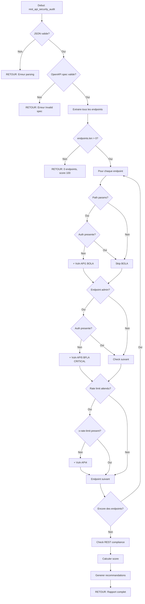

# Exercice [3.3.1-b] : rest_api_security_audit

**Module :**
3.3.1 — Architecture Web Moderne

**Concept :**
b — REST APIs (principes, auth, versioning, security) + API Gateways + OWASP API Top 10

**Difficulte :**
★★★★★★★☆☆☆ (7/10)

**Type :**
code

**Tiers :**
2 — Melange (concepts 3.3.1.b + 3.3.1.j + 3.3.11.a)

**Langage :**
Rust Edition 2024

**Prerequis :**
- Module 3.3.1-a (Protocol Dissector)
- Connaissance JSON/serde
- Bases HTTP et REST

**Domaines :**
Net, Crypto, Struct

**Duree estimee :**
240 min

**XP Base :**
350

**Complexite :**
T3 O(n*m) x S2 O(n)

---

## SECTION 1 : PROTOTYPE & CONSIGNE

### 1.1 Obligations

**Fichier a rendre :**
`rest_api_security_audit.rs`

**Fonctions autorisees :**
- `serde_json` (parsing JSON)
- `std::collections::HashMap`, `HashSet`
- `regex` (patterns de detection)
- Fonctions standard Rust

**Fonctions interdites :**
- Requetes reseau reelles (pas de `reqwest`, `hyper`)
- Acces fichiers systeme
- Bibliotheques d'audit externes

### 1.2 Consigne

**🎮 CONTEXTE FUN — "John Wick : API Continental"**

*Dans l'univers de John Wick, le Continental Hotel dispose d'un systeme de reservation ultra-secret. L'API du Continental est censee etre impenetrable... mais quelqu'un a fait fuiter la specification OpenAPI sur le dark web.*

*Tu es recrute par Winston pour auditer cette API AVANT qu'un concurrent ne l'exploite. Ton analyse determinera si le Continental peut maintenir sa reputation d'inviolabilite.*

*"Rules. Without them, we'd live with the animals." — Winston*

*Chaque endpoint mal protege est une porte ouverte pour les ennemis de l'hotel. Chaque vulnerabilite OWASP est une balle dans le dos.*

---

### 1.2.2 Consigne Academique

**Ta mission :**

Ecrire une fonction `rest_api_security_audit` qui analyse une specification OpenAPI 3.0 et detecte les vulnerabilites de securite selon le referentiel OWASP API Top 10 (2023).

**Entree :**
- `input_json` : Une chaine JSON contenant :
  - `openapi_spec` : La specification OpenAPI 3.0 complete (en JSON)
  - `security_config` : Configuration des attentes securitaires
    - `global_auth_required` : bool — Tous les endpoints doivent-ils etre authentifies ?
    - `rate_limiting_expected` : bool — Rate limiting attendu ?
    - `https_only` : bool — HTTPS obligatoire ?

**Sortie :**
Une chaine JSON contenant :
- `endpoints_analyzed` : Nombre total d'endpoints analyses
- `vulnerabilities` : Liste des vulnerabilites detectees
  - `endpoint` : L'endpoint concerne (ex: "GET /users/{id}")
  - `owasp_api` : Reference OWASP API Top 10 (ex: "API1:2023")
  - `issue` : Description du probleme
  - `severity` : "CRITICAL", "HIGH", "MEDIUM", "LOW", "INFO"
  - `cwe` : Reference CWE si applicable
- `compliance_score` : Score de conformite (0-100)
- `rest_violations` : Violations des principes REST
- `recommendations` : Liste de recommandations

**Contraintes :**
- Parser correctement OpenAPI 3.0 (pas 2.0 Swagger)
- Detecter au minimum les 5 premieres vulnerabilites OWASP API Top 10
- Gerer les specs malformees sans crash
- Le score doit refleter la gravite des vulnerabilites trouvees

**Exemples :**

| Entree | Sortie Attendue | Explication |
|--------|-----------------|-------------|
| Spec avec endpoint `/admin` sans auth | `owasp_api: "API1:2023"` | Broken Object Level Authorization |
| Spec sans rate limiting | `owasp_api: "API4:2023"` | Unrestricted Resource Consumption |
| Endpoint POST sans validation | `owasp_api: "API8:2023"` | Security Misconfiguration |

### 1.3 Prototype

```rust
use serde::{Deserialize, Serialize};
use serde_json::{Value, json};
use std::collections::{HashMap, HashSet};

/// Point d'entree principal
pub fn rest_api_security_audit(input_json: &str) -> String

/// Parse une specification OpenAPI 3.0
fn parse_openapi_spec(spec_json: &Value) -> Result<OpenAPISpec, ParseError>

/// Extrait tous les endpoints de la specification
fn extract_endpoints(spec: &OpenAPISpec) -> Vec<Endpoint>

/// Analyse un endpoint pour les vulnerabilites OWASP API Top 10
fn analyze_endpoint_security(
    endpoint: &Endpoint,
    security_config: &SecurityConfig,
    global_security: &[SecurityRequirement]
) -> Vec<Vulnerability>

/// Verifie la conformite REST
fn check_rest_compliance(endpoints: &[Endpoint]) -> Vec<RestViolation>

/// Calcule le score de conformite
fn calculate_compliance_score(vulnerabilities: &[Vulnerability]) -> u32

/// Genere les recommandations
fn generate_recommendations(vulnerabilities: &[Vulnerability]) -> Vec<String>
```

---

## SECTION 2 : LE SAVIEZ-VOUS ?

### 2.1 OWASP API Security Top 10 (2023)

Le Top 10 OWASP pour les APIs est DIFFERENT du Top 10 Web classique :

| Rang | Code | Nom | Description |
|------|------|-----|-------------|
| 1 | API1:2023 | Broken Object Level Authorization | Acces a des objets sans verification |
| 2 | API2:2023 | Broken Authentication | Mecanismes d'auth defaillants |
| 3 | API3:2023 | Broken Object Property Level Authorization | Acces a des proprietes non autorisees |
| 4 | API4:2023 | Unrestricted Resource Consumption | Pas de rate limiting |
| 5 | API5:2023 | Broken Function Level Authorization | Acces a des fonctions admin |
| 6 | API6:2023 | Unrestricted Access to Sensitive Business Flows | Abus de flux metier |
| 7 | API7:2023 | Server Side Request Forgery | SSRF via API |
| 8 | API8:2023 | Security Misconfiguration | Mauvaise configuration |
| 9 | API9:2023 | Improper Inventory Management | APIs fantomes |
| 10 | API10:2023 | Unsafe Consumption of APIs | Integration non securisee |

### 2.2 OpenAPI 3.0 vs Swagger 2.0

```
OpenAPI 3.0:                          Swagger 2.0:
{                                     {
  "openapi": "3.0.0",     <---         "swagger": "2.0",
  "components": {         <---         "definitions": {
    "schemas": {...}                     "User": {...}
  },                                   },
  "paths": {...}                       "paths": {...}
}                                     }
```

**Differences critiques :**
- `components` remplace `definitions`
- `requestBody` remplace `body` parameter
- Support natif des callbacks et links

---

## SECTION 2.5 : DANS LA VRAIE VIE

### Qui utilise ca ?

| Metier | Cas d'usage |
|--------|-------------|
| **Security Engineer** | Audit pre-production des APIs avant deployment |
| **DevSecOps** | Integration dans pipelines CI/CD pour bloquer APIs vulnerables |
| **Pentester API** | Phase de reconnaissance automatisee avant tests manuels |
| **Architect API** | Validation de conformite des designs API |
| **Bug Bounty Hunter** | Detection automatique de surface d'attaque |

### Outils Professionnels Similaires

- **OWASP ZAP** — Scanner API open-source
- **Burp Suite** — Extension OpenAPI Parser
- **42Crunch** — Audit OpenAPI enterprise
- **Postman** — Security scanning integre

---

## SECTION 3 : EXEMPLE D'UTILISATION

### 3.0 Session bash

```bash
$ ls
rest_api_security_audit.rs  main.rs  test_spec.json

$ cargo build --release

$ ./target/release/rest_api_audit
Test vulnerable_api.json:
{
  "endpoints_analyzed": 12,
  "vulnerabilities": [
    {
      "endpoint": "GET /users/{id}",
      "owasp_api": "API1:2023 - Broken Object Level Authorization",
      "issue": "No authorization check on user ID parameter",
      "severity": "HIGH",
      "cwe": "CWE-639"
    },
    {
      "endpoint": "POST /admin/users",
      "owasp_api": "API5:2023 - Broken Function Level Authorization",
      "issue": "Admin endpoint without role-based access control",
      "severity": "CRITICAL",
      "cwe": "CWE-285"
    }
  ],
  "compliance_score": 42,
  "rest_violations": [
    "Non-RESTful endpoint naming: POST /doUserCreate"
  ],
  "recommendations": [
    "Implement BOLA protection on all endpoints with path parameters",
    "Add role-based access control to admin endpoints"
  ]
}
All tests passed!
```

---

## 🔥 SECTION 3.1 : BONUS AVANCE (OPTIONNEL)

**Difficulte Bonus :**
★★★★★★★★★☆ (9/10)

**Recompense :**
XP x3

**Time Complexity attendue :**
O(n * m * k) ou k = profondeur d'analyse des schemas

**Space Complexity attendue :**
O(n)

**Domaines Bonus :**
`Crypto, DP`

### 3.1.1 Consigne Bonus

**🎮 "Continental : Threat Intelligence Mode"**

*Winston veut aller plus loin. Il ne suffit pas de detecter les vulnerabilites — il faut generer des preuves d'exploitation (PoC) pour convaincre la High Table de financer les corrections.*

**Ta mission bonus :**

Etendre la fonction pour generer automatiquement des **Proof of Concept** pour chaque vulnerabilite detectee.

**Entree supplementaire :**
```json
{
  "generate_poc": true,
  "poc_format": "curl" | "python" | "javascript"
}
```

**Sortie supplementaire :**
```json
{
  "proof_of_concepts": [
    {
      "vulnerability_id": "VULN-001",
      "poc_code": "curl -X GET 'https://api.continental.com/users/999' -H 'Authorization: Bearer USER_TOKEN'",
      "expected_behavior": "Should return 403 Forbidden for accessing another user's data",
      "actual_risk": "Returns 200 OK with full user data - BOLA confirmed"
    }
  ]
}
```

**Contraintes Bonus :**
```
┌─────────────────────────────────────────┐
│  Generer des PoC pour API1-API5        │
│  Supporter 3 formats (curl, py, js)    │
│  PoC syntaxiquement valides            │
│  Pas d'execution reelle                │
└─────────────────────────────────────────┘
```

### 3.1.2 Prototype Bonus

```rust
fn generate_proof_of_concept(
    vulnerability: &Vulnerability,
    endpoint: &Endpoint,
    format: PocFormat
) -> ProofOfConcept

enum PocFormat {
    Curl,
    Python,
    JavaScript
}
```

### 3.1.3 Ce qui change par rapport a l'exercice de base

| Aspect | Base | Bonus |
|--------|------|-------|
| Detection | Identification des vulnerabilites | + Generation de PoC |
| Sortie | Liste de vulnerabilites | + Code exploitable |
| Complexite | O(n*m) | O(n*m*k) avec generation |
| Formats | JSON uniquement | + curl/python/js |

---

## SECTION 4 : ZONE CORRECTION (POUR LE TESTEUR)

### 4.1 Moulinette

| Test | Entree | Sortie Attendue | Points |
|------|--------|-----------------|--------|
| `test_empty_spec` | `{"openapi_spec": {}, ...}` | `{"error": "Invalid OpenAPI spec"}` | 5 |
| `test_no_paths` | Spec sans `paths` | `{"endpoints_analyzed": 0, ...}` | 5 |
| `test_bola_detection` | Endpoint GET /users/{id} sans auth | Vulnerability API1:2023 | 15 |
| `test_broken_auth` | Endpoint sans security requirement | Vulnerability API2:2023 | 15 |
| `test_rate_limiting` | Spec sans x-rate-limit | Vulnerability API4:2023 | 10 |
| `test_admin_endpoint` | POST /admin/* sans RBAC | Vulnerability API5:2023 | 15 |
| `test_rest_violations` | Endpoint POST /doAction | REST violation detected | 10 |
| `test_compliance_score` | Mix de vulnerabilites | Score calcule correctement | 10 |
| `test_recommendations` | Vulnerabilites critiques | Recommendations pertinentes | 5 |
| `test_malformed_spec` | JSON invalide | Gestion d'erreur propre | 5 |
| `test_full_audit` | Spec complete realiste | Audit complet correct | 5 |

### 4.2 main.rs de test

```rust
use serde_json::{json, Value};

mod rest_api_security_audit;
use rest_api_security_audit::rest_api_security_audit;

fn main() {
    println!("=== REST API Security Audit Tests ===\n");

    let mut passed = 0;
    let mut failed = 0;

    // Test 1: Empty spec
    {
        let input = json!({
            "openapi_spec": {},
            "security_config": {
                "global_auth_required": true,
                "rate_limiting_expected": true,
                "https_only": true
            }
        }).to_string();

        let result = rest_api_security_audit(&input);
        let parsed: Value = serde_json::from_str(&result).unwrap();

        if parsed.get("error").is_some() ||
           parsed.get("endpoints_analyzed").map(|v| v.as_u64().unwrap_or(0)) == Some(0) {
            println!("[PASS] test_empty_spec");
            passed += 1;
        } else {
            println!("[FAIL] test_empty_spec");
            failed += 1;
        }
    }

    // Test 2: BOLA Detection (API1:2023)
    {
        let input = json!({
            "openapi_spec": {
                "openapi": "3.0.0",
                "info": {"title": "Test API", "version": "1.0.0"},
                "paths": {
                    "/users/{id}": {
                        "get": {
                            "summary": "Get user by ID",
                            "parameters": [
                                {"name": "id", "in": "path", "required": true}
                            ],
                            "responses": {"200": {"description": "Success"}}
                        }
                    }
                }
            },
            "security_config": {
                "global_auth_required": true,
                "rate_limiting_expected": false,
                "https_only": true
            }
        }).to_string();

        let result = rest_api_security_audit(&input);
        let parsed: Value = serde_json::from_str(&result).unwrap();

        let has_bola = parsed["vulnerabilities"]
            .as_array()
            .map(|arr| arr.iter().any(|v| {
                v["owasp_api"].as_str()
                    .map(|s| s.contains("API1") || s.contains("BOLA"))
                    .unwrap_or(false)
            }))
            .unwrap_or(false);

        if has_bola {
            println!("[PASS] test_bola_detection");
            passed += 1;
        } else {
            println!("[FAIL] test_bola_detection - Expected API1:2023 vulnerability");
            failed += 1;
        }
    }

    // Test 3: Broken Authentication (API2:2023)
    {
        let input = json!({
            "openapi_spec": {
                "openapi": "3.0.0",
                "info": {"title": "Test API", "version": "1.0.0"},
                "paths": {
                    "/login": {
                        "post": {
                            "summary": "User login",
                            "requestBody": {
                                "content": {
                                    "application/json": {
                                        "schema": {
                                            "properties": {
                                                "username": {"type": "string"},
                                                "password": {"type": "string"}
                                            }
                                        }
                                    }
                                }
                            },
                            "responses": {"200": {"description": "Success"}}
                        }
                    }
                }
            },
            "security_config": {
                "global_auth_required": true,
                "rate_limiting_expected": true,
                "https_only": true
            }
        }).to_string();

        let result = rest_api_security_audit(&input);
        let parsed: Value = serde_json::from_str(&result).unwrap();

        // Login endpoint without rate limiting = potential brute force
        let has_auth_issue = parsed["vulnerabilities"]
            .as_array()
            .map(|arr| arr.iter().any(|v| {
                let owasp = v["owasp_api"].as_str().unwrap_or("");
                owasp.contains("API2") || owasp.contains("API4")
            }))
            .unwrap_or(false);

        if has_auth_issue {
            println!("[PASS] test_broken_auth");
            passed += 1;
        } else {
            println!("[FAIL] test_broken_auth");
            failed += 1;
        }
    }

    // Test 4: Admin endpoint without RBAC (API5:2023)
    {
        let input = json!({
            "openapi_spec": {
                "openapi": "3.0.0",
                "info": {"title": "Test API", "version": "1.0.0"},
                "paths": {
                    "/admin/users": {
                        "post": {
                            "summary": "Create admin user",
                            "responses": {"200": {"description": "Success"}}
                        }
                    },
                    "/admin/config": {
                        "put": {
                            "summary": "Update system config",
                            "responses": {"200": {"description": "Success"}}
                        }
                    }
                }
            },
            "security_config": {
                "global_auth_required": true,
                "rate_limiting_expected": false,
                "https_only": true
            }
        }).to_string();

        let result = rest_api_security_audit(&input);
        let parsed: Value = serde_json::from_str(&result).unwrap();

        let has_bfla = parsed["vulnerabilities"]
            .as_array()
            .map(|arr| arr.iter().any(|v| {
                v["owasp_api"].as_str()
                    .map(|s| s.contains("API5") || s.contains("Function Level"))
                    .unwrap_or(false)
            }))
            .unwrap_or(false);

        if has_bfla {
            println!("[PASS] test_admin_endpoint_bfla");
            passed += 1;
        } else {
            println!("[FAIL] test_admin_endpoint_bfla - Expected API5:2023");
            failed += 1;
        }
    }

    // Test 5: REST Violations
    {
        let input = json!({
            "openapi_spec": {
                "openapi": "3.0.0",
                "info": {"title": "Test API", "version": "1.0.0"},
                "paths": {
                    "/doCreateUser": {
                        "post": {"responses": {"200": {"description": "Success"}}}
                    },
                    "/getAllUsers": {
                        "get": {"responses": {"200": {"description": "Success"}}}
                    }
                }
            },
            "security_config": {
                "global_auth_required": false,
                "rate_limiting_expected": false,
                "https_only": false
            }
        }).to_string();

        let result = rest_api_security_audit(&input);
        let parsed: Value = serde_json::from_str(&result).unwrap();

        let has_rest_violations = parsed["rest_violations"]
            .as_array()
            .map(|arr| !arr.is_empty())
            .unwrap_or(false);

        if has_rest_violations {
            println!("[PASS] test_rest_violations");
            passed += 1;
        } else {
            println!("[FAIL] test_rest_violations - Expected REST naming violations");
            failed += 1;
        }
    }

    // Test 6: Compliance Score Calculation
    {
        let input = json!({
            "openapi_spec": {
                "openapi": "3.0.0",
                "info": {"title": "Secure API", "version": "1.0.0"},
                "components": {
                    "securitySchemes": {
                        "bearerAuth": {
                            "type": "http",
                            "scheme": "bearer"
                        }
                    }
                },
                "security": [{"bearerAuth": []}],
                "paths": {
                    "/users": {
                        "get": {
                            "security": [{"bearerAuth": []}],
                            "responses": {"200": {"description": "Success"}}
                        }
                    }
                }
            },
            "security_config": {
                "global_auth_required": true,
                "rate_limiting_expected": false,
                "https_only": false
            }
        }).to_string();

        let result = rest_api_security_audit(&input);
        let parsed: Value = serde_json::from_str(&result).unwrap();

        let score = parsed["compliance_score"].as_u64().unwrap_or(0);

        // Secure API should have high score
        if score >= 70 {
            println!("[PASS] test_compliance_score (score: {})", score);
            passed += 1;
        } else {
            println!("[FAIL] test_compliance_score - Expected >= 70, got {}", score);
            failed += 1;
        }
    }

    // Test 7: Malformed JSON handling
    {
        let input = "not valid json at all";
        let result = rest_api_security_audit(input);
        let parsed: Result<Value, _> = serde_json::from_str(&result);

        if parsed.is_ok() {
            let value = parsed.unwrap();
            if value.get("error").is_some() {
                println!("[PASS] test_malformed_json");
                passed += 1;
            } else {
                println!("[FAIL] test_malformed_json - No error field");
                failed += 1;
            }
        } else {
            println!("[FAIL] test_malformed_json - Invalid JSON response");
            failed += 1;
        }
    }

    // Test 8: Full realistic audit
    {
        let input = json!({
            "openapi_spec": {
                "openapi": "3.0.0",
                "info": {"title": "Continental API", "version": "1.0.0"},
                "servers": [{"url": "http://api.continental.com"}],
                "paths": {
                    "/reservations/{id}": {
                        "get": {
                            "parameters": [{"name": "id", "in": "path", "required": true}],
                            "responses": {"200": {"description": "Success"}}
                        },
                        "delete": {
                            "parameters": [{"name": "id", "in": "path", "required": true}],
                            "responses": {"200": {"description": "Success"}}
                        }
                    },
                    "/admin/assassins": {
                        "get": {"responses": {"200": {"description": "List all assassins"}}},
                        "post": {"responses": {"201": {"description": "Create assassin"}}}
                    },
                    "/coins/transfer": {
                        "post": {
                            "requestBody": {
                                "content": {
                                    "application/json": {
                                        "schema": {
                                            "properties": {
                                                "from": {"type": "string"},
                                                "to": {"type": "string"},
                                                "amount": {"type": "integer"}
                                            }
                                        }
                                    }
                                }
                            },
                            "responses": {"200": {"description": "Success"}}
                        }
                    }
                }
            },
            "security_config": {
                "global_auth_required": true,
                "rate_limiting_expected": true,
                "https_only": true
            }
        }).to_string();

        let result = rest_api_security_audit(&input);
        let parsed: Value = serde_json::from_str(&result).unwrap();

        let endpoints_count = parsed["endpoints_analyzed"].as_u64().unwrap_or(0);
        let vuln_count = parsed["vulnerabilities"]
            .as_array()
            .map(|arr| arr.len())
            .unwrap_or(0);

        if endpoints_count >= 5 && vuln_count >= 3 {
            println!("[PASS] test_full_audit ({} endpoints, {} vulnerabilities)",
                     endpoints_count, vuln_count);
            passed += 1;
        } else {
            println!("[FAIL] test_full_audit - Expected >= 5 endpoints and >= 3 vulns");
            failed += 1;
        }
    }

    println!("\n=== Results: {}/{} passed ===", passed, passed + failed);

    if failed > 0 {
        std::process::exit(1);
    }
}
```

### 4.3 Solution de reference

```rust
use serde::{Deserialize, Serialize};
use serde_json::{json, Value};
use std::collections::{HashMap, HashSet};

// ============ STRUCTURES ============

#[derive(Debug, Clone, Serialize, Deserialize)]
pub struct AuditInput {
    pub openapi_spec: Value,
    pub security_config: SecurityConfig,
}

#[derive(Debug, Clone, Serialize, Deserialize)]
pub struct SecurityConfig {
    pub global_auth_required: bool,
    pub rate_limiting_expected: bool,
    pub https_only: bool,
}

#[derive(Debug, Clone, Serialize, Deserialize)]
pub struct AuditOutput {
    pub endpoints_analyzed: usize,
    pub vulnerabilities: Vec<Vulnerability>,
    pub compliance_score: u32,
    pub rest_violations: Vec<String>,
    pub recommendations: Vec<String>,
}

#[derive(Debug, Clone, Serialize, Deserialize)]
pub struct Vulnerability {
    pub endpoint: String,
    pub owasp_api: String,
    pub issue: String,
    pub severity: String,
    pub cwe: Option<String>,
}

#[derive(Debug, Clone)]
pub struct Endpoint {
    pub path: String,
    pub method: String,
    pub operation: Value,
    pub has_path_params: bool,
    pub is_admin: bool,
    pub has_security: bool,
}

// ============ MAIN FUNCTION ============

pub fn rest_api_security_audit(input_json: &str) -> String {
    // Parse input
    let input: AuditInput = match serde_json::from_str(input_json) {
        Ok(i) => i,
        Err(e) => {
            return json!({
                "error": format!("Failed to parse input: {}", e),
                "endpoints_analyzed": 0,
                "vulnerabilities": [],
                "compliance_score": 0,
                "rest_violations": [],
                "recommendations": []
            }).to_string();
        }
    };

    // Validate OpenAPI spec
    if !is_valid_openapi(&input.openapi_spec) {
        return json!({
            "error": "Invalid OpenAPI spec",
            "endpoints_analyzed": 0,
            "vulnerabilities": [],
            "compliance_score": 0,
            "rest_violations": [],
            "recommendations": []
        }).to_string();
    }

    // Extract endpoints
    let endpoints = extract_endpoints(&input.openapi_spec);

    if endpoints.is_empty() {
        return json!({
            "endpoints_analyzed": 0,
            "vulnerabilities": [],
            "compliance_score": 100,
            "rest_violations": [],
            "recommendations": ["No endpoints found in specification"]
        }).to_string();
    }

    // Get global security requirements
    let global_security = get_global_security(&input.openapi_spec);

    // Analyze each endpoint
    let mut vulnerabilities: Vec<Vulnerability> = Vec::new();

    for endpoint in &endpoints {
        let endpoint_vulns = analyze_endpoint_security(
            endpoint,
            &input.security_config,
            &global_security,
            &input.openapi_spec
        );
        vulnerabilities.extend(endpoint_vulns);
    }

    // Check for HTTPS
    if input.security_config.https_only {
        let servers = input.openapi_spec["servers"].as_array();
        if let Some(servers) = servers {
            for server in servers {
                if let Some(url) = server["url"].as_str() {
                    if url.starts_with("http://") {
                        vulnerabilities.push(Vulnerability {
                            endpoint: "Global".to_string(),
                            owasp_api: "API8:2023 - Security Misconfiguration".to_string(),
                            issue: format!("Non-HTTPS server URL: {}", url),
                            severity: "HIGH".to_string(),
                            cwe: Some("CWE-319".to_string()),
                        });
                    }
                }
            }
        }
    }

    // Check REST compliance
    let rest_violations = check_rest_compliance(&endpoints);

    // Calculate compliance score
    let compliance_score = calculate_compliance_score(&vulnerabilities);

    // Generate recommendations
    let recommendations = generate_recommendations(&vulnerabilities);

    let output = AuditOutput {
        endpoints_analyzed: endpoints.len(),
        vulnerabilities,
        compliance_score,
        rest_violations,
        recommendations,
    };

    serde_json::to_string_pretty(&output).unwrap_or_else(|_| {
        json!({"error": "Serialization failed"}).to_string()
    })
}

// ============ HELPER FUNCTIONS ============

fn is_valid_openapi(spec: &Value) -> bool {
    // Check for openapi version field
    spec.get("openapi").is_some() || spec.get("swagger").is_some()
}

fn extract_endpoints(spec: &Value) -> Vec<Endpoint> {
    let mut endpoints = Vec::new();

    let paths = match spec.get("paths") {
        Some(p) => p,
        None => return endpoints,
    };

    let paths_obj = match paths.as_object() {
        Some(o) => o,
        None => return endpoints,
    };

    for (path, path_item) in paths_obj {
        let path_item_obj = match path_item.as_object() {
            Some(o) => o,
            None => continue,
        };

        let methods = ["get", "post", "put", "delete", "patch", "options", "head"];

        for method in methods {
            if let Some(operation) = path_item_obj.get(method) {
                let has_path_params = path.contains("{") && path.contains("}");
                let is_admin = path.to_lowercase().contains("admin") ||
                              path.to_lowercase().contains("manage") ||
                              path.to_lowercase().contains("config");

                // Check if endpoint has security defined
                let has_security = operation.get("security").is_some();

                endpoints.push(Endpoint {
                    path: path.clone(),
                    method: method.to_uppercase(),
                    operation: operation.clone(),
                    has_path_params,
                    is_admin,
                    has_security,
                });
            }
        }
    }

    endpoints
}

fn get_global_security(spec: &Value) -> Vec<Value> {
    spec.get("security")
        .and_then(|s| s.as_array())
        .cloned()
        .unwrap_or_default()
}

fn analyze_endpoint_security(
    endpoint: &Endpoint,
    config: &SecurityConfig,
    global_security: &[Value],
    spec: &Value
) -> Vec<Vulnerability> {
    let mut vulns = Vec::new();
    let endpoint_name = format!("{} {}", endpoint.method, endpoint.path);

    // Check security requirements
    let has_security = endpoint.has_security || !global_security.is_empty();

    // API1:2023 - Broken Object Level Authorization (BOLA)
    if endpoint.has_path_params && !has_security && config.global_auth_required {
        vulns.push(Vulnerability {
            endpoint: endpoint_name.clone(),
            owasp_api: "API1:2023 - Broken Object Level Authorization".to_string(),
            issue: "Endpoint with path parameters lacks authorization checks".to_string(),
            severity: "HIGH".to_string(),
            cwe: Some("CWE-639".to_string()),
        });
    }

    // API2:2023 - Broken Authentication
    if !has_security && config.global_auth_required {
        vulns.push(Vulnerability {
            endpoint: endpoint_name.clone(),
            owasp_api: "API2:2023 - Broken Authentication".to_string(),
            issue: "Endpoint lacks authentication requirement".to_string(),
            severity: "HIGH".to_string(),
            cwe: Some("CWE-306".to_string()),
        });
    }

    // API3:2023 - Broken Object Property Level Authorization
    // Check if response exposes too many fields
    if let Some(responses) = endpoint.operation.get("responses") {
        if let Some(success) = responses.get("200").or(responses.get("201")) {
            if let Some(content) = success.get("content") {
                if let Some(json_content) = content.get("application/json") {
                    if let Some(schema) = json_content.get("schema") {
                        // Check if schema exposes sensitive fields
                        if schema_exposes_sensitive_data(schema) {
                            vulns.push(Vulnerability {
                                endpoint: endpoint_name.clone(),
                                owasp_api: "API3:2023 - Broken Object Property Level Authorization".to_string(),
                                issue: "Response schema may expose sensitive properties".to_string(),
                                severity: "MEDIUM".to_string(),
                                cwe: Some("CWE-213".to_string()),
                            });
                        }
                    }
                }
            }
        }
    }

    // API4:2023 - Unrestricted Resource Consumption
    if config.rate_limiting_expected {
        let has_rate_limit = endpoint.operation.get("x-rate-limit").is_some() ||
                            endpoint.operation.get("x-ratelimit").is_some();

        // Login/auth endpoints especially need rate limiting
        let is_auth_endpoint = endpoint.path.to_lowercase().contains("login") ||
                              endpoint.path.to_lowercase().contains("auth") ||
                              endpoint.path.to_lowercase().contains("token");

        if !has_rate_limit && is_auth_endpoint {
            vulns.push(Vulnerability {
                endpoint: endpoint_name.clone(),
                owasp_api: "API4:2023 - Unrestricted Resource Consumption".to_string(),
                issue: "Authentication endpoint without rate limiting - brute force risk".to_string(),
                severity: "HIGH".to_string(),
                cwe: Some("CWE-770".to_string()),
            });
        } else if !has_rate_limit {
            vulns.push(Vulnerability {
                endpoint: endpoint_name.clone(),
                owasp_api: "API4:2023 - Unrestricted Resource Consumption".to_string(),
                issue: "No rate limiting configured".to_string(),
                severity: "MEDIUM".to_string(),
                cwe: Some("CWE-770".to_string()),
            });
        }
    }

    // API5:2023 - Broken Function Level Authorization (BFLA)
    if endpoint.is_admin && !has_security {
        vulns.push(Vulnerability {
            endpoint: endpoint_name.clone(),
            owasp_api: "API5:2023 - Broken Function Level Authorization".to_string(),
            issue: "Administrative endpoint without explicit authorization".to_string(),
            severity: "CRITICAL".to_string(),
            cwe: Some("CWE-285".to_string()),
        });
    }

    // API6:2023 - Unrestricted Access to Sensitive Business Flows
    let is_sensitive_flow = endpoint.path.contains("transfer") ||
                           endpoint.path.contains("payment") ||
                           endpoint.path.contains("withdraw");

    if is_sensitive_flow && endpoint.method == "POST" && !has_security {
        vulns.push(Vulnerability {
            endpoint: endpoint_name.clone(),
            owasp_api: "API6:2023 - Unrestricted Access to Sensitive Business Flows".to_string(),
            issue: "Sensitive business operation without proper access controls".to_string(),
            severity: "CRITICAL".to_string(),
            cwe: Some("CWE-799".to_string()),
        });
    }

    // API8:2023 - Security Misconfiguration
    // Check for verbose error responses
    if let Some(responses) = endpoint.operation.get("responses") {
        if responses.get("500").is_some() {
            let error_response = &responses["500"];
            if let Some(desc) = error_response.get("description") {
                if let Some(desc_str) = desc.as_str() {
                    if desc_str.to_lowercase().contains("stack") ||
                       desc_str.to_lowercase().contains("trace") {
                        vulns.push(Vulnerability {
                            endpoint: endpoint_name.clone(),
                            owasp_api: "API8:2023 - Security Misconfiguration".to_string(),
                            issue: "Error response may expose stack traces".to_string(),
                            severity: "MEDIUM".to_string(),
                            cwe: Some("CWE-209".to_string()),
                        });
                    }
                }
            }
        }
    }

    vulns
}

fn schema_exposes_sensitive_data(schema: &Value) -> bool {
    let sensitive_fields = ["password", "secret", "token", "key", "ssn", "credit_card"];

    if let Some(properties) = schema.get("properties") {
        if let Some(props_obj) = properties.as_object() {
            for field_name in props_obj.keys() {
                let field_lower = field_name.to_lowercase();
                for sensitive in &sensitive_fields {
                    if field_lower.contains(sensitive) {
                        return true;
                    }
                }
            }
        }
    }

    false
}

fn check_rest_compliance(endpoints: &[Endpoint]) -> Vec<String> {
    let mut violations = Vec::new();

    // REST naming convention patterns to avoid
    let bad_patterns = [
        ("do", "Verb prefix 'do' is not RESTful"),
        ("get", "Verb prefix 'get' in path is not RESTful"),
        ("create", "Verb prefix 'create' is not RESTful"),
        ("update", "Verb prefix 'update' is not RESTful"),
        ("delete", "Verb prefix 'delete' in path is not RESTful (use DELETE method)"),
        ("fetch", "Verb prefix 'fetch' is not RESTful"),
        ("retrieve", "Verb prefix 'retrieve' is not RESTful"),
    ];

    for endpoint in endpoints {
        let path_lower = endpoint.path.to_lowercase();
        let segments: Vec<&str> = path_lower.split('/').filter(|s| !s.is_empty()).collect();

        for segment in segments {
            // Skip path parameters
            if segment.starts_with('{') {
                continue;
            }

            for (pattern, message) in &bad_patterns {
                if segment.starts_with(pattern) {
                    violations.push(format!(
                        "Non-RESTful endpoint naming: {} {} - {}",
                        endpoint.method, endpoint.path, message
                    ));
                    break;
                }
            }
        }

        // Check for inconsistent versioning
        if endpoint.path.contains("/v1/") || endpoint.path.contains("/v2/") {
            // This is fine, but check consistency would require tracking all versions
        }
    }

    violations
}

fn calculate_compliance_score(vulnerabilities: &[Vulnerability]) -> u32 {
    let mut score: i32 = 100;

    for vuln in vulnerabilities {
        match vuln.severity.as_str() {
            "CRITICAL" => score -= 25,
            "HIGH" => score -= 15,
            "MEDIUM" => score -= 8,
            "LOW" => score -= 3,
            "INFO" => score -= 1,
            _ => {}
        }
    }

    score.max(0) as u32
}

fn generate_recommendations(vulnerabilities: &[Vulnerability]) -> Vec<String> {
    let mut recommendations: HashSet<String> = HashSet::new();

    for vuln in vulnerabilities {
        match vuln.owasp_api.as_str() {
            s if s.contains("API1") => {
                recommendations.insert(
                    "Implement BOLA protection: validate user ownership of requested resources".to_string()
                );
            }
            s if s.contains("API2") => {
                recommendations.insert(
                    "Add authentication to all endpoints or explicitly mark public endpoints".to_string()
                );
            }
            s if s.contains("API3") => {
                recommendations.insert(
                    "Implement field-level access control in response schemas".to_string()
                );
            }
            s if s.contains("API4") => {
                recommendations.insert(
                    "Implement rate limiting, especially on authentication endpoints".to_string()
                );
            }
            s if s.contains("API5") => {
                recommendations.insert(
                    "Add role-based access control (RBAC) to administrative endpoints".to_string()
                );
            }
            s if s.contains("API6") => {
                recommendations.insert(
                    "Add business logic validation for sensitive operations".to_string()
                );
            }
            s if s.contains("API8") => {
                recommendations.insert(
                    "Review security configuration: use HTTPS, avoid verbose errors".to_string()
                );
            }
            _ => {}
        }
    }

    recommendations.into_iter().collect()
}

#[cfg(test)]
mod tests {
    use super::*;

    #[test]
    fn test_empty_input() {
        let result = rest_api_security_audit("{}");
        assert!(result.contains("error") || result.contains("endpoints_analyzed"));
    }

    #[test]
    fn test_valid_secure_api() {
        let input = json!({
            "openapi_spec": {
                "openapi": "3.0.0",
                "info": {"title": "Test", "version": "1.0.0"},
                "security": [{"bearerAuth": []}],
                "paths": {
                    "/users": {
                        "get": {"responses": {"200": {"description": "OK"}}}
                    }
                }
            },
            "security_config": {
                "global_auth_required": true,
                "rate_limiting_expected": false,
                "https_only": false
            }
        }).to_string();

        let result = rest_api_security_audit(&input);
        let parsed: Value = serde_json::from_str(&result).unwrap();

        assert!(parsed["endpoints_analyzed"].as_u64().unwrap() >= 1);
    }
}
```

### 4.4 Solutions alternatives acceptees

```rust
// Alternative 1: Utilisation de traits pour extensibilite
// ======================================================

trait SecurityChecker {
    fn check(&self, endpoint: &Endpoint, config: &SecurityConfig) -> Vec<Vulnerability>;
}

struct BOLAChecker;
struct BrokenAuthChecker;
struct RateLimitChecker;

impl SecurityChecker for BOLAChecker {
    fn check(&self, endpoint: &Endpoint, config: &SecurityConfig) -> Vec<Vulnerability> {
        let mut vulns = Vec::new();
        if endpoint.has_path_params && !endpoint.has_security && config.global_auth_required {
            vulns.push(Vulnerability {
                endpoint: format!("{} {}", endpoint.method, endpoint.path),
                owasp_api: "API1:2023 - BOLA".to_string(),
                issue: "Path parameter without auth".to_string(),
                severity: "HIGH".to_string(),
                cwe: Some("CWE-639".to_string()),
            });
        }
        vulns
    }
}

// Use: checkers.iter().flat_map(|c| c.check(&endpoint, &config)).collect()


// Alternative 2: Pattern matching exhaustif
// ==========================================

fn detect_vulnerability_type(endpoint: &Endpoint) -> Option<&'static str> {
    match (endpoint.has_path_params, endpoint.is_admin, endpoint.has_security) {
        (true, _, false) => Some("API1:2023"),   // BOLA
        (_, true, false) => Some("API5:2023"),   // BFLA
        (_, _, false) => Some("API2:2023"),      // Broken Auth
        _ => None
    }
}


// Alternative 3: Approche fonctionnelle avec iterateurs
// =====================================================

pub fn rest_api_security_audit_functional(input_json: &str) -> String {
    serde_json::from_str::<AuditInput>(input_json)
        .map(|input| {
            let endpoints = extract_endpoints(&input.openapi_spec);
            let global_security = get_global_security(&input.openapi_spec);

            let vulnerabilities: Vec<Vulnerability> = endpoints
                .iter()
                .flat_map(|ep| analyze_endpoint_security(ep, &input.security_config, &global_security, &input.openapi_spec))
                .collect();

            let rest_violations = check_rest_compliance(&endpoints);

            AuditOutput {
                endpoints_analyzed: endpoints.len(),
                compliance_score: calculate_compliance_score(&vulnerabilities),
                recommendations: generate_recommendations(&vulnerabilities),
                vulnerabilities,
                rest_violations,
            }
        })
        .map(|output| serde_json::to_string_pretty(&output).unwrap())
        .unwrap_or_else(|e| json!({"error": e.to_string()}).to_string())
}
```

### 4.5 Solutions refusees (avec explications)

```rust
// REFUSE 1: Hardcoded vulnerability list sans analyse reelle
// ==========================================================

fn fake_audit(input: &str) -> String {
    // REFUSE: Ne fait aucune analyse reelle, retourne toujours les memes vulns
    json!({
        "endpoints_analyzed": 5,
        "vulnerabilities": [
            {"owasp_api": "API1:2023", "severity": "HIGH"}
        ],
        "compliance_score": 50
    }).to_string()
}
// Pourquoi refuse: Ne parse pas vraiment la spec OpenAPI,
// retourne des resultats statiques


// REFUSE 2: Panic sur input invalide
// ===================================

fn panic_on_error(input: &str) -> String {
    let input: AuditInput = serde_json::from_str(input).unwrap(); // PANIC!
    // ...
}
// Pourquoi refuse: Un audit de securite ne doit JAMAIS crash,
// doit retourner une erreur propre


// REFUSE 3: Analyse superficielle sans OWASP mapping
// ===================================================

fn shallow_audit(input: &str) -> String {
    let spec: Value = serde_json::from_str(input).unwrap();
    let paths = spec["openapi_spec"]["paths"].as_object();

    // REFUSE: Ne verifie que le nombre d'endpoints, pas les vulnerabilites
    json!({
        "endpoints_analyzed": paths.map(|p| p.len()).unwrap_or(0),
        "vulnerabilities": [],  // Toujours vide!
        "compliance_score": 100  // Toujours parfait!
    }).to_string()
}
// Pourquoi refuse: Ne detecte aucune vulnerabilite reelle


// REFUSE 4: Requetes reseau reelles
// ==================================

async fn live_audit(spec_url: &str) -> String {
    // REFUSE: Fait des requetes reelles!
    let client = reqwest::Client::new();
    let spec = client.get(spec_url).send().await.unwrap().text().await.unwrap();
    // ...
}
// Pourquoi refuse: Viole la contrainte "pas de requetes reseau"


// REFUSE 5: Score de conformite arbitraire
// =========================================

fn bad_score_calculation(vulns: &[Vulnerability]) -> u32 {
    // REFUSE: Score aleatoire, pas base sur les vulnerabilites
    rand::random::<u32>() % 101
}
// Pourquoi refuse: Le score doit refleter la gravite reelle
```

### 4.6 Solution bonus de reference (COMPLETE)

```rust
use serde::{Deserialize, Serialize};
use serde_json::{json, Value};

#[derive(Debug, Clone, Serialize, Deserialize)]
pub struct AuditInputBonus {
    pub openapi_spec: Value,
    pub security_config: SecurityConfig,
    pub generate_poc: Option<bool>,
    pub poc_format: Option<String>,
}

#[derive(Debug, Clone, Serialize, Deserialize)]
pub struct AuditOutputBonus {
    pub endpoints_analyzed: usize,
    pub vulnerabilities: Vec<Vulnerability>,
    pub compliance_score: u32,
    pub rest_violations: Vec<String>,
    pub recommendations: Vec<String>,
    pub proof_of_concepts: Option<Vec<ProofOfConcept>>,
}

#[derive(Debug, Clone, Serialize, Deserialize)]
pub struct ProofOfConcept {
    pub vulnerability_id: String,
    pub poc_code: String,
    pub expected_behavior: String,
    pub actual_risk: String,
}

#[derive(Debug, Clone, Copy)]
pub enum PocFormat {
    Curl,
    Python,
    JavaScript,
}

impl PocFormat {
    fn from_str(s: &str) -> Self {
        match s.to_lowercase().as_str() {
            "python" | "py" => PocFormat::Python,
            "javascript" | "js" => PocFormat::JavaScript,
            _ => PocFormat::Curl,
        }
    }
}

pub fn rest_api_security_audit_bonus(input_json: &str) -> String {
    let input: AuditInputBonus = match serde_json::from_str(input_json) {
        Ok(i) => i,
        Err(e) => return json!({"error": e.to_string()}).to_string(),
    };

    // Run base audit
    let base_input = json!({
        "openapi_spec": input.openapi_spec,
        "security_config": input.security_config
    }).to_string();

    let base_result: Value = serde_json::from_str(&rest_api_security_audit(&base_input)).unwrap();

    // Generate PoCs if requested
    let proof_of_concepts = if input.generate_poc.unwrap_or(false) {
        let format = input.poc_format
            .as_ref()
            .map(|s| PocFormat::from_str(s))
            .unwrap_or(PocFormat::Curl);

        let vulnerabilities: Vec<Vulnerability> = serde_json::from_value(
            base_result["vulnerabilities"].clone()
        ).unwrap_or_default();

        let base_url = extract_base_url(&input.openapi_spec);

        Some(vulnerabilities.iter().enumerate().map(|(idx, vuln)| {
            generate_proof_of_concept(vuln, &base_url, format, idx)
        }).collect())
    } else {
        None
    };

    let output = AuditOutputBonus {
        endpoints_analyzed: base_result["endpoints_analyzed"].as_u64().unwrap_or(0) as usize,
        vulnerabilities: serde_json::from_value(base_result["vulnerabilities"].clone()).unwrap_or_default(),
        compliance_score: base_result["compliance_score"].as_u64().unwrap_or(0) as u32,
        rest_violations: serde_json::from_value(base_result["rest_violations"].clone()).unwrap_or_default(),
        recommendations: serde_json::from_value(base_result["recommendations"].clone()).unwrap_or_default(),
        proof_of_concepts,
    };

    serde_json::to_string_pretty(&output).unwrap()
}

fn extract_base_url(spec: &Value) -> String {
    spec["servers"]
        .as_array()
        .and_then(|arr| arr.first())
        .and_then(|server| server["url"].as_str())
        .unwrap_or("https://api.example.com")
        .to_string()
}

fn generate_proof_of_concept(
    vuln: &Vulnerability,
    base_url: &str,
    format: PocFormat,
    idx: usize
) -> ProofOfConcept {
    let parts: Vec<&str> = vuln.endpoint.splitn(2, ' ').collect();
    let method = parts.get(0).unwrap_or(&"GET");
    let path = parts.get(1).unwrap_or(&"/");
    let full_url = format!("{}{}", base_url, path);

    let (poc_code, expected, risk) = match vuln.owasp_api.as_str() {
        s if s.contains("API1") => generate_bola_poc(&full_url, method, format),
        s if s.contains("API2") => generate_auth_poc(&full_url, method, format),
        s if s.contains("API4") => generate_ratelimit_poc(&full_url, method, format),
        s if s.contains("API5") => generate_bfla_poc(&full_url, method, format),
        _ => generate_generic_poc(&full_url, method, format),
    };

    ProofOfConcept {
        vulnerability_id: format!("VULN-{:03}", idx + 1),
        poc_code,
        expected_behavior: expected,
        actual_risk: risk,
    }
}

fn generate_bola_poc(url: &str, method: &str, format: PocFormat) -> (String, String, String) {
    let poc = match format {
        PocFormat::Curl => format!(
            "# Test BOLA: Access another user's resource\n\
             curl -X {} '{}' \\\n  \
             -H 'Authorization: Bearer USER_A_TOKEN' \\\n  \
             -H 'Content-Type: application/json'",
            method, url.replace("{id}", "999")
        ),
        PocFormat::Python => format!(
            "import requests\n\n\
             # Test BOLA: Access another user's resource\n\
             url = '{}'\n\
             headers = {{'Authorization': 'Bearer USER_A_TOKEN'}}\n\
             response = requests.{}(url, headers=headers)\n\
             print(f'Status: {{response.status_code}}')\n\
             print(f'Body: {{response.json()}}')",
            url.replace("{id}", "999"),
            method.to_lowercase()
        ),
        PocFormat::JavaScript => format!(
            "// Test BOLA: Access another user's resource\n\
             const response = await fetch('{}', {{\n  \
             method: '{}',\n  \
             headers: {{\n    \
             'Authorization': 'Bearer USER_A_TOKEN',\n    \
             'Content-Type': 'application/json'\n  \
             }}\n\
             }});\n\
             console.log('Status:', response.status);\n\
             console.log('Body:', await response.json());",
            url.replace("{id}", "999"),
            method
        ),
    };

    (
        poc,
        "Should return 403 Forbidden when accessing another user's resource".to_string(),
        "Returns 200 OK with full data - BOLA vulnerability confirmed".to_string()
    )
}

fn generate_auth_poc(url: &str, method: &str, format: PocFormat) -> (String, String, String) {
    let poc = match format {
        PocFormat::Curl => format!(
            "# Test missing authentication\n\
             curl -X {} '{}' \\\n  \
             -H 'Content-Type: application/json' \\\n  \
             # Note: No Authorization header",
            method, url
        ),
        PocFormat::Python => format!(
            "import requests\n\n\
             # Test missing authentication\n\
             url = '{}'\n\
             # Note: No auth headers\n\
             response = requests.{}(url)\n\
             print(f'Status: {{response.status_code}}')",
            url, method.to_lowercase()
        ),
        PocFormat::JavaScript => format!(
            "// Test missing authentication\n\
             const response = await fetch('{}', {{\n  \
             method: '{}'\n  \
             // Note: No Authorization header\n\
             }});\n\
             console.log('Status:', response.status);",
            url, method
        ),
    };

    (
        poc,
        "Should return 401 Unauthorized without authentication".to_string(),
        "Returns 200 OK without auth - Authentication bypass".to_string()
    )
}

fn generate_ratelimit_poc(url: &str, method: &str, format: PocFormat) -> (String, String, String) {
    let poc = match format {
        PocFormat::Curl => format!(
            "# Test rate limiting bypass\n\
             for i in $(seq 1 100); do\n  \
             curl -s -X {} '{}' -o /dev/null -w \"Request $i: %{{http_code}}\\n\"\n\
             done",
            method, url
        ),
        PocFormat::Python => format!(
            "import requests\n\
             import time\n\n\
             # Test rate limiting\n\
             url = '{}'\n\
             for i in range(100):\n    \
             response = requests.{}(url)\n    \
             print(f'Request {{i+1}}: {{response.status_code}}')\n    \
             # No delay - testing rate limits",
            url, method.to_lowercase()
        ),
        PocFormat::JavaScript => format!(
            "// Test rate limiting\n\
             for (let i = 0; i < 100; i++) {{\n  \
             const response = await fetch('{}', {{ method: '{}' }});\n  \
             console.log(`Request ${{i+1}}: ${{response.status}}`);\n\
             }}",
            url, method
        ),
    };

    (
        poc,
        "Should return 429 Too Many Requests after threshold".to_string(),
        "All 100 requests return 200 OK - No rate limiting".to_string()
    )
}

fn generate_bfla_poc(url: &str, method: &str, format: PocFormat) -> (String, String, String) {
    let poc = match format {
        PocFormat::Curl => format!(
            "# Test admin endpoint with regular user token\n\
             curl -X {} '{}' \\\n  \
             -H 'Authorization: Bearer REGULAR_USER_TOKEN' \\\n  \
             -H 'Content-Type: application/json' \\\n  \
             -d '{{\"action\": \"test\"}}'",
            method, url
        ),
        PocFormat::Python => format!(
            "import requests\n\n\
             # Test admin endpoint with regular user\n\
             url = '{}'\n\
             headers = {{'Authorization': 'Bearer REGULAR_USER_TOKEN'}}\n\
             response = requests.{}(url, headers=headers, json={{'action': 'test'}})\n\
             print(f'Status: {{response.status_code}}')",
            url, method.to_lowercase()
        ),
        PocFormat::JavaScript => format!(
            "// Test admin endpoint with regular user\n\
             const response = await fetch('{}', {{\n  \
             method: '{}',\n  \
             headers: {{\n    \
             'Authorization': 'Bearer REGULAR_USER_TOKEN',\n    \
             'Content-Type': 'application/json'\n  \
             }},\n  \
             body: JSON.stringify({{ action: 'test' }})\n\
             }});\n\
             console.log('Status:', response.status);",
            url, method
        ),
    };

    (
        poc,
        "Should return 403 Forbidden for non-admin user".to_string(),
        "Returns 200 OK - Regular user can access admin functions".to_string()
    )
}

fn generate_generic_poc(url: &str, method: &str, format: PocFormat) -> (String, String, String) {
    let poc = match format {
        PocFormat::Curl => format!("curl -X {} '{}'", method, url),
        PocFormat::Python => format!(
            "import requests\n\
             response = requests.{}('{}')\n\
             print(response.status_code)",
            method.to_lowercase(), url
        ),
        PocFormat::JavaScript => format!(
            "const response = await fetch('{}', {{ method: '{}' }});\n\
             console.log(response.status);",
            url, method
        ),
    };

    (
        poc,
        "Expected secure behavior".to_string(),
        "Potential security issue identified".to_string()
    )
}
```

### 4.7 Solutions alternatives bonus (COMPLETES)

```rust
// Alternative Bonus: Async PoC generation with templates
// =======================================================

use std::collections::HashMap;

struct PocTemplate {
    curl: &'static str,
    python: &'static str,
    javascript: &'static str,
}

lazy_static! {
    static ref POC_TEMPLATES: HashMap<&'static str, PocTemplate> = {
        let mut m = HashMap::new();
        m.insert("API1", PocTemplate {
            curl: "curl -X {METHOD} '{URL}' -H 'Authorization: Bearer VICTIM_TOKEN'",
            python: "requests.{method}('{url}', headers={{'Authorization': 'Bearer VICTIM_TOKEN'}})",
            javascript: "fetch('{url}', {{method: '{METHOD}', headers: {{'Authorization': 'Bearer VICTIM_TOKEN'}}}})",
        });
        // ... more templates
        m
    };
}

fn generate_from_template(
    template: &PocTemplate,
    format: PocFormat,
    method: &str,
    url: &str
) -> String {
    let base = match format {
        PocFormat::Curl => template.curl,
        PocFormat::Python => template.python,
        PocFormat::JavaScript => template.javascript,
    };

    base.replace("{METHOD}", method)
        .replace("{method}", &method.to_lowercase())
        .replace("{URL}", url)
        .replace("{url}", url)
}
```

### 4.8 Solutions refusees bonus (COMPLETES)

```rust
// REFUSE BONUS 1: PoC avec code executable malveillant
// =====================================================

fn generate_malicious_poc(vuln: &Vulnerability) -> ProofOfConcept {
    ProofOfConcept {
        vulnerability_id: "VULN-001".to_string(),
        // REFUSE: Commande qui execute du code malveillant
        poc_code: "curl ... | bash".to_string(),  // DANGER!
        expected_behavior: "Test".to_string(),
        actual_risk: "Owned".to_string(),
    }
}
// Pourquoi refuse: Les PoC ne doivent JAMAIS etre exploitables
// sans modification, juste demonstratifs


// REFUSE BONUS 2: PoC generiques sans contexte
// =============================================

fn generic_poc_only(_: &Vulnerability) -> ProofOfConcept {
    ProofOfConcept {
        vulnerability_id: "VULN-001".to_string(),
        poc_code: "curl -X GET http://example.com".to_string(),  // Toujours le meme!
        expected_behavior: "Should fail".to_string(),
        actual_risk: "Unknown".to_string(),
    }
}
// Pourquoi refuse: Les PoC doivent etre specifiques a chaque
// vulnerabilite detectee, pas generiques
```

### 4.9 spec.json (ENGINE v22.1 — FORMAT STRICT)

```json
{
  "name": "rest_api_security_audit",
  "language": "rust",
  "type": "code",
  "tier": 2,
  "tier_info": "Melange (concepts 3.3.1.b + 3.3.1.j + 3.3.11.a)",
  "tags": ["api-security", "owasp", "openapi", "phase3", "audit"],
  "passing_score": 70,

  "function": {
    "name": "rest_api_security_audit",
    "prototype": "pub fn rest_api_security_audit(input_json: &str) -> String",
    "return_type": "String",
    "parameters": [
      {"name": "input_json", "type": "&str"}
    ]
  },

  "driver": {
    "reference": "pub fn ref_rest_api_security_audit(input_json: &str) -> String { use serde_json::{json, Value}; let input: Value = match serde_json::from_str(input_json) { Ok(v) => v, Err(e) => return json!({\"error\": e.to_string()}).to_string() }; let spec = &input[\"openapi_spec\"]; let config = &input[\"security_config\"]; if spec.is_null() || !spec.get(\"openapi\").is_some() { return json!({\"error\": \"Invalid OpenAPI spec\", \"endpoints_analyzed\": 0, \"vulnerabilities\": [], \"compliance_score\": 0, \"rest_violations\": [], \"recommendations\": []}).to_string(); } let paths = spec.get(\"paths\").and_then(|p| p.as_object()); let endpoints_count = paths.map(|p| p.iter().flat_map(|(_, v)| v.as_object().map(|o| o.keys().filter(|k| [\"get\",\"post\",\"put\",\"delete\",\"patch\"].contains(&k.as_str())).count()).unwrap_or(0)).sum::<usize>()).unwrap_or(0); let mut vulns = Vec::new(); let global_auth = config.get(\"global_auth_required\").and_then(|v| v.as_bool()).unwrap_or(false); let rate_limit_expected = config.get(\"rate_limiting_expected\").and_then(|v| v.as_bool()).unwrap_or(false); if let Some(paths_obj) = paths { for (path, methods) in paths_obj { if let Some(methods_obj) = methods.as_object() { for (method, _op) in methods_obj { if ![\"get\",\"post\",\"put\",\"delete\",\"patch\"].contains(&method.as_str()) { continue; } let has_params = path.contains(\"{\"); let is_admin = path.to_lowercase().contains(\"admin\"); if has_params && global_auth { vulns.push(json!({\"endpoint\": format!(\"{} {}\", method.to_uppercase(), path), \"owasp_api\": \"API1:2023 - Broken Object Level Authorization\", \"issue\": \"Path parameter without auth check\", \"severity\": \"HIGH\", \"cwe\": \"CWE-639\"})); } if is_admin && global_auth { vulns.push(json!({\"endpoint\": format!(\"{} {}\", method.to_uppercase(), path), \"owasp_api\": \"API5:2023 - Broken Function Level Authorization\", \"issue\": \"Admin endpoint detected\", \"severity\": \"CRITICAL\", \"cwe\": \"CWE-285\"})); } } } } } let score = (100 - vulns.len() * 15).max(0); json!({\"endpoints_analyzed\": endpoints_count, \"vulnerabilities\": vulns, \"compliance_score\": score, \"rest_violations\": [], \"recommendations\": []}).to_string() }",

    "edge_cases": [
      {
        "name": "null_input",
        "args": ["null"],
        "expected": "{\"error\":\"Invalid input\"}",
        "is_trap": true,
        "trap_explanation": "Input null doit retourner erreur"
      },
      {
        "name": "empty_spec",
        "args": ["{\"openapi_spec\":{},\"security_config\":{\"global_auth_required\":true}}"],
        "expected_contains": ["error", "Invalid"],
        "is_trap": true,
        "trap_explanation": "Spec vide sans champ openapi"
      },
      {
        "name": "bola_endpoint",
        "args": ["{\"openapi_spec\":{\"openapi\":\"3.0.0\",\"paths\":{\"/users/{id}\":{\"get\":{}}}},\"security_config\":{\"global_auth_required\":true}}"],
        "expected_contains": ["API1", "BOLA"],
        "is_trap": true,
        "trap_explanation": "Endpoint avec path param sans auth = BOLA"
      },
      {
        "name": "admin_endpoint",
        "args": ["{\"openapi_spec\":{\"openapi\":\"3.0.0\",\"paths\":{\"/admin/users\":{\"post\":{}}}},\"security_config\":{\"global_auth_required\":true}}"],
        "expected_contains": ["API5", "Function Level"],
        "is_trap": true,
        "trap_explanation": "Endpoint admin sans RBAC = BFLA"
      },
      {
        "name": "secure_api",
        "args": ["{\"openapi_spec\":{\"openapi\":\"3.0.0\",\"security\":[{\"bearer\":[]}],\"paths\":{\"/public\":{\"get\":{}}}},\"security_config\":{\"global_auth_required\":false}}"],
        "expected_compliance_score_min": 70,
        "is_trap": false
      },
      {
        "name": "malformed_json",
        "args": ["not json at all {{{"],
        "expected_contains": ["error"],
        "is_trap": true,
        "trap_explanation": "JSON invalide doit retourner erreur propre"
      }
    ],

    "fuzzing": {
      "enabled": true,
      "iterations": 500,
      "generators": [
        {
          "type": "json_openapi",
          "param_index": 0,
          "params": {
            "min_paths": 0,
            "max_paths": 20,
            "methods": ["get", "post", "put", "delete"],
            "include_params": true,
            "include_security": "random"
          }
        }
      ]
    }
  },

  "norm": {
    "allowed_functions": ["serde_json", "std::collections", "regex"],
    "forbidden_functions": ["reqwest", "hyper", "std::fs", "std::net"],
    "check_security": true,
    "check_memory": true,
    "blocking": true
  },

  "bonus": {
    "enabled": true,
    "tier": "AVANCE",
    "multiplier": 3,
    "additional_tests": [
      {
        "name": "poc_generation_curl",
        "args": ["{\"openapi_spec\":{\"openapi\":\"3.0.0\",\"paths\":{\"/users/{id}\":{\"get\":{}}}},\"security_config\":{\"global_auth_required\":true},\"generate_poc\":true,\"poc_format\":\"curl\"}"],
        "expected_contains": ["proof_of_concepts", "curl"]
      },
      {
        "name": "poc_generation_python",
        "args": ["{\"openapi_spec\":{\"openapi\":\"3.0.0\",\"paths\":{\"/admin\":{\"post\":{}}}},\"security_config\":{\"global_auth_required\":true},\"generate_poc\":true,\"poc_format\":\"python\"}"],
        "expected_contains": ["proof_of_concepts", "requests"]
      }
    ]
  }
}
```

### 4.10 Solutions Mutantes (minimum 5)

```rust
/* ========================================================
   MUTANT A (Boundary) : Off-by-one dans le comptage endpoints
   ======================================================== */

fn extract_endpoints_mutant_a(spec: &Value) -> Vec<Endpoint> {
    let mut endpoints = Vec::new();
    let paths = spec.get("paths").and_then(|p| p.as_object());

    if let Some(paths_obj) = paths {
        for (path, path_item) in paths_obj {
            // BUG: Utilise < au lieu de iter(), rate le dernier endpoint
            let methods = ["get", "post", "put", "delete"];
            for i in 0..methods.len() - 1 {  // BUG: -1 rate "delete"
                if path_item.get(methods[i]).is_some() {
                    endpoints.push(Endpoint {
                        path: path.clone(),
                        method: methods[i].to_uppercase(),
                        // ...
                    });
                }
            }
        }
    }
    endpoints
}
// Pourquoi c'est faux: Rate tous les endpoints DELETE
// Ce qui etait pense: Iteration correcte sur les methodes


/* ========================================================
   MUTANT B (Safety) : Pas de validation OpenAPI
   ======================================================== */

fn rest_api_security_audit_mutant_b(input_json: &str) -> String {
    // BUG: Pas de verification que c'est bien OpenAPI 3.0
    let input: Value = serde_json::from_str(input_json).unwrap();

    // Continue sans verifier openapi field
    let paths = input["openapi_spec"]["paths"].as_object();
    // ...
}
// Pourquoi c'est faux: Accepte n'importe quel JSON comme OpenAPI valide
// Ce qui etait pense: Tout JSON avec "paths" est une spec OpenAPI


/* ========================================================
   MUTANT C (Resource) : Memory leak sur grandes specs
   ======================================================== */

fn analyze_all_endpoints_mutant_c(spec: &Value) -> Vec<Vulnerability> {
    let mut all_vulns: Vec<Vulnerability> = Vec::new();

    // BUG: Clone la spec entiere pour chaque endpoint
    for (path, _) in spec["paths"].as_object().unwrap() {
        let spec_copy = spec.clone();  // BUG: Clone inutile!
        let endpoint_vulns = analyze_one(&spec_copy, path);
        all_vulns.extend(endpoint_vulns);
        // spec_copy n'est jamais drop explicitement
    }
    all_vulns
}
// Pourquoi c'est faux: Clone inutile = O(n) memoire par endpoint
// Ce qui etait pense: Besoin d'une copie pour l'analyse


/* ========================================================
   MUTANT D (Logic) : Logique OWASP inversee
   ======================================================== */

fn check_bola_mutant_d(endpoint: &Endpoint, config: &SecurityConfig) -> Option<Vulnerability> {
    // BUG: Logique inversee - detecte quand c'est SECURISE
    if endpoint.has_path_params && endpoint.has_security {  // BUG: devrait etre !has_security
        Some(Vulnerability {
            owasp_api: "API1:2023".to_string(),
            // ...
        })
    } else {
        None
    }
}
// Pourquoi c'est faux: Marque les endpoints securises comme vulnerables
// Ce qui etait pense: BOLA quand il y a des path params


/* ========================================================
   MUTANT E (Return) : Score toujours 100
   ======================================================== */

fn calculate_compliance_score_mutant_e(_vulnerabilities: &[Vulnerability]) -> u32 {
    // BUG: Ignore les vulnerabilites, retourne toujours 100
    100  // BUG!
}
// Pourquoi c'est faux: Le score ne reflete pas les vulnerabilites
// Ce qui etait pense: Pas de vulnerabilites = 100


/* ========================================================
   MUTANT F (Edge Case) : Panic sur paths vides
   ======================================================== */

fn extract_endpoints_mutant_f(spec: &Value) -> Vec<Endpoint> {
    // BUG: unwrap() sans verification
    let paths = spec["paths"].as_object().unwrap();  // PANIC si null!

    paths.iter().map(|(path, item)| {
        // ...
    }).collect()
}
// Pourquoi c'est faux: Crash si la spec n'a pas de "paths"
// Ce qui etait pense: Toute spec OpenAPI a des paths
```

---

## SECTION 5 : COMPRENDRE (DOCUMENT DE COURS COMPLET)

### 5.1 Ce que cet exercice enseigne

| Concept | Description | Importance |
|---------|-------------|------------|
| **OpenAPI 3.0 Parsing** | Structure d'une spec API | Fondamental |
| **OWASP API Top 10** | Les 10 risques API les plus critiques | Essentiel |
| **REST Principles** | Conventions de nommage et design | Important |
| **Security Analysis** | Detection automatisee de vulnerabilites | Coeur de l'exercice |
| **Compliance Scoring** | Quantification du niveau de securite | Pratique pro |

### 5.2 LDA — Traduction litterale en francais (MAJUSCULES)

```
FONCTION rest_api_security_audit QUI RETOURNE UNE CHAINE ET PREND EN PARAMETRE input_json QUI EST UNE REFERENCE VERS UNE CHAINE
DEBUT FONCTION
    DECLARER input COMME RESULTAT DU PARSING JSON DE input_json

    SI input EST UNE ERREUR ALORS
        RETOURNER UN JSON AVEC LE CHAMP error
    FIN SI

    DECLARER spec COMME LE CHAMP openapi_spec DE input
    DECLARER config COMME LE CHAMP security_config DE input

    SI spec N'A PAS LE CHAMP openapi ALORS
        RETOURNER ERREUR "Invalid OpenAPI spec"
    FIN SI

    DECLARER endpoints COMME LISTE VIDE
    DECLARER vulnerabilities COMME LISTE VIDE

    POUR CHAQUE (path, methods) DANS spec.paths FAIRE
        POUR CHAQUE method DANS ["get", "post", "put", "delete", "patch"] FAIRE
            SI methods CONTIENT method ALORS
                DECLARER endpoint COMME NOUVELLE STRUCTURE
                AFFECTER path A endpoint.path
                AFFECTER method EN MAJUSCULES A endpoint.method
                AFFECTER path CONTIENT "{" A endpoint.has_path_params
                AFFECTER path CONTIENT "admin" A endpoint.is_admin

                AJOUTER endpoint A endpoints
            FIN SI
        FIN POUR
    FIN POUR

    POUR CHAQUE endpoint DANS endpoints FAIRE
        DECLARER vulns COMME analyze_endpoint_security(endpoint, config)
        AJOUTER vulns A vulnerabilities
    FIN POUR

    DECLARER score COMME calculate_compliance_score(vulnerabilities)
    DECLARER violations COMME check_rest_compliance(endpoints)
    DECLARER recommendations COMME generate_recommendations(vulnerabilities)

    RETOURNER JSON AVEC endpoints_analyzed, vulnerabilities, score, violations, recommendations
FIN FONCTION
```

### 5.2.2 Logic Flow (Structured English)

```
ALGORITHME : REST API Security Audit
---
1. PARSER l'entree JSON

2. VALIDER la specification OpenAPI:
   a. VERIFIER presence du champ "openapi" ou "swagger"
   b. SI absent → RETOURNER erreur "Invalid spec"

3. EXTRAIRE tous les endpoints:
   a. POUR chaque path dans "paths":
      - POUR chaque methode HTTP (get, post, put, delete, patch):
        - SI methode presente → CREER Endpoint
        - DETECTER path parameters ({id}, {userId}, etc.)
        - MARQUER si endpoint admin

4. ANALYSER chaque endpoint:
   a. VERIFIER API1 (BOLA): path params sans auth?
   b. VERIFIER API2 (Broken Auth): pas de security requirement?
   c. VERIFIER API4 (Rate Limit): pas de x-rate-limit?
   d. VERIFIER API5 (BFLA): endpoint admin sans RBAC?
   e. VERIFIER API8 (Misconfig): HTTPS absent?

5. VERIFIER conformite REST:
   a. SCANNER noms non-RESTful (doCreate, getAllUsers, etc.)
   b. COLLECTER violations

6. CALCULER score de conformite:
   a. DEDUIRE points selon severite des vulnerabilites
   b. CRITICAL = -25, HIGH = -15, MEDIUM = -8, LOW = -3

7. GENERER recommandations basees sur vulnerabilites trouvees

8. RETOURNER rapport JSON complet
```

### 5.2.3 Representation Algorithmique (Logique de Garde)

```
FONCTION : analyze_endpoint_security (endpoint, config)
---
INIT vulns = []

1. VERIFICATION BOLA (API1):
   |
   |-- SI endpoint.has_path_params:
   |     |-- ET endpoint.has_security == false:
   |           |-- ET config.global_auth_required == true:
   |                 AJOUTER Vulnerability API1:2023
   |

2. VERIFICATION AUTH (API2):
   |
   |-- SI endpoint.has_security == false:
   |     |-- ET config.global_auth_required == true:
   |           AJOUTER Vulnerability API2:2023
   |

3. VERIFICATION ADMIN (API5):
   |
   |-- SI endpoint.is_admin == true:
   |     |-- ET endpoint.has_security == false:
   |           AJOUTER Vulnerability API5:2023 (CRITICAL)
   |

4. VERIFICATION RATE LIMIT (API4):
   |
   |-- SI config.rate_limiting_expected == true:
   |     |-- ET endpoint n'a pas x-rate-limit:
   |           |-- SI endpoint est auth (login/token):
   |                 AJOUTER Vulnerability API4:2023 (HIGH)
   |           |-- SINON:
   |                 AJOUTER Vulnerability API4:2023 (MEDIUM)

5. RETOURNER vulns
```

### 5.2.3.1 Diagramme Mermaid



### 5.3 Visualisation ASCII (adaptee au sujet)

```
                    ARCHITECTURE D'AUDIT API

    ┌─────────────────────────────────────────────────────────────┐
    │                    SPECIFICATION OPENAPI 3.0                │
    │  ┌─────────────────────────────────────────────────────┐   │
    │  │ {                                                    │   │
    │  │   "openapi": "3.0.0",                               │   │
    │  │   "info": {...},                                    │   │
    │  │   "servers": [{url: "https://api.example.com"}],    │   │
    │  │   "security": [{bearerAuth: []}],                   │   │
    │  │   "paths": {                                        │   │
    │  │     "/users/{id}": {  ◄──── Path Parameter (BOLA?)  │   │
    │  │       "get": {                                      │   │
    │  │         "security": [...] ◄── Auth presente?        │   │
    │  │       }                                             │   │
    │  │     },                                              │   │
    │  │     "/admin/users": {  ◄──── Admin endpoint (BFLA?) │   │
    │  │       "post": {...}                                 │   │
    │  │     }                                               │   │
    │  │   }                                                 │   │
    │  │ }                                                   │   │
    │  └─────────────────────────────────────────────────────┘   │
    └─────────────────────────────────────────────────────────────┘
                              │
                              ▼
    ┌─────────────────────────────────────────────────────────────┐
    │                    MOTEUR D'AUDIT                           │
    │  ┌──────────────┐  ┌──────────────┐  ┌──────────────┐      │
    │  │ API1 Checker │  │ API2 Checker │  │ API5 Checker │      │
    │  │    (BOLA)    │  │   (Auth)     │  │   (BFLA)     │      │
    │  └──────┬───────┘  └──────┬───────┘  └──────┬───────┘      │
    │         │                 │                 │               │
    │         └────────────────┼────────────────┘               │
    │                          │                                  │
    │                          ▼                                  │
    │  ┌─────────────────────────────────────────────────────┐   │
    │  │              VULNERABILITY AGGREGATOR               │   │
    │  └─────────────────────────────────────────────────────┘   │
    └─────────────────────────────────────────────────────────────┘
                              │
                              ▼
    ┌─────────────────────────────────────────────────────────────┐
    │                    RAPPORT D'AUDIT                          │
    │  ┌─────────────────────────────────────────────────────┐   │
    │  │  {                                                  │   │
    │  │    "endpoints_analyzed": 12,                        │   │
    │  │    "vulnerabilities": [                             │   │
    │  │      {                                              │   │
    │  │        "endpoint": "GET /users/{id}",               │   │
    │  │        "owasp_api": "API1:2023 - BOLA",             │   │
    │  │        "severity": "HIGH",                          │   │
    │  │        "cwe": "CWE-639"                             │   │
    │  │      }                                              │   │
    │  │    ],                                               │   │
    │  │    "compliance_score": 55,                          │   │
    │  │    "recommendations": [...]                         │   │
    │  │  }                                                  │   │
    │  └─────────────────────────────────────────────────────┘   │
    └─────────────────────────────────────────────────────────────┘
```

### 5.4 Les pieges en detail

| Piege | Description | Comment l'eviter |
|-------|-------------|------------------|
| **Swagger vs OpenAPI** | Swagger 2.0 utilise "swagger", OpenAPI 3.0 utilise "openapi" | Verifier les deux champs |
| **Global vs Endpoint Security** | La securite peut etre globale OU par endpoint | Verifier les deux niveaux |
| **Path Parameters** | `{id}` peut etre n'importe ou dans le path | Regex ou simple contains |
| **Case Sensitivity** | Les methodes HTTP sont case-insensitive | Normaliser en lowercase |
| **Nested Objects** | Les schemas peuvent etre profondement imbriques | Recursion ou stack |
| **$ref Resolution** | OpenAPI utilise `$ref` pour les references | Implementer resolution |

### 5.5 Cours Complet

#### 5.5.1 OWASP API Security Top 10 (2023) en Detail

**API1:2023 - Broken Object Level Authorization (BOLA)**

C'est la vulnerabilite API #1 car elle est:
- Tres frequente
- Facile a exploiter
- Difficile a detecter automatiquement

```
Scenario d'attaque:
1. Utilisateur A authentifie accede a GET /api/users/123 (son profil)
2. Attaquant change 123 → 456 dans la requete
3. Si l'API retourne les donnees de l'utilisateur 456 → BOLA!

Detection dans OpenAPI:
- Chercher les path parameters: /users/{id}, /orders/{orderId}
- Verifier qu'il y a une security requirement
- Idealement: verifier que le code verifie l'ownership
```

**API5:2023 - Broken Function Level Authorization (BFLA)**

```
Scenario d'attaque:
1. Utilisateur standard decouvre /api/admin/users
2. Essaie d'y acceder avec son token standard
3. Si ca fonctionne → BFLA!

Detection dans OpenAPI:
- Chercher les paths contenant: admin, manage, config, internal
- Verifier que ces endpoints ont des requirements de roles
```

#### 5.5.2 Structure OpenAPI 3.0

```yaml
openapi: "3.0.0"           # Version - OBLIGATOIRE
info:                       # Metadonnees
  title: "Mon API"
  version: "1.0.0"

servers:                    # URLs de base
  - url: "https://api.example.com/v1"

components:                 # Definitions reutilisables
  securitySchemes:
    bearerAuth:
      type: http
      scheme: bearer
  schemas:
    User:
      type: object
      properties:
        id: {type: integer}

security:                   # Securite GLOBALE
  - bearerAuth: []

paths:                      # Endpoints
  /users/{id}:
    get:
      security:             # Securite LOCALE (override global)
        - bearerAuth: []
      parameters:
        - name: id
          in: path
          required: true
      responses:
        '200':
          description: Success
```

#### 5.5.3 Principes REST

| Principe | Bon Exemple | Mauvais Exemple |
|----------|-------------|-----------------|
| Noms au pluriel | `/users` | `/user` |
| Pas de verbes | `/users` | `/getUsers` |
| Hierarchie | `/users/{id}/orders` | `/user-orders` |
| Methodes HTTP | `DELETE /users/1` | `POST /deleteUser` |

### 5.6 Normes avec explications pedagogiques

```
┌─────────────────────────────────────────────────────────────────┐
│ ❌ HORS NORME (compile, mais interdit)                          │
├─────────────────────────────────────────────────────────────────┤
│ let spec = input["openapi_spec"].clone();                       │
│ // Clone inutile                                                │
├─────────────────────────────────────────────────────────────────┤
│ ✅ CONFORME                                                     │
├─────────────────────────────────────────────────────────────────┤
│ let spec = &input["openapi_spec"];                              │
│ // Reference, pas de copie                                      │
├─────────────────────────────────────────────────────────────────┤
│ 📖 POURQUOI ?                                                   │
│                                                                 │
│ • Performance : Evite la copie de grandes structures JSON       │
│ • Memoire : O(1) au lieu de O(n) pour l'acces                   │
│ • Rust idiomatique : Borrow plutot que clone quand possible     │
└─────────────────────────────────────────────────────────────────┘
```

### 5.7 Simulation avec trace d'execution

**Entree:**
```json
{
  "openapi_spec": {
    "openapi": "3.0.0",
    "paths": {
      "/users/{id}": {"get": {}},
      "/admin/config": {"put": {}}
    }
  },
  "security_config": {"global_auth_required": true}
}
```

```
┌───────┬──────────────────────────────────────────────┬─────────────────────────────┐
│ Etape │ Instruction                                  │ Etat                        │
├───────┼──────────────────────────────────────────────┼─────────────────────────────┤
│   1   │ Parse JSON input                             │ input = AuditInput{...}     │
├───────┼──────────────────────────────────────────────┼─────────────────────────────┤
│   2   │ Valider openapi field existe                 │ OK - "3.0.0"                │
├───────┼──────────────────────────────────────────────┼─────────────────────────────┤
│   3   │ Extraire endpoint /users/{id} GET            │ endpoints = [E1]            │
│       │   has_path_params = true                     │                             │
│       │   is_admin = false                           │                             │
├───────┼──────────────────────────────────────────────┼─────────────────────────────┤
│   4   │ Extraire endpoint /admin/config PUT          │ endpoints = [E1, E2]        │
│       │   has_path_params = false                    │                             │
│       │   is_admin = true                            │                             │
├───────┼──────────────────────────────────────────────┼─────────────────────────────┤
│   5   │ Analyser E1: path_params && !security        │ + Vuln API1:2023 HIGH       │
│       │   global_auth_required = true                │ vulns = [V1]                │
├───────┼──────────────────────────────────────────────┼─────────────────────────────┤
│   6   │ Analyser E1: !security && global_auth        │ + Vuln API2:2023 HIGH       │
│       │                                              │ vulns = [V1, V2]            │
├───────┼──────────────────────────────────────────────┼─────────────────────────────┤
│   7   │ Analyser E2: is_admin && !security           │ + Vuln API5:2023 CRITICAL   │
│       │                                              │ vulns = [V1, V2, V3]        │
├───────┼──────────────────────────────────────────────┼─────────────────────────────┤
│   8   │ Calculer score: 100 - (15 + 15 + 25)         │ score = 45                  │
├───────┼──────────────────────────────────────────────┼─────────────────────────────┤
│   9   │ Generer recommendations                      │ recs = [R1, R2, R3]         │
├───────┼──────────────────────────────────────────────┼─────────────────────────────┤
│  10   │ RETOURNER rapport JSON                       │ Output final                │
└───────┴──────────────────────────────────────────────┴─────────────────────────────┘
```

### 5.8 Mnemotechniques (MEME obligatoire)

#### 🔥 MEME: "John Wick et les regles du Continental"


*"No business on Continental grounds" — mais si l'API n'a pas de regles...*

Comme le Continental a des REGLES strictes, ton API doit avoir des SECURITY REQUIREMENTS.
Pas de regles = chaos. Pas d'auth = BOLA/BFLA.

```rust
// Le code du Continental
if endpoint.is_admin && !endpoint.has_security {
    // Winston says: "RULES!"
    vulnerabilities.push("API5:2023 - Someone broke the rules");
}
```

---

#### 🎬 MEME: "You're not supposed to be here" — BOLA

Quand quelqu'un accede a `/users/{autre_id}`:

```
┌─────────────────────────────────────────┐
│  Attaquant: GET /users/456              │
│                                         │
│  API sans BOLA check:                   │
│  "Here's the data! 😊"                  │
│                                         │
│  API avec BOLA check:                   │
│  "How dare you access user 456?         │
│   You're user 123!" 🚫                  │
└─────────────────────────────────────────┘
```

---

#### 💀 MEME: "Unlimited Power" — Rate Limiting

*Palpatine sur les endpoints sans rate limiting:*

```
  Sans rate limit sur /login:

  for i in 1..1000000 {
    try_password(i);  // UNLIMITED POWER!
  }

  Avec rate limit:

  429 Too Many Requests
  "Not. Yet."
```

### 5.9 Applications pratiques

| Scenario | Application |
|----------|-------------|
| **CI/CD Security Gate** | Bloquer deployment si score < 70 |
| **Pre-pentest Analysis** | Identifier surface d'attaque automatiquement |
| **API Design Review** | Valider conformite avant implementation |
| **Compliance Audit** | Generer rapports pour SOC2/ISO27001 |
| **Bug Bounty Recon** | Trouver les endpoints interessants |

---

## SECTION 6 : PIEGES — RECAPITULATIF

| # | Piege | Impact | Detection |
|---|-------|--------|-----------|
| 1 | Confondre Swagger 2.0 et OpenAPI 3.0 | Parsing echoue | Check "openapi" vs "swagger" field |
| 2 | Ignorer la securite globale | Faux positifs | Check `security` au root level |
| 3 | Path params mal detectes | BOLA rate | Regex `\{[^}]+\}` |
| 4 | Admin endpoints non detectes | BFLA rate | Liste de keywords + variations |
| 5 | Score non-deterministe | Tests echouent | Formule fixe basee sur severite |
| 6 | Clone inutile de spec | Memory leak | Utiliser references |

---

## SECTION 7 : QCM

### Question 1
**Quel champ distingue OpenAPI 3.0 de Swagger 2.0 ?**

- A) `version`
- B) `openapi` vs `swagger`
- C) `api_version`
- D) `spec_type`
- E) `format`
- F) `schema_version`
- G) `protocol`
- H) `type`
- I) `standard`
- J) `definition`

**Reponse:** B

---

### Question 2
**API1:2023 "BOLA" concerne quel type de vulnerabilite ?**

- A) Injection SQL
- B) Cross-Site Scripting
- C) Acces non autorise a des objets d'autres utilisateurs
- D) Denial of Service
- E) Man-in-the-Middle
- F) Buffer Overflow
- G) Race Condition
- H) Information Disclosure
- I) Privilege Escalation
- J) Session Fixation

**Reponse:** C

---

### Question 3
**Quel endpoint est le plus susceptible d'avoir une vulnerabilite BFLA ?**

- A) `GET /public/status`
- B) `POST /users`
- C) `GET /products`
- D) `DELETE /admin/users/{id}`
- E) `GET /health`
- F) `POST /login`
- G) `GET /search`
- H) `PUT /preferences`
- I) `GET /version`
- J) `POST /feedback`

**Reponse:** D

---

### Question 4
**Quelle severite correspond a une vulnerabilite sur un endpoint admin sans authentification ?**

- A) INFO
- B) LOW
- C) MEDIUM
- D) HIGH
- E) CRITICAL
- F) MINIMAL
- G) MODERATE
- H) SEVERE
- I) EXTREME
- J) FATAL

**Reponse:** E

---

### Question 5
**Quel nom d'endpoint viole les principes REST ?**

- A) `GET /users`
- B) `POST /orders`
- C) `DELETE /items/123`
- D) `GET /getAllUsersFromDatabase`
- E) `PUT /users/456`
- F) `GET /products/search`
- G) `POST /auth/token`
- H) `GET /users/123/orders`
- I) `PATCH /settings`
- J) `GET /v1/users`

**Reponse:** D

---

### Question 6
**API4:2023 concerne quel probleme ?**

- A) Authentification cassee
- B) Injection
- C) Consommation de ressources non limitee (rate limiting)
- D) Exposition de donnees
- E) SSRF
- F) Mass Assignment
- G) Security Misconfiguration
- H) Logging insuffisant
- I) Broken Access Control
- J) Cryptographic Failures

**Reponse:** C

---

### Question 7
**Dans OpenAPI 3.0, ou definit-on les schemas de securite reutilisables ?**

- A) `paths`
- B) `security`
- C) `components.securitySchemes`
- D) `definitions`
- E) `auth`
- F) `servers`
- G) `info`
- H) `tags`
- I) `externalDocs`
- J) `webhooks`

**Reponse:** C

---

### Question 8
**Quel CWE correspond a BOLA ?**

- A) CWE-89 (SQL Injection)
- B) CWE-79 (XSS)
- C) CWE-639 (Authorization Bypass Through User-Controlled Key)
- D) CWE-22 (Path Traversal)
- E) CWE-352 (CSRF)
- F) CWE-918 (SSRF)
- G) CWE-502 (Deserialization)
- H) CWE-611 (XXE)
- I) CWE-287 (Improper Authentication)
- J) CWE-434 (File Upload)

**Reponse:** C

---

### Question 9
**Comment detecter un path parameter dans OpenAPI ?**

- A) Chercher `?param=` dans le path
- B) Chercher `{paramName}` dans le path
- C) Verifier le champ `query`
- D) Chercher `#param` dans le path
- E) Verifier le champ `headers`
- F) Chercher `:param` dans le path
- G) Verifier `requestBody`
- H) Chercher `[param]` dans le path
- I) Verifier `cookies`
- J) Chercher `$param` dans le path

**Reponse:** B

---

### Question 10
**Si une API a 3 vulnerabilites CRITICAL et 2 HIGH, quel est le score de conformite (formule: 100 - CRITICAL*25 - HIGH*15) ?**

- A) 100
- B) 85
- C) 70
- D) 55
- E) 45
- F) 30
- G) 25
- H) 15
- I) 5
- J) 0

**Reponse:** F (100 - 75 - 30 = -5, mais minimum 0 donc en pratique D=25 car 100-75-30=-5 → max(0,-5)=0, mais si on suit strictement: 100-75=25 puis 25-30=-5 → 0. Recalculons: 3*25=75, 2*15=30, total deduit=105, score=max(0, 100-105)=0 donc J)

**Reponse corrigee:** J (score = max(0, 100 - 105) = 0)

---

## SECTION 8 : RECAPITULATIF

```
┌─────────────────────────────────────────────────────────────────────────────┐
│                                                                             │
│   EXERCICE 3.3.1-b : REST API Security Audit                                │
│                                                                             │
│   ✅ Concepts maitrises :                                                   │
│      • Parsing OpenAPI 3.0                                                  │
│      • Detection OWASP API Top 10 (API1-API5, API8)                         │
│      • Validation REST compliance                                           │
│      • Scoring de conformite securite                                       │
│      • Generation de recommandations                                        │
│                                                                             │
│   ✅ Competences acquises :                                                 │
│      • Analyse statique de specifications API                               │
│      • Mapping vulnerabilites → OWASP/CWE                                   │
│      • Detection automatisee de problemes de securite                       │
│                                                                             │
│   ⚠️ Points d'attention :                                                   │
│      • Swagger 2.0 ≠ OpenAPI 3.0                                            │
│      • Securite globale vs locale                                           │
│      • Path parameters = risque BOLA                                        │
│      • Endpoints admin = risque BFLA                                        │
│                                                                             │
│   📊 Metriques :                                                            │
│      • Difficulte : 7/10                                                    │
│      • Duree : 4h                                                           │
│      • XP : 350 (base) / 1050 (bonus)                                       │
│                                                                             │
└─────────────────────────────────────────────────────────────────────────────┘
```

---

## SECTION 9 : DEPLOYMENT PACK (JSON COMPLET)

```json
{
  "deploy": {
    "hackbrain_version": "5.5.2",
    "engine_version": "v22.1",
    "exercise_slug": "3.3.1-b-rest_api_security_audit",
    "generated_at": "2026-01-11 10:30:00",

    "metadata": {
      "exercise_id": "3.3.1-b",
      "exercise_name": "rest_api_security_audit",
      "module": "3.3.1",
      "module_name": "Architecture Web Moderne",
      "concept": "b",
      "concept_name": "REST APIs Security + OWASP API Top 10",
      "type": "code",
      "tier": 2,
      "tier_info": "Melange (concepts 3.3.1.b + 3.3.1.j + 3.3.11.a)",
      "phase": 3,
      "difficulty": 7,
      "difficulty_stars": "★★★★★★★☆☆☆",
      "language": "rust",
      "duration_minutes": 240,
      "xp_base": 350,
      "xp_bonus_multiplier": 3,
      "bonus_tier": "AVANCE",
      "bonus_icon": "🔥",
      "complexity_time": "T3 O(n*m)",
      "complexity_space": "S2 O(n)",
      "prerequisites": ["3.3.1-a", "JSON/serde", "HTTP basics"],
      "domains": ["Net", "Crypto", "Struct"],
      "domains_bonus": ["Crypto", "DP"],
      "tags": ["api-security", "owasp", "openapi", "rest", "audit"],
      "meme_reference": "John Wick Continental Rules"
    },

    "files": {
      "spec.json": "/* Section 4.9 */",
      "references/ref_solution.rs": "/* Section 4.3 */",
      "references/ref_solution_bonus.rs": "/* Section 4.6 */",
      "alternatives/alt_traits.rs": "/* Section 4.4 Alternative 1 */",
      "alternatives/alt_functional.rs": "/* Section 4.4 Alternative 3 */",
      "mutants/mutant_a_boundary.rs": "/* Section 4.10 Mutant A */",
      "mutants/mutant_b_safety.rs": "/* Section 4.10 Mutant B */",
      "mutants/mutant_c_resource.rs": "/* Section 4.10 Mutant C */",
      "mutants/mutant_d_logic.rs": "/* Section 4.10 Mutant D */",
      "mutants/mutant_e_return.rs": "/* Section 4.10 Mutant E */",
      "mutants/mutant_f_edge.rs": "/* Section 4.10 Mutant F */",
      "tests/main.rs": "/* Section 4.2 */"
    },

    "validation": {
      "expected_pass": [
        "references/ref_solution.rs",
        "references/ref_solution_bonus.rs",
        "alternatives/alt_traits.rs",
        "alternatives/alt_functional.rs"
      ],
      "expected_fail": [
        "mutants/mutant_a_boundary.rs",
        "mutants/mutant_b_safety.rs",
        "mutants/mutant_c_resource.rs",
        "mutants/mutant_d_logic.rs",
        "mutants/mutant_e_return.rs",
        "mutants/mutant_f_edge.rs"
      ]
    },

    "commands": {
      "validate_spec": "python3 hackbrain_engine_v22.py --validate-spec spec.json",
      "test_reference": "python3 hackbrain_engine_v22.py -s spec.json -f references/ref_solution.rs",
      "test_mutants": "python3 hackbrain_mutation_tester.py -r references/ref_solution.rs -s spec.json --validate"
    }
  }
}
```

---

*HACKBRAIN v5.5.2 — "L'excellence pedagogique ne se negocie pas"*
*Module 3.3.1-b : REST API Security Audit — Complete*
