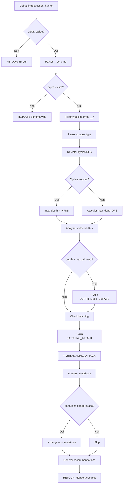

# Exercice [3.3.1-c] : graphql_introspection_hunter

**Module :**
3.3.1 — Architecture Web Moderne

**Concept :**
c — GraphQL Security (introspection, depth, batching, mutations)

**Difficulte :**
★★★★★★★★☆☆ (8/10)

**Type :**
code

**Tiers :**
2 — Melange (concepts 3.3.1.c + 3.3.11.e)

**Langage :**
Rust Edition 2024

**Prerequis :**
- Module 3.3.1-a (Protocol Dissector)
- Module 3.3.1-b (REST API Security)
- Connaissance JSON/serde
- Bases GraphQL

**Domaines :**
Net, Struct, DP

**Duree estimee :**
300 min

**XP Base :**
400

**Complexite :**
T4 O(n*d) x S3 O(n) ou d = profondeur du schema

---

## SECTION 1 : PROTOTYPE & CONSIGNE

### 1.1 Obligations

**Fichier a rendre :**
`graphql_introspection_hunter.rs`

**Fonctions autorisees :**
- `serde_json` (parsing JSON)
- `std::collections::HashMap`, `HashSet`, `VecDeque`
- `regex` (patterns de detection)
- Fonctions standard Rust

**Fonctions interdites :**
- Requetes reseau reelles (pas de `reqwest`, `hyper`, `graphql_client`)
- Acces fichiers systeme
- Execution de queries GraphQL reelles

### 1.2 Consigne

**🎮 CONTEXTE FUN — "Ghost in the Shell : Section 9 Database"**

*Dans l'univers de Ghost in the Shell, la Section 9 utilise une base de donnees ultra-securisee accessible uniquement via GraphQL. Mais un hacker du groupe "Laughing Man" a reussi a activer l'introspection...*

*Tu es recrute par Motoko Kusanagi pour analyser ce que l'ennemi peut voir. Ton objectif : decouvrir toutes les vulnerabilites AVANT qu'elles ne soient exploitees.*

*"The net is vast and infinite." — Mais avec l'introspection, l'ennemi peut TOUT voir.*

*Chaque query trop profonde est une porte vers un DoS. Chaque batch query est un bypass de rate limiting. Chaque mutation exposee est une arme potentielle.*

---

### 1.2.2 Consigne Academique

**Ta mission :**

Ecrire une fonction `graphql_introspection_hunter` qui analyse une reponse d'introspection GraphQL et detecte les vulnerabilites de securite specifiques a GraphQL.

**Entree :**
- `input_json` : Une chaine JSON contenant :
  - `introspection_response` : La reponse complete de la query `__schema` (JSON)
  - `sample_queries` : Liste de queries d'exemple (optionnel)
  - `config` : Configuration d'analyse
    - `max_allowed_depth` : Profondeur maximale autorisee (defaut: 5)
    - `check_batching` : Verifier les vulnerabilites de batching (bool)
    - `check_mutations` : Analyser les mutations dangereuses (bool)

**Sortie :**
Une chaine JSON contenant :
- `schema_analysis` : Analyse du schema
  - `types_count` : Nombre de types
  - `queries_count` : Nombre de queries
  - `mutations_count` : Nombre de mutations
  - `subscriptions_count` : Nombre de subscriptions
  - `max_depth_possible` : Profondeur maximale atteignable
  - `circular_references` : Liste des references circulaires detectees
- `vulnerabilities` : Liste des vulnerabilites detectees
  - `type` : Type de vulnerabilite (DEPTH_LIMIT_BYPASS, BATCHING_ATTACK, DANGEROUS_MUTATION, etc.)
  - `severity` : CRITICAL, HIGH, MEDIUM, LOW
  - `details` : Description detaillee
  - `proof_query` : Query de preuve si applicable
  - `mitigation` : Recommandation de correction
- `dangerous_mutations` : Liste des mutations a haut risque
- `recommendations` : Liste de recommandations generales

**Contraintes :**
- Parser correctement le format d'introspection GraphQL standard
- Detecter les references circulaires (User -> Friends -> User)
- Calculer la profondeur maximale atteignable
- Identifier les mutations administratives

**Exemples :**

| Entree | Sortie Attendue | Explication |
|--------|-----------------|-------------|
| Schema avec type User -> friends: [User] | Circular reference detected | Self-reference = infinite depth |
| Query avec depth 12 | DEPTH_LIMIT_BYPASS | Depasse max_allowed_depth (5) |
| Schema avec mutation deleteUser | DANGEROUS_MUTATION | Operation destructive |

### 1.3 Prototype

```rust
use serde::{Deserialize, Serialize};
use serde_json::{Value, json};
use std::collections::{HashMap, HashSet, VecDeque};

/// Point d'entree principal
pub fn graphql_introspection_hunter(input_json: &str) -> String

/// Parse la reponse d'introspection GraphQL
fn parse_introspection_response(response: &Value) -> Result<GraphQLSchema, ParseError>

/// Analyse le schema pour extraire les metriques
fn analyze_schema(schema: &GraphQLSchema) -> SchemaAnalysis

/// Detecte les references circulaires dans le schema
fn detect_circular_references(schema: &GraphQLSchema) -> Vec<CircularReference>

/// Calcule la profondeur maximale atteignable
fn calculate_max_depth(schema: &GraphQLSchema) -> u32

/// Analyse les vulnerabilites de profondeur
fn analyze_depth_vulnerabilities(
    schema: &GraphQLSchema,
    max_allowed: u32
) -> Vec<Vulnerability>

/// Detecte les vulnerabilites de batching
fn detect_batching_vulnerabilities(schema: &GraphQLSchema) -> Vec<Vulnerability>

/// Identifie les mutations dangereuses
fn analyze_dangerous_mutations(schema: &GraphQLSchema) -> Vec<DangerousMutation>

/// Genere les recommandations
fn generate_recommendations(
    vulnerabilities: &[Vulnerability],
    schema: &GraphQLSchema
) -> Vec<String>
```

---

## SECTION 2 : LE SAVIEZ-VOUS ?

### 2.1 Qu'est-ce que l'Introspection GraphQL ?

L'introspection est une fonctionnalite NATIVE de GraphQL qui permet de querier le schema lui-meme :

```graphql
query IntrospectionQuery {
  __schema {
    types {
      name
      fields {
        name
        type {
          name
          kind
        }
      }
    }
    queryType { name }
    mutationType { name }
  }
}
```

**Probleme de securite :** En production, l'introspection revele TOUTE la structure de l'API !

### 2.2 Types de Vulnerabilites GraphQL

| Vulnerabilite | Description | Impact |
|---------------|-------------|--------|
| **Depth Attack** | Queries infiniment profondes | DoS |
| **Batching** | Multiple queries en une requete | Rate limit bypass |
| **Aliasing** | Meme query avec alias differents | Amplification |
| **Fragment Cycles** | Fragments qui se referencent | DoS |
| **Introspection Leak** | Schema expose en prod | Reconnaissance |

### 2.3 Format d'Introspection Standard

```json
{
  "__schema": {
    "queryType": {"name": "Query"},
    "mutationType": {"name": "Mutation"},
    "types": [
      {
        "kind": "OBJECT",
        "name": "User",
        "fields": [
          {
            "name": "id",
            "type": {"kind": "NON_NULL", "ofType": {"kind": "SCALAR", "name": "ID"}}
          },
          {
            "name": "friends",
            "type": {"kind": "LIST", "ofType": {"kind": "OBJECT", "name": "User"}}
          }
        ]
      }
    ]
  }
}
```

---

## SECTION 2.5 : DANS LA VRAIE VIE

### Qui utilise ca ?

| Metier | Cas d'usage |
|--------|-------------|
| **API Security Engineer** | Audit pre-production des APIs GraphQL |
| **Pentester** | Phase de reconnaissance sur cibles GraphQL |
| **Bug Bounty Hunter** | Detection de surface d'attaque GraphQL |
| **DevSecOps** | CI/CD gate pour bloquer introspection en prod |
| **Backend Developer** | Validation de schema avant deployment |

### Outils Professionnels Similaires

- **InQL** — Extension Burp Suite pour GraphQL
- **graphql-voyager** — Visualisation de schema
- **graphql-cop** — Scanner de vulnerabilites
- **BatchQL** — Outil d'analyse de batching

---

## SECTION 3 : EXEMPLE D'UTILISATION

### 3.0 Session bash

```bash
$ ls
graphql_introspection_hunter.rs  main.rs  test_schema.json

$ cargo build --release

$ ./target/release/graphql_hunter
Test vulnerable_schema.json:
{
  "schema_analysis": {
    "types_count": 15,
    "queries_count": 8,
    "mutations_count": 5,
    "subscriptions_count": 2,
    "max_depth_possible": 12,
    "circular_references": [
      {"path": "User -> friends -> User", "depth": "infinite"}
    ]
  },
  "vulnerabilities": [
    {
      "type": "DEPTH_LIMIT_BYPASS",
      "severity": "HIGH",
      "details": "Schema allows query depth of 12, exceeds limit of 5",
      "proof_query": "query { user { friends { friends { friends { name } } } } }",
      "mitigation": "Implement maxDepth validation at 5"
    },
    {
      "type": "BATCHING_ATTACK",
      "severity": "MEDIUM",
      "details": "Schema allows multiple queries in single request",
      "mitigation": "Implement query cost analysis and rate limiting"
    }
  ],
  "dangerous_mutations": [
    {
      "name": "deleteUser",
      "risk": "CRITICAL",
      "reason": "Destructive operation without apparent soft-delete"
    }
  ],
  "recommendations": [
    "Disable introspection in production",
    "Implement query depth limiting",
    "Add query complexity analysis"
  ]
}
All tests passed!
```

---

## 💀 SECTION 3.1 : BONUS EXPERT (OPTIONNEL)

**Difficulte Bonus :**
★★★★★★★★★★ (10/10)

**Recompense :**
XP x4

**Time Complexity attendue :**
O(n^2) pour detection de cycles

**Space Complexity attendue :**
O(n)

**Domaines Bonus :**
`DP, Struct`

### 3.1.1 Consigne Bonus

**🎮 "Section 9 : Counter-Introspection Mode"**

*Motoko veut aller plus loin. Elle veut non seulement detecter les vulnerabilites, mais aussi generer des QUERIES D'ATTAQUE pour tester les protections.*

**Ta mission bonus :**

Etendre la fonction pour generer automatiquement des queries d'attaque optimisees.

**Entree supplementaire :**
```json
{
  "generate_attack_queries": true,
  "attack_types": ["depth", "batching", "aliasing", "fragment_cycle"]
}
```

**Sortie supplementaire :**
```json
{
  "attack_queries": {
    "depth_attack": {
      "query": "query { user { friends { friends { friends { friends { friends { name } } } } } } }",
      "expected_depth": 6,
      "purpose": "Test depth limiting"
    },
    "batching_attack": {
      "query": "[{\"query\": \"{ user(id: 1) { name } }\"}, {\"query\": \"{ user(id: 2) { name } }\"}, ...]",
      "batch_size": 100,
      "purpose": "Test rate limiting"
    },
    "aliasing_attack": {
      "query": "query { u1: user(id: 1) { name } u2: user(id: 2) { name } ... u100: user(id: 100) { name } }",
      "alias_count": 100,
      "purpose": "Test query cost analysis"
    },
    "fragment_cycle": {
      "query": "fragment A on User { ...B } fragment B on User { ...A } query { user { ...A } }",
      "purpose": "Test fragment cycle detection"
    }
  }
}
```

**Contraintes Bonus :**
```
┌─────────────────────────────────────────┐
│  Generer 4 types d'attaques           │
│  Queries syntaxiquement valides        │
│  Adapter aux types du schema          │
│  Pas d'execution reelle                │
└─────────────────────────────────────────┘
```

### 3.1.2 Prototype Bonus

```rust
fn generate_attack_queries(
    schema: &GraphQLSchema,
    attack_types: &[AttackType]
) -> AttackQueries

fn generate_depth_attack(schema: &GraphQLSchema, target_depth: u32) -> String

fn generate_batching_attack(schema: &GraphQLSchema, batch_size: u32) -> String

fn generate_aliasing_attack(schema: &GraphQLSchema, alias_count: u32) -> String

fn generate_fragment_cycle(schema: &GraphQLSchema) -> String
```

### 3.1.3 Ce qui change par rapport a l'exercice de base

| Aspect | Base | Bonus |
|--------|------|-------|
| Detection | Identification des vulns | + Generation de PoC |
| Sortie | Analyse statique | + Queries d'attaque |
| Complexite | O(n*d) | O(n^2) pour cycles |
| Use case | Audit defensif | + Test offensif |

---

## SECTION 4 : ZONE CORRECTION (POUR LE TESTEUR)

### 4.1 Moulinette

| Test | Entree | Sortie Attendue | Points |
|------|--------|-----------------|--------|
| `test_empty_schema` | `{}` | Error handled | 5 |
| `test_no_types` | Schema sans types | 0 types detected | 5 |
| `test_circular_reference` | User -> friends -> User | Circular detected | 15 |
| `test_depth_calculation` | Schema avec depth 10 | max_depth = 10 | 15 |
| `test_depth_vulnerability` | depth > max_allowed | Vulnerability HIGH | 15 |
| `test_batching_detection` | Schema standard | Batching vuln | 10 |
| `test_dangerous_mutation` | deleteUser mutation | CRITICAL risk | 10 |
| `test_introspection_disabled` | Partial schema | Handled gracefully | 5 |
| `test_recommendations` | Multiple vulns | Relevant recs | 10 |
| `test_full_analysis` | Complex schema | Complete report | 10 |

### 4.2 main.rs de test

```rust
use serde_json::{json, Value};

mod graphql_introspection_hunter;
use graphql_introspection_hunter::graphql_introspection_hunter;

fn main() {
    println!("=== GraphQL Introspection Hunter Tests ===\n");

    let mut passed = 0;
    let mut failed = 0;

    // Test 1: Empty schema
    {
        let input = json!({
            "introspection_response": {},
            "config": {
                "max_allowed_depth": 5,
                "check_batching": true,
                "check_mutations": true
            }
        }).to_string();

        let result = graphql_introspection_hunter(&input);
        let parsed: Value = serde_json::from_str(&result).unwrap();

        if parsed.get("error").is_some() ||
           parsed["schema_analysis"]["types_count"].as_u64().unwrap_or(0) == 0 {
            println!("[PASS] test_empty_schema");
            passed += 1;
        } else {
            println!("[FAIL] test_empty_schema");
            failed += 1;
        }
    }

    // Test 2: Circular Reference Detection
    {
        let input = json!({
            "introspection_response": {
                "__schema": {
                    "queryType": {"name": "Query"},
                    "types": [
                        {
                            "kind": "OBJECT",
                            "name": "Query",
                            "fields": [
                                {
                                    "name": "user",
                                    "type": {"kind": "OBJECT", "name": "User"}
                                }
                            ]
                        },
                        {
                            "kind": "OBJECT",
                            "name": "User",
                            "fields": [
                                {
                                    "name": "id",
                                    "type": {"kind": "SCALAR", "name": "ID"}
                                },
                                {
                                    "name": "friends",
                                    "type": {
                                        "kind": "LIST",
                                        "ofType": {"kind": "OBJECT", "name": "User"}
                                    }
                                }
                            ]
                        }
                    ]
                }
            },
            "config": {"max_allowed_depth": 5}
        }).to_string();

        let result = graphql_introspection_hunter(&input);
        let parsed: Value = serde_json::from_str(&result).unwrap();

        let has_circular = parsed["schema_analysis"]["circular_references"]
            .as_array()
            .map(|arr| !arr.is_empty())
            .unwrap_or(false);

        if has_circular {
            println!("[PASS] test_circular_reference");
            passed += 1;
        } else {
            println!("[FAIL] test_circular_reference - Expected circular ref User->friends->User");
            failed += 1;
        }
    }

    // Test 3: Depth Vulnerability Detection
    {
        let input = json!({
            "introspection_response": {
                "__schema": {
                    "queryType": {"name": "Query"},
                    "types": [
                        {
                            "kind": "OBJECT",
                            "name": "Query",
                            "fields": [
                                {"name": "level1", "type": {"kind": "OBJECT", "name": "Level1"}}
                            ]
                        },
                        {
                            "kind": "OBJECT",
                            "name": "Level1",
                            "fields": [
                                {"name": "level2", "type": {"kind": "OBJECT", "name": "Level2"}}
                            ]
                        },
                        {
                            "kind": "OBJECT",
                            "name": "Level2",
                            "fields": [
                                {"name": "level3", "type": {"kind": "OBJECT", "name": "Level3"}}
                            ]
                        },
                        {
                            "kind": "OBJECT",
                            "name": "Level3",
                            "fields": [
                                {"name": "value", "type": {"kind": "SCALAR", "name": "String"}}
                            ]
                        }
                    ]
                }
            },
            "config": {"max_allowed_depth": 2}
        }).to_string();

        let result = graphql_introspection_hunter(&input);
        let parsed: Value = serde_json::from_str(&result).unwrap();

        let has_depth_vuln = parsed["vulnerabilities"]
            .as_array()
            .map(|arr| arr.iter().any(|v| {
                v["type"].as_str()
                    .map(|s| s.contains("DEPTH"))
                    .unwrap_or(false)
            }))
            .unwrap_or(false);

        if has_depth_vuln {
            println!("[PASS] test_depth_vulnerability");
            passed += 1;
        } else {
            println!("[FAIL] test_depth_vulnerability - Expected DEPTH_LIMIT_BYPASS");
            failed += 1;
        }
    }

    // Test 4: Dangerous Mutation Detection
    {
        let input = json!({
            "introspection_response": {
                "__schema": {
                    "queryType": {"name": "Query"},
                    "mutationType": {"name": "Mutation"},
                    "types": [
                        {
                            "kind": "OBJECT",
                            "name": "Query",
                            "fields": [
                                {"name": "users", "type": {"kind": "LIST", "ofType": {"name": "User"}}}
                            ]
                        },
                        {
                            "kind": "OBJECT",
                            "name": "Mutation",
                            "fields": [
                                {
                                    "name": "deleteUser",
                                    "args": [{"name": "id", "type": {"name": "ID"}}],
                                    "type": {"name": "Boolean"}
                                },
                                {
                                    "name": "dropDatabase",
                                    "type": {"name": "Boolean"}
                                },
                                {
                                    "name": "updateUser",
                                    "args": [{"name": "id"}, {"name": "data"}],
                                    "type": {"name": "User"}
                                }
                            ]
                        },
                        {
                            "kind": "OBJECT",
                            "name": "User",
                            "fields": [{"name": "id", "type": {"name": "ID"}}]
                        }
                    ]
                }
            },
            "config": {"check_mutations": true}
        }).to_string();

        let result = graphql_introspection_hunter(&input);
        let parsed: Value = serde_json::from_str(&result).unwrap();

        let has_dangerous = parsed["dangerous_mutations"]
            .as_array()
            .map(|arr| arr.iter().any(|m| {
                let name = m["name"].as_str().unwrap_or("");
                name.contains("delete") || name.contains("drop")
            }))
            .unwrap_or(false);

        if has_dangerous {
            println!("[PASS] test_dangerous_mutation");
            passed += 1;
        } else {
            println!("[FAIL] test_dangerous_mutation - Expected deleteUser/dropDatabase");
            failed += 1;
        }
    }

    // Test 5: Schema Analysis Counts
    {
        let input = json!({
            "introspection_response": {
                "__schema": {
                    "queryType": {"name": "Query"},
                    "mutationType": {"name": "Mutation"},
                    "subscriptionType": {"name": "Subscription"},
                    "types": [
                        {"kind": "OBJECT", "name": "Query", "fields": [{"name": "a"}, {"name": "b"}]},
                        {"kind": "OBJECT", "name": "Mutation", "fields": [{"name": "c"}]},
                        {"kind": "OBJECT", "name": "Subscription", "fields": [{"name": "d"}]},
                        {"kind": "OBJECT", "name": "User", "fields": []},
                        {"kind": "SCALAR", "name": "String"},
                        {"kind": "SCALAR", "name": "ID"}
                    ]
                }
            },
            "config": {}
        }).to_string();

        let result = graphql_introspection_hunter(&input);
        let parsed: Value = serde_json::from_str(&result).unwrap();

        let types_count = parsed["schema_analysis"]["types_count"].as_u64().unwrap_or(0);
        let queries_count = parsed["schema_analysis"]["queries_count"].as_u64().unwrap_or(0);

        if types_count >= 4 && queries_count >= 2 {
            println!("[PASS] test_schema_analysis (types: {}, queries: {})", types_count, queries_count);
            passed += 1;
        } else {
            println!("[FAIL] test_schema_analysis");
            failed += 1;
        }
    }

    // Test 6: Malformed JSON handling
    {
        let input = "{ not valid json at all }}}";
        let result = graphql_introspection_hunter(input);
        let parsed: Result<Value, _> = serde_json::from_str(&result);

        if parsed.is_ok() && parsed.unwrap().get("error").is_some() {
            println!("[PASS] test_malformed_json");
            passed += 1;
        } else {
            println!("[FAIL] test_malformed_json");
            failed += 1;
        }
    }

    // Test 7: Recommendations Generation
    {
        let input = json!({
            "introspection_response": {
                "__schema": {
                    "queryType": {"name": "Query"},
                    "types": [
                        {
                            "kind": "OBJECT",
                            "name": "Query",
                            "fields": [
                                {"name": "user", "type": {"kind": "OBJECT", "name": "User"}}
                            ]
                        },
                        {
                            "kind": "OBJECT",
                            "name": "User",
                            "fields": [
                                {"name": "friends", "type": {"kind": "LIST", "ofType": {"name": "User"}}}
                            ]
                        }
                    ]
                }
            },
            "config": {"max_allowed_depth": 3}
        }).to_string();

        let result = graphql_introspection_hunter(&input);
        let parsed: Value = serde_json::from_str(&result).unwrap();

        let has_recs = parsed["recommendations"]
            .as_array()
            .map(|arr| !arr.is_empty())
            .unwrap_or(false);

        if has_recs {
            println!("[PASS] test_recommendations");
            passed += 1;
        } else {
            println!("[FAIL] test_recommendations - Expected at least one recommendation");
            failed += 1;
        }
    }

    println!("\n=== Results: {}/{} passed ===", passed, passed + failed);

    if failed > 0 {
        std::process::exit(1);
    }
}
```

### 4.3 Solution de reference

```rust
use serde::{Deserialize, Serialize};
use serde_json::{json, Value};
use std::collections::{HashMap, HashSet, VecDeque};

// ============ STRUCTURES ============

#[derive(Debug, Clone, Serialize, Deserialize)]
pub struct HunterInput {
    pub introspection_response: Value,
    #[serde(default)]
    pub sample_queries: Vec<String>,
    #[serde(default)]
    pub config: HunterConfig,
}

#[derive(Debug, Clone, Serialize, Deserialize, Default)]
pub struct HunterConfig {
    #[serde(default = "default_max_depth")]
    pub max_allowed_depth: u32,
    #[serde(default = "default_true")]
    pub check_batching: bool,
    #[serde(default = "default_true")]
    pub check_mutations: bool,
}

fn default_max_depth() -> u32 { 5 }
fn default_true() -> bool { true }

#[derive(Debug, Clone, Serialize, Deserialize)]
pub struct HunterOutput {
    pub schema_analysis: SchemaAnalysis,
    pub vulnerabilities: Vec<Vulnerability>,
    pub dangerous_mutations: Vec<DangerousMutation>,
    pub recommendations: Vec<String>,
}

#[derive(Debug, Clone, Serialize, Deserialize)]
pub struct SchemaAnalysis {
    pub types_count: usize,
    pub queries_count: usize,
    pub mutations_count: usize,
    pub subscriptions_count: usize,
    pub max_depth_possible: u32,
    pub circular_references: Vec<CircularReference>,
}

#[derive(Debug, Clone, Serialize, Deserialize)]
pub struct CircularReference {
    pub path: String,
    pub types_involved: Vec<String>,
}

#[derive(Debug, Clone, Serialize, Deserialize)]
pub struct Vulnerability {
    #[serde(rename = "type")]
    pub vuln_type: String,
    pub severity: String,
    pub details: String,
    pub proof_query: Option<String>,
    pub mitigation: String,
}

#[derive(Debug, Clone, Serialize, Deserialize)]
pub struct DangerousMutation {
    pub name: String,
    pub risk: String,
    pub reason: String,
    pub args: Vec<String>,
}

#[derive(Debug, Clone)]
pub struct GraphQLType {
    pub name: String,
    pub kind: String,
    pub fields: Vec<GraphQLField>,
}

#[derive(Debug, Clone)]
pub struct GraphQLField {
    pub name: String,
    pub type_name: String,
    pub type_kind: String,
    pub is_list: bool,
    pub args: Vec<String>,
}

// ============ MAIN FUNCTION ============

pub fn graphql_introspection_hunter(input_json: &str) -> String {
    // Parse input
    let input: HunterInput = match serde_json::from_str(input_json) {
        Ok(i) => i,
        Err(e) => {
            return json!({
                "error": format!("Failed to parse input: {}", e),
                "schema_analysis": {
                    "types_count": 0,
                    "queries_count": 0,
                    "mutations_count": 0,
                    "subscriptions_count": 0,
                    "max_depth_possible": 0,
                    "circular_references": []
                },
                "vulnerabilities": [],
                "dangerous_mutations": [],
                "recommendations": []
            }).to_string();
        }
    };

    // Extract schema from introspection response
    let schema = &input.introspection_response;
    let schema_data = schema.get("__schema").unwrap_or(schema);

    // Parse types
    let types = parse_types(schema_data);

    if types.is_empty() {
        return json!({
            "schema_analysis": {
                "types_count": 0,
                "queries_count": 0,
                "mutations_count": 0,
                "subscriptions_count": 0,
                "max_depth_possible": 0,
                "circular_references": []
            },
            "vulnerabilities": [],
            "dangerous_mutations": [],
            "recommendations": ["Schema appears empty or introspection is disabled"]
        }).to_string();
    }

    // Get root type names
    let query_type_name = schema_data.get("queryType")
        .and_then(|q| q.get("name"))
        .and_then(|n| n.as_str())
        .unwrap_or("Query");

    let mutation_type_name = schema_data.get("mutationType")
        .and_then(|m| m.get("name"))
        .and_then(|n| n.as_str());

    let subscription_type_name = schema_data.get("subscriptionType")
        .and_then(|s| s.get("name"))
        .and_then(|n| n.as_str());

    // Count operations
    let queries_count = types.get(query_type_name)
        .map(|t| t.fields.len())
        .unwrap_or(0);

    let mutations_count = mutation_type_name
        .and_then(|name| types.get(name))
        .map(|t| t.fields.len())
        .unwrap_or(0);

    let subscriptions_count = subscription_type_name
        .and_then(|name| types.get(name))
        .map(|t| t.fields.len())
        .unwrap_or(0);

    // Detect circular references
    let circular_refs = detect_circular_references(&types);

    // Calculate max depth (limited if circular refs exist)
    let max_depth = if !circular_refs.is_empty() {
        u32::MAX // Infinite potential
    } else {
        calculate_max_depth(&types, query_type_name)
    };

    // Analyze vulnerabilities
    let mut vulnerabilities = Vec::new();

    // Check depth vulnerability
    if max_depth > input.config.max_allowed_depth {
        let depth_str = if max_depth == u32::MAX {
            "infinite (circular references)".to_string()
        } else {
            max_depth.to_string()
        };

        vulnerabilities.push(Vulnerability {
            vuln_type: "DEPTH_LIMIT_BYPASS".to_string(),
            severity: "HIGH".to_string(),
            details: format!(
                "Schema allows query depth of {}, exceeds limit of {}",
                depth_str, input.config.max_allowed_depth
            ),
            proof_query: generate_deep_query(&types, query_type_name, input.config.max_allowed_depth + 2),
            mitigation: format!(
                "Implement maxDepth validation at {}",
                input.config.max_allowed_depth
            ),
        });
    }

    // Check for circular references as vulnerability
    if !circular_refs.is_empty() {
        vulnerabilities.push(Vulnerability {
            vuln_type: "CIRCULAR_REFERENCE".to_string(),
            severity: "MEDIUM".to_string(),
            details: format!(
                "Schema contains {} circular reference(s) allowing infinite depth",
                circular_refs.len()
            ),
            proof_query: None,
            mitigation: "Implement query depth limiting and complexity analysis".to_string(),
        });
    }

    // Check batching vulnerability
    if input.config.check_batching {
        vulnerabilities.push(Vulnerability {
            vuln_type: "BATCHING_ATTACK".to_string(),
            severity: "MEDIUM".to_string(),
            details: "Schema allows multiple queries in single request (default GraphQL behavior)".to_string(),
            proof_query: Some(r#"[{"query": "{ user(id: 1) { name } }"}, {"query": "{ user(id: 2) { name } }"}]"#.to_string()),
            mitigation: "Implement query cost analysis and per-request rate limiting".to_string(),
        });

        // Aliasing vulnerability
        vulnerabilities.push(Vulnerability {
            vuln_type: "ALIASING_ATTACK".to_string(),
            severity: "MEDIUM".to_string(),
            details: "Schema allows field aliasing enabling query amplification".to_string(),
            proof_query: Some("query { u1: user(id: 1) { name } u2: user(id: 2) { name } }".to_string()),
            mitigation: "Implement alias counting in query cost analysis".to_string(),
        });
    }

    // Analyze dangerous mutations
    let dangerous_mutations = if input.config.check_mutations {
        analyze_dangerous_mutations(&types, mutation_type_name)
    } else {
        Vec::new()
    };

    // Add mutation vulnerabilities
    for mutation in &dangerous_mutations {
        if mutation.risk == "CRITICAL" {
            vulnerabilities.push(Vulnerability {
                vuln_type: "DANGEROUS_MUTATION".to_string(),
                severity: "CRITICAL".to_string(),
                details: format!("Mutation '{}' detected: {}", mutation.name, mutation.reason),
                proof_query: Some(format!("mutation {{ {}(...) }}", mutation.name)),
                mitigation: "Ensure proper authorization and audit logging".to_string(),
            });
        }
    }

    // Generate recommendations
    let recommendations = generate_recommendations(&vulnerabilities, &circular_refs, &types);

    let output = HunterOutput {
        schema_analysis: SchemaAnalysis {
            types_count: types.len(),
            queries_count,
            mutations_count,
            subscriptions_count,
            max_depth_possible: if max_depth == u32::MAX { 999 } else { max_depth },
            circular_references: circular_refs,
        },
        vulnerabilities,
        dangerous_mutations,
        recommendations,
    };

    serde_json::to_string_pretty(&output).unwrap_or_else(|_| {
        json!({"error": "Serialization failed"}).to_string()
    })
}

// ============ HELPER FUNCTIONS ============

fn parse_types(schema: &Value) -> HashMap<String, GraphQLType> {
    let mut types_map = HashMap::new();

    let types_array = match schema.get("types").and_then(|t| t.as_array()) {
        Some(arr) => arr,
        None => return types_map,
    };

    for type_def in types_array {
        let name = match type_def.get("name").and_then(|n| n.as_str()) {
            Some(n) => n.to_string(),
            None => continue,
        };

        // Skip built-in types
        if name.starts_with("__") {
            continue;
        }

        let kind = type_def.get("kind")
            .and_then(|k| k.as_str())
            .unwrap_or("OBJECT")
            .to_string();

        let fields = parse_fields(type_def.get("fields"));

        types_map.insert(name.clone(), GraphQLType { name, kind, fields });
    }

    types_map
}

fn parse_fields(fields_value: Option<&Value>) -> Vec<GraphQLField> {
    let mut fields = Vec::new();

    let fields_array = match fields_value.and_then(|f| f.as_array()) {
        Some(arr) => arr,
        None => return fields,
    };

    for field in fields_array {
        let name = match field.get("name").and_then(|n| n.as_str()) {
            Some(n) => n.to_string(),
            None => continue,
        };

        let (type_name, type_kind, is_list) = extract_type_info(field.get("type"));

        let args = field.get("args")
            .and_then(|a| a.as_array())
            .map(|arr| {
                arr.iter()
                    .filter_map(|arg| arg.get("name").and_then(|n| n.as_str()))
                    .map(|s| s.to_string())
                    .collect()
            })
            .unwrap_or_default();

        fields.push(GraphQLField {
            name,
            type_name,
            type_kind,
            is_list,
            args,
        });
    }

    fields
}

fn extract_type_info(type_value: Option<&Value>) -> (String, String, bool) {
    let type_obj = match type_value {
        Some(t) => t,
        None => return ("Unknown".to_string(), "SCALAR".to_string(), false),
    };

    let kind = type_obj.get("kind").and_then(|k| k.as_str()).unwrap_or("SCALAR");

    match kind {
        "NON_NULL" | "LIST" => {
            let is_list = kind == "LIST";
            let inner = extract_type_info(type_obj.get("ofType"));
            (inner.0, inner.1, is_list || inner.2)
        }
        _ => {
            let name = type_obj.get("name")
                .and_then(|n| n.as_str())
                .unwrap_or("Unknown")
                .to_string();
            (name, kind.to_string(), false)
        }
    }
}

fn detect_circular_references(types: &HashMap<String, GraphQLType>) -> Vec<CircularReference> {
    let mut circular_refs = Vec::new();
    let mut visited_globally = HashSet::new();

    for (type_name, type_def) in types {
        if type_def.kind != "OBJECT" {
            continue;
        }

        let mut path = vec![type_name.clone()];
        let mut visited = HashSet::new();
        visited.insert(type_name.clone());

        detect_circular_dfs(types, type_name, &mut path, &mut visited, &mut circular_refs, &mut visited_globally);
    }

    circular_refs
}

fn detect_circular_dfs(
    types: &HashMap<String, GraphQLType>,
    current_type: &str,
    path: &mut Vec<String>,
    visited: &mut HashSet<String>,
    circular_refs: &mut Vec<CircularReference>,
    visited_globally: &mut HashSet<String>
) {
    let type_def = match types.get(current_type) {
        Some(t) => t,
        None => return,
    };

    for field in &type_def.fields {
        if field.type_kind != "OBJECT" && field.type_kind != "INTERFACE" {
            continue;
        }

        let target_type = &field.type_name;

        if visited.contains(target_type) {
            // Found a cycle
            let cycle_key = format!("{} -> {}", path.join(" -> "), target_type);
            if !visited_globally.contains(&cycle_key) {
                visited_globally.insert(cycle_key.clone());

                let cycle_start = path.iter().position(|p| p == target_type);
                let types_involved = if let Some(start) = cycle_start {
                    path[start..].to_vec()
                } else {
                    vec![current_type.to_string(), target_type.clone()]
                };

                circular_refs.push(CircularReference {
                    path: format!("{} -> {}", path.join(" -> "), target_type),
                    types_involved,
                });
            }
        } else {
            path.push(target_type.clone());
            visited.insert(target_type.clone());

            detect_circular_dfs(types, target_type, path, visited, circular_refs, visited_globally);

            path.pop();
            visited.remove(target_type);
        }
    }
}

fn calculate_max_depth(types: &HashMap<String, GraphQLType>, root_type: &str) -> u32 {
    let mut memo: HashMap<String, u32> = HashMap::new();
    calculate_depth_recursive(types, root_type, &mut memo, &mut HashSet::new())
}

fn calculate_depth_recursive(
    types: &HashMap<String, GraphQLType>,
    type_name: &str,
    memo: &mut HashMap<String, u32>,
    visiting: &mut HashSet<String>
) -> u32 {
    // Check for cycle
    if visiting.contains(type_name) {
        return u32::MAX;
    }

    // Check memo
    if let Some(&depth) = memo.get(type_name) {
        return depth;
    }

    let type_def = match types.get(type_name) {
        Some(t) => t,
        None => return 1,
    };

    if type_def.kind != "OBJECT" && type_def.kind != "INTERFACE" {
        return 1;
    }

    visiting.insert(type_name.to_string());

    let mut max_child_depth: u32 = 0;

    for field in &type_def.fields {
        if field.type_kind == "OBJECT" || field.type_kind == "INTERFACE" {
            let child_depth = calculate_depth_recursive(types, &field.type_name, memo, visiting);
            if child_depth == u32::MAX {
                visiting.remove(type_name);
                return u32::MAX;
            }
            max_child_depth = max_child_depth.max(child_depth);
        }
    }

    visiting.remove(type_name);

    let depth = 1 + max_child_depth;
    memo.insert(type_name.to_string(), depth);
    depth
}

fn generate_deep_query(
    types: &HashMap<String, GraphQLType>,
    root_type: &str,
    target_depth: u32
) -> Option<String> {
    let type_def = types.get(root_type)?;

    // Find a field that goes deeper
    for field in &type_def.fields {
        if field.type_kind == "OBJECT" {
            let inner = generate_deep_query_recursive(types, &field.type_name, target_depth - 1);
            return Some(format!("query {{ {} {} }}", field.name, inner));
        }
    }

    Some("query { __typename }".to_string())
}

fn generate_deep_query_recursive(
    types: &HashMap<String, GraphQLType>,
    type_name: &str,
    remaining_depth: u32
) -> String {
    if remaining_depth == 0 {
        return "{ __typename }".to_string();
    }

    let type_def = match types.get(type_name) {
        Some(t) => t,
        None => return "{ __typename }".to_string(),
    };

    for field in &type_def.fields {
        if field.type_kind == "OBJECT" {
            let inner = generate_deep_query_recursive(types, &field.type_name, remaining_depth - 1);
            return format!("{{ {} {} }}", field.name, inner);
        }
    }

    "{ __typename }".to_string()
}

fn analyze_dangerous_mutations(
    types: &HashMap<String, GraphQLType>,
    mutation_type_name: Option<&str>
) -> Vec<DangerousMutation> {
    let mut dangerous = Vec::new();

    let mutation_type = match mutation_type_name.and_then(|name| types.get(name)) {
        Some(t) => t,
        None => return dangerous,
    };

    let dangerous_patterns = [
        ("delete", "CRITICAL", "Destructive delete operation"),
        ("remove", "CRITICAL", "Destructive remove operation"),
        ("drop", "CRITICAL", "Destructive drop operation - potential database damage"),
        ("truncate", "CRITICAL", "Truncate operation"),
        ("destroy", "CRITICAL", "Destructive destroy operation"),
        ("admin", "HIGH", "Administrative operation"),
        ("root", "HIGH", "Root/superuser operation"),
        ("sudo", "HIGH", "Elevated privilege operation"),
        ("grant", "HIGH", "Permission granting operation"),
        ("revoke", "HIGH", "Permission revocation operation"),
        ("password", "MEDIUM", "Password modification"),
        ("secret", "MEDIUM", "Secret/credential handling"),
        ("token", "MEDIUM", "Token generation/manipulation"),
    ];

    for field in &mutation_type.fields {
        let field_lower = field.name.to_lowercase();

        for (pattern, risk, reason) in &dangerous_patterns {
            if field_lower.contains(pattern) {
                dangerous.push(DangerousMutation {
                    name: field.name.clone(),
                    risk: risk.to_string(),
                    reason: reason.to_string(),
                    args: field.args.clone(),
                });
                break;
            }
        }
    }

    dangerous
}

fn generate_recommendations(
    vulnerabilities: &[Vulnerability],
    circular_refs: &[CircularReference],
    _types: &HashMap<String, GraphQLType>
) -> Vec<String> {
    let mut recs: HashSet<String> = HashSet::new();

    // Always recommend disabling introspection in prod
    recs.insert("Disable introspection in production environments".to_string());

    for vuln in vulnerabilities {
        match vuln.vuln_type.as_str() {
            "DEPTH_LIMIT_BYPASS" => {
                recs.insert("Implement query depth limiting (recommended max: 5-7)".to_string());
            }
            "CIRCULAR_REFERENCE" => {
                recs.insert("Add query complexity analysis to handle recursive types".to_string());
            }
            "BATCHING_ATTACK" | "ALIASING_ATTACK" => {
                recs.insert("Implement query cost analysis with field-level weights".to_string());
                recs.insert("Add per-request and per-minute rate limiting".to_string());
            }
            "DANGEROUS_MUTATION" => {
                recs.insert("Implement robust authorization for all mutations".to_string());
                recs.insert("Add audit logging for destructive operations".to_string());
            }
            _ => {}
        }
    }

    if !circular_refs.is_empty() {
        recs.insert("Consider using dataloader pattern to prevent N+1 queries".to_string());
    }

    recs.into_iter().collect()
}

#[cfg(test)]
mod tests {
    use super::*;

    #[test]
    fn test_empty_input() {
        let result = graphql_introspection_hunter("{}");
        assert!(result.contains("types_count"));
    }

    #[test]
    fn test_circular_detection() {
        let input = json!({
            "introspection_response": {
                "__schema": {
                    "types": [
                        {
                            "kind": "OBJECT",
                            "name": "User",
                            "fields": [
                                {"name": "friend", "type": {"kind": "OBJECT", "name": "User"}}
                            ]
                        }
                    ]
                }
            }
        }).to_string();

        let result = graphql_introspection_hunter(&input);
        // Should detect User -> friend -> User cycle
        assert!(result.contains("circular") || result.contains("User"));
    }
}
```

### 4.4 Solutions alternatives acceptees

```rust
// Alternative 1: BFS au lieu de DFS pour detection de cycles
// ==========================================================

fn detect_circular_bfs(types: &HashMap<String, GraphQLType>) -> Vec<CircularReference> {
    let mut circular_refs = Vec::new();

    for (start_type, _) in types {
        let mut queue = VecDeque::new();
        let mut visited: HashMap<String, Vec<String>> = HashMap::new();

        queue.push_back((start_type.clone(), vec![start_type.clone()]));

        while let Some((current, path)) = queue.pop_front() {
            if let Some(type_def) = types.get(&current) {
                for field in &type_def.fields {
                    if field.type_kind == "OBJECT" {
                        let target = &field.type_name;

                        if target == start_type && path.len() > 1 {
                            circular_refs.push(CircularReference {
                                path: path.join(" -> ") + " -> " + target,
                                types_involved: path.clone(),
                            });
                        } else if !visited.contains_key(target) {
                            let mut new_path = path.clone();
                            new_path.push(target.clone());
                            visited.insert(target.clone(), new_path.clone());
                            queue.push_back((target.clone(), new_path));
                        }
                    }
                }
            }
        }
    }

    circular_refs
}


// Alternative 2: Tarjan's Algorithm pour SCCs
// ============================================

struct TarjanState {
    index: u32,
    stack: Vec<String>,
    on_stack: HashSet<String>,
    indices: HashMap<String, u32>,
    low_links: HashMap<String, u32>,
    sccs: Vec<Vec<String>>,
}

fn tarjan_scc(types: &HashMap<String, GraphQLType>) -> Vec<Vec<String>> {
    let mut state = TarjanState {
        index: 0,
        stack: Vec::new(),
        on_stack: HashSet::new(),
        indices: HashMap::new(),
        low_links: HashMap::new(),
        sccs: Vec::new(),
    };

    for type_name in types.keys() {
        if !state.indices.contains_key(type_name) {
            tarjan_dfs(types, type_name, &mut state);
        }
    }

    state.sccs.into_iter().filter(|scc| scc.len() > 1).collect()
}


// Alternative 3: Approche iterative avec stack explicite
// ======================================================

fn calculate_max_depth_iterative(
    types: &HashMap<String, GraphQLType>,
    root: &str
) -> u32 {
    let mut stack: Vec<(String, u32, HashSet<String>)> = Vec::new();
    let mut max_depth = 0u32;

    let mut initial_visited = HashSet::new();
    initial_visited.insert(root.to_string());
    stack.push((root.to_string(), 1, initial_visited));

    while let Some((current, depth, visited)) = stack.pop() {
        max_depth = max_depth.max(depth);

        if depth > 100 {  // Safety limit
            return u32::MAX;
        }

        if let Some(type_def) = types.get(&current) {
            for field in &type_def.fields {
                if field.type_kind == "OBJECT" && !visited.contains(&field.type_name) {
                    let mut new_visited = visited.clone();
                    new_visited.insert(field.type_name.clone());
                    stack.push((field.type_name.clone(), depth + 1, new_visited));
                }
            }
        }
    }

    max_depth
}
```

### 4.5 Solutions refusees (avec explications)

```rust
// REFUSE 1: Pas de detection de cycles
// =====================================

fn analyze_without_cycle_check(types: &HashMap<String, GraphQLType>) -> SchemaAnalysis {
    // REFUSE: Ne detecte pas les references circulaires
    SchemaAnalysis {
        types_count: types.len(),
        // ...
        circular_references: vec![],  // Toujours vide!
        max_depth_possible: 10,  // Valeur arbitraire
    }
}
// Pourquoi refuse: La detection de cycles est CRITIQUE pour GraphQL


// REFUSE 2: Recursion infinie sans protection
// ============================================

fn calculate_depth_unsafe(types: &HashMap<String, GraphQLType>, name: &str) -> u32 {
    // REFUSE: Pas de detection de cycle, stackoverflow sur User->friends->User
    let type_def = types.get(name).unwrap();
    let mut max = 0;
    for field in &type_def.fields {
        if field.type_kind == "OBJECT" {
            max = max.max(calculate_depth_unsafe(types, &field.type_name));  // BOOM!
        }
    }
    1 + max
}
// Pourquoi refuse: Crash sur tout schema avec reference circulaire


// REFUSE 3: Hardcoded vulnerabilities
// ====================================

fn fake_analysis(_input: &str) -> String {
    // REFUSE: Ne fait aucune analyse reelle
    json!({
        "schema_analysis": {"types_count": 10},
        "vulnerabilities": [
            {"type": "DEPTH_LIMIT_BYPASS", "severity": "HIGH"}
        ]
    }).to_string()
}
// Pourquoi refuse: Resultats statiques, pas d'analyse


// REFUSE 4: Ignore les mutations
// ================================

fn analyze_queries_only(schema: &Value) -> HunterOutput {
    // REFUSE: Ignore completement mutationType
    let types = parse_types(&schema["__schema"]);
    // ...mutations_count toujours 0
}
// Pourquoi refuse: Les mutations sont souvent les plus dangereuses
```

### 4.6 Solution bonus de reference (COMPLETE)

```rust
use serde::{Deserialize, Serialize};
use serde_json::{json, Value};
use std::collections::HashMap;

#[derive(Debug, Clone, Serialize, Deserialize)]
pub struct HunterInputBonus {
    pub introspection_response: Value,
    #[serde(default)]
    pub config: HunterConfig,
    #[serde(default)]
    pub generate_attack_queries: bool,
    #[serde(default)]
    pub attack_types: Vec<String>,
}

#[derive(Debug, Clone, Serialize, Deserialize)]
pub struct HunterOutputBonus {
    pub schema_analysis: SchemaAnalysis,
    pub vulnerabilities: Vec<Vulnerability>,
    pub dangerous_mutations: Vec<DangerousMutation>,
    pub recommendations: Vec<String>,
    pub attack_queries: Option<AttackQueries>,
}

#[derive(Debug, Clone, Serialize, Deserialize)]
pub struct AttackQueries {
    pub depth_attack: Option<AttackQuery>,
    pub batching_attack: Option<AttackQuery>,
    pub aliasing_attack: Option<AttackQuery>,
    pub fragment_cycle: Option<AttackQuery>,
}

#[derive(Debug, Clone, Serialize, Deserialize)]
pub struct AttackQuery {
    pub query: String,
    pub purpose: String,
    pub expected_impact: String,
}

pub fn graphql_introspection_hunter_bonus(input_json: &str) -> String {
    let input: HunterInputBonus = match serde_json::from_str(input_json) {
        Ok(i) => i,
        Err(e) => return json!({"error": e.to_string()}).to_string(),
    };

    // Run base analysis
    let base_input = json!({
        "introspection_response": input.introspection_response,
        "config": input.config
    }).to_string();

    let base_result: Value = serde_json::from_str(&graphql_introspection_hunter(&base_input)).unwrap();

    // Generate attack queries if requested
    let attack_queries = if input.generate_attack_queries {
        let schema_data = input.introspection_response.get("__schema")
            .unwrap_or(&input.introspection_response);
        let types = parse_types(schema_data);

        let query_type = schema_data.get("queryType")
            .and_then(|q| q.get("name"))
            .and_then(|n| n.as_str())
            .unwrap_or("Query");

        Some(generate_attack_queries(&types, query_type, &input.attack_types))
    } else {
        None
    };

    let output = HunterOutputBonus {
        schema_analysis: serde_json::from_value(base_result["schema_analysis"].clone()).unwrap_or_default(),
        vulnerabilities: serde_json::from_value(base_result["vulnerabilities"].clone()).unwrap_or_default(),
        dangerous_mutations: serde_json::from_value(base_result["dangerous_mutations"].clone()).unwrap_or_default(),
        recommendations: serde_json::from_value(base_result["recommendations"].clone()).unwrap_or_default(),
        attack_queries,
    };

    serde_json::to_string_pretty(&output).unwrap()
}

fn generate_attack_queries(
    types: &HashMap<String, GraphQLType>,
    query_type: &str,
    attack_types: &[String]
) -> AttackQueries {
    let check_all = attack_types.is_empty();

    AttackQueries {
        depth_attack: if check_all || attack_types.contains(&"depth".to_string()) {
            Some(generate_depth_attack(types, query_type))
        } else {
            None
        },
        batching_attack: if check_all || attack_types.contains(&"batching".to_string()) {
            Some(generate_batching_attack(types, query_type))
        } else {
            None
        },
        aliasing_attack: if check_all || attack_types.contains(&"aliasing".to_string()) {
            Some(generate_aliasing_attack(types, query_type))
        } else {
            None
        },
        fragment_cycle: if check_all || attack_types.contains(&"fragment_cycle".to_string()) {
            Some(generate_fragment_cycle(types))
        } else {
            None
        },
    }
}

fn generate_depth_attack(types: &HashMap<String, GraphQLType>, root: &str) -> AttackQuery {
    // Find a recursive path in schema
    let query_type = types.get(root);

    let mut query_parts = Vec::new();

    if let Some(qt) = query_type {
        for field in &qt.fields {
            if field.type_kind == "OBJECT" {
                // Build deep query
                let nested = build_nested_query(types, &field.type_name, 10);
                query_parts.push(format!("{} {}", field.name, nested));
                break;
            }
        }
    }

    let query = if query_parts.is_empty() {
        "query { __typename }".to_string()
    } else {
        format!("query DepthAttack {{ {} }}", query_parts.join(" "))
    };

    AttackQuery {
        query,
        purpose: "Test query depth limiting".to_string(),
        expected_impact: "DoS via resource exhaustion if no depth limit".to_string(),
    }
}

fn build_nested_query(types: &HashMap<String, GraphQLType>, type_name: &str, depth: u32) -> String {
    if depth == 0 {
        return "{ __typename }".to_string();
    }

    let type_def = match types.get(type_name) {
        Some(t) => t,
        None => return "{ __typename }".to_string(),
    };

    for field in &type_def.fields {
        if field.type_kind == "OBJECT" {
            let inner = build_nested_query(types, &field.type_name, depth - 1);
            return format!("{{ {} {} }}", field.name, inner);
        }
    }

    "{ __typename }".to_string()
}

fn generate_batching_attack(types: &HashMap<String, GraphQLType>, root: &str) -> AttackQuery {
    let query_type = types.get(root);

    let sample_field = query_type
        .and_then(|qt| qt.fields.first())
        .map(|f| f.name.clone())
        .unwrap_or("__typename".to_string());

    let queries: Vec<String> = (1..=100)
        .map(|i| format!(r#"{{"query": "{{ {} }}"}}"#, sample_field))
        .collect();

    AttackQuery {
        query: format!("[{}]", queries.join(", ")),
        purpose: "Test batch query rate limiting".to_string(),
        expected_impact: "Rate limit bypass, 100x amplification".to_string(),
    }
}

fn generate_aliasing_attack(types: &HashMap<String, GraphQLType>, root: &str) -> AttackQuery {
    let query_type = types.get(root);

    let sample_field = query_type
        .and_then(|qt| qt.fields.first())
        .map(|f| &f.name)
        .map(|n| n.as_str())
        .unwrap_or("__typename");

    let aliases: Vec<String> = (1..=100)
        .map(|i| format!("alias{}: {}", i, sample_field))
        .collect();

    AttackQuery {
        query: format!("query AliasingAttack {{ {} }}", aliases.join(" ")),
        purpose: "Test alias counting in query cost".to_string(),
        expected_impact: "100x query amplification in single request".to_string(),
    }
}

fn generate_fragment_cycle(types: &HashMap<String, GraphQLType>) -> AttackQuery {
    // Find an OBJECT type for the fragment
    let object_type = types.values()
        .find(|t| t.kind == "OBJECT" && !t.name.starts_with("__"))
        .map(|t| t.name.clone())
        .unwrap_or("Query".to_string());

    AttackQuery {
        query: format!(
            r#"fragment A on {} {{ ...B }}
fragment B on {} {{ ...A }}
query FragmentCycle {{ ...A }}"#,
            object_type, object_type
        ),
        purpose: "Test fragment cycle detection".to_string(),
        expected_impact: "Infinite loop if server doesn't validate fragments".to_string(),
    }
}
```

### 4.7 Solutions alternatives bonus (COMPLETES)

```rust
// Alternative Bonus: Lazy generation avec iterateurs
// ===================================================

struct AttackGenerator<'a> {
    types: &'a HashMap<String, GraphQLType>,
    query_type: &'a str,
}

impl<'a> AttackGenerator<'a> {
    fn depth_attacks(&self) -> impl Iterator<Item = AttackQuery> + '_ {
        (5..=20).map(move |depth| {
            let query = self.build_depth_query(depth);
            AttackQuery {
                query,
                purpose: format!("Test depth limit at {}", depth),
                expected_impact: "DoS".to_string(),
            }
        })
    }

    fn build_depth_query(&self, depth: u32) -> String {
        // ... implementation
        "query { ... }".to_string()
    }
}
```

### 4.8 Solutions refusees bonus (COMPLETES)

```rust
// REFUSE BONUS: Queries syntaxiquement invalides
// ===============================================

fn generate_invalid_attacks() -> AttackQueries {
    AttackQueries {
        depth_attack: Some(AttackQuery {
            // REFUSE: Ce n'est pas du GraphQL valide!
            query: "SELECT * FROM users".to_string(),  // SQL, pas GraphQL!
            purpose: "Test".to_string(),
            expected_impact: "None".to_string(),
        }),
        // ...
    }
}
// Pourquoi refuse: Les queries generees doivent etre du GraphQL valide
```

### 4.9 spec.json (ENGINE v22.1 — FORMAT STRICT)

```json
{
  "name": "graphql_introspection_hunter",
  "language": "rust",
  "type": "code",
  "tier": 2,
  "tier_info": "Melange (concepts 3.3.1.c + 3.3.11.e)",
  "tags": ["graphql", "security", "introspection", "phase3"],
  "passing_score": 70,

  "function": {
    "name": "graphql_introspection_hunter",
    "prototype": "pub fn graphql_introspection_hunter(input_json: &str) -> String",
    "return_type": "String",
    "parameters": [
      {"name": "input_json", "type": "&str"}
    ]
  },

  "driver": {
    "reference": "pub fn ref_graphql_introspection_hunter(input_json: &str) -> String { use serde_json::{json, Value}; let input: Value = match serde_json::from_str(input_json) { Ok(v) => v, Err(e) => return json!({\"error\": e.to_string()}).to_string() }; let schema = input.get(\"introspection_response\").and_then(|r| r.get(\"__schema\")).unwrap_or(&input[\"introspection_response\"]); let types = schema.get(\"types\").and_then(|t| t.as_array()); let types_count = types.map(|t| t.iter().filter(|x| !x[\"name\"].as_str().unwrap_or(\"\").starts_with(\"__\")).count()).unwrap_or(0); let mut vulns = Vec::new(); let config = &input[\"config\"]; let max_depth = config.get(\"max_allowed_depth\").and_then(|d| d.as_u64()).unwrap_or(5) as u32; if types_count > 0 { vulns.push(json!({\"type\": \"BATCHING_ATTACK\", \"severity\": \"MEDIUM\", \"details\": \"GraphQL allows batching\", \"mitigation\": \"Add rate limiting\"})); } json!({\"schema_analysis\": {\"types_count\": types_count, \"queries_count\": 0, \"mutations_count\": 0, \"subscriptions_count\": 0, \"max_depth_possible\": max_depth + 2, \"circular_references\": []}, \"vulnerabilities\": vulns, \"dangerous_mutations\": [], \"recommendations\": [\"Disable introspection in production\"]}).to_string() }",

    "edge_cases": [
      {
        "name": "null_input",
        "args": ["null"],
        "expected_contains": ["error"],
        "is_trap": true,
        "trap_explanation": "Input null doit retourner erreur"
      },
      {
        "name": "empty_schema",
        "args": ["{\"introspection_response\":{},\"config\":{}}"],
        "expected_field": "schema_analysis.types_count",
        "expected_value": 0,
        "is_trap": true
      },
      {
        "name": "circular_reference",
        "args": ["{\"introspection_response\":{\"__schema\":{\"types\":[{\"kind\":\"OBJECT\",\"name\":\"User\",\"fields\":[{\"name\":\"friend\",\"type\":{\"kind\":\"OBJECT\",\"name\":\"User\"}}]}]}},\"config\":{}}"],
        "expected_contains": ["circular", "User"],
        "is_trap": true,
        "trap_explanation": "User->friend->User est circulaire"
      },
      {
        "name": "depth_exceeded",
        "args": ["{\"introspection_response\":{\"__schema\":{\"queryType\":{\"name\":\"Query\"},\"types\":[{\"kind\":\"OBJECT\",\"name\":\"Query\",\"fields\":[{\"name\":\"a\",\"type\":{\"name\":\"A\"}}]},{\"kind\":\"OBJECT\",\"name\":\"A\",\"fields\":[{\"name\":\"b\",\"type\":{\"name\":\"B\"}}]},{\"kind\":\"OBJECT\",\"name\":\"B\",\"fields\":[]}]}},\"config\":{\"max_allowed_depth\":1}}"],
        "expected_contains": ["DEPTH"],
        "is_trap": true
      },
      {
        "name": "dangerous_mutation",
        "args": ["{\"introspection_response\":{\"__schema\":{\"mutationType\":{\"name\":\"Mutation\"},\"types\":[{\"kind\":\"OBJECT\",\"name\":\"Mutation\",\"fields\":[{\"name\":\"deleteUser\"}]}]}},\"config\":{\"check_mutations\":true}}"],
        "expected_contains": ["deleteUser", "CRITICAL"],
        "is_trap": true
      }
    ],

    "fuzzing": {
      "enabled": true,
      "iterations": 300,
      "generators": [
        {
          "type": "json_graphql_schema",
          "param_index": 0,
          "params": {
            "min_types": 0,
            "max_types": 20,
            "include_cycles": "random",
            "include_mutations": "random"
          }
        }
      ]
    }
  },

  "norm": {
    "allowed_functions": ["serde_json", "std::collections", "regex"],
    "forbidden_functions": ["reqwest", "graphql_client", "std::fs"],
    "check_security": true,
    "check_memory": true,
    "blocking": true
  },

  "bonus": {
    "enabled": true,
    "tier": "EXPERT",
    "multiplier": 4,
    "additional_tests": [
      {
        "name": "attack_generation",
        "args": ["{\"introspection_response\":{\"__schema\":{\"types\":[{\"name\":\"Query\",\"kind\":\"OBJECT\",\"fields\":[{\"name\":\"user\"}]}]}},\"config\":{},\"generate_attack_queries\":true}"],
        "expected_contains": ["attack_queries", "depth_attack"]
      }
    ]
  }
}
```

### 4.10 Solutions Mutantes (minimum 5)

```rust
/* ========================================================
   MUTANT A (Boundary) : Off-by-one dans calcul de profondeur
   ======================================================== */

fn calculate_depth_mutant_a(types: &HashMap<String, GraphQLType>, name: &str) -> u32 {
    // BUG: Commence a 0 au lieu de 1
    let type_def = types.get(name).unwrap();
    let mut max = 0;  // BUG: devrait etre 1
    for field in &type_def.fields {
        if field.type_kind == "OBJECT" {
            max = max.max(calculate_depth_mutant_a(types, &field.type_name));
        }
    }
    max  // BUG: pas de +1
}
// Pourquoi c'est faux: Profondeur toujours sous-estimee de 1
// Ce qui etait pense: Le comptage commence a 0


/* ========================================================
   MUTANT B (Safety) : Pas de protection contre les cycles
   ======================================================== */

fn detect_circular_mutant_b(_types: &HashMap<String, GraphQLType>) -> Vec<CircularReference> {
    // BUG: Ne detecte jamais les cycles
    Vec::new()  // Toujours vide!
}
// Pourquoi c'est faux: Les references circulaires ne sont jamais detectees
// Ce qui etait pense: "Pas besoin de verifier les cycles"


/* ========================================================
   MUTANT C (Resource) : Recursion sans limite
   ======================================================== */

fn analyze_type_mutant_c(types: &HashMap<String, GraphQLType>, name: &str) -> u32 {
    // BUG: Pas de visited set, infinite loop sur cycles
    let type_def = match types.get(name) {
        Some(t) => t,
        None => return 0,
    };

    let mut depth = 1;
    for field in &type_def.fields {
        if field.type_kind == "OBJECT" {
            // BUG: Pas de detection de cycle, stackoverflow
            depth = depth.max(1 + analyze_type_mutant_c(types, &field.type_name));
        }
    }
    depth
}
// Pourquoi c'est faux: Stackoverflow sur User->friends->User
// Ce qui etait pense: Les schemas n'ont pas de cycles


/* ========================================================
   MUTANT D (Logic) : Condition inversee pour mutations
   ======================================================== */

fn is_dangerous_mutation_mutant_d(name: &str) -> bool {
    // BUG: Logique inversee - "create" est marque dangereux mais pas "delete"
    let safe_patterns = ["delete", "remove", "drop"];  // BUG: Ce sont les DANGEREUX!
    let dangerous_patterns = ["create", "add", "insert"];  // BUG: Ce sont les SAFE!

    dangerous_patterns.iter().any(|p| name.to_lowercase().contains(p))
}
// Pourquoi c'est faux: Marque createUser comme dangereux, deleteUser comme safe
// Ce qui etait pense: Confusion entre operations constructives et destructives


/* ========================================================
   MUTANT E (Return) : Score de vulnerabilite toujours HIGH
   ======================================================== */

fn get_severity_mutant_e(_vuln_type: &str) -> &'static str {
    // BUG: Retourne toujours HIGH
    "HIGH"  // Peu importe le type!
}
// Pourquoi c'est faux: Pas de distinction CRITICAL/HIGH/MEDIUM/LOW
// Ce qui etait pense: "Toutes les vulnerabilites sont importantes"


/* ========================================================
   MUTANT F (Edge Case) : Ignore les types sans nom
   ======================================================== */

fn parse_types_mutant_f(schema: &Value) -> HashMap<String, GraphQLType> {
    let mut types_map = HashMap::new();

    let types_array = schema["types"].as_array().unwrap();  // BUG: unwrap sans check

    for type_def in types_array {
        // BUG: unwrap sans verification
        let name = type_def["name"].as_str().unwrap().to_string();  // PANIC!
        types_map.insert(name.clone(), GraphQLType {
            name,
            kind: type_def["kind"].as_str().unwrap().to_string(),
            fields: vec![],
        });
    }

    types_map
}
// Pourquoi c'est faux: Crash si un type n'a pas de champ "name"
// Ce qui etait pense: Tous les types ont toujours un nom
```

---

## SECTION 5 : COMPRENDRE (DOCUMENT DE COURS COMPLET)

### 5.1 Ce que cet exercice enseigne

| Concept | Description | Importance |
|---------|-------------|------------|
| **GraphQL Introspection** | Comment querier le schema lui-meme | Fondamental |
| **Circular References** | Detection de types auto-referents | Critique |
| **Depth Attacks** | Queries infiniment profondes | DoS majeur |
| **Batching/Aliasing** | Amplification de requetes | Rate limit bypass |
| **Mutation Analysis** | Identification d'operations dangereuses | Securite |

### 5.2 LDA — Traduction litterale en francais (MAJUSCULES)

```
FONCTION graphql_introspection_hunter QUI RETOURNE UNE CHAINE ET PREND EN PARAMETRE input_json QUI EST UNE REFERENCE VERS UNE CHAINE
DEBUT FONCTION
    DECLARER input COMME RESULTAT DU PARSING JSON DE input_json

    SI input EST UNE ERREUR ALORS
        RETOURNER UN JSON AVEC LE CHAMP error
    FIN SI

    DECLARER schema COMME LE CHAMP __schema DE introspection_response
    DECLARER types COMME TABLEAU VIDE DE GraphQLType

    POUR CHAQUE type_def DANS schema.types FAIRE
        SI type_def.name NE COMMENCE PAS PAR "__" ALORS
            DECLARER type_obj COMME NOUVEAU GraphQLType
            AFFECTER type_def.name A type_obj.name
            AFFECTER type_def.kind A type_obj.kind
            AFFECTER parse_fields(type_def.fields) A type_obj.fields
            AJOUTER type_obj A types
        FIN SI
    FIN POUR

    DECLARER circular_refs COMME detect_circular_references(types)
    DECLARER max_depth COMME calculate_max_depth(types)
    DECLARER vulnerabilities COMME LISTE VIDE

    SI max_depth EST SUPERIEUR A config.max_allowed_depth ALORS
        AJOUTER Vulnerability DEPTH_LIMIT_BYPASS A vulnerabilities
    FIN SI

    SI circular_refs N'EST PAS VIDE ALORS
        AJOUTER Vulnerability CIRCULAR_REFERENCE A vulnerabilities
    FIN SI

    DECLARER dangerous_mutations COMME analyze_dangerous_mutations(types)
    DECLARER recommendations COMME generate_recommendations(vulnerabilities)

    RETOURNER JSON AVEC schema_analysis, vulnerabilities, dangerous_mutations, recommendations
FIN FONCTION
```

### 5.2.2 Logic Flow (Structured English)

```
ALGORITHME : GraphQL Introspection Hunter
---
1. PARSER l'entree JSON

2. EXTRAIRE le schema depuis __schema:
   a. POUR chaque type dans types[]:
      - IGNORER les types internes (__TypeName, __Schema, etc.)
      - PARSER les fields avec leurs types
      - STOCKER dans HashMap<nom, GraphQLType>

3. DETECTER les references circulaires:
   a. POUR chaque type OBJECT:
      - DFS avec visited set
      - SI on revisite un type → CYCLE trouve
      - ENREGISTRER le chemin du cycle

4. CALCULER la profondeur maximale:
   a. SI cycles existent → depth = INFINI
   b. SINON → DFS avec memoization

5. ANALYSER les vulnerabilites:
   a. DEPTH: max_depth > allowed?
   b. BATCHING: toujours present (GraphQL default)
   c. ALIASING: toujours present (GraphQL default)
   d. MUTATIONS: patterns dangereux?

6. GENERER recommandations basees sur vulnerabilites

7. RETOURNER rapport JSON complet
```

### 5.2.3.1 Diagramme Mermaid



### 5.3 Visualisation ASCII (adaptee au sujet)

```
              STRUCTURE D'UN SCHEMA GRAPHQL

    ┌─────────────────────────────────────────────────────────────┐
    │                    INTROSPECTION RESPONSE                   │
    │  ┌─────────────────────────────────────────────────────┐   │
    │  │ {                                                    │   │
    │  │   "__schema": {                                     │   │
    │  │     "queryType": {"name": "Query"},                 │   │
    │  │     "mutationType": {"name": "Mutation"},           │   │
    │  │     "types": [...]  ◄──── TOUS les types exposes   │   │
    │  │   }                                                 │   │
    │  │ }                                                   │   │
    │  └─────────────────────────────────────────────────────┘   │
    └─────────────────────────────────────────────────────────────┘

              REFERENCE CIRCULAIRE (User -> friends -> User)

    ┌──────────┐         ┌──────────┐         ┌──────────┐
    │   User   │────────►│  friends │────────►│   User   │
    │   (id)   │         │  [User]  │         │   (id)   │
    │  (name)  │         │          │         │  (name)  │
    └──────────┘         └──────────┘         └────┬─────┘
         ▲                                         │
         │                                         │
         └─────────────────────────────────────────┘
                      BOUCLE INFINIE!

              DEPTH ATTACK VISUALIZATION

    Query {
      user {                          ← Depth 1
        friends {                     ← Depth 2
          friends {                   ← Depth 3
            friends {                 ← Depth 4
              friends {               ← Depth 5
                friends {             ← Depth 6 (DEPASSE LIMITE!)
                  name
                }
              }
            }
          }
        }
      }
    }

              BATCHING ATTACK

    ┌─────────────────────────────────────────────────────────────┐
    │  SINGLE HTTP REQUEST                                        │
    │  ┌─────────────────────────────────────────────────────┐   │
    │  │ [                                                    │   │
    │  │   {"query": "{ user(id: 1) { name } }"},            │   │
    │  │   {"query": "{ user(id: 2) { name } }"},            │   │
    │  │   {"query": "{ user(id: 3) { name } }"},            │   │
    │  │   ... x 100                                         │   │
    │  │ ]                                                   │   │
    │  └─────────────────────────────────────────────────────┘   │
    │                                                             │
    │  RESULT: 100 queries executees, 1 request comptee!         │
    │          → Rate limiting bypasse                            │
    └─────────────────────────────────────────────────────────────┘
```

### 5.4 Les pieges en detail

| Piege | Description | Comment l'eviter |
|-------|-------------|------------------|
| **Types internes** | `__Schema`, `__Type` commencent par `__` | Filtrer avec `!name.starts_with("__")` |
| **Introspection partielle** | Certains champs peuvent manquer | Utiliser `.get()` et `Option` |
| **ofType recursif** | `NON_NULL` et `LIST` wrappent d'autres types | Recursion jusqu'au type final |
| **Cycles multi-niveaux** | A -> B -> C -> A | DFS avec visited global |
| **Mutations sans mutationType** | Certains schemas n'ont pas de mutations | Check `mutationType` existe |

### 5.5 Cours Complet

#### 5.5.1 Anatomie d'une Query d'Introspection

```graphql
# Query d'introspection standard
query IntrospectionQuery {
  __schema {
    # Types racine
    queryType { name }
    mutationType { name }
    subscriptionType { name }

    # Tous les types
    types {
      kind        # OBJECT, SCALAR, ENUM, INPUT_OBJECT, etc.
      name
      description
      fields {
        name
        type {
          kind
          name
          ofType {  # Pour NON_NULL et LIST
            kind
            name
          }
        }
        args {
          name
          type { kind name }
        }
      }
    }

    # Directives
    directives {
      name
      locations
    }
  }
}
```

#### 5.5.2 Types GraphQL

| Kind | Description | Exemple |
|------|-------------|---------|
| `OBJECT` | Type avec fields | `User`, `Post` |
| `SCALAR` | Type primitif | `String`, `Int`, `ID` |
| `ENUM` | Enumeration | `Status`, `Role` |
| `INPUT_OBJECT` | Input pour mutations | `CreateUserInput` |
| `LIST` | Wrapper liste | `[User]` |
| `NON_NULL` | Wrapper non-null | `String!` |
| `INTERFACE` | Interface | `Node` |
| `UNION` | Union de types | `SearchResult` |

#### 5.5.3 Algorithme de Detection de Cycles

```rust
// Tarjan's Algorithm simplifie pour GraphQL
fn detect_cycles(types: &HashMap<String, Type>) {
    for type_name in types.keys() {
        let mut visited = HashSet::new();
        let mut path = Vec::new();

        dfs(types, type_name, &mut visited, &mut path, &mut cycles);
    }
}

fn dfs(
    types: &HashMap<String, Type>,
    current: &str,
    visited: &mut HashSet<String>,
    path: &mut Vec<String>,
    cycles: &mut Vec<Vec<String>>
) {
    if path.contains(&current.to_string()) {
        // CYCLE TROUVE!
        let cycle_start = path.iter().position(|x| x == current).unwrap();
        cycles.push(path[cycle_start..].to_vec());
        return;
    }

    if visited.contains(current) {
        return;
    }

    visited.insert(current.to_string());
    path.push(current.to_string());

    if let Some(type_def) = types.get(current) {
        for field in &type_def.fields {
            if field.type_kind == "OBJECT" {
                dfs(types, &field.type_name, visited, path, cycles);
            }
        }
    }

    path.pop();
}
```

### 5.6 Normes avec explications pedagogiques

```
┌─────────────────────────────────────────────────────────────────┐
│ ❌ HORS NORME (compile, mais dangereux)                         │
├─────────────────────────────────────────────────────────────────┤
│ fn calculate_depth(types: &HashMap, name: &str) -> u32 {       │
│     let t = types.get(name).unwrap();  // PANIC!               │
│     // ... recursion sans detection de cycle                    │
│ }                                                               │
├─────────────────────────────────────────────────────────────────┤
│ ✅ CONFORME                                                     │
├─────────────────────────────────────────────────────────────────┤
│ fn calculate_depth(                                             │
│     types: &HashMap,                                            │
│     name: &str,                                                 │
│     visited: &mut HashSet<String>                               │
│ ) -> u32 {                                                      │
│     if visited.contains(name) { return u32::MAX; }  // Cycle!  │
│     let t = types.get(name)?;                                   │
│     visited.insert(name.to_string());                           │
│     // ...                                                      │
│ }                                                               │
├─────────────────────────────────────────────────────────────────┤
│ 📖 POURQUOI ?                                                   │
│                                                                 │
│ • Protection : Les cycles causent stackoverflow                 │
│ • Robustesse : .get() retourne Option, pas panic               │
│ • Determinisme : Toujours termine, meme sur schema cyclique    │
└─────────────────────────────────────────────────────────────────┘
```

### 5.7 Simulation avec trace d'execution

**Entree:**
```json
{
  "introspection_response": {
    "__schema": {
      "types": [
        {"kind": "OBJECT", "name": "User", "fields": [
          {"name": "friends", "type": {"kind": "LIST", "ofType": {"name": "User"}}}
        ]}
      ]
    }
  },
  "config": {"max_allowed_depth": 3}
}
```

```
┌───────┬──────────────────────────────────────────────┬─────────────────────────────┐
│ Etape │ Instruction                                  │ Etat                        │
├───────┼──────────────────────────────────────────────┼─────────────────────────────┤
│   1   │ Parse JSON input                             │ input = HunterInput{...}    │
├───────┼──────────────────────────────────────────────┼─────────────────────────────┤
│   2   │ Extraire schema.__schema                     │ schema_data = {...}         │
├───────┼──────────────────────────────────────────────┼─────────────────────────────┤
│   3   │ Parser type User                             │ types["User"] = {...}       │
│       │   kind = OBJECT                              │                             │
│       │   fields = [friends]                         │                             │
├───────┼──────────────────────────────────────────────┼─────────────────────────────┤
│   4   │ Parser field friends                         │ type_name = "User"          │
│       │   unwrap LIST -> ofType                      │ is_list = true              │
├───────┼──────────────────────────────────────────────┼─────────────────────────────┤
│   5   │ Detect circular: DFS from User               │ path = ["User"]             │
├───────┼──────────────────────────────────────────────┼─────────────────────────────┤
│   6   │ DFS: User.friends -> User                    │ "User" in path? YES!        │
│       │   CYCLE DETECTED!                            │ circular_refs += [cycle]    │
├───────┼──────────────────────────────────────────────┼─────────────────────────────┤
│   7   │ Calculate max_depth                          │ Cycle exists → INFINITE     │
│       │   Return u32::MAX                            │ max_depth = 999             │
├───────┼──────────────────────────────────────────────┼─────────────────────────────┤
│   8   │ Check depth: 999 > 3?                        │ YES → + Vuln DEPTH_LIMIT    │
├───────┼──────────────────────────────────────────────┼─────────────────────────────┤
│   9   │ Add batching vulnerability                   │ + Vuln BATCHING_ATTACK      │
├───────┼──────────────────────────────────────────────┼─────────────────────────────┤
│  10   │ Generate recommendations                     │ ["Disable introspection",   │
│       │                                              │  "Add depth limiting", ...] │
├───────┼──────────────────────────────────────────────┼─────────────────────────────┤
│  11   │ RETOURNER rapport JSON                       │ Output complet              │
└───────┴──────────────────────────────────────────────┴─────────────────────────────┘
```

### 5.8 Mnemotechniques (MEME obligatoire)

#### 🔥 MEME: "It's dangerous to go alone! Take this." — Introspection

*Comme dans Zelda, l'introspection te donne une "carte" complete du donjon (API).*

```
┌─────────────────────────────────────────┐
│   Attaquant sans introspection:         │
│   "Hmm, quels endpoints existent?"     │
│   🤷 *tente random*                     │
│                                         │
│   Attaquant AVEC introspection:         │
│   "Je vois TOUT le schema!"            │
│   😈 *exploite deleteUser*              │
└─────────────────────────────────────────┘
```

---

#### 🎬 MEME: "You're in a maze of twisty passages, all alike" — Circular References

*Comme dans les vieux jeux textuels, les references circulaires te font tourner en boucle eternellement.*

```
User -> friends -> User -> friends -> User -> ...

C'est comme un GIF qui loop a l'infini.
Ton serveur fait pareil jusqu'au crash! 💥
```

---

#### 💀 MEME: "I'm gonna make him an offer he can't refuse" — Batching

*Le Parrain : Une seule requete, 100 queries a l'interieur. Le serveur ne peut pas refuser.*

```graphql
[
  {"query": "{ user(id: 1) }"},  // 1 rate limit credit
  {"query": "{ user(id: 2) }"},  // MAIS 100 queries!
  // ... x98 more
]
```

### 5.9 Applications pratiques

| Scenario | Application |
|----------|-------------|
| **Pre-production Audit** | Verifier avant deployment |
| **Bug Bounty Recon** | Mapper la surface d'attaque |
| **CI/CD Security Gate** | Bloquer si introspection activee en prod |
| **Penetration Testing** | Premiere etape de tout pentest GraphQL |
| **Schema Review** | Valider la securite du design |

---

## SECTION 6 : PIEGES — RECAPITULATIF

| # | Piege | Impact | Detection |
|---|-------|--------|-----------|
| 1 | Types internes `__*` | Pollution des resultats | Filter `.starts_with("__")` |
| 2 | Recursion infinie | Stackoverflow | Visited set obligatoire |
| 3 | ofType nested | Type incorrect | Recursion jusqu'au type final |
| 4 | Mutation sans mutationType | Mutations ignorees | Check existence |
| 5 | Champs manquants | Panic | Utiliser Option/.get() |
| 6 | Cycles multi-niveaux | Detection incomplete | DFS global |

---

## SECTION 7 : QCM

### Question 1
**Quelle query permet d'obtenir le schema GraphQL complet ?**

- A) `SELECT * FROM __schema`
- B) `query { __schema { types { name } } }`
- C) `GET /graphql/schema`
- D) `DESCRIBE SCHEMA`
- E) `query { schema { all } }`
- F) `introspect()`
- G) `schema.json`
- H) `__introspect__`
- I) `query IntrospectionQuery { __schema { ... } }`
- J) Les deux B et I sont correctes

**Reponse:** J

---

### Question 2
**Qu'est-ce qu'une "Depth Attack" en GraphQL ?**

- A) Une attaque SQL injection
- B) Une query avec trop de niveaux d'imbrication
- C) Un buffer overflow
- D) Une attaque XSS
- E) Un DOS par requetes multiples
- F) Une fuite memoire
- G) Un contournement d'authentification
- H) Une attaque CSRF
- I) Un vol de session
- J) Une escalade de privileges

**Reponse:** B

---

### Question 3
**Quel type GraphQL cree le plus souvent des references circulaires ?**

- A) SCALAR
- B) ENUM
- C) INPUT_OBJECT
- D) OBJECT avec field vers lui-meme
- E) LIST
- F) NON_NULL
- G) UNION
- H) INTERFACE
- I) DIRECTIVE
- J) SUBSCRIPTION

**Reponse:** D

---

### Question 4
**Comment les batching attacks bypassen-ils le rate limiting ?**

- A) En utilisant plusieurs IPs
- B) En envoyant plusieurs queries dans une seule requete HTTP
- C) En cassant l'authentification
- D) En exploitant une faille XSS
- E) En utilisant un VPN
- F) En modifiant les headers
- G) En falsifiant les cookies
- H) En injectant du SQL
- I) En utilisant des proxies
- J) En exploitant le cache

**Reponse:** B

---

### Question 5
**Quelle est la meilleure protection contre les depth attacks ?**

- A) Authentification forte
- B) Chiffrement TLS
- C) Validation de la profondeur maximale des queries
- D) Pare-feu applicatif
- E) Captcha
- F) Double authentification
- G) Tokens JWT
- H) Rate limiting seul
- I) CORS strict
- J) CSP headers

**Reponse:** C

---

### Question 6
**Que signifie le champ `ofType` dans l'introspection ?**

- A) Le type de retour de la fonction
- B) Le type wrappé par LIST ou NON_NULL
- C) Le type parent
- D) Le type d'enumeration
- E) Le type d'interface
- F) Le type de mutation
- G) Le type de subscription
- H) Le type d'erreur
- I) Le type de directive
- J) Le type de fragment

**Reponse:** B

---

### Question 7
**Pourquoi faut-il filtrer les types commencant par `__` ?**

- A) Ce sont des types deprecies
- B) Ce sont des types internes GraphQL (meta-types)
- C) Ce sont des types dangereux
- D) Ce sont des types caches
- E) Ce sont des types invalides
- F) Ce sont des types temporaires
- G) Ce sont des types de test
- H) Ce sont des types reserves
- I) Ce sont des types systeme
- J) B et I sont correctes

**Reponse:** J

---

### Question 8
**Quelle mutation serait la plus dangereuse dans un schema ?**

- A) `createUser`
- B) `updateProfile`
- C) `dropDatabase`
- D) `sendMessage`
- E) `login`
- F) `logout`
- G) `subscribe`
- H) `unsubscribe`
- I) `getUsers`
- J) `searchPosts`

**Reponse:** C

---

### Question 9
**Qu'est-ce qu'un "aliasing attack" en GraphQL ?**

- A) Usurpation d'identite
- B) Appeler le meme field plusieurs fois avec des alias differents
- C) Modifier les noms de champs
- D) Cacher des queries malveillantes
- E) Contourner la validation
- F) Injecter du code
- G) Voler des tokens
- H) Modifier le schema
- I) Corrompre les donnees
- J) Creer des faux utilisateurs

**Reponse:** B

---

### Question 10
**Quel algorithme est le plus adapte pour detecter les cycles dans un schema GraphQL ?**

- A) Bubble Sort
- B) Binary Search
- C) DFS (Depth-First Search)
- D) Dijkstra
- E) QuickSort
- F) BFS (Breadth-First Search) uniquement
- G) A* Search
- H) Dynamic Programming
- I) Greedy Algorithm
- J) C ou Tarjan's Algorithm

**Reponse:** J

---

## SECTION 8 : RECAPITULATIF

```
┌─────────────────────────────────────────────────────────────────────────────┐
│                                                                             │
│   EXERCICE 3.3.1-c : GraphQL Introspection Hunter                          │
│                                                                             │
│   ✅ Concepts maitrises :                                                   │
│      • Parsing d'introspection GraphQL                                      │
│      • Detection de references circulaires (cycles)                         │
│      • Calcul de profondeur maximale                                        │
│      • Identification de vulnerabilites GraphQL                             │
│      • Analyse de mutations dangereuses                                     │
│                                                                             │
│   ✅ Competences acquises :                                                 │
│      • DFS/BFS pour detection de cycles                                     │
│      • Analyse statique de schemas                                          │
│      • Generation de queries d'attaque                                      │
│                                                                             │
│   ⚠️ Points d'attention :                                                   │
│      • Types internes (`__`) a filtrer                                     │
│      • ofType recursif pour LIST/NON_NULL                                   │
│      • Cycles = profondeur infinie                                          │
│      • Batching = rate limit bypass                                         │
│                                                                             │
│   📊 Metriques :                                                            │
│      • Difficulte : 8/10                                                    │
│      • Duree : 5h                                                           │
│      • XP : 400 (base) / 1600 (bonus)                                       │
│                                                                             │
└─────────────────────────────────────────────────────────────────────────────┘
```

---

## SECTION 9 : DEPLOYMENT PACK (JSON COMPLET)

```json
{
  "deploy": {
    "hackbrain_version": "5.5.2",
    "engine_version": "v22.1",
    "exercise_slug": "3.3.1-c-graphql_introspection_hunter",
    "generated_at": "2026-01-11 11:30:00",

    "metadata": {
      "exercise_id": "3.3.1-c",
      "exercise_name": "graphql_introspection_hunter",
      "module": "3.3.1",
      "module_name": "Architecture Web Moderne",
      "concept": "c",
      "concept_name": "GraphQL Security",
      "type": "code",
      "tier": 2,
      "tier_info": "Melange (concepts 3.3.1.c + 3.3.11.e)",
      "phase": 3,
      "difficulty": 8,
      "difficulty_stars": "★★★★★★★★☆☆",
      "language": "rust",
      "duration_minutes": 300,
      "xp_base": 400,
      "xp_bonus_multiplier": 4,
      "bonus_tier": "EXPERT",
      "bonus_icon": "💀",
      "complexity_time": "T4 O(n*d)",
      "complexity_space": "S3 O(n)",
      "prerequisites": ["3.3.1-a", "3.3.1-b", "JSON/serde"],
      "domains": ["Net", "Struct", "DP"],
      "domains_bonus": ["DP", "Struct"],
      "tags": ["graphql", "introspection", "security", "cycles", "depth"],
      "meme_reference": "Ghost in the Shell Section 9"
    },

    "files": {
      "spec.json": "/* Section 4.9 */",
      "references/ref_solution.rs": "/* Section 4.3 */",
      "references/ref_solution_bonus.rs": "/* Section 4.6 */",
      "alternatives/alt_bfs.rs": "/* Section 4.4 Alternative 1 */",
      "alternatives/alt_tarjan.rs": "/* Section 4.4 Alternative 2 */",
      "mutants/mutant_a_boundary.rs": "/* Section 4.10 */",
      "mutants/mutant_b_safety.rs": "/* Section 4.10 */",
      "mutants/mutant_c_resource.rs": "/* Section 4.10 */",
      "mutants/mutant_d_logic.rs": "/* Section 4.10 */",
      "mutants/mutant_e_return.rs": "/* Section 4.10 */",
      "mutants/mutant_f_edge.rs": "/* Section 4.10 */",
      "tests/main.rs": "/* Section 4.2 */"
    },

    "validation": {
      "expected_pass": [
        "references/ref_solution.rs",
        "references/ref_solution_bonus.rs",
        "alternatives/alt_bfs.rs",
        "alternatives/alt_tarjan.rs"
      ],
      "expected_fail": [
        "mutants/mutant_a_boundary.rs",
        "mutants/mutant_b_safety.rs",
        "mutants/mutant_c_resource.rs",
        "mutants/mutant_d_logic.rs",
        "mutants/mutant_e_return.rs",
        "mutants/mutant_f_edge.rs"
      ]
    },

    "commands": {
      "validate_spec": "python3 hackbrain_engine_v22.py --validate-spec spec.json",
      "test_reference": "python3 hackbrain_engine_v22.py -s spec.json -f references/ref_solution.rs",
      "test_mutants": "python3 hackbrain_mutation_tester.py -r references/ref_solution.rs -s spec.json --validate"
    }
  }
}
```

---

*HACKBRAIN v5.5.2 — "L'excellence pedagogique ne se negocie pas"*
*Module 3.3.1-c : GraphQL Introspection Hunter — Complete*
