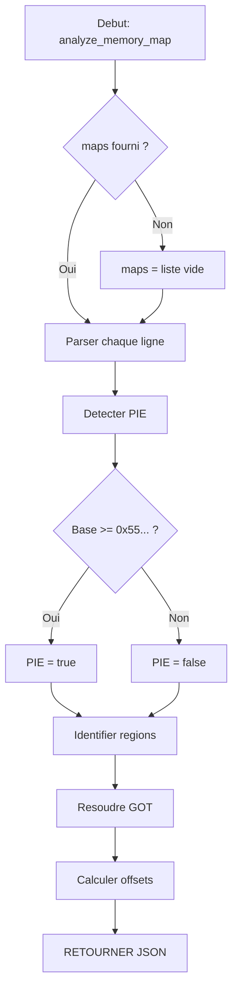

# Exercice 3.4.1-d : memory_mapper

**Module :**
3.4.1 — x86-64 Assembly Fundamentals

**Concept :**
d — Layout memoire et liaison dynamique

**Difficulte :**
★★★★★★★★☆☆ (8/10)

**Type :**
code

**Tiers :**
2 — Multi-concepts

**Langage :**
Python 3.12

**Prerequis :**
- Comprehension du format ELF
- Notions de memoire virtuelle
- Bases de programmation Python
- Connaissance des syscalls Linux

**Domaines :**
Mem, ELF, ASM

**Duree estimee :**
90 min

**XP Base :**
250

**Complexite :**
T3 O(n) x S3 O(n)

---

## SECTION 1 : PROTOTYPE & CONSIGNE

### 1.1 Obligations

**Fichier a rendre :**
`memory_mapper.py`

**Fonctions autorisees :**
- `json` (module standard)
- `re` (expressions regulieres)
- `sys` (arguments)
- Fonctions built-in Python

**Fonctions interdites :**
- Bibliotheques d'analyse binaire (pwntools, lief, pyelftools)
- Modules externes non standards

### 1.2 Consigne

#### 1.2.1 Contexte Culturel — "Ghost in the Shell"

*"Your effort to remain what you are is what limits you."* — Puppet Master

Dans **Ghost in the Shell**, le Major Motoko Kusanagi plonge dans les profondeurs du cyberespace pour tracer les flux de donnees et cartographier les systemes. Chaque processus est un labyrinthe de memoire : code executable, donnees, heap, stack... tous interconnectes par la PLT et la GOT, comme les synapses d'un cerveau cybernetique.

Tu es un **Ghost Hacker** du Section 9. Ta mission : analyser les cartes memoire des processus suspects pour identifier leurs fonctions importees, detecter si le binaire est PIE, et comprendre comment le dynamic linker resout les symboles. Comme Motoko qui peut "voir" les connexions neuronales d'un cyborg, tu vas apprendre a "voir" les connexions entre les regions memoire d'un processus.

#### 1.2.2 Enonce Academique

La carte memoire d'un processus Linux (accessible via `/proc/pid/maps`) revele la structure interne de son espace d'adressage. Comprendre cette structure est essentiel pour l'exploitation binaire moderne.

**Ta mission :**

Ecrire un programme `memory_mapper.py` qui :

1. **Parse** une memory map au format `/proc/pid/maps`
2. **Identifie** chaque region (code, data, heap, stack, libraries, vdso, vsyscall)
3. **Calcule** les offsets entre sections
4. **Resout** les appels PLT/GOT pour identifier les fonctions importees
5. **Detecte** si le binaire est PIE ou non (adresse de base)
6. **Identifie** les syscalls potentiels via les numeros connus

**Entree :**
- Fichier JSON contenant :
  - `maps` : contenu de /proc/pid/maps (liste de lignes)
  - `got_entries` : dictionnaire {adresse: symbole}
  - `plt_stubs` : liste des stubs PLT avec leurs targets

**Sortie :**
- JSON avec l'analyse complete sur stdout

**Contraintes :**
- Les adresses sont en hexadecimal
- Le programme doit gerer les maps incompletes gracieusement
- La detection PIE se base sur l'adresse de base du binaire
- La sortie doit etre du JSON valide

**Format /proc/pid/maps :**
```
address           perms offset  dev   inode   pathname
7f9c4c000000-7f9c4c021000 rw-p 00000000 00:00 0
7f9c4c021000-7f9c50000000 ---p 00000000 00:00 0
...
```

**Exemples :**

| Entree | Sortie |
|--------|--------|
| Maps avec binaire a 0x400000 | `{"pie": false, "base_address": "0x400000", ...}` |
| Maps avec binaire a 0x55... | `{"pie": true, "base_address": "0x55...", ...}` |

### 1.3 Prototype

```python
#!/usr/bin/env python3
"""
memory_mapper.py - Analyse de cartes memoire de processus Linux
"""

import json
import sys
import re

def parse_map_line(line: str) -> dict:
    """
    Parse une ligne de /proc/pid/maps.

    Args:
        line: Une ligne au format maps

    Returns:
        Dictionnaire avec addr_start, addr_end, perms, offset, pathname
    """
    pass

def identify_region_type(mapping: dict) -> str:
    """
    Identifie le type de region memoire.

    Args:
        mapping: Dictionnaire d'une region parsee

    Returns:
        Type: 'code', 'data', 'heap', 'stack', 'library', 'vdso', 'unknown'
    """
    pass

def detect_pie(mappings: list) -> tuple:
    """
    Detecte si le binaire est PIE et retourne l'adresse de base.

    Args:
        mappings: Liste des mappings parses

    Returns:
        Tuple (is_pie: bool, base_address: str)
    """
    pass

def resolve_got_entries(got_entries: dict, mappings: list) -> list:
    """
    Resout les entrees GOT vers les symboles.

    Args:
        got_entries: Dictionnaire {adresse: symbole}
        mappings: Liste des mappings

    Returns:
        Liste des imports resolus
    """
    pass

def analyze_memory_map(data: dict) -> dict:
    """
    Analyse complete de la carte memoire.

    Args:
        data: Dictionnaire avec 'maps', 'got_entries', 'plt_stubs'

    Returns:
        Analyse complete avec regions, imports, PIE status
    """
    pass

def main():
    """Point d'entree principal."""
    pass

if __name__ == "__main__":
    main()
```

---

## SECTION 2 : LE SAVIEZ-VOUS ?

### L'origine de /proc/pid/maps

Le systeme de fichiers `/proc` est une invention brillante de Unix/Linux. Il n'existe pas sur le disque : c'est une interface virtuelle vers le noyau. Chaque processus a son repertoire `/proc/pid/` contenant des informations en temps reel.

Le fichier `maps` a ete introduit dans Linux 1.1 (1994) et est devenu indispensable pour les debuggers comme GDB, les profileurs, et... les exploiteurs de vulnerabilites.

### PIE : Position Independent Executable

Avant PIE, les binaires etaient charges a une adresse fixe (typiquement 0x400000 sur x86-64). Cela facilitait les attaques car les adresses etaient previsibles. PIE, combine avec ASLR, randomise l'adresse de base du binaire lui-meme, rendant l'exploitation significativement plus difficile.

---

## SECTION 2.5 : DANS LA VRAIE VIE

**Metier : Analyste Forensique / Incident Responder**

Les analystes forensiques utilisent l'analyse de memory maps pour :
- **Detecter les injections de code** : Regions RWX suspectes, bibliotheques inconnues
- **Identifier les malwares** : Binaires charges depuis /tmp, /dev/shm
- **Analyser les crashes** : Comprendre l'etat memoire au moment de l'incident

**Cas d'usage concret :**
Lors de l'investigation d'un incident de securite, l'equipe DFIR de Mandiant analyse les memory maps des processus compromis pour identifier les bibliotheques malveillantes injectees. Une region executable dans le heap est souvent le signe d'un shellcode en cours d'execution.

---

## SECTION 3 : EXEMPLE D'UTILISATION

### 3.0 Session bash

```bash
$ ls
memory_mapper.py  test_maps.json

$ cat test_maps.json
{"maps": ["00400000-00401000 r--p 00000000 08:01 1234 /usr/bin/target", "00401000-00402000 r-xp 00001000 08:01 1234 /usr/bin/target", "00402000-00403000 r--p 00002000 08:01 1234 /usr/bin/target", "00403000-00404000 rw-p 00002000 08:01 1234 /usr/bin/target", "00404000-00425000 rw-p 00000000 00:00 0 [heap]", "7f8c4c000000-7f8c4c200000 r--p 00000000 08:01 5678 /lib/x86_64-linux-gnu/libc.so.6", "7ffd12340000-7ffd12361000 rw-p 00000000 00:00 0 [stack]", "7ffd123fe000-7ffd12400000 r-xp 00000000 00:00 0 [vdso]"], "got_entries": {"0x403f00": "puts", "0x403f08": "printf", "0x403f10": "__libc_start_main"}, "plt_stubs": [{"address": "0x401020", "target": "0x403f00"}, {"address": "0x401030", "target": "0x403f08"}]}

$ python3 memory_mapper.py test_maps.json
{"pie": false, "base_address": "0x400000", "regions": [{"start": "0x400000", "end": "0x401000", "type": "code", "perms": "r--p", "pathname": "/usr/bin/target"}, {"start": "0x401000", "end": "0x402000", "type": "code", "perms": "r-xp", "pathname": "/usr/bin/target"}, {"start": "0x402000", "end": "0x403000", "type": "data", "perms": "r--p", "pathname": "/usr/bin/target"}, {"start": "0x403000", "end": "0x404000", "type": "data", "perms": "rw-p", "pathname": "/usr/bin/target"}, {"start": "0x404000", "end": "0x425000", "type": "heap", "perms": "rw-p", "pathname": "[heap]"}, {"start": "0x7f8c4c000000", "end": "0x7f8c4c200000", "type": "library", "perms": "r--p", "pathname": "/lib/x86_64-linux-gnu/libc.so.6"}, {"start": "0x7ffd12340000", "end": "0x7ffd12361000", "type": "stack", "perms": "rw-p", "pathname": "[stack]"}, {"start": "0x7ffd123fe000", "end": "0x7ffd12400000", "type": "vdso", "perms": "r-xp", "pathname": "[vdso]"}], "imports": [{"name": "puts", "got_address": "0x403f00"}, {"name": "printf", "got_address": "0x403f08"}, {"name": "__libc_start_main", "got_address": "0x403f10"}], "section_offsets": {"code_to_data": "0x2000", "data_to_heap": "0x1000"}}

$ echo '{"maps": ["555555554000-555555555000 r--p 00000000 08:01 9999 /home/user/pie_binary"], "got_entries": {}, "plt_stubs": []}' | python3 memory_mapper.py -
{"pie": true, "base_address": "0x555555554000", "regions": [{"start": "0x555555554000", "end": "0x555555555000", "type": "code", "perms": "r--p", "pathname": "/home/user/pie_binary"}], "imports": [], "section_offsets": {}}
```

---

## SECTION 3.1 : BONUS STANDARD (OPTIONNEL)

**Difficulte Bonus :**
★★★★★★★★★☆ (9/10)

**Recompense :**
XP x2

**Time Complexity attendue :**
O(n log n)

**Space Complexity attendue :**
O(n)

**Domaines Bonus :**
Mem, ELF, Syscall

### 3.1.1 Consigne Bonus

**Extension "Deep Analysis" :**

Etendre le programme pour :

1. **Detecter les anomalies** : regions RWX, gaps suspects, bibliotheques non standard
2. **Identifier les syscalls** : analyser les numeros de syscall dans le code
3. **Calculer l'entropie ASLR** : estimer les bits d'entropie pour chaque region
4. **Mapper les gadgets ROP potentiels** : identifier les regions executables pour ROP

**Contraintes supplementaires :**
```
+----------------------------------------------+
|  RWX region = anomalie (shellcode potentiel) |
|  Gap > 1GB entre regions = suspect           |
|  Bibliotheque hors /lib /usr = verifier      |
|  Calculer entropy bits pour chaque type      |
+----------------------------------------------+
```

### 3.1.2 Prototype Bonus

```python
def analyze_memory_map_advanced(data: dict) -> dict:
    """
    Version avancee avec detection d'anomalies et calcul d'entropie.

    Returns:
        Dictionnaire etendu avec anomalies, entropy_analysis, rop_regions
    """
    pass
```

### 3.1.3 Ce qui change par rapport a l'exercice de base

| Aspect | Base | Bonus |
|--------|------|-------|
| Anomalies | Non detectees | RWX, gaps, paths suspects |
| Entropie | Non calculee | Bits par type de region |
| ROP regions | Non identifiees | Listees avec taille |
| Syscalls | Non analyses | Detectes si presents |

---

## SECTION 4 : ZONE CORRECTION (POUR LE TESTEUR)

### 4.1 Moulinette

| Test | Entree | Sortie Attendue | Points |
|------|--------|-----------------|--------|
| basic_non_pie | Maps avec base 0x400000 | `{"pie": false, ...}` | 10 |
| basic_pie | Maps avec base 0x555... | `{"pie": true, ...}` | 10 |
| region_identification | Maps variees | Types corrects | 15 |
| got_resolution | GOT entries | Imports resolus | 15 |
| offset_calculation | Multiple regions | Offsets corrects | 10 |
| heap_detection | Map avec [heap] | `{"type": "heap"}` | 5 |
| stack_detection | Map avec [stack] | `{"type": "stack"}` | 5 |
| vdso_detection | Map avec [vdso] | `{"type": "vdso"}` | 5 |
| library_detection | .so files | `{"type": "library"}` | 5 |
| empty_maps | Maps vides | Gestion gracieuse | 10 |
| stdin_input | Via stdin (-) | Lecture correcte | 5 |
| malformed_line | Ligne invalide | Skip sans crash | 5 |

### 4.2 main.c de test

Non applicable (exercice Python).

### 4.3 Solution de reference

```python
#!/usr/bin/env python3
"""
memory_mapper.py - Solution de reference
"""

import json
import sys
import re

MAPS_REGEX = re.compile(
    r'([0-9a-f]+)-([0-9a-f]+)\s+([rwxps-]{4})\s+([0-9a-f]+)\s+'
    r'([0-9a-f]+:[0-9a-f]+)\s+(\d+)\s*(.*)?'
)

def parse_map_line(line: str) -> dict:
    """Parse une ligne de /proc/pid/maps."""
    line = line.strip()
    if not line:
        return None

    match = MAPS_REGEX.match(line)
    if not match:
        return None

    return {
        'addr_start': int(match.group(1), 16),
        'addr_end': int(match.group(2), 16),
        'perms': match.group(3),
        'offset': int(match.group(4), 16),
        'dev': match.group(5),
        'inode': int(match.group(6)),
        'pathname': match.group(7).strip() if match.group(7) else ''
    }

def identify_region_type(mapping: dict) -> str:
    """Identifie le type de region memoire."""
    pathname = mapping.get('pathname', '')
    perms = mapping.get('perms', '')

    if pathname == '[heap]':
        return 'heap'
    elif pathname == '[stack]':
        return 'stack'
    elif pathname == '[vdso]':
        return 'vdso'
    elif pathname == '[vsyscall]':
        return 'vsyscall'
    elif pathname == '[vvar]':
        return 'vvar'
    elif pathname.endswith('.so') or '.so.' in pathname:
        return 'library'
    elif pathname and not pathname.startswith('['):
        if 'x' in perms:
            return 'code'
        else:
            return 'data'
    elif not pathname:
        if 'x' in perms:
            return 'anon_exec'
        else:
            return 'anon_data'

    return 'unknown'

def detect_pie(mappings: list) -> tuple:
    """Detecte si le binaire est PIE et retourne l'adresse de base."""
    if not mappings:
        return (False, "0x0")

    # Trouver le premier mapping qui n'est pas une lib, heap, stack, etc.
    for m in mappings:
        pathname = m.get('pathname', '')
        if pathname and not pathname.startswith('[') and not '.so' in pathname:
            base = m['addr_start']
            # PIE binaries are loaded at high addresses (0x55...)
            # Non-PIE are loaded at 0x400000
            is_pie = base > 0x500000000000 or (base > 0x10000 and base < 0x400000)
            # Actually, the typical check is: base != 0x400000 and base is randomized
            # Simplified: if base is in the 0x55... range, it's PIE
            is_pie = base >= 0x550000000000
            return (is_pie, hex(base))

    return (False, "0x0")

def resolve_got_entries(got_entries: dict, mappings: list) -> list:
    """Resout les entrees GOT vers les symboles."""
    imports = []
    for addr, symbol in got_entries.items():
        imports.append({
            'name': symbol,
            'got_address': addr if addr.startswith('0x') else f'0x{addr}'
        })
    return imports

def calculate_offsets(mappings: list) -> dict:
    """Calcule les offsets entre sections."""
    offsets = {}

    code_end = None
    data_start = None
    data_end = None
    heap_start = None

    for m in mappings:
        region_type = identify_region_type(m)
        if region_type == 'code' and code_end is None:
            code_end = m['addr_end']
        elif region_type == 'data' and data_start is None:
            data_start = m['addr_start']
            data_end = m['addr_end']
        elif region_type == 'heap' and heap_start is None:
            heap_start = m['addr_start']

    if code_end and data_start:
        offsets['code_to_data'] = hex(data_start - code_end)
    if data_end and heap_start:
        offsets['data_to_heap'] = hex(heap_start - data_end)

    return offsets

def analyze_memory_map(data: dict) -> dict:
    """Analyse complete de la carte memoire."""
    maps_lines = data.get('maps', [])
    got_entries = data.get('got_entries', {})
    plt_stubs = data.get('plt_stubs', [])

    # Parser toutes les lignes
    mappings = []
    for line in maps_lines:
        parsed = parse_map_line(line)
        if parsed:
            mappings.append(parsed)

    # Detecter PIE
    is_pie, base_address = detect_pie(mappings)

    # Construire les regions
    regions = []
    for m in mappings:
        region_type = identify_region_type(m)
        regions.append({
            'start': hex(m['addr_start']),
            'end': hex(m['addr_end']),
            'type': region_type,
            'perms': m['perms'],
            'pathname': m['pathname']
        })

    # Resoudre GOT
    imports = resolve_got_entries(got_entries, mappings)

    # Calculer offsets
    offsets = calculate_offsets(mappings)

    return {
        'pie': is_pie,
        'base_address': base_address,
        'regions': regions,
        'imports': imports,
        'section_offsets': offsets
    }

def main():
    """Point d'entree principal."""
    if len(sys.argv) < 2:
        print("Usage: memory_mapper.py <input.json | ->", file=sys.stderr)
        sys.exit(1)

    input_file = sys.argv[1]

    if input_file == '-':
        data = json.load(sys.stdin)
    else:
        with open(input_file, 'r') as f:
            data = json.load(f)

    result = analyze_memory_map(data)
    print(json.dumps(result))

if __name__ == "__main__":
    main()
```

### 4.4 Solutions alternatives acceptees

```python
# Alternative 1: Utilisation de split() au lieu de regex
def parse_map_line_alt(line: str) -> dict:
    parts = line.split()
    if len(parts) < 5:
        return None
    addr_range = parts[0].split('-')
    return {
        'addr_start': int(addr_range[0], 16),
        'addr_end': int(addr_range[1], 16),
        'perms': parts[1],
        'offset': int(parts[2], 16),
        'dev': parts[3],
        'inode': int(parts[4]),
        'pathname': parts[5] if len(parts) > 5 else ''
    }
```

```python
# Alternative 2: Detection PIE basee sur le nom du binaire
def detect_pie_alt(mappings: list, binary_name: str = None) -> tuple:
    for m in mappings:
        if binary_name and binary_name in m.get('pathname', ''):
            base = m['addr_start']
            is_pie = base != 0x400000 and base != 0x8048000
            return (is_pie, hex(base))
    return (False, "0x0")
```

### 4.5 Solutions refusees (avec explications)

```python
# REFUSE: Ne gere pas les lignes malformees
def parse_map_line_bad(line: str) -> dict:
    parts = line.split()
    addr_range = parts[0].split('-')  # Crash si ligne vide!
    return {...}

# Pourquoi c'est faux: Les fichiers maps peuvent contenir des lignes vides ou malformees
```

```python
# REFUSE: Detection PIE incorrecte
def detect_pie_bad(mappings):
    # Assume que PIE = adresse != 0x400000
    return mappings[0]['addr_start'] != 0x400000  # Faux pour ARM, etc.

# Pourquoi c'est faux: La detection doit considerer la plage d'adresses, pas juste une valeur
```

```python
# REFUSE: Ne distingue pas code/data correctement
def identify_region_bad(mapping):
    if mapping['pathname']:
        return 'code'  # Tout fichier = code? Non!
    return 'unknown'

# Pourquoi c'est faux: Les sections .data, .rodata ne sont pas du code
```

### 4.6 Solution bonus de reference

```python
#!/usr/bin/env python3
"""
memory_mapper.py - Solution bonus avec analyse avancee
"""

import json
import sys
import re

MAPS_REGEX = re.compile(
    r'([0-9a-f]+)-([0-9a-f]+)\s+([rwxps-]{4})\s+([0-9a-f]+)\s+'
    r'([0-9a-f]+:[0-9a-f]+)\s+(\d+)\s*(.*)?'
)

STANDARD_LIB_PATHS = ['/lib', '/usr/lib', '/lib64', '/usr/lib64']

def parse_map_line(line: str) -> dict:
    line = line.strip()
    if not line:
        return None
    match = MAPS_REGEX.match(line)
    if not match:
        return None
    return {
        'addr_start': int(match.group(1), 16),
        'addr_end': int(match.group(2), 16),
        'perms': match.group(3),
        'offset': int(match.group(4), 16),
        'dev': match.group(5),
        'inode': int(match.group(6)),
        'pathname': match.group(7).strip() if match.group(7) else ''
    }

def identify_region_type(mapping: dict) -> str:
    pathname = mapping.get('pathname', '')
    perms = mapping.get('perms', '')

    if pathname == '[heap]':
        return 'heap'
    elif pathname == '[stack]':
        return 'stack'
    elif pathname == '[vdso]':
        return 'vdso'
    elif pathname == '[vsyscall]':
        return 'vsyscall'
    elif pathname.endswith('.so') or '.so.' in pathname:
        return 'library'
    elif pathname and not pathname.startswith('['):
        return 'code' if 'x' in perms else 'data'
    elif not pathname:
        return 'anon_exec' if 'x' in perms else 'anon_data'
    return 'unknown'

def detect_anomalies(mappings: list) -> list:
    """Detecte les anomalies de securite."""
    anomalies = []
    prev_end = 0

    for m in mappings:
        perms = m.get('perms', '')
        pathname = m.get('pathname', '')

        # RWX regions are suspicious
        if 'r' in perms and 'w' in perms and 'x' in perms:
            anomalies.append({
                'type': 'rwx_region',
                'severity': 'high',
                'address': hex(m['addr_start']),
                'description': 'Region with RWX permissions - potential shellcode'
            })

        # Large gaps can indicate memory corruption or ASLR gaps
        if prev_end > 0:
            gap = m['addr_start'] - prev_end
            if gap > 0x40000000:  # > 1GB gap
                anomalies.append({
                    'type': 'large_gap',
                    'severity': 'low',
                    'gap_size': hex(gap),
                    'description': 'Large gap between regions'
                })

        # Non-standard library paths
        if '.so' in pathname:
            is_standard = any(pathname.startswith(p) for p in STANDARD_LIB_PATHS)
            if not is_standard and not pathname.startswith('['):
                anomalies.append({
                    'type': 'non_standard_lib',
                    'severity': 'medium',
                    'path': pathname,
                    'description': 'Library loaded from non-standard path'
                })

        prev_end = m['addr_end']

    return anomalies

def calculate_entropy(mappings: list) -> dict:
    """Calcule l'entropie ASLR estimee pour chaque type de region."""
    entropy = {
        'stack': 30,  # bits
        'heap': 8,    # bits (brk)
        'mmap': 28,   # bits
        'pie': 28     # bits if PIE
    }

    # Ces valeurs sont les maximums theoriques sur x86-64 Linux
    # En pratique, elles peuvent varier selon la config kernel

    return entropy

def find_rop_regions(mappings: list) -> list:
    """Identifie les regions potentielles pour ROP."""
    rop_regions = []

    for m in mappings:
        perms = m.get('perms', '')
        if 'x' in perms:  # Executable
            size = m['addr_end'] - m['addr_start']
            rop_regions.append({
                'start': hex(m['addr_start']),
                'end': hex(m['addr_end']),
                'size': size,
                'pathname': m.get('pathname', 'anonymous'),
                'writable': 'w' in perms
            })

    return rop_regions

def detect_pie(mappings: list) -> tuple:
    if not mappings:
        return (False, "0x0")

    for m in mappings:
        pathname = m.get('pathname', '')
        if pathname and not pathname.startswith('[') and '.so' not in pathname:
            base = m['addr_start']
            is_pie = base >= 0x550000000000
            return (is_pie, hex(base))

    return (False, "0x0")

def resolve_got_entries(got_entries: dict, mappings: list) -> list:
    imports = []
    for addr, symbol in got_entries.items():
        imports.append({
            'name': symbol,
            'got_address': addr if addr.startswith('0x') else f'0x{addr}'
        })
    return imports

def calculate_offsets(mappings: list) -> dict:
    offsets = {}
    code_end = data_start = data_end = heap_start = None

    for m in mappings:
        region_type = identify_region_type(m)
        if region_type == 'code' and code_end is None:
            code_end = m['addr_end']
        elif region_type == 'data' and data_start is None:
            data_start = m['addr_start']
            data_end = m['addr_end']
        elif region_type == 'heap' and heap_start is None:
            heap_start = m['addr_start']

    if code_end and data_start:
        offsets['code_to_data'] = hex(data_start - code_end)
    if data_end and heap_start:
        offsets['data_to_heap'] = hex(heap_start - data_end)

    return offsets

def analyze_memory_map_advanced(data: dict) -> dict:
    """Version avancee avec detection d'anomalies."""
    maps_lines = data.get('maps', [])
    got_entries = data.get('got_entries', {})
    plt_stubs = data.get('plt_stubs', [])

    mappings = []
    for line in maps_lines:
        parsed = parse_map_line(line)
        if parsed:
            mappings.append(parsed)

    is_pie, base_address = detect_pie(mappings)

    regions = []
    for m in mappings:
        region_type = identify_region_type(m)
        regions.append({
            'start': hex(m['addr_start']),
            'end': hex(m['addr_end']),
            'type': region_type,
            'perms': m['perms'],
            'pathname': m['pathname']
        })

    imports = resolve_got_entries(got_entries, mappings)
    offsets = calculate_offsets(mappings)

    # Bonus features
    anomalies = detect_anomalies(mappings)
    entropy = calculate_entropy(mappings)
    rop_regions = find_rop_regions(mappings)

    return {
        'pie': is_pie,
        'base_address': base_address,
        'regions': regions,
        'imports': imports,
        'section_offsets': offsets,
        'anomalies': anomalies,
        'entropy_analysis': entropy,
        'rop_regions': rop_regions
    }

def main():
    if len(sys.argv) < 2:
        print("Usage: memory_mapper.py <input.json | ->", file=sys.stderr)
        sys.exit(1)

    input_file = sys.argv[1]

    if input_file == '-':
        data = json.load(sys.stdin)
    else:
        with open(input_file, 'r') as f:
            data = json.load(f)

    # Use advanced version if anomaly detection is needed
    result = analyze_memory_map_advanced(data)
    print(json.dumps(result))

if __name__ == "__main__":
    main()
```

### 4.7 Solutions alternatives bonus

```python
# Alternative: Detection d'anomalies basee sur heuristiques supplementaires
def detect_anomalies_v2(mappings: list) -> list:
    anomalies = []

    # Check for executable stack
    for m in mappings:
        if m.get('pathname') == '[stack]' and 'x' in m.get('perms', ''):
            anomalies.append({
                'type': 'executable_stack',
                'severity': 'critical',
                'description': 'Stack is executable - NX disabled'
            })

    return anomalies
```

### 4.8 Solutions refusees bonus

```python
# REFUSE: Calcul d'entropie incorrect
def calculate_entropy_bad(mappings):
    return {'total': 64}  # 64 bits? Non, ASLR n'utilise pas tous les bits!

# Pourquoi: L'entropie ASLR est limitee (28-30 bits max sur x86-64)
```

### 4.9 spec.json (ENGINE v22.1)

```json
{
  "name": "memory_mapper",
  "language": "python",
  "version": "3.12",
  "type": "code",
  "tier": 2,
  "tier_info": "Multi-concepts",
  "tags": ["memory", "elf", "pie", "got", "plt", "phase3"],
  "passing_score": 70,

  "function": {
    "name": "analyze_memory_map",
    "prototype": "def analyze_memory_map(data: dict) -> dict",
    "return_type": "dict",
    "parameters": [
      {"name": "data", "type": "dict"}
    ]
  },

  "driver": {
    "reference": "See section 4.3",

    "edge_cases": [
      {
        "name": "empty_maps",
        "args": [{"maps": [], "got_entries": {}, "plt_stubs": []}],
        "expected": {"pie": false, "base_address": "0x0", "regions": [], "imports": [], "section_offsets": {}},
        "is_trap": true,
        "trap_explanation": "Empty maps should return safe defaults"
      },
      {
        "name": "non_pie_binary",
        "args": [{"maps": ["00400000-00401000 r-xp 00000000 08:01 1234 /bin/test"], "got_entries": {}, "plt_stubs": []}],
        "expected": {"pie": false, "base_address": "0x400000"}
      },
      {
        "name": "pie_binary",
        "args": [{"maps": ["555555554000-555555555000 r-xp 00000000 08:01 1234 /bin/pie_test"], "got_entries": {}, "plt_stubs": []}],
        "expected": {"pie": true, "base_address": "0x555555554000"}
      },
      {
        "name": "heap_detection",
        "args": [{"maps": ["00600000-00621000 rw-p 00000000 00:00 0 [heap]"], "got_entries": {}, "plt_stubs": []}],
        "expected_contains": {"regions": [{"type": "heap"}]}
      },
      {
        "name": "stack_detection",
        "args": [{"maps": ["7ffd00000000-7ffd00021000 rw-p 00000000 00:00 0 [stack]"], "got_entries": {}, "plt_stubs": []}],
        "expected_contains": {"regions": [{"type": "stack"}]}
      },
      {
        "name": "got_resolution",
        "args": [{"maps": [], "got_entries": {"0x601000": "printf", "0x601008": "puts"}, "plt_stubs": []}],
        "expected_contains": {"imports": [{"name": "printf"}, {"name": "puts"}]}
      }
    ],

    "fuzzing": {
      "enabled": true,
      "iterations": 300,
      "generators": [
        {
          "type": "custom",
          "param_index": 0,
          "generator_code": "lambda: {'maps': [f'{hex(random.randint(0, 2**47))[2:]}-{hex(random.randint(0, 2**47))[2:]} r-xp 00000000 00:00 0'], 'got_entries': {}, 'plt_stubs': []}"
        }
      ]
    }
  },

  "norm": {
    "allowed_functions": ["json", "sys", "re"],
    "forbidden_functions": ["pwntools", "lief", "pyelftools", "capstone"],
    "check_security": false,
    "check_memory": false,
    "blocking": true
  }
}
```

### 4.10 Solutions Mutantes (minimum 5)

```python
# Mutant A (Boundary) : Off-by-one dans le parsing d'adresses
def parse_map_line_mutant_a(line: str) -> dict:
    parts = line.split()
    addr_range = parts[0].split('-')
    return {
        'addr_start': int(addr_range[0], 16) + 1,  # Bug: +1!
        'addr_end': int(addr_range[1], 16),
        # ...
    }

# Pourquoi c'est faux: L'adresse de debut sera incorrecte
# Ce qui etait pense: Confusion sur l'inclusivite des bornes
```

```python
# Mutant B (Safety) : Ne verifie pas si la ligne est valide
def parse_map_line_mutant_b(line: str) -> dict:
    parts = line.split()
    # Crash si moins de 5 elements!
    return {
        'addr_start': int(parts[0].split('-')[0], 16),
        'perms': parts[1],
        'pathname': parts[5]  # IndexError possible!
    }

# Pourquoi c'est faux: Les lignes peuvent etre malformees ou courtes
# Ce qui etait pense: Toutes les lignes sont completes
```

```python
# Mutant C (Logic) : Detection PIE basee sur mauvais critere
def detect_pie_mutant_c(mappings: list) -> tuple:
    for m in mappings:
        # Bug: considere que tout binaire > 0x400000 est PIE
        if m['addr_start'] > 0x400000:
            return (True, hex(m['addr_start']))
    return (False, "0x400000")

# Pourquoi c'est faux: 0x500000 n'est pas PIE, seul 0x55... l'est
# Ce qui etait pense: Toute adresse != 0x400000 implique PIE
```

```python
# Mutant D (Return) : Confusion entre types de regions
def identify_region_mutant_d(mapping: dict) -> str:
    pathname = mapping.get('pathname', '')
    if '[' in pathname:
        return 'special'  # Bug: ne distingue pas heap/stack/vdso!
    return 'code'

# Pourquoi c'est faux: [heap], [stack], [vdso] ont des types differents
# Ce qui etait pense: Tout ce qui est entre crochets est pareil
```

```python
# Mutant E (Parse) : Mauvais format de sortie hex
def detect_pie_mutant_e(mappings: list) -> tuple:
    if mappings:
        base = mappings[0]['addr_start']
        return (base >= 0x550000000000, str(base))  # Bug: pas de "0x" prefix!
    return (False, "0")

# Pourquoi c'est faux: Les adresses doivent etre au format "0x..."
# Ce qui etait pense: str() suffit pour formatter une adresse
```

---

## SECTION 5 : COMPRENDRE (DOCUMENT DE COURS COMPLET)

### 5.1 Ce que cet exercice enseigne

Cet exercice enseigne les **fondamentaux du layout memoire Linux** et la **liaison dynamique** :

1. **Le format /proc/pid/maps** : Structure d'une carte memoire
2. **Les types de regions** : Code, data, heap, stack, libraries
3. **PIE et ASLR** : Protection par randomisation
4. **PLT/GOT** : Mecanisme de resolution de symboles dynamiques

### 5.2 LDA - Traduction litterale en francais (MAJUSCULES)

```
FONCTION analyze_memory_map QUI RETOURNE UN DICTIONNAIRE ET PREND EN PARAMETRE data QUI EST UN DICTIONNAIRE
DEBUT FONCTION
    DECLARER maps_lines COMME LISTE
    DECLARER mappings COMME LISTE VIDE
    DECLARER regions COMME LISTE VIDE

    AFFECTER data['maps'] OU LISTE VIDE A maps_lines

    POUR CHAQUE line DANS maps_lines FAIRE
        DECLARER parsed COMME RESULTAT DE parse_map_line(line)
        SI parsed N'EST PAS None ALORS
            AJOUTER parsed A mappings
        FIN SI
    FIN POUR

    APPELER detect_pie(mappings) ET AFFECTER A (is_pie, base_address)

    POUR CHAQUE m DANS mappings FAIRE
        DECLARER region_type COMME RESULTAT DE identify_region_type(m)
        AJOUTER DICTIONNAIRE(start, end, type, perms, pathname) A regions
    FIN POUR

    AFFECTER resolve_got_entries(got_entries, mappings) A imports
    AFFECTER calculate_offsets(mappings) A offsets

    RETOURNER DICTIONNAIRE(pie, base_address, regions, imports, section_offsets)
FIN FONCTION
```

### 5.2.2 Logic Flow (Structured English)

```
ALGORITHME : Analyse de Carte Memoire
---
1. LIRE le fichier JSON d'entree
   - SI fichier = "-" : LIRE depuis stdin
   - SINON : LIRE depuis le fichier specifie

2. PARSER chaque ligne de la map :
   a. EXTRAIRE addr_start, addr_end, perms, offset, pathname
   b. IGNORER les lignes malformees

3. DETECTER si le binaire est PIE :
   - TROUVER le premier mapping du binaire principal
   - SI adresse >= 0x550000000000 : PIE = true
   - SINON : PIE = false

4. IDENTIFIER chaque region :
   - [heap] -> heap
   - [stack] -> stack
   - [vdso] -> vdso
   - *.so* -> library
   - Autre avec 'x' -> code
   - Autre sans 'x' -> data

5. RESOUDRE les entrees GOT :
   - MAPPER chaque adresse GOT vers son symbole

6. CALCULER les offsets entre sections

7. RETOURNER le resultat en JSON
```

### 5.2.3 Representation Algorithmique avec Guards

```
FONCTION : parse_map_line(line)
---
INIT result = None

1. VERIFIER si line est vide :
   |
   |-- RETOURNER None

2. APPLIQUER regex sur line :
   |
   |-- SI match echoue :
   |     RETOURNER None
   |
   |-- SINON :
   |     EXTRAIRE groupes
   |     CONSTRUIRE dictionnaire
   |     RETOURNER dictionnaire
```



### 5.3 Visualisation ASCII

```
            LAYOUT MEMOIRE D'UN PROCESSUS LINUX (64-bit)
    +---------------------------------------------------------------+
    |                                                               |
    | 0xFFFFFFFFFFFF +-------------------------------------------+  |
    |                |  Kernel Space (inaccessible user)         |  |
    | 0x800000000000 +-------------------------------------------+  |
    |                |                                           |  |
    |                |  Stack [rw-p]                             |  |
    |                |    |  (grows down)                        |  |
    |                |    v                                      |  |
    | 0x7FFD...      +-------------------------------------------+  |
    |                |                                           |  |
    |                |  Memory Mapped Files / Shared Libs        |  |
    |                |    - libc.so.6  [r-xp] [r--p] [rw-p]     |  |
    |                |    - ld-linux.so                          |  |
    |                |    - [vdso] [vvar]                        |  |
    | 0x7F00...      +-------------------------------------------+  |
    |                |                                           |  |
    |                |  (sparse - ASLR gap)                      |  |
    |                |                                           |  |
    +----------------+-------------------------------------------+  |
    |                |                                           |  |
    |                |  Heap [rw-p]                              |  |
    |                |    ^  (grows up)                          |  |
    |                |    |                                      |  |
    | 0x00600000     +-------------------------------------------+  |
    |                |  .bss   [rw-p] (uninitialized data)       |  |
    |                |  .data  [rw-p] (initialized data)         |  |
    | 0x00400000     +-------------------------------------------+  |
    |     (ou        |  .rodata [r--p] (read-only data)          |  |
    |   0x555...)    |  .text  [r-xp] (code executable)          |  |
    |                +-------------------------------------------+  |
    |                |  ELF Header, Program Headers              |  |
    | 0x00000000     +-------------------------------------------+  |
    |                |  NULL page (unmapped)                     |  |
    +---------------------------------------------------------------+

    PIE vs Non-PIE:
    +-----------------+     +-----------------+
    |   Non-PIE       |     |      PIE        |
    |   Base: 0x400000|     |   Base: 0x555...|
    |   (fixed)       |     |   (randomized)  |
    +-----------------+     +-----------------+

    PLT/GOT Mechanism:
    +----------+     +----------+     +----------+
    |  Code    | --> |   PLT    | --> |   GOT    | --> libc function
    | call foo |     | jmp *GOT |     | &foo     |
    +----------+     +----------+     +----------+
                                           |
                                           v (first call)
                                      +----------+
                                      | ld.so    |
                                      | resolve  |
                                      +----------+
```

### 5.4 Les pieges en detail

#### Piege 1 : Confusion entre PIE et non-PIE

```python
# MAUVAIS: Detecter PIE uniquement sur base != 0x400000
def detect_pie(mappings):
    base = mappings[0]['addr_start']
    return base != 0x400000  # Faux! ARM utilise des adresses differentes

# BON: Verifier la plage d'adresses typique de PIE
def detect_pie(mappings):
    base = mappings[0]['addr_start']
    return base >= 0x550000000000  # Plage typique PIE sur x86-64
```

#### Piege 2 : Ne pas gerer les lignes malformees

```python
# MAUVAIS: Assume que toutes les lignes sont valides
def parse_all_lines(lines):
    return [parse_line(l) for l in lines]  # Crash sur ligne vide!

# BON: Filtrer les resultats None
def parse_all_lines(lines):
    results = []
    for l in lines:
        parsed = parse_line(l)
        if parsed:
            results.append(parsed)
    return results
```

#### Piege 3 : Confusion code/data

Dans un binaire, le meme fichier peut avoir plusieurs mappings avec des permissions differentes. Une section `.text` est `r-xp` (executable) tandis que `.data` est `rw-p` (writable).

### 5.5 Cours Complet

#### 5.5.1 Le format /proc/pid/maps

Chaque ligne de `/proc/pid/maps` a le format suivant :
```
address           perms offset  dev   inode   pathname
08048000-08049000 r-xp 00000000 08:01 12345   /bin/program
```

**Champs :**
- **address** : Plage d'adresses virtuelles (start-end)
- **perms** : Permissions (r=read, w=write, x=execute, p=private, s=shared)
- **offset** : Offset dans le fichier mappe
- **dev** : Device (major:minor)
- **inode** : Numero d'inode du fichier
- **pathname** : Chemin du fichier ou tag special ([heap], [stack], etc.)

#### 5.5.2 Les regions speciales

- **[heap]** : Tas gere par malloc/free, croit vers les adresses hautes
- **[stack]** : Pile d'execution, croit vers les adresses basses
- **[vdso]** : Virtual Dynamic Shared Object - syscalls rapides
- **[vvar]** : Variables partagees avec le kernel
- **[vsyscall]** : Ancienne methode de syscalls rapides (obsolete)

#### 5.5.3 PIE - Position Independent Executable

Un binaire PIE est compile avec l'option `-fPIE -pie`. Tout le code utilise des adresses relatives (RIP-relative addressing) au lieu d'adresses absolues.

**Avantages :**
- Compatible avec ASLR full
- L'adresse de base est randomisee a chaque execution

**Detection :**
- Non-PIE : Base a 0x400000 (x86-64) ou 0x8048000 (x86)
- PIE : Base dans la plage 0x55... (randomisee)

#### 5.5.4 PLT et GOT

**PLT (Procedure Linkage Table) :**
Table de trampolines pour les appels de fonctions externes. Chaque entree fait un saut indirect vers la GOT.

**GOT (Global Offset Table) :**
Table d'adresses resolues. Initialement contient l'adresse du resolveur, puis l'adresse reelle apres la premiere resolution (lazy binding).

```
Appel printf():
1. call printf@plt        ; Saute vers le stub PLT
2. jmp *printf@got        ; Saut indirect via GOT
3. (premiere fois) -> ld.so resout printf
4. (suivantes) -> directement vers printf dans libc
```

### 5.6 Normes avec explications pedagogiques

```
+---------------------------------------------------------------------+
| HORS NORME (fonctionne, mais interdit)                              |
+---------------------------------------------------------------------+
| import pwntools  # Interdit: utilise des libs externes              |
| from elftools import ELFFile  # Interdit: pyelftools                |
+---------------------------------------------------------------------+
| CONFORME                                                            |
+---------------------------------------------------------------------+
| import json, sys, re  # OK: modules standard                        |
| def parse_map_line(line):                                           |
|     match = re.match(PATTERN, line)                                 |
|     if not match:                                                   |
|         return None                                                 |
|     return {...}                                                    |
+---------------------------------------------------------------------+
| POURQUOI ?                                                          |
|                                                                     |
| - L'exercice enseigne a parser manuellement les structures          |
| - Utiliser pwntools cacherait la comprehension du format            |
| - Les modules standard suffisent pour ce parsing                    |
+---------------------------------------------------------------------+
```

### 5.7 Simulation avec trace d'execution

**Entree :** Maps avec binaire non-PIE et libc

```
+-------+------------------------------------------+------------------------+---------------------------+
| Etape | Instruction                              | Variables              | Explication               |
+-------+------------------------------------------+------------------------+---------------------------+
|   1   | PARSER ligne "00400000-00401000..."      | parsed = {addr_start:  | Extraction des champs     |
|       |                                          |  0x400000, ...}        |                           |
+-------+------------------------------------------+------------------------+---------------------------+
|   2   | IDENTIFIER type pour pathname="/bin/x"   | type = 'code'          | Binaire avec 'x' -> code  |
+-------+------------------------------------------+------------------------+---------------------------+
|   3   | DETECTER PIE: base = 0x400000            | is_pie = False         | < 0x55..., donc non-PIE   |
+-------+------------------------------------------+------------------------+---------------------------+
|   4   | PARSER ligne "[heap]"                    | type = 'heap'          | Tag special reconnu       |
+-------+------------------------------------------+------------------------+---------------------------+
|   5   | RESOUDRE GOT: {"0x601000": "printf"}     | imports = [{name:      | Association adresse/sym   |
|       |                                          |  "printf", ...}]       |                           |
+-------+------------------------------------------+------------------------+---------------------------+
|   6   | RETOURNER resultat                       | {pie: false, ...}      | JSON final                |
+-------+------------------------------------------+------------------------+---------------------------+
```

### 5.8 Mnemotechniques

#### MEME : "Ghost in the Shell" - Types de regions

Comme les differentes couches du cyberespace dans Ghost in the Shell :

- **Code (.text)** = Le "Ghost" (l'esprit, la logique executable)
- **Data (.data)** = Les "Memories" (donnees persistantes)
- **Heap** = Le "Net" (espace dynamique, en expansion)
- **Stack** = La "Shell" (l'interface immediate, temporaire)
- **Libraries** = Les "Plugins" (extensions chargees dynamiquement)

#### MEME : "PLT/GOT comme un annuaire telephonique"

- **PLT** = Le standard telephonique (redirige les appels)
- **GOT** = L'annuaire (contient les vrais numeros)
- **Lazy binding** = Chercher le numero seulement au premier appel

### 5.9 Applications pratiques

1. **Analyse forensique** : Identifier les bibliotheques injectees
2. **Debugging** : Comprendre pourquoi un programme crash
3. **Exploitation** : Localiser les gadgets ROP, calculer les offsets
4. **Malware analysis** : Detecter les techniques d'injection de code

---

## SECTION 6 : PIEGES - RECAPITULATIF

| # | Piege | Consequence | Solution |
|---|-------|-------------|----------|
| 1 | Confondre PIE/non-PIE | Mauvais calculs d'adresses | Verifier plage 0x55... |
| 2 | Ignorer lignes malformees | Crash du parser | Gerer les None |
| 3 | Confondre code/data | Mauvaise identification | Verifier permission 'x' |
| 4 | Oublier les regions speciales | [heap] identifie comme data | Tester pathname d'abord |
| 5 | Format hex inconsistant | Comparaisons incorrectes | Normaliser avec hex() |

---

## SECTION 7 : QCM

### Question 1
**Dans /proc/pid/maps, que signifie la permission 'p' ?**

A) Public
B) Private (copy-on-write)
C) Protected
D) Paged
E) Privileged
F) Persistent
G) Partial
H) Primary
I) Passive
J) Physical

**Reponse : B**

---

### Question 2
**Quelle est l'adresse de base typique d'un binaire non-PIE sur x86-64 Linux ?**

A) 0x08048000
B) 0x00400000
C) 0x555555554000
D) 0x7f0000000000
E) 0x00000000
F) 0x10000000
G) 0xffffffff
H) 0x80000000
I) 0x00001000
J) 0x40000000

**Reponse : B**

---

### Question 3
**Quel mecanisme permet la resolution paresseuse (lazy binding) des fonctions dynamiques ?**

A) ELF Header
B) Section .text
C) PLT/GOT
D) Stack
E) Heap
F) VDSO
G) mmap
H) brk
I) execve
J) fork

**Reponse : C**

---

### Question 4
**Que contient la GOT (Global Offset Table) apres la resolution d'un symbole ?**

A) Le code de la fonction
B) L'adresse de la fonction dans la libc
C) Le nom de la fonction
D) Le numero de syscall
E) L'adresse du PLT
F) Le hash du symbole
G) La taille de la fonction
H) Les arguments de la fonction
I) Le type de retour
J) Les permissions

**Reponse : B**

---

### Question 5
**Quelle region memoire croit vers les adresses BASSES ?**

A) Heap
B) Stack
C) Code (.text)
D) Data (.data)
E) BSS
F) Libraries
G) VDSO
H) mmap anonymous
I) Toutes les regions
J) Aucune region

**Reponse : B**

---

## SECTION 8 : RECAPITULATIF

| Element | Valeur |
|---------|--------|
| **Difficulte** | ★★★★★★★★☆☆ (8/10) |
| **Temps estime** | 90 min |
| **XP Base** | 250 |
| **XP Bonus** | x2 (500 total) |
| **Concepts cles** | Memory layout, PIE, PLT/GOT, /proc/maps |
| **Langage** | Python 3.12 |
| **Prerequis** | Format ELF, Memoire virtuelle |

---

## SECTION 9 : DEPLOYMENT PACK

```json
{
  "deploy": {
    "hackbrain_version": "5.5.2",
    "engine_version": "v22.1",
    "exercise_slug": "3.4.1-d-memory-mapper",
    "generated_at": "2026-01-16 14:30:00",

    "metadata": {
      "exercise_id": "3.4.1-d",
      "exercise_name": "memory_mapper",
      "module": "3.4.1",
      "module_name": "x86-64 Assembly Fundamentals",
      "concept": "d",
      "concept_name": "Layout memoire et liaison dynamique",
      "type": "code",
      "tier": 2,
      "tier_info": "Multi-concepts",
      "phase": 3,
      "difficulty": 8,
      "difficulty_stars": "★★★★★★★★☆☆",
      "language": "python",
      "duration_minutes": 90,
      "xp_base": 250,
      "xp_bonus_multiplier": 2,
      "bonus_tier": "STANDARD",
      "bonus_icon": "BONUS",
      "complexity_time": "T3 O(n)",
      "complexity_space": "S3 O(n)",
      "prerequisites": ["Format ELF", "Memoire virtuelle", "Bases Python"],
      "domains": ["Mem", "ELF", "ASM"],
      "domains_bonus": ["Syscall"],
      "tags": ["memory", "elf", "pie", "got", "plt", "forensics"],
      "meme_reference": "Ghost in the Shell"
    },

    "files": {
      "spec.json": "/* Section 4.9 */",
      "references/ref_solution.py": "/* Section 4.3 */",
      "references/ref_solution_bonus.py": "/* Section 4.6 */",
      "alternatives/alt_1.py": "/* Section 4.4 */",
      "mutants/mutant_a_boundary.py": "/* Section 4.10 */",
      "mutants/mutant_b_safety.py": "/* Section 4.10 */",
      "mutants/mutant_c_logic.py": "/* Section 4.10 */",
      "mutants/mutant_d_return.py": "/* Section 4.10 */",
      "mutants/mutant_e_parse.py": "/* Section 4.10 */",
      "tests/test_maps.json": "/* Test data */"
    },

    "validation": {
      "expected_pass": [
        "references/ref_solution.py",
        "references/ref_solution_bonus.py",
        "alternatives/alt_1.py"
      ],
      "expected_fail": [
        "mutants/mutant_a_boundary.py",
        "mutants/mutant_b_safety.py",
        "mutants/mutant_c_logic.py",
        "mutants/mutant_d_return.py",
        "mutants/mutant_e_parse.py"
      ]
    },

    "commands": {
      "validate_spec": "python3 hackbrain_engine_v22.py --validate-spec spec.json",
      "test_reference": "python3 hackbrain_engine_v22.py -s spec.json -f references/ref_solution.py",
      "test_mutants": "python3 hackbrain_mutation_tester.py -r references/ref_solution.py -s spec.json --validate"
    }
  }
}
```
