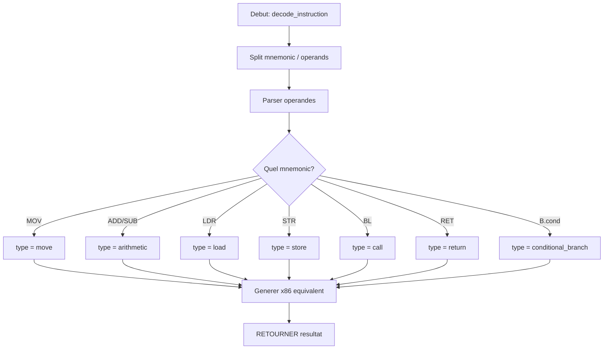

# Exercice 3.4.2-a : arm_decoder

**Module :**
3.4.2 — ARM64 Architecture

**Concept :**
a — Architecture ARM64 et comparaison x86

**Difficulte :**
★★★★★★★☆☆☆ (7/10)

**Type :**
code

**Tiers :**
2 — Multi-concepts

**Langage :**
Python 3.12

**Prerequis :**
- Comprehension de l'architecture x86-64
- Notions d'assembleur
- Bases de programmation Python
- Connaissance des conventions d'appel

**Domaines :**
ARM, ASM, CPU

**Duree estimee :**
75 min

**XP Base :**
200

**Complexite :**
T3 O(n) x S2 O(n)

---

## SECTION 1 : PROTOTYPE & CONSIGNE

### 1.1 Obligations

**Fichier a rendre :**
`arm_decoder.py`

**Fonctions autorisees :**
- `json` (module standard)
- `re` (expressions regulieres)
- `sys` (arguments)
- Fonctions built-in Python

**Fonctions interdites :**
- Bibliotheques de desassemblage (capstone, keystone)
- Modules externes non standards

### 1.2 Consigne

#### 1.2.1 Contexte Culturel — "Blade Runner 2049"

*"I've seen things you people wouldn't believe... Attack ships on fire off the shoulder of Orion."*

Dans **Blade Runner 2049**, les replicants sont des machines biologiques sophistiquees qui peuvent fonctionner sur differentes architectures. Comme l'Agent K qui doit identifier si un etre est humain ou replicant, tu dois apprendre a "decoder" l'architecture ARM64 et comprendre ses differences avec x86.

L'ARM64 est l'architecture des smartphones modernes, des Apple Silicon, et de nombreux serveurs cloud. Comme les replicants qui paraissent humains mais fonctionnent differemment, le code ARM64 semble similaire a x86 mais a ses propres subtilites : registres W/X, execution conditionnelle, et la fameuse convention AAPCS64.

Tu es un **Blade Runner du code** : ta mission est de decoder et analyser des instructions ARM64, identifier les patterns, et traduire les operations en concepts comprehensibles.

#### 1.2.2 Enonce Academique

L'architecture ARM64 (AArch64) est fondamentalement differente de x86-64 tout en partageant des concepts similaires. Comprendre cette architecture est essentiel pour l'exploitation sur mobile et les systemes Apple modernes.

**Ta mission :**

Ecrire un programme `arm_decoder.py` qui :

1. **Parse** des instructions ARM64 en format mnemonique
2. **Identifie** les patterns courants (load/store, arithmetic, branch)
3. **Traduit** les operations en pseudo-code comprehensible
4. **Detecte** les appels de fonction selon la convention AAPCS64
5. **Compare** avec l'equivalent conceptuel x86-64

**Entree :**
- Fichier JSON contenant :
  - `instructions` : liste d'instructions ARM64 (format: "mnemonic operands")
  - `context` : optionnel, informations de contexte (registres initiaux)

**Sortie :**
- JSON avec l'analyse de chaque instruction sur stdout

**Contraintes :**
- Les registres ARM64 sont X0-X30 (64-bit) ou W0-W30 (32-bit)
- SP est le stack pointer, PC le program counter
- Les immediats peuvent etre decimaux ou hexadecimaux (#0x...)
- La sortie doit etre du JSON valide

**Registres ARM64 :**
| Registre | Role |
|----------|------|
| X0-X7 | Arguments / Valeur retour |
| X8 | Indirect result location |
| X9-X15 | Caller-saved temporaires |
| X16-X17 | Intra-procedure call |
| X18 | Platform register |
| X19-X28 | Callee-saved |
| X29 (FP) | Frame Pointer |
| X30 (LR) | Link Register |
| SP | Stack Pointer |
| PC | Program Counter |

**Exemples :**

| Entree | Sortie |
|--------|--------|
| `{"instructions": ["MOV X0, #42"]}` | `{"decoded": [{"instruction": "MOV X0, #42", "operation": "X0 = 42", "type": "move"}]}` |

### 1.3 Prototype

```python
#!/usr/bin/env python3
"""
arm_decoder.py - Decodeur et analyseur d'instructions ARM64
"""

import json
import sys
import re

def parse_operand(operand: str) -> dict:
    """
    Parse un operande ARM64.

    Args:
        operand: Operande sous forme de chaine

    Returns:
        Dictionnaire avec type, value, et details
    """
    pass

def decode_instruction(instruction: str) -> dict:
    """
    Decode une instruction ARM64.

    Args:
        instruction: Instruction complete (mnemonic + operands)

    Returns:
        Dictionnaire avec mnemonic, operands, operation, type, x86_equivalent
    """
    pass

def detect_function_call(instructions: list) -> list:
    """
    Detecte les patterns d'appels de fonction AAPCS64.

    Args:
        instructions: Liste d'instructions decodees

    Returns:
        Liste des appels detectes avec arguments identifies
    """
    pass

def analyze_arm_code(data: dict) -> dict:
    """
    Analyse complete du code ARM64.

    Args:
        data: Dictionnaire avec 'instructions' et optionnellement 'context'

    Returns:
        Analyse complete avec decoded, function_calls, summary
    """
    pass

def main():
    """Point d'entree principal."""
    pass

if __name__ == "__main__":
    main()
```

---

## SECTION 2 : LE SAVIEZ-VOUS ?

### L'histoire d'ARM

ARM signifie "Advanced RISC Machines" (anciennement "Acorn RISC Machine"). Ne en 1983 chez Acorn Computers a Cambridge, UK, ARM etait a l'origine destine aux micro-ordinateurs BBC. Aujourd'hui, plus de 200 milliards de puces ARM ont ete produites, equipant 95% des smartphones mondiaux.

### Pourquoi ARM64 est different de x86

ARM est une architecture **RISC** (Reduced Instruction Set Computing) alors que x86 est **CISC** (Complex). En ARM :
- Toutes les instructions font 4 bytes (32 bits)
- Les operations memoire sont separees (load/store architecture)
- Execution conditionnelle sur presque toutes les instructions
- Registres nombreux et symetriques (pas de registres speciaux comme RAX)

### Le Link Register (LR/X30)

Contrairement a x86 qui push l'adresse de retour sur la stack, ARM stocke l'adresse de retour dans le Link Register (X30). C'est pourquoi `BL` (Branch with Link) sauvegarde PC+4 dans LR avant de sauter.

---

## SECTION 2.5 : DANS LA VRAIE VIE

**Metier : Security Researcher Mobile / iOS Security**

Les chercheurs en securite mobile utilisent l'analyse ARM64 pour :
- **Jailbreak iOS** : Comprendre le boot chain et les protections
- **Analyse de malware Android** : Les malwares sont souvent en ARM natif
- **Bug bounty** : Apple paie jusqu'a $2M pour des vulnerabilites kernel iOS

**Cas d'usage concret :**
L'equipe Project Zero de Google a decouvert la vulnerabilite "FORCEDENTRY" (CVE-2021-30860) utilisee par le spyware Pegasus. L'analyse a necessite une comprehension profonde du code ARM64 de l'application iMessage pour identifier le bug de parsing d'images.

---

## SECTION 3 : EXEMPLE D'UTILISATION

### 3.0 Session bash

```bash
$ ls
arm_decoder.py  test_arm.json

$ cat test_arm.json
{"instructions": ["MOV X0, #0x1337", "MOV X1, #0x100", "ADD X2, X0, X1", "SUB X3, X2, #16", "LDR X4, [SP, #8]", "STR X0, [X29, #-16]", "BL 0x4000", "RET"]}

$ python3 arm_decoder.py test_arm.json
{"decoded": [{"instruction": "MOV X0, #0x1337", "operation": "X0 = 0x1337", "type": "move", "x86_equivalent": "mov rax, 0x1337"}, {"instruction": "MOV X1, #0x100", "operation": "X1 = 0x100", "type": "move", "x86_equivalent": "mov rsi, 0x100"}, {"instruction": "ADD X2, X0, X1", "operation": "X2 = X0 + X1", "type": "arithmetic", "x86_equivalent": "lea rdx, [rax+rsi]"}, {"instruction": "SUB X3, X2, #16", "operation": "X3 = X2 - 16", "type": "arithmetic", "x86_equivalent": "lea rcx, [rdx-16]"}, {"instruction": "LDR X4, [SP, #8]", "operation": "X4 = *(SP + 8)", "type": "load", "x86_equivalent": "mov r8, [rsp+8]"}, {"instruction": "STR X0, [X29, #-16]", "operation": "*(X29 - 16) = X0", "type": "store", "x86_equivalent": "mov [rbp-16], rax"}, {"instruction": "BL 0x4000", "operation": "LR = PC+4; PC = 0x4000", "type": "call", "x86_equivalent": "call 0x4000"}, {"instruction": "RET", "operation": "PC = LR", "type": "return", "x86_equivalent": "ret"}], "function_calls": [{"address": "0x4000", "arguments_likely": ["X0=0x1337", "X1=0x100"]}], "summary": {"total_instructions": 8, "types": {"move": 2, "arithmetic": 2, "load": 1, "store": 1, "call": 1, "return": 1}}}

$ echo '{"instructions": ["CMP X0, #0", "B.EQ 0x1000", "B.NE 0x2000"]}' | python3 arm_decoder.py -
{"decoded": [{"instruction": "CMP X0, #0", "operation": "flags = X0 - 0", "type": "compare", "x86_equivalent": "cmp rax, 0"}, {"instruction": "B.EQ 0x1000", "operation": "if ZF: PC = 0x1000", "type": "conditional_branch", "x86_equivalent": "je 0x1000"}, {"instruction": "B.NE 0x2000", "operation": "if !ZF: PC = 0x2000", "type": "conditional_branch", "x86_equivalent": "jne 0x2000"}], "function_calls": [], "summary": {"total_instructions": 3, "types": {"compare": 1, "conditional_branch": 2}}}
```

---

## SECTION 3.1 : BONUS STANDARD (OPTIONNEL)

**Difficulte Bonus :**
★★★★★★★★☆☆ (8/10)

**Recompense :**
XP x2

**Time Complexity attendue :**
O(n)

**Space Complexity attendue :**
O(n)

**Domaines Bonus :**
ARM, iOS, Android

### 3.1.1 Consigne Bonus

**Extension "ARM Security Analysis" :**

Etendre le programme pour :

1. **Detecter les gadgets ROP ARM** : Instructions terminant par RET, BR, BLR
2. **Identifier les syscalls** : SVC #0 et les numeros de syscall ARM64
3. **Analyser les patterns de securite** : PAC, BTI markers
4. **Supporter le mode Thumb** : Detection et decodage basique

**Contraintes supplementaires :**
```
+--------------------------------------------------+
|  SVC #0 = syscall Linux (numero dans X8)         |
|  PACIASP, AUTIASP = Pointer Authentication       |
|  BTI = Branch Target Identification              |
|  Thumb mode = instructions 16-bit (ARM32)        |
+--------------------------------------------------+
```

### 3.1.2 Prototype Bonus

```python
def analyze_arm_code_advanced(data: dict) -> dict:
    """
    Version avancee avec detection de gadgets et analyse de securite.

    Returns:
        Dictionnaire etendu avec rop_gadgets, syscalls, security_features
    """
    pass
```

### 3.1.3 Ce qui change par rapport a l'exercice de base

| Aspect | Base | Bonus |
|--------|------|-------|
| Gadgets ROP | Non detectes | Listes avec adresses |
| Syscalls | Non analyses | Detectes et identifies |
| PAC/BTI | Non reconnus | Analyses |
| Thumb | Non supporte | Detection basique |

---

## SECTION 4 : ZONE CORRECTION (POUR LE TESTEUR)

### 4.1 Moulinette

| Test | Entree | Sortie Attendue | Points |
|------|--------|-----------------|--------|
| basic_mov | MOV X0, #42 | `{"operation": "X0 = 42"}` | 10 |
| add_regs | ADD X2, X0, X1 | `{"operation": "X2 = X0 + X1"}` | 10 |
| sub_imm | SUB X0, X0, #16 | `{"operation": "X0 = X0 - 16"}` | 10 |
| ldr_offset | LDR X0, [SP, #8] | `{"operation": "X0 = *(SP + 8)"}` | 10 |
| str_offset | STR X0, [X29, #-16] | `{"operation": "*(X29 - 16) = X0"}` | 10 |
| bl_call | BL 0x4000 | `{"type": "call"}` | 10 |
| ret | RET | `{"type": "return"}` | 5 |
| cmp | CMP X0, #0 | `{"type": "compare"}` | 10 |
| beq | B.EQ 0x1000 | `{"type": "conditional_branch"}` | 10 |
| w_register | MOV W0, #10 | `{"operation": "W0 = 10"}` | 5 |
| func_detect | Sequence BL | function_calls detecte | 10 |

### 4.2 main.c de test

Non applicable (exercice Python).

### 4.3 Solution de reference

```python
#!/usr/bin/env python3
"""
arm_decoder.py - Solution de reference
"""

import json
import sys
import re

# Mapping ARM64 -> x86-64 pour les registres d'arguments
ARM_TO_X86_ARGS = {
    'X0': 'rdi', 'X1': 'rsi', 'X2': 'rdx', 'X3': 'rcx',
    'X4': 'r8', 'X5': 'r9', 'X6': 'rax', 'X7': 'rax',
    'W0': 'edi', 'W1': 'esi', 'W2': 'edx', 'W3': 'ecx',
    'X29': 'rbp', 'X30': 'rax', 'SP': 'rsp'
}

CONDITION_MAP = {
    'EQ': ('ZF', 'je'), 'NE': ('!ZF', 'jne'),
    'GT': ('!ZF && SF==OF', 'jg'), 'LT': ('SF!=OF', 'jl'),
    'GE': ('SF==OF', 'jge'), 'LE': ('ZF || SF!=OF', 'jle'),
    'HI': ('CF && !ZF', 'ja'), 'LS': ('!CF || ZF', 'jbe'),
    'CS': ('CF', 'jc'), 'CC': ('!CF', 'jnc'),
    'MI': ('SF', 'js'), 'PL': ('!SF', 'jns'),
    'VS': ('OF', 'jo'), 'VC': ('!OF', 'jno')
}

def parse_operand(operand: str) -> dict:
    """Parse un operande ARM64."""
    operand = operand.strip()

    # Immediate value
    if operand.startswith('#'):
        val = operand[1:]
        if val.lower().startswith('0x'):
            return {'type': 'immediate', 'value': int(val, 16), 'raw': operand}
        else:
            return {'type': 'immediate', 'value': int(val), 'raw': operand}

    # Memory reference [Xn, #offset] or [Xn]
    mem_match = re.match(r'\[(\w+)(?:,\s*#?(-?\d+|0x[0-9a-fA-F]+))?\]', operand)
    if mem_match:
        base = mem_match.group(1)
        offset = mem_match.group(2)
        if offset:
            if offset.lower().startswith('0x'):
                offset_val = int(offset, 16)
            else:
                offset_val = int(offset)
        else:
            offset_val = 0
        return {'type': 'memory', 'base': base, 'offset': offset_val, 'raw': operand}

    # Register
    if re.match(r'^[XW]\d+$', operand.upper()) or operand.upper() in ['SP', 'LR', 'PC', 'FP']:
        return {'type': 'register', 'value': operand.upper(), 'raw': operand}

    # Address literal
    if re.match(r'^0x[0-9a-fA-F]+$', operand) or operand.isdigit():
        return {'type': 'address', 'value': operand, 'raw': operand}

    return {'type': 'unknown', 'raw': operand}

def get_x86_register(arm_reg: str) -> str:
    """Retourne l'equivalent x86 d'un registre ARM."""
    arm_reg = arm_reg.upper()
    if arm_reg in ARM_TO_X86_ARGS:
        return ARM_TO_X86_ARGS[arm_reg]
    # Mapping generique
    if arm_reg.startswith('X'):
        num = int(arm_reg[1:])
        if num <= 5:
            return ['rdi', 'rsi', 'rdx', 'rcx', 'r8', 'r9'][num]
        return f'r{num}'
    if arm_reg.startswith('W'):
        num = int(arm_reg[1:])
        if num <= 5:
            return ['edi', 'esi', 'edx', 'ecx', 'r8d', 'r9d'][num]
        return f'r{num}d'
    return arm_reg.lower()

def decode_instruction(instruction: str) -> dict:
    """Decode une instruction ARM64."""
    instruction = instruction.strip()
    parts = instruction.split(None, 1)
    mnemonic = parts[0].upper()
    operands_str = parts[1] if len(parts) > 1 else ""

    # Parse operands
    operands = []
    if operands_str:
        # Split by comma but handle memory references
        op_parts = re.split(r',\s*(?![^\[]*\])', operands_str)
        operands = [parse_operand(op) for op in op_parts]

    result = {
        'instruction': instruction,
        'mnemonic': mnemonic,
        'operands': operands,
        'operation': '',
        'type': 'unknown',
        'x86_equivalent': ''
    }

    # Decode based on mnemonic
    if mnemonic in ['MOV', 'MOVZ', 'MOVK']:
        if len(operands) >= 2:
            dst = operands[0]['raw']
            src = operands[1]['value'] if operands[1]['type'] == 'immediate' else operands[1]['raw']
            result['operation'] = f"{dst} = {src}"
            result['type'] = 'move'
            x86_dst = get_x86_register(dst)
            result['x86_equivalent'] = f"mov {x86_dst}, {src}"

    elif mnemonic == 'ADD':
        if len(operands) >= 3:
            dst = operands[0]['raw']
            op1 = operands[1]['raw']
            op2 = operands[2]['value'] if operands[2]['type'] == 'immediate' else operands[2]['raw']
            result['operation'] = f"{dst} = {op1} + {op2}"
            result['type'] = 'arithmetic'
            x86_dst = get_x86_register(dst)
            result['x86_equivalent'] = f"add {x86_dst}, {op2}"

    elif mnemonic == 'SUB':
        if len(operands) >= 3:
            dst = operands[0]['raw']
            op1 = operands[1]['raw']
            op2 = operands[2]['value'] if operands[2]['type'] == 'immediate' else operands[2]['raw']
            result['operation'] = f"{dst} = {op1} - {op2}"
            result['type'] = 'arithmetic'
            x86_dst = get_x86_register(dst)
            result['x86_equivalent'] = f"sub {x86_dst}, {op2}"

    elif mnemonic == 'MUL':
        if len(operands) >= 3:
            dst = operands[0]['raw']
            op1 = operands[1]['raw']
            op2 = operands[2]['raw']
            result['operation'] = f"{dst} = {op1} * {op2}"
            result['type'] = 'arithmetic'
            result['x86_equivalent'] = f"imul {get_x86_register(dst)}, {get_x86_register(op1)}, {get_x86_register(op2)}"

    elif mnemonic in ['LDR', 'LDRB', 'LDRH', 'LDRSW']:
        if len(operands) >= 2:
            dst = operands[0]['raw']
            if operands[1]['type'] == 'memory':
                base = operands[1]['base']
                offset = operands[1]['offset']
                if offset >= 0:
                    result['operation'] = f"{dst} = *({base} + {offset})"
                else:
                    result['operation'] = f"{dst} = *({base} - {-offset})"
            else:
                result['operation'] = f"{dst} = *({operands[1]['raw']})"
            result['type'] = 'load'
            x86_dst = get_x86_register(dst)
            result['x86_equivalent'] = f"mov {x86_dst}, [{get_x86_register(base)}+{offset}]"

    elif mnemonic in ['STR', 'STRB', 'STRH']:
        if len(operands) >= 2:
            src = operands[0]['raw']
            if operands[1]['type'] == 'memory':
                base = operands[1]['base']
                offset = operands[1]['offset']
                if offset >= 0:
                    result['operation'] = f"*({base} + {offset}) = {src}"
                else:
                    result['operation'] = f"*({base} - {-offset}) = {src}"
            else:
                result['operation'] = f"*({operands[1]['raw']}) = {src}"
            result['type'] = 'store'
            result['x86_equivalent'] = f"mov [{get_x86_register(base)}+{offset}], {get_x86_register(src)}"

    elif mnemonic == 'BL':
        if len(operands) >= 1:
            target = operands[0]['raw']
            result['operation'] = f"LR = PC+4; PC = {target}"
            result['type'] = 'call'
            result['x86_equivalent'] = f"call {target}"

    elif mnemonic == 'B':
        if len(operands) >= 1:
            target = operands[0]['raw']
            result['operation'] = f"PC = {target}"
            result['type'] = 'branch'
            result['x86_equivalent'] = f"jmp {target}"

    elif mnemonic.startswith('B.'):
        cond = mnemonic[2:]
        if cond in CONDITION_MAP and len(operands) >= 1:
            target = operands[0]['raw']
            flag_desc, x86_jmp = CONDITION_MAP[cond]
            result['operation'] = f"if {flag_desc}: PC = {target}"
            result['type'] = 'conditional_branch'
            result['x86_equivalent'] = f"{x86_jmp} {target}"

    elif mnemonic == 'RET':
        result['operation'] = "PC = LR"
        result['type'] = 'return'
        result['x86_equivalent'] = "ret"

    elif mnemonic in ['CMP', 'CMN']:
        if len(operands) >= 2:
            op1 = operands[0]['raw']
            op2 = operands[1]['value'] if operands[1]['type'] == 'immediate' else operands[1]['raw']
            result['operation'] = f"flags = {op1} - {op2}"
            result['type'] = 'compare'
            result['x86_equivalent'] = f"cmp {get_x86_register(op1)}, {op2}"

    elif mnemonic == 'SVC':
        if len(operands) >= 1:
            result['operation'] = f"syscall (X8 = syscall number)"
            result['type'] = 'syscall'
            result['x86_equivalent'] = "syscall"

    elif mnemonic in ['AND', 'ORR', 'EOR']:
        if len(operands) >= 3:
            dst = operands[0]['raw']
            op1 = operands[1]['raw']
            op2 = operands[2]['value'] if operands[2]['type'] == 'immediate' else operands[2]['raw']
            op_symbol = {'AND': '&', 'ORR': '|', 'EOR': '^'}[mnemonic]
            result['operation'] = f"{dst} = {op1} {op_symbol} {op2}"
            result['type'] = 'logical'
            x86_op = {'AND': 'and', 'ORR': 'or', 'EOR': 'xor'}[mnemonic]
            result['x86_equivalent'] = f"{x86_op} {get_x86_register(dst)}, {op2}"

    elif mnemonic in ['LSL', 'LSR', 'ASR']:
        if len(operands) >= 3:
            dst = operands[0]['raw']
            op1 = operands[1]['raw']
            op2 = operands[2]['value'] if operands[2]['type'] == 'immediate' else operands[2]['raw']
            result['operation'] = f"{dst} = {op1} {'<<' if mnemonic == 'LSL' else '>>'} {op2}"
            result['type'] = 'shift'
            x86_op = {'LSL': 'shl', 'LSR': 'shr', 'ASR': 'sar'}[mnemonic]
            result['x86_equivalent'] = f"{x86_op} {get_x86_register(dst)}, {op2}"

    return result

def detect_function_call(instructions: list) -> list:
    """Detecte les patterns d'appels de fonction AAPCS64."""
    calls = []
    for i, instr in enumerate(instructions):
        if instr.get('type') == 'call':
            # Look back for argument setup
            args = []
            for j in range(max(0, i-8), i):
                prev = instructions[j]
                if prev.get('type') == 'move':
                    op = prev.get('operation', '')
                    if any(f"X{n} =" in op for n in range(8)):
                        args.append(op.split(' = ')[0] + "=" + op.split(' = ')[1])
            calls.append({
                'address': instr['operands'][0]['raw'] if instr['operands'] else 'unknown',
                'arguments_likely': args
            })
    return calls

def analyze_arm_code(data: dict) -> dict:
    """Analyse complete du code ARM64."""
    instructions = data.get('instructions', [])
    context = data.get('context', {})

    decoded = []
    type_counts = {}

    for instr in instructions:
        dec = decode_instruction(instr)
        decoded.append(dec)
        t = dec.get('type', 'unknown')
        type_counts[t] = type_counts.get(t, 0) + 1

    function_calls = detect_function_call(decoded)

    return {
        'decoded': decoded,
        'function_calls': function_calls,
        'summary': {
            'total_instructions': len(decoded),
            'types': type_counts
        }
    }

def main():
    """Point d'entree principal."""
    if len(sys.argv) < 2:
        print("Usage: arm_decoder.py <input.json | ->", file=sys.stderr)
        sys.exit(1)

    input_file = sys.argv[1]

    if input_file == '-':
        data = json.load(sys.stdin)
    else:
        with open(input_file, 'r') as f:
            data = json.load(f)

    result = analyze_arm_code(data)
    print(json.dumps(result))

if __name__ == "__main__":
    main()
```

### 4.4 Solutions alternatives acceptees

```python
# Alternative 1: Utilisation d'un dictionnaire de handlers
INSTRUCTION_HANDLERS = {
    'MOV': handle_mov,
    'ADD': handle_add,
    'SUB': handle_sub,
    # ...
}

def decode_instruction_alt(instruction: str) -> dict:
    mnemonic = instruction.split()[0].upper()
    handler = INSTRUCTION_HANDLERS.get(mnemonic, handle_unknown)
    return handler(instruction)
```

```python
# Alternative 2: Pattern matching avec regex pour chaque type
def decode_with_patterns(instruction: str) -> dict:
    patterns = [
        (r'MOV\s+(\w+),\s*#?(\w+)', 'move'),
        (r'ADD\s+(\w+),\s*(\w+),\s*#?(\w+)', 'arithmetic'),
        # ...
    ]
    for pattern, inst_type in patterns:
        match = re.match(pattern, instruction, re.I)
        if match:
            return {'type': inst_type, 'groups': match.groups()}
    return {'type': 'unknown'}
```

### 4.5 Solutions refusees (avec explications)

```python
# REFUSE: Ne gere pas les registres W (32-bit)
def parse_register_bad(reg: str) -> dict:
    if reg.startswith('X'):
        return {'type': 'register', 'size': 64}
    return None  # W registers ignores!

# Pourquoi c'est faux: ARM64 utilise frequemment les registres W pour les operations 32-bit
```

```python
# REFUSE: Confond BL et B
def decode_branch_bad(instr: str) -> dict:
    if instr.startswith('B'):
        return {'type': 'branch'}  # BL est un CALL, pas un simple branch!

# Pourquoi c'est faux: BL sauvegarde l'adresse de retour, B non
```

```python
# REFUSE: Mapping x86 incorrect pour les arguments
ARM_TO_X86_BAD = {
    'X0': 'rax',  # Faux! X0 = premier argument = rdi en SysV
    'X1': 'rbx',  # Faux! X1 = deuxieme argument = rsi
}

# Pourquoi c'est faux: Le mapping doit respecter les conventions d'appel
```

### 4.6 Solution bonus de reference

```python
#!/usr/bin/env python3
"""
arm_decoder.py - Solution bonus avec analyse de securite
"""

import json
import sys
import re

# [Base code from section 4.3...]

ARM64_SYSCALLS = {
    0: 'io_setup', 1: 'io_destroy', 63: 'read', 64: 'write',
    93: 'exit', 94: 'exit_group', 172: 'getpid', 221: 'execve',
    # ... autres syscalls ARM64
}

def detect_rop_gadgets(instructions: list) -> list:
    """Detecte les gadgets ROP potentiels."""
    gadgets = []
    for i, instr in enumerate(instructions):
        mnemonic = instr.get('mnemonic', '')
        if mnemonic in ['RET', 'BR', 'BLR']:
            # Collect previous instructions as gadget
            start = max(0, i - 5)
            gadget_instrs = [instructions[j]['instruction'] for j in range(start, i + 1)]
            gadgets.append({
                'index': i,
                'instructions': gadget_instrs,
                'terminator': mnemonic
            })
    return gadgets

def detect_syscalls(instructions: list) -> list:
    """Detecte les syscalls ARM64."""
    syscalls = []
    for i, instr in enumerate(instructions):
        if instr.get('type') == 'syscall':
            # Look back for X8 setup
            syscall_num = None
            for j in range(max(0, i - 10), i):
                prev = instructions[j]
                if 'X8 =' in prev.get('operation', ''):
                    try:
                        syscall_num = int(prev['operation'].split('=')[1].strip(), 0)
                    except:
                        pass
                    break
            name = ARM64_SYSCALLS.get(syscall_num, 'unknown')
            syscalls.append({
                'index': i,
                'number': syscall_num,
                'name': name
            })
    return syscalls

def analyze_security_features(instructions: list) -> dict:
    """Analyse les features de securite ARM64."""
    features = {
        'pac_detected': False,
        'bti_detected': False,
        'pac_instructions': [],
        'bti_instructions': []
    }

    for i, instr in enumerate(instructions):
        mnemonic = instr.get('mnemonic', '')
        if mnemonic in ['PACIASP', 'PACIBSP', 'AUTIASP', 'AUTIBSP', 'PACIA', 'PACIB']:
            features['pac_detected'] = True
            features['pac_instructions'].append({'index': i, 'instruction': mnemonic})
        if mnemonic in ['BTI', 'BTIC', 'BTIJ', 'BTIJC']:
            features['bti_detected'] = True
            features['bti_instructions'].append({'index': i, 'instruction': mnemonic})

    return features

def analyze_arm_code_advanced(data: dict) -> dict:
    """Version avancee avec analyse de securite."""
    instructions = data.get('instructions', [])
    context = data.get('context', {})

    decoded = []
    type_counts = {}

    for instr in instructions:
        dec = decode_instruction(instr)
        decoded.append(dec)
        t = dec.get('type', 'unknown')
        type_counts[t] = type_counts.get(t, 0) + 1

    function_calls = detect_function_call(decoded)
    rop_gadgets = detect_rop_gadgets(decoded)
    syscalls = detect_syscalls(decoded)
    security = analyze_security_features(decoded)

    return {
        'decoded': decoded,
        'function_calls': function_calls,
        'rop_gadgets': rop_gadgets,
        'syscalls': syscalls,
        'security_features': security,
        'summary': {
            'total_instructions': len(decoded),
            'types': type_counts
        }
    }

def main():
    if len(sys.argv) < 2:
        print("Usage: arm_decoder.py <input.json | ->", file=sys.stderr)
        sys.exit(1)

    input_file = sys.argv[1]

    if input_file == '-':
        data = json.load(sys.stdin)
    else:
        with open(input_file, 'r') as f:
            data = json.load(f)

    result = analyze_arm_code_advanced(data)
    print(json.dumps(result))

if __name__ == "__main__":
    main()
```

### 4.7 Solutions alternatives bonus

```python
# Alternative: Detection de gadgets avec prefixes configurable
def detect_rop_gadgets_v2(instructions: list, prefix_len: int = 3) -> list:
    gadgets = []
    for i, instr in enumerate(instructions):
        if instr.get('type') in ['return', 'indirect_branch']:
            start = max(0, i - prefix_len)
            gadgets.append([instructions[j] for j in range(start, i + 1)])
    return gadgets
```

### 4.8 Solutions refusees bonus

```python
# REFUSE: Detection PAC trop simple
def detect_pac_bad(instructions):
    for instr in instructions:
        if 'PAC' in instr:  # Trop permissif: "COMPACT" matcherait aussi!
            return True
    return False

# Pourquoi: Doit verifier les mnemoniques exacts (PACIASP, etc.)
```

### 4.9 spec.json (ENGINE v22.1)

```json
{
  "name": "arm_decoder",
  "language": "python",
  "version": "3.12",
  "type": "code",
  "tier": 2,
  "tier_info": "Multi-concepts",
  "tags": ["arm64", "assembly", "mobile", "ios", "android", "phase3"],
  "passing_score": 70,

  "function": {
    "name": "analyze_arm_code",
    "prototype": "def analyze_arm_code(data: dict) -> dict",
    "return_type": "dict",
    "parameters": [
      {"name": "data", "type": "dict"}
    ]
  },

  "driver": {
    "reference": "See section 4.3",

    "edge_cases": [
      {
        "name": "empty_instructions",
        "args": [{"instructions": []}],
        "expected": {"decoded": [], "function_calls": [], "summary": {"total_instructions": 0, "types": {}}},
        "is_trap": true,
        "trap_explanation": "Empty input should return empty analysis"
      },
      {
        "name": "basic_mov",
        "args": [{"instructions": ["MOV X0, #42"]}],
        "expected_contains": {"decoded": [{"type": "move", "operation": "X0 = 42"}]}
      },
      {
        "name": "add_registers",
        "args": [{"instructions": ["ADD X2, X0, X1"]}],
        "expected_contains": {"decoded": [{"type": "arithmetic"}]}
      },
      {
        "name": "memory_load",
        "args": [{"instructions": ["LDR X0, [SP, #8]"]}],
        "expected_contains": {"decoded": [{"type": "load"}]}
      },
      {
        "name": "memory_store",
        "args": [{"instructions": ["STR X0, [X29, #-16]"]}],
        "expected_contains": {"decoded": [{"type": "store"}]}
      },
      {
        "name": "branch_link",
        "args": [{"instructions": ["BL 0x4000"]}],
        "expected_contains": {"decoded": [{"type": "call"}]}
      },
      {
        "name": "conditional_branch",
        "args": [{"instructions": ["B.EQ 0x1000"]}],
        "expected_contains": {"decoded": [{"type": "conditional_branch"}]}
      }
    ],

    "fuzzing": {
      "enabled": true,
      "iterations": 200,
      "generators": [
        {
          "type": "custom",
          "param_index": 0,
          "generator_code": "lambda: {'instructions': [f'MOV X{random.randint(0,30)}, #{random.randint(0,1000)}']}"
        }
      ]
    }
  },

  "norm": {
    "allowed_functions": ["json", "sys", "re"],
    "forbidden_functions": ["capstone", "keystone", "unicorn"],
    "check_security": false,
    "check_memory": false,
    "blocking": true
  }
}
```

### 4.10 Solutions Mutantes (minimum 5)

```python
# Mutant A (Boundary) : Off-by-one dans le parsing des registres
def parse_register_mutant_a(reg: str) -> dict:
    if reg.startswith('X'):
        num = int(reg[1:]) + 1  # Bug: +1!
        return {'type': 'register', 'number': num}
    return None

# Pourquoi c'est faux: Le numero de registre sera incorrect
# Ce qui etait pense: Confusion sur l'indexation
```

```python
# Mutant B (Safety) : Ne gere pas les immediats negatifs
def parse_immediate_mutant_b(imm: str) -> int:
    if imm.startswith('#'):
        return int(imm[1:])  # Crash sur #-16!
    return 0

# Pourquoi c'est faux: Les offsets negatifs sont courants
# Ce qui etait pense: Tous les immediats sont positifs
```

```python
# Mutant C (Logic) : Confond BL et B
def decode_branch_mutant_c(instr: str) -> dict:
    if instr.startswith('B'):
        return {'type': 'branch'}  # BL devrait etre 'call'!
    return {'type': 'unknown'}

# Pourquoi c'est faux: BL sauvegarde LR, c'est un appel de fonction
# Ce qui etait pense: Toutes les branches sont identiques
```

```python
# Mutant D (Return) : Mapping x86 incorrect
def get_x86_equivalent_mutant_d(arm_reg: str) -> str:
    # Bug: inverse les registres d'arguments
    mapping = {'X0': 'rcx', 'X1': 'rdx', 'X2': 'rdi', 'X3': 'rsi'}
    return mapping.get(arm_reg, 'rax')

# Pourquoi c'est faux: Les conventions d'appel different
# Ce qui etait pense: Confusion entre SysV et Windows x64
```

```python
# Mutant E (Parse) : Ne gere pas les registres W
def decode_instruction_mutant_e(instr: str) -> dict:
    parts = instr.split()
    for part in parts[1:]:
        if part.startswith('W'):
            return {'type': 'unknown'}  # Bug: ignore les registres 32-bit!
    # ...

# Pourquoi c'est faux: Les registres W sont valides et courants
# Ce qui etait pense: ARM64 n'utilise que les registres X
```

---

## SECTION 5 : COMPRENDRE (DOCUMENT DE COURS COMPLET)

### 5.1 Ce que cet exercice enseigne

Cet exercice enseigne les **fondamentaux de l'architecture ARM64** et la comparaison avec x86 :

1. **Les registres ARM64** : X0-X30, W0-W30, SP, LR
2. **La convention AAPCS64** : Passage d'arguments et valeur de retour
3. **Les instructions de base** : MOV, ADD, LDR, STR, BL, RET
4. **Les differences avec x86** : RISC vs CISC, load/store architecture

### 5.2 LDA - Traduction litterale en francais (MAJUSCULES)

```
FONCTION decode_instruction QUI RETOURNE UN DICTIONNAIRE ET PREND EN PARAMETRE instruction QUI EST UNE CHAINE
DEBUT FONCTION
    DECLARER parts COMME RESULTAT DE SPLIT instruction SUR ESPACES
    DECLARER mnemonic COMME parts[0] EN MAJUSCULES
    DECLARER operands_str COMME parts[1] SI EXISTE SINON CHAINE VIDE

    DECLARER operands COMME LISTE VIDE
    SI operands_str N'EST PAS VIDE ALORS
        POUR CHAQUE op DANS SPLIT operands_str SUR VIRGULE FAIRE
            AJOUTER parse_operand(op) A operands
        FIN POUR
    FIN SI

    DECLARER result COMME DICTIONNAIRE(instruction, mnemonic, operands, operation, type, x86_equivalent)

    SI mnemonic EST 'MOV' ALORS
        AFFECTER operands[0] A dst
        AFFECTER operands[1] A src
        AFFECTER "{dst} = {src}" A result['operation']
        AFFECTER 'move' A result['type']
    SINON SI mnemonic EST 'ADD' ALORS
        AFFECTER "{dst} = {op1} + {op2}" A result['operation']
        AFFECTER 'arithmetic' A result['type']
    ... (autres mnemoniques)
    FIN SI

    RETOURNER result
FIN FONCTION
```

### 5.2.2 Logic Flow (Structured English)

```
ALGORITHME : Decodage d'Instruction ARM64
---
1. LIRE l'instruction complete

2. PARSER l'instruction :
   a. EXTRAIRE le mnemonic (premier mot)
   b. EXTRAIRE les operandes (reste apres le mnemonic)
   c. PARSER chaque operande (registre, immediat, memoire)

3. DECODER selon le mnemonic :
   - MOV : Mouvement de donnees
   - ADD/SUB : Operations arithmetiques
   - LDR/STR : Acces memoire
   - BL : Appel de fonction
   - B.cond : Branchement conditionnel
   - RET : Retour de fonction

4. GENERER l'equivalent x86-64 :
   - Mapper les registres
   - Adapter la syntaxe

5. RETOURNER l'analyse complete
```

### 5.2.3 Representation Algorithmique avec Guards

```
FONCTION : parse_operand(operand)
---
INIT result = None

1. VERIFIER si commence par '#' :
   |
   |-- EXTRAIRE valeur immediate
   |-- RETOURNER {type: 'immediate', value: ...}

2. VERIFIER si match pattern [Xn, #offset] :
   |
   |-- EXTRAIRE base et offset
   |-- RETOURNER {type: 'memory', base: ..., offset: ...}

3. VERIFIER si match pattern X\d+ ou W\d+ :
   |
   |-- RETOURNER {type: 'register', value: ...}

4. SINON :
   |
   |-- RETOURNER {type: 'unknown'}
```



### 5.3 Visualisation ASCII

```
                    REGISTRES ARM64 (AArch64)
    +---------------------------------------------------------------+
    |                                                               |
    |   REGISTRES GENERAUX (64-bit X / 32-bit W)                    |
    |   +-------------------------------------------------------+   |
    |   | X0-X7  / W0-W7  | Arguments & Retour (AAPCS64)        |   |
    |   | X8     / W8     | Indirect result location register   |   |
    |   | X9-X15 / W9-W15 | Caller-saved temporaires            |   |
    |   | X16-X17         | Intra-procedure call scratch        |   |
    |   | X18             | Platform register (reserved)        |   |
    |   | X19-X28         | Callee-saved                        |   |
    |   | X29 (FP)        | Frame Pointer                       |   |
    |   | X30 (LR)        | Link Register (adresse retour)      |   |
    |   +-------------------------------------------------------+   |
    |                                                               |
    |   REGISTRES SPECIAUX                                          |
    |   +-------------------------------------------------------+   |
    |   | SP              | Stack Pointer (pas un registre GPR) |   |
    |   | PC              | Program Counter (pas accessible)    |   |
    |   | PSTATE          | Process State (flags)               |   |
    |   +-------------------------------------------------------+   |
    |                                                               |
    +---------------------------------------------------------------+

    COMPARAISON ARM64 vs x86-64 (Conventions d'appel)
    +-------------------+-------------------+
    |     ARM64         |      x86-64       |
    |   (AAPCS64)       |      (SysV)       |
    +-------------------+-------------------+
    |   X0 (arg1/ret)   |   RDI (arg1)      |
    |   X1 (arg2)       |   RSI (arg2)      |
    |   X2 (arg3)       |   RDX (arg3)      |
    |   X3 (arg4)       |   RCX (arg4)      |
    |   X4 (arg5)       |   R8  (arg5)      |
    |   X5 (arg6)       |   R9  (arg6)      |
    |   X6 (arg7)       |   [stack]         |
    |   X7 (arg8)       |   [stack]         |
    +-------------------+-------------------+
    |   X30 (LR)        |   [stack] (RET)   |
    |   X29 (FP)        |   RBP             |
    |   SP              |   RSP             |
    +-------------------+-------------------+

    APPEL DE FONCTION ARM64
    +-----------------------+
    |  Code appelant        |
    |  MOV X0, #arg1        |
    |  MOV X1, #arg2        |
    |  BL  function  -------+---> Sauvegarde PC+4 dans X30 (LR)
    |  ; retour ici   <-----+     Saute a 'function'
    +-----------------------+

    +-----------------------+
    |  function:            |
    |  STP X29, X30, [SP,-16]!  ; Sauvegarde FP et LR
    |  MOV X29, SP              ; Nouveau frame
    |  ...                      ; Corps de la fonction
    |  LDP X29, X30, [SP], #16  ; Restaure FP et LR
    |  RET                      ; PC = LR
    +-----------------------+
```

### 5.4 Les pieges en detail

#### Piege 1 : Confondre BL et B

```python
# MAUVAIS: Traiter BL comme un simple branch
if mnemonic.startswith('B'):
    return {'type': 'branch'}  # BL est un CALL!

# BON: Distinguer BL (call) de B (jump)
if mnemonic == 'BL':
    return {'type': 'call', 'saves_lr': True}
elif mnemonic == 'B':
    return {'type': 'branch'}
```

#### Piege 2 : Oublier les registres W

```python
# MAUVAIS: Ne gerer que les registres X
if not reg.startswith('X'):
    return None

# BON: Gerer X (64-bit) et W (32-bit)
if reg.startswith('X') or reg.startswith('W'):
    return {'type': 'register', 'size': 64 if reg[0] == 'X' else 32}
```

#### Piege 3 : Mapping incorrect des conventions d'appel

ARM64 et x86-64 ont des conventions differentes. X0 correspond a RDI (pas RAX!), X1 a RSI, etc.

### 5.5 Cours Complet

#### 5.5.1 L'architecture ARM64

ARM64 (aussi appele AArch64) est l'extension 64-bit de l'architecture ARM. Contrairement a x86 (CISC), ARM est une architecture RISC :

**Caracteristiques RISC :**
- Instructions de taille fixe (32 bits)
- Operations load/store separees (pas d'operande memoire direct)
- Nombreux registres generaux
- Execution en un cycle pour la plupart des instructions

#### 5.5.2 Les registres ARM64

**Registres generaux (31) :**
- X0-X30 : 64 bits
- W0-W30 : 32 bits (partie basse des X)

**Registres speciaux :**
- SP : Stack Pointer (registre separe, pas X31)
- PC : Program Counter (pas directement accessible)
- XZR/WZR : Zero Register (lecture = 0, ecriture = discard)

#### 5.5.3 Convention d'appel AAPCS64

```
Arguments:    X0, X1, X2, X3, X4, X5, X6, X7 (puis stack)
Retour:       X0 (et X1 pour 128 bits)
Caller-saved: X0-X18 (temporaires)
Callee-saved: X19-X28 (doivent etre preserves)
Frame:        X29 (FP), X30 (LR)
```

#### 5.5.4 Instructions principales

**Mouvements :**
```
MOV  Xd, Xn       ; Xd = Xn
MOV  Xd, #imm     ; Xd = imm
MOVZ Xd, #imm     ; Xd = imm (zero extend)
MOVK Xd, #imm     ; Xd[bits] = imm (keep others)
```

**Arithmetique :**
```
ADD  Xd, Xn, Xm   ; Xd = Xn + Xm
ADD  Xd, Xn, #imm ; Xd = Xn + imm
SUB  Xd, Xn, Xm   ; Xd = Xn - Xm
MUL  Xd, Xn, Xm   ; Xd = Xn * Xm
```

**Load/Store :**
```
LDR  Xd, [Xn]         ; Xd = *Xn
LDR  Xd, [Xn, #off]   ; Xd = *(Xn + off)
STR  Xd, [Xn, #off]   ; *(Xn + off) = Xd
LDP  Xd, Xd2, [Xn]    ; Load Pair
STP  Xd, Xd2, [Xn]    ; Store Pair
```

**Branchements :**
```
B    label        ; PC = label (inconditional)
BL   label        ; LR = PC+4; PC = label (call)
BR   Xn           ; PC = Xn (indirect)
BLR  Xn           ; LR = PC+4; PC = Xn
RET              ; PC = LR (X30)
```

### 5.6 Normes avec explications pedagogiques

```
+---------------------------------------------------------------------+
| HORS NORME (fonctionne, mais interdit)                              |
+---------------------------------------------------------------------+
| from capstone import Cs, CS_ARCH_ARM64  # Interdit!                 |
+---------------------------------------------------------------------+
| CONFORME                                                            |
+---------------------------------------------------------------------+
| import re                                                           |
| def decode_instruction(instr):                                      |
|     match = re.match(r'(\w+)\s+(.*)', instr)                       |
|     # ... parsing manuel                                            |
+---------------------------------------------------------------------+
| POURQUOI ?                                                          |
|                                                                     |
| - L'exercice force a comprendre le format des instructions          |
| - Capstone cacherait la logique de decodage                         |
| - Le parsing manuel enseigne la structure ARM64                     |
+---------------------------------------------------------------------+
```

### 5.7 Simulation avec trace d'execution

**Entree :** `["MOV X0, #42", "MOV X1, #10", "ADD X2, X0, X1", "BL 0x1000", "RET"]`

```
+-------+------------------------------------------+------------------------+---------------------------+
| Etape | Instruction                              | Decodage               | x86 Equivalent            |
+-------+------------------------------------------+------------------------+---------------------------+
|   1   | MOV X0, #42                              | X0 = 42                | mov rdi, 42               |
|       |                                          | type: move             |                           |
+-------+------------------------------------------+------------------------+---------------------------+
|   2   | MOV X1, #10                              | X1 = 10                | mov rsi, 10               |
|       |                                          | type: move             |                           |
+-------+------------------------------------------+------------------------+---------------------------+
|   3   | ADD X2, X0, X1                           | X2 = X0 + X1           | add rdx, rdi, rsi         |
|       |                                          | type: arithmetic       |                           |
+-------+------------------------------------------+------------------------+---------------------------+
|   4   | BL 0x1000                                | LR = PC+4; PC = 0x1000 | call 0x1000               |
|       |                                          | type: call             |                           |
+-------+------------------------------------------+------------------------+---------------------------+
|   5   | RET                                      | PC = LR                | ret                       |
|       |                                          | type: return           |                           |
+-------+------------------------------------------+------------------------+---------------------------+
```

### 5.8 Mnemotechniques

#### MEME : "Blade Runner" - Replicants et Registres

Comme les replicants qui ont des modeles (Nexus-6, Nexus-7...), ARM a ses series de registres :

- **X0-X7** = Les replicants de combat (arguments, toujours en premiere ligne)
- **X19-X28** = Les replicants ouvriers (callee-saved, font le travail de fond)
- **X30 (LR)** = Le Blade Runner (sait toujours ou retourner)
- **X29 (FP)** = Deckard (le point d'ancrage, le frame)

#### MEME : "BL = Branch & Leave your number"

Pour retenir que BL sauvegarde l'adresse de retour :
- **B**ranch = Je pars
- **L**eave = Je laisse mon numero (dans LR) pour qu'on me rappelle!

### 5.9 Applications pratiques

1. **Jailbreak iOS** : Comprendre les exploits kernel Apple Silicon
2. **Analyse malware Android** : Les apps natives sont en ARM
3. **Cloud ARM** : AWS Graviton, Azure ARM - serveurs ARM
4. **Embedded security** : IoT, automotive, tous en ARM

---

## SECTION 6 : PIEGES - RECAPITULATIF

| # | Piege | Consequence | Solution |
|---|-------|-------------|----------|
| 1 | Confondre BL et B | Call traite comme jump | Verifier le mnemonic exact |
| 2 | Ignorer les registres W | Erreurs sur ops 32-bit | Parser W et X |
| 3 | Mauvais mapping x86 | Conventions incorrectes | X0=RDI, X1=RSI, etc. |
| 4 | Oublier LR dans BL | Type 'call' manque | BL sauvegarde toujours LR |
| 5 | Parsing immediat negatif | Crash sur #-16 | Gerer le signe |

---

## SECTION 7 : QCM

### Question 1
**Dans la convention AAPCS64, quel registre contient le premier argument entier ?**

A) X8
B) X0
C) X1
D) X29
E) X30
F) SP
G) PC
H) W0
I) LR
J) FP

**Reponse : B**

---

### Question 2
**Que fait l'instruction BL en ARM64 ?**

A) Branchement simple sans sauvegarde
B) Sauvegarde PC+4 dans X30 et branche
C) Sauvegarde PC sur la stack et branche
D) Branchement conditionnel
E) Retour de fonction
F) Appel systeme
G) Chargement memoire
H) Sauvegarde X29 et branche
I) Increment du compteur
J) Comparaison de registres

**Reponse : B**

---

### Question 3
**Quel registre ARM64 correspond conceptuellement a RBP en x86-64 ?**

A) X0
B) X28
C) X29
D) X30
E) SP
F) PC
G) X8
H) X18
I) X1
J) LR

**Reponse : C**

---

### Question 4
**Quelle est la taille de toutes les instructions ARM64 ?**

A) 8 bits
B) 16 bits
C) 32 bits
D) 64 bits
E) Variable
F) 24 bits
G) 48 bits
H) 128 bits
I) 12 bits
J) 20 bits

**Reponse : C**

---

### Question 5
**Comment s'effectue un retour de fonction en ARM64 ?**

A) POP PC
B) RET (PC = LR)
C) JMP [SP]
D) LEAVE; RET
E) BR X30
F) B LR
G) MOV PC, LR
H) Les deux B et E sont corrects
I) CALL return
J) EXIT

**Reponse : B (Note: E est aussi fonctionnellement equivalent)**

---

## SECTION 8 : RECAPITULATIF

| Element | Valeur |
|---------|--------|
| **Difficulte** | ★★★★★★★☆☆☆ (7/10) |
| **Temps estime** | 75 min |
| **XP Base** | 200 |
| **XP Bonus** | x2 (400 total) |
| **Concepts cles** | ARM64, AAPCS64, Load/Store, BL/RET |
| **Langage** | Python 3.12 |
| **Prerequis** | x86-64 basics, assembleur |

---

## SECTION 9 : DEPLOYMENT PACK

```json
{
  "deploy": {
    "hackbrain_version": "5.5.2",
    "engine_version": "v22.1",
    "exercise_slug": "3.4.2-a-arm-decoder",
    "generated_at": "2026-01-16 14:30:00",

    "metadata": {
      "exercise_id": "3.4.2-a",
      "exercise_name": "arm_decoder",
      "module": "3.4.2",
      "module_name": "ARM64 Architecture",
      "concept": "a",
      "concept_name": "Architecture ARM64 et comparaison x86",
      "type": "code",
      "tier": 2,
      "tier_info": "Multi-concepts",
      "phase": 3,
      "difficulty": 7,
      "difficulty_stars": "★★★★★★★☆☆☆",
      "language": "python",
      "duration_minutes": 75,
      "xp_base": 200,
      "xp_bonus_multiplier": 2,
      "bonus_tier": "STANDARD",
      "bonus_icon": "BONUS",
      "complexity_time": "T3 O(n)",
      "complexity_space": "S2 O(n)",
      "prerequisites": ["x86-64 basics", "Assembly", "Calling conventions"],
      "domains": ["ARM", "ASM", "CPU"],
      "domains_bonus": ["iOS", "Android"],
      "tags": ["arm64", "aarch64", "mobile", "ios", "android", "apple-silicon"],
      "meme_reference": "Blade Runner 2049"
    },

    "files": {
      "spec.json": "/* Section 4.9 */",
      "references/ref_solution.py": "/* Section 4.3 */",
      "references/ref_solution_bonus.py": "/* Section 4.6 */",
      "alternatives/alt_1.py": "/* Section 4.4 */",
      "mutants/mutant_a_boundary.py": "/* Section 4.10 */",
      "mutants/mutant_b_safety.py": "/* Section 4.10 */",
      "mutants/mutant_c_logic.py": "/* Section 4.10 */",
      "mutants/mutant_d_return.py": "/* Section 4.10 */",
      "mutants/mutant_e_parse.py": "/* Section 4.10 */",
      "tests/test_arm.json": "/* Test data */"
    },

    "validation": {
      "expected_pass": [
        "references/ref_solution.py",
        "references/ref_solution_bonus.py",
        "alternatives/alt_1.py"
      ],
      "expected_fail": [
        "mutants/mutant_a_boundary.py",
        "mutants/mutant_b_safety.py",
        "mutants/mutant_c_logic.py",
        "mutants/mutant_d_return.py",
        "mutants/mutant_e_parse.py"
      ]
    },

    "commands": {
      "validate_spec": "python3 hackbrain_engine_v22.py --validate-spec spec.json",
      "test_reference": "python3 hackbrain_engine_v22.py -s spec.json -f references/ref_solution.py",
      "test_mutants": "python3 hackbrain_mutation_tester.py -r references/ref_solution.py -s spec.json --validate"
    }
  }
}
```
