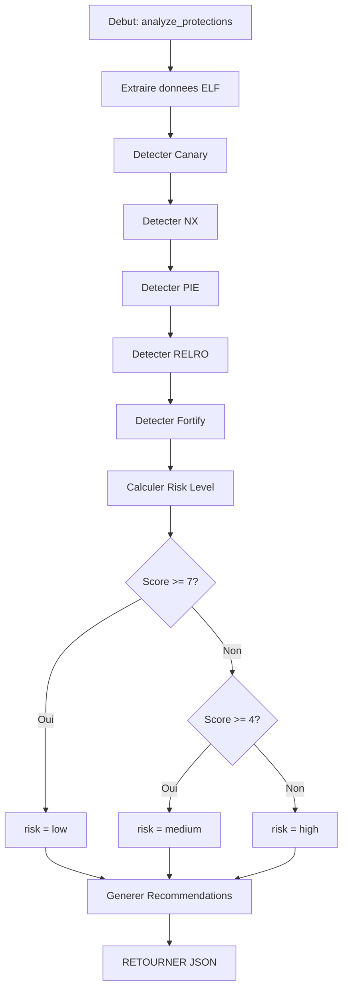

# Exercice 3.4.4-a : protection_detector

**Module :**
3.4.4 — Memory Protections & Bypass

**Concept :**
a — Detection et analyse des protections binaires

**Difficulte :**
★★★★★★★☆☆☆ (7/10)

**Type :**
code

**Tiers :**
2 — Multi-concepts

**Langage :**
Python 3.12

**Prerequis :**
- Comprehension du format ELF
- Notions de securite binaire
- Bases de programmation Python
- Connaissance des protections modernes

**Domaines :**
Sec, ELF, Mem

**Duree estimee :**
60 min

**XP Base :**
200

**Complexite :**
T2 O(n) x S2 O(n)

---

## SECTION 1 : PROTOTYPE & CONSIGNE

### 1.1 Obligations

**Fichier a rendre :**
`protection_detector.py`

**Fonctions autorisees :**
- `json` (module standard)
- `struct` (parsing binaire)
- `sys` (arguments)
- Fonctions built-in Python

**Fonctions interdites :**
- Bibliotheques d'analyse binaire (pwntools, lief, pyelftools)
- Outils externes (checksec, readelf)

### 1.2 Consigne

#### 1.2.1 Contexte Culturel — "Mr. Robot"

*"Control is an illusion."* — Mr. Robot

Dans **Mr. Robot**, Elliot Alderson est un hacker de genie qui analyse les systemes pour trouver leurs failles. Avant d'attaquer une cible, il doit comprendre ses defenses : firewalls, IDS, et surtout les protections au niveau binaire.

Tu es un membre de **fsociety** charge d'analyser les binaires avant exploitation. Comme Elliot qui scanne methodiquement ses cibles, tu dois implementer un outil "checksec-like" qui revele les protections d'un binaire ELF : Stack Canaries, NX/DEP, PIE, RELRO, Fortify Source...

Chaque protection est une couche de defense. Les connaitre, c'est les contourner.

#### 1.2.2 Enonce Academique

Les binaires modernes implementent plusieurs protections contre l'exploitation. Comprendre ces protections est la premiere etape avant toute tentative d'exploitation.

**Ta mission :**

Ecrire un programme `protection_detector.py` qui :

1. **Analyse** les headers ELF d'un binaire
2. **Detecte** la presence de stack canaries (__stack_chk_fail)
3. **Verifie** si PIE est active (ET_DYN sans interpreter)
4. **Determine** le statut NX (PT_GNU_STACK flags)
5. **Evalue** le niveau RELRO (Partial/Full)
6. **Identifie** Fortify Source (symboles _*_chk)
7. **Calcule** un score de risque global

**Entree :**
- Fichier JSON contenant :
  - `elf_header` : informations du header ELF
  - `program_headers` : liste des program headers
  - `dynamic_section` : entrees de la section dynamique
  - `symbols` : symboles importes/exportes

**Sortie :**
- JSON avec l'analyse de securite complete sur stdout

**Contraintes :**
- Les valeurs numeriques sont en hexadecimal ou decimal
- Le programme doit gerer les binaires partiellement analyses
- La sortie doit etre du JSON valide

**Protections a detecter :**

| Protection | Detection |
|------------|-----------|
| Canary | Symbole __stack_chk_fail |
| NX | PT_GNU_STACK sans PF_X |
| PIE | e_type = ET_DYN + pas de PT_INTERP fixe |
| Partial RELRO | PT_GNU_RELRO present |
| Full RELRO | PT_GNU_RELRO + DT_BIND_NOW |
| Fortify | Symboles *_chk (printf_chk, etc.) |

### 1.3 Prototype

```python
#!/usr/bin/env python3
"""
protection_detector.py - Analyse des protections binaires ELF
"""

import json
import sys

def detect_canary(symbols: list) -> bool:
    """
    Detecte la presence de stack canaries.

    Args:
        symbols: Liste des symboles du binaire

    Returns:
        True si canary detecte
    """
    pass

def detect_nx(program_headers: list) -> bool:
    """
    Detecte si NX/DEP est active.

    Args:
        program_headers: Liste des program headers

    Returns:
        True si NX active (stack non-executable)
    """
    pass

def detect_pie(elf_header: dict, program_headers: list) -> bool:
    """
    Detecte si PIE est active.

    Args:
        elf_header: Header ELF
        program_headers: Liste des program headers

    Returns:
        True si PIE active
    """
    pass

def detect_relro(program_headers: list, dynamic_section: list) -> str:
    """
    Detecte le niveau de RELRO.

    Args:
        program_headers: Liste des program headers
        dynamic_section: Section dynamique

    Returns:
        'none', 'partial', ou 'full'
    """
    pass

def detect_fortify(symbols: list) -> bool:
    """
    Detecte Fortify Source.

    Args:
        symbols: Liste des symboles

    Returns:
        True si Fortify detecte
    """
    pass

def calculate_risk_level(protections: dict) -> str:
    """
    Calcule le niveau de risque.

    Args:
        protections: Dictionnaire des protections detectees

    Returns:
        'low', 'medium', ou 'high'
    """
    pass

def analyze_protections(data: dict) -> dict:
    """
    Analyse complete des protections.

    Args:
        data: Donnees ELF parsees

    Returns:
        Rapport de securite complet
    """
    pass

def main():
    """Point d'entree principal."""
    pass

if __name__ == "__main__":
    main()
```

---

## SECTION 2 : LE SAVIEZ-VOUS ?

### L'histoire de checksec

L'outil `checksec` original a ete cree par Tobias Klein en 2009. Il est devenu indispensable pour les pentesters et les participants aux CTF. Aujourd'hui, des versions existent dans pwntools, GEF, et comme script standalone.

### L'evolution des protections

Les protections ont evolue avec les techniques d'exploitation :
- **1990s** : Stack smashing devient populaire
- **2001** : StackGuard introduit les canaries
- **2004** : NX/DEP devient standard (hardware)
- **2005** : ASLR dans Linux 2.6.12
- **2008** : Full RELRO dans GCC
- **2018** : CFI et Shadow Stack commencent a se repandre

### Pourquoi les protections ne suffisent pas

Chaque protection a ete contournee :
- **Canary** : Leak via format string ou fork()
- **NX** : ROP (Return-Oriented Programming)
- **ASLR** : Information disclosure
- **RELRO** : Attaques sur d'autres structures

---

## SECTION 2.5 : DANS LA VRAIE VIE

**Metier : Pentester / Red Team Operator**

Les pentesters analysent systematiquement les protections avant exploitation :
- **Reconnaissance** : checksec sur tous les binaires SUID
- **Exploitation** : Adapter la technique selon les protections
- **Reporting** : Documenter les faiblesses de configuration

**Cas d'usage concret :**
Lors d'un audit de securite, l'equipe red team de NCC Group analyse d'abord les binaires installes. Un daemon compile sans PIE ni canary (gcc old version) devient une cible prioritaire. checksec revele les "low-hanging fruits".

---

## SECTION 3 : EXEMPLE D'UTILISATION

### 3.0 Session bash

```bash
$ ls
protection_detector.py  test_binary.json

$ cat test_binary.json
{"elf_header": {"e_type": 3, "e_machine": 62, "e_entry": "0x1060"}, "program_headers": [{"p_type": 1, "p_flags": 5, "p_vaddr": "0x0"}, {"p_type": 1685382480, "p_flags": 6, "p_vaddr": "0x3de0"}, {"p_type": 1685382481, "p_flags": 4}], "dynamic_section": [{"d_tag": 1, "d_val": "libc.so.6"}, {"d_tag": 24, "d_val": 1}], "symbols": ["__stack_chk_fail", "printf_chk", "__libc_start_main", "puts"]}

$ python3 protection_detector.py test_binary.json
{"canary": true, "nx": true, "pie": true, "relro": "full", "fortify": true, "risk_level": "low", "details": {"canary_symbol": "__stack_chk_fail", "nx_stack_flags": "RW", "pie_type": "ET_DYN", "relro_flags": ["PT_GNU_RELRO", "DT_BIND_NOW"], "fortify_symbols": ["printf_chk"]}, "recommendations": []}

$ echo '{"elf_header": {"e_type": 2}, "program_headers": [{"p_type": 1685382481, "p_flags": 7}], "dynamic_section": [], "symbols": ["puts", "gets"]}' | python3 protection_detector.py -
{"canary": false, "nx": false, "pie": false, "relro": "none", "fortify": false, "risk_level": "high", "details": {"canary_symbol": null, "nx_stack_flags": "RWX", "pie_type": "ET_EXEC", "relro_flags": [], "fortify_symbols": []}, "recommendations": ["Enable stack canaries (-fstack-protector-strong)", "Enable NX (default on modern systems)", "Compile with PIE (-pie -fPIE)", "Enable RELRO (-Wl,-z,relro,-z,now)", "Use Fortify Source (-D_FORTIFY_SOURCE=2)"]}
```

---

## SECTION 3.1 : BONUS STANDARD (OPTIONNEL)

**Difficulte Bonus :**
★★★★★★★★☆☆ (8/10)

**Recompense :**
XP x2

**Time Complexity attendue :**
O(n)

**Space Complexity attendue :**
O(n)

**Domaines Bonus :**
Sec, ELF, Kernel

### 3.1.1 Consigne Bonus

**Extension "Deep Security Analysis" :**

Etendre le programme pour :

1. **Detecter CFI** : Control-Flow Integrity (clang CFI, GCC VTV)
2. **Analyser RPATH/RUNPATH** : Risques de DLL hijacking
3. **Verifier les symbols BIND** : BIND_NOW vs lazy binding
4. **Calculer l'entropie ASLR effective** : Basee sur les segments

**Contraintes supplementaires :**
```
+--------------------------------------------------+
|  CFI markers: __cfi_check, __cfi_slowpath        |
|  RPATH risque si contient $ORIGIN ou .           |
|  BIND_NOW = DT_FLAGS contient DF_BIND_NOW        |
|  Entropie = bits aleatoires par type segment     |
+--------------------------------------------------+
```

### 3.1.2 Prototype Bonus

```python
def analyze_protections_advanced(data: dict) -> dict:
    """
    Version avancee avec analyse CFI et RPATH.

    Returns:
        Dictionnaire etendu avec cfi, rpath_risk, bind_mode, aslr_entropy
    """
    pass
```

### 3.1.3 Ce qui change par rapport a l'exercice de base

| Aspect | Base | Bonus |
|--------|------|-------|
| CFI | Non detecte | Analyse complete |
| RPATH | Non analyse | Risques identifies |
| Binding | Implicite dans RELRO | Explicite |
| Entropie | Non calculee | Bits par segment |

---

## SECTION 4 : ZONE CORRECTION (POUR LE TESTEUR)

### 4.1 Moulinette

| Test | Entree | Sortie Attendue | Points |
|------|--------|-----------------|--------|
| canary_present | symbols avec __stack_chk_fail | `{"canary": true}` | 10 |
| canary_absent | symbols sans canary | `{"canary": false}` | 5 |
| nx_enabled | PT_GNU_STACK sans PF_X | `{"nx": true}` | 10 |
| nx_disabled | PT_GNU_STACK avec PF_X | `{"nx": false}` | 5 |
| pie_enabled | e_type=3 (ET_DYN) | `{"pie": true}` | 10 |
| pie_disabled | e_type=2 (ET_EXEC) | `{"pie": false}` | 5 |
| relro_none | Pas de PT_GNU_RELRO | `{"relro": "none"}` | 5 |
| relro_partial | PT_GNU_RELRO sans BIND_NOW | `{"relro": "partial"}` | 10 |
| relro_full | PT_GNU_RELRO + BIND_NOW | `{"relro": "full"}` | 10 |
| fortify_present | symboles *_chk | `{"fortify": true}` | 10 |
| risk_high | Aucune protection | `{"risk_level": "high"}` | 10 |
| risk_low | Toutes protections | `{"risk_level": "low"}` | 10 |

### 4.2 main.c de test

Non applicable (exercice Python).

### 4.3 Solution de reference

```python
#!/usr/bin/env python3
"""
protection_detector.py - Solution de reference
"""

import json
import sys

# Constantes ELF
ET_EXEC = 2
ET_DYN = 3
PT_GNU_STACK = 0x6474e551  # 1685382481
PT_GNU_RELRO = 0x6474e552  # 1685382482
PF_X = 1
PF_W = 2
PF_R = 4
DT_BIND_NOW = 24
DT_FLAGS = 30
DF_BIND_NOW = 8

CANARY_SYMBOLS = ['__stack_chk_fail', '__stack_chk_guard']
FORTIFY_SUFFIXES = ['_chk', '_fortify']

def detect_canary(symbols: list) -> tuple:
    """Detecte la presence de stack canaries."""
    for sym in symbols:
        if any(canary in sym for canary in CANARY_SYMBOLS):
            return (True, sym)
    return (False, None)

def detect_nx(program_headers: list) -> tuple:
    """Detecte si NX/DEP est active."""
    for ph in program_headers:
        p_type = ph.get('p_type', 0)
        if p_type == PT_GNU_STACK or p_type == 1685382481:
            p_flags = ph.get('p_flags', 0)
            # Si PF_X (1) n'est pas set, NX est actif
            nx_enabled = not (p_flags & PF_X)
            flags_str = ""
            if p_flags & PF_R:
                flags_str += "R"
            if p_flags & PF_W:
                flags_str += "W"
            if p_flags & PF_X:
                flags_str += "X"
            return (nx_enabled, flags_str or "none")

    # Si pas de PT_GNU_STACK, NX est generalement actif par defaut
    return (True, "RW")

def detect_pie(elf_header: dict, program_headers: list) -> tuple:
    """Detecte si PIE est active."""
    e_type = elf_header.get('e_type', 0)

    if e_type == ET_DYN or e_type == 3:
        # Pourrait etre une shared library, verifier si c'est un executable
        # Les executables PIE ont generalement un entry point
        e_entry = elf_header.get('e_entry', 0)
        if isinstance(e_entry, str):
            e_entry = int(e_entry, 16) if e_entry.startswith('0x') else int(e_entry)
        if e_entry > 0:
            return (True, "ET_DYN")
        return (True, "ET_DYN")
    elif e_type == ET_EXEC or e_type == 2:
        return (False, "ET_EXEC")

    return (False, "UNKNOWN")

def detect_relro(program_headers: list, dynamic_section: list) -> tuple:
    """Detecte le niveau de RELRO."""
    has_gnu_relro = False
    has_bind_now = False
    flags = []

    # Chercher PT_GNU_RELRO
    for ph in program_headers:
        p_type = ph.get('p_type', 0)
        if p_type == PT_GNU_RELRO or p_type == 1685382480:
            has_gnu_relro = True
            flags.append("PT_GNU_RELRO")
            break

    # Chercher DT_BIND_NOW ou DF_BIND_NOW dans DT_FLAGS
    for dyn in dynamic_section:
        d_tag = dyn.get('d_tag', 0)
        d_val = dyn.get('d_val', 0)

        if d_tag == DT_BIND_NOW or d_tag == 24:
            has_bind_now = True
            flags.append("DT_BIND_NOW")
        elif d_tag == DT_FLAGS or d_tag == 30:
            if isinstance(d_val, int) and (d_val & DF_BIND_NOW):
                has_bind_now = True
                flags.append("DF_BIND_NOW")

    if has_gnu_relro and has_bind_now:
        return ("full", flags)
    elif has_gnu_relro:
        return ("partial", flags)
    else:
        return ("none", flags)

def detect_fortify(symbols: list) -> tuple:
    """Detecte Fortify Source."""
    fortified = []
    for sym in symbols:
        if any(suffix in sym for suffix in FORTIFY_SUFFIXES):
            fortified.append(sym)

    return (len(fortified) > 0, fortified)

def calculate_risk_level(protections: dict) -> str:
    """Calcule le niveau de risque."""
    score = 0

    if protections.get('canary'):
        score += 2
    if protections.get('nx'):
        score += 2
    if protections.get('pie'):
        score += 2
    if protections.get('relro') == 'full':
        score += 2
    elif protections.get('relro') == 'partial':
        score += 1
    if protections.get('fortify'):
        score += 1

    # Score max = 9
    if score >= 7:
        return "low"
    elif score >= 4:
        return "medium"
    else:
        return "high"

def generate_recommendations(protections: dict) -> list:
    """Genere des recommandations de securite."""
    recommendations = []

    if not protections.get('canary'):
        recommendations.append("Enable stack canaries (-fstack-protector-strong)")
    if not protections.get('nx'):
        recommendations.append("Enable NX (default on modern systems)")
    if not protections.get('pie'):
        recommendations.append("Compile with PIE (-pie -fPIE)")
    if protections.get('relro') == 'none':
        recommendations.append("Enable RELRO (-Wl,-z,relro,-z,now)")
    elif protections.get('relro') == 'partial':
        recommendations.append("Upgrade to Full RELRO (-Wl,-z,now)")
    if not protections.get('fortify'):
        recommendations.append("Use Fortify Source (-D_FORTIFY_SOURCE=2)")

    return recommendations

def analyze_protections(data: dict) -> dict:
    """Analyse complete des protections."""
    elf_header = data.get('elf_header', {})
    program_headers = data.get('program_headers', [])
    dynamic_section = data.get('dynamic_section', [])
    symbols = data.get('symbols', [])

    canary, canary_sym = detect_canary(symbols)
    nx, nx_flags = detect_nx(program_headers)
    pie, pie_type = detect_pie(elf_header, program_headers)
    relro, relro_flags = detect_relro(program_headers, dynamic_section)
    fortify, fortify_syms = detect_fortify(symbols)

    protections = {
        'canary': canary,
        'nx': nx,
        'pie': pie,
        'relro': relro,
        'fortify': fortify
    }

    risk_level = calculate_risk_level(protections)
    recommendations = generate_recommendations(protections)

    return {
        'canary': canary,
        'nx': nx,
        'pie': pie,
        'relro': relro,
        'fortify': fortify,
        'risk_level': risk_level,
        'details': {
            'canary_symbol': canary_sym,
            'nx_stack_flags': nx_flags,
            'pie_type': pie_type,
            'relro_flags': relro_flags,
            'fortify_symbols': fortify_syms
        },
        'recommendations': recommendations
    }

def main():
    """Point d'entree principal."""
    if len(sys.argv) < 2:
        print("Usage: protection_detector.py <input.json | ->", file=sys.stderr)
        sys.exit(1)

    input_file = sys.argv[1]

    if input_file == '-':
        data = json.load(sys.stdin)
    else:
        with open(input_file, 'r') as f:
            data = json.load(f)

    result = analyze_protections(data)
    print(json.dumps(result))

if __name__ == "__main__":
    main()
```

### 4.4 Solutions alternatives acceptees

```python
# Alternative 1: Detection canary par patterns multiples
def detect_canary_alt(symbols: list) -> bool:
    patterns = [
        '__stack_chk_fail',
        '__stack_chk_guard',
        '__intel_security_cookie',
        '__security_check_cookie'
    ]
    return any(any(p in s for p in patterns) for s in symbols)
```

```python
# Alternative 2: Detection RELRO par analyse des segments
def detect_relro_alt(program_headers, dynamic_section):
    relro_segment = next((ph for ph in program_headers
                          if ph.get('p_type') in [0x6474e552, 1685382480]), None)
    if not relro_segment:
        return 'none'

    bind_now = any(d.get('d_tag') in [24, 30] for d in dynamic_section)
    return 'full' if bind_now else 'partial'
```

### 4.5 Solutions refusees (avec explications)

```python
# REFUSE: Detection PIE incorrecte
def detect_pie_bad(elf_header):
    # Bug: ET_DYN peut aussi etre une shared library!
    return elf_header.get('e_type') == 3

# Pourquoi c'est faux: Doit verifier si c'est un executable, pas juste le type
```

```python
# REFUSE: Detection NX inversee
def detect_nx_bad(program_headers):
    for ph in program_headers:
        if ph.get('p_type') == 0x6474e551:
            return ph.get('p_flags') & 1  # Bug: retourne True si X est set!

# Pourquoi c'est faux: NX = pas de X, donc doit retourner NOT (flags & PF_X)
```

```python
# REFUSE: Detection RELRO incomplete
def detect_relro_bad(program_headers, dynamic_section):
    for ph in program_headers:
        if ph.get('p_type') == 0x6474e552:
            return 'full'  # Bug: ne verifie pas BIND_NOW!
    return 'none'

# Pourquoi c'est faux: Full RELRO necessite PT_GNU_RELRO ET BIND_NOW
```

### 4.6 Solution bonus de reference

```python
#!/usr/bin/env python3
"""
protection_detector.py - Solution bonus avec CFI et RPATH
"""

import json
import sys

# [Base code from section 4.3...]

CFI_SYMBOLS = ['__cfi_check', '__cfi_slowpath', '__ubsan_handle']
DT_RPATH = 15
DT_RUNPATH = 29

def detect_cfi(symbols: list) -> tuple:
    """Detecte Control-Flow Integrity."""
    cfi_found = []
    for sym in symbols:
        if any(cfi in sym for cfi in CFI_SYMBOLS):
            cfi_found.append(sym)
    return (len(cfi_found) > 0, cfi_found)

def analyze_rpath(dynamic_section: list) -> dict:
    """Analyse les risques RPATH/RUNPATH."""
    result = {
        'rpath': None,
        'runpath': None,
        'risks': []
    }

    for dyn in dynamic_section:
        d_tag = dyn.get('d_tag', 0)
        d_val = dyn.get('d_val', '')

        if d_tag == DT_RPATH or d_tag == 15:
            result['rpath'] = d_val
        elif d_tag == DT_RUNPATH or d_tag == 29:
            result['runpath'] = d_val

    # Analyser les risques
    for path_type in ['rpath', 'runpath']:
        path = result.get(path_type)
        if path:
            if '$ORIGIN' in path:
                result['risks'].append(f"{path_type} contains $ORIGIN - potential hijacking")
            if path.startswith('.') or './' in path:
                result['risks'].append(f"{path_type} contains relative path - hijacking risk")
            if '/tmp' in path or '/var/tmp' in path:
                result['risks'].append(f"{path_type} includes world-writable directory")

    return result

def calculate_aslr_entropy(elf_header: dict) -> dict:
    """Calcule l'entropie ASLR theorique."""
    # Entropie par defaut sur x86-64 Linux
    entropy = {
        'stack': 30,
        'mmap': 28,
        'heap': 8,
        'pie': 28 if elf_header.get('e_type') == 3 else 0,
        'total_effective': 0
    }

    # Calcul simplifie de l'entropie effective
    if entropy['pie'] > 0:
        entropy['total_effective'] = min(entropy.values())
    else:
        entropy['total_effective'] = 0

    return entropy

def analyze_protections_advanced(data: dict) -> dict:
    """Version avancee avec CFI et RPATH."""
    # Analyse de base
    result = analyze_protections(data)

    symbols = data.get('symbols', [])
    dynamic_section = data.get('dynamic_section', [])
    elf_header = data.get('elf_header', {})

    # Analyse avancee
    cfi, cfi_syms = detect_cfi(symbols)
    rpath_analysis = analyze_rpath(dynamic_section)
    entropy = calculate_aslr_entropy(elf_header)

    result['cfi'] = cfi
    result['details']['cfi_symbols'] = cfi_syms
    result['rpath_analysis'] = rpath_analysis
    result['aslr_entropy'] = entropy

    # Ajouter recommandations pour RPATH
    if rpath_analysis['risks']:
        result['recommendations'].extend(rpath_analysis['risks'])

    return result

def main():
    if len(sys.argv) < 2:
        print("Usage: protection_detector.py <input.json | ->", file=sys.stderr)
        sys.exit(1)

    input_file = sys.argv[1]

    if input_file == '-':
        data = json.load(sys.stdin)
    else:
        with open(input_file, 'r') as f:
            data = json.load(f)

    result = analyze_protections_advanced(data)
    print(json.dumps(result))

if __name__ == "__main__":
    main()
```

### 4.7 Solutions alternatives bonus

```python
# Alternative: Detection CFI par sections
def detect_cfi_sections(sections: list) -> bool:
    cfi_sections = ['.cfi', '.eh_frame_hdr', '__cfi_check']
    return any(any(s in sec.get('name', '') for s in cfi_sections) for sec in sections)
```

### 4.8 Solutions refusees bonus

```python
# REFUSE: Analyse RPATH trop simple
def analyze_rpath_bad(dynamic_section):
    for dyn in dynamic_section:
        if dyn.get('d_tag') == 15:
            return {'risk': 'possible'}  # Trop vague!
    return {'risk': 'none'}

# Pourquoi: Doit analyser le contenu du path, pas juste sa presence
```

### 4.9 spec.json (ENGINE v22.1)

```json
{
  "name": "protection_detector",
  "language": "python",
  "version": "3.12",
  "type": "code",
  "tier": 2,
  "tier_info": "Multi-concepts",
  "tags": ["security", "elf", "checksec", "canary", "nx", "pie", "relro", "phase3"],
  "passing_score": 70,

  "function": {
    "name": "analyze_protections",
    "prototype": "def analyze_protections(data: dict) -> dict",
    "return_type": "dict",
    "parameters": [
      {"name": "data", "type": "dict"}
    ]
  },

  "driver": {
    "reference": "See section 4.3",

    "edge_cases": [
      {
        "name": "empty_data",
        "args": [{"elf_header": {}, "program_headers": [], "dynamic_section": [], "symbols": []}],
        "expected_contains": {"canary": false, "nx": true, "pie": false, "relro": "none"},
        "is_trap": true,
        "trap_explanation": "Empty data should detect no protections"
      },
      {
        "name": "full_protection",
        "args": [{"elf_header": {"e_type": 3, "e_entry": "0x1000"}, "program_headers": [{"p_type": 1685382481, "p_flags": 6}, {"p_type": 1685382480, "p_flags": 4}], "dynamic_section": [{"d_tag": 24, "d_val": 1}], "symbols": ["__stack_chk_fail", "printf_chk"]}],
        "expected": {"canary": true, "nx": true, "pie": true, "relro": "full", "fortify": true, "risk_level": "low"}
      },
      {
        "name": "no_protection",
        "args": [{"elf_header": {"e_type": 2}, "program_headers": [{"p_type": 1685382481, "p_flags": 7}], "dynamic_section": [], "symbols": ["gets", "strcpy"]}],
        "expected": {"canary": false, "nx": false, "pie": false, "relro": "none", "fortify": false, "risk_level": "high"}
      },
      {
        "name": "partial_relro",
        "args": [{"elf_header": {"e_type": 2}, "program_headers": [{"p_type": 1685382480, "p_flags": 4}], "dynamic_section": [], "symbols": []}],
        "expected_contains": {"relro": "partial"}
      }
    ],

    "fuzzing": {
      "enabled": false
    }
  },

  "norm": {
    "allowed_functions": ["json", "sys", "struct"],
    "forbidden_functions": ["pwntools", "lief", "pyelftools", "subprocess"],
    "check_security": false,
    "check_memory": false,
    "blocking": true
  }
}
```

### 4.10 Solutions Mutantes (minimum 5)

```python
# Mutant A (Boundary) : Detection NX inversee
def detect_nx_mutant_a(program_headers):
    for ph in program_headers:
        if ph.get('p_type') == 0x6474e551:
            return (ph.get('p_flags') & 1, "")  # Bug: inverse!
    return (False, "")

# Pourquoi c'est faux: NX = pas de X, doit retourner NOT (flags & 1)
# Ce qui etait pense: Confusion entre "NX set" et "X not set"
```

```python
# Mutant B (Safety) : Ne gere pas les types manquants
def detect_pie_mutant_b(elf_header, program_headers):
    e_type = elf_header['e_type']  # Crash si cle absente!
    return e_type == 3

# Pourquoi c'est faux: Doit utiliser .get() avec default
# Ce qui etait pense: Les donnees sont toujours completes
```

```python
# Mutant C (Logic) : RELRO full sans verifier BIND_NOW
def detect_relro_mutant_c(program_headers, dynamic_section):
    for ph in program_headers:
        if ph.get('p_type') == 0x6474e552:
            return "full"  # Bug: ne verifie pas BIND_NOW!
    return "none"

# Pourquoi c'est faux: Full RELRO = PT_GNU_RELRO + BIND_NOW
# Ce qui etait pense: PT_GNU_RELRO suffit pour Full
```

```python
# Mutant D (Return) : Risk level incorrect
def calculate_risk_mutant_d(protections):
    if protections.get('canary'):
        return "low"  # Bug: une seule protection = low?
    return "high"

# Pourquoi c'est faux: Le score doit considerer toutes les protections
# Ce qui etait pense: Canary seul suffit pour low risk
```

```python
# Mutant E (Parse) : Detection fortify trop stricte
def detect_fortify_mutant_e(symbols):
    for sym in symbols:
        if sym == '__printf_chk':  # Bug: ne detecte que printf_chk!
            return True
    return False

# Pourquoi c'est faux: Doit detecter tous les *_chk (strcpy_chk, etc.)
# Ce qui etait pense: Seul printf est fortifie
```

---

## SECTION 5 : COMPRENDRE (DOCUMENT DE COURS COMPLET)

### 5.1 Ce que cet exercice enseigne

Cet exercice enseigne les **protections binaires modernes** et leur detection :

1. **Stack Canaries** : Protection contre stack buffer overflow
2. **NX/DEP** : Separation code/donnees
3. **PIE/ASLR** : Randomisation des adresses
4. **RELRO** : Protection de la GOT
5. **Fortify Source** : Verification des fonctions dangereuses

### 5.2 LDA - Traduction litterale en francais (MAJUSCULES)

```
FONCTION analyze_protections QUI RETOURNE UN DICTIONNAIRE ET PREND EN PARAMETRE data QUI EST UN DICTIONNAIRE
DEBUT FONCTION
    DECLARER elf_header COMME data['elf_header'] OU DICTIONNAIRE VIDE
    DECLARER program_headers COMME data['program_headers'] OU LISTE VIDE
    DECLARER dynamic_section COMME data['dynamic_section'] OU LISTE VIDE
    DECLARER symbols COMME data['symbols'] OU LISTE VIDE

    APPELER detect_canary(symbols) ET STOCKER DANS (canary, canary_sym)
    APPELER detect_nx(program_headers) ET STOCKER DANS (nx, nx_flags)
    APPELER detect_pie(elf_header, program_headers) ET STOCKER DANS (pie, pie_type)
    APPELER detect_relro(program_headers, dynamic_section) ET STOCKER DANS (relro, relro_flags)
    APPELER detect_fortify(symbols) ET STOCKER DANS (fortify, fortify_syms)

    CONSTRUIRE protections COMME DICTIONNAIRE(canary, nx, pie, relro, fortify)
    APPELER calculate_risk_level(protections) ET STOCKER DANS risk_level
    APPELER generate_recommendations(protections) ET STOCKER DANS recommendations

    RETOURNER DICTIONNAIRE AVEC TOUS LES CHAMPS
FIN FONCTION
```

### 5.2.2 Logic Flow (Structured English)

```
ALGORITHME : Detection des Protections Binaires
---
1. LIRE les donnees ELF (header, segments, dynamique, symboles)

2. DETECTER chaque protection :
   a. CANARY : Chercher __stack_chk_fail dans symboles
   b. NX : Verifier PT_GNU_STACK sans flag X
   c. PIE : Verifier e_type = ET_DYN avec entry point
   d. RELRO : Chercher PT_GNU_RELRO et DT_BIND_NOW
   e. FORTIFY : Chercher symboles *_chk

3. CALCULER le niveau de risque :
   - Score base sur nombre de protections actives
   - high (<4), medium (4-6), low (>=7)

4. GENERER les recommandations :
   - Pour chaque protection manquante, suggerer l'option GCC

5. RETOURNER le rapport complet en JSON
```

### 5.2.3 Representation Algorithmique avec Guards

```
FONCTION : detect_relro(program_headers, dynamic_section)
---
INIT has_gnu_relro = False
INIT has_bind_now = False

1. POUR CHAQUE ph DANS program_headers :
   |
   |-- SI ph.p_type == PT_GNU_RELRO :
   |     has_gnu_relro = True
   |     SORTIR DE BOUCLE

2. POUR CHAQUE dyn DANS dynamic_section :
   |
   |-- SI dyn.d_tag == DT_BIND_NOW OU (DT_FLAGS avec DF_BIND_NOW) :
   |     has_bind_now = True
   |     SORTIR DE BOUCLE

3. RETOURNER :
   |
   |-- SI has_gnu_relro ET has_bind_now : "full"
   |-- SI has_gnu_relro : "partial"
   |-- SINON : "none"
```



### 5.3 Visualisation ASCII

```
                PROTECTIONS BINAIRES MODERNES
    +---------------------------------------------------------------+
    |                                                               |
    |   STACK CANARY (SSP/StackGuard)                               |
    |   +-------------------------------------------------------+   |
    |   |  +--------+--------+--------+--------+--------+       |   |
    |   |  | buffer |CANARY  |  SFP   |  RIP   |  args  |       |   |
    |   |  +--------+--------+--------+--------+--------+       |   |
    |   |           ^                                           |   |
    |   |           | Si modifie -> __stack_chk_fail()          |   |
    |   +-------------------------------------------------------+   |
    |                                                               |
    |   NX/DEP (Non-eXecutable)                                     |
    |   +-------------------------------------------------------+   |
    |   |   Stack:  RW- (no execute)                            |   |
    |   |   Heap:   RW- (no execute)                            |   |
    |   |   Code:   R-X (no write)                              |   |
    |   |   -> Shellcode sur stack/heap impossible              |   |
    |   +-------------------------------------------------------+   |
    |                                                               |
    |   PIE (Position Independent Executable)                       |
    |   +-------------------------------------------------------+   |
    |   |   Sans PIE:  0x400000 (fixe)                          |   |
    |   |   Avec PIE:  0x55?????????? (aleatoire)               |   |
    |   |   -> Adresses du binaire imprevisibles                |   |
    |   +-------------------------------------------------------+   |
    |                                                               |
    |   RELRO (RELocation Read-Only)                                |
    |   +-------------------------------------------------------+   |
    |   |   None:    GOT writable pendant execution             |   |
    |   |   Partial: GOT partiellement protegee                 |   |
    |   |   Full:    GOT en lecture seule apres link            |   |
    |   |   -> Protection contre GOT overwrite                  |   |
    |   +-------------------------------------------------------+   |
    |                                                               |
    |   FORTIFY SOURCE                                              |
    |   +-------------------------------------------------------+   |
    |   |   strcpy(dst, src)  ->  __strcpy_chk(dst, src, size)  |   |
    |   |   printf(fmt)       ->  __printf_chk(1, fmt)          |   |
    |   |   -> Verification des tailles a la compilation/exec   |   |
    |   +-------------------------------------------------------+   |
    |                                                               |
    +---------------------------------------------------------------+

    SCORE DE RISQUE
    +-------------------+
    |  Protection | Pts |
    +-------------+-----+
    |  Canary     |  2  |
    |  NX         |  2  |
    |  PIE        |  2  |
    |  Full RELRO |  2  |
    |  Fortify    |  1  |
    +-------------+-----+
    |  Max        |  9  |
    +-------------------+

    Score 0-3: HIGH RISK   (facile a exploiter)
    Score 4-6: MEDIUM RISK (necessite bypass)
    Score 7-9: LOW RISK    (toutes protections)
```

### 5.4 Les pieges en detail

#### Piege 1 : Confondre PT_GNU_STACK flags

```python
# MAUVAIS: NX actif si flag X present
def detect_nx(program_headers):
    for ph in program_headers:
        if ph.get('p_type') == PT_GNU_STACK:
            return ph.get('p_flags') & PF_X  # INVERSE!

# BON: NX actif si flag X ABSENT
def detect_nx(program_headers):
    for ph in program_headers:
        if ph.get('p_type') == PT_GNU_STACK:
            return NOT (ph.get('p_flags') & PF_X)
```

#### Piege 2 : Confondre Partial et Full RELRO

```python
# MAUVAIS: PT_GNU_RELRO = Full RELRO
def detect_relro(ph, dyn):
    for p in ph:
        if p.get('p_type') == PT_GNU_RELRO:
            return "full"  # FAUX!

# BON: Full RELRO necessite AUSSI BIND_NOW
def detect_relro(ph, dyn):
    has_relro = any(p.get('p_type') == PT_GNU_RELRO for p in ph)
    has_bindnow = any(d.get('d_tag') == DT_BIND_NOW for d in dyn)
    if has_relro and has_bindnow:
        return "full"
    elif has_relro:
        return "partial"
    return "none"
```

### 5.5 Cours Complet

#### 5.5.1 Stack Canaries

Les canaries sont des valeurs aleatoires placees entre le buffer et l'adresse de retour :

```
+--------+--------+--------+--------+
| buffer | canary |  SFP   |  RET   |
+--------+--------+--------+--------+
         ^
         Si overflow modifie le canary,
         __stack_chk_fail() est appelee
```

**Types de canaries :**
- **Terminator canary** : Contient \x00 (bloque strcpy)
- **Random canary** : Valeur aleatoire au demarrage
- **XOR canary** : XOR avec l'adresse de retour

**Detection :** Symbole `__stack_chk_fail` present

#### 5.5.2 NX/DEP (Non-eXecutable / Data Execution Prevention)

Separation stricte entre code et donnees au niveau hardware (NX bit dans les page tables).

**Impact :**
- Stack non-executable -> pas de shellcode direct
- Heap non-executable -> pas d'allocation de code

**Detection :** PT_GNU_STACK sans flag PF_X (executable)

#### 5.5.3 PIE (Position Independent Executable)

Code compile pour fonctionner a n'importe quelle adresse (RIP-relative addressing).

**Impact avec ASLR :**
- Adresse de base randomisee a chaque execution
- Les adresses du binaire deviennent imprevisibles

**Detection :** e_type = ET_DYN (3) avec entry point

#### 5.5.4 RELRO (RELocation Read-Only)

**Partial RELRO :**
- Reorganise l'ELF pour que certaines sections soient en lecture seule
- La GOT reste partiellement writable (pour lazy binding)

**Full RELRO :**
- Toutes les relocations resolues au chargement
- GOT entierement en lecture seule
- Plus de lazy binding

**Detection :**
- Partial : PT_GNU_RELRO present
- Full : PT_GNU_RELRO + DT_BIND_NOW

#### 5.5.5 Fortify Source

Remplacement des fonctions dangereuses par des versions securisees :

```c
// Sans fortify
strcpy(dst, src);

// Avec fortify (-D_FORTIFY_SOURCE=2)
__strcpy_chk(dst, src, __builtin_object_size(dst, 0));
```

**Detection :** Symboles se terminant par `_chk`

### 5.6 Normes avec explications pedagogiques

```
+---------------------------------------------------------------------+
| HORS NORME (fonctionne, mais interdit)                              |
+---------------------------------------------------------------------+
| import subprocess                                                   |
| subprocess.run(['checksec', binary])  # Interdit!                   |
+---------------------------------------------------------------------+
| CONFORME                                                            |
+---------------------------------------------------------------------+
| def detect_canary(symbols):                                         |
|     return any('__stack_chk' in s for s in symbols)                |
+---------------------------------------------------------------------+
| POURQUOI ?                                                          |
|                                                                     |
| - L'exercice enseigne COMMENT checksec fonctionne                   |
| - Appeler un outil externe cache la logique                         |
| - Comprendre = pouvoir reproduire                                   |
+---------------------------------------------------------------------+
```

### 5.7 Simulation avec trace d'execution

**Entree :** Binaire avec toutes les protections

```
+-------+------------------------------------------+------------------------+---------------------------+
| Etape | Test                                     | Resultat               | Explication               |
+-------+------------------------------------------+------------------------+---------------------------+
|   1   | Chercher __stack_chk_fail dans symbols   | Trouve                 | Canary = true             |
+-------+------------------------------------------+------------------------+---------------------------+
|   2   | PT_GNU_STACK flags = 6 (RW)              | Pas de X               | NX = true                 |
+-------+------------------------------------------+------------------------+---------------------------+
|   3   | e_type = 3 (ET_DYN)                      | ET_DYN                 | PIE = true                |
+-------+------------------------------------------+------------------------+---------------------------+
|   4   | PT_GNU_RELRO present                     | Trouve                 | RELRO = partial (suite)   |
+-------+------------------------------------------+------------------------+---------------------------+
|   5   | DT_BIND_NOW present                      | Trouve                 | RELRO = full              |
+-------+------------------------------------------+------------------------+---------------------------+
|   6   | Symboles *_chk trouves                   | printf_chk             | Fortify = true            |
+-------+------------------------------------------+------------------------+---------------------------+
|   7   | Score = 2+2+2+2+1 = 9                    | >= 7                   | Risk = low                |
+-------+------------------------------------------+------------------------+---------------------------+
```

### 5.8 Mnemotechniques

#### MEME : "Mr. Robot" - Les 5 commandements de la securite

Comme fsociety qui planifie ses attaques, rappelle-toi les 5 protections :

- **C**anary = Le canari dans la mine (alerte si danger)
- **N**X = No eXecute (pas de code sauvage)
- **P**IE = Position aleatoire (cache la cible)
- **R**ELRO = Read-only GOT (verrouille les portes)
- **F**ortify = Verification des fonctions (securite proactive)

**"CNPRF"** = "Ces Nerds Protegent Reellement Fort"

### 5.9 Applications pratiques

1. **CTF** : Premier reflexe = checksec pour choisir la technique
2. **Pentest** : Identifier les binaires SUID vulnerables
3. **Secure coding** : Verifier que les protections sont activees
4. **Forensics** : Comprendre pourquoi un exploit a fonctionne

---

## SECTION 6 : PIEGES - RECAPITULATIF

| # | Piege | Consequence | Solution |
|---|-------|-------------|----------|
| 1 | NX inverse (X present = NX) | Detection incorrecte | NX = NOT (flags & X) |
| 2 | Partial = Full RELRO | Mauvais niveau detecte | Verifier BIND_NOW |
| 3 | ET_DYN = PIE toujours | Shared libs mal detectees | Verifier entry point |
| 4 | Canary = un seul symbole | Detection incomplete | Plusieurs patterns |
| 5 | Fortify = exact match | Manque des variantes | Suffixe _chk |

---

## SECTION 7 : QCM

### Question 1
**Quel symbole indique la presence de stack canaries ?**

A) __canary_check
B) __stack_chk_fail
C) __fortify_source
D) __nx_enabled
E) __pie_base
F) __relro_got
G) __security_cookie
H) __buffer_guard
I) __overflow_check
J) __stack_protector

**Reponse : B**

---

### Question 2
**Quelle est la difference entre Partial et Full RELRO ?**

A) Full RELRO utilise plus de memoire
B) Full RELRO necessite DT_BIND_NOW en plus
C) Partial RELRO ne protege que .data
D) Full RELRO desactive la GOT
E) Ils sont identiques
F) Partial est plus securise
G) Full RELRO necessite PIE
H) Partial necessite canary
I) Full RELRO est deprecie
J) Partial bloque toutes les relocations

**Reponse : B**

---

### Question 3
**Comment detecter si NX est actif via PT_GNU_STACK ?**

A) Le flag PF_X est present
B) Le flag PF_X est absent
C) Le flag PF_W est absent
D) Le segment n'existe pas
E) La taille est zero
F) Le flag PF_R est absent
G) L'offset est non-nul
H) Le vaddr est en zone haute
I) Le type est PT_LOAD
J) La permission est 777

**Reponse : B**

---

### Question 4
**Quel e_type indique un binaire PIE ?**

A) ET_NONE (0)
B) ET_REL (1)
C) ET_EXEC (2)
D) ET_DYN (3)
E) ET_CORE (4)
F) ET_PIE (5)
G) ET_STATIC (6)
H) ET_SHARED (7)
I) ET_OBJECT (8)
J) ET_SECURE (9)

**Reponse : D**

---

### Question 5
**Quel flag GCC active Full RELRO ?**

A) -fstack-protector
B) -pie
C) -Wl,-z,relro,-z,now
D) -D_FORTIFY_SOURCE=2
E) -fno-stack-protector
F) -Wl,-z,execstack
G) -static
H) -shared
I) -O3
J) -g

**Reponse : C**

---

## SECTION 8 : RECAPITULATIF

| Element | Valeur |
|---------|--------|
| **Difficulte** | ★★★★★★★☆☆☆ (7/10) |
| **Temps estime** | 60 min |
| **XP Base** | 200 |
| **XP Bonus** | x2 (400 total) |
| **Concepts cles** | Canary, NX, PIE, RELRO, Fortify |
| **Langage** | Python 3.12 |
| **Prerequis** | Format ELF, Securite binaire |

---

## SECTION 9 : DEPLOYMENT PACK

```json
{
  "deploy": {
    "hackbrain_version": "5.5.2",
    "engine_version": "v22.1",
    "exercise_slug": "3.4.4-a-protection-detector",
    "generated_at": "2026-01-16 14:30:00",

    "metadata": {
      "exercise_id": "3.4.4-a",
      "exercise_name": "protection_detector",
      "module": "3.4.4",
      "module_name": "Memory Protections & Bypass",
      "concept": "a",
      "concept_name": "Detection et analyse des protections binaires",
      "type": "code",
      "tier": 2,
      "tier_info": "Multi-concepts",
      "phase": 3,
      "difficulty": 7,
      "difficulty_stars": "★★★★★★★☆☆☆",
      "language": "python",
      "duration_minutes": 60,
      "xp_base": 200,
      "xp_bonus_multiplier": 2,
      "bonus_tier": "STANDARD",
      "bonus_icon": "BONUS",
      "complexity_time": "T2 O(n)",
      "complexity_space": "S2 O(n)",
      "prerequisites": ["Format ELF", "Securite binaire", "Bases Python"],
      "domains": ["Sec", "ELF", "Mem"],
      "domains_bonus": ["Kernel"],
      "tags": ["checksec", "canary", "nx", "pie", "relro", "fortify", "security"],
      "meme_reference": "Mr. Robot"
    },

    "files": {
      "spec.json": "/* Section 4.9 */",
      "references/ref_solution.py": "/* Section 4.3 */",
      "references/ref_solution_bonus.py": "/* Section 4.6 */",
      "alternatives/alt_1.py": "/* Section 4.4 */",
      "mutants/mutant_a_boundary.py": "/* Section 4.10 */",
      "mutants/mutant_b_safety.py": "/* Section 4.10 */",
      "mutants/mutant_c_logic.py": "/* Section 4.10 */",
      "mutants/mutant_d_return.py": "/* Section 4.10 */",
      "mutants/mutant_e_parse.py": "/* Section 4.10 */",
      "tests/test_binary.json": "/* Test data */"
    },

    "validation": {
      "expected_pass": [
        "references/ref_solution.py",
        "references/ref_solution_bonus.py",
        "alternatives/alt_1.py"
      ],
      "expected_fail": [
        "mutants/mutant_a_boundary.py",
        "mutants/mutant_b_safety.py",
        "mutants/mutant_c_logic.py",
        "mutants/mutant_d_return.py",
        "mutants/mutant_e_parse.py"
      ]
    },

    "commands": {
      "validate_spec": "python3 hackbrain_engine_v22.py --validate-spec spec.json",
      "test_reference": "python3 hackbrain_engine_v22.py -s spec.json -f references/ref_solution.py",
      "test_mutants": "python3 hackbrain_mutation_tester.py -r references/ref_solution.py -s spec.json --validate"
    }
  }
}
```
