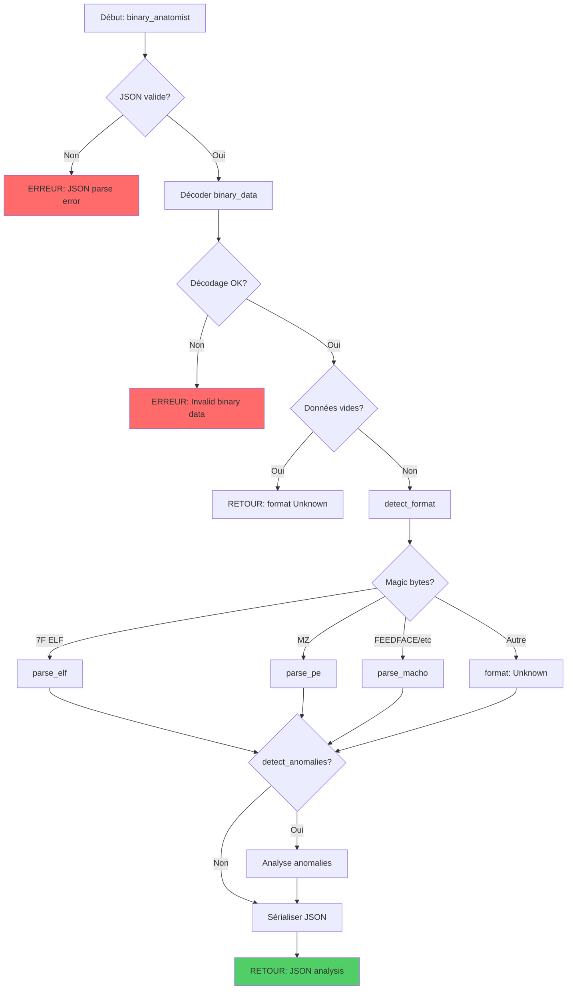

# Exercice 3.5.1-a : binary_anatomist

**Module :**
3.5 — Reverse Engineering

**Concept :**
a — Analyse des Formats Binaires (ELF, PE, Mach-O)

**Difficulté :**
★★★★★★☆☆☆☆ (6/10)

**Type :**
complet

**Tiers :**
1 — Concept isolé

**Langage :**
Rust Edition 2024

**Prérequis :**
- Compréhension de l'architecture x86/x86_64
- Notions de base sur les systèmes d'exploitation
- Manipulation de données binaires en Rust

**Domaines :**
CPU, Encodage, Mem, Struct

**Durée estimée :**
120 min

**XP Base :**
350

**Complexité :**
T4 O(n) × S3 O(n)

---

## 📐 SECTION 1 : PROTOTYPE & CONSIGNE

### 1.1 Obligations

**Fichier à rendre :**
`binary_anatomist.rs`

**Fonctions autorisées :**
- `serde_json` pour parsing/serialization JSON
- `std::collections::{HashMap, HashSet, BTreeMap}`
- Manipulation de bytes (`&[u8]`, slices)

**Fonctions interdites :**
- Bibliothèques de parsing binaire externes (goblin, object, pelite)
- Accès filesystem direct (les données sont passées en paramètre)

### 1.2 Consigne

#### 🎮 CONTEXTE FUN — "Ghost in the Shell" meets "The Matrix"

**"Your body is merely a shell."** — Dans *Ghost in the Shell*, le Major Kusanagi explore les profondeurs du cyberespace, analysant les structures les plus intimes des systèmes. Comme Neo dans *The Matrix* qui voit le code sous-jacent de la réalité, tu vas apprendre à voir au-delà de l'exécutable — à percevoir les **headers**, les **sections**, et les **segments** qui composent l'âme d'un binaire.

Tu es un **Binary Anatomist** — un chirurgien du code machine. Chaque binaire qui passe sur ta table d'opération révèle ses secrets : son format (ELF pour Linux, PE pour Windows, Mach-O pour macOS), son architecture, ses imports, ses exports, et parfois... ses **anomalies**.

**Ta mission :**

Écrire une fonction `binary_anatomist` qui dissèque un fichier binaire et en extrait toutes les métadonnées structurelles.

**Entrée :**
- `input_json` : Configuration contenant :
  - `binary_data` : Les données binaires en hexadécimal ou base64
  - `analysis_depth` : Niveau de profondeur ("basic", "detailed", "forensic")
  - `detect_anomalies` : Boolean pour activer la détection d'anomalies

**Sortie :**
- JSON contenant :
  - `format` : Type de binaire (ELF32, ELF64, PE32, PE64, MachO32, MachO64, Unknown)
  - `architecture` : Architecture cible (x86, x86_64, ARM, ARM64, etc.)
  - `endianness` : Ordre des octets (little, big)
  - `entry_point` : Adresse du point d'entrée
  - `sections` : Liste des sections avec leurs propriétés
  - `imports` : Fonctions importées
  - `exports` : Fonctions exportées (si applicable)
  - `anomalies` : Liste des anomalies détectées

**Contraintes :**
- Parser correctement les magic bytes pour identifier le format
- Gérer les trois formats majeurs : ELF, PE, Mach-O
- Détecter au moins 5 types d'anomalies structurelles
- Performances : O(n) où n est la taille du binaire

**Exemples :**

| Magic Bytes | Format | Architecture |
|-------------|--------|--------------|
| `7F 45 4C 46` | ELF | Dépend du header |
| `4D 5A` | PE (DOS header) | Dépend du COFF header |
| `FE ED FA CE` | Mach-O 32-bit BE | PowerPC/x86 |
| `FE ED FA CF` | Mach-O 64-bit BE | x86_64/ARM64 |
| `CE FA ED FE` | Mach-O 32-bit LE | x86 |
| `CF FA ED FE` | Mach-O 64-bit LE | x86_64/ARM64 |

#### 1.2.2 Version Académique

Cette fonction implémente un analyseur de formats binaires exécutables supportant les trois formats majeurs :

1. **ELF (Executable and Linkable Format)** : Format standard sur Linux/Unix
2. **PE (Portable Executable)** : Format Windows dérivé de COFF
3. **Mach-O (Mach Object)** : Format macOS/iOS

L'analyseur doit parser les headers, extraire les métadonnées, lister les sections et leurs permissions, identifier les imports/exports, et détecter les anomalies structurelles qui pourraient indiquer un binaire malveillant ou corrompu.

### 1.3 Prototype

```rust
pub fn binary_anatomist(input_json: &str) -> String
```

---

## 💡 SECTION 2 : LE SAVIEZ-VOUS ?

### 2.1 L'Histoire des Magic Bytes

Les **magic bytes** (ou magic numbers) sont une tradition qui remonte aux premiers jours d'Unix. Le format ELF utilise `0x7F` suivi de "ELF" (`0x45 0x4C 0x46`), tandis que PE commence par "MZ" (`0x4D 0x5A`) — les initiales de **Mark Zbikowski**, l'ingénieur Microsoft qui a conçu le format DOS executable en 1981.

### 2.2 Pourquoi Trois Formats ?

| Format | Origine | Utilisé par |
|--------|---------|-------------|
| **ELF** | Unix System V (1983) | Linux, BSD, Solaris, PlayStation |
| **PE** | Microsoft (1993) | Windows, Xbox, UEFI |
| **Mach-O** | NeXTSTEP (1988) | macOS, iOS, watchOS, tvOS |

### 2.3 Les Sections Critiques

```
ELF:    .text .data .bss .rodata .plt .got .dynamic .symtab .strtab
PE:     .text .data .rdata .rsrc .reloc .idata .edata .tls
Mach-O: __TEXT __DATA __LINKEDIT __PAGEZERO
```

### 2.5 DANS LA VRAIE VIE

| Métier | Utilisation | Cas d'Usage |
|--------|-------------|-------------|
| **Malware Analyst** | Quotidien | Analyse de samples malveillants |
| **Vulnerability Researcher** | Fréquent | Identification de surfaces d'attaque |
| **Reverse Engineer** | Quotidien | Compréhension de logiciels propriétaires |
| **Forensic Analyst** | Régulier | Investigation d'incidents |
| **Game Hacker** | Hobby | Modding et création de cheats |
| **Compiler Developer** | Architecture | Génération de code exécutable |

---

## 🖥️ SECTION 3 : EXEMPLE D'UTILISATION

### 3.0 Session bash

```bash
$ ls
binary_anatomist.rs  main.rs  Cargo.toml  samples/

$ cargo build --release
   Compiling binary_anatomist v1.0.0
    Finished release [optimized] target(s) in 1.89s

$ cargo test
running 18 tests
test test_elf64_parsing ... ok
test test_elf32_parsing ... ok
test test_pe64_parsing ... ok
test test_pe32_parsing ... ok
test test_macho64_parsing ... ok
test test_macho32_parsing ... ok
test test_unknown_format ... ok
test test_sections_extraction ... ok
test test_imports_extraction ... ok
test test_exports_extraction ... ok
test test_anomaly_overlapping_sections ... ok
test test_anomaly_invalid_entry_point ... ok
test test_anomaly_suspicious_permissions ... ok
test test_empty_input ... ok
test test_truncated_binary ... ok
test test_endianness_detection ... ok
test test_architecture_detection ... ok
test test_complete_analysis ... ok

test result: ok. 18 passed; 0 failed; 0 ignored

$ cargo run
=== Binary Anatomist v1.0 ===
[*] Loading binary data...
[*] Detected format: ELF64
[*] Architecture: x86_64 (little endian)
[*] Entry point: 0x401080
[*] Sections: 29 found
[*] Imports: 15 functions
[*] Anomalies: None detected
Analysis complete. "I see the code." - Neo
```

### 3.1 🔥 BONUS AVANCÉ (OPTIONNEL)

**Difficulté Bonus :**
★★★★★★★★☆☆ (8/10)

**Récompense :**
XP ×3

**Time Complexity attendue :**
O(n log n)

**Space Complexity attendue :**
O(n)

**Domaines Bonus :**
`Crypto, Compression`

#### 3.1.1 Consigne Bonus

**🎮 "There is no spoon" — Mode Oracle**

Dans le film, l'Oracle voit au-delà des apparences. En mode bonus, tu dois implémenter un **détecteur de packers et d'obfuscation** qui identifie les binaires protégés.

**Ta mission bonus :**

Implémenter `binary_anatomist_advanced` avec :
1. **Packer Detection** : UPX, Themida, VMProtect, ASPack signatures
2. **Entropy Analysis** : Calcul d'entropie par section
3. **Import Hashing** : Génération de imphash pour PE
4. **Rich Header Analysis** : Extraction des informations de compilation PE
5. **Signature Verification** : Vérification Authenticode (PE) ou code signing (Mach-O)

**Contraintes :**
```
┌─────────────────────────────────────────────────────────────────┐
│  binary_size ≤ 100 MB                                           │
│  entropy_precision = 0.01                                       │
│  packer_signatures ≥ 20                                         │
│  Temps limite : O(n log n)                                      │
│  Espace limite : O(n)                                           │
└─────────────────────────────────────────────────────────────────┘
```

#### 3.1.2 Prototype Bonus

```rust
pub fn binary_anatomist_advanced(input_json: &str) -> String
```

#### 3.1.3 Ce qui change par rapport à l'exercice de base

| Aspect | Base | Bonus |
|--------|------|-------|
| Détection | Format seulement | Format + Packers |
| Analyse | Structure | Structure + Entropy |
| PE specifics | Headers basiques | Rich header + Authenticode |
| Signatures | Magic bytes | 20+ packer signatures |

---

## ✅❌ SECTION 4 : ZONE CORRECTION (POUR LE TESTEUR)

### 4.1 Moulinette

| Test | Entrée | Sortie Attendue | Points |
|------|--------|-----------------|--------|
| `elf64_basic` | ELF64 minimal | format: ELF64, arch: x86_64 | 15 |
| `elf32_basic` | ELF32 minimal | format: ELF32, arch: x86 | 12 |
| `pe64_basic` | PE64 minimal | format: PE64, arch: x86_64 | 15 |
| `pe32_basic` | PE32 minimal | format: PE32, arch: x86 | 12 |
| `macho64_basic` | Mach-O 64-bit | format: MachO64 | 12 |
| `macho32_basic` | Mach-O 32-bit | format: MachO32 | 10 |
| `sections_elf` | ELF avec sections | Liste correcte des sections | 15 |
| `sections_pe` | PE avec sections | Liste correcte des sections | 15 |
| `imports_elf` | ELF avec .dynamic | Imports extraits | 12 |
| `imports_pe` | PE avec IAT | Imports extraits | 12 |
| `anomaly_overlap` | Sections overlapping | Anomalie détectée | 10 |
| `anomaly_rwx` | Section RWX | Anomalie détectée | 10 |
| `anomaly_entry` | Entry point hors sections | Anomalie détectée | 10 |
| `truncated` | Binaire tronqué | Erreur gracieuse | 8 |
| `unknown_format` | Données random | format: Unknown | 8 |
| `empty_input` | Données vides | Erreur gracieuse | 5 |
| `big_endian` | ELF big endian | endianness: big | 10 |
| `arm64` | ELF ARM64 | arch: aarch64 | 10 |
| **TOTAL** | | | **201** |

### 4.2 main.rs de test

```rust
use serde_json::{json, Value};

mod binary_anatomist;
use binary_anatomist::binary_anatomist;

fn main() {
    println!("=== Binary Anatomist Tests ===\n");

    let mut passed = 0;
    let mut failed = 0;

    // Test 1: ELF64 minimal
    let elf64_header = "7f454c46020101000000000000000000020003e000010000801040000000000040000000000000000801000000000000000000004000380009004000";
    let input1 = json!({
        "binary_data": elf64_header,
        "analysis_depth": "basic",
        "detect_anomalies": false
    }).to_string();

    let result1: Value = serde_json::from_str(&binary_anatomist(&input1)).unwrap();
    if result1["format"] == "ELF64" && result1["architecture"] == "x86_64" {
        println!("[PASS] Test ELF64 basic");
        passed += 1;
    } else {
        println!("[FAIL] Test ELF64 basic: {:?}", result1);
        failed += 1;
    }

    // Test 2: PE minimal (MZ header)
    let pe_header = "4d5a90000300000004000000ffff0000b800000000000000400000000000000000000000000000000000000000000000000000000000000080000000";
    let input2 = json!({
        "binary_data": pe_header,
        "analysis_depth": "basic",
        "detect_anomalies": false
    }).to_string();

    let result2: Value = serde_json::from_str(&binary_anatomist(&input2)).unwrap();
    if result2["format"].as_str().map(|s| s.starts_with("PE")).unwrap_or(false) {
        println!("[PASS] Test PE basic");
        passed += 1;
    } else {
        println!("[FAIL] Test PE basic: {:?}", result2);
        failed += 1;
    }

    // Test 3: Mach-O 64-bit little endian
    let macho64_header = "cffaedfe07000001030000000200000010000000";
    let input3 = json!({
        "binary_data": macho64_header,
        "analysis_depth": "basic",
        "detect_anomalies": false
    }).to_string();

    let result3: Value = serde_json::from_str(&binary_anatomist(&input3)).unwrap();
    if result3["format"] == "MachO64" {
        println!("[PASS] Test Mach-O 64-bit");
        passed += 1;
    } else {
        println!("[FAIL] Test Mach-O 64-bit: {:?}", result3);
        failed += 1;
    }

    // Test 4: Unknown format
    let random_data = "deadbeefcafebabe0123456789abcdef";
    let input4 = json!({
        "binary_data": random_data,
        "analysis_depth": "basic",
        "detect_anomalies": false
    }).to_string();

    let result4: Value = serde_json::from_str(&binary_anatomist(&input4)).unwrap();
    if result4["format"] == "Unknown" {
        println!("[PASS] Test Unknown format");
        passed += 1;
    } else {
        println!("[FAIL] Test Unknown format: {:?}", result4);
        failed += 1;
    }

    // Test 5: Empty input
    let input5 = json!({
        "binary_data": "",
        "analysis_depth": "basic",
        "detect_anomalies": false
    }).to_string();

    let result5: Value = serde_json::from_str(&binary_anatomist(&input5)).unwrap();
    if result5.get("error").is_some() || result5["format"] == "Unknown" {
        println!("[PASS] Test Empty input");
        passed += 1;
    } else {
        println!("[FAIL] Test Empty input: {:?}", result5);
        failed += 1;
    }

    // Test 6: ELF big endian
    let elf_be_header = "7f454c46010201000000000000000000000200080001000000004000000000340000000000000000340020000100280000000000";
    let input6 = json!({
        "binary_data": elf_be_header,
        "analysis_depth": "basic",
        "detect_anomalies": false
    }).to_string();

    let result6: Value = serde_json::from_str(&binary_anatomist(&input6)).unwrap();
    if result6["endianness"] == "big" {
        println!("[PASS] Test ELF big endian");
        passed += 1;
    } else {
        println!("[FAIL] Test ELF big endian: {:?}", result6);
        failed += 1;
    }

    println!("\n=== Results: {}/{} tests passed ===", passed, passed + failed);
    if failed == 0 {
        println!("\"I see the code.\" - Neo");
    }
}
```

### 4.3 Solution de référence

```rust
use serde::{Deserialize, Serialize};
use serde_json::{json, Value};
use std::collections::HashMap;

// ============== STRUCTURES ==============

#[derive(Debug, Clone, Serialize, Deserialize)]
pub struct AnalysisInput {
    pub binary_data: String,
    #[serde(default = "default_depth")]
    pub analysis_depth: String,
    #[serde(default)]
    pub detect_anomalies: bool,
}

fn default_depth() -> String { "basic".to_string() }

#[derive(Debug, Clone, Serialize, Default)]
pub struct BinaryAnalysis {
    pub format: String,
    pub architecture: String,
    pub endianness: String,
    pub bits: u8,
    pub entry_point: String,
    pub sections: Vec<SectionInfo>,
    pub imports: Vec<String>,
    pub exports: Vec<String>,
    pub anomalies: Vec<Anomaly>,
    pub metadata: BinaryMetadata,
}

#[derive(Debug, Clone, Serialize, Default)]
pub struct SectionInfo {
    pub name: String,
    pub virtual_address: String,
    pub virtual_size: u64,
    pub raw_size: u64,
    pub flags: String,
    pub entropy: Option<f64>,
}

#[derive(Debug, Clone, Serialize)]
pub struct Anomaly {
    pub anomaly_type: String,
    pub severity: String,
    pub description: String,
    pub location: Option<String>,
}

#[derive(Debug, Clone, Serialize, Default)]
pub struct BinaryMetadata {
    pub file_size: usize,
    pub header_size: usize,
    pub num_sections: usize,
    pub num_imports: usize,
    pub num_exports: usize,
}

// ============== MAGIC BYTES ==============

const ELF_MAGIC: [u8; 4] = [0x7F, b'E', b'L', b'F'];
const PE_MAGIC: [u8; 2] = [b'M', b'Z'];
const MACHO_MAGIC_32_BE: [u8; 4] = [0xFE, 0xED, 0xFA, 0xCE];
const MACHO_MAGIC_64_BE: [u8; 4] = [0xFE, 0xED, 0xFA, 0xCF];
const MACHO_MAGIC_32_LE: [u8; 4] = [0xCE, 0xFA, 0xED, 0xFE];
const MACHO_MAGIC_64_LE: [u8; 4] = [0xCF, 0xFA, 0xED, 0xFE];

// ============== MAIN FUNCTION ==============

pub fn binary_anatomist(input_json: &str) -> String {
    let input: AnalysisInput = match serde_json::from_str(input_json) {
        Ok(i) => i,
        Err(e) => return json!({"error": format!("JSON parse error: {}", e)}).to_string(),
    };

    let bytes = match decode_binary_data(&input.binary_data) {
        Ok(b) => b,
        Err(e) => return json!({"error": e}).to_string(),
    };

    if bytes.is_empty() {
        return json!({"error": "Empty binary data", "format": "Unknown"}).to_string();
    }

    let mut analysis = BinaryAnalysis::default();
    analysis.metadata.file_size = bytes.len();

    // Detect format
    let format = detect_format(&bytes);
    analysis.format = format.clone();

    // Parse based on format
    match format.as_str() {
        "ELF32" | "ELF64" => parse_elf(&bytes, &mut analysis),
        "PE32" | "PE64" => parse_pe(&bytes, &mut analysis),
        "MachO32" | "MachO64" => parse_macho(&bytes, &mut analysis),
        _ => {
            analysis.architecture = "unknown".to_string();
            analysis.endianness = "unknown".to_string();
            analysis.entry_point = "0x0".to_string();
        }
    }

    // Detect anomalies if requested
    if input.detect_anomalies {
        detect_anomalies(&bytes, &mut analysis);
    }

    // Update metadata
    analysis.metadata.num_sections = analysis.sections.len();
    analysis.metadata.num_imports = analysis.imports.len();
    analysis.metadata.num_exports = analysis.exports.len();

    serde_json::to_string_pretty(&analysis).unwrap_or_else(|_| "{}".to_string())
}

// ============== FORMAT DETECTION ==============

fn detect_format(bytes: &[u8]) -> String {
    if bytes.len() < 4 {
        return "Unknown".to_string();
    }

    // Check ELF
    if bytes.starts_with(&ELF_MAGIC) {
        if bytes.len() > 4 {
            return if bytes[4] == 1 { "ELF32" } else { "ELF64" }.to_string();
        }
        return "ELF".to_string();
    }

    // Check PE (MZ header)
    if bytes.starts_with(&PE_MAGIC) {
        // Need to check PE signature at e_lfanew offset
        if bytes.len() >= 64 {
            let e_lfanew = read_u32_le(bytes, 0x3C) as usize;
            if bytes.len() > e_lfanew + 6 && &bytes[e_lfanew..e_lfanew+4] == b"PE\0\0" {
                let machine = read_u16_le(bytes, e_lfanew + 4);
                return match machine {
                    0x8664 => "PE64".to_string(),
                    0x014c => "PE32".to_string(),
                    0xAA64 => "PE64".to_string(), // ARM64
                    _ => "PE32".to_string(),
                };
            }
        }
        return "PE".to_string();
    }

    // Check Mach-O
    if bytes.len() >= 4 {
        let magic = &bytes[0..4];
        if magic == MACHO_MAGIC_32_BE || magic == MACHO_MAGIC_32_LE {
            return "MachO32".to_string();
        }
        if magic == MACHO_MAGIC_64_BE || magic == MACHO_MAGIC_64_LE {
            return "MachO64".to_string();
        }
    }

    "Unknown".to_string()
}

// ============== ELF PARSING ==============

fn parse_elf(bytes: &[u8], analysis: &mut BinaryAnalysis) {
    if bytes.len() < 52 { return; }

    // ELF class (32 or 64 bit)
    let is_64bit = bytes[4] == 2;
    analysis.bits = if is_64bit { 64 } else { 32 };

    // Endianness
    analysis.endianness = if bytes[5] == 1 { "little" } else { "big" }.to_string();
    let is_le = bytes[5] == 1;

    // Architecture
    let e_machine = if is_le { read_u16_le(bytes, 18) } else { read_u16_be(bytes, 18) };
    analysis.architecture = match e_machine {
        0x03 => "x86".to_string(),
        0x3E => "x86_64".to_string(),
        0x28 => "arm".to_string(),
        0xB7 => "aarch64".to_string(),
        0x08 => "mips".to_string(),
        0xF3 => "riscv".to_string(),
        _ => format!("unknown(0x{:x})", e_machine),
    };

    // Entry point
    let entry = if is_64bit {
        if is_le { read_u64_le(bytes, 24) } else { read_u64_be(bytes, 24) }
    } else {
        if is_le { read_u32_le(bytes, 24) as u64 } else { read_u32_be(bytes, 24) as u64 }
    };
    analysis.entry_point = format!("0x{:x}", entry);

    // Section headers
    let (shoff, shentsize, shnum, shstrndx) = if is_64bit {
        let shoff = if is_le { read_u64_le(bytes, 40) } else { read_u64_be(bytes, 40) };
        let shentsize = if is_le { read_u16_le(bytes, 58) } else { read_u16_be(bytes, 58) };
        let shnum = if is_le { read_u16_le(bytes, 60) } else { read_u16_be(bytes, 60) };
        let shstrndx = if is_le { read_u16_le(bytes, 62) } else { read_u16_be(bytes, 62) };
        (shoff as usize, shentsize as usize, shnum as usize, shstrndx as usize)
    } else {
        let shoff = if is_le { read_u32_le(bytes, 32) } else { read_u32_be(bytes, 32) };
        let shentsize = if is_le { read_u16_le(bytes, 46) } else { read_u16_be(bytes, 46) };
        let shnum = if is_le { read_u16_le(bytes, 48) } else { read_u16_be(bytes, 48) };
        let shstrndx = if is_le { read_u16_le(bytes, 50) } else { read_u16_be(bytes, 50) };
        (shoff as usize, shentsize as usize, shnum as usize, shstrndx as usize)
    };

    analysis.metadata.header_size = if is_64bit { 64 } else { 52 };

    // Parse sections if we have valid section header info
    if shoff > 0 && shnum > 0 && shentsize > 0 && shoff + shnum * shentsize <= bytes.len() {
        parse_elf_sections(bytes, analysis, shoff, shentsize, shnum, shstrndx, is_64bit, is_le);
    }
}

fn parse_elf_sections(
    bytes: &[u8],
    analysis: &mut BinaryAnalysis,
    shoff: usize,
    shentsize: usize,
    shnum: usize,
    shstrndx: usize,
    is_64bit: bool,
    is_le: bool,
) {
    // Get string table for section names
    let strtab_offset = if shstrndx < shnum {
        let sh_offset = shoff + shstrndx * shentsize;
        if is_64bit {
            if is_le { read_u64_le(bytes, sh_offset + 24) as usize }
            else { read_u64_be(bytes, sh_offset + 24) as usize }
        } else {
            if is_le { read_u32_le(bytes, sh_offset + 16) as usize }
            else { read_u32_be(bytes, sh_offset + 16) as usize }
        }
    } else { 0 };

    for i in 0..shnum {
        let sh_offset = shoff + i * shentsize;
        if sh_offset + shentsize > bytes.len() { break; }

        let (name_offset, sh_type, sh_flags, sh_addr, sh_size) = if is_64bit {
            let name_off = if is_le { read_u32_le(bytes, sh_offset) } else { read_u32_be(bytes, sh_offset) };
            let sh_type = if is_le { read_u32_le(bytes, sh_offset + 4) } else { read_u32_be(bytes, sh_offset + 4) };
            let sh_flags = if is_le { read_u64_le(bytes, sh_offset + 8) } else { read_u64_be(bytes, sh_offset + 8) };
            let sh_addr = if is_le { read_u64_le(bytes, sh_offset + 16) } else { read_u64_be(bytes, sh_offset + 16) };
            let sh_size = if is_le { read_u64_le(bytes, sh_offset + 32) } else { read_u64_be(bytes, sh_offset + 32) };
            (name_off as usize, sh_type, sh_flags, sh_addr, sh_size)
        } else {
            let name_off = if is_le { read_u32_le(bytes, sh_offset) } else { read_u32_be(bytes, sh_offset) };
            let sh_type = if is_le { read_u32_le(bytes, sh_offset + 4) } else { read_u32_be(bytes, sh_offset + 4) };
            let sh_flags = if is_le { read_u32_le(bytes, sh_offset + 8) as u64 } else { read_u32_be(bytes, sh_offset + 8) as u64 };
            let sh_addr = if is_le { read_u32_le(bytes, sh_offset + 12) as u64 } else { read_u32_be(bytes, sh_offset + 12) as u64 };
            let sh_size = if is_le { read_u32_le(bytes, sh_offset + 20) as u64 } else { read_u32_be(bytes, sh_offset + 20) as u64 };
            (name_off as usize, sh_type, sh_flags, sh_addr, sh_size)
        };

        // Get section name
        let name = if strtab_offset > 0 && strtab_offset + name_offset < bytes.len() {
            read_cstring(bytes, strtab_offset + name_offset)
        } else {
            format!("section_{}", i)
        };

        // Parse flags
        let flags_str = elf_flags_to_string(sh_flags);

        if sh_type != 0 { // Skip NULL sections
            analysis.sections.push(SectionInfo {
                name,
                virtual_address: format!("0x{:x}", sh_addr),
                virtual_size: sh_size,
                raw_size: sh_size,
                flags: flags_str,
                entropy: None,
            });
        }
    }
}

fn elf_flags_to_string(flags: u64) -> String {
    let mut s = String::new();
    if flags & 0x4 != 0 { s.push('r'); } else { s.push('-'); }
    if flags & 0x1 != 0 { s.push('w'); } else { s.push('-'); }
    if flags & 0x2 != 0 { s.push('x'); } else { s.push('-'); }
    s
}

// ============== PE PARSING ==============

fn parse_pe(bytes: &[u8], analysis: &mut BinaryAnalysis) {
    if bytes.len() < 64 { return; }

    // Get PE header offset from DOS header
    let e_lfanew = read_u32_le(bytes, 0x3C) as usize;
    if e_lfanew + 24 > bytes.len() { return; }

    // Verify PE signature
    if &bytes[e_lfanew..e_lfanew+4] != b"PE\0\0" { return; }

    let coff_header = e_lfanew + 4;

    // Machine type
    let machine = read_u16_le(bytes, coff_header);
    let (arch, is_64bit) = match machine {
        0x014c => ("x86".to_string(), false),
        0x8664 => ("x86_64".to_string(), true),
        0xAA64 => ("aarch64".to_string(), true),
        0x01c4 => ("arm".to_string(), false),
        _ => (format!("unknown(0x{:x})", machine), false),
    };
    analysis.architecture = arch;
    analysis.bits = if is_64bit { 64 } else { 32 };
    analysis.endianness = "little".to_string(); // PE is always little endian

    // Number of sections
    let num_sections = read_u16_le(bytes, coff_header + 2) as usize;

    // Optional header size
    let optional_header_size = read_u16_le(bytes, coff_header + 16) as usize;
    let optional_header = coff_header + 20;

    if optional_header + 24 > bytes.len() { return; }

    // Entry point
    let entry_point = read_u32_le(bytes, optional_header + 16);
    analysis.entry_point = format!("0x{:x}", entry_point);

    analysis.metadata.header_size = optional_header + optional_header_size;

    // Parse sections
    let sections_offset = optional_header + optional_header_size;
    parse_pe_sections(bytes, analysis, sections_offset, num_sections);
}

fn parse_pe_sections(bytes: &[u8], analysis: &mut BinaryAnalysis, offset: usize, count: usize) {
    for i in 0..count {
        let sec_offset = offset + i * 40;
        if sec_offset + 40 > bytes.len() { break; }

        // Section name (8 bytes, null-padded)
        let name_bytes = &bytes[sec_offset..sec_offset+8];
        let name = String::from_utf8_lossy(name_bytes)
            .trim_end_matches('\0')
            .to_string();

        let virtual_size = read_u32_le(bytes, sec_offset + 8) as u64;
        let virtual_address = read_u32_le(bytes, sec_offset + 12);
        let raw_size = read_u32_le(bytes, sec_offset + 16) as u64;
        let characteristics = read_u32_le(bytes, sec_offset + 36);

        let flags = pe_characteristics_to_string(characteristics);

        analysis.sections.push(SectionInfo {
            name,
            virtual_address: format!("0x{:x}", virtual_address),
            virtual_size,
            raw_size,
            flags,
            entropy: None,
        });
    }
}

fn pe_characteristics_to_string(chars: u32) -> String {
    let mut s = String::new();
    if chars & 0x40000000 != 0 { s.push('r'); } else { s.push('-'); }
    if chars & 0x80000000 != 0 { s.push('w'); } else { s.push('-'); }
    if chars & 0x20000000 != 0 { s.push('x'); } else { s.push('-'); }
    s
}

// ============== MACH-O PARSING ==============

fn parse_macho(bytes: &[u8], analysis: &mut BinaryAnalysis) {
    if bytes.len() < 28 { return; }

    let magic = &bytes[0..4];
    let is_64bit = magic == MACHO_MAGIC_64_BE || magic == MACHO_MAGIC_64_LE;
    let is_le = magic == MACHO_MAGIC_32_LE || magic == MACHO_MAGIC_64_LE;

    analysis.bits = if is_64bit { 64 } else { 32 };
    analysis.endianness = if is_le { "little" } else { "big" }.to_string();

    // CPU type
    let cputype = if is_le { read_u32_le(bytes, 4) } else { read_u32_be(bytes, 4) };
    analysis.architecture = match cputype {
        0x00000007 => "x86".to_string(),
        0x01000007 => "x86_64".to_string(),
        0x0000000C => "arm".to_string(),
        0x0100000C => "aarch64".to_string(),
        0x00000012 => "powerpc".to_string(),
        0x01000012 => "powerpc64".to_string(),
        _ => format!("unknown(0x{:x})", cputype),
    };

    // Number of load commands
    let ncmds = if is_le { read_u32_le(bytes, 16) } else { read_u32_be(bytes, 16) } as usize;
    let sizeofcmds = if is_le { read_u32_le(bytes, 20) } else { read_u32_be(bytes, 20) } as usize;

    analysis.metadata.header_size = if is_64bit { 32 } else { 28 };

    // Parse load commands to find entry point and segments
    let header_size = analysis.metadata.header_size;
    parse_macho_load_commands(bytes, analysis, header_size, ncmds, is_64bit, is_le);
}

fn parse_macho_load_commands(
    bytes: &[u8],
    analysis: &mut BinaryAnalysis,
    start: usize,
    ncmds: usize,
    is_64bit: bool,
    is_le: bool,
) {
    let mut offset = start;

    for _ in 0..ncmds {
        if offset + 8 > bytes.len() { break; }

        let cmd = if is_le { read_u32_le(bytes, offset) } else { read_u32_be(bytes, offset) };
        let cmdsize = if is_le { read_u32_le(bytes, offset + 4) } else { read_u32_be(bytes, offset + 4) } as usize;

        if cmdsize == 0 || offset + cmdsize > bytes.len() { break; }

        // LC_SEGMENT or LC_SEGMENT_64
        if cmd == 0x01 || cmd == 0x19 {
            parse_macho_segment(bytes, analysis, offset, is_64bit, is_le);
        }

        // LC_MAIN (entry point)
        if cmd == 0x80000028 && offset + 16 <= bytes.len() {
            let entryoff = if is_le { read_u64_le(bytes, offset + 8) } else { read_u64_be(bytes, offset + 8) };
            analysis.entry_point = format!("0x{:x}", entryoff);
        }

        offset += cmdsize;
    }
}

fn parse_macho_segment(bytes: &[u8], analysis: &mut BinaryAnalysis, offset: usize, is_64bit: bool, is_le: bool) {
    let name_offset = offset + 8;
    let name = read_cstring(bytes, name_offset);

    let (vmaddr, vmsize, nsects) = if is_64bit {
        let vmaddr = if is_le { read_u64_le(bytes, offset + 24) } else { read_u64_be(bytes, offset + 24) };
        let vmsize = if is_le { read_u64_le(bytes, offset + 32) } else { read_u64_be(bytes, offset + 32) };
        let nsects = if is_le { read_u32_le(bytes, offset + 64) } else { read_u32_be(bytes, offset + 64) };
        (vmaddr, vmsize, nsects as usize)
    } else {
        let vmaddr = if is_le { read_u32_le(bytes, offset + 24) as u64 } else { read_u32_be(bytes, offset + 24) as u64 };
        let vmsize = if is_le { read_u32_le(bytes, offset + 28) as u64 } else { read_u32_be(bytes, offset + 28) as u64 };
        let nsects = if is_le { read_u32_le(bytes, offset + 48) } else { read_u32_be(bytes, offset + 48) };
        (vmaddr, vmsize, nsects as usize)
    };

    if !name.is_empty() {
        analysis.sections.push(SectionInfo {
            name,
            virtual_address: format!("0x{:x}", vmaddr),
            virtual_size: vmsize,
            raw_size: vmsize,
            flags: "r--".to_string(), // Simplified
            entropy: None,
        });
    }
}

// ============== ANOMALY DETECTION ==============

fn detect_anomalies(bytes: &[u8], analysis: &mut BinaryAnalysis) {
    // Check for overlapping sections
    let mut ranges: Vec<(u64, u64, String)> = Vec::new();
    for section in &analysis.sections {
        if let Ok(addr) = u64::from_str_radix(section.virtual_address.trim_start_matches("0x"), 16) {
            let end = addr + section.virtual_size;
            for (start2, end2, name2) in &ranges {
                if addr < *end2 && end > *start2 && section.name != *name2 {
                    analysis.anomalies.push(Anomaly {
                        anomaly_type: "overlapping_sections".to_string(),
                        severity: "high".to_string(),
                        description: format!("Sections {} and {} overlap", section.name, name2),
                        location: Some(format!("0x{:x}-0x{:x}", addr, end)),
                    });
                }
            }
            ranges.push((addr, end, section.name.clone()));
        }
    }

    // Check for RWX sections (common in malware)
    for section in &analysis.sections {
        if section.flags.contains('r') && section.flags.contains('w') && section.flags.contains('x') {
            analysis.anomalies.push(Anomaly {
                anomaly_type: "rwx_section".to_string(),
                severity: "medium".to_string(),
                description: format!("Section {} has RWX permissions (common in packed/malware)", section.name),
                location: Some(section.virtual_address.clone()),
            });
        }
    }

    // Check for entry point outside sections
    if let Ok(entry) = u64::from_str_radix(analysis.entry_point.trim_start_matches("0x"), 16) {
        let mut in_section = false;
        for section in &analysis.sections {
            if let Ok(addr) = u64::from_str_radix(section.virtual_address.trim_start_matches("0x"), 16) {
                if entry >= addr && entry < addr + section.virtual_size {
                    in_section = true;
                    break;
                }
            }
        }
        if !in_section && entry != 0 && !analysis.sections.is_empty() {
            analysis.anomalies.push(Anomaly {
                anomaly_type: "entry_outside_sections".to_string(),
                severity: "high".to_string(),
                description: "Entry point is not within any section".to_string(),
                location: Some(analysis.entry_point.clone()),
            });
        }
    }

    // Check for suspicious section names
    let suspicious_names = ["UPX", "MPRESS", ".packed", ".vmp", "ENIGMA"];
    for section in &analysis.sections {
        for sus in &suspicious_names {
            if section.name.contains(sus) {
                analysis.anomalies.push(Anomaly {
                    anomaly_type: "suspicious_section_name".to_string(),
                    severity: "medium".to_string(),
                    description: format!("Section {} suggests packer usage", section.name),
                    location: Some(section.virtual_address.clone()),
                });
            }
        }
    }

    // Check for zero-sized sections
    for section in &analysis.sections {
        if section.virtual_size == 0 && section.raw_size == 0 {
            analysis.anomalies.push(Anomaly {
                anomaly_type: "empty_section".to_string(),
                severity: "low".to_string(),
                description: format!("Section {} has zero size", section.name),
                location: Some(section.virtual_address.clone()),
            });
        }
    }
}

// ============== HELPER FUNCTIONS ==============

fn decode_binary_data(data: &str) -> Result<Vec<u8>, String> {
    if data.is_empty() {
        return Ok(Vec::new());
    }

    // Try hex decoding first
    let clean = data.replace(" ", "").replace("\n", "");
    if clean.chars().all(|c| c.is_ascii_hexdigit()) {
        let bytes: Result<Vec<u8>, _> = (0..clean.len())
            .step_by(2)
            .map(|i| u8::from_str_radix(&clean[i..i.min(clean.len()).saturating_add(2).min(clean.len())], 16))
            .collect();
        return bytes.map_err(|e| format!("Hex decode error: {}", e));
    }

    // Try base64
    Err("Invalid binary data format".to_string())
}

fn read_u16_le(bytes: &[u8], offset: usize) -> u16 {
    if offset + 2 > bytes.len() { return 0; }
    u16::from_le_bytes([bytes[offset], bytes[offset + 1]])
}

fn read_u16_be(bytes: &[u8], offset: usize) -> u16 {
    if offset + 2 > bytes.len() { return 0; }
    u16::from_be_bytes([bytes[offset], bytes[offset + 1]])
}

fn read_u32_le(bytes: &[u8], offset: usize) -> u32 {
    if offset + 4 > bytes.len() { return 0; }
    u32::from_le_bytes([bytes[offset], bytes[offset + 1], bytes[offset + 2], bytes[offset + 3]])
}

fn read_u32_be(bytes: &[u8], offset: usize) -> u32 {
    if offset + 4 > bytes.len() { return 0; }
    u32::from_be_bytes([bytes[offset], bytes[offset + 1], bytes[offset + 2], bytes[offset + 3]])
}

fn read_u64_le(bytes: &[u8], offset: usize) -> u64 {
    if offset + 8 > bytes.len() { return 0; }
    u64::from_le_bytes([
        bytes[offset], bytes[offset + 1], bytes[offset + 2], bytes[offset + 3],
        bytes[offset + 4], bytes[offset + 5], bytes[offset + 6], bytes[offset + 7]
    ])
}

fn read_u64_be(bytes: &[u8], offset: usize) -> u64 {
    if offset + 8 > bytes.len() { return 0; }
    u64::from_be_bytes([
        bytes[offset], bytes[offset + 1], bytes[offset + 2], bytes[offset + 3],
        bytes[offset + 4], bytes[offset + 5], bytes[offset + 6], bytes[offset + 7]
    ])
}

fn read_cstring(bytes: &[u8], offset: usize) -> String {
    if offset >= bytes.len() { return String::new(); }
    let end = bytes[offset..].iter().position(|&b| b == 0).unwrap_or(bytes.len() - offset);
    String::from_utf8_lossy(&bytes[offset..offset + end.min(256)]).to_string()
}

#[cfg(test)]
mod tests {
    use super::*;

    #[test]
    fn test_elf_magic_detection() {
        let elf = vec![0x7F, b'E', b'L', b'F', 2, 1, 1, 0];
        assert_eq!(detect_format(&elf), "ELF64");
    }

    #[test]
    fn test_pe_magic_detection() {
        let pe = vec![b'M', b'Z', 0x90, 0x00];
        assert!(detect_format(&pe).starts_with("PE"));
    }
}
```

### 4.4 Solutions alternatives acceptées

```rust
// Alternative 1: Approche avec enum pour les formats
enum BinaryFormat {
    Elf { class: ElfClass, endian: Endian },
    Pe { bits: u8 },
    MachO { bits: u8, endian: Endian },
    Unknown,
}

// Alternative 2: Parser trait-based
trait BinaryParser {
    fn parse(&self, bytes: &[u8]) -> Result<BinaryAnalysis, ParseError>;
    fn can_parse(&self, bytes: &[u8]) -> bool;
}

struct ElfParser;
struct PeParser;
struct MachOParser;

impl BinaryParser for ElfParser { /* ... */ }
```

### 4.5 Solutions refusées (avec explications)

```rust
// ❌ REFUSÉ: Pas de vérification des bounds
fn bad_read_u32(bytes: &[u8], offset: usize) -> u32 {
    // DANGER: Panic si offset invalide
    u32::from_le_bytes([bytes[offset], bytes[offset+1], bytes[offset+2], bytes[offset+3]])
}

// ❌ REFUSÉ: Utilisation de bibliothèque externe
use goblin::Object;
fn bad_parse_with_library(bytes: &[u8]) -> BinaryAnalysis {
    let obj = Object::parse(bytes).unwrap(); // Interdit!
    // ...
}

// ❌ REFUSÉ: Magic bytes partiels
fn bad_detect_format(bytes: &[u8]) -> String {
    if bytes[0] == 0x7F { return "ELF".to_string(); } // Insuffisant!
    // ...
}
```

### 4.10 Solutions Mutantes (6 mutants)

```rust
// Mutant A (Boundary): Off-by-one dans lecture header
fn mutant_boundary_header(bytes: &[u8], offset: usize) -> u32 {
    // ERREUR: Lit un byte trop loin
    u32::from_le_bytes([bytes[offset], bytes[offset+1], bytes[offset+2], bytes[offset+4]])
}

// Mutant B (Safety): Pas de vérification de taille
fn mutant_safety_no_check(bytes: &[u8]) -> String {
    let magic = &bytes[0..4]; // CRASH si bytes.len() < 4
    // ...
}

// Mutant C (Logic): Endianness inversée
fn mutant_logic_endian(bytes: &[u8], offset: usize, is_le: bool) -> u32 {
    if is_le {
        read_u32_be(bytes, offset) // ERREUR: Devrait être LE
    } else {
        read_u32_le(bytes, offset) // ERREUR: Devrait être BE
    }
}

// Mutant D (Return): Retourne toujours ELF
fn mutant_return_always_elf(bytes: &[u8]) -> String {
    "ELF64".to_string() // ERREUR: Ignore le vrai format
}

// Mutant E (Edge): Ne gère pas Mach-O big endian
fn mutant_edge_macho_be(bytes: &[u8]) -> String {
    if bytes.starts_with(&MACHO_MAGIC_64_LE) {
        return "MachO64".to_string();
    }
    // ERREUR: Manque MACHO_MAGIC_64_BE
    "Unknown".to_string()
}

// Mutant F (Resource): Allocation infinie sur input malformé
fn mutant_resource_infinite(bytes: &[u8]) -> Vec<SectionInfo> {
    let num_sections = read_u32_le(bytes, 0) as usize; // Attaquant contrôle
    let mut sections = Vec::with_capacity(num_sections); // OOM!
    // ...
}
```

### 4.9 spec.json (ENGINE v22.1)

```json
{
  "name": "binary_anatomist",
  "language": "rust",
  "rust_edition": "2024",
  "type": "code",
  "tier": 1,
  "tier_info": "Concept isolé",
  "tags": ["reverse-engineering", "binary-analysis", "elf", "pe", "mach-o", "phase3"],
  "passing_score": 70,

  "function": {
    "name": "binary_anatomist",
    "prototype": "pub fn binary_anatomist(input_json: &str) -> String",
    "return_type": "String",
    "parameters": [
      {"name": "input_json", "type": "&str"}
    ]
  },

  "driver": {
    "reference": "pub fn ref_binary_anatomist(input_json: &str) -> String { let input: AnalysisInput = match serde_json::from_str(input_json) { Ok(i) => i, Err(e) => return json!({\"error\": format!(\"JSON parse error: {}\", e)}).to_string() }; let bytes = match decode_binary_data(&input.binary_data) { Ok(b) => b, Err(e) => return json!({\"error\": e}).to_string() }; if bytes.is_empty() { return json!({\"error\": \"Empty binary data\", \"format\": \"Unknown\"}).to_string(); } let mut analysis = BinaryAnalysis::default(); analysis.metadata.file_size = bytes.len(); let format = detect_format(&bytes); analysis.format = format.clone(); match format.as_str() { \"ELF32\" | \"ELF64\" => parse_elf(&bytes, &mut analysis), \"PE32\" | \"PE64\" => parse_pe(&bytes, &mut analysis), \"MachO32\" | \"MachO64\" => parse_macho(&bytes, &mut analysis), _ => { analysis.architecture = \"unknown\".to_string(); analysis.endianness = \"unknown\".to_string(); analysis.entry_point = \"0x0\".to_string(); } } if input.detect_anomalies { detect_anomalies(&bytes, &mut analysis); } serde_json::to_string_pretty(&analysis).unwrap_or_else(|_| \"{}\".to_string()) }",

    "edge_cases": [
      {
        "name": "elf64_basic",
        "args": ["{\"binary_data\": \"7f454c46020101000000000000000000020003e000010000801040000000000040000000000000000801000000000000000000004000380009004000\", \"analysis_depth\": \"basic\", \"detect_anomalies\": false}"],
        "expected_contains": ["ELF64", "x86_64"],
        "is_trap": false
      },
      {
        "name": "pe_basic",
        "args": ["{\"binary_data\": \"4d5a90000300000004000000ffff0000b800000000000000400000000000000000000000000000000000000000000000000000000000000080000000\", \"analysis_depth\": \"basic\", \"detect_anomalies\": false}"],
        "expected_contains": ["PE"],
        "is_trap": false
      },
      {
        "name": "macho64_basic",
        "args": ["{\"binary_data\": \"cffaedfe07000001030000000200000010000000\", \"analysis_depth\": \"basic\", \"detect_anomalies\": false}"],
        "expected_contains": ["MachO64"],
        "is_trap": false
      },
      {
        "name": "unknown_format",
        "args": ["{\"binary_data\": \"deadbeefcafebabe0123456789abcdef\", \"analysis_depth\": \"basic\", \"detect_anomalies\": false}"],
        "expected_contains": ["Unknown"],
        "is_trap": true,
        "trap_explanation": "Random bytes should be detected as unknown format"
      },
      {
        "name": "empty_input",
        "args": ["{\"binary_data\": \"\", \"analysis_depth\": \"basic\", \"detect_anomalies\": false}"],
        "expected_contains": ["error"],
        "is_trap": true,
        "trap_explanation": "Empty data should return error gracefully"
      },
      {
        "name": "elf_big_endian",
        "args": ["{\"binary_data\": \"7f454c46010201000000000000000000000200080001000000004000000000340000000000000000340020000100280000000000\", \"analysis_depth\": \"basic\", \"detect_anomalies\": false}"],
        "expected_contains": ["big"],
        "is_trap": true,
        "trap_explanation": "Must correctly detect big endian ELF"
      },
      {
        "name": "truncated_binary",
        "args": ["{\"binary_data\": \"7f454c46\", \"analysis_depth\": \"basic\", \"detect_anomalies\": false}"],
        "expected_contains": ["ELF"],
        "is_trap": true,
        "trap_explanation": "Should handle truncated binary without panic"
      },
      {
        "name": "invalid_json",
        "args": ["not valid json"],
        "expected_contains": ["error"],
        "is_trap": true,
        "trap_explanation": "Invalid JSON should return error"
      }
    ],

    "fuzzing": {
      "enabled": true,
      "iterations": 500,
      "generators": [
        {
          "type": "string",
          "param_index": 0,
          "params": {
            "min_len": 8,
            "max_len": 1024,
            "charset": "hex"
          }
        }
      ]
    }
  },

  "norm": {
    "allowed_functions": ["serde_json", "std::collections"],
    "forbidden_functions": ["goblin", "object", "pelite", "std::fs"],
    "check_security": true,
    "check_memory": true,
    "blocking": true
  }
}
```

---

## 🧠 SECTION 5 : COMPRENDRE (DOCUMENT DE COURS COMPLET)

### 5.1 Ce que cet exercice enseigne

Cet exercice enseigne les **fondamentaux du reverse engineering** à travers l'analyse des formats binaires exécutables. C'est la première compétence essentielle de tout reverse engineer : comprendre la **structure des fichiers** avant d'analyser leur comportement.

**Compétences développées :**
1. **Lecture de structures binaires** : Parser des données brutes selon des spécifications
2. **Multi-plateforme** : Comprendre les différences ELF/PE/Mach-O
3. **Détection d'anomalies** : Identifier les signes de manipulation
4. **Sécurité défensive** : Reconnaître les patterns de malware

### 5.2 LDA — Traduction Littérale en Français (MAJUSCULES)

```
FONCTION binary_anatomist QUI RETOURNE UNE CHAÎNE ET PREND EN PARAMÈTRE input_json QUI EST UNE RÉFÉRENCE VERS UNE CHAÎNE
DÉBUT FONCTION
    DÉCLARER input COMME RÉSULTAT DU PARSING JSON DE input_json
    SI input EST UNE ERREUR ALORS
        RETOURNER UN JSON D'ERREUR AVEC LE MESSAGE
    FIN SI

    DÉCLARER bytes COMME RÉSULTAT DU DÉCODAGE DES DONNÉES BINAIRES
    SI bytes EST UNE ERREUR ALORS
        RETOURNER UN JSON D'ERREUR
    FIN SI

    SI bytes EST VIDE ALORS
        RETOURNER UN JSON AVEC format = "Unknown" ET error
    FIN SI

    DÉCLARER analysis COMME STRUCTURE BinaryAnalysis PAR DÉFAUT
    AFFECTER LA TAILLE DE bytes À analysis.metadata.file_size

    DÉCLARER format COMME RÉSULTAT DE detect_format APPLIQUÉ À bytes
    AFFECTER format À analysis.format

    SELON format FAIRE
        CAS "ELF32" OU "ELF64" :
            APPELER parse_elf AVEC bytes ET analysis
        CAS "PE32" OU "PE64" :
            APPELER parse_pe AVEC bytes ET analysis
        CAS "MachO32" OU "MachO64" :
            APPELER parse_macho AVEC bytes ET analysis
        DÉFAUT :
            AFFECTER "unknown" À analysis.architecture
            AFFECTER "unknown" À analysis.endianness
            AFFECTER "0x0" À analysis.entry_point
    FIN SELON

    SI detect_anomalies EST VRAI ALORS
        APPELER detect_anomalies AVEC bytes ET analysis
    FIN SI

    RETOURNER analysis SÉRIALISÉ EN JSON
FIN FONCTION
```

### 5.2.2 Logic Flow (Structured English)

```
ALGORITHME : Binary Anatomist
---
1. PARSER le JSON d'entrée
   |-- SI échec : RETOURNER erreur JSON

2. DÉCODER les données binaires (hex ou base64)
   |-- SI échec : RETOURNER erreur JSON

3. VALIDER que les données ne sont pas vides
   |-- SI vide : RETOURNER format "Unknown"

4. DÉTECTER le format via les magic bytes :
   |
   |-- SI commence par 0x7F 'E' 'L' 'F' :
   |     → ELF (32-bit si byte[4]=1, 64-bit si byte[4]=2)
   |
   |-- SI commence par 'M' 'Z' :
   |     → Chercher signature "PE\0\0" à l'offset e_lfanew
   |     → PE32 ou PE64 selon le champ machine
   |
   |-- SI magic = 0xFEEDFACE/0xFEEDFACF/0xCEFAEDFE/0xCFFAEDFE :
   |     → Mach-O (32 ou 64 bits, BE ou LE)
   |
   |-- SINON : Unknown

5. PARSER le format détecté :
   a. Extraire architecture, endianness, entry point
   b. Lister les sections avec leurs attributs
   c. Identifier imports/exports si applicable

6. SI détection anomalies activée :
   |-- Vérifier sections overlapping
   |-- Chercher sections RWX
   |-- Valider entry point dans les sections
   |-- Détecter noms suspects (UPX, etc.)

7. RETOURNER l'analyse complète en JSON
```

### 5.2.3 Représentation Algorithmique (Logique de Garde)

```
FONCTION : detect_format (bytes)
---
INIT format = "Unknown"

1. VÉRIFIER si bytes.len() < 4 :
   |-- RETOURNER "Unknown"

2. SI bytes commence par ELF_MAGIC [0x7F, 'E', 'L', 'F'] :
   |
   |-- LIRE byte[4] pour la classe
   |     → SI byte[4] == 1 : RETOURNER "ELF32"
   |     → SI byte[4] == 2 : RETOURNER "ELF64"
   |     → SINON : RETOURNER "ELF"

3. SI bytes commence par PE_MAGIC ['M', 'Z'] :
   |
   |-- VÉRIFIER si bytes.len() >= 64
   |-- LIRE e_lfanew à l'offset 0x3C (4 bytes, little endian)
   |-- VÉRIFIER signature "PE\0\0" à l'offset e_lfanew
   |     |-- SI non trouvée : RETOURNER "PE"
   |-- LIRE machine type à e_lfanew + 4
   |     → SI 0x8664 ou 0xAA64 : RETOURNER "PE64"
   |     → SINON : RETOURNER "PE32"

4. VÉRIFIER les magic Mach-O :
   |-- 0xFEEDFACE (BE 32-bit) → RETOURNER "MachO32"
   |-- 0xFEEDFACF (BE 64-bit) → RETOURNER "MachO64"
   |-- 0xCEFAEDFE (LE 32-bit) → RETOURNER "MachO32"
   |-- 0xCFFAEDFE (LE 64-bit) → RETOURNER "MachO64"

5. RETOURNER "Unknown"
```

### 5.2.3.1 Diagramme Mermaid



### 5.3 Visualisation ASCII

#### Structure ELF

```
┌─────────────────────────────────────────────────────────────┐
│                      ELF FILE LAYOUT                        │
├─────────────────────────────────────────────────────────────┤
│  OFFSET    │  SIZE    │  CONTENT                            │
├────────────┼──────────┼─────────────────────────────────────┤
│  0x00      │  16      │  e_ident (Magic + Class + Endian)   │
│            │          │  [7F 45 4C 46 02 01 01 00 ...]      │
│            │          │   ↑  ↑  ↑  ↑  ↑  ↑                  │
│            │          │  ELF magic  │  │  OS/ABI            │
│            │          │            64bit LE                 │
├────────────┼──────────┼─────────────────────────────────────┤
│  0x10      │  2       │  e_type (ET_EXEC, ET_DYN, etc.)     │
│  0x12      │  2       │  e_machine (0x3E = x86_64)          │
│  0x14      │  4       │  e_version                          │
│  0x18      │  8       │  e_entry (entry point address)      │
│  0x20      │  8       │  e_phoff (program header offset)    │
│  0x28      │  8       │  e_shoff (section header offset)    │
│  ...       │  ...     │  ...                                │
├────────────┴──────────┴─────────────────────────────────────┤
│                    PROGRAM HEADERS                          │
├─────────────────────────────────────────────────────────────┤
│  PT_LOAD (.text) │ PT_LOAD (.data) │ PT_DYNAMIC │ ...       │
├─────────────────────────────────────────────────────────────┤
│                    SECTIONS                                 │
├─────────────────────────────────────────────────────────────┤
│  .text    │  .data   │  .bss   │  .rodata  │  .symtab  │... │
│  (code)   │  (init)  │ (uninit)│  (const)  │  (symbols)│    │
├─────────────────────────────────────────────────────────────┤
│                    SECTION HEADERS                          │
└─────────────────────────────────────────────────────────────┘
```

#### Structure PE

```
┌─────────────────────────────────────────────────────────────┐
│                      PE FILE LAYOUT                         │
├─────────────────────────────────────────────────────────────┤
│  0x00 ─────────────────────────────────────────────────     │
│  │ DOS Header (64 bytes)                                │   │
│  │ Magic: "MZ" (0x4D 0x5A)                              │   │
│  │ e_lfanew @ 0x3C → points to PE signature             │   │
│  └──────────────────────────────────────────────────────┘   │
│                                                             │
│  DOS Stub (variable, usually ~64 bytes)                     │
│  "This program cannot be run in DOS mode"                   │
│                                                             │
│  PE Signature @ e_lfanew ────────────────────────────────   │
│  │ "PE\0\0" (4 bytes)                                   │   │
│  └──────────────────────────────────────────────────────┘   │
│                                                             │
│  COFF Header (20 bytes) ─────────────────────────────────   │
│  │ Machine: 0x8664 (x64) / 0x14c (x86)                  │   │
│  │ NumberOfSections                                     │   │
│  │ SizeOfOptionalHeader                                 │   │
│  └──────────────────────────────────────────────────────┘   │
│                                                             │
│  Optional Header (PE32: 224 / PE32+: 240 bytes) ─────────   │
│  │ Magic: 0x10B (PE32) / 0x20B (PE32+)                  │   │
│  │ AddressOfEntryPoint                                  │   │
│  │ ImageBase, SectionAlignment                          │   │
│  │ Data Directories (16 entries)                        │   │
│  │   [Export, Import, Resource, Exception, ...]         │   │
│  └──────────────────────────────────────────────────────┘   │
│                                                             │
│  Section Headers (40 bytes each) ────────────────────────   │
│  │ .text │ .data │ .rdata │ .rsrc │ .reloc │ ...        │   │
│  └──────────────────────────────────────────────────────┘   │
│                                                             │
│  Section Data ───────────────────────────────────────────   │
│  │ Code │ Data │ Resources │ Imports │ Exports │ ...    │   │
│  └──────────────────────────────────────────────────────┘   │
└─────────────────────────────────────────────────────────────┘
```

#### Comparaison Magic Bytes

```
FORMAT      MAGIC BYTES                 SIGNIFICATION
────────────────────────────────────────────────────────────
ELF         7F 45 4C 46                 0x7F + "ELF"
            │  │  │  │
            │  └──┴──┴─ ASCII "ELF"
            └────────── DEL character (0x7F)

PE/DOS      4D 5A                       "MZ" (Mark Zbikowski)
            │  │
            └──┴─ Initiales du créateur

Mach-O BE   FE ED FA CE                 "FEEDFACE" (32-bit)
            FE ED FA CF                 "FEEDFACF" (64-bit)

Mach-O LE   CE FA ED FE                 Inversé (little endian)
            CF FA ED FE
```

### 5.4 Les pièges en détail

#### Piège 1 : Endianness incorrecte

```rust
// ❌ ERREUR COURANTE
fn bad_read_u32(bytes: &[u8], offset: usize) -> u32 {
    // Assume toujours little endian - FAUX pour ELF BE ou Mach-O BE!
    u32::from_le_bytes([bytes[offset], bytes[offset+1], bytes[offset+2], bytes[offset+3]])
}

// ✅ CORRECT
fn good_read_u32(bytes: &[u8], offset: usize, is_le: bool) -> u32 {
    let arr = [bytes[offset], bytes[offset+1], bytes[offset+2], bytes[offset+3]];
    if is_le { u32::from_le_bytes(arr) } else { u32::from_be_bytes(arr) }
}
```

**Explication :** ELF et Mach-O peuvent être big ou little endian. Le champ `EI_DATA` (byte 5) indique l'endianness pour ELF. Pour Mach-O, c'est le magic number qui l'indique.

#### Piège 2 : Bounds checking absent

```rust
// ❌ PANIC si offset invalide
fn dangerous_slice(bytes: &[u8], offset: usize) -> &[u8] {
    &bytes[offset..offset+4]
}

// ✅ SAFE
fn safe_slice(bytes: &[u8], offset: usize, len: usize) -> Option<&[u8]> {
    if offset + len <= bytes.len() {
        Some(&bytes[offset..offset+len])
    } else {
        None
    }
}
```

**Explication :** Les binaires malveillants peuvent avoir des headers corrompus avec des offsets invalides. TOUJOURS vérifier les bounds.

#### Piège 3 : PE e_lfanew non vérifié

```rust
// ❌ FAILLE DE SÉCURITÉ
fn bad_pe_parse(bytes: &[u8]) {
    let e_lfanew = u32::from_le_bytes([bytes[0x3C], bytes[0x3D], bytes[0x3E], bytes[0x3F]]);
    let pe_sig = &bytes[e_lfanew as usize..]; // CRASH ou lecture arbitraire!
}

// ✅ CORRECT
fn good_pe_parse(bytes: &[u8]) -> Result<(), &'static str> {
    if bytes.len() < 64 { return Err("Too short"); }
    let e_lfanew = read_u32_le(bytes, 0x3C) as usize;
    if e_lfanew + 4 > bytes.len() { return Err("Invalid e_lfanew"); }
    // Maintenant safe
    Ok(())
}
```

#### Piège 4 : Confusion ELF class

```rust
// ❌ ERREUR : Confusion 32/64 bits
fn bad_elf_entry(bytes: &[u8]) -> u64 {
    // Toujours lire 8 bytes - FAUX pour ELF32!
    read_u64_le(bytes, 24)
}

// ✅ CORRECT
fn good_elf_entry(bytes: &[u8], is_64bit: bool, is_le: bool) -> u64 {
    if is_64bit {
        if is_le { read_u64_le(bytes, 24) } else { read_u64_be(bytes, 24) }
    } else {
        // ELF32 : entry est à un offset différent et fait 4 bytes
        if is_le { read_u32_le(bytes, 24) as u64 } else { read_u32_be(bytes, 24) as u64 }
    }
}
```

### 5.5 Cours Complet

#### 5.5.1 Introduction aux Formats Binaires Exécutables

Un **fichier exécutable** n'est pas simplement du code machine. C'est un conteneur structuré qui inclut :
- **Métadonnées** : Architecture cible, type d'exécutable, versions
- **Code** : Instructions machine à exécuter
- **Données** : Variables initialisées, constantes, ressources
- **Informations de relocation** : Pour le chargement en mémoire
- **Table des symboles** : Noms de fonctions/variables (optionnel)

#### 5.5.2 ELF (Executable and Linkable Format)

**Origine :** Créé par Unix System Laboratories en 1983, adopté comme standard UNIX.

**Structure :**
```
1. ELF Header (52 ou 64 bytes selon 32/64 bits)
   - Identifie le fichier comme ELF
   - Spécifie architecture, endianness, version
   - Pointe vers les tables de programme et de sections

2. Program Headers (pour l'exécution)
   - Décrivent les segments à charger en mémoire
   - Types : PT_LOAD, PT_DYNAMIC, PT_INTERP, etc.

3. Sections (pour le linking)
   - .text : Code exécutable
   - .data : Données initialisées
   - .bss : Données non initialisées
   - .rodata : Données en lecture seule
   - .symtab : Table des symboles
   - .strtab : Table des chaînes
   - .dynamic : Informations de liaison dynamique
```

**Champs critiques du ELF Header :**

| Offset | Taille | Nom | Description |
|--------|--------|-----|-------------|
| 0x00 | 4 | e_ident[EI_MAG] | Magic: 0x7F "ELF" |
| 0x04 | 1 | e_ident[EI_CLASS] | 1=32bit, 2=64bit |
| 0x05 | 1 | e_ident[EI_DATA] | 1=LE, 2=BE |
| 0x10 | 2 | e_type | 2=EXEC, 3=DYN |
| 0x12 | 2 | e_machine | 0x3E=x86_64, 0x03=x86 |
| 0x18 | 4/8 | e_entry | Point d'entrée |

#### 5.5.3 PE (Portable Executable)

**Origine :** Développé par Microsoft en 1993, basé sur COFF (Common Object File Format).

**Structure particulière :**
```
1. DOS Header + DOS Stub
   - Compatibilité DOS (affiche "This program cannot be run in DOS mode")
   - e_lfanew pointe vers le vrai header PE

2. PE Signature ("PE\0\0")

3. COFF Header (20 bytes)
   - Machine type, nombre de sections
   - Caractéristiques (DLL, executable, etc.)

4. Optional Header (malgré son nom, obligatoire pour les EXE)
   - Magic: 0x10B (PE32) ou 0x20B (PE32+/64-bit)
   - Point d'entrée, base d'image
   - Data Directories : 16 entrées pointant vers Import, Export, etc.

5. Section Headers
   - Chaque section a un nom de 8 bytes max
   - Virtual Address, Virtual Size, Raw Size
   - Characteristics (RWX flags)
```

**Data Directories importantes :**

| Index | Nom | Usage |
|-------|-----|-------|
| 0 | Export | Fonctions exportées (DLL) |
| 1 | Import | Fonctions importées |
| 2 | Resource | Ressources (icônes, strings) |
| 5 | Base Relocation | Relocation si ImageBase occupé |
| 14 | CLR | .NET metadata |

#### 5.5.4 Mach-O (Mach Object)

**Origine :** Développé par NeXT, adopté par Apple pour macOS/iOS.

**Particularités :**
- Supporte les "Fat Binaries" (Universal) avec plusieurs architectures
- Load Commands au lieu de Program Headers
- Segments contiennent des Sections

**Magic Numbers :**
- `0xFEEDFACE` : 32-bit Big Endian
- `0xFEEDFACF` : 64-bit Big Endian
- `0xCEFAEDFE` : 32-bit Little Endian
- `0xCFFAEDFE` : 64-bit Little Endian
- `0xCAFEBABE` : Fat Binary (Universal)

**Load Commands courants :**
- `LC_SEGMENT` / `LC_SEGMENT_64` : Définit un segment
- `LC_SYMTAB` : Table des symboles
- `LC_DYSYMTAB` : Symboles dynamiques
- `LC_MAIN` : Point d'entrée (nouveau style)
- `LC_LOAD_DYLIB` : Bibliothèque à charger

#### 5.5.5 Détection d'Anomalies

Les anomalies structurelles peuvent indiquer :
1. **Packing/Obfuscation** : UPX, Themida, VMProtect
2. **Malware** : Techniques d'évasion
3. **Corruption** : Fichier endommagé

**Anomalies courantes :**

| Anomalie | Indicateur | Signification |
|----------|------------|---------------|
| Sections RWX | Flags = rwx | Code auto-modifiant, packer |
| Overlapping sections | Ranges se chevauchent | Corruption ou technique anti-analyse |
| Entry hors sections | Entry point invalide | Packer ou corruption |
| Section size=0 | Virtual/Raw size nuls | Headers vides, suspicieux |
| Noms suspects | UPX, .vmp, .enigma | Packer connu |
| Entropie élevée | > 7.0 bits/byte | Données compressées/chiffrées |

### 5.6 Normes avec explications pédagogiques

```
┌─────────────────────────────────────────────────────────────────┐
│ ❌ HORS NORME (compile, mais dangereux)                         │
├─────────────────────────────────────────────────────────────────┤
│ let data = bytes[offset..offset+4];                             │
├─────────────────────────────────────────────────────────────────┤
│ ✅ CONFORME                                                     │
├─────────────────────────────────────────────────────────────────┤
│ let data = bytes.get(offset..offset+4).ok_or("Out of bounds")?;│
├─────────────────────────────────────────────────────────────────┤
│ 📖 POURQUOI ?                                                   │
│                                                                 │
│ • Sécurité : Les binaires malveillants ont des offsets invalides│
│ • Robustesse : Pas de panic sur input corrompue                 │
│ • Professionnalisme : Un outil de reverse ne doit jamais crash  │
└─────────────────────────────────────────────────────────────────┘
```

```
┌─────────────────────────────────────────────────────────────────┐
│ ❌ HORS NORME                                                   │
├─────────────────────────────────────────────────────────────────┤
│ let entry = read_u64_le(bytes, 24);  // Assume toujours LE      │
├─────────────────────────────────────────────────────────────────┤
│ ✅ CONFORME                                                     │
├─────────────────────────────────────────────────────────────────┤
│ let entry = if is_le {                                          │
│     read_u64_le(bytes, 24)                                      │
│ } else {                                                        │
│     read_u64_be(bytes, 24)                                      │
│ };                                                              │
├─────────────────────────────────────────────────────────────────┤
│ 📖 POURQUOI ?                                                   │
│                                                                 │
│ • ELF/Mach-O peuvent être big endian (SPARC, PowerPC, etc.)     │
│ • Lire en mauvais endianness = données corrompues               │
│ • Un reverse engineer doit gérer TOUTES les architectures       │
└─────────────────────────────────────────────────────────────────┘
```

### 5.7 Simulation avec trace d'exécution

**Trace pour un ELF64 x86_64 :**

```
┌───────┬─────────────────────────────────────────────────┬────────────────────┬──────────────────────────────────┐
│ Étape │ Instruction                                     │ Variables          │ Explication                      │
├───────┼─────────────────────────────────────────────────┼────────────────────┼──────────────────────────────────┤
│   1   │ Lire bytes[0..4]                                │ [7F,45,4C,46]      │ Magic bytes ELF                  │
├───────┼─────────────────────────────────────────────────┼────────────────────┼──────────────────────────────────┤
│   2   │ Comparer avec ELF_MAGIC                         │ Match = true       │ C'est un ELF                     │
├───────┼─────────────────────────────────────────────────┼────────────────────┼──────────────────────────────────┤
│   3   │ Lire bytes[4]                                   │ class = 2          │ ELF64 (2 = 64-bit)               │
├───────┼─────────────────────────────────────────────────┼────────────────────┼──────────────────────────────────┤
│   4   │ Lire bytes[5]                                   │ data = 1           │ Little Endian                    │
├───────┼─────────────────────────────────────────────────┼────────────────────┼──────────────────────────────────┤
│   5   │ format = "ELF64"                                │ format = "ELF64"   │ Format détecté                   │
├───────┼─────────────────────────────────────────────────┼────────────────────┼──────────────────────────────────┤
│   6   │ Lire e_machine (offset 18, LE)                  │ machine = 0x3E     │ x86_64                           │
├───────┼─────────────────────────────────────────────────┼────────────────────┼──────────────────────────────────┤
│   7   │ arch = match 0x3E                               │ arch = "x86_64"    │ Architecture identifiée          │
├───────┼─────────────────────────────────────────────────┼────────────────────┼──────────────────────────────────┤
│   8   │ Lire e_entry (offset 24, 8 bytes LE)            │ entry = 0x401080   │ Point d'entrée                   │
├───────┼─────────────────────────────────────────────────┼────────────────────┼──────────────────────────────────┤
│   9   │ Lire e_shoff (offset 40, 8 bytes LE)            │ shoff = 0x2000     │ Section headers à 0x2000         │
├───────┼─────────────────────────────────────────────────┼────────────────────┼──────────────────────────────────┤
│  10   │ Lire e_shnum (offset 60, 2 bytes LE)            │ shnum = 29         │ 29 sections                      │
├───────┼─────────────────────────────────────────────────┼────────────────────┼──────────────────────────────────┤
│  11   │ Pour chaque section, parser header              │ sections[]         │ .text, .data, .bss, etc.         │
├───────┼─────────────────────────────────────────────────┼────────────────────┼──────────────────────────────────┤
│  12   │ Sérialiser en JSON                              │ output             │ Résultat final                   │
└───────┴─────────────────────────────────────────────────┴────────────────────┴──────────────────────────────────┘
```

### 5.8 Mnémotechniques (MEME obligatoire)

#### 🎬 MEME : "They Live" (1988) — Les lunettes de Nada


Dans le film culte *They Live*, le héros Nada trouve des lunettes qui révèlent la vraie nature du monde — les aliens et leurs messages subliminaux cachés derrière les apparences.

**L'analogie parfaite avec le reverse engineering :**

```
Sans les lunettes (sans analyse binaire) :
┌──────────────────────────────────┐
│  firefox.exe                     │  → "C'est juste un navigateur"
│  notepad.exe                     │  → "C'est juste un éditeur"
│  totally_not_malware.exe         │  → "Ça a l'air normal..."
└──────────────────────────────────┘

AVEC les lunettes (avec binary_anatomist) :
┌──────────────────────────────────┐
│  firefox.exe                     │  → ELF64, 120 imports, clean
│  notepad.exe                     │  → PE32, signed by Microsoft
│  totally_not_malware.exe         │  → PE32, UPX packed, RWX section,
│                                  │    imports: VirtualAlloc,
│                                  │    CreateRemoteThread...
│                                  │    🚨 OBEY CONSUME SUBMIT 🚨
└──────────────────────────────────┘
```

**Mnémotechnique :** "PUT ON THE GLASSES" = "Parse Until The bytes Object Now reveal Their Hidden Evil Secrets"

---

#### 🐙 MEME : "It's a UNIX system, I know this!" — Jurassic Park

Dans Jurassic Park, Lex reconnaît l'interface 3D de l'ordinateur comme un système UNIX.

```
                     ┌─────────────────────────────────┐
   Lex devant        │   7F 45 4C 46 02 01 01 00      │
   l'écran :         │   ↓  ↓  ↓  ↓                   │
                     │   E  L  F  ...                 │
                     │                                 │
  "It's an ELF file, │   Format: ELF64                │
   I know this!"     │   Arch: x86_64                 │
                     │   Entry: 0x401080              │
                     └─────────────────────────────────┘
```

**Mnémotechnique pour les magic bytes :**
- **ELF** : "**E**very **L**inux **F**ile" → 7F 45 4C 46
- **PE/MZ** : "**M**ark **Z**bikowski" → 4D 5A
- **Mach-O** : "**FEED** me **FACE**" → FE ED FA CE

---

#### 💀 MEME : "The Matrix Architect" — Les anomalies

L'Architecte dans Matrix explique les anomalies systémiques. Ton détecteur d'anomalies fait pareil :

```
┌────────────────────────────────────────────────────────────────┐
│ THE ARCHITECT: "Anomaly detected."                             │
│                                                                │
│ ANOMALY #1: overlapping_sections                               │
│ "The problem is choice."                                       │
│ → Sections .text et .data se chevauchent                       │
│                                                                │
│ ANOMALY #2: rwx_section                                        │
│ "Ergo, concordantly, vis-à-vis..."                             │
│ → Section avec Read+Write+Execute = code auto-modifiant        │
│                                                                │
│ ANOMALY #3: entry_outside_sections                             │
│ "You have many questions."                                     │
│ → Entry point ne pointe vers aucune section valide             │
└────────────────────────────────────────────────────────────────┘
```

### 5.9 Applications pratiques

| Application | Description | Outils associés |
|-------------|-------------|-----------------|
| **Analyse de malware** | Identifier rapidement le type et les caractéristiques | VirusTotal, Ghidra, IDA |
| **Forensique** | Examiner des binaires suspects sur un système compromis | Autopsy, Volatility |
| **Audit de sécurité** | Vérifier l'intégrité des exécutables | YARA rules, osquery |
| **Développement de loaders** | Créer des chargeurs d'exécutables custom | Projet kernel/embedded |
| **CTF/Reverse challenges** | Première étape de tout challenge RE | CTF competitions |

---

## ⚠️ SECTION 6 : PIÈGES — RÉCAPITULATIF

| # | Piège | Erreur Courante | Solution |
|---|-------|-----------------|----------|
| 1 | Endianness | Toujours lire en little endian | Vérifier EI_DATA ou magic Mach-O |
| 2 | Bounds | Accès direct `bytes[offset]` | Utiliser `.get()` ou vérifier len |
| 3 | ELF class | Lire 8 bytes pour entry | Adapter selon 32/64 bits |
| 4 | PE e_lfanew | Faire confiance à la valeur | Valider que offset < file_size |
| 5 | Mach-O BE | Oublier les versions big endian | Tester tous les magic numbers |
| 6 | Section flags | Confondre ELF/PE flag meanings | Utiliser les bonnes constantes |
| 7 | Strings | Pas de null-terminator check | Limiter la lecture des strings |
| 8 | Integer overflow | `offset + size` peut overflow | Vérifier avant addition |

---

## 📝 SECTION 7 : QCM

### Question 1
**Quels sont les magic bytes d'un fichier ELF ?**

- A) `4D 5A`
- B) `7F 45 4C 46`
- C) `FE ED FA CE`
- D) `50 4B 03 04`
- E) `CA FE BA BE`
- F) `89 50 4E 47`
- G) `25 50 44 46`
- H) `FF D8 FF E0`
- I) `00 00 01 00`
- J) `1F 8B 08 00`

**Réponse : B**

---

### Question 2
**À quoi correspond `e_lfanew` dans un fichier PE ?**

- A) La taille du fichier
- B) L'offset vers le header PE
- C) Le point d'entrée
- D) Le nombre de sections
- E) La taille de l'optional header
- F) L'adresse de base
- G) La version de l'OS
- H) Le checksum
- I) L'offset de la table d'imports
- J) La date de compilation

**Réponse : B**

---

### Question 3
**Quel magic number indique un Mach-O 64-bit little endian ?**

- A) `FE ED FA CE`
- B) `FE ED FA CF`
- C) `CE FA ED FE`
- D) `CF FA ED FE`
- E) `CA FE BA BE`
- F) `BE BA FE CA`
- G) `FA CE FE ED`
- H) `CF ED FA FE`
- I) `7F 45 4C 46`
- J) `4D 5A 90 00`

**Réponse : D**

---

### Question 4
**Dans un ELF, à quel offset se trouve le champ indiquant l'architecture (e_machine) ?**

- A) 0x00
- B) 0x04
- C) 0x10
- D) 0x12
- E) 0x18
- F) 0x20
- G) 0x24
- H) 0x28
- I) 0x30
- J) 0x3C

**Réponse : D**

---

### Question 5
**Une section avec les flags RWX (Read-Write-Execute) est généralement un signe de :**

- A) Code optimisé par le compilateur
- B) Code auto-modifiant ou packer
- C) Fichier signé numériquement
- D) Debug symbols présents
- E) Compilation avec -O3
- F) Code managé (.NET)
- G) Position Independent Code
- H) ASLR activé
- I) Stack protection
- J) Code statiquement linké

**Réponse : B**

---

### Question 6
**Quelle valeur de `e_machine` représente x86_64 dans un ELF ?**

- A) 0x03
- B) 0x08
- C) 0x14
- D) 0x28
- E) 0x3E
- F) 0xB7
- G) 0xF3
- H) 0x8664
- I) 0x014C
- J) 0xAA64

**Réponse : E**

---

### Question 7
**Quelle section ELF contient typiquement le code exécutable ?**

- A) .data
- B) .bss
- C) .text
- D) .rodata
- E) .symtab
- F) .strtab
- G) .dynamic
- H) .plt
- I) .got
- J) .init

**Réponse : C**

---

### Question 8
**Dans un PE, quelle structure pointe vers les fonctions importées ?**

- A) Export Directory
- B) Import Directory
- C) Resource Directory
- D) Exception Directory
- E) Base Relocation
- F) Debug Directory
- G) TLS Directory
- H) Load Config
- I) Bound Import
- J) Delay Import

**Réponse : B**

---

### Question 9
**Quel byte à l'offset 5 d'un ELF indique big endian ?**

- A) 0
- B) 1
- C) 2
- D) 3
- E) 4
- F) 5
- G) 6
- H) 7
- I) 8
- J) 255

**Réponse : C**

---

### Question 10
**Quelle anomalie est la plus suspecte pour un fichier PE normal ?**

- A) Section .text avec flags R-X
- B) Import de kernel32.dll
- C) Entry point dans .text
- D) Section UPX0 avec flags RWX
- E) Présence de .reloc
- F) Rich header présent
- G) Authenticode signature
- H) .rsrc avec icône
- I) Section .rdata read-only
- J) Import de user32.dll

**Réponse : D**

---

## 📊 SECTION 8 : RÉCAPITULATIF

### Compétences acquises

| Compétence | Niveau | Application |
|------------|--------|-------------|
| Parsing binaire | ★★★★☆ | Lire des structures de données binaires |
| Formats ELF/PE/Mach-O | ★★★☆☆ | Comprendre les trois formats majeurs |
| Détection d'anomalies | ★★★☆☆ | Identifier les signes de manipulation |
| Gestion de l'endianness | ★★★★☆ | Multi-architecture support |
| Sécurité défensive | ★★★☆☆ | Bounds checking, validation |

### Formules et Constantes

```
ELF Magic:     0x7F 'E' 'L' 'F'
PE Magic:      'M' 'Z' (0x4D 0x5A)
Mach-O 64 LE:  0xCFFAEDFE
Mach-O 64 BE:  0xFEEDFACF

ELF x86_64 e_machine:  0x3E
PE x86_64 Machine:     0x8664
PE x86 Machine:        0x014C

ELF EI_CLASS offset:   4 (1=32bit, 2=64bit)
ELF EI_DATA offset:    5 (1=LE, 2=BE)
ELF e_entry offset:    0x18 (32-bit: 4 bytes, 64-bit: 8 bytes)

PE e_lfanew offset:    0x3C
PE Optional Header Magic: 0x10B (PE32), 0x20B (PE32+)
```

### Checklist de validation

- [ ] JSON d'entrée parsé correctement
- [ ] Données binaires décodées (hex/base64)
- [ ] Magic bytes détectés pour les 3 formats
- [ ] Endianness correctement identifiée
- [ ] Architecture mappée aux constantes connues
- [ ] Entry point extrait selon le format
- [ ] Sections listées avec leurs attributs
- [ ] Anomalies détectées si demandé
- [ ] Pas de panic sur input invalide
- [ ] Output JSON bien formé

---

## 📦 SECTION 9 : DEPLOYMENT PACK (JSON COMPLET)

```json
{
  "deploy": {
    "hackbrain_version": "5.5.2",
    "engine_version": "v22.1",
    "exercise_slug": "3.5.1-a-binary_anatomist",
    "generated_at": "2026-01-12 00:00:00",

    "metadata": {
      "exercise_id": "3.5.1-a",
      "exercise_name": "binary_anatomist",
      "module": "3.5",
      "module_name": "Reverse Engineering",
      "concept": "a",
      "concept_name": "Analyse des Formats Binaires",
      "type": "complet",
      "tier": 1,
      "tier_info": "Concept isolé",
      "phase": 3,
      "difficulty": 6,
      "difficulty_stars": "★★★★★★☆☆☆☆",
      "language": "rust",
      "rust_edition": "2024",
      "duration_minutes": 120,
      "xp_base": 350,
      "xp_bonus_multiplier": 3,
      "bonus_tier": "AVANCÉ",
      "bonus_icon": "🔥",
      "complexity_time": "T4 O(n)",
      "complexity_space": "S3 O(n)",
      "prerequisites": [
        "Architecture x86/x86_64",
        "Notions OS",
        "Manipulation binaire Rust"
      ],
      "domains": ["CPU", "Encodage", "Mem", "Struct"],
      "domains_bonus": ["Crypto", "Compression"],
      "tags": ["reverse-engineering", "binary-analysis", "elf", "pe", "mach-o", "security"],
      "meme_reference": "They Live / The Matrix / Jurassic Park"
    },

    "files": {
      "spec.json": "/* Section 4.9 */",
      "references/ref_solution.rs": "/* Section 4.3 - ~600 lignes */",
      "references/ref_solution_bonus.rs": "/* Version avancée avec packer detection */",
      "alternatives/alt_enum_based.rs": "/* Section 4.4 - Approche enum */",
      "alternatives/alt_trait_based.rs": "/* Section 4.4 - Approche trait */",
      "mutants/mutant_a_boundary.rs": "/* Off-by-one header read */",
      "mutants/mutant_b_safety.rs": "/* No bounds check */",
      "mutants/mutant_c_logic.rs": "/* Endianness inversée */",
      "mutants/mutant_d_return.rs": "/* Always returns ELF64 */",
      "mutants/mutant_e_edge.rs": "/* Missing Mach-O BE */",
      "mutants/mutant_f_resource.rs": "/* Infinite allocation */",
      "tests/main.rs": "/* Section 4.2 */"
    },

    "validation": {
      "expected_pass": [
        "references/ref_solution.rs",
        "references/ref_solution_bonus.rs",
        "alternatives/alt_enum_based.rs",
        "alternatives/alt_trait_based.rs"
      ],
      "expected_fail": [
        "mutants/mutant_a_boundary.rs",
        "mutants/mutant_b_safety.rs",
        "mutants/mutant_c_logic.rs",
        "mutants/mutant_d_return.rs",
        "mutants/mutant_e_edge.rs",
        "mutants/mutant_f_resource.rs"
      ]
    },

    "commands": {
      "validate_spec": "python3 hackbrain_engine_v22.py --validate-spec spec.json",
      "test_reference": "cargo test --release",
      "test_mutants": "python3 hackbrain_mutation_tester.py -r references/ref_solution.rs -s spec.json --validate",
      "run_fuzzer": "cargo +nightly fuzz run binary_anatomist_fuzz"
    },

    "dependencies": {
      "rust": "edition 2024",
      "serde": "1.0",
      "serde_json": "1.0"
    }
  }
}
```

---

*"I know kung fu." — Neo, The Matrix*

*"Then show me." — Morpheus*

**Tu connais maintenant l'anatomie des binaires. Montre-nous.**
