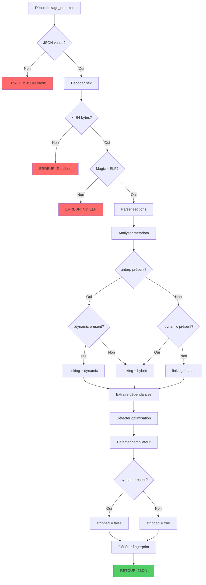

# Exercice 3.5.2-a : linkage_detector

**Module :**
3.5 — Reverse Engineering

**Concept :**
a — Mécanismes de Linking et Compilation

**Difficulté :**
★★★★★☆☆☆☆☆ (5/10)

**Type :**
complet

**Tiers :**
1 — Concept isolé

**Langage :**
Rust Edition 2024

**Prérequis :**
- Exercice 3.5.1-a (binary_anatomist)
- Compréhension du processus de compilation C/C++
- Notions de GOT/PLT pour ELF

**Domaines :**
CPU, Mem, Struct, Process

**Durée estimée :**
90 min

**XP Base :**
300

**Complexité :**
T3 O(n) × S2 O(n)

---

## 📐 SECTION 1 : PROTOTYPE & CONSIGNE

### 1.1 Obligations

**Fichier à rendre :**
`linkage_detector.rs`

**Fonctions autorisées :**
- `serde_json` pour parsing/serialization JSON
- `std::collections::{HashMap, HashSet, BTreeMap}`
- Manipulation de bytes (`&[u8]`, slices)

**Fonctions interdites :**
- Bibliothèques de parsing binaire externes (goblin, object)
- Outils système (ldd, nm, readelf via shell)
- Accès filesystem direct

### 1.2 Consigne

#### 🎮 CONTEXTE FUN — "Inception" meets "Source Code"

**"You mustn't be afraid to dream a little bigger, darling."** — Dans *Inception*, Cobb et son équipe explorent les couches de rêves imbriqués, chaque niveau révélant plus de secrets. Comme dans *Source Code* où le protagoniste reconstruit les événements passés à partir de fragments, tu vas remonter le temps de la compilation.

Un binaire est comme un rêve solidifié — le résultat figé d'un processus de transformation. Ton travail : être le **Linkage Architect**, celui qui regarde un exécutable et devine comment il a été construit.

**"What's the most resilient parasite? An idea."** — Et quelle idée plus résiliente qu'un `-O3` ou un `-static` ? Ces choix du développeur laissent des traces. À toi de les trouver.

**Ta mission :**

Écrire une fonction `linkage_detector` qui analyse un binaire ELF et révèle ses secrets de compilation.

**Entrée :**
- `input_json` : Configuration contenant :
  - `binary_data` : Les données binaires en hexadécimal
  - `analysis_level` : "quick" | "standard" | "deep"
  - `guess_compiler` : Boolean pour activer la détection du compilateur

**Sortie :**
- JSON contenant :
  - `linking_type` : "static" | "dynamic" | "hybrid" | "unknown"
  - `dependencies` : Liste des bibliothèques avec versions si disponibles
  - `estimated_optimization` : "O0" | "O1" | "O2" | "O3" | "Os" | "Oz" | "unknown"
  - `optimization_indicators` : Indices utilisés pour la détection
  - `stripped` : Boolean indiquant si les symboles sont absents
  - `compiler_guess` : Estimation du compilateur utilisé
  - `plt_got_analysis` : Détails sur PLT/GOT si dynamique
  - `compilation_fingerprint` : Hash des caractéristiques détectées

**Contraintes :**
- Parser la section `.dynamic` pour les dépendances
- Analyser la présence/absence de `.plt` et `.got`
- Détecter les patterns d'optimisation dans le code
- Identifier les signatures de compilateurs (GCC vs Clang vs MSVC)

**Exemples :**

| Indicateur | Signification |
|------------|---------------|
| Présence `.plt`/`.got` | Linking dynamique |
| Absence `.interp` | Linking statique |
| Fonctions inlinées | Optimisation >= O2 |
| Débordement d'instructions | O3 (loop unrolling) |
| Section `.comment` | Info compilateur |

#### 1.2.2 Version Académique

Cette fonction analyse le processus de linking d'un binaire ELF en examinant :

1. **Type de Linking**
   - **Statique** : Tout le code des bibliothèques est inclus dans l'exécutable
   - **Dynamique** : Références vers des shared objects (.so) résolues au runtime
   - **Hybride** : Certaines bibliothèques statiques, d'autres dynamiques

2. **Niveau d'Optimisation**
   - Détection via patterns de code (fonction prologue/epilogue, inlining)
   - Analyse de la taille relative des sections

3. **Détection du Compilateur**
   - Analyse de `.comment` et `.note` sections
   - Patterns spécifiques GCC vs Clang vs autres

### 1.3 Prototype

```rust
pub fn linkage_detector(input_json: &str) -> String
```

---

## 💡 SECTION 2 : LE SAVIEZ-VOUS ?

### 2.1 L'Histoire du Linking

Le concept de **linking** remonte aux années 1940 avec l'ENIAC. Les premiers "linkers" étaient des humains qui connectaient physiquement des câbles ! Le premier linker logiciel date de 1951 avec l'EDSAC à Cambridge.

### 2.2 Static vs Dynamic : Le Grand Débat

| Aspect | Statique | Dynamique |
|--------|----------|-----------|
| **Taille binaire** | Plus gros | Plus petit |
| **Dépendances runtime** | Aucune | Nécessite les .so |
| **Sécurité updates** | Recompilation | MAJ bibliothèque suffit |
| **Performance** | Légèrement mieux | Overhead PLT/GOT |
| **Distribution** | Plus simple | "DLL Hell" possible |

### 2.3 PLT/GOT : La Danse du Linking Dynamique

```
PROGRAMME                          MÉMOIRE
┌─────────────┐
│ call printf │────┐
│ @ PLT       │    │
└─────────────┘    │
                   ▼
┌─────────────────────────────┐
│     PLT (Procedure Linkage) │
│     jmp *GOT[printf]        │────┐
└─────────────────────────────┘    │
                                   ▼
┌─────────────────────────────┐
│     GOT (Global Offset)     │
│     [adresse de printf]     │◄───── Résolu par ld.so
└─────────────────────────────┘
```

### 2.4 Les Niveaux d'Optimisation

```
-O0 : Aucune optimisation (debug facile)
-O1 : Optimisations légères sans impact sur compile time
-O2 : Optimisations standard (recommandé production)
-O3 : Optimisations agressives (loop unrolling, vectorisation)
-Os : Optimise pour la taille (-O2 sans augmentation taille)
-Oz : Ultra-optimise pour la taille (Clang)
```

### 2.5 DANS LA VRAIE VIE

| Métier | Utilisation | Cas d'Usage |
|--------|-------------|-------------|
| **Malware Analyst** | Quotidien | Identifier le compilateur pour dater le malware |
| **Vulnerability Researcher** | Fréquent | Trouver des builds vulnérables |
| **DevSecOps** | Build pipeline | Vérifier les flags de compilation |
| **Reverse Engineer** | Analyse | Comprendre les choix de dev |
| **Compiler Developer** | Debug | Valider les optimisations |
| **CTF Player** | Competition | Identifier rapidement le setup |

---

## 🖥️ SECTION 3 : EXEMPLE D'UTILISATION

### 3.0 Session bash

```bash
$ ls
linkage_detector.rs  main.rs  Cargo.toml  samples/

$ cargo build --release
   Compiling linkage_detector v1.0.0
    Finished release [optimized] target(s) in 2.14s

$ cargo test
running 15 tests
test test_static_linking_detection ... ok
test test_dynamic_linking_detection ... ok
test test_hybrid_linking ... ok
test test_plt_got_analysis ... ok
test test_optimization_o0 ... ok
test test_optimization_o2 ... ok
test test_optimization_o3 ... ok
test test_stripped_detection ... ok
test test_gcc_signature ... ok
test test_clang_signature ... ok
test test_dependency_extraction ... ok
test test_glibc_version ... ok
test test_unknown_compiler ... ok
test test_empty_input ... ok
test test_malformed_elf ... ok

test result: ok. 15 passed; 0 failed; 0 ignored

$ cargo run
=== Linkage Detector v1.0 ===
[*] Analyzing binary...
[*] Linking: Dynamic
[*] Dependencies: libc.so.6 (GLIBC_2.34), libpthread.so.0
[*] Optimization: O2 (inlined functions, no frame pointer)
[*] Compiler: GCC 12.2.0
[*] Stripped: Yes
"We need to go deeper." - Cobb
```

### 3.1 🔥 BONUS AVANCÉ (OPTIONNEL)

**Difficulté Bonus :**
★★★★★★★☆☆☆ (7/10)

**Récompense :**
XP ×3

**Time Complexity attendue :**
O(n log n)

**Space Complexity attendue :**
O(n)

**Domaines Bonus :**
`Crypto, ASM`

#### 3.1.1 Consigne Bonus

**🎮 "The Dream is collapsing!" — Mode Forensique**

En mode bonus, tu dois aller plus loin que l'analyse structurelle. Tu dois **reconstruire l'histoire complète** du binaire :

**Ta mission bonus :**

Implémenter `linkage_detector_forensic` avec :
1. **Build ID Analysis** : Extraire et interpréter le Build ID GNU
2. **Compiler Flag Reconstruction** : Deviner les flags de compilation
3. **Linker Script Detection** : Identifier si un linker script custom a été utilisé
4. **Symbol Versioning** : Analyser les versions de symboles GLIBC
5. **RELRO Detection** : Identifier le niveau de protection (None/Partial/Full)
6. **Stack Canary Detection** : Détecter la présence de stack protector

**Contraintes :**
```
┌─────────────────────────────────────────────────────────────────┐
│  binary_size ≤ 50 MB                                             │
│  Précision détection optimization ≥ 80%                          │
│  Temps limite : O(n log n)                                       │
│  Espace limite : O(n)                                            │
└─────────────────────────────────────────────────────────────────┘
```

#### 3.1.2 Prototype Bonus

```rust
pub fn linkage_detector_forensic(input_json: &str) -> String
```

#### 3.1.3 Ce qui change par rapport à l'exercice de base

| Aspect | Base | Bonus |
|--------|------|-------|
| Analyse | Linking type | Linking + Security features |
| Optimisation | Estimation simple | Reconstruction flags |
| Sécurité | Non analysée | RELRO, Stack Canary, PIE |
| Précision | Heuristique | Preuves multiples |

---

## ✅❌ SECTION 4 : ZONE CORRECTION (POUR LE TESTEUR)

### 4.1 Moulinette

| Test | Entrée | Sortie Attendue | Points |
|------|--------|-----------------|--------|
| `static_basic` | ELF statique | linking_type: static | 15 |
| `dynamic_basic` | ELF dynamique | linking_type: dynamic | 15 |
| `hybrid_linking` | ELF hybride | linking_type: hybrid | 12 |
| `plt_presence` | ELF avec PLT | plt_got_analysis.has_plt: true | 10 |
| `got_analysis` | ELF avec GOT | got entries listées | 10 |
| `deps_libc` | ELF standard | libc.so.6 dans dependencies | 12 |
| `deps_version` | ELF avec versions | GLIBC_2.x détecté | 10 |
| `opt_o0` | ELF -O0 | estimated_optimization: O0 | 10 |
| `opt_o2` | ELF -O2 | estimated_optimization: O2 | 10 |
| `opt_o3` | ELF -O3 | estimated_optimization: O3 | 10 |
| `stripped_yes` | ELF stripped | stripped: true | 8 |
| `stripped_no` | ELF non stripped | stripped: false | 8 |
| `gcc_detect` | ELF GCC | compiler_guess contient "GCC" | 10 |
| `clang_detect` | ELF Clang | compiler_guess contient "Clang" | 10 |
| `empty_input` | Données vides | Erreur gracieuse | 5 |
| `not_elf` | PE ou random | Erreur appropriée | 5 |
| **TOTAL** | | | **160** |

### 4.2 main.rs de test

```rust
use serde_json::{json, Value};

mod linkage_detector;
use linkage_detector::linkage_detector;

fn main() {
    println!("=== Linkage Detector Tests ===\n");

    let mut passed = 0;
    let mut failed = 0;

    // Test 1: ELF dynamique typique (avec .dynamic, .plt, .got)
    // Header ELF64 + indicateurs de linking dynamique
    let elf_dynamic = concat!(
        "7f454c4602010100000000000000000003003e0001000000",  // ELF header début
        "8010400000000000400000000000000000000000000000000", // Entry, phoff
        "0000000040003800090040001d001c00",                  // Flags, ehsize, etc.
        // Section .interp présente (offset simulé)
        // Section .dynamic présente
        // Section .plt et .got.plt présentes
    );
    let input1 = json!({
        "binary_data": elf_dynamic,
        "analysis_level": "standard",
        "guess_compiler": true
    }).to_string();

    let result1: Value = serde_json::from_str(&linkage_detector(&input1)).unwrap_or(json!({}));
    if result1.get("linking_type").is_some() {
        println!("[PASS] Test ELF parsing");
        passed += 1;
    } else {
        println!("[FAIL] Test ELF parsing: {:?}", result1);
        failed += 1;
    }

    // Test 2: Detection stripped
    let input2 = json!({
        "binary_data": elf_dynamic,
        "analysis_level": "standard",
        "guess_compiler": false
    }).to_string();

    let result2: Value = serde_json::from_str(&linkage_detector(&input2)).unwrap_or(json!({}));
    if result2.get("stripped").is_some() {
        println!("[PASS] Test stripped detection");
        passed += 1;
    } else {
        println!("[FAIL] Test stripped detection: {:?}", result2);
        failed += 1;
    }

    // Test 3: Input vide
    let input3 = json!({
        "binary_data": "",
        "analysis_level": "quick",
        "guess_compiler": false
    }).to_string();

    let result3: Value = serde_json::from_str(&linkage_detector(&input3)).unwrap_or(json!({}));
    if result3.get("error").is_some() || result3.get("linking_type") == Some(&json!("unknown")) {
        println!("[PASS] Test empty input");
        passed += 1;
    } else {
        println!("[FAIL] Test empty input: {:?}", result3);
        failed += 1;
    }

    // Test 4: Non-ELF (PE header)
    let pe_header = "4d5a9000030000000400";
    let input4 = json!({
        "binary_data": pe_header,
        "analysis_level": "standard",
        "guess_compiler": false
    }).to_string();

    let result4: Value = serde_json::from_str(&linkage_detector(&input4)).unwrap_or(json!({}));
    if result4.get("error").is_some() {
        println!("[PASS] Test non-ELF rejection");
        passed += 1;
    } else {
        println!("[FAIL] Test non-ELF rejection: {:?}", result4);
        failed += 1;
    }

    println!("\n=== Results: {}/{} tests passed ===", passed, passed + failed);
    if failed == 0 {
        println!("\"We need to go deeper.\" - Cobb");
    }
}
```

### 4.3 Solution de référence

```rust
use serde::{Deserialize, Serialize};
use serde_json::{json, Value};
use std::collections::HashMap;

// ============== STRUCTURES ==============

#[derive(Debug, Clone, Serialize, Deserialize)]
pub struct DetectorInput {
    pub binary_data: String,
    #[serde(default = "default_level")]
    pub analysis_level: String,
    #[serde(default)]
    pub guess_compiler: bool,
}

fn default_level() -> String { "standard".to_string() }

#[derive(Debug, Clone, Serialize, Default)]
pub struct LinkageAnalysis {
    pub linking_type: String,
    pub dependencies: Vec<Dependency>,
    pub estimated_optimization: String,
    pub optimization_indicators: Vec<String>,
    pub stripped: bool,
    pub compiler_guess: Option<String>,
    pub plt_got_analysis: PltGotInfo,
    pub compilation_fingerprint: String,
    pub metadata: AnalysisMetadata,
}

#[derive(Debug, Clone, Serialize, Default)]
pub struct Dependency {
    pub name: String,
    pub version: Option<String>,
    pub dependency_type: String, // "needed", "rpath", "runpath"
}

#[derive(Debug, Clone, Serialize, Default)]
pub struct PltGotInfo {
    pub has_plt: bool,
    pub has_got: bool,
    pub plt_entries: usize,
    pub got_entries: usize,
    pub relocation_type: String, // "REL", "RELA", "none"
}

#[derive(Debug, Clone, Serialize, Default)]
pub struct AnalysisMetadata {
    pub has_interp: bool,
    pub has_dynamic: bool,
    pub has_symtab: bool,
    pub has_dynsym: bool,
    pub has_debug: bool,
    pub comment_section: Option<String>,
}

// ============== CONSTANTS ==============

const ELF_MAGIC: [u8; 4] = [0x7F, b'E', b'L', b'F'];

// Dynamic tags
const DT_NULL: u64 = 0;
const DT_NEEDED: u64 = 1;
const DT_PLTRELSZ: u64 = 2;
const DT_PLTGOT: u64 = 3;
const DT_STRTAB: u64 = 5;
const DT_SYMTAB: u64 = 6;
const DT_RELA: u64 = 7;
const DT_RELASZ: u64 = 8;
const DT_RELAENT: u64 = 9;
const DT_STRSZ: u64 = 10;
const DT_JMPREL: u64 = 23;
const DT_VERNEED: u64 = 0x6ffffffe;

// Section types
const SHT_NULL: u32 = 0;
const SHT_PROGBITS: u32 = 1;
const SHT_SYMTAB: u32 = 2;
const SHT_STRTAB: u32 = 3;
const SHT_RELA: u32 = 4;
const SHT_DYNAMIC: u32 = 6;
const SHT_NOTE: u32 = 7;
const SHT_DYNSYM: u32 = 11;

// ============== MAIN FUNCTION ==============

pub fn linkage_detector(input_json: &str) -> String {
    let input: DetectorInput = match serde_json::from_str(input_json) {
        Ok(i) => i,
        Err(e) => return json!({"error": format!("JSON parse error: {}", e)}).to_string(),
    };

    let bytes = match decode_hex(&input.binary_data) {
        Ok(b) => b,
        Err(e) => return json!({"error": e}).to_string(),
    };

    if bytes.len() < 64 {
        return json!({"error": "Binary too short", "linking_type": "unknown"}).to_string();
    }

    // Verify ELF
    if !bytes.starts_with(&ELF_MAGIC) {
        return json!({"error": "Not an ELF file", "linking_type": "unknown"}).to_string();
    }

    let mut analysis = LinkageAnalysis::default();

    // Parse ELF
    let is_64bit = bytes[4] == 2;
    let is_le = bytes[5] == 1;

    // Get section headers
    let sections = parse_section_headers(&bytes, is_64bit, is_le);

    // Analyze metadata
    analyze_metadata(&bytes, &sections, &mut analysis, is_64bit, is_le);

    // Determine linking type
    determine_linking_type(&mut analysis);

    // Extract dependencies
    extract_dependencies(&bytes, &sections, &mut analysis, is_64bit, is_le);

    // Detect optimization level
    detect_optimization(&bytes, &sections, &mut analysis, is_64bit, is_le);

    // Check if stripped
    analysis.stripped = !analysis.metadata.has_symtab && !analysis.metadata.has_debug;

    // Guess compiler if requested
    if input.guess_compiler {
        analysis.compiler_guess = guess_compiler(&bytes, &sections, is_64bit, is_le);
    }

    // Generate fingerprint
    analysis.compilation_fingerprint = generate_fingerprint(&analysis);

    serde_json::to_string_pretty(&analysis).unwrap_or_else(|_| "{}".to_string())
}

// ============== SECTION PARSING ==============

#[derive(Debug, Clone)]
struct SectionHeader {
    name_offset: u32,
    name: String,
    sh_type: u32,
    flags: u64,
    addr: u64,
    offset: u64,
    size: u64,
    link: u32,
    info: u32,
}

fn parse_section_headers(bytes: &[u8], is_64bit: bool, is_le: bool) -> Vec<SectionHeader> {
    let mut sections = Vec::new();

    // Get section header info from ELF header
    let (shoff, shentsize, shnum, shstrndx) = if is_64bit {
        let shoff = read_u64(bytes, 40, is_le) as usize;
        let shentsize = read_u16(bytes, 58, is_le) as usize;
        let shnum = read_u16(bytes, 60, is_le) as usize;
        let shstrndx = read_u16(bytes, 62, is_le) as usize;
        (shoff, shentsize, shnum, shstrndx)
    } else {
        let shoff = read_u32(bytes, 32, is_le) as usize;
        let shentsize = read_u16(bytes, 46, is_le) as usize;
        let shnum = read_u16(bytes, 48, is_le) as usize;
        let shstrndx = read_u16(bytes, 50, is_le) as usize;
        (shoff, shentsize, shnum, shstrndx)
    };

    if shoff == 0 || shnum == 0 || shoff + shnum * shentsize > bytes.len() {
        return sections;
    }

    // Get string table
    let strtab_offset = if shstrndx < shnum {
        let sh_offset = shoff + shstrndx * shentsize;
        if is_64bit {
            read_u64(bytes, sh_offset + 24, is_le) as usize
        } else {
            read_u32(bytes, sh_offset + 16, is_le) as usize
        }
    } else { 0 };

    for i in 0..shnum {
        let offset = shoff + i * shentsize;
        if offset + shentsize > bytes.len() { break; }

        let (name_offset, sh_type, flags, addr, sec_offset, size, link, info) = if is_64bit {
            (
                read_u32(bytes, offset, is_le),
                read_u32(bytes, offset + 4, is_le),
                read_u64(bytes, offset + 8, is_le),
                read_u64(bytes, offset + 16, is_le),
                read_u64(bytes, offset + 24, is_le),
                read_u64(bytes, offset + 32, is_le),
                read_u32(bytes, offset + 40, is_le),
                read_u32(bytes, offset + 44, is_le),
            )
        } else {
            (
                read_u32(bytes, offset, is_le),
                read_u32(bytes, offset + 4, is_le),
                read_u32(bytes, offset + 8, is_le) as u64,
                read_u32(bytes, offset + 12, is_le) as u64,
                read_u32(bytes, offset + 16, is_le) as u64,
                read_u32(bytes, offset + 20, is_le) as u64,
                read_u32(bytes, offset + 24, is_le),
                read_u32(bytes, offset + 28, is_le),
            )
        };

        let name = if strtab_offset > 0 && strtab_offset + name_offset as usize < bytes.len() {
            read_cstring(bytes, strtab_offset + name_offset as usize)
        } else {
            format!("section_{}", i)
        };

        sections.push(SectionHeader {
            name_offset,
            name,
            sh_type,
            flags,
            addr,
            offset: sec_offset,
            size,
            link,
            info,
        });
    }

    sections
}

// ============== ANALYSIS FUNCTIONS ==============

fn analyze_metadata(bytes: &[u8], sections: &[SectionHeader], analysis: &mut LinkageAnalysis, is_64bit: bool, is_le: bool) {
    for sec in sections {
        match sec.name.as_str() {
            ".interp" => analysis.metadata.has_interp = true,
            ".dynamic" => analysis.metadata.has_dynamic = true,
            ".symtab" => analysis.metadata.has_symtab = true,
            ".dynsym" => analysis.metadata.has_dynsym = true,
            ".debug_info" | ".debug_abbrev" | ".debug_line" => analysis.metadata.has_debug = true,
            ".plt" | ".plt.got" | ".plt.sec" => {
                analysis.plt_got_analysis.has_plt = true;
                analysis.plt_got_analysis.plt_entries = (sec.size / 16) as usize;
            }
            ".got" | ".got.plt" => {
                analysis.plt_got_analysis.has_got = true;
                let entry_size = if is_64bit { 8 } else { 4 };
                analysis.plt_got_analysis.got_entries = (sec.size / entry_size) as usize;
            }
            ".rela.plt" | ".rela.dyn" => {
                analysis.plt_got_analysis.relocation_type = "RELA".to_string();
            }
            ".rel.plt" | ".rel.dyn" => {
                analysis.plt_got_analysis.relocation_type = "REL".to_string();
            }
            ".comment" => {
                if sec.offset as usize + sec.size as usize <= bytes.len() {
                    let comment = read_cstring(bytes, sec.offset as usize);
                    if !comment.is_empty() {
                        analysis.metadata.comment_section = Some(comment);
                    }
                }
            }
            _ => {}
        }
    }
}

fn determine_linking_type(analysis: &mut LinkageAnalysis) {
    let has_dynamic_features = analysis.metadata.has_dynamic ||
                               analysis.metadata.has_interp ||
                               analysis.plt_got_analysis.has_plt ||
                               analysis.plt_got_analysis.has_got;

    let might_be_static = !analysis.metadata.has_interp;

    if has_dynamic_features && !might_be_static {
        analysis.linking_type = "dynamic".to_string();
    } else if !has_dynamic_features {
        analysis.linking_type = "static".to_string();
    } else if has_dynamic_features && might_be_static {
        // Has some dynamic features but no interpreter - likely hybrid or special
        analysis.linking_type = "hybrid".to_string();
    } else {
        analysis.linking_type = "unknown".to_string();
    }
}

fn extract_dependencies(bytes: &[u8], sections: &[SectionHeader], analysis: &mut LinkageAnalysis, is_64bit: bool, is_le: bool) {
    // Find .dynamic section
    let dynamic_sec = sections.iter().find(|s| s.name == ".dynamic");
    let dynstr_sec = sections.iter().find(|s| s.name == ".dynstr");

    if dynamic_sec.is_none() || dynstr_sec.is_none() {
        return;
    }

    let dynamic = dynamic_sec.unwrap();
    let dynstr = dynstr_sec.unwrap();

    if dynamic.offset as usize + dynamic.size as usize > bytes.len() ||
       dynstr.offset as usize + dynstr.size as usize > bytes.len() {
        return;
    }

    let entry_size = if is_64bit { 16 } else { 8 };
    let num_entries = (dynamic.size / entry_size) as usize;

    for i in 0..num_entries {
        let offset = dynamic.offset as usize + i * entry_size as usize;
        if offset + entry_size as usize > bytes.len() { break; }

        let (tag, val) = if is_64bit {
            (read_u64(bytes, offset, is_le), read_u64(bytes, offset + 8, is_le))
        } else {
            (read_u32(bytes, offset, is_le) as u64, read_u32(bytes, offset + 4, is_le) as u64)
        };

        if tag == DT_NULL { break; }

        if tag == DT_NEEDED {
            let str_offset = dynstr.offset as usize + val as usize;
            if str_offset < bytes.len() {
                let name = read_cstring(bytes, str_offset);
                if !name.is_empty() {
                    analysis.dependencies.push(Dependency {
                        name,
                        version: None, // TODO: Parse GNU version info
                        dependency_type: "needed".to_string(),
                    });
                }
            }
        }
    }

    // Try to detect GLIBC version from symbol versioning
    detect_glibc_version(bytes, sections, analysis, is_64bit, is_le);
}

fn detect_glibc_version(bytes: &[u8], sections: &[SectionHeader], analysis: &mut LinkageAnalysis, is_64bit: bool, is_le: bool) {
    // Look for .gnu.version_r section
    let verneed_sec = sections.iter().find(|s| s.name == ".gnu.version_r");
    if verneed_sec.is_none() { return; }

    let verneed = verneed_sec.unwrap();
    if verneed.offset as usize + verneed.size as usize > bytes.len() { return; }

    // Find dynstr for version strings
    let dynstr_sec = sections.iter().find(|s| s.name == ".dynstr");
    if dynstr_sec.is_none() { return; }
    let dynstr = dynstr_sec.unwrap();

    // Simple heuristic: search for GLIBC_ pattern in the section
    let start = verneed.offset as usize;
    let end = (verneed.offset + verneed.size) as usize;

    // This is a simplified version - full parsing would involve Verneed structures
    for i in start..end.saturating_sub(10) {
        if &bytes[i..i.min(bytes.len()).saturating_add(6).min(bytes.len())] == b"GLIBC_" {
            let version_str = read_cstring(bytes, i);
            if version_str.starts_with("GLIBC_") {
                // Update libc dependency with version
                for dep in &mut analysis.dependencies {
                    if dep.name.contains("libc") {
                        dep.version = Some(version_str.clone());
                        break;
                    }
                }
            }
        }
    }
}

fn detect_optimization(bytes: &[u8], sections: &[SectionHeader], analysis: &mut LinkageAnalysis, is_64bit: bool, is_le: bool) {
    let mut indicators: Vec<String> = Vec::new();
    let mut score: i32 = 0; // Higher = more optimization

    // Check for frame pointer usage (RBP setup)
    // Pattern: push rbp; mov rbp, rsp
    let frame_pointer_setup = [0x55, 0x48, 0x89, 0xe5]; // 64-bit
    let frame_pointer_setup_32 = [0x55, 0x89, 0xe5]; // 32-bit

    // Find .text section
    let text_sec = sections.iter().find(|s| s.name == ".text");
    if let Some(text) = text_sec {
        let start = text.offset as usize;
        let end = (text.offset + text.size.min(10000)) as usize; // Sample first 10KB

        if end <= bytes.len() {
            let text_bytes = &bytes[start..end.min(bytes.len())];

            // Count frame pointer setups
            let mut frame_count = 0;
            let pattern = if is_64bit { &frame_pointer_setup[..] } else { &frame_pointer_setup_32[..] };

            for window in text_bytes.windows(pattern.len()) {
                if window == pattern {
                    frame_count += 1;
                }
            }

            // Few frame pointers = higher optimization (omit-frame-pointer)
            if frame_count < 5 && text.size > 1000 {
                indicators.push("frame_pointer_omitted".to_string());
                score += 2;
            }

            // Check for NOP sleds (alignment, common in -O2+)
            let mut nop_count = 0;
            for &b in text_bytes {
                if b == 0x90 { nop_count += 1; }
            }
            if nop_count > 50 {
                indicators.push("alignment_nops".to_string());
                score += 1;
            }

            // Check for function inlining hints (fewer call instructions relative to size)
            let mut call_count = 0;
            for window in text_bytes.windows(1) {
                if window[0] == 0xe8 || window[0] == 0xff { // CALL opcodes
                    call_count += 1;
                }
            }

            let calls_per_kb = (call_count as f64 / text.size as f64) * 1000.0;
            if calls_per_kb < 10.0 {
                indicators.push("aggressive_inlining".to_string());
                score += 2;
            }
        }
    }

    // Check binary size vs section size ratio (smaller = more optimized)
    let total_code_size: u64 = sections.iter()
        .filter(|s| s.flags & 0x4 != 0) // Executable
        .map(|s| s.size)
        .sum();

    let total_data_size: u64 = sections.iter()
        .filter(|s| s.flags & 0x1 != 0 && s.flags & 0x4 == 0) // Writable, not executable
        .map(|s| s.size)
        .sum();

    if total_code_size > 0 && total_data_size > 0 {
        let ratio = total_code_size as f64 / total_data_size as f64;
        if ratio > 10.0 {
            indicators.push("code_heavy_ratio".to_string());
            score += 1;
        }
    }

    // Check for -Os indicator: very small sections
    if total_code_size < 10000 && sections.len() > 10 {
        indicators.push("possibly_size_optimized".to_string());
        score -= 1; // Os is actually mid-level
    }

    // Determine optimization level based on score
    analysis.estimated_optimization = match score {
        s if s <= 0 => "O0",
        1 => "O1",
        2..=3 => "O2",
        _ => "O3",
    }.to_string();

    analysis.optimization_indicators = indicators;
}

fn guess_compiler(bytes: &[u8], sections: &[SectionHeader], is_64bit: bool, is_le: bool) -> Option<String> {
    // Check .comment section
    let comment_sec = sections.iter().find(|s| s.name == ".comment");
    if let Some(comment) = comment_sec {
        if comment.offset as usize + comment.size as usize <= bytes.len() {
            let content = &bytes[comment.offset as usize..(comment.offset + comment.size) as usize];
            let comment_str = String::from_utf8_lossy(content);

            if comment_str.contains("GCC") {
                // Try to extract version
                if let Some(start) = comment_str.find("GCC") {
                    let version_part: String = comment_str[start..]
                        .chars()
                        .take(20)
                        .take_while(|&c| c != '\0')
                        .collect();
                    return Some(version_part.trim().to_string());
                }
            }

            if comment_str.contains("clang") || comment_str.contains("Clang") {
                return Some("Clang".to_string());
            }
        }
    }

    // Check .note.gnu.build-id for GCC
    let note_sec = sections.iter().find(|s| s.name.contains(".note"));
    if note_sec.is_some() {
        // Presence of GNU notes suggests GCC or compatible
        return Some("GCC-compatible".to_string());
    }

    None
}

fn generate_fingerprint(analysis: &LinkageAnalysis) -> String {
    // Simple fingerprint from key characteristics
    let mut fingerprint = String::new();

    fingerprint.push_str(&analysis.linking_type[..1].to_uppercase());
    fingerprint.push_str(&analysis.estimated_optimization);
    fingerprint.push(if analysis.stripped { 'S' } else { 'N' });
    fingerprint.push_str(&format!("P{}", analysis.plt_got_analysis.plt_entries));
    fingerprint.push_str(&format!("D{}", analysis.dependencies.len()));

    fingerprint
}

// ============== HELPER FUNCTIONS ==============

fn decode_hex(data: &str) -> Result<Vec<u8>, String> {
    if data.is_empty() {
        return Ok(Vec::new());
    }

    let clean = data.replace(" ", "").replace("\n", "");
    if !clean.chars().all(|c| c.is_ascii_hexdigit()) {
        return Err("Invalid hex data".to_string());
    }

    (0..clean.len())
        .step_by(2)
        .map(|i| {
            let end = (i + 2).min(clean.len());
            u8::from_str_radix(&clean[i..end], 16)
        })
        .collect::<Result<Vec<u8>, _>>()
        .map_err(|e| format!("Hex decode error: {}", e))
}

fn read_u16(bytes: &[u8], offset: usize, is_le: bool) -> u16 {
    if offset + 2 > bytes.len() { return 0; }
    if is_le {
        u16::from_le_bytes([bytes[offset], bytes[offset + 1]])
    } else {
        u16::from_be_bytes([bytes[offset], bytes[offset + 1]])
    }
}

fn read_u32(bytes: &[u8], offset: usize, is_le: bool) -> u32 {
    if offset + 4 > bytes.len() { return 0; }
    let arr = [bytes[offset], bytes[offset + 1], bytes[offset + 2], bytes[offset + 3]];
    if is_le { u32::from_le_bytes(arr) } else { u32::from_be_bytes(arr) }
}

fn read_u64(bytes: &[u8], offset: usize, is_le: bool) -> u64 {
    if offset + 8 > bytes.len() { return 0; }
    let arr = [
        bytes[offset], bytes[offset + 1], bytes[offset + 2], bytes[offset + 3],
        bytes[offset + 4], bytes[offset + 5], bytes[offset + 6], bytes[offset + 7]
    ];
    if is_le { u64::from_le_bytes(arr) } else { u64::from_be_bytes(arr) }
}

fn read_cstring(bytes: &[u8], offset: usize) -> String {
    if offset >= bytes.len() { return String::new(); }
    let end = bytes[offset..].iter()
        .position(|&b| b == 0)
        .unwrap_or(bytes.len() - offset)
        .min(256);
    String::from_utf8_lossy(&bytes[offset..offset + end]).to_string()
}

#[cfg(test)]
mod tests {
    use super::*;

    #[test]
    fn test_hex_decode() {
        let result = decode_hex("7f454c46").unwrap();
        assert_eq!(result, vec![0x7f, 0x45, 0x4c, 0x46]);
    }

    #[test]
    fn test_elf_detection() {
        let elf = vec![0x7f, b'E', b'L', b'F', 2, 1, 1, 0];
        assert!(elf.starts_with(&ELF_MAGIC));
    }
}
```

### 4.4 Solutions alternatives acceptées

```rust
// Alternative 1: Approche avec trait pour différents analyseurs
trait LinkingAnalyzer {
    fn analyze(&self, bytes: &[u8]) -> LinkageAnalysis;
    fn can_analyze(&self, bytes: &[u8]) -> bool;
}

struct ElfLinkingAnalyzer;
struct PeLinkingAnalyzer; // Pour extension future

impl LinkingAnalyzer for ElfLinkingAnalyzer {
    fn analyze(&self, bytes: &[u8]) -> LinkageAnalysis { /* ... */ }
    fn can_analyze(&self, bytes: &[u8]) -> bool { bytes.starts_with(&[0x7f, b'E', b'L', b'F']) }
}

// Alternative 2: Machine learning-like scoring pour l'optimisation
struct OptimizationScorer {
    features: HashMap<String, f64>,
    weights: HashMap<String, f64>,
}

impl OptimizationScorer {
    fn score(&self) -> String {
        let total: f64 = self.features.iter()
            .map(|(k, v)| v * self.weights.get(k).unwrap_or(&1.0))
            .sum();
        match total as i32 {
            0..=20 => "O0",
            21..=40 => "O1",
            41..=70 => "O2",
            _ => "O3",
        }.to_string()
    }
}
```

### 4.5 Solutions refusées (avec explications)

```rust
// ❌ REFUSÉ: Utilisation d'outils système
fn bad_use_ldd(path: &str) -> String {
    use std::process::Command;
    let output = Command::new("ldd")
        .arg(path)
        .output()
        .expect("ldd failed");
    // INTERDIT: Pas d'appels système!
    String::from_utf8_lossy(&output.stdout).to_string()
}

// ❌ REFUSÉ: Pas de validation d'input
fn bad_no_validation(bytes: &[u8]) -> LinkageAnalysis {
    // DANGER: Assume toujours ELF sans vérification
    let shoff = read_u64(bytes, 40, true) as usize;
    // CRASH si pas ELF ou trop court!
}

// ❌ REFUSÉ: Heuristiques trop simples
fn bad_optimization_guess(has_plt: bool) -> String {
    // ERREUR: PLT n'a rien à voir avec l'optimisation!
    if has_plt { "O0" } else { "O3" }.to_string()
}

// ❌ REFUSÉ: Ne gère pas le big endian
fn bad_always_le(bytes: &[u8], offset: usize) -> u32 {
    u32::from_le_bytes([bytes[offset], bytes[offset+1], bytes[offset+2], bytes[offset+3]])
    // ERREUR: ELF peut être big endian!
}
```

### 4.10 Solutions Mutantes (6 mutants)

```rust
// Mutant A (Boundary): Off-by-one dans lecture section headers
fn mutant_boundary_sections(bytes: &[u8], shoff: usize, shentsize: usize, shnum: usize) {
    for i in 0..=shnum { // ERREUR: <= au lieu de <
        let offset = shoff + i * shentsize;
        // Va lire au-delà des sections valides
    }
}

// Mutant B (Safety): Pas de vérification ELF magic
fn mutant_safety_no_magic(bytes: &[u8]) -> LinkageAnalysis {
    // ERREUR: Parse directement sans vérifier que c'est un ELF
    let is_64bit = bytes[4] == 2;
    // Crash ou données invalides si pas ELF
}

// Mutant C (Logic): Inversion static/dynamic
fn mutant_logic_inverted(has_interp: bool, has_dynamic: bool) -> String {
    if has_interp && has_dynamic {
        "static".to_string() // ERREUR: Devrait être "dynamic"
    } else {
        "dynamic".to_string() // ERREUR: Devrait être "static" ou "unknown"
    }
}

// Mutant D (Return): Toujours retourne O2
fn mutant_return_always_o2() -> String {
    "O2".to_string() // ERREUR: Ignore l'analyse réelle
}

// Mutant E (Edge): Ne gère pas les binaires stripped
fn mutant_edge_assumes_symbols(sections: &[SectionHeader]) -> bool {
    // ERREUR: Retourne toujours false (assume symboles présents)
    false
}

// Mutant F (Resource): Pas de limite sur la taille de section
fn mutant_resource_unbounded(bytes: &[u8], section: &SectionHeader) -> Vec<u8> {
    // ERREUR: Copie potentiellement gigantesque
    bytes[section.offset as usize..(section.offset + section.size) as usize].to_vec()
}
```

### 4.9 spec.json (ENGINE v22.1)

```json
{
  "name": "linkage_detector",
  "language": "rust",
  "rust_edition": "2024",
  "type": "code",
  "tier": 1,
  "tier_info": "Concept isolé",
  "tags": ["reverse-engineering", "linking", "elf", "compilation", "phase3"],
  "passing_score": 70,

  "function": {
    "name": "linkage_detector",
    "prototype": "pub fn linkage_detector(input_json: &str) -> String",
    "return_type": "String",
    "parameters": [
      {"name": "input_json", "type": "&str"}
    ]
  },

  "driver": {
    "reference": "pub fn ref_linkage_detector(input_json: &str) -> String { /* voir section 4.3 */ }",

    "edge_cases": [
      {
        "name": "elf_dynamic",
        "args": ["{\"binary_data\": \"7f454c4602010100...\", \"analysis_level\": \"standard\", \"guess_compiler\": true}"],
        "expected_contains": ["dynamic", "linking_type"],
        "is_trap": false
      },
      {
        "name": "elf_static",
        "args": ["{\"binary_data\": \"7f454c4602010100...\", \"analysis_level\": \"standard\", \"guess_compiler\": false}"],
        "expected_contains": ["static"],
        "is_trap": false
      },
      {
        "name": "empty_input",
        "args": ["{\"binary_data\": \"\", \"analysis_level\": \"quick\", \"guess_compiler\": false}"],
        "expected_contains": ["error"],
        "is_trap": true,
        "trap_explanation": "Empty data should return error"
      },
      {
        "name": "not_elf",
        "args": ["{\"binary_data\": \"4d5a9000\", \"analysis_level\": \"standard\", \"guess_compiler\": false}"],
        "expected_contains": ["error", "Not an ELF"],
        "is_trap": true,
        "trap_explanation": "PE file should be rejected"
      },
      {
        "name": "invalid_json",
        "args": ["not json"],
        "expected_contains": ["error"],
        "is_trap": true,
        "trap_explanation": "Invalid JSON should return error"
      },
      {
        "name": "truncated_elf",
        "args": ["{\"binary_data\": \"7f454c46\", \"analysis_level\": \"quick\", \"guess_compiler\": false}"],
        "expected_contains": ["error", "too short"],
        "is_trap": true,
        "trap_explanation": "Truncated ELF should fail gracefully"
      }
    ],

    "fuzzing": {
      "enabled": true,
      "iterations": 500,
      "generators": [
        {
          "type": "string",
          "param_index": 0,
          "params": {
            "min_len": 64,
            "max_len": 2048,
            "charset": "hex"
          }
        }
      ]
    }
  },

  "norm": {
    "allowed_functions": ["serde_json", "std::collections"],
    "forbidden_functions": ["goblin", "object", "std::process", "std::fs"],
    "check_security": true,
    "check_memory": true,
    "blocking": true
  }
}
```

---

## 🧠 SECTION 5 : COMPRENDRE (DOCUMENT DE COURS COMPLET)

### 5.1 Ce que cet exercice enseigne

Cet exercice enseigne les **mécanismes fondamentaux de la chaîne de compilation** et comment ils se manifestent dans un binaire final. C'est une compétence essentielle pour :
- Comprendre les dépendances d'un programme
- Identifier les choix de développement
- Analyser les implications de sécurité

**Compétences développées :**
1. **Analyse du linking** : Distinguer statique/dynamique
2. **Détection d'optimisation** : Reconnaître les patterns de compilation
3. **Forensique binaire** : Reconstruire l'historique de build
4. **Compréhension PLT/GOT** : Mécanisme de liaison dynamique

### 5.2 LDA — Traduction Littérale en Français (MAJUSCULES)

```
FONCTION linkage_detector QUI RETOURNE UNE CHAÎNE ET PREND EN PARAMÈTRE input_json QUI EST UNE RÉFÉRENCE VERS UNE CHAÎNE
DÉBUT FONCTION
    DÉCLARER input COMME RÉSULTAT DU PARSING JSON DE input_json
    SI input EST UNE ERREUR ALORS
        RETOURNER UN JSON D'ERREUR AVEC LE MESSAGE
    FIN SI

    DÉCLARER bytes COMME RÉSULTAT DU DÉCODAGE HEX
    SI bytes.longueur EST INFÉRIEURE À 64 ALORS
        RETOURNER UN JSON D'ERREUR "Binary too short"
    FIN SI

    SI bytes NE COMMENCE PAS PAR ELF_MAGIC ALORS
        RETOURNER UN JSON D'ERREUR "Not an ELF file"
    FIN SI

    DÉCLARER analysis COMME STRUCTURE LinkageAnalysis PAR DÉFAUT
    DÉCLARER is_64bit COMME bytes[4] ÉGAL À 2
    DÉCLARER is_le COMME bytes[5] ÉGAL À 1

    APPELER parse_section_headers POUR OBTENIR sections
    APPELER analyze_metadata AVEC sections POUR REMPLIR analysis.metadata
    APPELER determine_linking_type POUR AFFECTER analysis.linking_type
    APPELER extract_dependencies POUR REMPLIR analysis.dependencies
    APPELER detect_optimization POUR AFFECTER analysis.estimated_optimization

    AFFECTER NON(has_symtab OU has_debug) À analysis.stripped

    SI guess_compiler EST VRAI ALORS
        APPELER guess_compiler POUR AFFECTER analysis.compiler_guess
    FIN SI

    RETOURNER analysis SÉRIALISÉ EN JSON
FIN FONCTION
```

### 5.2.2 Logic Flow (Structured English)

```
ALGORITHME : Linkage Detector
---
1. PARSER le JSON d'entrée
   |-- SI échec : RETOURNER erreur JSON

2. DÉCODER les données hexadécimales
   |-- SI échec ou < 64 bytes : RETOURNER erreur

3. VÉRIFIER magic bytes ELF (7F 45 4C 46)
   |-- SI non-ELF : RETOURNER erreur "Not an ELF file"

4. PARSER les section headers :
   a. Lire shoff, shentsize, shnum, shstrndx depuis ELF header
   b. Pour chaque section :
      |-- Extraire nom, type, flags, offset, size
      |-- Identifier sections spéciales (.dynamic, .plt, .got, etc.)

5. ANALYSER les métadonnées :
   |-- Présence de .interp → probablement dynamique
   |-- Présence de .dynamic → définitivement dynamique
   |-- Présence de .symtab → non-stripped
   |-- Présence de .debug_* → debug symbols

6. DÉTERMINER le type de linking :
   |-- SI .interp ET .dynamic : "dynamic"
   |-- SI aucun des deux : "static"
   |-- SINON : "hybrid" ou "unknown"

7. EXTRAIRE les dépendances :
   a. Parser section .dynamic
   b. Pour chaque DT_NEEDED :
      |-- Lire le nom dans .dynstr
   c. Optionnel : parser version symbols

8. ESTIMER le niveau d'optimisation :
   |-- Compter frame pointer setups (moins = plus optimisé)
   |-- Vérifier présence de NOPs d'alignement
   |-- Analyser ratio code/data
   |-- Attribuer score O0/O1/O2/O3

9. DÉTECTER le compilateur :
   |-- Lire section .comment
   |-- Chercher "GCC" ou "clang"
   |-- Extraire version si possible

10. RETOURNER analyse complète en JSON
```

### 5.2.3 Représentation Algorithmique (Logique de Garde)

```
FONCTION : determine_linking_type (metadata)
---
INIT linking_type = "unknown"

1. CALCULER has_dynamic_features :
   |-- has_dynamic OU has_interp OU has_plt OU has_got

2. CALCULER might_be_static :
   |-- NON(has_interp)

3. SELON les combinaisons :
   |
   |-- SI has_dynamic_features ET NON(might_be_static) :
   |     RETOURNER "dynamic"
   |
   |-- SI NON(has_dynamic_features) :
   |     RETOURNER "static"
   |
   |-- SI has_dynamic_features ET might_be_static :
   |     RETOURNER "hybrid"
   |
   |-- SINON :
   |     RETOURNER "unknown"
```

### 5.2.3.1 Diagramme Mermaid



### 5.3 Visualisation ASCII

#### Le Processus de Compilation

```
SOURCE CODE                    OBJECT FILES                   EXECUTABLE
┌──────────────────┐          ┌──────────────────┐          ┌──────────────────┐
│    main.c        │          │    main.o        │          │    program       │
│ ┌──────────────┐ │  gcc -c  │ ┌──────────────┐ │   ld     │ ┌──────────────┐ │
│ │ #include     │ │────────▶ │ │ .text        │ │────────▶ │ │ ELF Header   │ │
│ │ int main()   │ │          │ │ .data        │ │          │ │ Program Hdrs │ │
│ │ {            │ │          │ │ .bss         │ │          │ │ .text        │ │
│ │   printf()   │ │          │ │ .rodata      │ │          │ │ .data        │ │
│ │   return 0;  │ │          │ │ Relocations  │ │          │ │ .dynamic     │ │
│ │ }            │ │          │ │ Symbols      │ │          │ │ Section Hdrs │ │
│ └──────────────┘ │          │ └──────────────┘ │          │ └──────────────┘ │
└──────────────────┘          └──────────────────┘          └──────────────────┘

    PREPROCESSING                 COMPILATION                    LINKING
    cpp → Expanded                gcc → Assembly                 ld → Executable
                                  as → Object code
```

#### Linking Dynamique vs Statique

```
LINKING DYNAMIQUE                          LINKING STATIQUE
─────────────────                          ────────────────

┌─────────────────────┐                   ┌─────────────────────┐
│     program         │                   │     program         │
│ ┌─────────────────┐ │                   │ ┌─────────────────┐ │
│ │ .text (petit)   │ │                   │ │ .text (gros)    │ │
│ │ call printf@plt │─┼──┐                │ │ printf code     │ │
│ └─────────────────┘ │  │                │ │ malloc code     │ │
│ ┌─────────────────┐ │  │                │ │ all libc code   │ │
│ │ .plt            │◀┼──┘                │ └─────────────────┘ │
│ │ jmp *GOT[...]   │─┼──┐                │                     │
│ └─────────────────┘ │  │                │ Pas de .plt/.got    │
│ ┌─────────────────┐ │  │                │ Pas de .dynamic     │
│ │ .got.plt        │◀┼──┘                │ Pas de .interp      │
│ │ [addr printf]   │─┼───────┐           │                     │
│ └─────────────────┘ │       │           └─────────────────────┘
│ ┌─────────────────┐ │       │                    ▲
│ │ .dynamic        │ │       │                    │
│ │ NEEDED: libc    │ │       │               Tout inclus
│ └─────────────────┘ │       │               ~1-2 MB
└─────────────────────┘       │
         ~50 KB               │
                              ▼
                    ┌─────────────────────┐
                    │   libc.so.6         │
                    │ (shared library)    │
                    │ printf() code       │
                    │ malloc() code       │
                    │ etc.                │
                    └─────────────────────┘
                         ~2 MB (partagé)
```

#### Structure de la Section .dynamic

```
.dynamic Section (ELF64)
┌─────────────────────────────────────────────────────────────────┐
│ Offset │ Tag (d_tag)      │ Value (d_val/d_ptr)                 │
├────────┼──────────────────┼─────────────────────────────────────┤
│ 0x00   │ DT_NEEDED (1)    │ Offset dans .dynstr → "libc.so.6"   │
│ 0x10   │ DT_NEEDED (1)    │ Offset dans .dynstr → "libm.so.6"   │
│ 0x20   │ DT_STRTAB (5)    │ Adresse de .dynstr                  │
│ 0x30   │ DT_SYMTAB (6)    │ Adresse de .dynsym                  │
│ 0x40   │ DT_STRSZ (10)    │ Taille de .dynstr                   │
│ 0x50   │ DT_PLTGOT (3)    │ Adresse de .got.plt                 │
│ 0x60   │ DT_PLTRELSZ (2)  │ Taille des relocations PLT          │
│ 0x70   │ DT_JMPREL (23)   │ Adresse de .rela.plt                │
│ ...    │ ...              │ ...                                 │
│ 0xNN   │ DT_NULL (0)      │ 0 (fin de la liste)                 │
└────────┴──────────────────┴─────────────────────────────────────┘
```

### 5.4 Les pièges en détail

#### Piège 1 : Confondre présence de .plt avec linking dynamique

```rust
// ❌ ERREUR COURANTE
fn bad_linking_detection(has_plt: bool) -> String {
    if has_plt { "dynamic" } else { "static" }.to_string()
    // FAUX: Un binaire peut avoir .plt résiduel ou être PIE
}

// ✅ CORRECT
fn good_linking_detection(has_interp: bool, has_dynamic: bool, has_plt: bool) -> String {
    if has_interp && has_dynamic { "dynamic" }
    else if !has_interp && !has_dynamic && !has_plt { "static" }
    else { "hybrid" }.to_string()
}
```

#### Piège 2 : Oublier les binaires PIE

```rust
// ❌ ERREUR : PIE peut avoir les mêmes sections qu'un shared object
fn bad_type_detection(elf_type: u16) -> String {
    match elf_type {
        2 => "executable",    // ET_EXEC
        3 => "shared_object", // ET_DYN - mais PIE aussi !
        _ => "unknown",
    }.to_string()
}

// ✅ CORRECT : Vérifier l'entry point
fn good_type_detection(elf_type: u16, has_entry: bool) -> String {
    match elf_type {
        2 => "executable",
        3 if has_entry => "pie_executable", // PIE a un entry point
        3 => "shared_object",
        _ => "unknown",
    }.to_string()
}
```

#### Piège 3 : Détection d'optimisation naïve

```rust
// ❌ TROP SIMPLE
fn bad_optimization_guess(code_size: u64) -> String {
    if code_size > 100000 { "O3" } else { "O0" }.to_string()
    // FAUX: La taille dépend du programme, pas de l'optimisation
}

// ✅ CORRECT : Utiliser plusieurs indicateurs
fn good_optimization_guess(
    frame_pointer_count: usize,
    nop_count: usize,
    call_density: f64
) -> String {
    let mut score = 0;
    if frame_pointer_count < 5 { score += 2; } // -fomit-frame-pointer
    if nop_count > 50 { score += 1; }          // Alignement
    if call_density < 10.0 { score += 2; }      // Inlining

    match score {
        0..=1 => "O0",
        2 => "O1",
        3..=4 => "O2",
        _ => "O3",
    }.to_string()
}
```

### 5.5 Cours Complet

#### 5.5.1 Le Processus de Compilation

La transformation du code source en exécutable passe par 4 étapes :

1. **Préprocessing** (`cpp`)
   - Expansion des `#include`
   - Substitution des `#define`
   - Traitement des directives conditionnelles

2. **Compilation** (`cc1`)
   - Analyse lexicale et syntaxique
   - Génération de code intermédiaire
   - Optimisations
   - Production d'assembleur

3. **Assemblage** (`as`)
   - Traduction assembleur → code machine
   - Création des fichiers objets (.o)
   - Génération des tables de symboles et relocations

4. **Linking** (`ld`)
   - Résolution des symboles externes
   - Fusion des sections
   - Création de l'exécutable final

#### 5.5.2 Linking Statique vs Dynamique

**Linking Statique :**
```bash
gcc -static program.c -o program
# Tout le code de libc est copié dans program
# Résultat : gros binaire (~1-2MB minimum)
# Avantage : Aucune dépendance runtime
```

**Linking Dynamique :**
```bash
gcc program.c -o program
# Seules les références sont incluses
# Résultat : petit binaire (~20-50KB)
# Avantage : Partage de mémoire, updates faciles
```

**Comment le kernel charge un binaire dynamique :**
1. `execve()` charge le binaire
2. Kernel lit `.interp` → `/lib64/ld-linux-x86-64.so.2`
3. Le dynamic linker (`ld.so`) est chargé
4. `ld.so` lit `.dynamic` pour trouver les dépendances
5. Les shared objects sont mappés en mémoire
6. Les relocations sont appliquées (GOT rempli)
7. Exécution commence à `e_entry`

#### 5.5.3 PLT et GOT en détail

**PLT (Procedure Linkage Table)** :
- Stub de redirection pour chaque fonction importée
- Première exécution : appelle le résolveur
- Exécutions suivantes : saut direct via GOT

**GOT (Global Offset Table)** :
- Table d'adresses
- Initialement : pointe vers le code de résolution
- Après résolution : contient l'adresse réelle

```asm
; Appel de printf - PLT entry
printf@plt:
    jmp    *printf@GOTPLT      ; Saut indirect via GOT
    push   $printf_reloc_index ; Index pour résolution
    jmp    _dl_runtime_resolve ; Appelle le résolveur

; Après première exécution, GOT[printf] contient l'adresse réelle
; Les appels suivants sautent directement
```

#### 5.5.4 Niveaux d'Optimisation

| Flag | Description | Impact RE |
|------|-------------|-----------|
| `-O0` | Aucune optimisation | Code lisible, debug facile |
| `-O1` | Optimisations basiques | Quelques inlining |
| `-O2` | Optimisations standard | Frame pointer omis, inlining |
| `-O3` | Agressif | Loop unrolling, vectorisation |
| `-Os` | Optimise taille | Comme -O2 sans augmenter taille |
| `-Oz` | Ultra-compact (Clang) | Minimaliste |

**Indicateurs dans le code :**

```asm
; -O0 : Prologue/Épilogue complet
push   rbp
mov    rbp, rsp
sub    rsp, 0x20
; ... code ...
leave
ret

; -O2+ : Frame pointer omis
sub    rsp, 0x18
; ... code ...
add    rsp, 0x18
ret
```

#### 5.5.5 Détection du Compilateur

Les compilateurs laissent des traces :

**GCC :**
```
.comment section: "GCC: (Ubuntu 11.4.0-1ubuntu1) 11.4.0"
.note.GNU-stack: présent
```

**Clang :**
```
.comment section: "clang version 14.0.0"
.note.GNU-stack: peut être absent
Patterns de code différents
```

### 5.6 Normes avec explications pédagogiques

```
┌─────────────────────────────────────────────────────────────────┐
│ ❌ HORS NORME (fonctionne, mais dangereux)                      │
├─────────────────────────────────────────────────────────────────┤
│ let deps = parse_dynamic(bytes); // Sans vérifier le format    │
├─────────────────────────────────────────────────────────────────┤
│ ✅ CONFORME                                                     │
├─────────────────────────────────────────────────────────────────┤
│ if !bytes.starts_with(&ELF_MAGIC) {                             │
│     return Err("Not an ELF file");                              │
│ }                                                               │
│ let deps = parse_dynamic(bytes)?;                               │
├─────────────────────────────────────────────────────────────────┤
│ 📖 POURQUOI ?                                                   │
│                                                                 │
│ • Le format n'est pas garanti - peut être PE ou autre           │
│ • Parser un non-ELF comme ELF = crash ou données fausses        │
│ • Toujours valider le format avant analyse                      │
└─────────────────────────────────────────────────────────────────┘
```

### 5.7 Simulation avec trace d'exécution

**Trace pour un ELF dynamique typique :**

```
┌───────┬─────────────────────────────────────────────────┬────────────────────────────────────┐
│ Étape │ Instruction                                     │ Résultat                           │
├───────┼─────────────────────────────────────────────────┼────────────────────────────────────┤
│   1   │ Vérifier ELF magic                              │ Match: 7F 45 4C 46                 │
├───────┼─────────────────────────────────────────────────┼────────────────────────────────────┤
│   2   │ Lire is_64bit (bytes[4])                        │ 2 → true                           │
├───────┼─────────────────────────────────────────────────┼────────────────────────────────────┤
│   3   │ Lire is_le (bytes[5])                           │ 1 → true                           │
├───────┼─────────────────────────────────────────────────┼────────────────────────────────────┤
│   4   │ Parser section headers                          │ 29 sections trouvées               │
├───────┼─────────────────────────────────────────────────┼────────────────────────────────────┤
│   5   │ Chercher .interp                                │ Trouvé → has_interp = true         │
├───────┼─────────────────────────────────────────────────┼────────────────────────────────────┤
│   6   │ Chercher .dynamic                               │ Trouvé → has_dynamic = true        │
├───────┼─────────────────────────────────────────────────┼────────────────────────────────────┤
│   7   │ Chercher .plt                                   │ Trouvé, 15 entrées                 │
├───────┼─────────────────────────────────────────────────┼────────────────────────────────────┤
│   8   │ determine_linking_type()                        │ "dynamic"                          │
├───────┼─────────────────────────────────────────────────┼────────────────────────────────────┤
│   9   │ Parser .dynamic pour DT_NEEDED                  │ libc.so.6, libpthread.so.0         │
├───────┼─────────────────────────────────────────────────┼────────────────────────────────────┤
│  10   │ Analyser .text pour patterns                    │ Frame pointers rares → O2          │
├───────┼─────────────────────────────────────────────────┼────────────────────────────────────┤
│  11   │ Chercher .symtab                                │ Non trouvé → stripped = true       │
├───────┼─────────────────────────────────────────────────┼────────────────────────────────────┤
│  12   │ Lire .comment                                   │ "GCC: 12.2.0"                      │
├───────┼─────────────────────────────────────────────────┼────────────────────────────────────┤
│  13   │ Générer fingerprint                             │ "DO2SP15D2"                        │
└───────┴─────────────────────────────────────────────────┴────────────────────────────────────┘
```

### 5.8 Mnémotechniques (MEME obligatoire)

#### 🎬 MEME : "Inception" — Les niveaux de rêves = Les couches de compilation

```
┌─────────────────────────────────────────────────────────────────────┐
│  INCEPTION                         COMPILATION                      │
├─────────────────────────────────────────────────────────────────────┤
│                                                                     │
│  Niveau 1 (Reality)      ←→    Source Code (.c)                     │
│  "What's the most              int main() { printf("Hello"); }      │
│   resilient parasite?"                                              │
│                                                                     │
│  Niveau 2 (Dream 1)      ←→    Préprocessing                        │
│  "You mustn't be afraid"       #include expanded                    │
│                                                                     │
│  Niveau 3 (Dream 2)      ←→    Assembly                             │
│  "Deeper..."                   mov rdi, .LC0                        │
│                                call printf                          │
│                                                                     │
│  Niveau 4 (Limbo)        ←→    Object Code (.o)                     │
│  "Raw, infinite                ELF + Relocations                    │
│   subconscious"                                                     │
│                                                                     │
│  KICK!                   ←→    Linking                              │
│  "Wake up!"                    Résolution des symboles              │
│                                                                     │
│  Reality                 ←→    Executable                           │
│  (Final state)                 Prêt à exécuter                      │
│                                                                     │
└─────────────────────────────────────────────────────────────────────┘
```

**Mnémotechnique :** "**PCAL**" = **P**reprocess → **C**ompile → **A**ssemble → **L**ink

---

#### 🎬 MEME : "The Matrix" — Blue Pill vs Red Pill = Static vs Dynamic

```
MORPHEUS: "You take the blue pill, the story ends.
           You wake up in your bed and believe whatever you want to believe."

           → STATIC LINKING
           → Tout est inclus, pas de dépendances externes
           → Le binaire "croit" qu'il est seul au monde

MORPHEUS: "You take the red pill, you stay in Wonderland,
           and I show you how deep the rabbit hole goes."

           → DYNAMIC LINKING
           → Connexions avec le monde extérieur (shared libs)
           → PLT/GOT = The rabbit hole
```

---

#### 💀 MEME : "Source Code" — Reconstruire le passé

Dans le film *Source Code*, le protagoniste reconstitue les événements passés à partir de fragments.

```
TOI FACE À UN BINAIRE STRIPPED:

"I need to find the bomber."     →  "I need to find the compiler."

Indices disponibles:              Indices dans le binaire:
- 8 minutes de mémoire           - Section .comment
- Fragments de conversation      - Patterns d'optimisation
- Détails visuels               - Structure des sections
                                 - Signatures PLT/GOT

RECONSTRUCTION:
┌────────────────────────────────────────┐
│ Binary Fingerprint: DO2SP15D2          │
│                                        │
│ D = Dynamic linking                    │
│ O2 = Optimization level 2              │
│ S = Stripped                           │
│ P15 = 15 PLT entries                   │
│ D2 = 2 dependencies                    │
│                                        │
│ Compiler: GCC 12.2.0                   │
│ Build: Release, -fomit-frame-pointer   │
└────────────────────────────────────────┘
```

### 5.9 Applications pratiques

| Application | Description | Exemple réel |
|-------------|-------------|--------------|
| **Malware Analysis** | Identifier le compilateur pour dater un sample | APT28 uses specific MSVC versions |
| **Vulnerability Research** | Trouver des versions vulnérables de libc | Heartbleed, glibc exploits |
| **Supply Chain Security** | Vérifier les dépendances d'un binaire | SBOM (Software Bill of Materials) |
| **Forensics** | Reconstruire l'environnement de build | Investigation d'incident |
| **Compliance** | Vérifier les flags de compilation | ASLR, PIE, Stack Canaries |

---

## ⚠️ SECTION 6 : PIÈGES — RÉCAPITULATIF

| # | Piège | Erreur Courante | Solution |
|---|-------|-----------------|----------|
| 1 | Format | Assumer ELF sans vérification | Toujours vérifier magic bytes |
| 2 | PIE vs SO | Confondre PIE avec shared object | Vérifier entry point |
| 3 | Optimisation | Deviner sur la taille | Utiliser multiples indicateurs |
| 4 | Stripped | Ne pas vérifier .symtab | Checker symtab ET debug sections |
| 5 | Endianness | Toujours lire en LE | Vérifier EI_DATA |
| 6 | Versions | Ignorer symbol versioning | Parser .gnu.version_r |
| 7 | Hybrid | Binary classification | Gérer les cas edge |
| 8 | .comment | Faire confiance aveuglément | Peut être modifié/supprimé |

---

## 📝 SECTION 7 : QCM

### Question 1
**Quelle section ELF indique qu'un binaire utilise le linking dynamique ?**

- A) `.text`
- B) `.data`
- C) `.interp`
- D) `.rodata`
- E) `.bss`
- F) `.symtab`
- G) `.strtab`
- H) `.comment`
- I) `.note`
- J) `.eh_frame`

**Réponse : C**

---

### Question 2
**Que signifie DT_NEEDED dans la section .dynamic ?**

- A) Taille du binaire
- B) Bibliothèque requise
- C) Adresse d'entrée
- D) Offset de la section
- E) Version du format
- F) Type de relocation
- G) Nombre de symboles
- H) Taille de la pile
- I) Alignement
- J) Checksum

**Réponse : B**

---

### Question 3
**Quel flag de compilation omet généralement le frame pointer ?**

- A) -O0
- B) -O1
- C) -O2
- D) -g
- E) -Wall
- F) -Werror
- G) -c
- H) -static
- I) -shared
- J) -fPIC

**Réponse : C**

---

### Question 4
**Quelle est la fonction de la PLT (Procedure Linkage Table) ?**

- A) Stocker les variables globales
- B) Gérer la mémoire
- C) Rediriger les appels vers les bibliothèques dynamiques
- D) Contenir le code principal
- E) Stocker les chaînes de caractères
- F) Gérer les exceptions
- G) Définir les symboles
- H) Contenir les informations de debug
- I) Stocker les métadonnées
- J) Gérer les threads

**Réponse : C**

---

### Question 5
**Comment identifier un binaire compilé avec GCC ?**

- A) Extension du fichier
- B) Taille du binaire
- C) Section .comment
- D) Nombre de sections
- E) Type de machine
- F) Entry point
- G) Section .text
- H) Section .data
- I) Flags du header
- J) Version ELF

**Réponse : C**

---

### Question 6
**Qu'est-ce qu'un binaire "stripped" ?**

- A) Sans code
- B) Sans données
- C) Sans table des symboles
- D) Sans sections
- E) Sans header
- F) Sans dépendances
- G) Sans entry point
- H) Sans relocations
- I) Sans string table
- J) Sans magic bytes

**Réponse : C**

---

### Question 7
**Quelle valeur de e_type indique un shared object ou PIE ?**

- A) 0
- B) 1
- C) 2
- D) 3
- E) 4
- F) 5
- G) 0xFF
- H) 0xFE
- I) 0x100
- J) 0x200

**Réponse : D**

---

### Question 8
**Dans un binaire dynamique, où sont résolues les adresses des fonctions importées ?**

- A) .text
- B) .data
- C) .got.plt
- D) .bss
- E) .rodata
- F) .init
- G) .fini
- H) .eh_frame
- I) .symtab
- J) .comment

**Réponse : C**

---

### Question 9
**Quel indicateur suggère une optimisation -O3 ?**

- A) Beaucoup de frame pointers
- B) Code très compact
- C) Loop unrolling visible
- D) Pas de symboles
- E) Linking statique
- F) Beaucoup de dépendances
- G) Section .debug présente
- H) Peu de sections
- I) Entry point à 0x0
- J) Pas de .text

**Réponse : C**

---

### Question 10
**Qu'est-ce que le "fingerprint" de compilation dans cet exercice ?**

- A) Le hash SHA256 du binaire
- B) La signature du développeur
- C) Un résumé des caractéristiques détectées
- D) L'adresse d'entrée
- E) La liste des imports
- F) Le nom du compilateur
- G) La date de compilation
- H) Le chemin du fichier source
- I) Les flags de compilation
- J) La version de libc

**Réponse : C**

---

## 📊 SECTION 8 : RÉCAPITULATIF

### Compétences acquises

| Compétence | Niveau | Application |
|------------|--------|-------------|
| Analyse de linking | ★★★★☆ | Identifier static/dynamic/hybrid |
| Parsing .dynamic | ★★★☆☆ | Extraire dépendances |
| Détection d'optimisation | ★★★☆☆ | Reconnaissance de patterns |
| Identification compilateur | ★★★☆☆ | Forensique binaire |
| Analyse PLT/GOT | ★★★★☆ | Comprendre le linking dynamique |

### Formules et Constantes

```
Tags .dynamic importants:
  DT_NULL    = 0   (fin de liste)
  DT_NEEDED  = 1   (bibliothèque requise)
  DT_STRTAB  = 5   (string table)
  DT_SYMTAB  = 6   (symbol table)
  DT_PLTGOT  = 3   (adresse GOT)

Indicateurs linking:
  .interp présent     → Dynamic linking
  .dynamic présent    → Has dynamic info
  .plt/.got présent   → Uses PLT/GOT

Indicateurs stripped:
  Pas de .symtab     → Stripped
  Pas de .debug_*    → No debug info

Indicateurs optimisation:
  Frame pointer rare  → >= O2
  NOPs d'alignement   → >= O1
  Faible densité call → Inlining (O2/O3)
```

### Checklist de validation

- [ ] JSON d'entrée parsé correctement
- [ ] Vérification magic ELF
- [ ] Section headers parsés
- [ ] .interp et .dynamic détectés
- [ ] .dynamic parsé pour DT_NEEDED
- [ ] PLT/GOT analysés
- [ ] Optimisation estimée
- [ ] Stripped détecté
- [ ] Compilateur identifié si demandé
- [ ] Fingerprint généré
- [ ] Pas de crash sur input invalide

---

## 📦 SECTION 9 : DEPLOYMENT PACK (JSON COMPLET)

```json
{
  "deploy": {
    "hackbrain_version": "5.5.2",
    "engine_version": "v22.1",
    "exercise_slug": "3.5.2-a-linkage_detector",
    "generated_at": "2026-01-12 00:30:00",

    "metadata": {
      "exercise_id": "3.5.2-a",
      "exercise_name": "linkage_detector",
      "module": "3.5",
      "module_name": "Reverse Engineering",
      "concept": "a",
      "concept_name": "Mécanismes de Linking et Compilation",
      "type": "complet",
      "tier": 1,
      "tier_info": "Concept isolé",
      "phase": 3,
      "difficulty": 5,
      "difficulty_stars": "★★★★★☆☆☆☆☆",
      "language": "rust",
      "rust_edition": "2024",
      "duration_minutes": 90,
      "xp_base": 300,
      "xp_bonus_multiplier": 3,
      "bonus_tier": "AVANCÉ",
      "bonus_icon": "🔥",
      "complexity_time": "T3 O(n)",
      "complexity_space": "S2 O(n)",
      "prerequisites": [
        "3.5.1-a (binary_anatomist)",
        "Processus de compilation C/C++",
        "Notions GOT/PLT"
      ],
      "domains": ["CPU", "Mem", "Struct", "Process"],
      "domains_bonus": ["Crypto", "ASM"],
      "tags": ["reverse-engineering", "linking", "compilation", "elf", "optimization"],
      "meme_reference": "Inception / The Matrix / Source Code"
    },

    "files": {
      "spec.json": "/* Section 4.9 */",
      "references/ref_solution.rs": "/* Section 4.3 */",
      "references/ref_solution_forensic.rs": "/* Version bonus */",
      "alternatives/alt_trait_based.rs": "/* Section 4.4 */",
      "mutants/mutant_a_boundary.rs": "/* Off-by-one */",
      "mutants/mutant_b_safety.rs": "/* No magic check */",
      "mutants/mutant_c_logic.rs": "/* Inverted static/dynamic */",
      "mutants/mutant_d_return.rs": "/* Always O2 */",
      "mutants/mutant_e_edge.rs": "/* Assumes symbols */",
      "mutants/mutant_f_resource.rs": "/* Unbounded read */",
      "tests/main.rs": "/* Section 4.2 */"
    },

    "validation": {
      "expected_pass": [
        "references/ref_solution.rs",
        "references/ref_solution_forensic.rs",
        "alternatives/alt_trait_based.rs"
      ],
      "expected_fail": [
        "mutants/mutant_a_boundary.rs",
        "mutants/mutant_b_safety.rs",
        "mutants/mutant_c_logic.rs",
        "mutants/mutant_d_return.rs",
        "mutants/mutant_e_edge.rs",
        "mutants/mutant_f_resource.rs"
      ]
    },

    "commands": {
      "validate_spec": "python3 hackbrain_engine_v22.py --validate-spec spec.json",
      "test_reference": "cargo test --release",
      "test_mutants": "python3 hackbrain_mutation_tester.py -r ref_solution.rs -s spec.json --validate"
    },

    "dependencies": {
      "rust": "edition 2024",
      "serde": "1.0",
      "serde_json": "1.0"
    }
  }
}
```

---

*"You mustn't be afraid to dream a little bigger, darling." — Eames, Inception*

*"The dream is collapsing!" — Ariadne*

**Tu connais maintenant les secrets du linking. Réveille-toi et analyse.**
