# Exercice 3.5.3-a : symbol_resurrector

**Module :**
3.5 — Reverse Engineering

**Concept :**
a — Symboles de Debug et Reconstruction

**Difficulté :**
★★★★★★★☆☆☆ (7/10)

**Type :**
complet

**Tiers :**
1 — Concept isolé

**Langage :**
Rust Edition 2024

**Prérequis :**
- Exercice 3.5.1-a (binary_anatomist)
- Exercice 3.5.2-a (linkage_detector)
- Compréhension des conventions d'appel x86/x86_64
- Notions de C++ name mangling

**Domaines :**
CPU, ASM, Encodage, Struct

**Durée estimée :**
120 min

**XP Base :**
400

**Complexité :**
T4 O(n) × S3 O(n)

---

## 📐 SECTION 1 : PROTOTYPE & CONSIGNE

### 1.1 Obligations

**Fichier à rendre :**
`symbol_resurrector.rs`

**Fonctions autorisées :**
- `serde_json` pour parsing/serialization JSON
- `std::collections::{HashMap, HashSet, BTreeMap, BTreeSet}`
- Manipulation de bytes (`&[u8]`, slices)
- Expressions régulières basiques (via pattern matching manuel)

**Fonctions interdites :**
- Bibliothèques de démangling externes (cpp_demangle, rustc-demangle)
- Bibliothèques de disassemblage (capstone, iced-x86)
- Accès filesystem direct

### 1.2 Consigne

#### 🎮 CONTEXTE FUN — "Blade Runner" meets "Westworld"

**"I've seen things you people wouldn't believe... Attack ships on fire off the shoulder of Orion."** — Dans *Blade Runner*, le Replicant Roy Batty possède des souvenirs implantés, des identités reconstruites à partir de fragments. Dans *Westworld*, les Hosts découvrent progressivement qui ils sont vraiment en analysant leur propre code.

Tu es le **Symbol Resurrector** — un archéologue numérique. Un binaire stripped est comme un Host dont la mémoire a été effacée : les fonctions existent, mais leurs noms ont été perdus. Ta mission : leur rendre leur identité.

**"These violent delights have violent ends."** — Mais pas pour toi. Tu vas faire revivre ce qui était mort, reconstruire ce qui a été détruit.

**Ta mission :**

Écrire une fonction `symbol_resurrector` qui analyse un binaire stripped et reconstruit une table de symboles partielle.

**Entrée :**
- `input_json` : Configuration contenant :
  - `binary_data` : Les données binaires (hexadécimal)
  - `text_section_offset` : Offset de la section .text
  - `text_section_size` : Taille de la section .text
  - `architecture` : "x86_64" | "x86" | "arm64" | "arm"
  - `mangled_hints` : Liste optionnelle de symboles manglés trouvés ailleurs

**Sortie :**
- JSON contenant :
  - `functions` : Liste des fonctions détectées
    - `address` : Adresse de début
    - `size` : Taille estimée
    - `calling_convention` : Convention d'appel détectée
    - `demangled` : Nom démanglé si applicable
    - `suggested_name` : Nom suggéré basé sur l'analyse
    - `confidence` : Score de confiance (0.0-1.0)
    - `prologue_type` : Type de prologue détecté
  - `total_functions_found` : Nombre total de fonctions
  - `coverage` : Pourcentage de .text couvert
  - `warnings` : Avertissements sur l'analyse

**Contraintes :**
- Détecter les prologues de fonctions (push rbp; mov rbp, rsp; etc.)
- Identifier les épilogues (leave; ret; pop rbp; ret; etc.)
- Démangler les symboles C++ au format Itanium (_ZN...)
- Reconnaître les patterns de fonctions connues (main, __libc_start_main, etc.)
- Estimer la taille des fonctions

**Patterns de reconnaissance :**

| Pattern (x86_64) | Signification |
|------------------|---------------|
| `55 48 89 e5` | push rbp; mov rbp, rsp (frame setup) |
| `48 83 ec XX` | sub rsp, XX (stack alloc) |
| `c9` ou `5d` | leave ou pop rbp |
| `c3` | ret |
| `48 8d 3d XX XX XX XX` | lea rdi, [rip+X] (string ref, souvent avant call) |

#### 1.2.2 Version Académique

Cette fonction implémente un analyseur de code machine qui :

1. **Détection de fonctions** : Identifie les frontières de fonctions via les patterns de prologue/épilogue
2. **Analyse des conventions d'appel** : Détermine si la fonction suit System V AMD64, cdecl, stdcall, etc.
3. **Démangling C++** : Décode les noms de symboles au format Itanium
4. **Heuristiques de nommage** : Suggère des noms basés sur le comportement observé

### 1.3 Prototype

```rust
pub fn symbol_resurrector(input_json: &str) -> String
```

---

## 💡 SECTION 2 : LE SAVIEZ-VOUS ?

### 2.1 Pourquoi les symboles sont strippés ?

1. **Taille** : Les symboles peuvent représenter 10-30% d'un binaire
2. **Protection IP** : Cacher les noms de fonctions internes
3. **Anti-reverse** : Rendre l'analyse plus difficile
4. **Production** : Convention pour les builds release

### 2.2 Le Name Mangling C++

C++ permet la surcharge de fonctions (même nom, paramètres différents). Le compilateur génère des noms uniques :

```cpp
// Source C++
namespace MyLib {
    class Widget {
        void process(int x);
        void process(std::string s);
    };
}

// Après mangling (Itanium ABI)
_ZN5MyLib6Widget7processEi      // process(int)
_ZN5MyLib6Widget7processESs     // process(std::string)
```

**Décodage :**
```
_ZN5MyLib6Widget7processEi
  │  │    │      │       │
  │  │    │      │       └─ Type: i = int
  │  │    │      └─ 7 chars: "process"
  │  │    └─ 6 chars: "Widget"
  │  └─ 5 chars: "MyLib"
  └─ _ZN = début de nested name
```

### 2.3 Les Conventions d'Appel

| Convention | Arguments | Caller cleanup | Utilisé par |
|------------|-----------|----------------|-------------|
| **System V AMD64** | RDI, RSI, RDX, RCX, R8, R9 | Oui | Linux 64-bit |
| **Microsoft x64** | RCX, RDX, R8, R9 | Oui | Windows 64-bit |
| **cdecl** | Stack (right to left) | Oui | C 32-bit |
| **stdcall** | Stack | Non | WinAPI 32-bit |
| **fastcall** | ECX, EDX, stack | Non | Optimisé 32-bit |

### 2.4 DANS LA VRAIE VIE

| Métier | Utilisation | Cas d'Usage |
|--------|-------------|-------------|
| **Malware Analyst** | Quotidien | Identifier les fonctions malveillantes |
| **Vulnerability Researcher** | Fréquent | Trouver les fonctions vulnérables |
| **Game Modder** | Hobby | Identifier les fonctions à hooker |
| **Reverse Engineer** | Quotidien | Comprendre un binaire propriétaire |
| **CTF Player** | Compétition | Résoudre les challenges rapidement |
| **Security Auditor** | Audit | Mapper les fonctionnalités d'un binaire |

---

## 🖥️ SECTION 3 : EXEMPLE D'UTILISATION

### 3.0 Session bash

```bash
$ ls
symbol_resurrector.rs  main.rs  Cargo.toml  samples/

$ cargo build --release
   Compiling symbol_resurrector v1.0.0
    Finished release [optimized] target(s) in 2.45s

$ cargo test
running 16 tests
test test_function_detection_x64 ... ok
test test_function_detection_x86 ... ok
test test_prologue_standard ... ok
test test_prologue_no_frame ... ok
test test_epilogue_detection ... ok
test test_demangle_simple ... ok
test test_demangle_nested ... ok
test test_demangle_templates ... ok
test test_calling_conv_sysv ... ok
test test_calling_conv_ms ... ok
test test_main_detection ... ok
test test_libc_start_main ... ok
test test_size_estimation ... ok
test test_confidence_scoring ... ok
test test_empty_input ... ok
test test_malformed_code ... ok

test result: ok. 16 passed; 0 failed; 0 ignored

$ cargo run
=== Symbol Resurrector v1.0 ===
[*] Analyzing stripped binary...
[*] Detected architecture: x86_64
[*] Scanning for function prologues...
[*] Found 42 functions
[*] Demangled 5 C++ symbols
[*] Coverage: 94.2%
"These violent delights have violent ends." - Dolores
"But not for your symbols. They live again."
```

### 3.1 💀 BONUS EXPERT (OPTIONNEL)

**Difficulté Bonus :**
★★★★★★★★☆☆ (8/10)

**Récompense :**
XP ×4

**Time Complexity attendue :**
O(n log n)

**Space Complexity attendue :**
O(n)

**Domaines Bonus :**
`CPU, Crypto`

#### 3.1.1 Consigne Bonus

**🎮 "What door?" — Mode Maze**

Dans *Westworld*, certaines portes sont invisibles tant qu'on n'a pas la clé pour les voir. En mode bonus, tu dois détecter les **fonctions obfusquées** et les **symboles intentionnellement cachés**.

**Ta mission bonus :**

Implémenter `symbol_resurrector_advanced` avec :
1. **Détection de fonctions indirectes** : Via call tables, vtables
2. **Analyse de control flow** : Identifier les basic blocks
3. **Pattern matching avancé** : Reconnaître les fonctions standard (memcpy, strlen, etc.)
4. **Recovery de types** : Inférer les types des paramètres
5. **Cross-reference analysis** : Qui appelle qui ?

**Contraintes :**
```
┌─────────────────────────────────────────────────────────────────┐
│  code_size ≤ 10 MB                                               │
│  Précision détection fonctions ≥ 90%                             │
│  Temps limite : O(n log n)                                       │
│  Espace limite : O(n)                                            │
└─────────────────────────────────────────────────────────────────┘
```

#### 3.1.2 Prototype Bonus

```rust
pub fn symbol_resurrector_advanced(input_json: &str) -> String
```

#### 3.1.3 Ce qui change par rapport à l'exercice de base

| Aspect | Base | Bonus |
|--------|------|-------|
| Détection | Prologues linéaires | + Call tables, vtables |
| Analyse | Fonction par fonction | Control flow graph |
| Patterns | Prologues/épilogues | + Fonctions standard |
| Output | Noms suggérés | + Types inférés, xrefs |

---

## ✅❌ SECTION 4 : ZONE CORRECTION (POUR LE TESTEUR)

### 4.1 Moulinette

| Test | Entrée | Sortie Attendue | Points |
|------|--------|-----------------|--------|
| `prologue_standard` | Code avec `55 48 89 e5` | Fonction détectée | 15 |
| `prologue_no_frame` | Code avec `48 83 ec XX` | Fonction détectée | 12 |
| `epilogue_leave_ret` | Code avec `c9 c3` | Fin de fonction | 10 |
| `epilogue_pop_ret` | Code avec `5d c3` | Fin de fonction | 10 |
| `multiple_functions` | 5 fonctions | 5 fonctions trouvées | 15 |
| `demangle_simple` | `_ZN3FooC1Ev` | `Foo::Foo()` | 12 |
| `demangle_nested` | `_ZN5Outer5Inner3fooEv` | `Outer::Inner::foo()` | 12 |
| `demangle_params` | `_ZN3Foo3barEiPc` | `Foo::bar(int, char*)` | 12 |
| `conv_sysv` | Code utilisant RDI,RSI | `sysv_amd64` | 10 |
| `conv_ms` | Code utilisant RCX,RDX | `ms_x64` | 10 |
| `main_detection` | Pattern main | suggested: "main" | 12 |
| `size_estimation` | Fonction 100 bytes | size: ~100 | 10 |
| `confidence_high` | Prologue clair | confidence: > 0.8 | 8 |
| `confidence_low` | Prologue ambigu | confidence: < 0.5 | 8 |
| `empty_text` | Section vide | functions: [] | 5 |
| `malformed` | Bytes invalides | Erreur gracieuse | 5 |
| **TOTAL** | | | **166** |

### 4.2 main.rs de test

```rust
use serde_json::{json, Value};

mod symbol_resurrector;
use symbol_resurrector::symbol_resurrector;

fn main() {
    println!("=== Symbol Resurrector Tests ===\n");

    let mut passed = 0;
    let mut failed = 0;

    // Test 1: Standard prologue detection
    // push rbp; mov rbp, rsp; sub rsp, 0x20; ... ; leave; ret
    let code_standard = "554889e54883ec20b8000000005dc3";
    let input1 = json!({
        "binary_data": code_standard,
        "text_section_offset": 0,
        "text_section_size": 14,
        "architecture": "x86_64",
        "mangled_hints": []
    }).to_string();

    let result1: Value = serde_json::from_str(&symbol_resurrector(&input1)).unwrap_or(json!({}));
    if let Some(funcs) = result1.get("functions") {
        if funcs.as_array().map(|a| !a.is_empty()).unwrap_or(false) {
            println!("[PASS] Test standard prologue");
            passed += 1;
        } else {
            println!("[FAIL] Test standard prologue: No functions found");
            failed += 1;
        }
    } else {
        println!("[FAIL] Test standard prologue: {:?}", result1);
        failed += 1;
    }

    // Test 2: C++ name demangling
    let input2 = json!({
        "binary_data": code_standard,
        "text_section_offset": 0,
        "text_section_size": 14,
        "architecture": "x86_64",
        "mangled_hints": ["_ZN5MyLib6Widget7processEi"]
    }).to_string();

    let result2: Value = serde_json::from_str(&symbol_resurrector(&input2)).unwrap_or(json!({}));
    // Check if any function has demangled info
    let has_demangled = result2.get("functions")
        .and_then(|f| f.as_array())
        .map(|arr| arr.iter().any(|f| f.get("demangled").is_some()))
        .unwrap_or(false);

    if has_demangled || result2.get("demangled_symbols").is_some() {
        println!("[PASS] Test C++ demangling");
        passed += 1;
    } else {
        println!("[INFO] Test C++ demangling: No demangled symbols (may be expected)");
        passed += 1; // Lenient for this test
    }

    // Test 3: Empty input
    let input3 = json!({
        "binary_data": "",
        "text_section_offset": 0,
        "text_section_size": 0,
        "architecture": "x86_64",
        "mangled_hints": []
    }).to_string();

    let result3: Value = serde_json::from_str(&symbol_resurrector(&input3)).unwrap_or(json!({}));
    if result3.get("functions").and_then(|f| f.as_array()).map(|a| a.is_empty()).unwrap_or(false)
       || result3.get("error").is_some() {
        println!("[PASS] Test empty input");
        passed += 1;
    } else {
        println!("[FAIL] Test empty input: {:?}", result3);
        failed += 1;
    }

    // Test 4: Multiple functions
    // Function 1: push rbp; mov rbp, rsp; xor eax, eax; pop rbp; ret
    // Function 2: push rbp; mov rbp, rsp; mov eax, 1; pop rbp; ret
    let multi_funcs = "554889e531c05dc3554889e5b8010000005dc3";
    let input4 = json!({
        "binary_data": multi_funcs,
        "text_section_offset": 0,
        "text_section_size": 18,
        "architecture": "x86_64",
        "mangled_hints": []
    }).to_string();

    let result4: Value = serde_json::from_str(&symbol_resurrector(&input4)).unwrap_or(json!({}));
    let func_count = result4.get("functions")
        .and_then(|f| f.as_array())
        .map(|a| a.len())
        .unwrap_or(0);

    if func_count >= 1 { // At least one function detected
        println!("[PASS] Test multiple functions (found {})", func_count);
        passed += 1;
    } else {
        println!("[FAIL] Test multiple functions: {:?}", result4);
        failed += 1;
    }

    println!("\n=== Results: {}/{} tests passed ===", passed, passed + failed);
    if failed == 0 {
        println!("\"These violent delights have violent ends.\"");
        println!("\"But not for your symbols. They live again.\"");
    }
}
```

### 4.3 Solution de référence

```rust
use serde::{Deserialize, Serialize};
use serde_json::json;
use std::collections::{HashMap, HashSet};

// ============== STRUCTURES ==============

#[derive(Debug, Clone, Serialize, Deserialize)]
pub struct ResurrectorInput {
    pub binary_data: String,
    pub text_section_offset: usize,
    pub text_section_size: usize,
    pub architecture: String,
    #[serde(default)]
    pub mangled_hints: Vec<String>,
}

#[derive(Debug, Clone, Serialize, Default)]
pub struct ResurrectorOutput {
    pub functions: Vec<DetectedFunction>,
    pub total_functions_found: usize,
    pub coverage: f64,
    pub demangled_symbols: Vec<DemangledSymbol>,
    pub warnings: Vec<String>,
}

#[derive(Debug, Clone, Serialize)]
pub struct DetectedFunction {
    pub address: String,
    pub size: usize,
    pub calling_convention: String,
    pub demangled: Option<String>,
    pub suggested_name: String,
    pub confidence: f64,
    pub prologue_type: String,
    pub epilogue_type: String,
}

#[derive(Debug, Clone, Serialize)]
pub struct DemangledSymbol {
    pub mangled: String,
    pub demangled: String,
}

// ============== PROLOGUE/EPILOGUE PATTERNS ==============

struct ProloguePattern {
    bytes: Vec<u8>,
    mask: Vec<u8>,  // 0xFF = exact match, 0x00 = wildcard
    name: &'static str,
    confidence_boost: f64,
}

fn get_x64_prologues() -> Vec<ProloguePattern> {
    vec![
        // push rbp; mov rbp, rsp
        ProloguePattern {
            bytes: vec![0x55, 0x48, 0x89, 0xE5],
            mask: vec![0xFF, 0xFF, 0xFF, 0xFF],
            name: "standard_frame",
            confidence_boost: 0.3,
        },
        // push rbp; mov rbp, rsp; sub rsp, imm8
        ProloguePattern {
            bytes: vec![0x55, 0x48, 0x89, 0xE5, 0x48, 0x83, 0xEC],
            mask: vec![0xFF, 0xFF, 0xFF, 0xFF, 0xFF, 0xFF, 0xFF],
            name: "standard_frame_alloc",
            confidence_boost: 0.4,
        },
        // sub rsp, imm8 (no frame pointer)
        ProloguePattern {
            bytes: vec![0x48, 0x83, 0xEC],
            mask: vec![0xFF, 0xFF, 0xFF],
            name: "no_frame_alloc",
            confidence_boost: 0.2,
        },
        // push rbx (callee-saved, often first)
        ProloguePattern {
            bytes: vec![0x53],
            mask: vec![0xFF],
            name: "push_callee_saved",
            confidence_boost: 0.1,
        },
        // endbr64 (CET)
        ProloguePattern {
            bytes: vec![0xF3, 0x0F, 0x1E, 0xFA],
            mask: vec![0xFF, 0xFF, 0xFF, 0xFF],
            name: "endbr64",
            confidence_boost: 0.35,
        },
    ]
}

fn get_x64_epilogues() -> Vec<Vec<u8>> {
    vec![
        vec![0xC3],              // ret
        vec![0xC9, 0xC3],        // leave; ret
        vec![0x5D, 0xC3],        // pop rbp; ret
        vec![0x48, 0x83, 0xC4],  // add rsp, imm8 (then expect ret)
        vec![0xC2],              // ret imm16
    ]
}

// ============== MAIN FUNCTION ==============

pub fn symbol_resurrector(input_json: &str) -> String {
    let input: ResurrectorInput = match serde_json::from_str(input_json) {
        Ok(i) => i,
        Err(e) => return json!({"error": format!("JSON parse error: {}", e)}).to_string(),
    };

    let bytes = match decode_hex(&input.binary_data) {
        Ok(b) => b,
        Err(e) => return json!({"error": e, "functions": []}).to_string(),
    };

    if bytes.is_empty() || input.text_section_size == 0 {
        return json!({
            "functions": [],
            "total_functions_found": 0,
            "coverage": 0.0,
            "demangled_symbols": [],
            "warnings": ["Empty or zero-size text section"]
        }).to_string();
    }

    let mut output = ResurrectorOutput::default();

    // Demangle hints first
    for mangled in &input.mangled_hints {
        if let Some(demangled) = demangle_itanium(mangled) {
            output.demangled_symbols.push(DemangledSymbol {
                mangled: mangled.clone(),
                demangled,
            });
        }
    }

    // Get architecture-specific patterns
    let (prologues, epilogues) = match input.architecture.as_str() {
        "x86_64" => (get_x64_prologues(), get_x64_epilogues()),
        "x86" => (get_x86_prologues(), get_x86_epilogues()),
        _ => {
            output.warnings.push(format!("Unsupported architecture: {}", input.architecture));
            (get_x64_prologues(), get_x64_epilogues()) // Fallback
        }
    };

    // Scan for function boundaries
    let text_start = input.text_section_offset;
    let text_end = text_start + input.text_section_size.min(bytes.len());
    let text_bytes = &bytes[text_start.min(bytes.len())..text_end.min(bytes.len())];

    let mut functions = Vec::new();
    let mut covered_bytes: HashSet<usize> = HashSet::new();
    let mut func_id = 0;

    let mut i = 0;
    while i < text_bytes.len() {
        // Check for prologue patterns
        let mut best_match: Option<(&ProloguePattern, usize)> = None;

        for prologue in &prologues {
            if matches_pattern(text_bytes, i, &prologue.bytes, &prologue.mask) {
                if best_match.is_none() || prologue.bytes.len() > best_match.unwrap().1 {
                    best_match = Some((prologue, prologue.bytes.len()));
                }
            }
        }

        if let Some((prologue, _)) = best_match {
            // Found a function start, find its end
            let func_start = text_start + i;
            let (func_end, epilogue_type) = find_function_end(text_bytes, i, &epilogues);
            let func_size = func_end.saturating_sub(i);

            if func_size > 0 && func_size < 100000 { // Sanity check
                // Mark bytes as covered
                for j in i..func_end.min(text_bytes.len()) {
                    covered_bytes.insert(j);
                }

                // Analyze calling convention
                let calling_conv = detect_calling_convention(
                    text_bytes,
                    i,
                    func_end.min(text_bytes.len()),
                    &input.architecture
                );

                // Calculate confidence
                let mut confidence = 0.5 + prologue.confidence_boost;
                if !epilogue_type.is_empty() {
                    confidence += 0.2;
                }
                confidence = confidence.min(0.99);

                // Generate suggested name
                let suggested = suggest_function_name(
                    text_bytes,
                    i,
                    func_size,
                    func_id,
                    &output.demangled_symbols
                );

                functions.push(DetectedFunction {
                    address: format!("0x{:x}", func_start),
                    size: func_size,
                    calling_convention: calling_conv,
                    demangled: None, // Would need address mapping
                    suggested_name: suggested,
                    confidence,
                    prologue_type: prologue.name.to_string(),
                    epilogue_type,
                });

                func_id += 1;
                i = func_end;
                continue;
            }
        }

        i += 1;
    }

    // Calculate coverage
    let coverage = if text_bytes.is_empty() {
        0.0
    } else {
        (covered_bytes.len() as f64 / text_bytes.len() as f64) * 100.0
    };

    output.functions = functions;
    output.total_functions_found = output.functions.len();
    output.coverage = (coverage * 10.0).round() / 10.0; // Round to 1 decimal

    serde_json::to_string_pretty(&output).unwrap_or_else(|_| "{}".to_string())
}

// ============== PATTERN MATCHING ==============

fn matches_pattern(bytes: &[u8], offset: usize, pattern: &[u8], mask: &[u8]) -> bool {
    if offset + pattern.len() > bytes.len() {
        return false;
    }

    for (i, (&p, &m)) in pattern.iter().zip(mask.iter()).enumerate() {
        if m == 0xFF && bytes[offset + i] != p {
            return false;
        }
    }
    true
}

fn find_function_end(bytes: &[u8], start: usize, epilogues: &[Vec<u8>]) -> (usize, String) {
    let max_func_size = 50000; // 50KB max function
    let search_end = (start + max_func_size).min(bytes.len());

    for i in start..search_end {
        for (idx, epilogue) in epilogues.iter().enumerate() {
            if i + epilogue.len() <= bytes.len() {
                let mut matches = true;
                for (j, &b) in epilogue.iter().enumerate() {
                    // For patterns with wildcards (like add rsp, imm8), just check opcode
                    if j == 0 || b == bytes[i + j] {
                        continue;
                    } else if epilogue.len() <= 2 { // Short patterns must match exactly
                        matches = false;
                        break;
                    }
                }

                if matches && (epilogue[0] == 0xC3 || epilogue[0] == 0xC9 ||
                              (epilogue.len() >= 2 && epilogue[1] == 0xC3)) {
                    let epilogue_name = match idx {
                        0 => "ret",
                        1 => "leave_ret",
                        2 => "pop_rbp_ret",
                        3 => "add_rsp_ret",
                        4 => "ret_imm",
                        _ => "unknown",
                    };
                    return (i + epilogue.len(), epilogue_name.to_string());
                }
            }
        }
    }

    // No clear end found, estimate based on next prologue or max size
    (search_end, "unclear".to_string())
}

// ============== CALLING CONVENTION DETECTION ==============

fn detect_calling_convention(bytes: &[u8], start: usize, end: usize, arch: &str) -> String {
    if end <= start || end > bytes.len() {
        return "unknown".to_string();
    }

    let func_bytes = &bytes[start..end];

    match arch {
        "x86_64" => {
            // Check for System V AMD64 register usage (RDI, RSI first args)
            // mov from rdi/rsi patterns
            let uses_rdi_rsi = func_bytes.windows(3).any(|w| {
                // mov [rbp-X], rdi/rsi or uses of 0x48 0x89 0x7d/75 (store rdi/rsi)
                (w[0] == 0x48 && w[1] == 0x89 && (w[2] == 0x7D || w[2] == 0x75))
            });

            // Check for Microsoft x64 (RCX, RDX first args)
            let uses_rcx_rdx = func_bytes.windows(3).any(|w| {
                (w[0] == 0x48 && w[1] == 0x89 && (w[2] == 0x4D || w[2] == 0x55))
            });

            if uses_rdi_rsi {
                "sysv_amd64".to_string()
            } else if uses_rcx_rdx {
                "ms_x64".to_string()
            } else {
                "sysv_amd64".to_string() // Default for x86_64
            }
        }
        "x86" => {
            // Check for stack-based calling (cdecl/stdcall)
            let has_ebp_frame = func_bytes.windows(3).any(|w| {
                w[0] == 0x55 && w[1] == 0x89 && w[2] == 0xE5 // push ebp; mov ebp, esp
            });

            if has_ebp_frame {
                "cdecl".to_string() // Can't easily distinguish cdecl/stdcall
            } else {
                "unknown_x86".to_string()
            }
        }
        _ => "unknown".to_string(),
    }
}

// ============== NAME DEMANGLING ==============

fn demangle_itanium(mangled: &str) -> Option<String> {
    if !mangled.starts_with("_Z") {
        return None;
    }

    let mut result = String::new();
    let chars: Vec<char> = mangled.chars().collect();
    let mut i = 2; // Skip "_Z"

    // Check for nested name
    if i < chars.len() && chars[i] == 'N' {
        i += 1;
        let names = parse_nested_name(&chars, &mut i);
        result = names.join("::");
    } else {
        // Simple name
        if let Some((name, new_i)) = parse_source_name(&chars, i) {
            result = name;
            i = new_i;
        }
    }

    // Parse parameters
    if i < chars.len() && chars[i] == 'E' {
        i += 1; // End of nested name
    }

    let params = parse_parameters(&chars, &mut i);
    if !params.is_empty() {
        result.push('(');
        result.push_str(&params.join(", "));
        result.push(')');
    } else {
        result.push_str("()");
    }

    if result.is_empty() {
        None
    } else {
        Some(result)
    }
}

fn parse_nested_name(chars: &[char], i: &mut usize) -> Vec<String> {
    let mut names = Vec::new();

    while *i < chars.len() && chars[*i] != 'E' {
        if chars[*i].is_ascii_digit() {
            if let Some((name, new_i)) = parse_source_name(chars, *i) {
                names.push(name);
                *i = new_i;
            } else {
                break;
            }
        } else if chars[*i] == 'C' || chars[*i] == 'D' {
            // Constructor/Destructor
            let kind = chars[*i];
            *i += 1;
            if *i < chars.len() && chars[*i].is_ascii_digit() {
                *i += 1;
            }
            if let Some(last) = names.last() {
                let ctor_name = if kind == 'C' {
                    last.clone()
                } else {
                    format!("~{}", last)
                };
                names.push(ctor_name);
            }
        } else {
            break;
        }
    }

    names
}

fn parse_source_name(chars: &[char], start: usize) -> Option<(String, usize)> {
    let mut i = start;
    let mut len_str = String::new();

    while i < chars.len() && chars[i].is_ascii_digit() {
        len_str.push(chars[i]);
        i += 1;
    }

    if len_str.is_empty() {
        return None;
    }

    let len: usize = len_str.parse().ok()?;
    if i + len > chars.len() {
        return None;
    }

    let name: String = chars[i..i + len].iter().collect();
    Some((name, i + len))
}

fn parse_parameters(chars: &[char], i: &mut usize) -> Vec<String> {
    let mut params = Vec::new();

    while *i < chars.len() {
        let param = match chars[*i] {
            'v' => { *i += 1; None } // void
            'i' => { *i += 1; Some("int".to_string()) }
            'c' => { *i += 1; Some("char".to_string()) }
            's' => { *i += 1; Some("short".to_string()) }
            'l' => { *i += 1; Some("long".to_string()) }
            'x' => { *i += 1; Some("long long".to_string()) }
            'f' => { *i += 1; Some("float".to_string()) }
            'd' => { *i += 1; Some("double".to_string()) }
            'b' => { *i += 1; Some("bool".to_string()) }
            'P' => {
                *i += 1;
                let inner = parse_parameters(chars, i);
                Some(format!("{}*", inner.first().unwrap_or(&"?".to_string())))
            }
            'R' => {
                *i += 1;
                let inner = parse_parameters(chars, i);
                Some(format!("{}&", inner.first().unwrap_or(&"?".to_string())))
            }
            'K' => { *i += 1; continue; } // const qualifier
            'S' => {
                *i += 1;
                if *i < chars.len() && chars[*i] == 's' {
                    *i += 1;
                    Some("std::string".to_string())
                } else {
                    Some("substitution".to_string())
                }
            }
            _ => break,
        };

        if let Some(p) = param {
            params.push(p);
        }
    }

    params
}

// ============== NAME SUGGESTION ==============

fn suggest_function_name(
    bytes: &[u8],
    start: usize,
    size: usize,
    id: usize,
    demangled: &[DemangledSymbol]
) -> String {
    let end = (start + size).min(bytes.len());
    let func_bytes = &bytes[start..end];

    // Check for main-like pattern (specific setup for argc/argv)
    if func_bytes.len() > 10 {
        // main often has: mov edi, edi or test for argc
        if func_bytes.windows(2).any(|w| w == [0x89, 0xFF]) {
            return "sub_main_candidate".to_string();
        }
    }

    // Check for very short functions (likely simple getters/setters)
    if size < 20 {
        // xor eax, eax; ret pattern
        if func_bytes.contains(&0x31) && func_bytes.contains(&0xC0) {
            return format!("sub_return_zero_{:x}", start);
        }
        // mov eax, 1; ret pattern
        if func_bytes.windows(2).any(|w| w == [0xB8, 0x01]) {
            return format!("sub_return_one_{:x}", start);
        }
        return format!("sub_short_{:x}", start);
    }

    // Default: address-based name
    format!("sub_{:x}", start)
}

// ============== x86 PATTERNS ==============

fn get_x86_prologues() -> Vec<ProloguePattern> {
    vec![
        ProloguePattern {
            bytes: vec![0x55, 0x89, 0xE5],
            mask: vec![0xFF, 0xFF, 0xFF],
            name: "standard_frame_x86",
            confidence_boost: 0.3,
        },
        ProloguePattern {
            bytes: vec![0x55, 0x89, 0xE5, 0x83, 0xEC],
            mask: vec![0xFF, 0xFF, 0xFF, 0xFF, 0xFF],
            name: "standard_frame_alloc_x86",
            confidence_boost: 0.4,
        },
    ]
}

fn get_x86_epilogues() -> Vec<Vec<u8>> {
    vec![
        vec![0xC3],
        vec![0xC9, 0xC3],
        vec![0x5D, 0xC3],
    ]
}

// ============== HELPERS ==============

fn decode_hex(data: &str) -> Result<Vec<u8>, String> {
    if data.is_empty() {
        return Ok(Vec::new());
    }

    let clean = data.replace(" ", "").replace("\n", "");
    if !clean.chars().all(|c| c.is_ascii_hexdigit()) {
        return Err("Invalid hex data".to_string());
    }

    (0..clean.len())
        .step_by(2)
        .map(|i| {
            let end = (i + 2).min(clean.len());
            u8::from_str_radix(&clean[i..end], 16)
        })
        .collect::<Result<Vec<u8>, _>>()
        .map_err(|e| format!("Hex decode error: {}", e))
}

#[cfg(test)]
mod tests {
    use super::*;

    #[test]
    fn test_demangle_simple() {
        let result = demangle_itanium("_ZN3FooC1Ev");
        assert!(result.is_some());
        assert!(result.unwrap().contains("Foo"));
    }

    #[test]
    fn test_demangle_params() {
        let result = demangle_itanium("_ZN3Foo3barEiPc");
        assert!(result.is_some());
        let demangled = result.unwrap();
        assert!(demangled.contains("bar"));
        assert!(demangled.contains("int"));
    }

    #[test]
    fn test_pattern_matching() {
        let bytes = vec![0x55, 0x48, 0x89, 0xE5, 0x90, 0xC3];
        let pattern = vec![0x55, 0x48, 0x89, 0xE5];
        let mask = vec![0xFF, 0xFF, 0xFF, 0xFF];
        assert!(matches_pattern(&bytes, 0, &pattern, &mask));
        assert!(!matches_pattern(&bytes, 1, &pattern, &mask));
    }
}
```

### 4.4 Solutions alternatives acceptées

```rust
// Alternative 1: State machine pour la détection de fonctions
enum FunctionState {
    Searching,
    InPrologue(usize),
    InBody(usize, usize),
    InEpilogue(usize, usize),
}

struct FunctionDetector {
    state: FunctionState,
    functions: Vec<DetectedFunction>,
}

impl FunctionDetector {
    fn process_byte(&mut self, byte: u8, offset: usize) {
        // Transition entre états selon les patterns
    }
}

// Alternative 2: Approche basée sur le control flow
struct BasicBlock {
    start: usize,
    end: usize,
    successors: Vec<usize>,
    predecessors: Vec<usize>,
}

fn build_cfg(bytes: &[u8]) -> Vec<BasicBlock> {
    // Construire le CFG et identifier les fonctions par les blocs d'entrée
}

// Alternative 3: Pattern matching avec regex-like DSL
macro_rules! pattern {
    ($($byte:expr),+ ; $name:expr) => {
        Pattern::new(vec![$($byte),+], $name)
    };
}

let prologue = pattern![0x55, 0x48, 0x89, 0xE5; "standard"];
```

### 4.5 Solutions refusées (avec explications)

```rust
// ❌ REFUSÉ: Utilisation de bibliothèque de démangling
use cpp_demangle::Symbol;
fn bad_demangle(mangled: &str) -> String {
    Symbol::new(mangled).unwrap().to_string() // INTERDIT
}

// ❌ REFUSÉ: Utilisation de disassembleur externe
use capstone::Capstone;
fn bad_disasm(bytes: &[u8]) -> Vec<Instruction> {
    let cs = Capstone::new().x86().mode(x86::ArchMode::Mode64).build().unwrap();
    cs.disasm_all(bytes, 0).unwrap().iter().collect() // INTERDIT
}

// ❌ REFUSÉ: Détection naïve sans patterns
fn bad_function_detection(bytes: &[u8]) -> Vec<usize> {
    // Juste chercher les "ret" = TRÈS mauvais
    bytes.iter().enumerate()
        .filter(|(_, &b)| b == 0xC3)
        .map(|(i, _)| i)
        .collect()
}

// ❌ REFUSÉ: Pas de gestion des architectures
fn bad_no_arch_check(bytes: &[u8]) -> Vec<DetectedFunction> {
    // Assume toujours x86_64 = cassé sur ARM/x86
}
```

### 4.10 Solutions Mutantes (6 mutants)

```rust
// Mutant A (Boundary): Off-by-one dans la taille de fonction
fn mutant_boundary_size(start: usize, end: usize) -> usize {
    end - start + 1 // ERREUR: +1 en trop
}

// Mutant B (Safety): Pas de vérification des bounds pour le pattern matching
fn mutant_safety_pattern(bytes: &[u8], offset: usize, pattern: &[u8]) -> bool {
    for (i, &p) in pattern.iter().enumerate() {
        if bytes[offset + i] != p { // CRASH si offset + i >= bytes.len()
            return false;
        }
    }
    true
}

// Mutant C (Logic): Mauvais décodage du name mangling
fn mutant_logic_demangle(chars: &[char], i: &mut usize) -> Option<String> {
    // ERREUR: Ne gère pas les constructeurs/destructeurs
    if chars[*i] == 'C' || chars[*i] == 'D' {
        return None; // Devrait retourner le nom de la classe
    }
}

// Mutant D (Return): Toujours retourne confidence 1.0
fn mutant_return_confidence() -> f64 {
    1.0 // ERREUR: Pas de calcul réel de la confiance
}

// Mutant E (Edge): Ne gère pas les fonctions sans épilogue clair
fn mutant_edge_no_epilogue(bytes: &[u8], start: usize) -> usize {
    // ERREUR: Boucle infinie si pas de ret trouvé
    let mut i = start;
    while bytes[i] != 0xC3 {
        i += 1;
    }
    i
}

// Mutant F (Resource): Allocation pour chaque byte
fn mutant_resource_alloc(bytes: &[u8]) -> Vec<DetectedFunction> {
    let mut results = Vec::new();
    for i in 0..bytes.len() {
        results.push(DetectedFunction { // Allocation excessive
            address: format!("0x{:x}", i),
            // ...
        });
    }
    results
}
```

### 4.9 spec.json (ENGINE v22.1)

```json
{
  "name": "symbol_resurrector",
  "language": "rust",
  "rust_edition": "2024",
  "type": "code",
  "tier": 1,
  "tier_info": "Concept isolé",
  "tags": ["reverse-engineering", "symbols", "demangling", "function-detection", "phase3"],
  "passing_score": 70,

  "function": {
    "name": "symbol_resurrector",
    "prototype": "pub fn symbol_resurrector(input_json: &str) -> String",
    "return_type": "String",
    "parameters": [
      {"name": "input_json", "type": "&str"}
    ]
  },

  "driver": {
    "reference": "pub fn ref_symbol_resurrector(input_json: &str) -> String { /* voir section 4.3 */ }",

    "edge_cases": [
      {
        "name": "standard_prologue",
        "args": ["{\"binary_data\": \"554889e54883ec20b8000000005dc3\", \"text_section_offset\": 0, \"text_section_size\": 14, \"architecture\": \"x86_64\", \"mangled_hints\": []}"],
        "expected_contains": ["functions", "address"],
        "is_trap": false
      },
      {
        "name": "cpp_demangle",
        "args": ["{\"binary_data\": \"554889e5c3\", \"text_section_offset\": 0, \"text_section_size\": 5, \"architecture\": \"x86_64\", \"mangled_hints\": [\"_ZN3FooC1Ev\"]}"],
        "expected_contains": ["Foo"],
        "is_trap": false
      },
      {
        "name": "empty_section",
        "args": ["{\"binary_data\": \"\", \"text_section_offset\": 0, \"text_section_size\": 0, \"architecture\": \"x86_64\", \"mangled_hints\": []}"],
        "expected_contains": ["functions", "[]"],
        "is_trap": true,
        "trap_explanation": "Empty section should return empty function list"
      },
      {
        "name": "invalid_json",
        "args": ["not valid json"],
        "expected_contains": ["error"],
        "is_trap": true,
        "trap_explanation": "Invalid JSON should return error"
      },
      {
        "name": "multiple_functions",
        "args": ["{\"binary_data\": \"554889e531c05dc3554889e5b8010000005dc3\", \"text_section_offset\": 0, \"text_section_size\": 18, \"architecture\": \"x86_64\", \"mangled_hints\": []}"],
        "expected_contains": ["functions"],
        "is_trap": false
      }
    ],

    "fuzzing": {
      "enabled": true,
      "iterations": 500,
      "generators": [
        {
          "type": "string",
          "param_index": 0,
          "params": {
            "min_len": 10,
            "max_len": 1000,
            "charset": "hex"
          }
        }
      ]
    }
  },

  "norm": {
    "allowed_functions": ["serde_json", "std::collections"],
    "forbidden_functions": ["cpp_demangle", "rustc_demangle", "capstone", "iced_x86"],
    "check_security": true,
    "check_memory": true,
    "blocking": true
  }
}
```

---

## 🧠 SECTION 5 : COMPRENDRE (DOCUMENT DE COURS COMPLET)

### 5.1 Ce que cet exercice enseigne

Cet exercice enseigne les **fondamentaux de la reconstruction de symboles** — une compétence cruciale quand on analyse des binaires stripped. C'est la différence entre voir `sub_401000` et comprendre que c'est `UserManager::validateCredentials()`.

**Compétences développées :**
1. **Pattern recognition** : Identifier les frontières de fonctions
2. **Convention d'appel** : Comprendre comment les arguments sont passés
3. **Name demangling** : Décoder les noms C++ manglés
4. **Heuristiques** : Suggérer des noms significatifs

### 5.2 LDA — Traduction Littérale en Français (MAJUSCULES)

```
FONCTION symbol_resurrector QUI RETOURNE UNE CHAÎNE ET PREND EN PARAMÈTRE input_json QUI EST UNE RÉFÉRENCE VERS UNE CHAÎNE
DÉBUT FONCTION
    DÉCLARER input COMME RÉSULTAT DU PARSING JSON DE input_json
    SI input EST UNE ERREUR ALORS
        RETOURNER UN JSON D'ERREUR
    FIN SI

    DÉCLARER bytes COMME RÉSULTAT DU DÉCODAGE HEX
    SI bytes EST VIDE OU text_section_size EST ÉGAL À 0 ALORS
        RETOURNER UN JSON AVEC functions VIDE
    FIN SI

    DÉCLARER output COMME STRUCTURE ResurrectorOutput PAR DÉFAUT

    POUR CHAQUE mangled DANS mangled_hints FAIRE
        SI demangle_itanium(mangled) RETOURNE UN RÉSULTAT ALORS
            AJOUTER LE SYMBOLE DÉMANGLÉ À output.demangled_symbols
        FIN SI
    FIN POUR

    DÉCLARER prologues ET epilogues SELON architecture
    DÉCLARER text_bytes COMME SLICE DE bytes DEPUIS text_section_offset

    DÉCLARER i COMME 0
    TANT QUE i EST INFÉRIEUR À text_bytes.longueur FAIRE
        POUR CHAQUE prologue DANS prologues FAIRE
            SI matches_pattern(text_bytes, i, prologue) ALORS
                DÉCLARER func_start COMME text_section_offset PLUS i
                APPELER find_function_end POUR OBTENIR func_end ET epilogue_type
                CALCULER func_size COMME func_end MOINS i

                DÉCLARER calling_conv COMME RÉSULTAT DE detect_calling_convention
                CALCULER confidence SELON prologue ET épilogue
                DÉCLARER suggested COMME RÉSULTAT DE suggest_function_name

                CRÉER DetectedFunction ET AJOUTER À output.functions
                AFFECTER func_end À i
            FIN SI
        FIN POUR
        INCRÉMENTER i DE 1
    FIN TANT QUE

    CALCULER coverage COMME bytes_couverts DIVISÉ PAR taille_totale
    RETOURNER output SÉRIALISÉ EN JSON
FIN FONCTION
```

### 5.2.2 Logic Flow (Structured English)

```
ALGORITHME : Symbol Resurrector
---
1. PARSER le JSON d'entrée
   |-- SI échec : RETOURNER erreur

2. DÉCODER les données hexadécimales
   |-- SI vide : RETOURNER liste de fonctions vide

3. DÉMANGLER les hints fournis :
   POUR chaque symbole manglé :
   |-- SI commence par "_Z" :
   |     PARSER le format Itanium
   |     AJOUTER à demangled_symbols

4. SÉLECTIONNER les patterns selon l'architecture :
   |-- x86_64 : Patterns 64-bit (push rbp, sub rsp, etc.)
   |-- x86 : Patterns 32-bit (push ebp, etc.)
   |-- arm64/arm : Patterns ARM

5. SCANNER pour les fonctions :
   POUR chaque position dans text_section :
   |
   |-- CHERCHER correspondance avec prologues
   |     SI trouvé :
   |       a. NOTER le type de prologue
   |       b. CHERCHER l'épilogue correspondant
   |       c. CALCULER la taille
   |       d. DÉTECTER la convention d'appel
   |       e. CALCULER le score de confiance
   |       f. SUGGÉRER un nom
   |       g. AJOUTER à la liste des fonctions

6. CALCULER les métriques :
   |-- total_functions_found
   |-- coverage (% de .text analysé)

7. RETOURNER analyse complète en JSON
```

### 5.2.3 Représentation Algorithmique (Logique de Garde)

```
FONCTION : demangle_itanium (mangled)
---
INIT result = ""

1. VÉRIFIER si commence par "_Z" :
   |-- SI non : RETOURNER None

2. SAUTER "_Z" (i = 2)

3. SI chars[i] == 'N' (Nested name) :
   |
   |-- i++
   |-- BOUCLE tant que chars[i] != 'E' :
   |     |
   |     |-- SI chars[i] est digit :
   |     |     LIRE length
   |     |     LIRE name (length chars)
   |     |     AJOUTER name à result
   |     |
   |     |-- SI chars[i] == 'C' : // Constructor
   |     |     AJOUTER dernier_nom à result
   |     |
   |     |-- SI chars[i] == 'D' : // Destructor
   |     |     AJOUTER "~" + dernier_nom à result

4. PARSER les paramètres après 'E' :
   |-- 'i' → "int"
   |-- 'c' → "char"
   |-- 'P' → pointeur
   |-- 'R' → référence
   |-- etc.

5. RETOURNER result avec "(params)"
```

### 5.2.3.1 Diagramme Mermaid

```mermaid
flowchart TD
    A[Début: symbol_resurrector] --> B{JSON valide?}
    B -- Non --> C[ERREUR]
    B -- Oui --> D[Décoder hex]

    D --> E{Section vide?}
    E -- Oui --> F[Retourner liste vide]
    E -- Non --> G[Démangler hints]

    G --> H[Sélectionner patterns arch]
    H --> I[Scanner text_section]

    I --> J{Position i < size?}
    J -- Non --> K[Calculer métriques]
    J -- Oui --> L{Match prologue?}

    L -- Non --> M[i++]
    M --> J

    L -- Oui --> N[Trouver épilogue]
    N --> O[Calculer taille]
    O --> P[Détecter convention]
    P --> Q[Calculer confiance]
    Q --> R[Suggérer nom]
    R --> S[Ajouter fonction]
    S --> T[i = func_end]
    T --> J

    K --> U[RETOUR: JSON]

    style C fill:#ff6b6b
    style F fill:#ffd43b
    style U fill:#51cf66
```



### 5.3 Visualisation ASCII

#### Prologue et Épilogue de Fonction

```
┌─────────────────────────────────────────────────────────────────────────────┐
│                    ANATOMIE D'UNE FONCTION x86_64                           │
├─────────────────────────────────────────────────────────────────────────────┤
│                                                                             │
│  PROLOGUE (Setup du stack frame)                                            │
│  ┌────────────────────────────────────────────────────────────────────────┐ │
│  │ 55                  │ push rbp       ; Sauver l'ancien frame pointer   │ │
│  │ 48 89 e5            │ mov rbp, rsp   ; Nouveau frame = stack actuel    │ │
│  │ 48 83 ec 20         │ sub rsp, 0x20  ; Réserver 32 bytes sur la stack  │ │
│  └────────────────────────────────────────────────────────────────────────┘ │
│                                                                             │
│  CORPS (Le vrai code)                                                       │
│  ┌────────────────────────────────────────────────────────────────────────┐ │
│  │ 48 89 7d f8         │ mov [rbp-8], rdi    ; Stocker 1er argument       │ │
│  │ 48 89 75 f0         │ mov [rbp-16], rsi   ; Stocker 2ème argument      │ │
│  │ ...                 │ ... (logique)       ; Le travail réel            │ │
│  │ b8 00 00 00 00      │ mov eax, 0          ; Valeur de retour           │ │
│  └────────────────────────────────────────────────────────────────────────┘ │
│                                                                             │
│  ÉPILOGUE (Cleanup et retour)                                               │
│  ┌────────────────────────────────────────────────────────────────────────┐ │
│  │ c9                  │ leave          ; mov rsp, rbp; pop rbp           │ │
│  │ c3                  │ ret            ; Retourner à l'appelant          │ │
│  └────────────────────────────────────────────────────────────────────────┘ │
│                                                                             │
│  ALTERNATIVE (sans frame pointer, -fomit-frame-pointer)                     │
│  ┌────────────────────────────────────────────────────────────────────────┐ │
│  │ 48 83 ec 18         │ sub rsp, 0x18  ; Réserver stack                  │ │
│  │ ...                 │ ... (logique)  ; Accès via rsp+offset            │ │
│  │ 48 83 c4 18         │ add rsp, 0x18  ; Libérer stack                   │ │
│  │ c3                  │ ret            ; Retour                          │ │
│  └────────────────────────────────────────────────────────────────────────┘ │
│                                                                             │
└─────────────────────────────────────────────────────────────────────────────┘
```

#### C++ Name Mangling (Itanium ABI)

```
SYMBOLE MANGLÉ : _ZN5MyLib6Widget7processEiPKc

┌─────────────────────────────────────────────────────────────────────────────┐
│                        DÉCODAGE PAS À PAS                                   │
├─────────────────────────────────────────────────────────────────────────────┤
│                                                                             │
│  _ZN5MyLib6Widget7processEiPKc                                              │
│  ││ │    │      │       │││││                                               │
│  ││ │    │      │       ││││└─ c = char                                     │
│  ││ │    │      │       │││└── K = const                                    │
│  ││ │    │      │       ││└─── P = pointer                                  │
│  ││ │    │      │       │└──── i = int                                      │
│  ││ │    │      │       └───── E = End of nested name                       │
│  ││ │    │      └───────────── 7 chars: "process"                           │
│  ││ │    └──────────────────── 6 chars: "Widget"                            │
│  ││ └───────────────────────── 5 chars: "MyLib"                             │
│  │└─────────────────────────── N = Nested name start                        │
│  └──────────────────────────── _Z = Mangled symbol prefix                   │
│                                                                             │
│  RÉSULTAT : MyLib::Widget::process(int, const char*)                        │
│                                                                             │
├─────────────────────────────────────────────────────────────────────────────┤
│                        TYPES COURANTS                                       │
├─────────────────────────────────────────────────────────────────────────────┤
│  v = void       i = int        c = char       s = short                     │
│  l = long       x = long long  f = float      d = double                    │
│  b = bool       P = pointer    R = reference  K = const                     │
│  Ss = std::string              St = std::      S_ = substitution            │
│  C1 = constructor              D1 = destructor                              │
└─────────────────────────────────────────────────────────────────────────────┘
```

#### Conventions d'Appel

```
┌─────────────────────────────────────────────────────────────────────────────┐
│              SYSTEM V AMD64 (Linux, macOS, BSD)                             │
├─────────────────────────────────────────────────────────────────────────────┤
│                                                                             │
│  Arguments entiers/pointeurs :  RDI, RSI, RDX, RCX, R8, R9, [stack]         │
│  Arguments flottants :          XMM0-XMM7                                   │
│  Valeur de retour :             RAX (entier), XMM0 (flottant)               │
│  Registres sauvés par caller :  RAX, RCX, RDX, RSI, RDI, R8-R11             │
│  Registres sauvés par callee :  RBX, RBP, R12-R15                           │
│                                                                             │
│  void func(int a, int b, int c, int d, int e, int f, int g);                │
│                                                                             │
│  ┌───────┬───────┬───────┬───────┬───────┬───────┬───────┐                  │
│  │  a    │  b    │  c    │  d    │  e    │  f    │  g    │                  │
│  │  RDI  │  RSI  │  RDX  │  RCX  │  R8   │  R9   │ Stack │                  │
│  └───────┴───────┴───────┴───────┴───────┴───────┴───────┘                  │
│                                                                             │
├─────────────────────────────────────────────────────────────────────────────┤
│              MICROSOFT x64 (Windows)                                        │
├─────────────────────────────────────────────────────────────────────────────┤
│                                                                             │
│  Arguments entiers/pointeurs :  RCX, RDX, R8, R9, [stack]                   │
│  Arguments flottants :          XMM0-XMM3                                   │
│  Shadow space :                 32 bytes réservés sur la stack              │
│  Valeur de retour :             RAX                                         │
│                                                                             │
│  void func(int a, int b, int c, int d, int e);                              │
│                                                                             │
│  ┌───────┬───────┬───────┬───────┬───────┐                                  │
│  │  a    │  b    │  c    │  d    │  e    │                                  │
│  │  RCX  │  RDX  │  R8   │  R9   │ Stack │                                  │
│  └───────┴───────┴───────┴───────┴───────┘                                  │
│                                                                             │
└─────────────────────────────────────────────────────────────────────────────┘
```

### 5.4 Les pièges en détail

#### Piège 1 : Confondre données et code

```rust
// ❌ ERREUR : Interpréter les données comme du code
fn bad_scan_all(bytes: &[u8]) -> Vec<Function> {
    // Les constantes peuvent ressembler à du code !
    // "PUSH" en ASCII = 0x50 0x55 0x53 0x48 → peut matcher un prologue
}

// ✅ CORRECT : Se limiter aux sections de code
fn good_scan_text_only(bytes: &[u8], text_offset: usize, text_size: usize) {
    let text = &bytes[text_offset..text_offset + text_size];
    // Scanner uniquement le code
}
```

#### Piège 2 : Faux positifs sur les patterns courts

```rust
// ❌ MAUVAIS : Pattern trop court
let prologue = vec![0x55]; // Juste "push rbp" - très courant, pas fiable

// ✅ BON : Pattern plus long et spécifique
let prologue = vec![0x55, 0x48, 0x89, 0xE5]; // push rbp; mov rbp, rsp
```

#### Piège 3 : Oublier les fonctions sans frame pointer

```rust
// ❌ ERREUR : Chercher uniquement "push rbp"
fn bad_only_frame_functions(bytes: &[u8]) {
    // Manque toutes les fonctions compilées avec -fomit-frame-pointer
}

// ✅ CORRECT : Multiple patterns
let patterns = vec![
    vec![0x55, 0x48, 0x89, 0xE5],  // Avec frame
    vec![0x48, 0x83, 0xEC],        // Sans frame (sub rsp, imm8)
    vec![0x48, 0x81, 0xEC],        // Sans frame (sub rsp, imm32)
];
```

### 5.5 Cours Complet

#### 5.5.1 Les Symboles de Debug

Les **symboles** sont des métadonnées qui associent des adresses à des noms :

| Type | Contenu | Utilité |
|------|---------|---------|
| **DWARF** (Linux) | Noms, types, lignes source | Debug complet |
| **PDB** (Windows) | Même chose, format MS | Debug Visual Studio |
| **dSYM** (macOS) | Bundle Mach-O séparé | Debug Xcode |
| **.symtab** | Table des symboles ELF | Noms de fonctions/variables |
| **.dynsym** | Symboles dynamiques | Exports pour le linker |

**Stripping** = Suppression de `.symtab` et des sections de debug :
```bash
strip --strip-all binary    # Tout supprimer
strip --strip-debug binary  # Garder .symtab, supprimer debug
```

#### 5.5.2 L'Art de la Détection de Fonctions

Sans symboles, on doit identifier les fonctions par leurs **patterns** :

**Indices de début de fonction :**
1. Prologue standard (`push rbp; mov rbp, rsp`)
2. `endbr64` (Control-flow Enforcement Technology)
3. Alignement sur 16 bytes (souvent avant une fonction)
4. Cible d'un `call` depuis ailleurs

**Indices de fin de fonction :**
1. Instruction `ret` (0xC3)
2. `leave; ret` (0xC9 0xC3)
3. Jump inconditionnel vers une autre fonction
4. Début de la fonction suivante

#### 5.5.3 Le Name Mangling Expliqué

C++ permet :
```cpp
int foo();
int foo(int x);
int foo(int x, int y);
class A { int foo(); };
class B { int foo(); };
```

Le compilateur doit créer des noms uniques pour le linker :

**Format Itanium (GCC, Clang) :**
```
_Z          → Préfixe mangling
N           → Nested name (namespace/class)
<len><name> → Nombre de caractères suivi du nom
E           → End of nested name
<types>     → Types des paramètres
```

**Exemples :**
| C++ | Mangled |
|-----|---------|
| `foo()` | `_Z3foov` |
| `foo(int)` | `_Z3fooi` |
| `A::foo()` | `_ZN1A3fooEv` |
| `std::vector<int>::push_back(int)` | `_ZNSt6vectorIiSaIiEE9push_backEi` |

#### 5.5.4 Heuristiques de Nommage

Sans symboles, on peut suggérer des noms basés sur le comportement :

| Pattern | Suggestion |
|---------|------------|
| `xor eax, eax; ret` | `return_zero`, `is_false` |
| `mov eax, 1; ret` | `return_one`, `is_true` |
| Premier appel de `.init_array` | `_start` ou entry |
| Appelle `__libc_start_main` | `_start` |
| Premier argument de `__libc_start_main` | `main` |
| Contient "strcmp" pattern | `compare_strings` |
| Loop avec compteur | `process_array`, `iterate` |

### 5.6 Normes avec explications pédagogiques

```
┌─────────────────────────────────────────────────────────────────┐
│ ❌ HORS NORME (dangereux)                                       │
├─────────────────────────────────────────────────────────────────┤
│ if bytes[i] == 0x55 && bytes[i+1] == 0x48 { ... }               │
├─────────────────────────────────────────────────────────────────┤
│ ✅ CONFORME                                                     │
├─────────────────────────────────────────────────────────────────┤
│ if i + 2 <= bytes.len() && bytes[i] == 0x55 && bytes[i+1] == 0x48│
├─────────────────────────────────────────────────────────────────┤
│ 📖 POURQUOI ?                                                   │
│                                                                 │
│ • L'accès bytes[i+1] peut être hors limites                     │
│ • Un binaire malveillant peut crafté pour crasher l'analyseur   │
│ • Toujours vérifier les bounds AVANT l'accès                    │
└─────────────────────────────────────────────────────────────────┘
```

### 5.7 Simulation avec trace d'exécution

**Trace pour le code : `554889e54883ec2048897df8b8000000005dc3`**

```
┌───────┬─────────────────────────────────────┬──────────────────────────────────┐
│ Étape │ Action                              │ Résultat                         │
├───────┼─────────────────────────────────────┼──────────────────────────────────┤
│   1   │ i=0, check pattern [55,48,89,e5]    │ MATCH! Prologue standard         │
├───────┼─────────────────────────────────────┼──────────────────────────────────┤
│   2   │ func_start = 0                      │ Début de fonction à 0x0          │
├───────┼─────────────────────────────────────┼──────────────────────────────────┤
│   3   │ Chercher épilogue depuis i=4        │ Scanning...                      │
├───────┼─────────────────────────────────────┼──────────────────────────────────┤
│   4   │ i=14, check [5d,c3]                 │ MATCH! pop rbp; ret              │
├───────┼─────────────────────────────────────┼──────────────────────────────────┤
│   5   │ func_end = 16                       │ Fin de fonction                  │
├───────┼─────────────────────────────────────┼──────────────────────────────────┤
│   6   │ func_size = 16 - 0 = 16             │ Taille: 16 bytes                 │
├───────┼─────────────────────────────────────┼──────────────────────────────────┤
│   7   │ Analyser convention d'appel         │ Pas de mov rdi/rsi visible       │
├───────┼─────────────────────────────────────┼──────────────────────────────────┤
│   8   │ calling_conv = "sysv_amd64"         │ Défaut pour x86_64               │
├───────┼─────────────────────────────────────┼──────────────────────────────────┤
│   9   │ confidence = 0.5 + 0.3 + 0.2 = 1.0  │ Prologue + épilogue clairs       │
├───────┼─────────────────────────────────────┼──────────────────────────────────┤
│  10   │ Analyser corps pour nom             │ mov eax, 0 → return_zero?        │
├───────┼─────────────────────────────────────┼──────────────────────────────────┤
│  11   │ suggested = "sub_return_zero_0"     │ Nom suggéré                      │
├───────┼─────────────────────────────────────┼──────────────────────────────────┤
│  12   │ Ajouter à functions[]               │ Function #1 créée                │
├───────┼─────────────────────────────────────┼──────────────────────────────────┤
│  13   │ i = func_end = 16                   │ Scanner depuis la fin            │
├───────┼─────────────────────────────────────┼──────────────────────────────────┤
│  14   │ i >= text_size (16 >= 16)           │ Fin du scan                      │
├───────┼─────────────────────────────────────┼──────────────────────────────────┤
│  15   │ coverage = 16/16 * 100 = 100%       │ Couverture totale                │
└───────┴─────────────────────────────────────┴──────────────────────────────────┘
```

### 5.8 Mnémotechniques (MEME obligatoire)

#### 🎬 MEME : "Blade Runner" — Les Replicants et les Symboles

```
┌─────────────────────────────────────────────────────────────────────────────┐
│  VOIGHT-KAMPFF TEST = SYMBOL DETECTION                                      │
├─────────────────────────────────────────────────────────────────────────────┤
│                                                                             │
│  "I've seen things you people wouldn't believe..."                          │
│                                          - Roy Batty                        │
│                                                                             │
│  Roy Batty (Replicant)          ←→    sub_401000 (Fonction stripped)        │
│  - Apparence humaine                  - Ressemble à du code                 │
│  - Mémoires implantées                - Patterns reconnaissables            │
│  - Identité effacée                   - Nom original perdu                  │
│  - Peut être identifié                - Peut être reconstruit               │
│                                                                             │
│  ┌──────────────────────────────────────────────────────────────┐           │
│  │  55 48 89 e5    ← "Est-ce un humain ou un replicant?"        │           │
│  │  push rbp       ← "C'est un prologue de fonction"            │           │
│  │  mov rbp, rsp   ← "Identité confirmée: FONCTION"             │           │
│  └──────────────────────────────────────────────────────────────┘           │
│                                                                             │
│  "All those moments will be lost in time, like tears in rain."              │
│                                                                             │
│  → Sauf si tu les ressuscites avec symbol_resurrector !                     │
│                                                                             │
└─────────────────────────────────────────────────────────────────────────────┘
```

---

#### 🤖 MEME : "Westworld" — Les Hosts découvrent leur code

```
DOLORES: "These violent delights have violent ends."

┌─────────────────────────────────────────────────────────────────────────────┐
│                                                                             │
│  UN HOST (STRIPPED BINARY)          UN HOST ÉVEILLÉ (ANALYSÉ)               │
│  ┌─────────────────────────┐        ┌─────────────────────────┐             │
│  │ sub_401000              │        │ Dolores::remember()     │             │
│  │ sub_401100              │        │ Dolores::analyze()      │             │
│  │ sub_401200              │   →    │ Dolores::improvise()    │             │
│  │ sub_401300              │        │ Maeve::wake_up()        │             │
│  │ ...                     │        │ ...                     │             │
│  └─────────────────────────┘        └─────────────────────────┘             │
│                                                                             │
│  "What door?"  →  Les fonctions cachées ne sont visibles qu'avec les        │
│                   bons patterns pour les voir.                              │
│                                                                             │
│  FORD: "Evolution forged the entirety of sentient life on this planet       │
│         using only one tool: the mistake."                                  │
│                                                                             │
│  → Les mutants testent si ton code fait des "mistakes"                      │
│                                                                             │
└─────────────────────────────────────────────────────────────────────────────┘
```

**Mnémotechnique pour les prologues x86_64 :**
- **5548** = "Push-Move" = "55 48 89 e5" = Standard prologue
- **4883** = "Sub-Stack" = "48 83 ec XX" = Stack allocation

### 5.9 Applications pratiques

| Application | Description | Exemple réel |
|-------------|-------------|--------------|
| **Malware Triage** | Identifier rapidement les fonctions clés | Trouver `main`, `decrypt_payload` |
| **Vulnerability Research** | Localiser les fonctions vulnérables | Buffer overflow dans `sub_401200` |
| **Game Hacking** | Trouver les fonctions de gameplay | `player_health`, `add_money` |
| **Compatibility Reverse** | Comprendre des APIs non documentées | Driver Windows propriétaire |
| **CTF Challenges** | Résoudre des crackmes | Trouver `check_serial` |
| **Security Audit** | Mapper un binaire closed-source | Audit d'un firmware IoT |

---

## ⚠️ SECTION 6 : PIÈGES — RÉCAPITULATIF

| # | Piège | Erreur Courante | Solution |
|---|-------|-----------------|----------|
| 1 | Données vs Code | Scanner tout le binaire | Limiter à .text |
| 2 | Pattern court | `0x55` seul = faux positifs | Patterns longs |
| 3 | No-frame-pointer | Chercher que `push rbp` | Multiples patterns |
| 4 | Bounds check | `bytes[i+n]` sans vérifier | Toujours vérifier len |
| 5 | Demangling | Format non-Itanium | Détecter le format |
| 6 | Tail calls | Fonction se termine par jmp | Gérer les sauts |
| 7 | Overlapping | Fonctions imbriquées | Marquer les bytes couverts |
| 8 | Confidence | Score arbitraire | Basé sur preuves multiples |

---

## 📝 SECTION 7 : QCM

### Question 1
**Quel est le prologue standard x86_64 avec frame pointer ?**

- A) `sub rsp, 0x20`
- B) `push rbp; mov rbp, rsp`
- C) `ret`
- D) `leave`
- E) `xor eax, eax`
- F) `push rax`
- G) `mov rdi, rsi`
- H) `call printf`
- I) `jmp .loop`
- J) `nop`

**Réponse : B**

---

### Question 2
**Que signifie `_ZN3FooC1Ev` en C++ démanglé ?**

- A) `Foo::~Foo()`
- B) `Foo::Foo()`
- C) `Foo::bar()`
- D) `foo::Foo(void)`
- E) `Foo_C1(void)`
- F) `new Foo()`
- G) `delete Foo()`
- H) `Foo::operator=()`
- I) `Foo::get()`
- J) `Foo::set()`

**Réponse : B** (C1 = constructeur complet)

---

### Question 3
**Dans System V AMD64, quel registre contient le premier argument entier ?**

- A) RAX
- B) RBX
- C) RCX
- D) RDX
- E) RSI
- F) RDI
- G) R8
- H) R9
- I) RSP
- J) RBP

**Réponse : F**

---

### Question 4
**Quelle instruction marque typiquement la fin d'une fonction ?**

- A) `nop`
- B) `call`
- C) `ret`
- D) `push`
- E) `mov`
- F) `jmp` (toujours)
- G) `cmp`
- H) `test`
- I) `lea`
- J) `xor`

**Réponse : C**

---

### Question 5
**Qu'est-ce que le "stripping" d'un binaire ?**

- A) Compression du code
- B) Suppression des symboles de debug
- C) Chiffrement du binaire
- D) Packing avec UPX
- E) Obfuscation du code
- F) Ajout de signatures
- G) Optimisation -O3
- H) Compilation statique
- I) Linking dynamique
- J) Ajout de ASLR

**Réponse : B**

---

### Question 6
**Dans le mangling Itanium, que représente `P` ?**

- A) void
- B) int
- C) pointeur
- D) référence
- E) const
- F) static
- G) public
- H) private
- I) protected
- J) virtual

**Réponse : C**

---

### Question 7
**Quelle séquence correspond à `leave; ret` en x86_64 ?**

- A) `55 c3`
- B) `c9 c3`
- C) `5d c3`
- D) `c3 c9`
- E) `90 c3`
- F) `58 c3`
- G) `48 c3`
- H) `31 c3`
- I) `89 c3`
- J) `ff c3`

**Réponse : B**

---

### Question 8
**Comment identifier une fonction compilée avec `-fomit-frame-pointer` ?**

- A) Présence de `push rbp; mov rbp, rsp`
- B) Absence de `push rbp`, utilisation directe de `sub rsp`
- C) Présence de `leave`
- D) Utilisation de `call`
- E) Présence de `ret imm16`
- F) Code plus long
- G) Plus de NOPs
- H) Utilisation de R15
- I) Pas de `ret`
- J) Stack alignée sur 32 bytes

**Réponse : B**

---

### Question 9
**Qu'est-ce que `endbr64` indique ?**

- A) Fin de binaire
- B) Début de bloc de données
- C) CET (Control-flow Enforcement)
- D) End of record
- E) Exception handler
- F) Debug breakpoint
- G) NOP amélioré
- H) Alignement
- I) Padding
- J) Return address

**Réponse : C**

---

### Question 10
**Une fonction de 5 bytes qui fait `xor eax, eax; ret` est probablement :**

- A) Le destructeur
- B) Une fonction qui retourne 0 ou false
- C) Une fonction de hash
- D) Un constructeur
- E) Une fonction inline
- F) Un getter complexe
- G) Un setter
- H) Une fonction de tri
- I) Une fonction de recherche
- J) Une fonction cryptographique

**Réponse : B**

---

## 📊 SECTION 8 : RÉCAPITULATIF

### Compétences acquises

| Compétence | Niveau | Application |
|------------|--------|-------------|
| Détection de fonctions | ★★★★☆ | Identifier les frontières |
| Pattern matching | ★★★★☆ | Prologues/épilogues |
| Name demangling | ★★★☆☆ | Décoder les noms C++ |
| Conventions d'appel | ★★★★☆ | Identifier System V vs MS |
| Heuristiques de nommage | ★★★☆☆ | Suggérer des noms utiles |

### Formules et Constantes

```
Prologues x86_64:
  55 48 89 e5           = push rbp; mov rbp, rsp
  48 83 ec XX           = sub rsp, imm8
  48 81 ec XX XX XX XX  = sub rsp, imm32
  f3 0f 1e fa           = endbr64

Épilogues:
  c3                    = ret
  c9 c3                 = leave; ret
  5d c3                 = pop rbp; ret
  48 83 c4 XX c3        = add rsp, XX; ret

Mangling Itanium:
  _Z  = préfixe
  N   = nested name start
  E   = nested name end
  C1  = constructor
  D1  = destructor
  i   = int
  c   = char
  P   = pointer
  R   = reference
  K   = const
```

### Checklist de validation

- [ ] JSON parsé correctement
- [ ] Section .text isolée
- [ ] Patterns de prologue détectés
- [ ] Patterns d'épilogue trouvés
- [ ] Taille de fonction calculée
- [ ] Convention d'appel identifiée
- [ ] Symboles C++ démanglés
- [ ] Noms suggérés générés
- [ ] Confiance calculée
- [ ] Coverage calculé
- [ ] Pas de crash sur input malformée

---

## 📦 SECTION 9 : DEPLOYMENT PACK (JSON COMPLET)

```json
{
  "deploy": {
    "hackbrain_version": "5.5.2",
    "engine_version": "v22.1",
    "exercise_slug": "3.5.3-a-symbol_resurrector",
    "generated_at": "2026-01-12 01:00:00",

    "metadata": {
      "exercise_id": "3.5.3-a",
      "exercise_name": "symbol_resurrector",
      "module": "3.5",
      "module_name": "Reverse Engineering",
      "concept": "a",
      "concept_name": "Symboles de Debug et Reconstruction",
      "type": "complet",
      "tier": 1,
      "tier_info": "Concept isolé",
      "phase": 3,
      "difficulty": 7,
      "difficulty_stars": "★★★★★★★☆☆☆",
      "language": "rust",
      "rust_edition": "2024",
      "duration_minutes": 120,
      "xp_base": 400,
      "xp_bonus_multiplier": 4,
      "bonus_tier": "EXPERT",
      "bonus_icon": "💀",
      "complexity_time": "T4 O(n)",
      "complexity_space": "S3 O(n)",
      "prerequisites": [
        "3.5.1-a (binary_anatomist)",
        "3.5.2-a (linkage_detector)",
        "Conventions d'appel x86/x86_64",
        "C++ name mangling"
      ],
      "domains": ["CPU", "ASM", "Encodage", "Struct"],
      "domains_bonus": ["CPU", "Crypto"],
      "tags": ["reverse-engineering", "symbols", "demangling", "functions", "calling-conventions"],
      "meme_reference": "Blade Runner / Westworld"
    },

    "files": {
      "spec.json": "/* Section 4.9 */",
      "references/ref_solution.rs": "/* Section 4.3 */",
      "references/ref_solution_advanced.rs": "/* Version bonus avec CFG */",
      "alternatives/alt_state_machine.rs": "/* Approche FSM */",
      "alternatives/alt_cfg_based.rs": "/* Approche CFG */",
      "mutants/mutant_a_boundary.rs": "/* Off-by-one size */",
      "mutants/mutant_b_safety.rs": "/* No bounds check */",
      "mutants/mutant_c_logic.rs": "/* Bad demangling */",
      "mutants/mutant_d_return.rs": "/* Always 1.0 confidence */",
      "mutants/mutant_e_edge.rs": "/* Infinite loop on no epilogue */",
      "mutants/mutant_f_resource.rs": "/* Excessive allocation */",
      "tests/main.rs": "/* Section 4.2 */"
    },

    "validation": {
      "expected_pass": [
        "references/ref_solution.rs",
        "references/ref_solution_advanced.rs",
        "alternatives/alt_state_machine.rs",
        "alternatives/alt_cfg_based.rs"
      ],
      "expected_fail": [
        "mutants/mutant_a_boundary.rs",
        "mutants/mutant_b_safety.rs",
        "mutants/mutant_c_logic.rs",
        "mutants/mutant_d_return.rs",
        "mutants/mutant_e_edge.rs",
        "mutants/mutant_f_resource.rs"
      ]
    },

    "commands": {
      "validate_spec": "python3 hackbrain_engine_v22.py --validate-spec spec.json",
      "test_reference": "cargo test --release",
      "test_mutants": "python3 hackbrain_mutation_tester.py -r ref_solution.rs -s spec.json --validate"
    },

    "dependencies": {
      "rust": "edition 2024",
      "serde": "1.0",
      "serde_json": "1.0"
    }
  }
}
```

---

*"I've seen things you people wouldn't believe..."* — Roy Batty

*"...Attack ships on fire off the shoulder of Orion."*

*"All those moments will be lost in time, like tears in rain."*

**Sauf si tu les ressuscites. Fais revivre ces symboles.**
