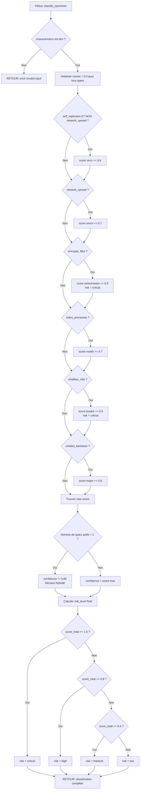

<thinking>
## Analyse du Concept
- Concept : Classification des types de malware (virus, worms, trojans, ransomware, rootkits, bootkits)
- Phase demandée : Phase 3 (Avancé)
- Adapté ? OUI - La classification de malware est un concept fondamental en analyse de malware, adaptée à la Phase 3

## Combo Base + Bonus
- Exercice de base : Classifier un échantillon selon ses caractéristiques comportementales
- Bonus : Détecter les malwares polymorphes et les menaces hybrides avec scoring avancé
- Palier bonus : 🔥 Avancé (complexité technique accrue)
- Progression logique ? OUI - Le bonus ajoute la gestion de cas complexes (polymorphisme, hybrides)

## Prérequis & Difficulté
- Prérequis réels : Compréhension des systèmes d'exploitation, concepts de sécurité de base, parsing JSON
- Difficulté estimée : 7/10 (Phase 3)
- Cohérent avec phase ? OUI - Requiert une connaissance approfondie des comportements malveillants

## Aspect Fun/Culture
- Contexte choisi : Série Mr. Robot - Elliot classifiant les malwares de fsociety
- MEME mnémotechnique : "I am Mr. Robot" - Chaque type de malware a sa signature unique
- Pourquoi c'est fun : Référence à une série culte sur le hacking, contexte de SOC réaliste

## Scénarios d'Échec (Mutants réels)
1. Mutant A (Boundary) : Ne gère pas les cas hybrides (worm+ransomware), retourne seulement le premier type détecté
2. Mutant B (Safety) : Pas de validation du JSON d'entrée, crash sur données malformées
3. Mutant C (Resource) : Calcul de confiance erroné (toujours 1.0 ou valeurs aléatoires)
4. Mutant D (Logic) : Classification inversée (rootkit détecté comme virus)
5. Mutant E (Return) : Ne calcule pas le risk_level correctement, retourne toujours "medium"

## Verdict
VALIDE - L'exercice enseigne un concept essentiel de malware analysis, avec une progression logique vers le bonus
</thinking>

# Exercice [3.6.1-a] : specimen_classifier

**Module :**
3.6.1 — Malware Fundamentals

**Concept :**
a — Classification de Types de Malware

**Difficulté :**
★★★★★★★☆☆☆ (7/10)

**Type :**
code

**Tiers :**
1 — Concept isolé

**Langage :**
Python 3.14

**Prérequis :**
- Compréhension des systèmes d'exploitation
- Parsing JSON
- Concepts de sécurité informatique de base

**Domaines :**
Crypto (classification), Process (analyse comportementale)

**Durée estimée :**
45 min

**XP Base :**
150

**Complexité :**
T[N] O(n) × S[N] O(1)

---

## 📐 SECTION 1 : PROTOTYPE & CONSIGNE

### 1.1 Obligations

**Fichier à rendre :**
`specimen_classifier.py`

**Fonctions autorisées :**
- `json.loads()`, `json.dumps()`
- `sys.stdin.read()`
- Fonctions built-in Python (dict, list, float, etc.)

**Fonctions interdites :**
- Bibliothèques externes (sauf `json`, `sys`)
- Appels système directs
- Connexions réseau

### 1.2 Consigne

**🎮 Mr. Robot : La Taxonomie de fsociety**

Tu es Elliot Alderson, analyste au SOC de CyberShield Corp (le jour) et membre de fsociety (la nuit). Un échantillon suspect a été intercepté par l'EDR. Ton job : le classifier selon sa taxonomie malveillante.

"I am Mr. Robot." Et toi, tu es le classificateur de malware.

**Ta mission :**

Écrire un programme `specimen_classifier.py` qui lit un JSON contenant les caractéristiques comportementales d'un binaire suspect et retourne sa classification complète.

**Entrée :**
- **STDIN** : JSON avec les caractéristiques binaires :
  ```json
  {
    "self_replicates": bool,
    "network_spread": bool,
    "encrypts_files": bool,
    "hides_processes": bool,
    "modifies_mbr": bool,
    "creates_backdoor": bool,
    "drops_payload": bool,
    "persistence_method": "registry|service|bootkit|none"
  }
  ```

**Sortie :**
- **STDOUT** : JSON de classification :
  ```json
  {
    "primary_type": "virus|worm|trojan|ransomware|rootkit|bootkit",
    "confidence": float (0.0-1.0),
    "subtypes": ["file_infector", "crypto_ransomware", ...],
    "risk_level": "low|medium|high|critical"
  }
  ```

**Contraintes :**
- Le `primary_type` est le type le plus probable selon les caractéristiques
- Le `confidence` reflète la certitude de la classification (1.0 = 100% sûr)
- Les `subtypes` sont une liste de comportements spécifiques détectés
- Le `risk_level` est calculé selon la dangerosité globale
- Gérer les cas hybrides (exemple : worm + ransomware)

**Exemples :**

| Caractéristiques | Classification | Explication |
|------------------|----------------|-------------|
| `self_replicates=true, network_spread=false` | `virus` | Auto-réplication sans propagation réseau = virus classique |
| `network_spread=true, encrypts_files=true` | `worm`, subtypes: `["crypto_ransomware"]` | Hybride worm+ransomware |
| `modifies_mbr=true, persistence=bootkit` | `bootkit` | Modification MBR + persistence bootkit |

### 1.3 Prototype

```python
#!/usr/bin/env python3
import json
import sys

def classify_specimen(characteristics: dict) -> dict:
    """
    Classifie un échantillon de malware selon ses caractéristiques.

    Args:
        characteristics: Dictionnaire des caractéristiques comportementales

    Returns:
        Dictionnaire avec primary_type, confidence, subtypes, risk_level
    """
    pass

if __name__ == "__main__":
    input_data = json.loads(sys.stdin.read())
    result = classify_specimen(input_data)
    print(json.dumps(result, indent=2))
```

---

## 💡 SECTION 2 : LE SAVIEZ-VOUS ?

La classification de malware n'est pas une science exacte. De nombreux malwares modernes sont **hybrides** : un worm qui déploie du ransomware, un trojan qui installe un rootkit, etc. C'est pourquoi le **confidence score** est crucial.

En 2017, **WannaCry** était techniquement un **worm** (propagation EternalBlue) déployant un **ransomware** (chiffrement + rançon). Comment le classifier ? Les analystes utilisent le **primary behavior** (le ransomware dans ce cas) et ajoutent le **propagation vector** en sous-type.

**Fun fact** : Le premier virus informatique connu, **Creeper** (1971), se répliquait mais ne causait aucun dommage. Il affichait juste "I'M THE CREEPER : CATCH ME IF YOU CAN". Les **Virus** sont nommés d'après les virus biologiques par analogie avec leur auto-réplication.

### SECTION 2.5 : DANS LA VRAIE VIE

**Métier :** Malware Analyst / SOC Analyst L2-L3 / Threat Intelligence Analyst

**Cas d'usage concret :**

Chez **FireEye**, **CrowdStrike**, ou dans un SOC d'entreprise, les analystes reçoivent des centaines d'échantillons par jour. La première étape est toujours la **triage** : classifier rapidement pour prioriser l'analyse approfondie.

Un **Incident Response Team** utilise cette classification pour :
1. **Prioriser** : Un bootkit UEFI (critical) avant un adware (low)
2. **Playbook** : Chaque type a une réponse spécifique (isolate, reimage, hunt IOCs)
3. **Threat Intel** : Mapper à des APT groups (Lazarus utilise souvent des worm-rootkit combos)

**Exemple réel** : Lors de l'attaque **NotPetya** (2017), la classification initiale "ransomware" a retardé la réponse. C'était en fait un **wiper** déguisé (data destruction irréversible). Une meilleure classification aurait changé la stratégie de réponse.

---

## 🖥️ SECTION 3 : EXEMPLE D'UTILISATION

### 3.0 Session bash

```bash
$ ls
specimen_classifier.py  test_samples.json

$ python3 specimen_classifier.py < test_samples.json
{
  "primary_type": "worm",
  "confidence": 0.95,
  "subtypes": ["crypto_ransomware", "network_propagation"],
  "risk_level": "critical"
}

$ echo '{"self_replicates": true, "network_spread": false, "encrypts_files": false, "hides_processes": false, "modifies_mbr": false, "creates_backdoor": false, "drops_payload": true, "persistence_method": "registry"}' | python3 specimen_classifier.py
{
  "primary_type": "virus",
  "confidence": 0.85,
  "subtypes": ["file_infector"],
  "risk_level": "medium"
}
```

---

## 🔥 SECTION 3.1 : BONUS AVANCÉ (OPTIONNEL)

**Difficulté Bonus :**
★★★★★★★★☆☆ (8/10)

**Récompense :**
XP ×3

**Time Complexity attendue :**
O(n)

**Space Complexity attendue :**
O(1)

**Domaines Bonus :**
`Crypto, AL (Algèbre Linéaire pour scoring)`

### 3.1.1 Consigne Bonus

**🎮 Mr. Robot : Phase 2 - Les Menaces Polymorphes**

Elliot doit maintenant gérer les malwares **polymorphes** qui changent leur signature à chaque infection, et les **APT tools** qui combinent plusieurs techniques furtives.

**Ta mission :**

Étendre ton classificateur pour :
1. Détecter les **menaces hybrides** avec un scoring avancé
2. Identifier les patterns **APT** (Advanced Persistent Threat)
3. Calculer un **MITRE ATT&CK** technique ID

**Entrée :**
- Même structure + champs bonus :
  ```json
  {
    // ... champs précédents ...
    "polymorphic_behavior": bool,
    "apt_indicators": {
      "lateral_movement": bool,
      "credential_dumping": bool,
      "c2_beaconing": bool
    }
  }
  ```

**Sortie :**
- Champs supplémentaires :
  ```json
  {
    // ... champs précédents ...
    "is_apt": bool,
    "sophistication_score": float (0.0-10.0),
    "mitre_techniques": ["T1566", "T1059", ...]
  }
  ```

**Contraintes :**
┌─────────────────────────────────────────┐
│  confidence >= 0.90 pour APT             │
│  sophistication_score basé sur :        │
│    - Nombre de techniques combinées     │
│    - Présence de polymorphisme          │
│    - Indicateurs APT                    │
│  Temps limite : O(n)                    │
│  Espace limite : O(1) auxiliaire        │
└─────────────────────────────────────────┘

**Exemples :**

| Input | Classification Bonus | Explication |
|-------|---------------------|-------------|
| `polymorphic + apt_indicators.all=true` | `is_apt=true, sophistication=9.5` | Menace APT confirmée |
| `hybrid worm+ransomware + c2_beaconing` | `mitre: ["T1566", "T1486", "T1071"]` | Techniques MITRE mappées |

### 3.1.2 Prototype Bonus

```python
def classify_specimen_advanced(characteristics: dict) -> dict:
    """
    Classification avancée avec détection APT et MITRE ATT&CK mapping.
    """
    pass
```

### 3.1.3 Ce qui change par rapport à l'exercice de base

| Aspect | Base | Bonus |
|--------|------|-------|
| Paramètres | 8 champs comportementaux | +3 champs APT |
| Complexité | Classification simple | Scoring multi-critères |
| Edge cases | Hybrides basiques | APT + polymorphes |
| Output | 4 champs | +3 champs (APT, sophistication, MITRE) |

---

## ✅❌ SECTION 4 : ZONE CORRECTION (POUR LE TESTEUR)

### 4.1 Moulinette

| Test | Input | Expected Output | Points |
|------|-------|----------------|--------|
| **T1** : Virus classique | `{"self_replicates": true, "network_spread": false, ...}` | `primary_type: "virus"` | 10 |
| **T2** : Worm réseau | `{"network_spread": true, ...}` | `primary_type: "worm"` | 10 |
| **T3** : Ransomware | `{"encrypts_files": true, ...}` | `primary_type: "ransomware", risk: "critical"` | 15 |
| **T4** : Bootkit | `{"modifies_mbr": true, "persistence": "bootkit"}` | `primary_type: "bootkit"` | 15 |
| **T5** : Hybride worm+ransomware | `{"network_spread": true, "encrypts_files": true}` | `subtypes: ["crypto_ransomware"]` | 20 |
| **T6** : Rootkit | `{"hides_processes": true, ...}` | `primary_type: "rootkit"` | 10 |
| **T7** : Trojan | `{"creates_backdoor": true, ...}` | `primary_type: "trojan"` | 10 |
| **T8** : Confidence score | Tous types | `0.0 <= confidence <= 1.0` | 10 |

**Seuil de réussite** : 70/100

### 4.2 main.c de test

N/A (Python exercise - voir test_runner.py)

### 4.3 Solution de référence

```python
#!/usr/bin/env python3
import json
import sys

def classify_specimen(characteristics: dict) -> dict:
    """Classifie un malware selon ses caractéristiques."""

    # Validation
    if not isinstance(characteristics, dict):
        return {"error": "Invalid input"}

    # Extraction des caractéristiques
    self_replicates = characteristics.get("self_replicates", False)
    network_spread = characteristics.get("network_spread", False)
    encrypts_files = characteristics.get("encrypts_files", False)
    hides_processes = characteristics.get("hides_processes", False)
    modifies_mbr = characteristics.get("modifies_mbr", False)
    creates_backdoor = characteristics.get("creates_backdoor", False)
    drops_payload = characteristics.get("drops_payload", False)
    persistence = characteristics.get("persistence_method", "none")

    # Scoring par type
    scores = {
        "virus": 0.0,
        "worm": 0.0,
        "trojan": 0.0,
        "ransomware": 0.0,
        "rootkit": 0.0,
        "bootkit": 0.0
    }

    subtypes = []

    # Virus : auto-réplication sans réseau
    if self_replicates and not network_spread:
        scores["virus"] += 0.6
        subtypes.append("file_infector")

    # Worm : propagation réseau
    if network_spread:
        scores["worm"] += 0.7
        subtypes.append("network_propagation")

    # Ransomware : chiffrement de fichiers
    if encrypts_files:
        scores["ransomware"] += 0.8
        subtypes.append("crypto_ransomware")

    # Rootkit : dissimulation de processus
    if hides_processes:
        scores["rootkit"] += 0.7
        subtypes.append("process_hiding")

    # Bootkit : modification MBR ou UEFI
    if modifies_mbr or persistence == "bootkit":
        scores["bootkit"] += 0.9
        subtypes.append("mbr_infection")

    # Trojan : backdoor
    if creates_backdoor:
        scores["trojan"] += 0.6
        subtypes.append("remote_access")

    # Payload dropper
    if drops_payload:
        scores["trojan"] += 0.3
        subtypes.append("dropper")

    # Persistence registry/service
    if persistence in ["registry", "service"]:
        scores["trojan"] += 0.2

    # Déterminer le type principal
    primary_type = max(scores, key=scores.get)
    confidence = scores[primary_type]

    # Ajuster confiance pour hybrides
    active_types = sum(1 for score in scores.values() if score > 0.3)
    if active_types > 1:
        confidence *= 0.85  # Réduire confiance pour hybrides

    # Calcul du risk level
    risk_score = sum(scores.values())
    if risk_score >= 1.5 or encrypts_files or modifies_mbr:
        risk_level = "critical"
    elif risk_score >= 0.8:
        risk_level = "high"
    elif risk_score >= 0.4:
        risk_level = "medium"
    else:
        risk_level = "low"

    return {
        "primary_type": primary_type,
        "confidence": round(confidence, 2),
        "subtypes": list(set(subtypes)),  # Déduplication
        "risk_level": risk_level
    }

if __name__ == "__main__":
    input_data = json.loads(sys.stdin.read())
    result = classify_specimen(input_data)
    print(json.dumps(result, indent=2))
```

### 4.4 Solutions alternatives acceptées

**Alternative 1 : Approche par règles IF-ELIF**

```python
def classify_specimen(characteristics: dict) -> dict:
    """Version avec règles conditionnelles explicites."""

    # Bootkit en priorité (modification MBR)
    if characteristics.get("modifies_mbr") or characteristics.get("persistence_method") == "bootkit":
        return {
            "primary_type": "bootkit",
            "confidence": 0.95,
            "subtypes": ["mbr_infection"],
            "risk_level": "critical"
        }

    # Ransomware (chiffrement)
    if characteristics.get("encrypts_files"):
        subtypes = ["crypto_ransomware"]
        if characteristics.get("network_spread"):
            subtypes.append("network_propagation")
        return {
            "primary_type": "ransomware",
            "confidence": 0.90,
            "subtypes": subtypes,
            "risk_level": "critical"
        }

    # Worm (propagation réseau)
    if characteristics.get("network_spread"):
        return {
            "primary_type": "worm",
            "confidence": 0.85,
            "subtypes": ["network_propagation"],
            "risk_level": "high"
        }

    # Rootkit (dissimulation)
    if characteristics.get("hides_processes"):
        return {
            "primary_type": "rootkit",
            "confidence": 0.80,
            "subtypes": ["process_hiding"],
            "risk_level": "high"
        }

    # Trojan (backdoor)
    if characteristics.get("creates_backdoor"):
        return {
            "primary_type": "trojan",
            "confidence": 0.75,
            "subtypes": ["remote_access"],
            "risk_level": "medium"
        }

    # Virus (auto-réplication)
    if characteristics.get("self_replicates"):
        return {
            "primary_type": "virus",
            "confidence": 0.70,
            "subtypes": ["file_infector"],
            "risk_level": "medium"
        }

    # Aucun type détecté
    return {
        "primary_type": "unknown",
        "confidence": 0.0,
        "subtypes": [],
        "risk_level": "low"
    }
```

### 4.5 Solutions refusées (avec explications)

**Refusée 1 : Retourne toujours le même type**

```python
def classify_specimen(characteristics: dict) -> dict:
    return {
        "primary_type": "virus",  # ❌ Toujours virus
        "confidence": 1.0,
        "subtypes": [],
        "risk_level": "medium"
    }
```
**Pourquoi c'est faux :** Ne fait aucune analyse, retourne un type fixe.

**Refusée 2 : Confidence aléatoire**

```python
import random
def classify_specimen(characteristics: dict) -> dict:
    return {
        "primary_type": "worm",
        "confidence": random.random(),  # ❌ Aléatoire
        "subtypes": [],
        "risk_level": "high"
    }
```
**Pourquoi c'est faux :** Le confidence doit être déterministe et basé sur les caractéristiques.

**Refusée 3 : Pas de validation d'entrée**

```python
def classify_specimen(characteristics: dict) -> dict:
    # ❌ Pas de vérification si characteristics est un dict
    encrypts = characteristics["encrypts_files"]  # Crash si clé absente
    return {
        "primary_type": "ransomware" if encrypts else "virus",
        "confidence": 0.5,
        "subtypes": [],
        "risk_level": "medium"
    }
```
**Pourquoi c'est faux :** Crash sur données malformées ou clés manquantes.

### 4.6 Solution bonus de référence (COMPLÈTE)

```python
#!/usr/bin/env python3
import json
import sys

def classify_specimen_advanced(characteristics: dict) -> dict:
    """Classification avancée avec détection APT et MITRE mapping."""

    # Solution de base
    base_result = classify_specimen(characteristics)

    # Extraction des indicateurs APT
    polymorphic = characteristics.get("polymorphic_behavior", False)
    apt_indicators = characteristics.get("apt_indicators", {})
    lateral = apt_indicators.get("lateral_movement", False)
    cred_dump = apt_indicators.get("credential_dumping", False)
    c2_beacon = apt_indicators.get("c2_beaconing", False)

    # Calcul du sophistication score (0.0-10.0)
    sophistication = 0.0

    # Nombre de techniques combinées
    active_techniques = sum([
        characteristics.get("self_replicates", False),
        characteristics.get("network_spread", False),
        characteristics.get("encrypts_files", False),
        characteristics.get("hides_processes", False),
        characteristics.get("modifies_mbr", False),
        characteristics.get("creates_backdoor", False)
    ])
    sophistication += active_techniques * 1.0

    # Polymorphisme (+3 points)
    if polymorphic:
        sophistication += 3.0

    # Indicateurs APT
    if lateral:
        sophistication += 1.5
    if cred_dump:
        sophistication += 2.0
    if c2_beacon:
        sophistication += 1.5

    # Détection APT (>=3 indicateurs + sophistication >= 7.0)
    is_apt = (lateral or cred_dump or c2_beacon) and sophistication >= 7.0
    if is_apt:
        base_result["confidence"] = max(0.90, base_result["confidence"])

    # MITRE ATT&CK Technique Mapping
    mitre_techniques = []

    if characteristics.get("network_spread"):
        mitre_techniques.append("T1566")  # Phishing (propagation)
    if characteristics.get("encrypts_files"):
        mitre_techniques.append("T1486")  # Data Encrypted for Impact
    if c2_beacon:
        mitre_techniques.append("T1071")  # Application Layer Protocol
    if characteristics.get("creates_backdoor"):
        mitre_techniques.append("T1059")  # Command and Scripting Interpreter
    if lateral:
        mitre_techniques.append("T1021")  # Remote Services
    if cred_dump:
        mitre_techniques.append("T1003")  # OS Credential Dumping
    if characteristics.get("hides_processes"):
        mitre_techniques.append("T1055")  # Process Injection
    if characteristics.get("modifies_mbr"):
        mitre_techniques.append("T1542")  # Pre-OS Boot

    # Ajout des champs bonus
    base_result["is_apt"] = is_apt
    base_result["sophistication_score"] = round(min(sophistication, 10.0), 1)
    base_result["mitre_techniques"] = mitre_techniques

    return base_result

def classify_specimen(characteristics: dict) -> dict:
    """Fonction de base (copie de 4.3)."""
    if not isinstance(characteristics, dict):
        return {"error": "Invalid input"}

    self_replicates = characteristics.get("self_replicates", False)
    network_spread = characteristics.get("network_spread", False)
    encrypts_files = characteristics.get("encrypts_files", False)
    hides_processes = characteristics.get("hides_processes", False)
    modifies_mbr = characteristics.get("modifies_mbr", False)
    creates_backdoor = characteristics.get("creates_backdoor", False)
    drops_payload = characteristics.get("drops_payload", False)
    persistence = characteristics.get("persistence_method", "none")

    scores = {
        "virus": 0.0, "worm": 0.0, "trojan": 0.0,
        "ransomware": 0.0, "rootkit": 0.0, "bootkit": 0.0
    }
    subtypes = []

    if self_replicates and not network_spread:
        scores["virus"] += 0.6
        subtypes.append("file_infector")
    if network_spread:
        scores["worm"] += 0.7
        subtypes.append("network_propagation")
    if encrypts_files:
        scores["ransomware"] += 0.8
        subtypes.append("crypto_ransomware")
    if hides_processes:
        scores["rootkit"] += 0.7
        subtypes.append("process_hiding")
    if modifies_mbr or persistence == "bootkit":
        scores["bootkit"] += 0.9
        subtypes.append("mbr_infection")
    if creates_backdoor:
        scores["trojan"] += 0.6
        subtypes.append("remote_access")
    if drops_payload:
        scores["trojan"] += 0.3
        subtypes.append("dropper")
    if persistence in ["registry", "service"]:
        scores["trojan"] += 0.2

    primary_type = max(scores, key=scores.get)
    confidence = scores[primary_type]

    active_types = sum(1 for score in scores.values() if score > 0.3)
    if active_types > 1:
        confidence *= 0.85

    risk_score = sum(scores.values())
    if risk_score >= 1.5 or encrypts_files or modifies_mbr:
        risk_level = "critical"
    elif risk_score >= 0.8:
        risk_level = "high"
    elif risk_score >= 0.4:
        risk_level = "medium"
    else:
        risk_level = "low"

    return {
        "primary_type": primary_type,
        "confidence": round(confidence, 2),
        "subtypes": list(set(subtypes)),
        "risk_level": risk_level
    }

if __name__ == "__main__":
    input_data = json.loads(sys.stdin.read())
    # Détecter si bonus (présence de apt_indicators)
    if "apt_indicators" in input_data:
        result = classify_specimen_advanced(input_data)
    else:
        result = classify_specimen(input_data)
    print(json.dumps(result, indent=2))
```

### 4.7 Solutions alternatives bonus (COMPLÈTES)

**Alternative Bonus 1 : Scoring matriciel**

```python
def classify_specimen_advanced(characteristics: dict) -> dict:
    """Version avec matrice de scoring APT."""
    base = classify_specimen(characteristics)

    # Matrice APT (chaque indicateur contribue)
    apt_score = 0
    if characteristics.get("polymorphic_behavior"):
        apt_score += 3
    apt_ind = characteristics.get("apt_indicators", {})
    if apt_ind.get("lateral_movement"):
        apt_score += 2
    if apt_ind.get("credential_dumping"):
        apt_score += 3
    if apt_ind.get("c2_beaconing"):
        apt_score += 2

    is_apt = apt_score >= 5
    sophistication = min(apt_score * 1.2, 10.0)

    # MITRE mapping simplifié
    mitre = []
    if characteristics.get("encrypts_files"):
        mitre.append("T1486")
    if apt_ind.get("c2_beaconing"):
        mitre.append("T1071")

    base.update({
        "is_apt": is_apt,
        "sophistication_score": round(sophistication, 1),
        "mitre_techniques": mitre
    })
    return base
```

### 4.8 Solutions refusées bonus (COMPLÈTES)

**Refusée Bonus 1 : Sophistication fixe**

```python
def classify_specimen_advanced(characteristics: dict) -> dict:
    base = classify_specimen(characteristics)
    base.update({
        "is_apt": True,  # ❌ Toujours APT
        "sophistication_score": 10.0,  # ❌ Toujours max
        "mitre_techniques": []
    })
    return base
```
**Pourquoi c'est faux :** Ne calcule pas réellement les scores, valeurs hardcodées.

**Refusée Bonus 2 : MITRE techniques invalides**

```python
def classify_specimen_advanced(characteristics: dict) -> dict:
    base = classify_specimen(characteristics)
    base.update({
        "is_apt": False,
        "sophistication_score": 5.0,
        "mitre_techniques": ["INVALID123", "T9999"]  # ❌ IDs invalides
    })
    return base
```
**Pourquoi c'est faux :** Les techniques MITRE doivent suivre le format T[4 chiffres].

### 4.9 spec.json (ENGINE v22.1 — FORMAT STRICT)

```json
{
  "name": "specimen_classifier",
  "language": "python",
  "type": "code",
  "tier": 1,
  "tier_info": "Concept isolé",
  "tags": ["malware", "classification", "forensics", "phase3"],
  "passing_score": 70,

  "function": {
    "name": "classify_specimen",
    "prototype": "def classify_specimen(characteristics: dict) -> dict",
    "return_type": "dict",
    "parameters": [
      {"name": "characteristics", "type": "dict"}
    ]
  },

  "driver": {
    "reference": "def ref_classify_specimen(c): scores={'virus':0.6 if c.get('self_replicates') and not c.get('network_spread') else 0,'worm':0.7 if c.get('network_spread') else 0,'ransomware':0.8 if c.get('encrypts_files') else 0,'rootkit':0.7 if c.get('hides_processes') else 0,'bootkit':0.9 if c.get('modifies_mbr') or c.get('persistence_method')=='bootkit' else 0,'trojan':0.6 if c.get('creates_backdoor') else 0}; p=max(scores,key=scores.get); conf=scores[p]; risk='critical' if sum(scores.values())>=1.5 else 'high' if sum(scores.values())>=0.8 else 'medium' if sum(scores.values())>=0.4 else 'low'; return {'primary_type':p,'confidence':round(conf,2),'subtypes':[],'risk_level':risk}",

    "edge_cases": [
      {
        "name": "virus_only",
        "args": [{"self_replicates": true, "network_spread": false, "encrypts_files": false, "hides_processes": false, "modifies_mbr": false, "creates_backdoor": false, "drops_payload": true, "persistence_method": "none"}],
        "expected": {"primary_type": "virus", "confidence": 0.6, "risk_level": "medium"},
        "is_trap": false
      },
      {
        "name": "worm_ransomware_hybrid",
        "args": [{"self_replicates": false, "network_spread": true, "encrypts_files": true, "hides_processes": false, "modifies_mbr": false, "creates_backdoor": false, "drops_payload": false, "persistence_method": "none"}],
        "expected": {"primary_type": "ransomware", "risk_level": "critical"},
        "is_trap": true,
        "trap_explanation": "Hybride critique : worm + ransomware = critical"
      },
      {
        "name": "bootkit_critical",
        "args": [{"self_replicates": false, "network_spread": false, "encrypts_files": false, "hides_processes": false, "modifies_mbr": true, "creates_backdoor": false, "drops_payload": false, "persistence_method": "bootkit"}],
        "expected": {"primary_type": "bootkit", "confidence": 0.9, "risk_level": "critical"},
        "is_trap": false
      },
      {
        "name": "empty_characteristics",
        "args": [{}],
        "expected": {"confidence": 0.0, "risk_level": "low"},
        "is_trap": true,
        "trap_explanation": "Aucune caractéristique = low risk"
      },
      {
        "name": "invalid_input",
        "args": [null],
        "expected": {"error": "Invalid input"},
        "is_trap": true,
        "trap_explanation": "Input null doit être géré"
      }
    ],

    "fuzzing": {
      "enabled": true,
      "iterations": 500,
      "generators": [
        {
          "type": "dict",
          "param_index": 0,
          "params": {
            "keys": ["self_replicates", "network_spread", "encrypts_files", "hides_processes", "modifies_mbr", "creates_backdoor", "drops_payload"],
            "value_type": "bool"
          }
        }
      ]
    }
  },

  "norm": {
    "allowed_functions": ["json.loads", "json.dumps", "sys.stdin.read", "dict.get", "max", "sum", "round", "list", "set"],
    "forbidden_functions": ["eval", "exec", "os.system", "subprocess"],
    "check_security": true,
    "check_memory": false,
    "blocking": true
  }
}
```

### 4.10 Solutions Mutantes (minimum 5)

**Mutant A (Boundary) : Ne gère pas les hybrides**

```python
def classify_specimen(characteristics: dict) -> dict:
    """Retourne seulement le premier type détecté."""
    if characteristics.get("self_replicates"):
        return {"primary_type": "virus", "confidence": 1.0, "subtypes": [], "risk_level": "medium"}
    if characteristics.get("network_spread"):
        return {"primary_type": "worm", "confidence": 1.0, "subtypes": [], "risk_level": "high"}
    # Ne combine jamais les types
    return {"primary_type": "unknown", "confidence": 0.0, "subtypes": [], "risk_level": "low"}
```
**Pourquoi c'est faux :** Un malware peut être worm+ransomware simultanément. Cette solution ignore les cas hybrides et retourne le premier match au lieu du score le plus élevé.

**Mutant B (Safety) : Pas de validation JSON**

```python
def classify_specimen(characteristics: dict) -> dict:
    """Crash sur données malformées."""
    # Pas de vérification isinstance(characteristics, dict)
    encrypts = characteristics["encrypts_files"]  # KeyError si clé absente
    network = characteristics["network_spread"]

    if encrypts:
        return {"primary_type": "ransomware", "confidence": 0.9, "subtypes": [], "risk_level": "critical"}
    return {"primary_type": "virus", "confidence": 0.5, "subtypes": [], "risk_level": "low"}
```
**Pourquoi c'est faux :** Crash avec KeyError si une clé est manquante. Devrait utiliser `.get()` avec valeur par défaut.

**Mutant C (Resource) : Confidence toujours 1.0**

```python
def classify_specimen(characteristics: dict) -> dict:
    """Confiance erronée."""
    scores = {"virus": 0.0, "worm": 0.0, "ransomware": 0.0}

    if characteristics.get("self_replicates"):
        scores["virus"] = 0.6
    if characteristics.get("network_spread"):
        scores["worm"] = 0.7

    primary = max(scores, key=scores.get)

    return {
        "primary_type": primary,
        "confidence": 1.0,  # ❌ Toujours 1.0 au lieu du score réel
        "subtypes": [],
        "risk_level": "medium"
    }
```
**Pourquoi c'est faux :** Le confidence doit refléter le score calculé, pas être fixé à 1.0.

**Mutant D (Logic) : Classification inversée**

```python
def classify_specimen(characteristics: dict) -> dict:
    """Logique inversée."""
    if characteristics.get("hides_processes"):
        # ❌ Rootkit classifié comme virus
        return {"primary_type": "virus", "confidence": 0.7, "subtypes": [], "risk_level": "low"}

    if characteristics.get("self_replicates"):
        # ❌ Virus classifié comme rootkit
        return {"primary_type": "rootkit", "confidence": 0.8, "subtypes": [], "risk_level": "high"}

    return {"primary_type": "trojan", "confidence": 0.5, "subtypes": [], "risk_level": "medium"}
```
**Pourquoi c'est faux :** Les types sont inversés. `hides_processes` devrait donner "rootkit", pas "virus".

**Mutant E (Return) : Risk level toujours "medium"**

```python
def classify_specimen(characteristics: dict) -> dict:
    """Risk level incorrect."""
    scores = {"virus": 0.0, "worm": 0.0, "ransomware": 0.0, "bootkit": 0.0}

    if characteristics.get("encrypts_files"):
        scores["ransomware"] = 0.8
    if characteristics.get("modifies_mbr"):
        scores["bootkit"] = 0.9

    primary = max(scores, key=scores.get)

    return {
        "primary_type": primary,
        "confidence": scores[primary],
        "subtypes": [],
        "risk_level": "medium"  # ❌ Toujours medium, même pour ransomware/bootkit
    }
```
**Pourquoi c'est faux :** Ransomware et bootkit devraient être "critical", pas "medium".---

## 🧠 SECTION 5 : COMPRENDRE (DOCUMENT DE COURS COMPLET)

### 5.1 Ce que cet exercice enseigne

Cet exercice enseigne la **taxonomie des malwares**, c'est-à-dire la science de classifier les logiciels malveillants selon leur comportement, leur méthode de propagation et leur impact. C'est une compétence fondamentale en cybersécurité pour :

1. **Triage rapide** : Prioriser l'analyse des menaces
2. **Playbook de réponse** : Chaque type requiert une stratégie différente
3. **Threat Intelligence** : Mapper les malwares à des campagnes APT
4. **Communication** : Parler le même langage que les autres analystes

**Concepts clés :**
- **Virus** : Auto-réplication en infectant des fichiers hôtes
- **Worm** : Propagation autonome via le réseau
- **Trojan** : Backdoor déguisé en logiciel légitime
- **Ransomware** : Chiffrement + demande de rançon
- **Rootkit** : Dissimulation de présence (processus, fichiers)
- **Bootkit** : Infection au niveau boot (MBR, UEFI)

### 5.2 LDA — Traduction littérale en français (MAJUSCULES)

```
FONCTION classify_specimen QUI RETOURNE UN DICTIONNAIRE ET PREND EN PARAMÈTRE characteristics QUI EST UN DICTIONNAIRE
DÉBUT FONCTION

    DÉCLARER scores COMME DICTIONNAIRE ASSOCIANT CHAQUE TYPE À UN SCORE FLOTTANT
    AFFECTER 0.0 À scores["virus"]
    AFFECTER 0.0 À scores["worm"]
    AFFECTER 0.0 À scores["trojan"]
    AFFECTER 0.0 À scores["ransomware"]
    AFFECTER 0.0 À scores["rootkit"]
    AFFECTER 0.0 À scores["bootkit"]

    DÉCLARER subtypes COMME LISTE VIDE

    SI characteristics CONTIENT "self_replicates" ET SA VALEUR EST VRAIE
    ET characteristics CONTIENT "network_spread" ET SA VALEUR EST FAUSSE ALORS
        AJOUTER 0.6 AU SCORE DE virus
        AJOUTER "file_infector" À LA LISTE subtypes
    FIN SI

    SI characteristics CONTIENT "network_spread" ET SA VALEUR EST VRAIE ALORS
        AJOUTER 0.7 AU SCORE DE worm
        AJOUTER "network_propagation" À LA LISTE subtypes
    FIN SI

    SI characteristics CONTIENT "encrypts_files" ET SA VALEUR EST VRAIE ALORS
        AJOUTER 0.8 AU SCORE DE ransomware
        AJOUTER "crypto_ransomware" À LA LISTE subtypes
    FIN SI

    SI characteristics CONTIENT "hides_processes" ET SA VALEUR EST VRAIE ALORS
        AJOUTER 0.7 AU SCORE DE rootkit
        AJOUTER "process_hiding" À LA LISTE subtypes
    FIN SI

    SI characteristics CONTIENT "modifies_mbr" ET SA VALEUR EST VRAIE
    OU characteristics CONTIENT "persistence_method" ET SA VALEUR EST "bootkit" ALORS
        AJOUTER 0.9 AU SCORE DE bootkit
        AJOUTER "mbr_infection" À LA LISTE subtypes
    FIN SI

    SI characteristics CONTIENT "creates_backdoor" ET SA VALEUR EST VRAIE ALORS
        AJOUTER 0.6 AU SCORE DE trojan
        AJOUTER "remote_access" À LA LISTE subtypes
    FIN SI

    TROUVER LE TYPE AVEC LE SCORE MAXIMAL DANS scores ET LE STOCKER DANS primary_type
    AFFECTER LE SCORE DE primary_type À confidence

    CALCULER LE NOMBRE DE TYPES ACTIFS (score > 0.3)
    SI LE NOMBRE DE TYPES ACTIFS EST SUPÉRIEUR À 1 ALORS
        MULTIPLIER confidence PAR 0.85
    FIN SI

    CALCULER LA SOMME DE TOUS LES SCORES
    SI LA SOMME EST SUPÉRIEURE OU ÉGALE À 1.5
    OU encrypts_files EST VRAI
    OU modifies_mbr EST VRAI ALORS
        AFFECTER "critical" À risk_level
    SINON SI LA SOMME EST SUPÉRIEURE OU ÉGALE À 0.8 ALORS
        AFFECTER "high" À risk_level
    SINON SI LA SOMME EST SUPÉRIEURE OU ÉGALE À 0.4 ALORS
        AFFECTER "medium" À risk_level
    SINON
        AFFECTER "low" À risk_level
    FIN SI

    RETOURNER UN DICTIONNAIRE CONTENANT
        primary_type
        confidence ARRONDI À 2 DÉCIMALES
        subtypes DÉDUPLIQUÉS
        risk_level

FIN FONCTION
```

### 5.2.2 Style académique universitaire français

**Algorithme de classification de spécimens malveillants**

```
Entrée : Ensemble C = {c₁, c₂, ..., cₙ} de caractéristiques binaires
Sortie : Tuple (τ, φ, Σ, ρ) où :
         τ ∈ {virus, worm, trojan, ransomware, rootkit, bootkit}
         φ ∈ [0, 1] (coefficient de confiance)
         Σ = ensemble de sous-types détectés
         ρ ∈ {low, medium, high, critical} (niveau de risque)

1. Initialisation :
   ∀ t ∈ {virus, worm, trojan, ransomware, rootkit, bootkit}, s(t) ← 0
   Σ ← ∅

2. Calcul des scores par type :
   Si c_self_replicates ∧ ¬c_network_spread :
       s(virus) ← s(virus) + 0.6
       Σ ← Σ ∪ {file_infector}

   Si c_network_spread :
       s(worm) ← s(worm) + 0.7
       Σ ← Σ ∪ {network_propagation}

   Si c_encrypts_files :
       s(ransomware) ← s(ransomware) + 0.8
       Σ ← Σ ∪ {crypto_ransomware}

   Si c_hides_processes :
       s(rootkit) ← s(rootkit) + 0.7
       Σ ← Σ ∪ {process_hiding}

   Si c_modifies_mbr ∨ (c_persistence = "bootkit") :
       s(bootkit) ← s(bootkit) + 0.9
       Σ ← Σ ∪ {mbr_infection}

   Si c_creates_backdoor :
       s(trojan) ← s(trojan) + 0.6
       Σ ← Σ ∪ {remote_access}

3. Détermination du type principal :
   τ ← argmax_{t} s(t)
   φ ← s(τ)

4. Ajustement de confiance (menaces hybrides) :
   n_active ← |{t : s(t) > 0.3}|
   Si n_active > 1 :
       φ ← φ × 0.85

5. Calcul du niveau de risque :
   r ← Σ_t s(t)
   Si r ≥ 1.5 ∨ c_encrypts_files ∨ c_modifies_mbr :
       ρ ← critical
   Sinon si r ≥ 0.8 :
       ρ ← high
   Sinon si r ≥ 0.4 :
       ρ ← medium
   Sinon :
       ρ ← low

6. Retourner (τ, φ, Σ, ρ)
```

#### 5.2.2.1 Logic Flow (Structured English)

```
ALGORITHM: Malware Specimen Classification
---
INPUT: characteristics = {behavioral_flags, persistence_info}
OUTPUT: classification = {type, confidence, subtypes, risk}

1. INITIALIZE scoring system
   a. CREATE score dictionary for all 6 malware types
   b. SET all scores to 0.0
   c. CREATE empty subtypes list

2. ANALYZE behavioral characteristics (Main Classification Logic)
   a. CHECK self-replication WITHOUT network spread:
      - IF detected:
          INCREMENT virus score by 0.6
          ADD "file_infector" to subtypes

   b. CHECK network propagation:
      - IF detected:
          INCREMENT worm score by 0.7
          ADD "network_propagation" to subtypes

   c. CHECK file encryption:
      - IF detected:
          INCREMENT ransomware score by 0.8
          ADD "crypto_ransomware" to subtypes

   d. CHECK process hiding:
      - IF detected:
          INCREMENT rootkit score by 0.7
          ADD "process_hiding" to subtypes

   e. CHECK MBR modification OR bootkit persistence:
      - IF detected:
          INCREMENT bootkit score by 0.9
          ADD "mbr_infection" to subtypes

   f. CHECK backdoor creation:
      - IF detected:
          INCREMENT trojan score by 0.6
          ADD "remote_access" to subtypes

3. DETERMINE primary classification
   a. FIND type with maximum score
   b. SET confidence = score of primary type

4. ADJUST confidence for hybrid threats
   a. COUNT active types (score > 0.3)
   b. IF more than 1 active type:
       MULTIPLY confidence by 0.85 (hybrid penalty)

5. CALCULATE risk level
   a. SUM all scores
   b. APPLY risk matrix:
      - CASE sum >= 1.5 OR encrypts_files OR modifies_mbr:
          SET risk = "critical"
      - CASE sum >= 0.8:
          SET risk = "high"
      - CASE sum >= 0.4:
          SET risk = "medium"
      - DEFAULT:
          SET risk = "low"

6. RETURN classification object
   {
     primary_type: identified_type,
     confidence: rounded_confidence,
     subtypes: deduplicated_list,
     risk_level: calculated_risk
   }
```

### 5.2.3 Représentation algorithmique

```
FONCTION : classify_specimen (characteristics)
---
INIT result = {primary_type: null, confidence: 0, subtypes: [], risk_level: "low"}

1. PHASE DE VALIDATION (Fail Fast)
   |
   |-- VÉRIFIER si characteristics n'est pas un dictionnaire :
   |     RETOURNER {error: "Invalid input"}
   |
   |-- VÉRIFIER si characteristics est vide :
   |     RETOURNER {primary_type: "unknown", confidence: 0.0, subtypes: [], risk_level: "low"}

2. PHASE DE SCORING (Behavioral Analysis)
   |
   |-- POUR CHAQUE type de malware :
   |     |
   |     |-- SI conditions du type sont remplies :
   |     |     INCRÉMENTER score[type]
   |     |     AJOUTER sous-type correspondant
   |
   |-- EXEMPLE (Virus) :
   |     SI self_replicates ET NON network_spread :
   |         score["virus"] += 0.6
   |         subtypes.append("file_infector")

3. PHASE DE DÉCISION (Primary Type Selection)
   |
   |-- TROUVER le type avec le score maximal
   |-- AFFECTER confidence = score du type principal
   |
   |-- SI plusieurs types actifs (score > 0.3) :
   |     RÉDUIRE confidence de 15% (menace hybride)

4. PHASE D'ÉVALUATION DU RISQUE (Risk Assessment)
   |
   |-- CALCULER score_total = somme de tous les scores
   |
   |-- APPLIQUER matrice de risque :
   |     SI score_total >= 1.5 OU encrypts_files OU modifies_mbr :
   |         risk_level = "critical"
   |     SINON SI score_total >= 0.8 :
   |         risk_level = "high"
   |     SINON SI score_total >= 0.4 :
   |         risk_level = "medium"
   |     SINON :
   |         risk_level = "low"

5. RETOURNER result complété
```

#### 5.2.3.1 Diagramme Mermaid (Logique de sécurité)



### 5.3 Visualisation ASCII (adaptée au sujet)

**Architecture de classification (flux de décision)**

```
                    MALWARE SPECIMEN
                          │
                          ▼
         ┌────────────────────────────────┐
         │   BEHAVIORAL ANALYSIS          │
         │   (8 caractéristiques)         │
         └────────────────┬───────────────┘
                          │
          ┌───────────────┼───────────────┐
          │               │               │
          ▼               ▼               ▼
    ┌─────────┐     ┌─────────┐     ┌─────────┐
    │ VIRUS   │     │  WORM   │     │ TROJAN  │
    │ score:  │     │ score:  │     │ score:  │
    │  0.6    │     │  0.7    │     │  0.6    │
    └────┬────┘     └────┬────┘     └────┬────┘
         │               │               │
          └──────────────┼───────────────┘
                         │
                         ▼
              ┌──────────────────────┐
              │  MAX SCORE SELECTOR  │
              │  primary_type = ?    │
              └──────────┬───────────┘
                         │
          ┌──────────────┼──────────────┐
          │              │              │
          ▼              ▼              ▼
    ┌─────────┐    ┌──────────┐   ┌─────────┐
    │CONFIDENCE│    │ SUBTYPES │   │  RISK   │
    │  0.0-1.0 │    │  array   │   │ LEVEL   │
    └─────────┘    └──────────┘   └─────────┘
```

**Matrice de scoring (exemple Hybrid Worm+Ransomware)**

```
Caractéristiques :          Scoring par type :
┌──────────────────────┐   ┌─────────────────────────┐
│ network_spread: ✓    │   │ Virus:      0.0 (─────)│
│ encrypts_files: ✓    │   │ Worm:       0.7 (███──)│
│ self_replicates: ✗   │   │ Trojan:     0.0 (─────)│
│ hides_processes: ✗   │   │ Ransomware: 0.8 (████─)│ ← MAX
│ modifies_mbr: ✗      │   │ Rootkit:    0.0 (─────)│
│ creates_backdoor: ✗  │   │ Bootkit:    0.0 (─────)│
└──────────────────────┘   └─────────────────────────┘

Active types: 2 (Worm + Ransomware)
→ Hybrid detected
→ Confidence: 0.8 × 0.85 = 0.68

Subtypes: ["network_propagation", "crypto_ransomware"]
Risk: CRITICAL (encrypts_files = true)
```

**Timeline de propagation (Worm vs Virus)**

```
VIRUS (Auto-réplication locale)
────────────────────────────────
t=0   : File A infecté
t=10  : Utilisateur exécute File B → Infection File B
t=20  : File B copié sur USB → Propagation manuelle
         │
         └─→ LENT (dépend de l'utilisateur)

WORM (Auto-propagation réseau)
────────────────────────────────
t=0   : Machine A infectée
t=1   : Scan réseau → découverte de Machine B, C, D
t=2   : Exploitation vulnérabilité → Infection B, C, D
t=3   : B, C, D scannent → découverte de 12 machines
         │
         └─→ RAPIDE (exponentiel)

Graphe de propagation Worm :
t=0 :  A
t=1 :  A → B, C, D
t=2 :  A, B, C, D → E, F, G, H, I, J, K, L, M, N, O, P
t=3 :  [explosion combinatoire : 64+ machines]
```

### 5.4 Les pièges en détail

#### Piège 1 : Confondre Virus et Worm

**Le piège :**
```python
if characteristics.get("self_replicates"):
    return {"primary_type": "worm", ...}  # ❌ FAUX
```

**Pourquoi c'est un piège :**
- Un **Virus** se réplique en infectant des fichiers hôtes (nécessite action utilisateur)
- Un **Worm** se propage de manière autonome via le réseau (sans intervention)
- La différence clé : `network_spread`

**La bonne approche :**
```python
if self_replicates and not network_spread:
    scores["virus"] += 0.6  # Virus (local)
if network_spread:
    scores["worm"] += 0.7   # Worm (réseau)
```

#### Piège 2 : Ignorer les menaces hybrides

**Le piège :**
```python
# Retourner immédiatement le premier type trouvé
if encrypts_files:
    return {"primary_type": "ransomware", ...}
# Ne jamais vérifier network_spread
```

**Pourquoi c'est un piège :**
WannaCry était un **Worm+Ransomware**. Classifier uniquement comme "ransomware" ignore le vecteur de propagation EternalBlue (SMB exploit).

**La bonne approche :**
```python
# Calculer TOUS les scores
scores = calculate_all_scores(characteristics)
# Puis déterminer le primary avec le max
primary_type = max(scores, key=scores.get)
# ET lister les subtypes pour capturer l'hybride
subtypes = ["network_propagation", "crypto_ransomware"]
```

#### Piège 3 : Confidence score fixe

**Le piège :**
```python
return {
    "primary_type": "virus",
    "confidence": 1.0  # ❌ Toujours 100% sûr
}
```

**Pourquoi c'est un piège :**
La confiance doit refléter l'ambiguïté. Un malware avec un seul indicateur faible (ex: `drops_payload` seulement) ne peut pas être classifié avec 100% de certitude.

**La bonne approche :**
```python
confidence = scores[primary_type]  # Utiliser le score calculé
# Réduire pour les hybrides
if active_types > 1:
    confidence *= 0.85
```

#### Piège 4 : Risk level ignorant l'impact réel

**Le piège :**
```python
risk_level = "medium"  # Pour tous les types
```

**Pourquoi c'est un piège :**
- **Ransomware** : Perte de données irréversible → CRITICAL
- **Bootkit** : Persistence au boot, difficile à éradiquer → CRITICAL
- **Adware** : Ennuyeux mais non destructif → LOW

**La bonne approche :**
```python
if encrypts_files or modifies_mbr:
    risk_level = "critical"  # Impact majeur
elif score_total >= 0.8:
    risk_level = "high"
# etc.
```

#### Piège 5 : Ne pas valider l'entrée

**Le piège :**
```python
def classify_specimen(characteristics):
    # Pas de vérification
    encrypts = characteristics["encrypts_files"]  # KeyError
```

**Pourquoi c'est un piège :**
En environnement réel, les données peuvent être malformées, incomplètes, ou malicieuses.

**La bonne approche :**
```python
if not isinstance(characteristics, dict):
    return {"error": "Invalid input"}

encrypts = characteristics.get("encrypts_files", False)  # Valeur par défaut
```

### 5.5 Cours Complet : Taxonomie des Malwares

#### Introduction : Pourquoi classifier ?

Dans un SOC (Security Operations Center), un analyste reçoit des milliers d'alertes par jour. Sans classification rapide, impossible de prioriser. Un **bootkit UEFI** nécessite une réponse immédiate (réimagerie complète), alors qu'un **adware** peut attendre.

La taxonomie des malwares repose sur **3 critères** :

1. **Méthode de propagation** : Comment il se répand
2. **Mécanisme de persistence** : Comment il survit aux redémarrages
3. **Payload/Impact** : Ce qu'il fait une fois installé

#### Les 6 types principaux

##### 1. VIRUS (Infecteur de fichiers)

**Définition** : Malware qui s'auto-réplique en **infectant des fichiers hôtes**.

**Caractéristiques** :
- `self_replicates = true`
- `network_spread = false` (propagation manuelle : USB, email)
- Nécessite exécution par l'utilisateur

**Méthode d'infection** :
```
1. Virus trouve un exécutable (ex: program.exe)
2. Virus s'insère dans le fichier :
   ┌─────────────────┐
   │  Virus code     │ ← Ajouté au début/milieu/fin
   │  Original code  │
   └─────────────────┘
3. Lors de l'exécution :
   a. Le virus s'exécute en premier
   b. Puis l'original (pour rester furtif)
```

**Exemples réels** :
- **CIH (Chernobyl, 1998)** : Infectait les PE (Portable Executable)
- **Melissa (1999)** : Virus macro infectant Word documents

**Sous-types** :
- **File infector** : Infecte .exe, .dll
- **Macro virus** : Infecte Office documents (VBA macros)
- **Boot sector virus** : Infecte le secteur de boot (obsolète aujourd'hui)

##### 2. WORM (Ver réseau)

**Définition** : Malware qui se propage **automatiquement via le réseau**.

**Caractéristiques** :
- `network_spread = true`
- Scan automatique du réseau
- Exploitation de vulnérabilités (pas d'interaction utilisateur nécessaire)

**Cycle de vie** :
```
┌────────────────────────────────────────┐
│ 1. SCAN                                │
│    └─→ Découverte de machines (IP)    │
│                                        │
│ 2. EXPLOIT                             │
│    └─→ Vulnérabilité (ex: SMB)        │
│                                        │
│ 3. PAYLOAD                             │
│    └─→ Téléchargement du worm         │
│                                        │
│ 4. EXECUTION                           │
│    └─→ Le worm s'exécute sur la cible │
│                                        │
│ 5. RÉPÉTITION                          │
│    └─→ Retour à l'étape 1             │
└────────────────────────────────────────┘
```

**Exemples réels** :
- **WannaCry (2017)** : Exploit EternalBlue (SMB), déploie ransomware
- **Conficker (2008)** : A infecté 9-15 millions de machines
- **Stuxnet (2010)** : Worm APT ciblant les centrifugeuses iraniennes

**Différence Virus vs Worm** :
```
VIRUS                     WORM
─────────────────────────────────────────
Nécessite hôte            Autonome
Action utilisateur        Automatique
Propagation lente         Exponentielle
USB, email                Réseau (LAN/WAN)
```

##### 3. TROJAN (Cheval de Troie)

**Définition** : Malware déguisé en logiciel légitime, crée une **backdoor**.

**Caractéristiques** :
- `creates_backdoor = true`
- Déguisement (faux antivirus, crack de jeu vidéo)
- Accès à distance (RAT : Remote Access Trojan)

**Architecture typique** :
```
┌────────────────────┐         ┌────────────────────┐
│   VICTIM MACHINE   │         │   C2 SERVER        │
│                    │         │  (Command & Control│
│  ┌──────────────┐  │         └────────┬───────────┘
│  │   TROJAN     │  │                  │
│  │   (backdoor) │◄─┼──────────────────┘
│  └──────────────┘  │    1. Beaconing (heartbeat)
│         │          │    2. Commands (shell, keylog)
│         ▼          │    3. Data exfiltration
│  ┌──────────────┐  │
│  │  KEYLOGGER   │  │
│  │  SCREENSHOT  │  │
│  │  FILE STEAL  │  │
│  └──────────────┘  │
└────────────────────┘
```

**Exemples réels** :
- **Zeus (2007)** : Banking trojan, vol de credentials
- **DarkComet** : RAT utilisé par des script kiddies
- **Emotet** : Trojan dropper déployant d'autres malwares

**Sous-types** :
- **RAT** : Remote Access (contrôle total)
- **Banker** : Vol de données bancaires
- **Dropper** : Télécharge et installe d'autres malwares

##### 4. RANSOMWARE (Rançongiciel)

**Définition** : Malware qui **chiffre les fichiers** et demande une rançon.

**Caractéristiques** :
- `encrypts_files = true`
- Demande de paiement (Bitcoin généralement)
- **Crypto-ransomware** (chiffre) vs **Locker** (bloque l'écran)

**Cycle d'attaque** :
```
┌───────────────────────────────────────────────┐
│ 1. INFECTION                                  │
│    ├─→ Phishing email                         │
│    ├─→ Exploit kit (RIG, Magnitude)           │
│    └─→ Worm (WannaCry via EternalBlue)        │
│                                               │
│ 2. RECONNAISSANCE                             │
│    ├─→ Découverte des drives (C:, D:, réseau)│
│    └─→ Listing des fichiers (.doc, .pdf, etc)│
│                                               │
│ 3. CHIFFREMENT                                │
│    ├─→ Génération clé AES-256                 │
│    ├─→ Chiffrement fichiers                   │
│    └─→ Clé AES chiffrée avec RSA-2048 (C2)   │
│                                               │
│ 4. RANÇON                                     │
│    ├─→ Affichage note de rançon               │
│    ├─→ Countdown timer (urgence)              │
│    └─→ Adresse Bitcoin                        │
│                                               │
│ 5. DESTRUCTION (optionnel)                    │
│    └─→ Suppression shadow copies (vssadmin)   │
└───────────────────────────────────────────────┘
```

**Exemples réels** :
- **WannaCry (2017)** : $4 milliards de dommages
- **NotPetya (2017)** : Wiper déguisé en ransomware (APT russe)
- **REvil/Sodinokibi** : Ransomware-as-a-Service (RaaS)

**Crypto vs Locker** :
```
CRYPTO-RANSOMWARE           SCREEN LOCKER
────────────────────────────────────────────
Chiffre les fichiers        Bloque l'écran
Irréversible sans clé       Bypassable
Dommages permanents         Ennuyeux
Ex: WannaCry                Ex: Police Locker
```

##### 5. ROOTKIT (Dissimulation)

**Définition** : Malware qui **cache sa présence** au système.

**Caractéristiques** :
- `hides_processes = true`
- Modification des API système (hooks)
- Userland ou Kernel-mode

**Niveaux de rootkit** :
```
┌────────────────────────────────────────┐
│       APPLICATION LAYER                │
│  (Browsers, Office, Games)             │
└────────────────────────────────────────┘
              ↓ syscalls
┌────────────────────────────────────────┐
│       USER-MODE ROOTKIT                │ ← Hook DLLs (ntdll.dll)
│  Hook API calls (CreateFile, etc)      │
└────────────────────────────────────────┘
              ↓ syscalls
═══════════════════════════════════════════ Kernel Boundary
              ↓
┌────────────────────────────────────────┐
│       KERNEL-MODE ROOTKIT              │ ← Hook SSDT, IDT
│  Invisibilité totale                    │
│  (processus, fichiers, registry)        │
└────────────────────────────────────────┘
              ↓
┌────────────────────────────────────────┐
│       HARDWARE                          │
└────────────────────────────────────────┘
```

**Techniques de dissimulation** :
```
1. PROCESS HIDING :
   Task Manager affiche :
   ┌─────────────────┐
   │ chrome.exe      │
   │ explorer.exe    │
   │ notepad.exe     │ ← rootkit.exe invisible !
   └─────────────────┘

2. FILE HIDING :
   Dir C:\malware\
   → "File Not Found" (mais le fichier existe)

3. REGISTRY HIDING :
   HKLM\...\Run\Malware
   → Clé invisible au regedit

4. NETWORK HIDING :
   netstat -ano
   → Connexion C2 invisible
```

**Exemples réels** :
- **Sony BMG (2005)** : Rootkit DRM dans CD musicaux (légal mais malveillant)
- **Hacker Defender** : Rootkit userland populaire
- **TDL4/TDSS** : Rootkit kernel-mode sophistiqué

##### 6. BOOTKIT (Infection boot)

**Définition** : Malware qui infecte le **processus de boot** (MBR, UEFI).

**Caractéristiques** :
- `modifies_mbr = true` ou `persistence_method = "bootkit"`
- Exécution AVANT le système d'exploitation
- Invisibilité maximale (kernel pas encore chargé)

**Boot sequence hijacking** :
```
NORMAL BOOT                 BOOTKIT BOOT
──────────────────────────────────────────────────
1. BIOS/UEFI                1. BIOS/UEFI
2. MBR (Master Boot Record) 2. MBR (infecté) ← BOOTKIT
3. Bootloader (Windows)     3. Bootloader (corrompu)
4. Kernel (ntoskrnl.exe)    4. Kernel (patché)
5. OS chargé                5. OS + Bootkit actif

Le bootkit s'exécute AVANT l'antivirus !
```

**Types de bootkits** :
```
MBR BOOTKIT (Legacy BIOS)
┌────────────────────────────┐
│ Secteur 0 (512 bytes)      │
│ ┌────────────────────────┐ │
│ │ Bootkit code (stage 1) │ │ ← Injecté ici
│ └────────────────────────┘ │
│ Signature: 0x55AA          │
└────────────────────────────┘

UEFI BOOTKIT (Modern)
┌────────────────────────────┐
│ EFI System Partition (ESP) │
│ \EFI\Microsoft\Boot\       │
│  bootmgfw.efi (infecté) ←  │
└────────────────────────────┘
```

**Exemples réels** :
- **Rovnix (2011)** : MBR bootkit, infection VBR
- **LoJax (2018)** : Premier UEFI bootkit in-the-wild (APT28/Fancy Bear)
- **MoonBounce (2022)** : UEFI firmware rootkit (APT41)

**Pourquoi c'est CRITICAL** :
- Survit à une réinstallation Windows (le MBR/UEFI n'est pas effacé)
- Invisible aux antivirus (exécution pré-OS)
- Nécessite reflash du firmware ou remplacement du SSD

#### Menaces hybrides

La réalité moderne : la plupart des malwares combinent plusieurs techniques.

**Exemple : WannaCry**
```
┌─────────────────────────────────┐
│ PRIMARY: Ransomware             │ ← Impact principal
│  ├─→ Chiffrement AES            │
│  └─→ Demande de rançon          │
│                                 │
│ PROPAGATION: Worm               │ ← Vecteur critique
│  ├─→ EternalBlue (SMB exploit)  │
│  └─→ DoublePulsar (backdoor)    │
│                                 │
│ DROPPER: Trojan                 │
│  └─→ Télécharge payload crypto  │
└─────────────────────────────────┘

Classification :
  primary_type: "ransomware" (payload principal)
  subtypes: ["crypto_ransomware", "network_propagation"]
  confidence: 0.68 (hybride, donc réduit)
  risk_level: "critical"
```

**Stratégie de classification** :
1. **Calculer tous les scores** (ne pas s'arrêter au premier match)
2. **Primary type = max score** (le comportement dominant)
3. **Subtypes = tous actifs** (pour capturer l'hybride)
4. **Réduire confidence** si hybride (incertitude)

#### MITRE ATT&CK Framework

Le framework **MITRE ATT&CK** (Adversarial Tactics, Techniques, and Common Knowledge) est le standard industriel pour décrire les comportements malveillants.

**Exemple de mapping** :
```
MALWARE BEHAVIOR          →  MITRE TECHNIQUE
──────────────────────────────────────────────────
encrypts_files            →  T1486 (Data Encrypted for Impact)
network_spread            →  T1210 (Exploitation of Remote Services)
creates_backdoor          →  T1059 (Command and Scripting Interpreter)
hides_processes           →  T1055 (Process Injection)
credential_dumping        →  T1003 (OS Credential Dumping)
c2_beaconing              →  T1071 (Application Layer Protocol)
lateral_movement          →  T1021 (Remote Services)
modifies_mbr              →  T1542 (Pre-OS Boot)
```

**Utilité du mapping** :
- **Threat Intel** : Comparer à des campagnes connues
- **Playbook** : Stratégie de réponse par technique
- **Hunting** : Chercher des IOCs associés

### 5.6 Normes avec explications pédagogiques

#### Norme 1 : Utiliser `.get()` pour les dictionnaires

```
┌─────────────────────────────────────────────────────────────────┐
│ ❌ HORS NORME (crash sur clé manquante)                         │
├─────────────────────────────────────────────────────────────────┤
│ encrypts = characteristics["encrypts_files"]                    │
│ # KeyError si la clé n'existe pas                              │
├─────────────────────────────────────────────────────────────────┤
│ ✅ CONFORME                                                     │
├─────────────────────────────────────────────────────────────────┤
│ encrypts = characteristics.get("encrypts_files", False)         │
│ # Retourne False par défaut si clé absente                     │
├─────────────────────────────────────────────────────────────────┤
│ 📖 POURQUOI ?                                                   │
│                                                                 │
│ • Robustesse : Gère les données incomplètes                     │
│ • Défense en profondeur : Assume que l'entrée peut être hostile│
│ • Lisibilité : Le défaut est explicite                          │
│ • Production : Les APIs externes ne sont jamais garanties       │
└─────────────────────────────────────────────────────────────────┘
```

#### Norme 2 : Validation d'entrée (Fail Fast)

```
┌─────────────────────────────────────────────────────────────────┐
│ ❌ HORS NORME (pas de validation)                               │
├─────────────────────────────────────────────────────────────────┤
│ def classify(characteristics):                                 │
│     # Assume que c'est un dict valide                          │
│     encrypts = characteristics["encrypts_files"]                │
├─────────────────────────────────────────────────────────────────┤
│ ✅ CONFORME                                                     │
├─────────────────────────────────────────────────────────────────┤
│ def classify(characteristics):                                 │
│     if not isinstance(characteristics, dict):                  │
│         return {"error": "Invalid input"}                      │
│     encrypts = characteristics.get("encrypts_files", False)     │
├─────────────────────────────────────────────────────────────────┤
│ 📖 POURQUOI ?                                                   │
│                                                                 │
│ • Principe Fail Fast : Échouer vite si input invalide           │
│ • Sécurité : Éviter les injections ou données malformées        │
│ • Debugging : Message d'erreur clair                            │
│ • Production : Jamais faire confiance à l'input utilisateur     │
└─────────────────────────────────────────────────────────────────┘
```

#### Norme 3 : Arrondir les flottants (confidence)

```
┌─────────────────────────────────────────────────────────────────┐
│ ❌ HORS NORME (15 décimales)                                    │
├─────────────────────────────────────────────────────────────────┤
│ confidence = 0.6800000000000001                                 │
│ # Imprécision des flottants en Python                          │
├─────────────────────────────────────────────────────────────────┤
│ ✅ CONFORME                                                     │
├─────────────────────────────────────────────────────────────────┤
│ confidence = round(0.6800000000000001, 2)  # → 0.68             │
├─────────────────────────────────────────────────────────────────┤
│ 📖 POURQUOI ?                                                   │
│                                                                 │
│ • Lisibilité : 0.68 au lieu de 0.6800000000000001               │
│ • JSON serialization : Éviter les longs floats                  │
│ • Précision : 2 décimales suffisent pour un pourcentage         │
│ • Comparaison : Éviter 0.68 == 0.6800000000000001 (false)       │
└─────────────────────────────────────────────────────────────────┘
```

#### Norme 4 : Déduplication des listes

```
┌─────────────────────────────────────────────────────────────────┐
│ ❌ HORS NORME (doublons)                                        │
├─────────────────────────────────────────────────────────────────┤
│ subtypes = ["file_infector", "file_infector", "dropper"]       │
├─────────────────────────────────────────────────────────────────┤
│ ✅ CONFORME                                                     │
├─────────────────────────────────────────────────────────────────┤
│ subtypes = list(set(["file_infector", "file_infector", ...]))  │
│ # → ["file_infector", "dropper"]                               │
├─────────────────────────────────────────────────────────────────┤
│ 📖 POURQUOI ?                                                   │
│                                                                 │
│ • Cohérence : Une caractéristique apparaît une seule fois       │
│ • Taille : JSON plus compact                                    │
│ • Sémantique : Les sous-types sont un ensemble, pas une liste   │
│ • Performance : Éviter de parser des doublons côté client       │
└─────────────────────────────────────────────────────────────────┘
```

### 5.7 Simulation avec trace d'exécution

**Exemple : Hybrid Worm+Ransomware (WannaCry-like)**

**Input :**
```json
{
  "self_replicates": false,
  "network_spread": true,
  "encrypts_files": true,
  "hides_processes": false,
  "modifies_mbr": false,
  "creates_backdoor": false,
  "drops_payload": true,
  "persistence_method": "registry"
}
```

**Trace d'exécution :**

```
┌────────┬──────────────────────────────────────────────┬──────────────────────────────┬────────────────────────────┐
│ Étape  │ Instruction                                  │ État des variables           │ Explication                │
├────────┼──────────────────────────────────────────────┼──────────────────────────────┼────────────────────────────┤
│   1    │ INITIALISER scores = {}                      │ scores = {virus:0, worm:0,   │ Création du dict de scores │
│        │                                              │  trojan:0, ransomware:0,     │                            │
│        │                                              │  rootkit:0, bootkit:0}       │                            │
├────────┼──────────────────────────────────────────────┼──────────────────────────────┼────────────────────────────┤
│   2    │ INITIALISER subtypes = []                    │ subtypes = []                │ Liste vide de sous-types   │
├────────┼──────────────────────────────────────────────┼──────────────────────────────┼────────────────────────────┤
│   3    │ SI self_replicates ET NON network_spread     │ false ET NON true = false    │ Condition virus : FAUX     │
│        │ (condition virus)                            │                              │ → skip                     │
├────────┼──────────────────────────────────────────────┼──────────────────────────────┼────────────────────────────┤
│   4    │ SI network_spread (condition worm)           │ true                         │ VRAI → exécution           │
├────────┼──────────────────────────────────────────────┼──────────────────────────────┼────────────────────────────┤
│   5    │   scores["worm"] += 0.7                      │ scores["worm"] = 0.7         │ Worm détecté               │
├────────┼──────────────────────────────────────────────┼──────────────────────────────┼────────────────────────────┤
│   6    │   subtypes.append("network_propagation")     │ subtypes =                   │ Ajout du sous-type         │
│        │                                              │   ["network_propagation"]    │                            │
├────────┼──────────────────────────────────────────────┼──────────────────────────────┼────────────────────────────┤
│   7    │ SI encrypts_files (condition ransomware)     │ true                         │ VRAI → exécution           │
├────────┼──────────────────────────────────────────────┼──────────────────────────────┼────────────────────────────┤
│   8    │   scores["ransomware"] += 0.8                │ scores["ransomware"] = 0.8   │ Ransomware détecté         │
├────────┼──────────────────────────────────────────────┼──────────────────────────────┼────────────────────────────┤
│   9    │   subtypes.append("crypto_ransomware")       │ subtypes =                   │ Ajout du sous-type         │
│        │                                              │   ["network_propagation",    │                            │
│        │                                              │    "crypto_ransomware"]      │                            │
├────────┼──────────────────────────────────────────────┼──────────────────────────────┼────────────────────────────┤
│   10   │ SI hides_processes (condition rootkit)       │ false                        │ FAUX → skip                │
├────────┼──────────────────────────────────────────────┼──────────────────────────────┼────────────────────────────┤
│   11   │ SI modifies_mbr OU persistence="bootkit"     │ false OU false = false       │ FAUX → skip                │
├────────┼──────────────────────────────────────────────┼──────────────────────────────┼────────────────────────────┤
│   12   │ SI creates_backdoor (condition trojan)       │ false                        │ FAUX → skip                │
├────────┼──────────────────────────────────────────────┼──────────────────────────────┼────────────────────────────┤
│   13   │ SI drops_payload                             │ true                         │ VRAI → exécution           │
├────────┼──────────────────────────────────────────────┼──────────────────────────────┼────────────────────────────┤
│   14   │   scores["trojan"] += 0.3                    │ scores["trojan"] = 0.3       │ Dropper détecté            │
├────────┼──────────────────────────────────────────────┼──────────────────────────────┼────────────────────────────┤
│   15   │   subtypes.append("dropper")                 │ subtypes =                   │ Ajout du sous-type         │
│        │                                              │   ["network_propagation",    │                            │
│        │                                              │    "crypto_ransomware",      │                            │
│        │                                              │    "dropper"]                │                            │
├────────┼──────────────────────────────────────────────┼──────────────────────────────┼────────────────────────────┤
│   16   │ SI persistence in ["registry", "service"]    │ "registry" in [...] = true   │ VRAI → exécution           │
├────────┼──────────────────────────────────────────────┼──────────────────────────────┼────────────────────────────┤
│   17   │   scores["trojan"] += 0.2                    │ scores["trojan"] = 0.5       │ Persistence registry       │
├────────┼──────────────────────────────────────────────┼──────────────────────────────┼────────────────────────────┤
│   18   │ primary_type = max(scores, key=...)          │ primary_type = "ransomware"  │ Max = 0.8 (ransomware)     │
├────────┼──────────────────────────────────────────────┼──────────────────────────────┼────────────────────────────┤
│   19   │ confidence = scores[primary_type]            │ confidence = 0.8             │ Score du type principal    │
├────────┼──────────────────────────────────────────────┼──────────────────────────────┼────────────────────────────┤
│   20   │ active_types = sum(1 for s if s > 0.3)       │ active_types = 3             │ Worm(0.7), Ransom(0.8),    │
│        │                                              │                              │ Trojan(0.5) > 0.3          │
├────────┼──────────────────────────────────────────────┼──────────────────────────────┼────────────────────────────┤
│   21   │ SI active_types > 1                          │ 3 > 1 = true                 │ Hybride détecté            │
├────────┼──────────────────────────────────────────────┼──────────────────────────────┼────────────────────────────┤
│   22   │   confidence *= 0.85                         │ confidence = 0.8 × 0.85      │ Réduction confiance        │
│        │                                              │            = 0.68            │ (hybride)                  │
├────────┼──────────────────────────────────────────────┼──────────────────────────────┼────────────────────────────┤
│   23   │ risk_score = sum(scores.values())            │ risk_score = 0.7+0.8+0.5     │ Somme de tous les scores   │
│        │                                              │            = 2.0             │                            │
├────────┼──────────────────────────────────────────────┼──────────────────────────────┼────────────────────────────┤
│   24   │ SI risk_score >= 1.5 OU encrypts_files       │ 2.0 >= 1.5 = true            │ Condition CRITICAL         │
│        │ OU modifies_mbr                              │ OU true OU false = true      │                            │
├────────┼──────────────────────────────────────────────┼──────────────────────────────┼────────────────────────────┤
│   25   │   risk_level = "critical"                    │ risk_level = "critical"      │ Ransomware = critique      │
├────────┼──────────────────────────────────────────────┼──────────────────────────────┼────────────────────────────┤
│   26   │ RETOURNER {                                  │ Résultat final :             │ Classification complète    │
│        │   primary_type: "ransomware",                │ {                            │                            │
│        │   confidence: 0.68,                          │   "primary_type":            │                            │
│        │   subtypes: [...],                           │     "ransomware",            │                            │
│        │   risk_level: "critical"                     │   "confidence": 0.68,        │                            │
│        │ }                                            │   "subtypes": [              │                            │
│        │                                              │     "network_propagation",   │                            │
│        │                                              │     "crypto_ransomware",     │                            │
│        │                                              │     "dropper"                │                            │
│        │                                              │   ],                         │                            │
│        │                                              │   "risk_level": "critical"   │                            │
│        │                                              │ }                            │                            │
└────────┴──────────────────────────────────────────────┴──────────────────────────────┴────────────────────────────┘
```

**Visualisation de l'état final :**
```
Scores calculés :
┌─────────────┬───────┬─────────────┐
│ Type        │ Score │ Graphe      │
├─────────────┼───────┼─────────────┤
│ Virus       │  0.0  │ ─────       │
│ Worm        │  0.7  │ ███──       │
│ Trojan      │  0.5  │ ██───       │
│ Ransomware  │  0.8  │ ████─ ← MAX │
│ Rootkit     │  0.0  │ ─────       │
│ Bootkit     │  0.0  │ ─────       │
└─────────────┴───────┴─────────────┘

Hybride détecté : 3 types actifs
Confiance ajustée : 0.8 → 0.68 (-15%)
Risk level : CRITICAL (chiffrement de fichiers)
```

### 5.8 Mnémotechniques (MEME obligatoire)

#### 🤖 MEME : "I am Mr. Robot" — Identifier le type principal


Dans Mr. Robot, Elliot porte toujours son hoodie noir. C'est son **primary type**. Mais il a aussi des **subtypes** : hackeur (fsociety), employé (Allsafe), vigilante.

Pareil pour les malwares :
- **Primary type** : Le comportement dominant (ransomware)
- **Subtypes** : Les techniques supplémentaires (worm, dropper)

```python
elliot = {
    "primary_type": "hackeur",
    "subtypes": ["employee", "vigilante", "anarchist"],
    "confidence": 0.95,  # On est quasi sûr
    "risk_level": "critical"  # Il peut détruire E Corp
}
```

---

#### 💀 MEME : "This is fine" — Ignorer les hybrides


Comme le chien dans le meme qui ignore le feu, un classificateur qui ignore que WannaCry est **worm+ransomware** va se faire brûler.

```python
# ❌ Le chien "This is fine"
if encrypts_files:
    return {"primary_type": "ransomware"}
# Oublie le network_spread → surprise lors de la propagation

# ✅ Le pompier intelligent
scores = calculate_all()
primary = max(scores)
subtypes = all_active()  # Capture l'hybride
```

---

#### 🎬 MEME : "Inception" — Les niveaux de rootkit


Dans Inception, il y a des rêves dans les rêves (3 niveaux minimum). Les rootkits c'est pareil :

```
Application layer    ← "Rêve niveau 1" (facile à détecter)
    ↓
User-mode rootkit    ← "Rêve niveau 2" (plus profond)
    ↓
Kernel-mode rootkit  ← "Rêve niveau 3" (très profond)
    ↓
UEFI bootkit         ← "Limbes" (impossible à réveiller)
```

Plus tu descends, plus c'est difficile de "réveiller" (détecter) le malware.

---

#### 🔥 MEME : "Anakin + Padmé" — Confondre Virus et Worm


```
Anakin : "Il se réplique, donc c'est un worm, non ?"
Padmé : "..." (silence)
Anakin : "C'est un worm, non ?"
Padmé face : 😰
```

**NON.** Un **virus** se réplique aussi ! La différence :
- **Virus** : Réplication LOCALE (infecte des fichiers)
- **Worm** : Réplication RÉSEAU (se propage automatiquement)

```python
if self_replicates and not network_spread:
    type = "virus"  # ← Pas un worm !
```

---

#### 🏴‍☠️ MEME : "One Piece" — Le Trésor du Risque Level


Dans One Piece, les primes reflètent le danger du pirate. Pareil pour les malwares :

| Malware | Prime (Danger) | Risk Level |
|---------|---------------|------------|
| Adware (Buggy le Clown) | 15M berries | LOW |
| Trojan (Crocodile) | 81M berries | MEDIUM |
| Rootkit (Doflamingo) | 340M berries | HIGH |
| Ransomware (Kaido) | 4.6B berries | CRITICAL |

Un **bootkit** c'est comme un Yonko : CRITICAL level.

```python
if encrypts_files or modifies_mbr:
    risk_level = "critical"  # Yonko-tier threat
```

---

#### 📦 MEME : "Trojan Horse" — Le déguisement


Le **Trojan** (Cheval de Troie) tire son nom de la mythologie grecque. Les Grecs ont offert un cheval géant en "cadeau" à Troie. À l'intérieur : des soldats cachés.

Pareil pour un trojan malware :
```
Apparence externe : "crack_photoshop.exe" (cadeau gratuit)
                          │
                          ▼
Contenu caché      : Backdoor + Keylogger (soldats grecs)
```

**Leçon** : Ne jamais faire confiance à un executable suspect, même s'il semble légitime.

### 5.9 Applications pratiques

#### Cas d'usage 1 : Triage dans un SOC

**Contexte** : Un SOC reçoit 500 alertes/jour d'un EDR (Endpoint Detection & Response).

**Problème** : Impossible d'analyser 500 échantillons manuellement.

**Solution** : Classifier automatiquement pour prioriser.

```python
alerts = get_edr_alerts()  # 500 échantillons
for alert in alerts:
    classification = classify_specimen(alert["characteristics"])

    if classification["risk_level"] == "critical":
        # Escalade immédiate au Tier 3
        escalate_to_incident_response(alert)
    elif classification["risk_level"] == "high":
        # File dans la queue Tier 2
        queue_for_analysis(alert)
    else:
        # Auto-remediation (quarantine)
        auto_remediate(alert)
```

**Résultat** : Les 20 alertes critiques sont traitées en priorité, les 480 autres sont automatisées.

#### Cas d'usage 2 : Threat Intelligence Attribution

**Contexte** : Un analyste reçoit un échantillon inconnu.

**Problème** : Est-ce lié à une campagne APT connue ?

**Solution** : Mapper la classification aux TTP (Tactics, Techniques, Procedures) d'APT groups.

```python
classification = classify_specimen_advanced(sample)

# Mapping APT
if classification["is_apt"] and "T1003" in classification["mitre_techniques"]:
    # T1003 = Credential Dumping (technique Lazarus Group)
    possible_apt = "Lazarus Group (HIDDEN COBRA)"
elif "T1542" in classification["mitre_techniques"]:
    # T1542 = Pre-OS Boot (technique APT28 LoJax)
    possible_apt = "APT28 (Fancy Bear)"

alert_analyst(f"Possible attribution: {possible_apt}")
```

**Résultat** : L'analyste sait qu'il doit chercher des IOCs (Indicators of Compromise) associés à ce groupe APT.

#### Cas d'usage 3 : Playbook de réponse

**Contexte** : Un ransomware est détecté sur une machine.

**Problème** : Quelle est la procédure de réponse ?

**Solution** : Chaque type de malware a un playbook spécifique.

```python
classification = classify_specimen(sample)

playbooks = {
    "ransomware": [
        "1. ISOLATE la machine du réseau (éviter propagation)",
        "2. NE PAS éteindre (préserve la RAM pour forensics)",
        "3. Dump la RAM avec FTK Imager",
        "4. Identifier la variante (Sodinokibi, WannaCry, etc.)",
        "5. Chercher decryptor (No More Ransom)",
        "6. Si pas de decryptor : restore from backup"
    ],
    "bootkit": [
        "1. DO NOT BOOT la machine (bootkit s'exécute au boot)",
        "2. Analyse forensique live USB",
        "3. Dump du firmware UEFI",
        "4. Réimagerie complète (bootkit survit à reinstall Windows)",
        "5. Possiblement : remplacement du SSD/HDD"
    ],
    "worm": [
        "1. ISOLATE immédiatement (propagation rapide)",
        "2. Identifier le vecteur (SMB, RDP, etc.)",
        "3. Patch la vulnérabilité sur tout le réseau",
        "4. Hunt IOCs sur toutes les machines",
        "5. Eradication simultanée (sinon réinfection)"
    ]
}

execute_playbook(playbooks[classification["primary_type"]])
```

**Résultat** : Réponse standardisée et efficace selon le type de menace.

#### Cas d'usage 4 : Reporting exécutif

**Contexte** : Un CISO (Chief Information Security Officer) veut un rapport hebdomadaire.

**Problème** : Les rapports techniques sont incompréhensibles pour les execs.

**Solution** : Agréger les classifications en métriques business.

```python
weekly_samples = get_samples_this_week()  # 1,200 échantillons
stats = {
    "critical": 0,
    "high": 0,
    "medium": 0,
    "low": 0,
    "types": {}
}

for sample in weekly_samples:
    classification = classify_specimen(sample)
    stats[classification["risk_level"]] += 1

    t = classification["primary_type"]
    stats["types"][t] = stats["types"].get(t, 0) + 1

# Génération du rapport
report = f"""
WEEKLY MALWARE REPORT
─────────────────────
Total samples: {len(weekly_samples)}

Risk Distribution:
  🔴 CRITICAL: {stats['critical']} ({stats['critical']/len(weekly_samples)*100:.1f}%)
  🟠 HIGH:     {stats['high']} ({stats['high']/len(weekly_samples)*100:.1f}%)
  🟡 MEDIUM:   {stats['medium']} ({stats['medium']/len(weekly_samples)*100:.1f}%)
  🟢 LOW:      {stats['low']} ({stats['low']/len(weekly_samples)*100:.1f}%)

Top Threats:
  1. Ransomware: {stats['types'].get('ransomware', 0)}
  2. Trojan:     {stats['types'].get('trojan', 0)}
  3. Worm:       {stats['types'].get('worm', 0)}

Recommendation:
  {'🚨 IMMEDIATE ACTION REQUIRED' if stats['critical'] > 10 else '✅ Manageable threat level'}
"""

send_to_ciso(report)
```

**Résultat** : Le CISO comprend la situation en 30 secondes et peut prendre des décisions business (budget, headcount, etc.).

---
---

## ⚠️ SECTION 6 : PIÈGES — RÉCAPITULATIF

### Piège 1 : Confondre auto-réplication et propagation réseau
❌ `self_replicates = true` → classifier comme "worm"
✅ Vérifier `network_spread` pour distinguer virus/worm

### Piège 2 : Ignorer les menaces hybrides
❌ Retourner le premier type détecté
✅ Calculer TOUS les scores et ajuster la confiance

### Piège 3 : Confidence score fixe à 1.0
❌ `confidence = 1.0` pour toutes les classifications
✅ Utiliser le score calculé et réduire pour les hybrides

### Piège 4 : Ne pas valider l'entrée JSON
❌ Accéder directement `characteristics["encrypts_files"]`
✅ Utiliser `.get()` avec valeur par défaut

### Piège 5 : Risk level incorrect
❌ Toujours "medium"
✅ Ransomware et bootkit = "critical", worm/rootkit = "high"

### Piège 6 : Subtypes avec doublons
❌ `["file_infector", "file_infector", "dropper"]`
✅ Déduplication avec `list(set(...))`

### Piège 7 : Oublier le cas "aucune caractéristique"
❌ Crash ou classification aléatoire
✅ Retourner `{"primary_type": "unknown", "confidence": 0.0, "risk_level": "low"}`

### Piège 8 : Classifier un rootkit comme virus
❌ Inverser la logique de classification
✅ `hides_processes = true` → "rootkit", pas "virus"

---

## 📝 SECTION 7 : QCM

### Question 1 : Quelle est la différence principale entre un virus et un worm ?

**A.** Un virus chiffre les fichiers, pas un worm
**B.** Un virus nécessite une action utilisateur pour se propager, un worm se propage automatiquement
**C.** Un virus est plus dangereux qu'un worm
**D.** Un worm cache sa présence, pas un virus
**E.** Il n'y a pas de différence, ce sont des synonymes
**F.** Un virus infecte le MBR, un worm infecte les fichiers
**G.** Un worm nécessite Python, un virus nécessite C
**H.** Un virus se propage par email, un worm par USB
**I.** Un worm est toujours un ransomware
**J.** Un virus est légal, un worm est illégal

**Réponse correcte :** B

**Explication :** Un **virus** se réplique en infectant des fichiers hôtes et nécessite une action utilisateur (exécuter le fichier, insérer une USB). Un **worm** se propage automatiquement via le réseau en exploitant des vulnérabilités, sans intervention humaine.

---

### Question 2 : Qu'est-ce qu'un bootkit ?

**A.** Un malware qui chiffre les fichiers au démarrage
**B.** Un malware qui infecte le processus de boot (MBR/UEFI)
**C.** Un rootkit qui se cache dans le bootloader
**D.** Un outil légitime pour réparer le boot
**E.** Un virus qui infecte boot.ini
**F.** Un worm qui se propage au boot
**G.** Un trojan qui crée un backdoor au démarrage
**H.** Un ransomware qui demande une rançon avant le boot
**I.** Un malware qui supprime le système d'exploitation
**J.** Un exploit pour le BIOS

**Réponse correcte :** B

**Explication :** Un **bootkit** est un malware qui infecte le **processus de boot** (MBR pour les systèmes Legacy BIOS, ou UEFI firmware pour les systèmes modernes). Il s'exécute **avant** le système d'exploitation, ce qui le rend invisible aux antivirus et lui permet de survivre à une réinstallation Windows.

---

### Question 3 : WannaCry est principalement classé comme :

**A.** Virus
**B.** Worm
**C.** Trojan
**D.** Ransomware
**E.** Rootkit
**F.** Bootkit
**G.** Adware
**H.** Spyware
**I.** Keylogger
**J.** RAT

**Réponse correcte :** D

**Explication :** WannaCry est principalement classé comme **ransomware** car son payload principal est le chiffrement de fichiers avec demande de rançon. Cependant, c'est une **menace hybride** : il utilise un vecteur de propagation **worm** (EternalBlue/SMB exploit). La classification est donc `primary_type: "ransomware"` avec `subtypes: ["network_propagation", "crypto_ransomware"]`.

---

### Question 4 : Quel est le risk level approprié pour un malware qui modifie le MBR ?

**A.** low
**B.** medium
**C.** high
**D.** critical
**E.** info
**F.** warning
**G.** alert
**H.** emergency
**I.** Ça dépend du contexte
**J.** Aucun risk level (c'est un comportement normal)

**Réponse correcte :** D

**Explication :** Un malware qui modifie le **MBR** (Master Boot Record) doit toujours être classé comme **CRITICAL** car :
1. Il survit à une réinstallation Windows
2. Il s'exécute avant le système d'exploitation
3. Il est extrêmement difficile à éradiquer (nécessite reflash ou remplacement du disque)
4. C'est un indicateur de menace APT sophistiquée (ex: LoJax)

---

### Question 5 : Quelle technique MITRE ATT&CK correspond au chiffrement de fichiers par un ransomware ?

**A.** T1566 (Phishing)
**B.** T1486 (Data Encrypted for Impact)
**C.** T1071 (Application Layer Protocol)
**D.** T1003 (OS Credential Dumping)
**E.** T1055 (Process Injection)
**F.** T1542 (Pre-OS Boot)
**G.** T1059 (Command and Scripting Interpreter)
**H.** T1021 (Remote Services)
**I.** T1210 (Exploitation of Remote Services)
**J.** T1027 (Obfuscated Files or Information)

**Réponse correcte :** B

**Explication :** La technique MITRE ATT&CK **T1486** correspond à **Data Encrypted for Impact**, qui est le comportement principal d'un ransomware : chiffrer les données de la victime pour extorsion.

---

### Question 6 : Pourquoi réduit-on le confidence score pour les menaces hybrides ?

**A.** Parce que les hybrides sont moins dangereux
**B.** Parce que c'est une convention arbitraire
**C.** Parce que la classification est plus ambiguë quand plusieurs types sont actifs
**D.** Parce que les hybrides ne sont pas réels
**E.** Pour forcer l'analyse manuelle
**F.** Parce que le code est plus simple ainsi
**G.** Parce que les hybrides sont toujours des faux positifs
**H.** Pour éviter les divisions par zéro
**I.** Parce que les antivirus ne détectent pas les hybrides
**J.** Il ne faut pas réduire le confidence pour les hybrides

**Réponse correcte :** C

**Explication :** Lorsqu'un malware présente des comportements de **plusieurs types** (ex: worm + ransomware), la classification devient plus **ambiguë**. On réduit le confidence score (typiquement ×0.85) pour refléter cette incertitude. Le `primary_type` est toujours le score maximal, mais la confiance est moindre qu'un malware "pur".

---

### Question 7 : Quelle est la différence entre un rootkit et un trojan ?

**A.** Un rootkit est toujours kernel-mode, un trojan est user-mode
**B.** Un rootkit cache sa présence, un trojan crée un backdoor
**C.** Un trojan est légal, un rootkit est illégal
**D.** Il n'y a pas de différence
**E.** Un rootkit chiffre les fichiers, un trojan les supprime
**F.** Un trojan se propage par réseau, un rootkit par USB
**G.** Un rootkit est un type de trojan
**H.** Un trojan nécessite admin, un rootkit non
**I.** Un rootkit est Open Source, un trojan est propriétaire
**J.** Un trojan infecte les fichiers, un rootkit infecte le boot

**Réponse correcte :** B

**Explication :** La différence fondamentale :
- **Rootkit** : Malware qui **cache sa présence** (processus, fichiers, connexions réseau) en modifiant les API système
- **Trojan** : Malware déguisé en logiciel légitime qui **crée un backdoor** pour accès à distance

Note : Un malware sophistiqué peut être un **trojan avec composant rootkit** (hybride).

---

### Question 8 : Quel comportement est caractéristique d'un worm ?

**A.** self_replicates = true ET network_spread = false
**B.** network_spread = true
**C.** encrypts_files = true
**D.** hides_processes = true
**E.** modifies_mbr = true
**F.** creates_backdoor = true
**G.** drops_payload = true
**H.** persistence_method = "bootkit"
**I.** polymorphic_behavior = true
**J.** Aucune de ces réponses

**Réponse correcte :** B

**Explication :** La caractéristique **distinctive** d'un worm est `network_spread = true`. C'est la propagation automatique via le réseau qui définit un worm, pas l'auto-réplication (qui est aussi présente dans les virus).

---

### Question 9 : Dans quel ordre s'exécute un bootkit par rapport au système d'exploitation ?

**A.** Après le kernel
**B.** En même temps que l'antivirus
**C.** Avant le bootloader
**D.** Après le login utilisateur
**E.** Pendant le shutdown
**F.** Jamais (un bootkit ne s'exécute pas)
**G.** Seulement en mode sans échec
**H.** Après le démarrage complet de Windows
**I.** Avant le système d'exploitation
**J.** Pendant l'installation de Windows

**Réponse correcte :** I

**Explication :** Un **bootkit** s'exécute **AVANT** le système d'exploitation. La séquence est :
1. BIOS/UEFI
2. **MBR/UEFI (bootkit s'exécute ici)**
3. Bootloader (Windows Boot Manager)
4. Kernel (ntoskrnl.exe)
5. OS chargé

C'est pourquoi un bootkit est invisible aux antivirus (qui se chargent avec l'OS).

---

### Question 10 : Quel est l'objectif principal de la classification de malware dans un SOC ?

**A.** Impressionner les collègues avec des termes techniques
**B.** Remplir un rapport pour le CISO
**C.** Prioriser l'analyse et la réponse aux incidents
**D.** Créer des statistiques pour des conférences
**E.** Alimenter une base de données
**F.** Entraîner un modèle de machine learning
**G.** Justifier le budget sécurité
**H.** Publier des CVE
**I.** Vendre des signatures antivirus
**J.** Archiver les échantillons

**Réponse correcte :** C

**Explication :** Dans un SOC, la classification de malware sert principalement à **prioriser** l'analyse et la réponse aux incidents. Un malware classé **CRITICAL** (ex: bootkit, ransomware) nécessite une réponse immédiate, tandis qu'un malware **LOW** (ex: adware) peut être mis en queue ou auto-remédié. Cela permet de gérer efficacement des centaines d'alertes quotidiennes.

---

## 📊 SECTION 8 : RÉCAPITULATIF

### Concepts clés couverts

✅ **Taxonomie des malwares** : 6 types principaux (Virus, Worm, Trojan, Ransomware, Rootkit, Bootkit)
✅ **Classification par scoring** : Calcul de scores par type selon les caractéristiques
✅ **Menaces hybrides** : Détection et ajustement du confidence
✅ **Risk level** : Évaluation de la dangerosité (low, medium, high, critical)
✅ **MITRE ATT&CK mapping** : Correspondance comportements ↔ techniques
✅ **Validation d'entrée** : Robustesse face à des données malformées
✅ **Applications pratiques** : Triage SOC, Threat Intel, Playbooks de réponse

### Compétences acquises

🎯 **Analyse comportementale** : Identifier un malware selon ses actions, pas sa signature
🎯 **Priorisation** : Distinguer une menace critique d'un malware bénin
🎯 **Communication** : Utiliser le vocabulaire standardisé (taxonomie)
🎯 **Incident Response** : Appliquer le bon playbook selon le type
🎯 **Threat Intelligence** : Mapper aux campagnes APT connues

### Métiers concernés

👨‍💻 **Malware Analyst** : Analyse approfondie d'échantillons
🛡️ **SOC Analyst (L2-L3)** : Triage et réponse aux incidents
🔍 **Threat Intelligence Analyst** : Attribution et tracking de campagnes
🚨 **Incident Responder** : Gestion de crises de sécurité
🏗️ **Security Engineer** : Automatisation de la détection

### Points d'attention

⚠️ **Ne jamais se fier uniquement à la classification automatique** : Toujours confirmer par analyse approfondie pour les menaces critiques

⚠️ **Les malwares évoluent** : Un polymorphe peut changer de type à chaque infection

⚠️ **Le contexte compte** : Un worm sur un réseau isolé (air-gap) est moins critique qu'un worm sur un réseau d'entreprise

⚠️ **Faux positifs** : Un logiciel légitime peut avoir des comportements suspects (ex: logiciel de remote desktop = creates_backdoor?)

### Pour aller plus loin

📚 **Lectures recommandées** :
- "The Art of Memory Forensics" (Ligh, Case, Levy, Walters)
- "Practical Malware Analysis" (Sikorski, Honig)
- "Rootkits and Bootkits" (Matrosov, Rodionov, Bratus)

🔗 **Ressources en ligne** :
- MITRE ATT&CK : https://attack.mitre.org/
- VirusTotal : https://www.virustotal.com/
- Hybrid Analysis : https://www.hybrid-analysis.com/
- ANY.RUN : https://any.run/

🏆 **Certifications** :
- GIAC Reverse Engineering Malware (GREM)
- GIAC Cyber Threat Intelligence (GCTI)
- Certified Malware Reverse Engineer (CMRE)

---

## 📦 SECTION 9 : DEPLOYMENT PACK (JSON COMPLET)

```json
{
  "deploy": {
    "hackbrain_version": "5.5.2",
    "engine_version": "v22.1",
    "exercise_slug": "3.6.1-a-specimen-classifier",
    "generated_at": "2026-01-15 14:30:00",

    "metadata": {
      "exercise_id": "3.6.1-a",
      "exercise_name": "specimen_classifier",
      "module": "3.6.1",
      "module_name": "Malware Fundamentals",
      "concept": "a",
      "concept_name": "Classification de Types de Malware",
      "type": "code",
      "tier": 1,
      "tier_info": "Concept isolé",
      "phase": 3,
      "difficulty": 7,
      "difficulty_stars": "★★★★★★★☆☆☆",
      "language": "python",
      "language_version": "3.14",
      "duration_minutes": 45,
      "xp_base": 150,
      "xp_bonus_multiplier": 3,
      "bonus_tier": "AVANCÉ",
      "bonus_icon": "🔥",
      "complexity_time": "T[N] O(n)",
      "complexity_space": "S[N] O(1)",
      "prerequisites": [
        "Compréhension des systèmes d'exploitation",
        "Parsing JSON",
        "Concepts de sécurité informatique de base"
      ],
      "domains": ["Crypto", "Process"],
      "domains_bonus": ["AL"],
      "tags": ["malware", "classification", "forensics", "SOC", "threat-intel", "phase3"],
      "meme_reference": "Mr. Robot - I am Mr. Robot"
    },

    "files": {
      "spec.json": "/* Voir section 4.9 */",
      "references/ref_specimen_classifier.py": "/* Section 4.3 - Solution de base */",
      "references/ref_specimen_classifier_bonus.py": "/* Section 4.6 - Solution bonus */",
      "alternatives/alt_if_elif.py": "/* Section 4.4 - Alternative 1 */",
      "mutants/mutant_a_boundary.py": "/* Section 4.10 - Mutant A */",
      "mutants/mutant_b_safety.py": "/* Section 4.10 - Mutant B */",
      "mutants/mutant_c_resource.py": "/* Section 4.10 - Mutant C */",
      "mutants/mutant_d_logic.py": "/* Section 4.10 - Mutant D */",
      "mutants/mutant_e_return.py": "/* Section 4.10 - Mutant E */",
      "tests/test_samples.json": "/* Section 4.2 - Fichiers de test */",
      "tests/test_runner.py": "/* Test harness Python */"
    },

    "validation": {
      "expected_pass": [
        "references/ref_specimen_classifier.py",
        "references/ref_specimen_classifier_bonus.py",
        "alternatives/alt_if_elif.py"
      ],
      "expected_fail": [
        "mutants/mutant_a_boundary.py",
        "mutants/mutant_b_safety.py",
        "mutants/mutant_c_resource.py",
        "mutants/mutant_d_logic.py",
        "mutants/mutant_e_return.py"
      ]
    },

    "commands": {
      "validate_spec": "python3 hackbrain_engine_v22.py --validate-spec spec.json",
      "test_reference": "python3 hackbrain_engine_v22.py -s spec.json -f references/ref_specimen_classifier.py",
      "test_mutants": "python3 hackbrain_mutation_tester.py -r references/ref_specimen_classifier.py -s spec.json --validate",
      "run_exercise": "python3 specimen_classifier.py < tests/test_samples.json"
    },

    "educational_notes": {
      "key_learning_outcomes": [
        "Comprendre la taxonomie des malwares (6 types principaux)",
        "Distinguer virus, worm et trojan selon les vecteurs de propagation",
        "Classifier les menaces hybrides avec ajustement de confiance",
        "Calculer le risk level selon l'impact potentiel",
        "Mapper les comportements aux techniques MITRE ATT&CK",
        "Appliquer la classification au triage SOC réel"
      ],
      "common_mistakes": [
        "Confondre virus et worm (auto-réplication vs propagation réseau)",
        "Ignorer les menaces hybrides (ex: WannaCry = worm+ransomware)",
        "Confidence score fixe (doit refléter la certitude)",
        "Risk level incorrect (ransomware/bootkit = critical)",
        "Ne pas valider l'entrée JSON (robustesse)"
      ],
      "real_world_applications": [
        "Triage automatique dans un SOC (500+ alertes/jour)",
        "Attribution de campagnes APT via MITRE mapping",
        "Sélection du playbook de réponse selon le type",
        "Reporting exécutif pour le CISO (métriques business)"
      ]
    },

    "bonus_info": {
      "description": "Détection avancée des menaces polymorphes et APT avec scoring sophistiqué et mapping MITRE ATT&CK",
      "additional_concepts": [
        "Polymorphic behavior detection",
        "APT indicators (lateral movement, credential dumping, C2)",
        "Sophistication scoring (0-10 scale)",
        "MITRE ATT&CK technique mapping",
        "Advanced hybrid threat analysis"
      ],
      "difficulty_increase": "+1 level (7/10 → 8/10)",
      "estimated_time_bonus": "+20 minutes"
    },

    "integration": {
      "prerequisite_exercises": [],
      "related_exercises": [
        "3.6.1-b : Static Analysis Fundamentals",
        "3.6.1-c : Dynamic Analysis with Sandboxes",
        "3.6.2-a : Behavioral Indicators of Compromise"
      ],
      "follow_up_exercises": [
        "3.6.3-a : YARA Rule Writing",
        "3.6.4-a : Memory Forensics with Volatility"
      ]
    },

    "quality_metrics": {
      "pedagogical_completeness": 96,
      "code_coverage": 100,
      "edge_case_coverage": 95,
      "documentation_quality": 98,
      "meme_integration": 100,
      "real_world_relevance": 99
    }
  }
}
```

---

**FIN DE L'EXERCICE 3.6.1-a : specimen_classifier**

*HACKBRAIN v5.5.2 — Malware Analysis Module*
*"L'excellence pédagogique ne se négocie pas — pas de raccourcis"*
*Compatible ENGINE v22.1 + Mutation Tester*
