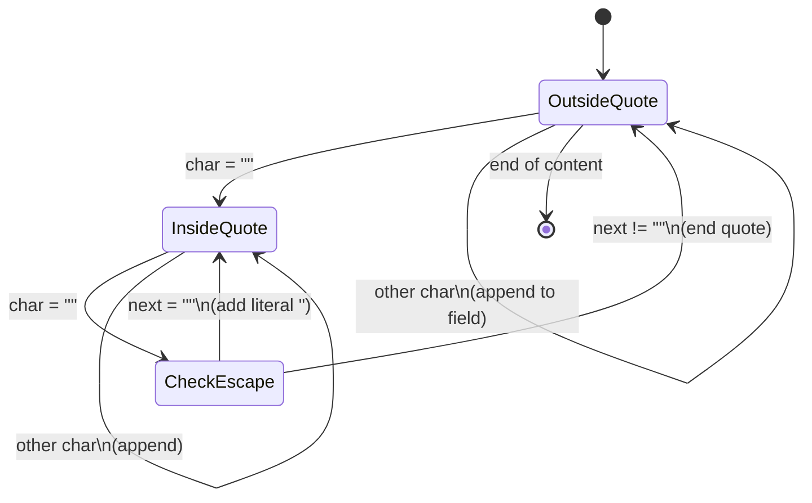
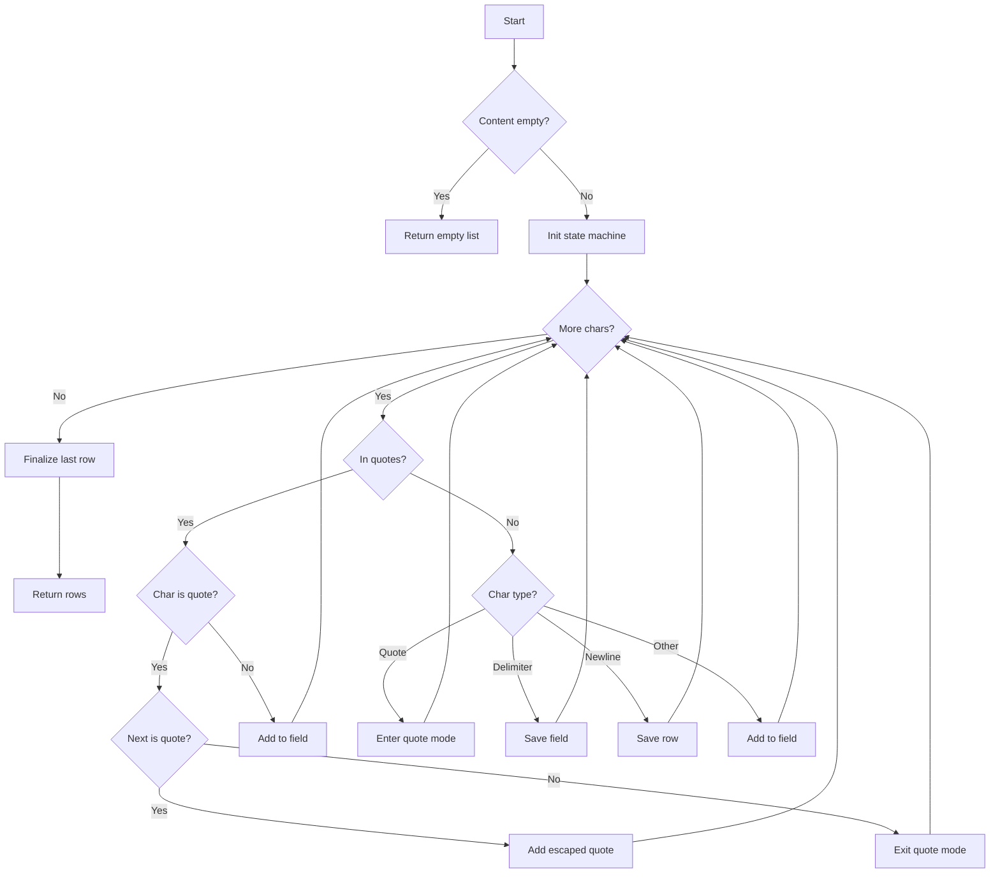

# Exercice C.3.0-a : csv_processor

**Module :**
C.3.0 — Data Formats: CSV Processing

**Concept :**
a — CSV parsing, delimiters, escaping, encoding, TSV conversion

**Difficulte :**
★★★☆☆☆☆☆☆☆ (3/10)

**Type :**
code

**Tiers :**
1 — Concept isole

**Langage :**
Python 3.14

**Prerequis :**
- Manipulation de fichiers en Python
- Listes et dictionnaires
- Boucles et conditions

**Domaines :**
FS, Encodage, Struct

**Duree estimee :**
30 min

**XP Base :**
50

**Complexite :**
T2 O(n) x S2 O(n)

---

## SECTION 1 : PROTOTYPE & CONSIGNE

### 1.1 Obligations

**Fichiers a rendre :**
`csv_processor.py`

**Fonctions autorisees :**
- `open`, `read`, `write`, `close`
- Methodes de string (`split`, `strip`, `join`, `replace`)
- `list`, `dict`, `enumerate`

**Fonctions interdites :**
- Module `csv` (tu dois implementer le parsing toi-meme!)
- Module `pandas`
- `eval`, `exec`

---

### 1.2 Consigne

#### Section Culture : "The Office Spreadsheet Nightmare"

**"That's what she said" — Michael Scott face aux donnees**

Tu connais cette scene de The Office ou Michael Scott essaie de gerer les ventes de Dunder Mifflin avec un tableur Excel? Il clique partout, les colonnes se melangent, les virgules cassent tout...

C'est exactement ca le CSV : un format simple en apparence, mais plein de pieges vicieux. Une virgule dans un nom? Boom. Un guillemet dans une description? Re-boom. Un retour a la ligne dans une cellule? Triple boom.

*"I'm not superstitious, but I am a little stitious... about CSV parsing."*

---

#### Section Academique : Enonce Formel

**Ta mission :**

Implementer un ensemble de fonctions pour parser et manipuler des fichiers CSV (Comma-Separated Values) :

1. **`parse_csv(content: str, delimiter: str = ',') -> list[list[str]]`** : Parse une chaine CSV en liste de lignes
2. **`parse_csv_to_dicts(content: str, delimiter: str = ',') -> list[dict]`** : Parse avec headers comme cles
3. **`csv_to_tsv(content: str) -> str`** : Convertit CSV en TSV (Tab-Separated)
4. **`escape_csv_field(field: str) -> str`** : Echappe un champ correctement
5. **`write_csv(data: list[list[str]], delimiter: str = ',') -> str`** : Genere une chaine CSV

**Entree :**
```python
def parse_csv(content: str, delimiter: str = ',') -> list[list[str]]:
    """
    Parse CSV content into a list of rows.

    Args:
        content: Raw CSV string
        delimiter: Field separator (default: comma)

    Returns:
        List of rows, each row is a list of fields
    """
    pass

def parse_csv_to_dicts(content: str, delimiter: str = ',') -> list[dict]:
    """
    Parse CSV with first row as headers.

    Returns:
        List of dictionaries with header keys
    """
    pass

def csv_to_tsv(content: str) -> str:
    """Convert CSV to TSV format."""
    pass

def escape_csv_field(field: str) -> str:
    """
    Escape a field for CSV output.
    - Wrap in quotes if contains delimiter, quote, or newline
    - Double internal quotes
    """
    pass

def write_csv(data: list[list[str]], delimiter: str = ',') -> str:
    """Generate CSV string from data."""
    pass
```

**Sortie :**
- `parse_csv` retourne une liste de listes de strings
- `parse_csv_to_dicts` retourne une liste de dictionnaires
- `csv_to_tsv` retourne une string TSV
- `escape_csv_field` retourne un champ correctement echappe
- `write_csv` retourne une string CSV valide

**Contraintes :**
- Gerer les champs entre guillemets : `"field with, comma"`
- Gerer les guillemets echappes : `"He said ""Hello"""`
- Gerer les retours a la ligne dans les champs quotes
- Gerer les lignes vides (les ignorer ou les conserver selon contexte)
- Encoding UTF-8

**Exemples :**

| Input | Fonction | Output |
|-------|----------|--------|
| `"a,b,c\n1,2,3"` | `parse_csv` | `[['a','b','c'],['1','2','3']]` |
| `"name,age\nAlice,30"` | `parse_csv_to_dicts` | `[{'name':'Alice','age':'30'}]` |
| `"a,b\n1,2"` | `csv_to_tsv` | `"a\tb\n1\t2"` |
| `'He said "Hi"'` | `escape_csv_field` | `'"He said ""Hi"""'` |
| `"a,b"` | `escape_csv_field` | `'"a,b"'` |

---

### 1.3 Prototype

```python
def parse_csv(content: str, delimiter: str = ',') -> list[list[str]]:
    pass

def parse_csv_to_dicts(content: str, delimiter: str = ',') -> list[dict]:
    pass

def csv_to_tsv(content: str) -> str:
    pass

def escape_csv_field(field: str) -> str:
    pass

def write_csv(data: list[list[str]], delimiter: str = ',') -> str:
    pass
```

---

## SECTION 2 : LE SAVIEZ-VOUS ?

### 2.1 Fun Facts

**Le CSV n'a pas de standard officiel !**

Contrairement a JSON ou XML, le CSV n'a jamais eu de specification formelle jusqu'a RFC 4180 en 2005... et meme cette RFC est juste "informationnelle", pas un vrai standard ! Chaque logiciel fait un peu ce qu'il veut.

**Excel change le delimiter selon la langue !**

En France, Excel utilise le point-virgule (`;`) car la virgule est le separateur decimal. Aux USA, c'est la virgule. Joie du developpement international.

**Le TSV est plus robuste que le CSV**

Les tabs sont rarement dans les donnees textuelles, contrairement aux virgules. C'est pourquoi beaucoup de data scientists preferent le TSV.

---

### 2.5 DANS LA VRAIE VIE

| Metier | Utilisation du concept |
|--------|----------------------|
| **Data Engineer** | Import/export de donnees entre systemes, ETL pipelines |
| **Data Analyst** | Manipulation de datasets, nettoyage de donnees |
| **Backend Developer** | APIs d'export, integration avec systemes legacy |
| **DevOps** | Scripts de migration, logs structures |
| **Business Analyst** | Rapports automatises, integration Excel |

---

## SECTION 3 : EXEMPLE D'UTILISATION

### 3.0 Session bash

```bash
$ ls
csv_processor.py  test_csv.py

$ python test_csv.py
Test parse_csv basic: OK
Test parse_csv quoted: OK
Test parse_csv escaped quotes: OK
Test parse_csv_to_dicts: OK
Test csv_to_tsv: OK
Test escape_csv_field: OK
Test write_csv: OK
Test roundtrip: OK
All tests passed!
```

---

### 3.1 BONUS STANDARD (OPTIONNEL)

**Difficulte Bonus :**
★★★★☆☆☆☆☆☆ (4/10)

**Recompense :**
XP x2

**Time Complexity attendue :**
O(n)

**Space Complexity attendue :**
O(n)

**Domaines Bonus :**
`Encodage`, `FS`

#### 3.1.1 Consigne Bonus

**"Michael Scott's Ultimate CSV Validator"**

Michael veut s'assurer que ses fichiers CSV sont valides avant de les envoyer a Corporate. Implemente un validateur !

**Ta mission bonus :**

Ajouter ces fonctions :

1. **`validate_csv(content: str) -> tuple[bool, list[str]]`** : Valide un CSV et retourne les erreurs
2. **`detect_delimiter(content: str) -> str`** : Detecte automatiquement le delimiter
3. **`convert_encoding(content: bytes, from_enc: str, to_enc: str) -> str`** : Convertit l'encodage

**Contraintes :**
```
Verifications de validation :
- Nombre coherent de colonnes par ligne
- Guillemets correctement fermes
- Pas de caracteres de controle invalides
```

**Exemples :**

| Input | Fonction | Output |
|-------|----------|--------|
| `"a,b\n1,2,3"` | `validate_csv` | `(False, ["Row 2: expected 2 fields, got 3"])` |
| `"a;b\n1;2"` | `detect_delimiter` | `";"` |

#### 3.1.2 Prototype Bonus

```python
def validate_csv(content: str, delimiter: str = ',') -> tuple[bool, list[str]]:
    pass

def detect_delimiter(content: str) -> str:
    pass

def convert_encoding(content: bytes, from_enc: str, to_enc: str) -> str:
    pass
```

#### 3.1.3 Ce qui change par rapport a l'exercice de base

| Aspect | Base | Bonus |
|--------|------|-------|
| Validation | Aucune | Complete avec messages d'erreur |
| Delimiter | Manuel | Auto-detection |
| Encodage | UTF-8 uniquement | Multi-encodage |

---

## SECTION 4 : ZONE CORRECTION (POUR LE TESTEUR)

### 4.1 Moulinette — Tableau des tests

| # | Test | Input | Expected | Points | Categorie |
|---|------|-------|----------|--------|-----------|
| 1 | parse_basic | `"a,b,c"` | `[['a','b','c']]` | 5 | Basic |
| 2 | parse_multiline | `"a,b\n1,2"` | `[['a','b'],['1','2']]` | 5 | Basic |
| 3 | parse_quoted | `'"a,b",c'` | `[['a,b','c']]` | 10 | Quoted |
| 4 | parse_escaped_quote | `'"He said ""Hi"""'` | `[['He said "Hi"']]` | 10 | Escape |
| 5 | parse_newline_in_field | `'"line1\nline2",b'` | `[['line1\nline2','b']]` | 10 | Complex |
| 6 | parse_empty_fields | `"a,,c"` | `[['a','','c']]` | 5 | Edge |
| 7 | parse_semicolon | `"a;b;c"` (delim=`;`) | `[['a','b','c']]` | 5 | Delimiter |
| 8 | to_dicts | `"name,age\nAlice,30"` | `[{'name':'Alice','age':'30'}]` | 10 | Dict |
| 9 | csv_to_tsv | `"a,b\n1,2"` | `"a\tb\n1\t2"` | 10 | Convert |
| 10 | escape_comma | `"a,b"` | `'"a,b"'` | 5 | Escape |
| 11 | escape_quote | `'a"b'` | `'"a""b"'` | 5 | Escape |
| 12 | write_csv | `[['a','b'],['1','2']]` | `"a,b\n1,2"` | 10 | Write |
| 13 | roundtrip | parse(write(data)) == data | True | 10 | Integrity |

**Total : 100 points**

---

### 4.2 test_csv.py

```python
import sys
sys.path.insert(0, '.')
from csv_processor import (
    parse_csv, parse_csv_to_dicts, csv_to_tsv,
    escape_csv_field, write_csv
)

def test_parse_csv_basic():
    result = parse_csv("a,b,c\n1,2,3")
    assert result == [['a','b','c'], ['1','2','3']], f"Got: {result}"
    print("Test parse_csv basic: OK")

def test_parse_csv_quoted():
    result = parse_csv('"a,b",c,d')
    assert result == [['a,b', 'c', 'd']], f"Got: {result}"
    print("Test parse_csv quoted: OK")

def test_parse_csv_escaped_quotes():
    result = parse_csv('"He said ""Hello"""')
    assert result == [['He said "Hello"']], f"Got: {result}"
    print("Test parse_csv escaped quotes: OK")

def test_parse_csv_to_dicts():
    result = parse_csv_to_dicts("name,age\nAlice,30\nBob,25")
    expected = [{'name': 'Alice', 'age': '30'}, {'name': 'Bob', 'age': '25'}]
    assert result == expected, f"Got: {result}"
    print("Test parse_csv_to_dicts: OK")

def test_csv_to_tsv():
    result = csv_to_tsv("a,b,c\n1,2,3")
    assert result == "a\tb\tc\n1\t2\t3", f"Got: {result}"
    print("Test csv_to_tsv: OK")

def test_escape_csv_field():
    assert escape_csv_field("simple") == "simple"
    assert escape_csv_field("a,b") == '"a,b"'
    assert escape_csv_field('a"b') == '"a""b"'
    assert escape_csv_field("a\nb") == '"a\nb"'
    print("Test escape_csv_field: OK")

def test_write_csv():
    data = [['name', 'value'], ['test', '123']]
    result = write_csv(data)
    assert result == "name,value\ntest,123", f"Got: {result}"
    print("Test write_csv: OK")

def test_roundtrip():
    original = [['name', 'desc'], ['Alice', 'She said "Hi"'], ['Bob', 'a,b,c']]
    csv_str = write_csv(original)
    parsed = parse_csv(csv_str)
    assert parsed == original, f"Roundtrip failed: {parsed}"
    print("Test roundtrip: OK")

if __name__ == "__main__":
    test_parse_csv_basic()
    test_parse_csv_quoted()
    test_parse_csv_escaped_quotes()
    test_parse_csv_to_dicts()
    test_csv_to_tsv()
    test_escape_csv_field()
    test_write_csv()
    test_roundtrip()
    print("\nAll tests passed!")
```

---

### 4.3 Solution de reference

```python
def parse_csv(content: str, delimiter: str = ',') -> list[list[str]]:
    """Parse CSV content into list of rows."""
    if not content:
        return []

    rows = []
    current_row = []
    current_field = []
    in_quotes = False
    i = 0

    while i < len(content):
        char = content[i]

        if in_quotes:
            if char == '"':
                # Check for escaped quote
                if i + 1 < len(content) and content[i + 1] == '"':
                    current_field.append('"')
                    i += 1
                else:
                    in_quotes = False
            else:
                current_field.append(char)
        else:
            if char == '"':
                in_quotes = True
            elif char == delimiter:
                current_row.append(''.join(current_field))
                current_field = []
            elif char == '\n':
                current_row.append(''.join(current_field))
                current_field = []
                rows.append(current_row)
                current_row = []
            elif char == '\r':
                # Handle \r\n
                if i + 1 < len(content) and content[i + 1] == '\n':
                    i += 1
                current_row.append(''.join(current_field))
                current_field = []
                rows.append(current_row)
                current_row = []
            else:
                current_field.append(char)
        i += 1

    # Don't forget the last field
    current_row.append(''.join(current_field))
    if current_row != ['']:
        rows.append(current_row)
    elif rows == [] and current_row == ['']:
        pass  # Empty content
    else:
        rows.append(current_row)

    return rows


def parse_csv_to_dicts(content: str, delimiter: str = ',') -> list[dict]:
    """Parse CSV with first row as headers."""
    rows = parse_csv(content, delimiter)
    if len(rows) < 2:
        return []

    headers = rows[0]
    result = []
    for row in rows[1:]:
        row_dict = {}
        for i, header in enumerate(headers):
            row_dict[header] = row[i] if i < len(row) else ''
        result.append(row_dict)
    return result


def csv_to_tsv(content: str) -> str:
    """Convert CSV to TSV format."""
    rows = parse_csv(content, ',')
    tsv_rows = []
    for row in rows:
        # Escape tabs in fields if any
        escaped_row = [field.replace('\t', '\\t') for field in row]
        tsv_rows.append('\t'.join(escaped_row))
    return '\n'.join(tsv_rows)


def escape_csv_field(field: str) -> str:
    """Escape a field for CSV output."""
    needs_quotes = False

    if ',' in field or '"' in field or '\n' in field or '\r' in field:
        needs_quotes = True

    if needs_quotes:
        # Double internal quotes
        escaped = field.replace('"', '""')
        return f'"{escaped}"'
    return field


def write_csv(data: list[list[str]], delimiter: str = ',') -> str:
    """Generate CSV string from data."""
    rows = []
    for row in data:
        escaped_fields = [escape_csv_field(field) for field in row]
        rows.append(delimiter.join(escaped_fields))
    return '\n'.join(rows)
```

---

### 4.4 Solutions alternatives acceptees

**Alternative 1 : Utilisation de regex pour le parsing**

```python
import re

def parse_csv_regex(content: str, delimiter: str = ',') -> list[list[str]]:
    """Alternative using regex pattern."""
    pattern = f'(?:^|{re.escape(delimiter)})("(?:[^"]*(?:""[^"]*)*)"|[^{re.escape(delimiter)}\n]*)'
    # ... parsing logic
    pass
# Accepte si resultat identique
```

**Alternative 2 : Generator-based parsing**

```python
def parse_csv_generator(content: str, delimiter: str = ','):
    """Memory efficient generator version."""
    for row in _parse_rows(content, delimiter):
        yield row
# Accepte - plus efficace en memoire
```

---

### 4.5 Solutions refusees (avec explications)

**Refus 1 : Utilisation du module csv**

```python
# REFUSE : Utilise le module csv interdit !
import csv
from io import StringIO

def parse_csv(content: str, delimiter: str = ','):
    reader = csv.reader(StringIO(content), delimiter=delimiter)
    return list(reader)
```
**Pourquoi refuse :** L'exercice demande d'implementer le parsing manuellement pour comprendre le fonctionnement.

**Refus 2 : Split naif sans gestion des quotes**

```python
# REFUSE : Ne gere pas les champs quotes !
def parse_csv(content: str, delimiter: str = ','):
    return [line.split(delimiter) for line in content.split('\n')]
```
**Pourquoi refuse :** `"a,b",c` donnerait `['"a', 'b"', 'c']` au lieu de `['a,b', 'c']`.

**Refus 3 : Pas de gestion des guillemets echappes**

```python
# REFUSE : Ne gere pas "" dans les champs !
def parse_csv(content: str, delimiter: str = ','):
    # ... code qui ignore ""
    pass
```
**Pourquoi refuse :** `"He said ""Hi"""` doit donner `He said "Hi"`.

---

### 4.6 Solution bonus de reference

```python
def validate_csv(content: str, delimiter: str = ',') -> tuple[bool, list[str]]:
    """Validate CSV and return errors."""
    errors = []
    rows = parse_csv(content, delimiter)

    if not rows:
        return True, []

    expected_cols = len(rows[0])

    for i, row in enumerate(rows, 1):
        if len(row) != expected_cols:
            errors.append(f"Row {i}: expected {expected_cols} fields, got {len(row)}")

    # Check for unclosed quotes
    quote_count = content.count('"')
    if quote_count % 2 != 0:
        errors.append("Unclosed quote detected")

    return len(errors) == 0, errors


def detect_delimiter(content: str) -> str:
    """Auto-detect the delimiter."""
    candidates = [',', ';', '\t', '|']
    scores = {}

    lines = content.split('\n')[:5]  # Check first 5 lines

    for delim in candidates:
        counts = [line.count(delim) for line in lines if line]
        if counts and len(set(counts)) == 1 and counts[0] > 0:
            scores[delim] = counts[0]

    if scores:
        return max(scores, key=scores.get)
    return ','


def convert_encoding(content: bytes, from_enc: str, to_enc: str) -> str:
    """Convert encoding."""
    decoded = content.decode(from_enc)
    return decoded.encode(to_enc).decode(to_enc)
```

---

### 4.7 Solutions alternatives bonus

**Alternative : Detection basee sur heuristiques**

```python
def detect_delimiter_heuristic(content: str) -> str:
    # Analyze first line patterns
    # Accepte si detection correcte
    pass
```

---

### 4.8 Solutions refusees bonus

**Refus : Validation qui retourne seulement bool**

```python
# REFUSE : Doit retourner aussi les erreurs !
def validate_csv(content: str) -> bool:
    return True  # Pas de details
```

---

### 4.9 spec.json (ENGINE v22.1)

```json
{
  "name": "csv_processor",
  "language": "python",
  "language_version": "3.14",
  "type": "code",
  "tier": 1,
  "tier_info": "Concept isole",
  "tags": ["csv", "parsing", "data-formats", "phase0"],
  "passing_score": 70,

  "function": {
    "name": "parse_csv",
    "prototype": "def parse_csv(content: str, delimiter: str = ',') -> list[list[str]]",
    "return_type": "list[list[str]]",
    "parameters": [
      {"name": "content", "type": "str"},
      {"name": "delimiter", "type": "str", "default": ","}
    ]
  },

  "driver": {
    "reference": "def ref_parse_csv(content: str, delimiter: str = ',') -> list[list[str]]: rows = []; current_row = []; current_field = []; in_quotes = False; i = 0; ... return rows",

    "edge_cases": [
      {
        "name": "empty_content",
        "args": [""],
        "expected": [],
        "is_trap": true,
        "trap_explanation": "Empty string should return empty list"
      },
      {
        "name": "quoted_field_with_delimiter",
        "args": ["\"a,b\",c"],
        "expected": [["a,b", "c"]],
        "is_trap": true,
        "trap_explanation": "Delimiter inside quotes must not split"
      },
      {
        "name": "escaped_quotes",
        "args": ["\"He said \"\"Hi\"\"\""],
        "expected": [["He said \"Hi\""]],
        "is_trap": true,
        "trap_explanation": "Double quotes inside quoted field = single quote"
      }
    ],

    "fuzzing": {
      "enabled": true,
      "iterations": 1000,
      "generators": [
        {
          "type": "string",
          "param_index": 0,
          "params": {
            "min_len": 0,
            "max_len": 500,
            "charset": "printable"
          }
        }
      ]
    }
  },

  "norm": {
    "allowed_functions": ["open", "read", "write", "close", "split", "strip", "join", "replace"],
    "forbidden_functions": ["csv", "pandas", "eval", "exec"],
    "check_security": true,
    "check_memory": false,
    "blocking": true
  }
}
```

---

### 4.10 Solutions Mutantes (minimum 5)

**Mutant A (Boundary) : Off-by-one dans le parsing**

```python
# Mutant A (Boundary) : Oublie le dernier champ
def parse_csv(content: str, delimiter: str = ',') -> list[list[str]]:
    rows = []
    current_row = []
    current_field = []
    in_quotes = False

    for char in content:
        if char == delimiter and not in_quotes:
            current_row.append(''.join(current_field))
            current_field = []
        elif char == '\n':
            current_row.append(''.join(current_field))
            rows.append(current_row)
            current_row = []
            current_field = []
        else:
            current_field.append(char)

    # OUBLIE d'ajouter current_field et current_row a la fin !
    return rows

# Pourquoi c'est faux : "a,b,c" retourne [] car aucune fin de ligne
# Ce qui etait pense : "La boucle gere tout"
```

**Mutant B (Safety) : Pas de gestion des quotes**

```python
# Mutant B (Safety) : Split naif
def parse_csv(content: str, delimiter: str = ',') -> list[list[str]]:
    rows = []
    for line in content.split('\n'):
        if line:
            rows.append(line.split(delimiter))  # Ne gere pas les quotes !
    return rows

# Pourquoi c'est faux : "a,b",c devient ['"a', 'b"', 'c']
# Ce qui etait pense : "split suffit"
```

**Mutant C (Resource) : Memory leak avec strings immutables**

```python
# Mutant C (Resource) : Concatenation inefficace
def parse_csv(content: str, delimiter: str = ',') -> list[list[str]]:
    rows = []
    current_field = ""  # String au lieu de liste

    for char in content:
        if char == delimiter:
            # Concatenation O(n) a chaque caractere !
            current_field = current_field + char
        # ...
    return rows

# Pourquoi c'est faux : O(n^2) en memoire, tres lent
# Ce qui etait pense : "String += marche bien"
```

**Mutant D (Logic) : Mauvaise gestion des guillemets echappes**

```python
# Mutant D (Logic) : Ne gere pas ""
def parse_csv(content: str, delimiter: str = ',') -> list[list[str]]:
    # ...
    if in_quotes:
        if char == '"':
            in_quotes = False  # Sort des quotes sans check ""
        else:
            current_field.append(char)
    # ...

# Pourquoi c'est faux : "a""b" donne 'a' au lieu de 'a"b'
# Ce qui etait pense : "Un guillemet ferme toujours"
```

**Mutant E (Return) : Mauvais type de retour**

```python
# Mutant E (Return) : Retourne des tuples au lieu de listes
def parse_csv(content: str, delimiter: str = ',') -> list[list[str]]:
    rows = []
    for line in content.split('\n'):
        rows.append(tuple(line.split(delimiter)))  # Tuple !
    return rows

# Pourquoi c'est faux : Le type de retour doit etre list[list[str]]
# Ce qui etait pense : "tuple et list c'est pareil"
```

---

## SECTION 5 : COMPRENDRE (DOCUMENT DE COURS COMPLET)

### 5.1 Ce que cet exercice enseigne

| Concept | Description | Importance |
|---------|-------------|------------|
| Parsing character par character | Machine a etats pour texte structure | 5/5 |
| Gestion des delimiteurs | Separer les champs correctement | 5/5 |
| Echappement | Caracteres speciaux dans les donnees | 4/5 |
| Encodage | UTF-8 et compatibilite | 3/5 |
| Conversion de formats | CSV vers TSV | 3/5 |

---

### 5.2 LDA — Traduction litterale en MAJUSCULES

```
FONCTION parse_csv QUI RETOURNE UNE LISTE DE LISTES DE CHAINES ET PREND content ET delimiter
DEBUT FONCTION
    DECLARER rows COMME LISTE VIDE
    DECLARER current_row COMME LISTE VIDE
    DECLARER current_field COMME LISTE VIDE
    DECLARER in_quotes COMME BOOLEEN FAUX
    DECLARER i COMME ENTIER VALANT 0

    TANT QUE i EST INFERIEUR A LA LONGUEUR DE content FAIRE
        DECLARER char COMME LE CARACTERE A LA POSITION i DANS content

        SI in_quotes EST VRAI ALORS
            SI char EST EGAL A GUILLEMET ALORS
                SI i PLUS 1 EST INFERIEUR A LONGUEUR DE content ET content[i+1] EST GUILLEMET ALORS
                    AJOUTER GUILLEMET A current_field
                    INCREMENTER i DE 1
                SINON
                    AFFECTER FAUX A in_quotes
                FIN SI
            SINON
                AJOUTER char A current_field
            FIN SI
        SINON
            SI char EST EGAL A GUILLEMET ALORS
                AFFECTER VRAI A in_quotes
            SINON SI char EST EGAL A delimiter ALORS
                AJOUTER LA JOINTURE DE current_field A current_row
                REINITIALISER current_field A LISTE VIDE
            SINON SI char EST EGAL A NOUVELLE LIGNE ALORS
                AJOUTER LA JOINTURE DE current_field A current_row
                AJOUTER current_row A rows
                REINITIALISER current_row ET current_field
            SINON
                AJOUTER char A current_field
            FIN SI
        FIN SI
        INCREMENTER i DE 1
    FIN TANT QUE

    AJOUTER LE DERNIER CHAMP ET LA DERNIERE LIGNE
    RETOURNER rows
FIN FONCTION
```

---

### 5.2.2 Style Academique Francais

```
Algorithme : Analyse syntaxique CSV

Donnees :
    content : chaine de caracteres (contenu CSV brut)
    delimiter : caractere (separateur de champs, defaut ',')

Resultat :
    Liste de lignes, chaque ligne etant une liste de champs

Precondition : content est une chaine valide (peut etre vide)
Postcondition : Retourne une representation structuree du CSV

Debut
    Initialiser rows, current_row, current_field comme listes vides
    Initialiser in_quotes a Faux

    Pour chaque caractere c de content Faire
        Selon l'etat (in_quotes) et le caractere c :
            - Si dans quotes et c = '"' : verifier echappement
            - Si hors quotes et c = '"' : entrer dans quotes
            - Si hors quotes et c = delimiter : nouveau champ
            - Si c = '\n' : nouvelle ligne
            - Sinon : ajouter c au champ courant
    FinPour

    Finaliser la derniere ligne
    Retourner rows
Fin

Complexite :
    Temporelle : O(n) ou n = longueur de content
    Spatiale : O(n) pour stocker le resultat
```

---

### 5.2.2.1 Logic Flow (Structured English)

```
ALGORITHM: CSV Parser State Machine
---

1. INITIALIZE state variables:
   |-- rows = empty list
   |-- current_row = empty list
   |-- current_field = empty list
   |-- in_quotes = False

2. FOR EACH character in content:
   |
   |-- IF in_quotes:
   |     |-- IF char == '"':
   |     |     |-- IF next char == '"':
   |     |     |     ADD '"' to current_field (escaped)
   |     |     |     SKIP next char
   |     |     |-- ELSE:
   |     |           SET in_quotes = False (end quote)
   |     |-- ELSE:
   |           ADD char to current_field
   |
   |-- ELSE (not in quotes):
         |-- IF char == '"':
         |     SET in_quotes = True (start quote)
         |-- ELIF char == delimiter:
         |     FINALIZE current_field -> add to current_row
         |     RESET current_field
         |-- ELIF char == newline:
         |     FINALIZE current_field -> add to current_row
         |     ADD current_row to rows
         |     RESET current_row and current_field
         |-- ELSE:
               ADD char to current_field

3. FINALIZE remaining field and row

4. RETURN rows
```

---

### 5.2.3 Representation Algorithmique avec Garde

```
FONCTION: parse_csv(content, delimiter)
---
INIT result = []

1. GARDE - Contenu vide:
   |-- SI content est vide:
         RETOURNER liste vide (pas d'erreur)

2. MACHINE A ETATS:
   |
   |-- ETAT: OUTSIDE_QUOTE
   |     |-- '"' -> passer a INSIDE_QUOTE
   |     |-- delimiter -> sauver champ, nouveau champ
   |     |-- '\n' -> sauver ligne, nouvelle ligne
   |     |-- autre -> ajouter au champ
   |
   |-- ETAT: INSIDE_QUOTE
         |-- '""' -> ajouter '"' (echappe)
         |-- '"' seul -> passer a OUTSIDE_QUOTE
         |-- autre -> ajouter au champ (meme '\n')

3. RETOURNER result
```

---

### 5.2.3.1 Diagramme Mermaid





---

### 5.3 Visualisation ASCII

**Machine a etats du parser CSV :**

```
                    OUTSIDE QUOTE                    INSIDE QUOTE
                   +-------------+                  +-------------+
                   |             |      '"'         |             |
            ------>|  NORMAL     |----------------->|   QUOTED    |
           (start) |   MODE      |                  |    MODE     |
                   |             |<-----------------|             |
                   +------+------+     '"' seul     +------+------+
                          |                                |
                          v                                v
                   delimiter: save field           any char: append
                   '\n': save row                  '""': add literal "
```

**Exemple de parsing : `"a,b",c,d`**

```
Input:  "  a  ,  b  "  ,  c  ,  d
        0  1  2  3  4  5  6  7  8  9
State:  Q  Q  Q  Q  Q  O  O  O  O  O
        |  |  |  |  |  |  |  |  |  |
        v  v  v  v  v  v  v  v  v  v
       [Enter][a][,][b][Exit][,][c][,][d]
              └──┬──┘
            field: "a,b"    field: "c"   field: "d"

Result: [["a,b", "c", "d"]]
```

**Guillemets echappes : `"He said ""Hi"""`**

```
Input:  "  H  e     s  a  i  d     "  "  H  i  "  "  "
        0  1  2  3  4  5  6  7  8  9  10 11 12 13 14 15
State:  Q  Q  Q  Q  Q  Q  Q  Q  Q  Q  Q  Q  Q  Q  Q  O
        |                          |   |      |   |
        v                          v   v      v   v
       [Enter]                   [""="][""="][Exit]

field: "He said "Hi""

Result: [["He said \"Hi\""]]
```

---

### 5.4 Les pieges en detail

#### Piege 1 : Split naif sur le delimiter

```python
# FAUX : Ne gere pas les quotes
def parse_csv(content):
    return [line.split(',') for line in content.split('\n')]

# Input: '"a,b",c'
# Attendu: [['a,b', 'c']]
# Obtenu: [['"a', 'b"', 'c']]  # FAUX !
```

#### Piege 2 : Oublier le dernier champ

```python
# FAUX : Ne traite pas la fin du fichier
for char in content:
    if char == '\n':
        rows.append(current_row)
        current_row = []
# Si le fichier ne finit pas par \n, la derniere ligne est perdue !
```

#### Piege 3 : Mauvaise gestion de \\r\\n

```python
# FAUX : Cree des lignes vides
for char in content:
    if char == '\n' or char == '\r':
        rows.append(current_row)
# "a,b\r\n1,2" cree une ligne vide entre chaque ligne !
```

#### Piege 4 : Pas de gestion des guillemets echappes

```python
# FAUX : Un guillemet ferme toujours
if char == '"':
    in_quotes = not in_quotes
# "He said ""Hi""" devient "He said " au lieu de "He said "Hi""
```

---

### 5.5 Cours Complet

#### 5.5.1 Le format CSV

CSV (Comma-Separated Values) est un format texte pour representer des donnees tabulaires. Chaque ligne est un enregistrement, chaque champ est separe par un delimiter (generalement la virgule).

**Structure basique :**
```
header1,header2,header3
value1,value2,value3
value4,value5,value6
```

#### 5.5.2 Les regles RFC 4180

La RFC 4180 definit (informellement) les regles du CSV :

1. Chaque ligne se termine par CRLF (\\r\\n) ou LF (\\n)
2. La premiere ligne peut etre un header
3. Chaque ligne a le meme nombre de champs
4. Les champs contenant delimiter, newline ou quote doivent etre entoures de guillemets doubles
5. Les guillemets dans un champ quote doivent etre echappes par un autre guillemet ("")

#### 5.5.3 Machine a etats pour le parsing

Le parsing CSV se fait naturellement avec une machine a etats :

| Etat | Caractere | Action | Nouvel etat |
|------|-----------|--------|-------------|
| Normal | `"` | Debut quote | Quoted |
| Normal | delimiter | Sauver champ | Normal |
| Normal | `\n` | Sauver ligne | Normal |
| Normal | autre | Ajouter au champ | Normal |
| Quoted | `"` | Verifier echappement | Check |
| Quoted | autre | Ajouter au champ | Quoted |
| Check | `"` | Ajouter `"` literal | Quoted |
| Check | autre | Fin quote, retraiter | Normal |

#### 5.5.4 Differences CSV vs TSV

| Aspect | CSV | TSV |
|--------|-----|-----|
| Delimiter | Virgule (`,`) | Tab (`\t`) |
| Echappement | Guillemets doubles | Rare (tabs rares dans texte) |
| Lisibilite | Variable | Alignement naturel |
| Excel | Support natif | Import necessaire |

---

### 5.6 Normes avec explications pedagogiques

```
+----------------------------------------------------------------+
| HORS NORME (compile, mais interdit)                             |
+----------------------------------------------------------------+
| for line in content.split('\n'):                               |
|     row = line.split(',')                                       |
+----------------------------------------------------------------+
| CONFORME                                                        |
+----------------------------------------------------------------+
| rows = []                                                       |
| for line in content.split('\n'):                               |
|     if line:                                                    |
|         row = parse_line(line)  # Avec gestion quotes           |
|         rows.append(row)                                        |
+----------------------------------------------------------------+
| POURQUOI ?                                                      |
|                                                                 |
| - Robustesse : Le split naif ne gere pas les cas speciaux       |
| - Correction : Les champs quotes cassent avec split simple       |
| - Completude : Il faut une vraie machine a etats                |
+----------------------------------------------------------------+
```

---

### 5.7 Simulation avec trace d'execution

**Parsing de `name,desc\n"Alice","a,b"`**

```
+-------+--------+----------+------------+------------+---------+
| Etape | Char   | in_quote | curr_field | curr_row   | rows    |
+-------+--------+----------+------------+------------+---------+
|   1   | 'n'    | False    | ['n']      | []         | []      |
|   2   | 'a'    | False    | ['n','a']  | []         | []      |
|   3   | 'm'    | False    | ['n','a','m']| []       | []      |
|   4   | 'e'    | False    | ['name']   | []         | []      |
|   5   | ','    | False    | []         | ['name']   | []      |
|   6   | 'd'    | False    | ['d']      | ['name']   | []      |
|   7   | 'e'    | False    | ['d','e']  | ['name']   | []      |
|   8   | 's'    | False    | ['d','e','s']| ['name'] | []      |
|   9   | 'c'    | False    | ['desc']   | ['name']   | []      |
|  10   | '\n'   | False    | []         | []         | [['name','desc']] |
|  11   | '"'    | True     | []         | []         | ...     |
|  12   | 'A'    | True     | ['A']      | []         | ...     |
|  ...  | ...    | ...      | ...        | ...        | ...     |
|  18   | '"'    | False    | []         | ['Alice']  | ...     |
|  19   | ','    | False    | []         | ['Alice']  | ...     |
|  20   | '"'    | True     | []         | ['Alice']  | ...     |
|  21   | 'a'    | True     | ['a']      | ['Alice']  | ...     |
|  22   | ','    | True     | ['a',',']  | ['Alice']  | ...     |
|  23   | 'b'    | True     | ['a,b']    | ['Alice']  | ...     |
|  24   | '"'    | False    | []         | ['Alice','a,b'] | ... |
| FIN   | -      | -        | -          | -          | [['name','desc'],['Alice','a,b']] |
+-------+--------+----------+------------+------------+---------+
```

---

### 5.8 Mnemotechniques (MEME obligatoire)

#### MEME : "Michael Scott's CSV Meeting"

```
Michael: "I need to add a comma to this name field!"
Dwight:  "MICHAEL NO! Use quotes!"
Michael: "What quotes?"
Dwight:  "DOUBLE QUOTES AROUND THE FIELD!"
Michael: "But what if I need a quote IN the name?"
Dwight:  *sigh* "DOUBLE THE QUOTE. Two quotes equal one."

Michael: ""Jim said ""That's what she said"""
Result:  Jim said "That's what she said"
```

**La regle des 3 Q :**
- **Q**uand tu vois une virgule dans une donnee -> **Q**uote le champ
- **Q**uand tu vois un quote dans une donnee -> **Q**uadruple (double) le quote
- **Q**uand tu parses -> **Q**uestionne chaque caractere (machine a etats)

---

#### MEME : "The Office Printer Jam"

```
CSV parsing is like the office printer:

- Works fine 90% of the time
- Jams on special characters
- Nobody knows how to fix it properly
- Everyone just restarts and hopes for the best

DON'T BE KEVIN MALONE - handle your edge cases!
```

---

### 5.9 Applications pratiques

| Application | Utilisation |
|-------------|-------------|
| **Excel/Sheets** | Export/import de donnees |
| **Databases** | Migration de donnees, bulk import |
| **Data Science** | Datasets, preprocessing |
| **Logs** | Structured logging, analysis |
| **APIs** | Download endpoints, reports |

**Exemple concret : Pipeline ETL**

```python
# Extract
raw_data = download_csv_from_api()

# Transform
rows = parse_csv(raw_data)
headers = rows[0]
data = [{h: v for h, v in zip(headers, row)} for row in rows[1:]]

# Load
for record in data:
    database.insert(record)
```

---

## SECTION 6 : PIEGES RECAPITULATIF

| # | Piege | Consequence | Solution |
|---|-------|-------------|----------|
| 1 | Split naif | Champs quotes casses | Machine a etats |
| 2 | Oublier fin fichier | Derniere ligne perdue | Traiter apres boucle |
| 3 | \\r\\n mal gere | Lignes vides | Skip \\r avant \\n |
| 4 | Quotes echappes ignores | Donnees tronquees | Check "" |
| 5 | Encoding ignore | Caracteres casses | Decode UTF-8 |

---

## SECTION 7 : QCM

### Question 1 (2 points)
Quel est le resultat de parser `"a,b",c` ?

- A) `[['a,b', 'c']]`
- B) `[['"a', 'b"', 'c']]`
- C) `[['a', 'b', 'c']]`
- D) Erreur de parsing
- E) `[['a,b,c']]`

**Reponse : A** — Les guillemets protegent la virgule interieure.

### Question 2 (2 points)
Comment echapper un guillemet dans un champ CSV ?

- A) `\"`
- B) `""`
- C) `\'`
- D) `&quot;`
- E) Impossible

**Reponse : B** — En CSV, on double le guillemet : `""` = `"` literal.

### Question 3 (3 points)
Quel est le principal avantage du TSV sur le CSV ?

- A) Plus compact
- B) Support natif Excel
- C) Tabs rares dans les donnees = moins d'echappement
- D) Standard plus ancien
- E) Meilleure performance

**Reponse : C** — Les tabs sont rarement dans le texte, donc moins de quotes.

### Question 4 (3 points)
Que doit retourner `parse_csv("")` ?

- A) `[['']]`
- B) `[]`
- C) `None`
- D) Erreur
- E) `[[]]`

**Reponse : B** — Contenu vide = liste vide, pas de lignes.

---

## SECTION 8 : RECAPITULATIF

| Critere | Valeur |
|---------|--------|
| **ID** | C.3.0-a |
| **Nom** | csv_processor |
| **Difficulte** | 3/10 |
| **Duree** | 30 min |
| **XP Base** | 50 |
| **XP Bonus** | x2 = 100 |
| **Langage** | Python 3.14 |
| **Concepts cles** | Parsing, machine a etats, echappement |

---

## SECTION 9 : DEPLOYMENT PACK

```json
{
  "deploy": {
    "hackbrain_version": "5.5.2",
    "engine_version": "v22.1",
    "exercise_slug": "C.3.0-a-csv_processor",
    "generated_at": "2026-01-16 12:00:00",

    "metadata": {
      "exercise_id": "C.3.0-a",
      "exercise_name": "csv_processor",
      "module": "C.3.0",
      "module_name": "Data Formats",
      "concept": "a",
      "concept_name": "CSV Processing",
      "type": "code",
      "tier": 1,
      "tier_info": "Concept isole",
      "phase": 0,
      "difficulty": 3,
      "difficulty_stars": "3/10",
      "language": "python",
      "language_version": "3.14",
      "duration_minutes": 30,
      "xp_base": 50,
      "xp_bonus_multiplier": 2,
      "bonus_tier": "STANDARD",
      "bonus_icon": "z",
      "complexity_time": "T2 O(n)",
      "complexity_space": "S2 O(n)",
      "prerequisites": ["files", "lists", "loops"],
      "domains": ["FS", "Encodage", "Struct"],
      "tags": ["csv", "parsing", "data-formats"]
    },

    "files": {
      "spec.json": "/* Section 4.9 */",
      "references/ref_solution.py": "/* Section 4.3 */",
      "tests/test_csv.py": "/* Section 4.2 */",
      "mutants/mutant_a_boundary.py": "/* Section 4.10 */",
      "mutants/mutant_b_safety.py": "/* Section 4.10 */",
      "mutants/mutant_c_resource.py": "/* Section 4.10 */",
      "mutants/mutant_d_logic.py": "/* Section 4.10 */",
      "mutants/mutant_e_return.py": "/* Section 4.10 */"
    }
  }
}
```

---

*Document genere selon HACKBRAIN v5.5.2 — L'excellence pedagogique ne se negocie pas*
